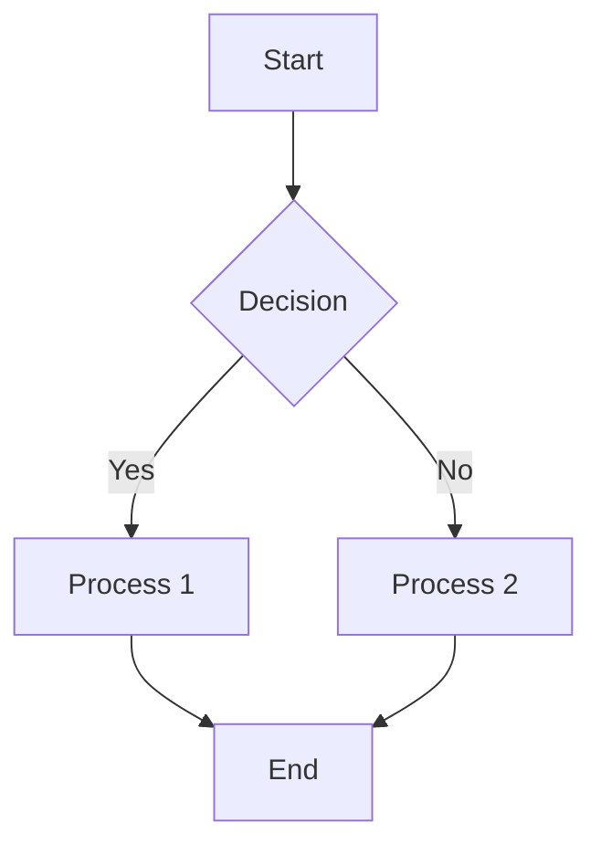

# Visual Enhancement Implementation Guide

This guide provides practical instructions for implementing the visual enhancements across all documentation (2025).

## Completed Examples

### 1. Enhanced Physics Documentation
- ✅ **quantum-mechanics.md** - Full template with references, images, code examples
- ✅ **classical-mechanics.md** - Newton's laws, conservation principles, projectile motion
- ✅ **thermodynamics.md** - Mermaid diagrams, P-V visualizations, Carnot engine simulation

### 2. Interactive Visualizations Created
- ✅ **manim_physics_animation.py** - Beautiful 3Blue1Brown-style animations
  - Simple Harmonic Motion
  - Wave Interference
  - Pendulum Phase Space
- ✅ **interactive_d3_physics.html** - Interactive web visualizations
  - Double Pendulum (chaos theory)
  - Wave Interference Pattern
  - Gravitational Orbits
- ✅ **tabbed_content_example.html** - Multi-language code examples and platform-specific content

### 3. Visual Elements Implemented
- ✅ Reference boxes with icons
- ✅ Mermaid.js flowcharts and diagrams
- ✅ Expand/collapse sections with `<details>` tags
- ✅ Python code examples with expected outputs
- ✅ Floating and centered image layouts

## Implementation Templates

### 1. Reference Boxes
```html
<!-- Papers -->
<p class="referenceBoxes type3">
  
  <a href="[URL]"> Paper: <b><i>[Title]</i></b> - [Author]</a>
</p>

<!-- Videos -->
<p class="referenceBoxes type3">
  
  <a href="[URL]"> Video: <b><i>[Title]</i></b></a>
</p>

<!-- GitHub -->
<p class="referenceBoxes type3">
  
  <a href="[URL]"> Code: <b><i>[Repository Name]</i></b></a>
</p>
```

### 2. Mermaid Diagrams
```markdown
<details>
<summary><b>Click to view: Process Flow Diagram</b></summary>
<br>



</details>
```

### 3. Image Layouts
```html
<!-- Centered Image with Caption -->
<center>
<a href="https://andrewaltimit.github.io/Documentation/images/[category]/[filename]">

</a>
<br>
<p class="referenceBoxes type2">
<a href="[source-url]">
 
Article: <b><i>[Caption]</i></b></a>
</p>
</center>

<!-- Floating Image -->
<a href="[image-url]">

</a>
```

### 4. Code Examples with Output
```markdown
### Example: [Description]

```python
# Your code here
import numpy as np
import matplotlib.pyplot as plt

# Implementation
def example_function():
    pass
```

<details>
<summary><b>Expected Output</b></summary>
<br>
Description of what the code produces:
<ul>
<li>Output characteristic 1</li>
<li>Output characteristic 2</li>
</ul>
</details>
```

### 5. Expandable Sections
```html
<details>
<summary><b>Advanced Topic: [Title]</b></summary>
<br>
<div style="background-color: #f0f0f0; padding: 20px; border-radius: 5px;">
<p>Detailed explanation here...</p>
<ul>
<li>Point 1</li>
<li>Point 2</li>
</ul>
</div>
</details>
```

## How to Use the Examples

### 1. Manim Animations
```bash
# Install Manim
pip install manim

# Generate animations
manim -pql examples/manim_physics_animation.py SimpleHarmonicMotion
manim -pqh examples/manim_physics_animation.py WaveInterference

# Output: MP4 video files in media/videos/
```

### 2. D3.js Interactive Visualizations
1. Open `examples/interactive_d3_physics.html` in a web browser
2. Can be embedded in documentation using iframes:
```html
<iframe src="interactive_d3_physics.html" width="100%" height="600px"></iframe>
```

### 3. Tabbed Content
1. Copy the CSS and JavaScript from `examples/tabbed_content_example.html`
2. Adapt the HTML structure for your content
3. Particularly useful for:
   - Multi-language code examples
   - Platform-specific instructions
   - Different algorithmic approaches

## Remaining Implementation Tasks

### High Priority Physics Docs
1. **statistical-mechanics.md**
   - Ensemble diagrams
   - Boltzmann distribution visualization
   - Ising model animation

2. **relativity.md**
   - Spacetime diagrams
   - Time dilation visualization
   - Lorentz transformation

3. **condensed-matter.md**
   - Crystal structure diagrams
   - Band structure plots
   - Phase transition animations

4. **string-theory.md**
   - String vibration modes
   - Calabi-Yau manifolds
   - D-brane illustrations

### Technology Documentation
1. **docker.md**
   - Container vs VM architecture
   - Dockerfile layer visualization
   - Docker compose diagrams

2. **kubernetes.md**
   - Cluster architecture
   - Pod lifecycle
   - Service mesh visualization

3. **terraform.md**
   - Infrastructure as Code workflow
   - State management diagram
   - Module dependencies

## Best Practices

### 1. Consistency
- Use the same visual style across all documents
- Maintain consistent image sizes (80% for centered, 350px for floating)
- Use the same reference box types for similar content

### 2. Performance
- Optimize images before uploading (use WebP or compressed PNG)
- Lazy load images where possible
- Keep animations under 5MB

### 3. Accessibility
- Always include alt text for images
- Provide text descriptions for complex diagrams
- Ensure color contrast meets WCAG standards

### 4. Mobile Responsiveness
- Test all visualizations on mobile devices
- Use responsive widths (percentages instead of fixed pixels where appropriate)
- Consider simplified versions for small screens

## Tools and Resources

### Diagram Creation
- **Diagrams.net (draw.io)** - General diagrams
- **Excalidraw** - Hand-drawn style diagrams
- **Inkscape** - Vector graphics
- **Matplotlib/Seaborn** - Scientific plots

### Animation Tools
- **Manim** - Mathematical animations
- **After Effects** - Complex animations
- **Blender** - 3D visualizations

### Interactive Elements
- **D3.js** - Data-driven visualizations
- **Three.js** - 3D graphics
- **P5.js** - Creative coding
- **Plotly** - Interactive charts

## Quick Start Checklist

For each document enhancement:
- [ ] Add styled header with tagline
- [ ] Create comprehensive table of contents
- [ ] Add reference boxes for key papers/resources
- [ ] Include at least one diagram or visualization
- [ ] Add code examples with expected outputs
- [ ] Implement expand/collapse for complex topics
- [ ] Include "Essential Resources" section at end
- [ ] Test all interactive elements
- [ ] Verify mobile responsiveness
- [ ] Check all external links

## Next Steps

1. Continue applying template to remaining physics documents
2. Begin technology documentation enhancements
3. Create actual diagrams to replace placeholders
4. Set up image hosting structure on GitHub Pages
5. Test all interactive elements across browsers

---
*Last updated: July 2025*