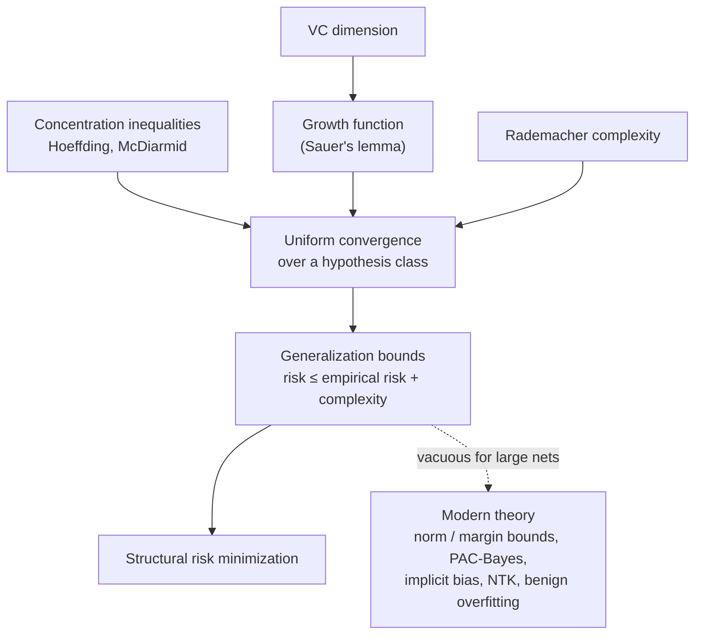
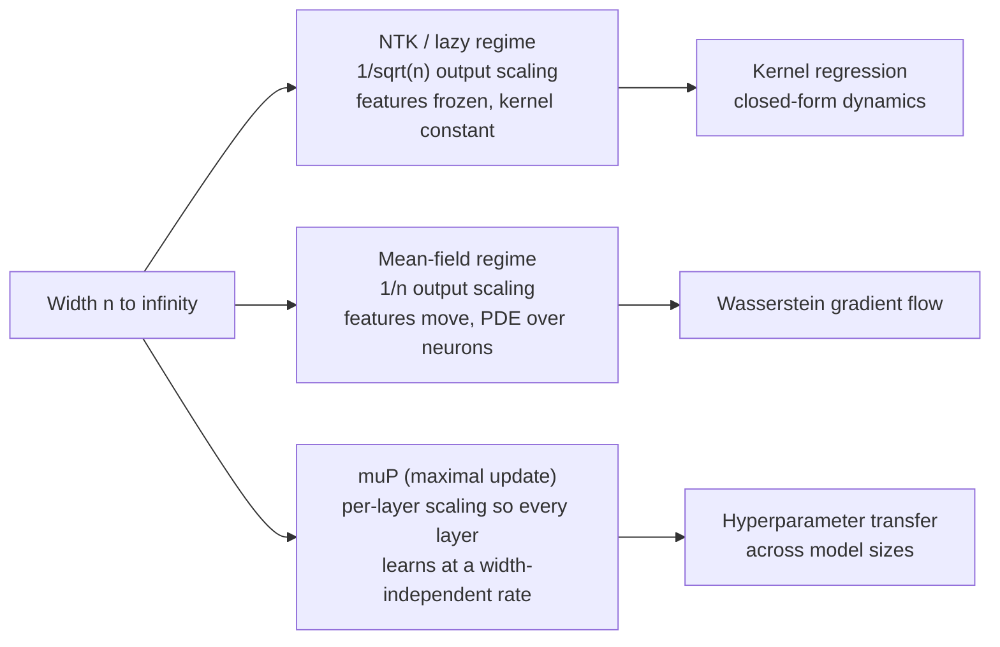

# Advanced AI Mathematics

[Advanced Topics](../) &raquo; Advanced AI Mathematics

**Graduate-level reference.** Proof-oriented treatment for ML researchers and theorists. **Prerequisites:** probability (concentration, conditional expectation), real analysis, linear algebra, and some functional analysis for the kernel sections. For an intuitive, code-first introduction start with [AI Fundamentals](../../technology/ai/) or the [Artificial Intelligence Hub](../../artificial-intelligence/); for the applied version of these ideas see [Deep Learning Theory](../../technology/ai/deep-learning-theory.html).

This page collects the mathematics that explains **when learning from finite data generalizes, why gradient methods train non-convex networks, and what limits constrain any learner**. It covers classical statistical learning theory (PAC learning, VC dimension, Rademacher complexity), optimization theory for deep networks, information-theoretic generalization bounds (PAC-Bayes, MDL), kernel methods and the infinite-width limits of neural networks, empirical scaling laws, and the phenomena that classical theory does not yet explain (double descent, benign overfitting, grokking, in-context learning).

A useful map of the material: the classical results form a dependency chain from concentration of measure to generalization bounds, while the modern results mostly explain why that chain's *pessimistic* capacity measures (parameter count, VC dimension of the whole network) are the wrong ones for over-parameterized models.

## Notation

| Symbol | Meaning |
|---|---|
| $\mathcal{D}$ | Unknown data distribution over $\mathcal{X} \times \mathcal{Y}$ |
| $S = ((x_1,y_1),\dots,(x_m,y_m)) \sim \mathcal{D}^m$ | Training sample of size $m$ |
| $\mathcal{H}$ | Hypothesis class; $\mathcal{F}$ a class of real-valued functions |
| $\mathcal{L}_{\mathcal{D}}(h) = \mathbb{E}_{(x,y)\sim\mathcal{D}}\,\ell(h(x),y)$ | True (population) risk |
| $\hat{\mathcal{L}}_S(h) = \frac1m\sum_i \ell(h(x_i),y_i)$ | Empirical risk |
| $\epsilon,\ \delta$ | Accuracy and failure probability |
| $d = \mathrm{VC}(\mathcal{H})$ | VC dimension |

Unless stated otherwise, losses are bounded in $[0,1]$ (the 0-1 loss for classification).

## Computational Learning Theory

### PAC learning

"Probably Approximately Correct" learning (Valiant, 1984) makes the goal *learn a good rule from enough examples, most of the time* precise: "approximately correct" is an error tolerance $\epsilon$, "probably" a confidence $1-\delta$, and the guarantee must hold for **every** data distribution.

#### Definition (PAC and agnostic PAC learnability)
$\mathcal{H}$ is **agnostic PAC-learnable** if there is a function $m_{\mathcal{H}}(\epsilon,\delta)$ and an algorithm $A$ such that for every $\epsilon,\delta \in (0,1)$ and every distribution $\mathcal{D}$, given $m \geq m_{\mathcal{H}}(\epsilon,\delta)$ i.i.d. samples,

$$\Pr_{S \sim \mathcal{D}^m}\left[\mathcal{L}_{\mathcal{D}}(A(S)) \leq \min_{h \in \mathcal{H}} \mathcal{L}_{\mathcal{D}}(h) + \epsilon\right] \geq 1 - \delta.$$

The **realizable** case adds the assumption that some $h^{\star} \in \mathcal{H}$ has zero risk. Valiant's original definition also requires $A$ to run in time polynomial in $1/\epsilon$, $1/\delta$, and the instance size; the purely statistical version above drops that requirement.

The distinction matters: statistically learnable classes can still be computationally hard to learn. For example, properly learning 3-term DNF is NP-hard, and under standard cryptographic assumptions small-depth circuits and intersections of halfspaces are not efficiently PAC-learnable at all.

### VC dimension

#### Definition (shattering, VC dimension)
A set $C = \{x_1,\dots,x_k\} \subseteq \mathcal{X}$ is **shattered** by $\mathcal{H}$ if $\mathcal{H}$ realizes all $2^k$ labelings of $C$. The **VC dimension** is the size of the largest shattered set:

$$\mathrm{VC}(\mathcal{H}) = \max\{\, \lvert C\rvert : C \subseteq \mathcal{X},\ \lvert \mathcal{H}_C\rvert = 2^{\lvert C\rvert} \,\}, \qquad \mathcal{H}_C = \{ h|_C : h \in \mathcal{H}\}.$$

| Class | VC dimension |
|---|---|
| Thresholds $x \mapsto \mathbb{1}[x \geq t]$ on $\mathbb{R}$ | 1 |
| Intervals $[a,b]$ on $\mathbb{R}$ | 2 |
| Axis-aligned rectangles in $\mathbb{R}^2$ | 4 |
| Halfspaces (affine) in $\mathbb{R}^n$ | $n+1$ |
| $\{x \mapsto \mathrm{sign}(\sin(\omega x))\}$ | $\infty$ (one parameter, infinite capacity) |
| ReLU networks with $W$ weights and $L$ layers | $O(WL\log W)$, nearly tight (Bartlett, Harvey, Liaw & Mehrabian, 2019) |

**Example (thresholds).** One point can be labeled either way, so $\mathrm{VC} \geq 1$. For two points $x_1 < x_2$ the labeling $(1,0)$ is impossible: any threshold that accepts $x_1$ accepts $x_2$. So $\mathrm{VC} = 1$. The last two rows make the key point: capacity is not the parameter count.

**Sauer–Shelah lemma.** The *growth function* $\Pi_{\mathcal{H}}(m) = \max_{\lvert C\rvert = m} \lvert \mathcal{H}_C\rvert$ is either $2^m$ for all $m$ or, if $\mathrm{VC}(\mathcal{H}) = d < \infty$, bounded polynomially:

$$\Pi_{\mathcal{H}}(m) \leq \sum_{i=0}^{d}\binom{m}{i} \leq \left(\frac{em}{d}\right)^{d} \quad (m \geq d).$$

This polynomial-versus-exponential dichotomy is what makes finite VC dimension sufficient for uniform convergence.

### The fundamental theorem of statistical learning

#### Theorem (Fundamental theorem, binary classification with 0-1 loss)
The following are equivalent: (1) $\mathcal{H}$ has the uniform convergence property; (2) empirical risk minimization is an agnostic PAC learner for $\mathcal{H}$; (3) $\mathcal{H}$ is agnostic PAC-learnable; (4) $\mathcal{H}$ is PAC-learnable; (5) $\mathrm{VC}(\mathcal{H}) < \infty$. When $\mathrm{VC}(\mathcal{H}) = d$ the optimal sample complexities are

$$m_{\text{realizable}}(\epsilon,\delta) = \Theta\!\left(\frac{d + \log(1/\delta)}{\epsilon}\right), \qquad m_{\text{agnostic}}(\epsilon,\delta) = \Theta\!\left(\frac{d + \log(1/\delta)}{\epsilon^{2}}\right).$$

The realizable rate is $1/\epsilon$ and the agnostic rate is $1/\epsilon^2$: with label noise, halving the excess error costs four times the data. ERM attains the agnostic rate and attains the realizable rate up to a $\log(1/\epsilon)$ factor; Hanneke (2016) gave an algorithm that removes that factor. The lower bounds come from no-free-lunch constructions on a shattered set; the upper bounds from symmetrization, Sauer's lemma, and a union bound over the (polynomially many) behaviours on a double sample.

The equivalence is specific to binary classification. For multiclass classification with unbounded label sets, finite Natarajan dimension is not sufficient; the right quantity is the **DS dimension** (Brukhim, Carmon, Dinur, Moran, Yehudayoff, 2022), and ERM can fail even for learnable classes.

### Rademacher complexity

VC dimension is distribution-free and purely combinatorial. Rademacher complexity measures how well a class can correlate with random noise *on the actual data*, and extends to real-valued losses.

$$\hat{\mathcal{R}}_S(\mathcal{F}) = \mathbb{E}_{\sigma}\left[\sup_{f \in \mathcal{F}} \frac{1}{m}\sum_{i=1}^{m} \sigma_i f(z_i)\right], \qquad \mathcal{R}_m(\mathcal{F}) = \mathbb{E}_{S\sim\mathcal{D}^m}\,\hat{\mathcal{R}}_S(\mathcal{F}),$$

where the $\sigma_i$ are i.i.d. uniform on $\{-1,+1\}$.

#### Theorem (Rademacher generalization bound)
Let $\mathcal{F}$ be a class of functions $\mathcal{Z} \to [0,1]$ (typically a loss composed with hypotheses). For any $\delta > 0$, with probability at least $1-\delta$ over $S \sim \mathcal{D}^m$, simultaneously for all $f \in \mathcal{F}$,

$$\mathbb{E}[f(z)] \leq \frac{1}{m}\sum_{i=1}^{m} f(z_i) + 2\mathcal{R}_m(\mathcal{F}) + \sqrt{\frac{\log(1/\delta)}{2m}}.$$

The same holds with $2\hat{\mathcal{R}}_S(\mathcal{F})$ in place of $2\mathcal{R}_m(\mathcal{F})$ if the last term is replaced by $3\sqrt{\log(2/\delta)/(2m)}$.

The proof is two steps: McDiarmid's inequality concentrates the supremum of the generalization gap around its mean, and symmetrization bounds that mean by $2\mathcal{R}_m$. For linear predictors $\{x \mapsto \langle w,x\rangle : \lVert w\rVert_2 \leq B\}$ on data with $\lVert x\rVert_2 \leq R$, $\hat{\mathcal{R}}_S \leq BR/\sqrt{m}$, independent of the ambient dimension. Combined with the Lipschitz contraction lemma this yields **margin bounds**, the classical explanation of why large-margin classifiers (SVMs, boosting) generalize.

## Statistical Learning Theory

### Empirical risk minimization and uniform convergence

ERM returns $\hat h = \arg\min_{h\in\mathcal{H}} \hat{\mathcal{L}}_S(h)$. If $\hat{\mathcal{L}}_S$ is uniformly close to $\mathcal{L}_{\mathcal{D}}$ over all of $\mathcal{H}$, ERM is near-optimal, because

$$\mathcal{L}_{\mathcal{D}}(\hat h) - \min_{h\in\mathcal{H}}\mathcal{L}_{\mathcal{D}}(h) \leq 2\sup_{h\in\mathcal{H}}\left\lvert \mathcal{L}_{\mathcal{D}}(h) - \hat{\mathcal{L}}_S(h)\right\rvert.$$

For a class with VC dimension $d$ and 0-1 loss, bounding the Rademacher complexity through Sauer's lemma gives, with probability at least $1-\delta$, for all $h \in \mathcal{H}$ (Mohri, Rostamizadeh & Talwalkar, Cor. 3.19):

$$\mathcal{L}_{\mathcal{D}}(h) \leq \hat{\mathcal{L}}_S(h) + \sqrt{\frac{2d\log(em/d)}{m}} + \sqrt{\frac{\log(1/\delta)}{2m}}.$$

### Structural risk minimization

When $\mathcal{H}$ is too rich, stratify it as $\mathcal{H}_1 \subset \mathcal{H}_2 \subset \cdots$ with increasing complexity and choose the level by minimizing a bound rather than the empirical risk alone. Assigning confidence $\delta_k = \delta\, w_k$ with $\sum_k w_k \leq 1$ to level $k$ and taking a union bound gives, simultaneously for all $k$ and $h \in \mathcal{H}_k$,

$$\mathcal{L}_{\mathcal{D}}(h) \leq \hat{\mathcal{L}}_S(h) + \varepsilon_k\!\left(m, \delta w_k\right),$$

where $\varepsilon_k$ is the uniform-convergence bound for $\mathcal{H}_k$. SRM returns the $h$ minimizing the right-hand side. Regularized ERM, $\min_h \hat{\mathcal{L}}_S(h) + \lambda\,\Omega(h)$, is the practical surrogate, with the penalty $\Omega$ (a norm, a description length) standing in for the complexity index.

### Why parameter counting fails for deep networks

The VC dimension of a network scales with its number of weights, which for modern networks exceeds $m$ by orders of magnitude, so VC bounds are vacuous. Zhang et al. (2017) made this concrete: standard architectures fit CIFAR-10 with *random labels* to zero training error, so any bound depending only on the architecture must also allow memorization. Two lines of response:

- **Norm- and margin-based bounds** replace parameter count with data-dependent scale, e.g. spectrally normalized margin bounds (Bartlett, Foster & Telgarsky, 2017), whose complexity term is the product of layer spectral norms times a sum of (2,1)-norm ratios, divided by the margin. They correlate with generalization qualitatively but are still numerically loose.
- **Algorithm-dependent bounds** (PAC-Bayes, stability, compression) bound the particular solution SGD finds rather than the worst hypothesis in the class. These have produced the first *non-vacuous* bounds for real networks; see [PAC-Bayes](#pac-bayes-bounds).

## Optimization Theory for Deep Learning

Training minimizes $F(\theta) = \hat{\mathcal{L}}_S(\theta)$ over millions to trillions of parameters. Classical convex theory gives rates; the deep-learning questions are why non-convexity is benign in practice and which minimizer is reached.

### Classical rates

Assume $F$ is $L$-smooth ($\nabla F$ is $L$-Lipschitz). Stochastic gradients are unbiased with variance at most $\sigma^2$.

| Setting | Method | Rate on $F(\theta_T) - F^{\star}$ (or $\lVert\nabla F\rVert^2$) |
|---|---|---|
| Convex | GD, step $1/L$ | $O(L\lVert\theta_0-\theta^{\star}\rVert^2/T)$ |
| Convex | Nesterov acceleration | $O(L\lVert\theta_0-\theta^{\star}\rVert^2/T^2)$, optimal for first-order methods |
| $\mu$-strongly convex | GD, step $1/L$ | $(1-\mu/L)^T\,(F(\theta_0)-F^{\star})$ |
| Convex, stochastic | SGD, step $\propto 1/\sqrt{T}$ | $O(1/\sqrt{T})$ for the averaged iterate |
| Non-convex, stochastic | SGD | $\min_{t\le T}\mathbb{E}\lVert\nabla F(\theta_t)\rVert^2 = O(1/\sqrt{T})$ |
| Polyak–Łojasiewicz (PL) | GD, step $1/L$ | linear, $(1-\mu/L)^T$, without convexity |

For SGD with constant step $\eta \leq 1/L$ on a $\mu$-strongly convex objective (Bottou, Curtis & Nocedal, 2018):

$$\mathbb{E}[F(\theta_T) - F^{\star}] \leq (1-\eta\mu)^{T}\,\bigl(F(\theta_0) - F^{\star}\bigr) + \frac{\eta L\sigma^{2}}{2\mu}.$$

The first term decays geometrically; the second is a noise floor proportional to the step size. This is the mathematical reason for learning-rate decay: shrinking $\eta$ late in training lowers the floor.

### Non-convexity and over-parameterization

The **Polyak–Łojasiewicz condition** $\tfrac12\lVert\nabla F(\theta)\rVert^2 \geq \mu\,(F(\theta)-F^{\star})$ rules out spurious stationary points without requiring convexity. Liu, Zhu & Belkin (2022) showed that sufficiently wide networks satisfy a PL-type condition on a ball around initialization, which explains linear convergence of GD to zero training loss. In the infinite-width NTK regime (below) the dynamics become exactly linear and global convergence follows from positive-definiteness of the kernel (Du et al., 2019; Allen-Zhu, Li & Song, 2019).

### Implicit bias

With more parameters than constraints there are many global minimizers; the algorithm picks one. Two results are exact:

- **Least squares.** GD or SGD on $\lVert X\theta - y\rVert^2$ with $X$ of full row rank, initialized at $\theta_0$, converges to the interpolant closest to $\theta_0$: $\theta_\infty = \arg\min\{\lVert\theta-\theta_0\rVert_2 : X\theta = y\}$.
- **Separable classification.** GD on logistic (or exponential) loss for linearly separable data diverges in norm but converges **in direction** to the hard-margin SVM solution, at a rate $O(1/\log t)$ (Soudry et al., 2018). For homogeneous networks the limit direction is a KKT point of a margin-maximization problem (Lyu & Li, 2020).

Beyond these cases implicit bias is architecture- and algorithm-specific (e.g. GD on deep linear networks or matrix factorization favours low rank), and characterizing it for practical networks is open.

### Edge of stability

Classical theory requires $\eta < 2/\lambda_{\max}(\nabla^2 F)$ for stable GD. Cohen et al. (2021) observed that full-batch GD on neural networks instead drives the sharpness $\lambda_{\max}$ *up* until it reaches $2/\eta$ and then hovers there while the loss keeps decreasing non-monotonically. This "edge of stability" regime, and the implicit sharpness reduction it causes, is now a standard object of study; SGD and Adam show analogous behaviour relative to their preconditioned sharpness.

### Adaptive and modern optimizers

**Adam** (Kingma & Ba, 2015) keeps exponential moving averages of the gradient and its elementwise square:

$$m_t = \beta_1 m_{t-1} + (1-\beta_1)g_t, \qquad v_t = \beta_2 v_{t-1} + (1-\beta_2)g_t^{2},$$

$$\hat m_t = \frac{m_t}{1-\beta_1^{t}}, \qquad \hat v_t = \frac{v_t}{1-\beta_2^{t}}, \qquad \theta_t = \theta_{t-1} - \alpha\left(\frac{\hat m_t}{\sqrt{\hat v_t} + \epsilon} + \lambda\,\theta_{t-1}\right).$$

The $\lambda\theta$ term is **AdamW**'s *decoupled* weight decay (Loshchilov & Hutter, 2019), which differs from adding $\tfrac{\lambda}{2}\lVert\theta\rVert^2$ to the loss because the latter gets rescaled by $1/\sqrt{\hat v_t}$. AdamW is the default for transformer training. Adam is not convergent in general even for convex problems (Reddi, Kale & Kumar, 2018), which motivated AMSGrad; in practice the failure cases are rarely hit.

| Optimizer | Idea | Status (2026) |
|---|---|---|
| Lion (Chen et al., 2023) | Update is the *sign* of an interpolated momentum; found by symbolic program search | Memory-light; competitive on some vision and LM workloads |
| Shampoo / SOAP | Kronecker-factored full-matrix preconditioning per layer; SOAP runs Adam in Shampoo's eigenbasis | Distributed Shampoo won the external-tuning track of the 2024 MLCommons AlgoPerf benchmark |
| Schedule-Free AdamW (Defazio et al., 2024) | Replaces the LR schedule with an interpolation/averaging scheme | Won the AlgoPerf 2024 self-tuning track |
| Muon (Jordan et al., 2024) | For 2-D weight matrices, replaces the momentum matrix by its nearest semi-orthogonal matrix (via a few Newton–Schulz iterations), i.e. steepest descent under the spectral norm | Used with QK-clipping ("MuonClip") to pretrain Moonshot's Kimi K2 (2025); reported to need fewer tokens than AdamW for the same loss |

A unifying view is **steepest descent under a chosen norm**: SGD uses the Euclidean norm, sign-based methods (Lion, Adam without its EMA) the $\ell_\infty$ norm, and Muon/Shampoo the spectral norm of each weight matrix. Choosing the norm per layer to match how that layer acts on its inputs is also the motivation behind μP (see [below](#mup)).

## Information Theory in ML

These results reuse the entropy and mutual-information machinery of [Information & Coding Theory](../information-coding-theory/). The unifying idea is that a hypothesis generalizes to the extent that it can be described with few bits relative to the data it explains.

### Information bottleneck

The information bottleneck (Tishby, Pereira & Bialek, 1999) seeks a representation $T$ of $X$ that is maximally compressed while preserving information about $Y$:

$$\min_{p(t \mid x)}\ I(X;T) - \beta\, I(T;Y).$$

Shwartz-Ziv & Tishby (2017) proposed that deep networks pass through a "compression phase" in which $I(X;T)$ falls. Saxe et al. (2018) showed the effect depends on the activation function (it appears with saturating tanh units and not with ReLU) and on how mutual information is estimated; for deterministic networks with continuous inputs $I(X;T)$ is infinite or trivially constant, so the claim is ill-posed without added noise or binning. The bottleneck remains useful as an *objective* (the variational information bottleneck, Alemi et al., 2017) rather than as an explanation of SGD.

### PAC-Bayes bounds

Fix a prior $P$ over hypotheses before seeing $S$. For any posterior $Q$ (which may depend on $S$), with probability at least $1-\delta$, simultaneously for all $Q$ (McAllester 1999, in the form of Maurer 2004):

$$\mathbb{E}_{h \sim Q}\,\mathcal{L}_{\mathcal{D}}(h) \leq \mathbb{E}_{h \sim Q}\,\hat{\mathcal{L}}_S(h) + \sqrt{\frac{\mathrm{KL}(Q \,\Vert\, P) + \log\left(2\sqrt{m}/\delta\right)}{2m}}.$$

The $\mathrm{KL}$ term is the "description cost" of the posterior relative to the prior. Minimizing a linearized version of the right-hand side over $Q$ gives the Gibbs posterior $Q^{\star}(h) \propto P(h)\,e^{-\lambda \hat{\mathcal{L}}_S(h)}$, and the optimized objective is a free energy: empirical risk (energy) plus $1/\lambda$ times KL (an entropy term), the same structure as the Helmholtz free energy in [Statistical Mechanics](../../physics/statistical-mechanics/).

PAC-Bayes (often combined with compression) is the main source of non-vacuous bounds for realistic deep networks: Dziugaite & Roy (2017) optimized a Gaussian posterior around an SGD solution to certify test-error bounds of roughly 0.16 to 0.22 on binary MNIST, where earlier bounds exceeded 1, and later work (e.g. Lotfi et al., 2022, via compression priors) extended non-vacuous bounds to ImageNet-scale models and, in 2023–2024, to LLM pretraining.

### Minimum description length

MDL (Rissanen, 1978) selects the hypothesis minimizing the two-part code length

$$L(h) + L(S \mid h),$$

the bits to describe the model plus the bits to describe the data given the model. With a prefix code, $L(h)$ acts like $-\log P(h)$ in PAC-Bayes, and Occam's-razor bounds of the form $\mathcal{L}_{\mathcal{D}}(h) \leq \hat{\mathcal{L}}_S(h) + \sqrt{(L(h)\ln 2 + \ln(1/\delta))/(2m)}$ follow from a union bound weighted by $2^{-L(h)}$. The same view underlies the "compression is prediction" framing of language modelling: a model's cross-entropy on data *is* the code length an arithmetic coder driven by the model would achieve.

## Kernel Methods and RKHS

### Reproducing kernel Hilbert spaces

#### Definition (RKHS)
A Hilbert space $\mathcal{H}$ of functions $f : \mathcal{X} \to \mathbb{R}$ is a **reproducing kernel Hilbert space** if every evaluation functional $f \mapsto f(x)$ is continuous, i.e. $\lvert f(x)\rvert \leq C_x \lVert f\rVert_{\mathcal{H}}$. By the Riesz representation theorem there is then a unique $k_x \in \mathcal{H}$ with $f(x) = \langle f, k_x\rangle_{\mathcal{H}}$, and $k(x,x') = \langle k_x, k_{x'}\rangle_{\mathcal{H}}$ is a symmetric positive-semidefinite kernel. Conversely (Moore–Aronszajn), every PSD kernel defines a unique RKHS.

**Representer theorem.** For any loss $\ell$ and any strictly increasing $g$, every minimizer of

$$\min_{f \in \mathcal{H}}\ \sum_{i=1}^{m} \ell\bigl(y_i, f(x_i)\bigr) + g\bigl(\lVert f\rVert_{\mathcal{H}}\bigr)$$

has the form $f^{\star}(x) = \sum_{i=1}^{m} \alpha_i\, k(x_i, x)$. An infinite-dimensional problem reduces to $m$ coefficients. For squared loss and $g(r) = \lambda r^2$ this is kernel ridge regression with $\alpha = (K + \lambda I)^{-1} y$, where $K_{ij} = k(x_i,x_j)$.

**Capacity.** For the RKHS ball $\{f : \lVert f\rVert_{\mathcal{H}} \leq B\}$, $\hat{\mathcal{R}}_S \leq \frac{B}{m}\sqrt{\operatorname{tr} K}$, so bounded kernels give $O(B/\sqrt{m})$ generalization gaps, again independent of the (possibly infinite) feature dimension.

### Mercer's theorem and random features

**Mercer's theorem.** For a continuous PSD kernel on a compact domain with a finite measure, the integral operator $T_k f(x) = \int k(x,x') f(x')\,d\mu(x')$ has non-negative eigenvalues $\lambda_i$ and orthonormal eigenfunctions $\phi_i$ with

$$k(x, x') = \sum_{i=1}^{\infty} \lambda_i\, \phi_i(x)\, \phi_i(x'),$$

converging absolutely and uniformly. The eigenvalue decay of $T_k$ controls learning rates: faster decay means an effectively smaller hypothesis space.

**Random Fourier features** (Rahimi & Recht, 2007). By Bochner's theorem a continuous shift-invariant kernel $k(x-x')$ is the Fourier transform of a non-negative measure $p(\omega)$. Sampling $\omega_j \sim p$ and $b_j \sim \mathrm{Unif}[0,2\pi]$ gives an unbiased finite-dimensional approximation

$$k(x,x') \approx \frac{2}{D}\sum_{j=1}^{D} \cos(\omega_j^{\top}x + b_j)\cos(\omega_j^{\top}x' + b_j),$$

which turns an $O(m^3)$ kernel solve into an $O(mD^2)$ linear one. A two-layer network with frozen random first layer *is* a random-features model, which is one bridge between kernels and neural networks; the NTK is the other.

## Infinite-Width Neural Networks

Two limits make wide networks analytically tractable, and they differ in whether the network *learns features*. Which one applies is decided by how weights and learning rates are scaled with width $n$.

### Neural tangent kernel

For a network $f(x;\theta)$ define the (empirical) **neural tangent kernel**

$$\Theta_{\theta}(x,x') = \left\langle \nabla_{\theta} f(x;\theta),\ \nabla_{\theta} f(x';\theta)\right\rangle.$$

Under gradient flow on squared loss, the network outputs on the training inputs evolve as $\frac{d}{dt} f_t = -\Theta_{\theta_t}\,(f_t - y)$. Jacot, Gabriel & Hongler (2018) proved that in the NTK parameterization, as width $\to \infty$, $\Theta_{\theta_t}$ converges to a deterministic kernel $\Theta^{\infty}$ that stays constant during training. The dynamics then solve in closed form:

$$f_t = y + e^{-\eta\,\Theta^{\infty} t}\,(f_0 - y),$$

so training converges to zero loss at a rate set by $\lambda_{\min}(\Theta^{\infty})$, and the trained network equals kernel regression with the NTK (plus the random initial function). This gave the first global convergence proofs for over-parameterized networks.

The catch is that in this **lazy** regime the hidden-layer features barely move, so the network is no better than a fixed kernel, and finite-width networks empirically outperform their NTKs on most tasks. Explaining the gap requires leaving the kernel regime.

### Mean-field limit

For a two-layer network $f(x) = \frac{1}{n}\sum_{j=1}^{n} \sigma(x; w_j)$, the empirical distribution of neurons $\rho_t = \frac1n\sum_j \delta_{w_j(t)}$ converges as $n\to\infty$ to a solution of the continuity equation (Mei, Montanari & Nguyen, 2018; Chizat & Bach, 2018)

$$\partial_t \rho_t = \nabla_w \cdot \left(\rho_t\, \nabla_w \Psi(w;\rho_t)\right), \qquad \Psi(w;\rho) = \frac{\delta \mathcal{R}(\rho)}{\delta \rho}(w),$$

a Wasserstein gradient flow of the risk $\mathcal{R}$ over distributions of neurons. Features move by $O(1)$, so this regime captures feature learning; global convergence holds under conditions such as homogeneity and full support, but the analysis does not extend cleanly beyond two layers.

### Parameterizations and μP {#mup}

Yang & Hu's **Tensor Programs** framework (2020–2023) classifies all width scalings of initialization and learning rate per layer. Among those that remain stable as width grows, the **maximal update parameterization (μP)** is the unique one in which every layer's features change by $\Theta(1)$ per step. A practical consequence (Tensor Programs V, Yang et al., 2022) is **μTransfer**: tune learning rate, initialization, and similar hyperparameters on a small proxy model and reuse them unchanged at large width. μP and related depth-scaling rules (e.g. $1/\sqrt{L}$ residual-branch scaling) are now common in large-model training.

### Lottery tickets

Frankle & Carbin (2019) found that dense networks contain sparse subnetworks which, **reset to their original initialization** and trained in isolation, match the full network's accuracy. For a network $f(x;\theta)$ with initialization $\theta_0$ and a binary mask $\mathbf{m}$ with $\lVert\mathbf{m}\rVert_0 \ll \dim\theta$, the claim is that training $f(x; \mathbf{m}\odot\theta)$ from $\mathbf{m}\odot\theta_0$ reaches test accuracy comparable to training the dense network. For large networks the reset must be to an early-training checkpoint instead of $\theta_0$ ("rewinding"), which coincides with the point where SGD becomes stable to noise (linear mode connectivity; Frankle et al., 2020). A *strong* version is a theorem: a sufficiently over-parameterized random network contains a subnetwork that approximates any target network of smaller size **without any training** (Malach et al., 2020).

## Scaling Laws

Empirically, the pretraining loss of language models follows smooth power laws in parameters $N$, training tokens $D$, and compute $C \approx 6ND$ FLOPs (Kaplan et al., 2020). Hoffmann et al. (2022, "Chinchilla") fit the parametric form

$$L(N, D) = E + \frac{A}{N^{\alpha}} + \frac{B}{D^{\beta}},$$

with an irreducible term $E$ (the entropy of text) and fitted exponents near $\alpha \approx 0.34$, $\beta \approx 0.28$. Minimizing $L$ subject to $6ND = C$ gives $N_{\mathrm{opt}} \propto C^{a}$ and $D_{\mathrm{opt}} \propto C^{b}$ with $a \approx b \approx 0.5$: parameters and data should grow together, roughly 20 tokens per parameter, contradicting the earlier Kaplan recommendation to grow $N$ much faster than $D$. A replication by Besiroglu et al. (2024) found the published fit had issues but confirmed a ratio of roughly 20 tokens per parameter.

Practical caveats: compute-optimal is not deployment-optimal (models intended for heavy inference are deliberately "over-trained" far beyond 20 tokens/parameter), and data repetition and quality change the constants. Theory for *why* power laws arise is partial: models based on the power-law spectrum of the data covariance or kernel (e.g. Bahri et al., 2021; Maloney, Roberts & Sully, 2022) reproduce the exponents in solvable settings.

## Research Frontiers

The classical theory predicts that capacity beyond the interpolation point should hurt. Modern networks routinely interpolate noisy data and generalize anyway. The results below mark the current boundary of what is provable.

### Double descent and benign overfitting

<figure>
<svg viewBox="0 0 420 210" role="img" aria-labelledby="dd-title" style="max-width:100%;height:auto;color:currentColor">
  <title id="dd-title">Double descent: test error falls, peaks at the interpolation threshold, then falls again as capacity grows; training error reaches zero at the threshold.</title>
  <g fill="none" stroke="currentColor">
    <line x1="45" y1="175" x2="405" y2="175" stroke-width="1.5"/>
    <line x1="45" y1="175" x2="45" y2="15" stroke-width="1.5"/>
    <line x1="200" y1="20" x2="200" y2="175" stroke-width="1" stroke-dasharray="4 4" opacity="0.6"/>
    <path d="M55,100 C85,135 125,140 155,110 C175,85 190,35 200,32 C215,40 245,115 395,140" stroke-width="2.5"/>
    <path d="M55,120 C100,145 150,165 200,171 L395,171" stroke-width="2" stroke-dasharray="7 5" opacity="0.75"/>
  </g>
  <g fill="currentColor" font-size="12" font-family="sans-serif">
    <text x="225" y="195" text-anchor="middle">model capacity (parameters / samples)</text>
    <text x="16" y="100" transform="rotate(-90 16 100)" text-anchor="middle">error</text>
    <text x="205" y="18">interpolation threshold</text>
    <text x="70" y="30">classical (U-shaped)</text>
    <text x="290" y="100">over-parameterized</text>
    <text x="330" y="132">test</text>
    <text x="330" y="164">train</text>
  </g>
</svg>
<figcaption>Schematic double-descent curve (Belkin et al., 2019). The peak sits where the model can just barely interpolate the training set.</figcaption>
</figure>

Belkin et al. (2019) documented that test error, as capacity grows, first follows the classical U-curve, spikes near the **interpolation threshold** where the model can just fit the training set, then decreases again. Nakkiran et al. (2020) showed the same shape in model size, training epochs, and even dataset size for deep networks. The spike is sensitive to regularization: optimally tuned ridge penalties remove it.

The linear-regression case is now well understood. For the minimum-norm interpolator of noisy data, **benign overfitting** (Bartlett, Long, Lugosi & Tsigler, 2020) occurs exactly when the data covariance has many small but non-negligible directions: the noise is absorbed into those directions where it does little harm to prediction, while a few large directions carry the signal. Precise asymptotics for random-features and kernel ridge regression (Mei & Montanari, 2022; Hastie et al., 2022) reproduce the full double-descent curve analytically.

### Grokking

Power et al. (2022) trained small transformers on algorithmic tasks (e.g. modular addition) and found that test accuracy can jump from chance to near-perfect long after training accuracy saturates. Mechanistic analysis (Nanda et al., 2023) showed that on modular addition the network gradually builds a Fourier-based "clock" algorithm while weight decay slowly removes a memorizing solution; generalization appears when the cleanup completes. Later work ties grokking to the transition from lazy (kernel) to rich (feature-learning) dynamics and to the ratio of weight norm at initialization to the norm of a generalizing solution (Liu, Michaud & Tegmark, 2023). It is best viewed as a slow implicit-bias effect rather than a mysterious phase change.

### Expressivity of transformers and state-space models

Transformers with enough depth and width are universal approximators of continuous permutation-equivariant sequence-to-sequence functions on compact domains (Yun et al., 2020). Universality says little about what a *fixed-size* model computes on inputs of growing length, which is the regime that matters for reasoning, so recent theory uses **circuit complexity** and formal languages (see [Automata & Formal Languages](../automata-and-formal-languages/) and [Complexity Theory](../complexity-theory/)):

- Transformers with log-precision arithmetic and a constant number of layers can be simulated by uniform $\mathsf{TC}^0$ circuits (Merrill & Sabharwal, 2023). Assuming $\mathsf{TC}^0 \neq \mathsf{NC}^1$, they cannot solve $\mathsf{NC}^1$-complete problems such as composing permutations of 5 elements or, in general, evaluating Boolean formulas, in a single forward pass.
- **Chain of thought** lifts this ceiling: with a number of intermediate decoding steps linear in input length, transformers can recognize all regular languages, and with polynomially many steps they can simulate polynomial-time computation (Merrill & Sabharwal, 2024; Feng et al., 2023).
- Linear-time **state-space models** such as Mamba (Gu & Dao, 2023) are also in $\mathsf{TC}^0$ under standard assumptions, so they share the same state-tracking limitation despite being recurrent ("The Illusion of State in State-Space Models", Merrill, Petty & Sabharwal, 2024). Mamba-2 (Dao & Gu, 2024) showed that selective SSMs and a form of masked linear attention are the same computation ("state space duality").

### In-context learning

Transformers trained on sequences of $(x_i, y_i)$ pairs from random linear functions learn to predict $y$ for a new query about as well as least squares (Garg et al., 2022). Constructions show that a single linear self-attention layer can implement one step of gradient descent on an in-context regression loss, and trained linear-attention models converge to such solutions (von Oswald et al., 2023; Ahn et al., 2023). For softmax transformers on natural tasks the picture is less settled: other mechanisms, including induction heads (Olsson et al., 2022) and compact **task or function vectors** in the model's activations (Hendel et al., 2023; Todd et al., 2024), have been identified.

### Diffusion and flow-matching theory

Denoising diffusion (Ho et al., 2020) trains a network to predict the noise added to data:

$$\min_{\theta}\ \mathbb{E}_{t,\,x_0,\,\varepsilon}\left[\left\lVert \varepsilon - \varepsilon_{\theta}(x_t, t)\right\rVert^{2}\right], \qquad x_t = \sqrt{\bar{\alpha}_t}\,x_0 + \sqrt{1-\bar{\alpha}_t}\,\varepsilon.$$

This is **denoising score matching** in disguise: the optimal predictor satisfies $\varepsilon^{\star}(x_t,t) = -\sqrt{1-\bar\alpha_t}\,\nabla_{x}\log p_t(x_t)$, so the network learns the score of the noised data distribution, and sampling integrates a reverse-time SDE or its deterministic probability-flow ODE (Song et al., 2021). Chen et al. (2023, "Sampling is as easy as learning the score") proved that with an $L^2$-accurate score estimate, the sampler converges in total variation with complexity polynomial in dimension and without log-concavity assumptions on the data.

**Flow matching** (Lipman et al., 2023) and **rectified flow** (Liu et al., 2023) regress a velocity field directly. With the linear interpolation $x_t = (1-t)\,x_0 + t\,x_1$ between noise $x_0$ and data $x_1$,

$$\min_{\theta}\ \mathbb{E}_{t,\,x_0,\,x_1}\left[\left\lVert v_{\theta}(x_t, t) - (x_1 - x_0)\right\rVert^{2}\right],$$

whose minimizer is the marginal velocity field transporting noise to data. Diffusion with a Gaussian path is a special case; the straighter paths allow fewer sampling steps, and this objective is used by current image models such as Stable Diffusion 3 and FLUX (see [Generative Models](../../technology/ai/generative-models.html)).

### Mechanistic interpretability

The **superposition hypothesis** (Elhage et al., 2022) holds that networks represent more sparse features than they have neurons by assigning features to nearly orthogonal directions, which explains polysemantic neurons; toy models exhibit phase transitions between superposed and dedicated representations governed by feature sparsity and importance. **Sparse autoencoders** trained on activations recover many interpretable, monosemantic features (Bricken et al., 2023), and this scaled to production LLMs in 2024 (Templeton et al.; Gao et al.). 2025 work moved from features to **circuits**: replacement models built from transcoders produce attribution graphs that trace how features compose on a specific prompt. Theoretical questions, such as when sparse dictionary learning is identifiable and whether learned features are canonical, remain largely open.

## References

**Textbooks**

1. Shalev-Shwartz, S., & Ben-David, S. (2014). *Understanding Machine Learning: From Theory to Algorithms*. Cambridge University Press.
2. Mohri, M., Rostamizadeh, A., & Talwalkar, A. (2018). *Foundations of Machine Learning*, 2nd ed. MIT Press.
3. Bach, F. (2024). *Learning Theory from First Principles*. MIT Press.

**Papers**

4. Bartlett, P., Foster, D., & Telgarsky, M. (2017). "Spectrally-normalized margin bounds for neural networks." *NeurIPS*.
5. Zhang, C., et al. (2017). "Understanding deep learning requires rethinking generalization." *ICLR*.
6. Dziugaite, G. K., & Roy, D. M. (2017). "Computing nonvacuous generalization bounds for deep (stochastic) neural networks with many more parameters than training data." *UAI*.
7. Jacot, A., Gabriel, F., & Hongler, C. (2018). "Neural Tangent Kernel: Convergence and Generalization in Neural Networks." *NeurIPS*.
8. Mei, S., Montanari, A., & Nguyen, P.-M. (2018). "A mean field view of the landscape of two-layer neural networks." *PNAS*.
9. Soudry, D., et al. (2018). "The implicit bias of gradient descent on separable data." *JMLR*.
10. Belkin, M., Hsu, D., Ma, S., & Mandal, S. (2019). "Reconciling modern machine-learning practice and the classical bias–variance trade-off." *PNAS*.
11. Bartlett, P., Long, P., Lugosi, G., & Tsigler, A. (2020). "Benign overfitting in linear regression." *PNAS*.
12. Cohen, J., et al. (2021). "Gradient Descent on Neural Networks Typically Occurs at the Edge of Stability." *ICLR*.
13. Yang, G., et al. (2022). "Tensor Programs V: Tuning Large Neural Networks via Zero-Shot Hyperparameter Transfer." arXiv:2203.03466.
14. Hoffmann, J., et al. (2022). "Training Compute-Optimal Large Language Models." *NeurIPS*.
15. Power, A., et al. (2022). "Grokking: Generalization Beyond Overfitting on Small Algorithmic Datasets." arXiv:2201.02177.
16. Nanda, N., et al. (2023). "Progress measures for grokking via mechanistic interpretability." *ICLR*.
17. Merrill, W., & Sabharwal, A. (2023). "The Parallelism Tradeoff: Limitations of Log-Precision Transformers." *TACL*.
18. Merrill, W., & Sabharwal, A. (2024). "The Expressive Power of Transformers with Chain of Thought." *ICLR*.
19. Gu, A., & Dao, T. (2023). "Mamba: Linear-Time Sequence Modeling with Selective State Spaces." arXiv:2312.00752.
20. Chen, S., et al. (2023). "Sampling is as easy as learning the score." *ICLR*.
21. Lipman, Y., et al. (2023). "Flow Matching for Generative Modeling." *ICLR*.
22. Elhage, N., et al. (2022). "Toy Models of Superposition." Transformer Circuits Thread.
23. Kasimbeg, P., et al. (2025). "Accelerating Neural Network Training: An Analysis of the AlgoPerf Competition." *ICLR*.

## See Also

**Related advanced topics**
- [Complexity Theory](../complexity-theory/) — circuit classes ($\mathsf{TC}^0$, $\mathsf{NC}^1$) used in transformer expressivity results
- [Automata & Formal Languages](../automata-and-formal-languages/) — the language hierarchy used to probe what sequence models can recognize
- [Information & Coding Theory](../information-coding-theory/) — entropy, mutual information, and the compression view of generalization
- [Approximation Algorithms](../approximation-algorithms/) — LP/SDP relaxations and hardness, the discrete counterpart of convex surrogates
- [Quantum Algorithms Research](../quantum-algorithms-research/) — quantum kernels and quantum learning theory
- [Distributed Systems Theory](../distributed-systems-theory/) — foundations for distributed and federated training

**Applied and foundational**
- [AI/ML Documentation](../../ai-ml/) — practical model training, architectures, and tooling
- [Model Types Reference](../../ai-ml/model-types.html) — architectures without heavy formalism
- [Statistical Mechanics](../../physics/statistical-mechanics/) — partition functions and free energy, the physics behind Gibbs posteriors
- [Computational Physics](../../physics/computational-physics/) — numerical optimization and simulation
- [Mathematical Reference](../../reference/) — linear algebra and calculus quick reference
