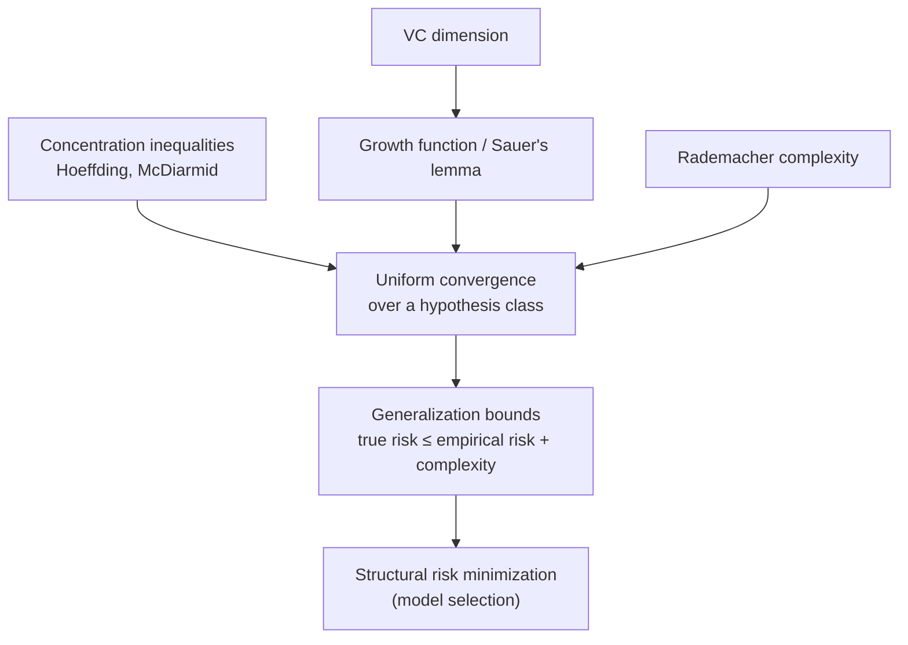

  <h1 style="color: white; margin: 0; font-size: 2.5rem;">Advanced AI Mathematics</h1>
  
Statistical learning theory, optimization landscapes, and rigorous mathematical foundations for machine learning

**Prerequisites**: Graduate-level mathematics including measure theory, functional analysis, and probability theory.

Machine learning works in practice — but <em>why</em>? This page develops the mathematics that explains when learning from finite data generalizes to unseen examples, why gradient-based optimization of wildly non-convex networks succeeds, and what fundamental limits constrain any learning algorithm. The throughline is a single question: <strong>given finitely many samples, when can we trust a model on data it has never seen?</strong>

  
<i class="fas fa-ruler-combined"></i><h4>Capacity controls generalization</h4>
A hypothesis class generalizes iff its complexity (VC dimension, Rademacher complexity) is finite — the central message of statistical learning theory.

  
<i class="fas fa-arrow-trend-down"></i><h4>Optimization is geometry</h4>
SGD does not need convexity to work: over-parameterization reshapes the loss landscape so that gradient flow reaches global minima.

  
<i class="fas fa-compress-arrows-alt"></i><h4>Compression = learning</h4>
Information-theoretic views (MDL, the information bottleneck, PAC-Bayes) recast generalization as keeping only the bits about the input that predict the label.

  
<i class="fas fa-infinity"></i><h4>Infinite width is tractable</h4>
As networks widen, training dynamics linearize (the Neural Tangent Kernel), turning deep learning into kernel regression we can analyze.

### The Logical Spine

The results below are not a grab-bag — they form a dependency chain. Concentration inequalities bound how far an empirical average can stray from its mean; uniform convergence lifts that to *all* hypotheses at once; VC dimension and Rademacher complexity quantify "how many" hypotheses effectively exist; and generalization bounds fall out as a corollary.

## Table of Contents
- [Computational Learning Theory](#computational-learning-theory)
- [Statistical Learning Theory](#statistical-learning-theory)
- [Optimization Theory for Deep Learning](#optimization-theory-for-deep-learning)
- [Information Theory in ML](#information-theory-in-ml)
- [Kernel Methods and RKHS](#kernel-methods-and-rkhs)
- [Advanced Neural Network Theory](#advanced-neural-network-theory)

## Computational Learning Theory

### PAC Learning Framework

**Intuition**: "Probably Approximately Correct" learning makes the informal goal — *learn a good rule from enough examples, most of the time* — precise. "Approximately correct" is the error tolerance $\epsilon$; "probably" is the confidence $1-\delta$. PAC-learnability asks whether a polynomial number of samples suffices to hit both targets, *for the worst-case data distribution*.

#### Definition (PAC Learnability)
A concept class $C$ is **PAC-learnable** if there exist an algorithm $A$ and a polynomial $\text{poly}(\cdot,\cdot,\cdot,\cdot)$ such that for every $\epsilon, \delta > 0$, every distribution $D$ over $X$, and every target $c \in C$, running $A$ on $m \geq \text{poly}(1/\epsilon, 1/\delta, n, \text{size}(c))$ samples returns a hypothesis with true error $\leq \epsilon$ with probability $\geq 1-\delta$.

Formally, given an algorithm $A$ and polynomial $\text{poly}(\cdot,\cdot,\cdot,\cdot)$ such that for any $\epsilon > 0$, $\delta > 0$, any distribution $D$ over $X$ and any target concept $c \in C$, when running $A$ on $m \geq \text{poly}(1/\epsilon, 1/\delta, n, \text{size}(c))$ samples drawn from $D$ and labeled by $c$:

$$P_{S \sim D^m}[\mathcal{L}_D(A(S)) \leq \epsilon] \geq 1 - \delta$$

where $\mathcal{L}_D(h) = P_{x \sim D}[h(x) \neq c(x)]$ is the true error.

### VC Dimension Theory

**Definition (VC Dimension)**: The VC dimension of a hypothesis class H is the maximum size of a set S that can be shattered by H:

$$VC(H) = \max\{|S| : S \subseteq X, |H_S| = 2^{|S|}\}$$

where $H_S = \{h|_S : h \in H\}$ is the restriction of H to S.

#### Worked Example: VC dimension of 1D thresholds
Let $H = \{h_t(x) = \mathbb{1}[x \geq t] : t \in \mathbb{R}\}$ on the real line. A single point can be labeled either way (put the threshold to its left or right), so it is shattered — $VC(H) \geq 1$. But two points $x_1 < x_2$ cannot realize the labeling $(1, 0)$: any threshold that accepts the smaller point also accepts the larger one. No 2-point set is shattered, so $VC(H) = 1$. Plugging into the fundamental theorem, thresholds are learnable with $O\!\left(\tfrac{1 + \log(1/\delta)}{\epsilon^2}\right)$ samples — independent of the data dimension's scale, because the *capacity*, not the input range, sets the rate.

#### Fundamental Theorem of Statistical Learning
A hypothesis class $H$ has the uniform convergence property — and is therefore PAC-learnable by empirical risk minimization — **if and only if** its VC dimension is finite. The sample complexity is then
$$m(\epsilon, \delta) = O\left(\frac{VC(H) + \log(1/\delta)}{\epsilon^2}\right).$$

This is the load-bearing result of the whole field: it converts the qualitative question "can this class be learned?" into the combinatorial quantity $VC(H)$. The bound also explains the $1/\epsilon^2$ scaling familiar from statistics — halving the error costs four times the data.

**Proof Sketch**:
1. **Upper bound**: Use Rademacher complexity and McDiarmid's inequality
2. **Lower bound**: No-free-lunch theorem construction
3. **Connection**: Sauer's lemma bounds growth function

### Rademacher Complexity

**Definition**: For a function class F and sample S = {x₁, ..., xₘ}:

$$\mathcal{R}_S(F) = \mathbb{E}_{\sigma}\left[\sup_{f \in F} \frac{1}{m}\sum_{i=1}^m \sigma_i f(x_i)\right]$$

where σᵢ are independent Rademacher random variables.

**Generalization Bound**: With probability at least 1-δ over S ~ Dᵐ:

$$\sup_{f \in F} |\mathcal{L}_D(f) - \hat{\mathcal{L}}_S(f)| \leq 2\mathcal{R}_m(F) + \sqrt{\frac{\log(2/\delta)}{2m}}$$

## Statistical Learning Theory

### Empirical Risk Minimization

**Theorem (Uniform Convergence)**: If H has finite VC dimension d, then with probability 1-δ:

$$\forall h \in H: |\mathcal{L}_D(h) - \hat{\mathcal{L}}_S(h)| \leq \sqrt{\frac{2d\log(2em/d) + 2\log(4/\delta)}{m}}$$

### Structural Risk Minimization

**Principle**: Balance empirical risk with model complexity:

$$h^* = \arg\min_{h \in H} \left[\hat{\mathcal{L}}_S(h) + \lambda \cdot \text{complexity}(h)\right]$$

**Oracle Inequality**: Under appropriate conditions:

$$\mathcal{L}_D(h^*) \leq \inf_{h \in H} \mathcal{L}_D(h) + O\left(\sqrt{\frac{\text{complexity}(H)}{m}}\right)$$

## Optimization Theory for Deep Learning

### Non-Convex Optimization Landscape

**Theorem (Gradient Flow Dynamics)**: For overparameterized neural networks with width m → ∞:

$$\frac{d\theta}{dt} = -\nabla_\theta L(\theta)$$

converges to global minimum under Neural Tangent Kernel (NTK) regime.

### Convergence Analysis

**SGD Convergence**: For L-smooth, μ-strongly convex functions:

$$\mathbb{E}[f(w_T) - f(w^*)] \leq \left(1 - \frac{\mu}{L}\right)^T [f(w_0) - f(w^*)] + \frac{\eta L \sigma^2}{2\mu}$$

**Recent Advances (2023-2024)**:
- **Sharpness-Aware Minimization (SAM)**: Achieves better generalization by minimizing both loss and sharpness
- **Lion Optimizer**: Discovered through program search, uses sign of gradient moments
- **Schedule-Free Optimization**: Removes need for learning rate scheduling

**Adam Optimizer Analysis**:
Update rule with bias correction:

$$m_t = \beta_1 m_{t-1} + (1-\beta_1)g_t$$
$$v_t = \beta_2 v_{t-1} + (1-\beta_2)g_t^2$$
$$\hat{m}_t = \frac{m_t}{1-\beta_1^t}, \quad \hat{v}_t = \frac{v_t}{1-\beta_2^t}$$
$$\theta_t = \theta_{t-1} - \alpha \frac{\hat{m}_t}{\sqrt{\hat{v}_t} + \epsilon}$$

### Implicit Regularization

**Theorem**: Gradient descent on overparameterized models exhibits implicit bias:

$$\lim_{t \to \infty} \theta(t) = \arg\min_{\theta: L(\theta)=0} \|\theta - \theta_0\|$$

## Information Theory in ML

### Mutual Information and Generalization

**Information Bottleneck Principle**:

$$\min_{T} I(X; T) - \beta I(T; Y)$$

where T is learned representation.

### PAC-Bayes Bounds

**Theorem (McAllester's Bound)**: For any prior P and posterior Q:

$$\mathbb{E}_{h \sim Q}[\mathcal{L}_D(h)] \leq \mathbb{E}_{h \sim Q}[\hat{\mathcal{L}}_S(h)] + \sqrt{\frac{KL(Q||P) + \log(2\sqrt{m}/\delta)}{2m-1}}$$

### Minimum Description Length

**MDL Principle**: Best hypothesis minimizes:

$$L(h) + L(D|h)$$

where L(h) is description length of hypothesis, L(D|h) is description length of data given hypothesis.

## Kernel Methods and RKHS

### Reproducing Kernel Hilbert Spaces

**Definition**: A Hilbert space H of functions f: X → ℝ is an RKHS if evaluation functionals are continuous:

$$\forall x \in X: |f(x)| \leq C_x \|f\|_H$$

**Representer Theorem**: For any regularized risk:

$$\min_{f \in H} \sum_{i=1}^m L(y_i, f(x_i)) + \lambda \|f\|_H^2$$

The minimizer has form: $f^*(x) = \sum_{i=1}^m \alpha_i k(x_i, x)$

### Kernel Approximation Theory

**Mercer's Theorem**: For continuous positive definite kernel k:

$$k(x, y) = \sum_{i=1}^\infty \lambda_i \phi_i(x)\phi_i(y)$$

**Random Features**: Approximate kernel with:

$$k(x, y) \approx \frac{1}{D}\sum_{i=1}^D \psi(x; w_i)\psi(y; w_i)$$

## Advanced Neural Network Theory

### Neural Tangent Kernel

**Definition**: For neural network f(x; θ):

$$\Theta(x, x') = \lim_{m \to \infty} \langle \nabla_\theta f(x; \theta), \nabla_\theta f(x'; \theta) \rangle$$

**Theorem**: In infinite width limit, network training dynamics become linear in function space.

**Recent Developments (2023-2024)**:
- **Feature Learning Beyond NTK**: Networks escape kernel regime through feature learning
- **Maximal Update Parameterization (μP)**: Enables hyperparameter transfer across model scales
- **Tensor Programs**: Unified framework for analyzing infinite-width limits

### Mean Field Theory

**Mean Field Limit**: As width → ∞, neurons become independent:

$$\frac{\partial \rho_t}{\partial t} = -\nabla \cdot \left(\rho_t \nabla_w \mathcal{L}\left[\rho_t\right](w)\right)$$

where ρₜ is empirical distribution of parameters.

### Lottery Ticket Hypothesis

**Conjecture**: Dense networks contain sparse subnetworks that can train to comparable accuracy from same initialization.

**Mathematical Formulation**:
$$\exists m \subseteq \{1, ..., n\}, |m| \ll n: \mathcal{L}(f_{m}(\theta_0^m)) \approx \mathcal{L}(f(\theta^*))$$

## Research Frontiers

### Generalization Mystery in Deep Learning

**Double Descent Phenomenon**:
- Classical regime: U-shaped bias-variance tradeoff
- Modern regime: Test error decreases again after interpolation threshold

**Grokking Phenomenon (2023-2024)**:
- Networks suddenly generalize after extended training on memorized data
- Phase transitions in loss landscape explain delayed generalization
- Weight decay and data augmentation affect grokking dynamics

### Optimization-Generalization Connection

**Sharpness-Aware Minimization**:
$$\min_w \max_{\|\epsilon\| \leq \rho} L(w + \epsilon)$$

### Theoretical Guarantees for Modern Architectures

**Transformer Expressivity**: Can approximate any sequence-to-sequence function with:
$$O(\log n) \text{ layers, } O(n^2) \text{ parameters}$$

**Recent Architecture Theory (2023-2024)**:

**State Space Models (Mamba)**:
- Linear time complexity O(n) vs O(n²) for transformers
- Selective state space with hardware-aware algorithm
- Theoretical connection to linear attention and RNNs

**Mechanistic Interpretability**:
- **Superposition Hypothesis**: Networks encode more features than neurons
- **Circuits Framework**: Identifies computational subgraphs
- **Scaling Monosemanticity**: Sparse autoencoders reveal interpretable features

## Emerging Topics

### Diffusion Models Theory

**Score Matching Connection**:
$$\min_\theta \mathbb{E}_{t,x_0,\epsilon}\left[\|\epsilon - \epsilon_\theta(x_t, t)\|^2\right]$$

where $x_t = \sqrt{\bar{\alpha}_t}x_0 + \sqrt{1-\bar{\alpha}_t}\epsilon$

**Convergence Guarantees**: Polynomial convergence in KL divergence under smoothness assumptions

### Foundation Model Theory

**In-Context Learning**:
- Transformers implement gradient descent implicitly
- Task vectors emerge in weight space
- Theoretical bounds on few-shot performance

## References and Further Reading

1. Shalev-Shwartz, S., & Ben-David, S. (2014). *Understanding Machine Learning: From Theory to Algorithms*
2. Mohri, M., Rostamizadeh, A., & Talwalkar, A. (2018). *Foundations of Machine Learning*
3. Arora, S., et al. (2019). "Fine-Grained Analysis of Optimization and Generalization for Overparameterized Two-Layer Neural Networks"
4. Jacot, A., Gabriel, F., & Hongler, C. (2018). "Neural Tangent Kernel: Convergence and Generalization in Neural Networks"
5. Belkin, M., et al. (2019). "Reconciling modern machine learning practice and the bias-variance trade-off"
6. Power, A., et al. (2022). "Grokking: Generalization Beyond Overfitting on Small Algorithmic Datasets"
7. Gu, A., & Dao, T. (2023). "Mamba: Linear-Time Sequence Modeling with Selective State Spaces"
8. Anthropic (2023). "Towards Monosemanticity: Decomposing Language Models With Dictionary Learning"
9. Chen, T., et al. (2024). "The Mechanics of Next-Token Prediction"
10. Yang, G., et al. (2023). "Tensor Programs V: Tuning Large Neural Networks via Zero-Shot Hyperparameter Transfer"

---

*Note: This page contains advanced mathematical content intended for researchers and graduate students. For practical implementations and intuitive explanations, see our [main AI documentation](../../artificial-intelligence/).*

## Key Takeaways

  
<h4>Finite capacity ⇒ learnable</h4>
The Fundamental Theorem ties PAC-learnability to finite VC dimension, with sample complexity scaling as $1/\epsilon^2$.

  
<h4>Generalization gap is bounded</h4>
Rademacher and PAC-Bayes bounds control how far test error can exceed training error, in terms of complexity and confidence.

  
<h4>Over-parameterization helps</h4>
Wide networks enter the NTK regime where training linearizes and gradient descent reaches global minima — and exhibits implicit bias toward simple solutions.

  
<h4>Modern phenomena need new theory</h4>
Double descent and grokking violate the classical bias–variance picture and remain active research frontiers.

  
<h4>Kernels unify the picture</h4>
RKHS theory and the representer theorem connect kernel methods, SVMs, and the infinite-width limit of neural networks.

  
<h4>Information bounds learning</h4>
MDL, the information bottleneck, and PAC-Bayes recast generalization as compression — keeping only predictive bits.

## See Also

#### See Also

**Related Advanced Topics**
- [Quantum Algorithms Research](../quantum-algorithms-research/) — Quantum machine learning and kernel methods
- [Distributed Systems Theory](../distributed-systems-theory/) — Foundations for distributed/federated ML training
- [Monorepo Strategies](../monorepo/) — Managing large ML research codebases

**Applied & Foundational**
- [AI/ML Documentation](../../ai-ml/) — Practical model training, architectures, and tooling
- [Model Types Reference](../../ai-ml/model-types.html) — Architectures explained without heavy formalism
- [Statistical Mechanics](../../physics/statistical-mechanics.html) — Partition functions and the physics roots of learning theory
- [Computational Physics](../../physics/computational-physics.html) — Numerical optimization and simulation methods
- [Mathematical Reference](../../reference/) — Linear algebra and calculus quick reference

