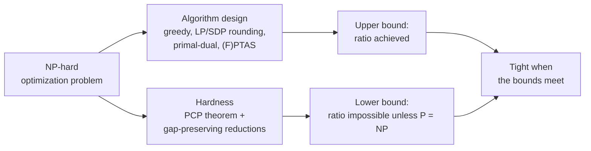
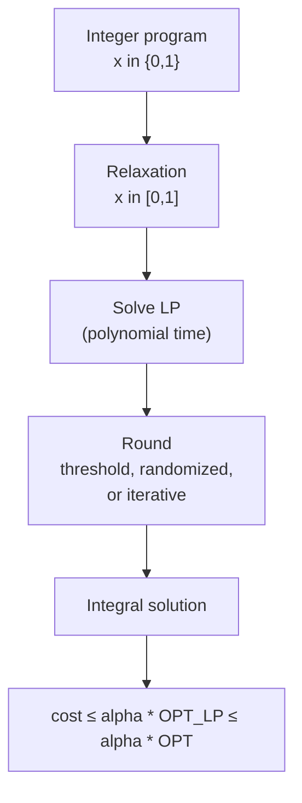

# Approximation Algorithms &amp; Hardness

[Advanced Topics](../) &raquo; Approximation Algorithms &amp; Hardness

<div class="advanced-note" markdown="1">
**Graduate-level reference.** **Prerequisites:** P, NP, and polynomial-time reductions (see [Complexity Theory](../complexity-theory/)), linear programming and LP duality, basic probability, and graph theory.
</div>

An **approximation algorithm** runs in polynomial time and returns a feasible solution whose cost is provably within a guaranteed factor of optimal on *every* instance. Most natural optimization problems are NP-hard, so under P &ne; NP no efficient algorithm solves them exactly; approximation algorithms trade exactness for a worst-case guarantee. The complementary theory, **hardness of approximation**, uses the PCP theorem and gap-preserving reductions to prove that for many problems no polynomial-time algorithm can beat a specific factor unless P = NP. For a growing list of problems the two theories meet exactly.

This page covers the definitions and approximability classes, the main algorithm design techniques (greedy and local search, LP rounding, primal-dual, semidefinite programming, approximation schemes), the metric TSP story, the PCP theorem and gap reductions, the Unique Games Conjecture, and a summary table of the best known bounds as of 2026.



## Approximation Ratios

<div class="postulate-card" markdown="1">
#### Definition (approximation ratio)
Let $\mathrm{OPT}(I)$ be the optimal objective value of instance $I$. A polynomial-time algorithm $A$ is an **$\alpha$-approximation** if for every instance $I$ it returns a feasible solution with

$$\mathrm{cost}(A(I)) \leq \alpha \cdot \mathrm{OPT}(I) \quad (\text{minimization}, \ \alpha \geq 1), \qquad \mathrm{val}(A(I)) \geq \alpha \cdot \mathrm{OPT}(I) \quad (\text{maximization}, \ \alpha \leq 1).$$

The ratio may be a function of the input size, e.g. $\alpha(n) = \ln n$. For a randomized algorithm, the expected cost is bounded.
</div>

This page follows the convention used in most of the literature: minimization ratios are at least 1, maximization ratios at most 1 (the Goemans–Williamson MAX-CUT algorithm is a "0.878-approximation"). Some texts invert maximization ratios so that every $\alpha \geq 1$; the two are reciprocals.

**Proving a ratio without knowing OPT.** The optimum cannot be computed, so every ratio proof compares the algorithm's output to a **computable bound** on OPT: a lower bound for minimization (a matching, an LP optimum, a dual solution, an MST) or an upper bound for maximization (total edge weight, an SDP optimum). Finding a bound that is both computable and close to OPT is the central craft of the field. The best ratio provable against a given relaxation is limited by its **integrality gap**.

**Other guarantee types.**

- *Additive*: $\mathrm{cost} \leq \mathrm{OPT} + c$. Rare for NP-hard problems, but edge colouring with $\Delta + 1$ colours (Vizing) is one example, and bin packing admits $\mathrm{OPT} + O(\log \mathrm{OPT})$ bins (Hoberg & Rothvoss, 2017).
- *Asymptotic*: $\mathrm{cost} \leq \alpha\,\mathrm{OPT} + c$, which matters when small instances are hard for trivial reasons (bin packing again).
- *Bicriteria*: the solution may violate a constraint by a bounded factor, e.g. use $(1+\epsilon)k$ facilities instead of $k$.

## Approximability Classes

Problems sort into classes by the best ratio achievable in polynomial time. Each inclusion is strict unless P = NP.

| Class | Guarantee | Representative problems |
|---|---|---|
| PO | exact, polynomial time | shortest path, max matching, min cut |
| FPTAS | $1+\epsilon$ in time $\mathrm{poly}(n, 1/\epsilon)$ | knapsack, subset-sum optimization |
| PTAS | $1+\epsilon$ in time $\mathrm{poly}(n)$ for each fixed $\epsilon$ | Euclidean TSP, planar independent set, makespan scheduling |
| APX | some constant $\alpha$ | vertex cover, metric TSP, MAX-3-SAT, MAX-CUT, $k$-center |
| log-APX | $O(\log n)$ | set cover, dominating set |
| poly-APX | $n^{c}$ for some $c < 1$ | max clique, max independent set, graph colouring |


*Each arrow is a strict inclusion under P &ne; NP.*

A problem is **APX-hard** if every APX problem reduces to it by an approximation-preserving (PTAS or L-) reduction; an APX-hard problem has no PTAS unless P = NP. MAX-3-SAT, vertex cover, MAX-CUT, and metric TSP are all APX-complete. Before the PCP theorem this class was studied as MAX-SNP (Papadimitriou & Yannakakis, 1991), which is where the reductions come from; the PCP theorem is what made APX-hardness imply "no PTAS".

## Greedy and Combinatorial Algorithms

The simplest paradigm makes locally optimal choices and proves a global guarantee through a **charging argument** that pays for the algorithm's cost using the lower bound on OPT.

### Vertex cover via maximal matching

**Problem.** Given $G = (V,E)$, find a smallest $S \subseteq V$ touching every edge.

**Algorithm.** Repeatedly pick any uncovered edge $(u,v)$, add both endpoints to $S$, and delete all edges incident to $u$ or $v$.

**Analysis.** The picked edges form a matching $M$. Any cover contains at least one endpoint of each matched edge, and these are distinct, so $\mathrm{OPT} \geq \lvert M\rvert$. The algorithm returns $2\lvert M\rvert \leq 2\,\mathrm{OPT}$ vertices. No $(2-\epsilon)$-approximation is known, and none exists under the Unique Games Conjecture ([below](#vertex-cover)).

The "smarter" greedy that repeatedly takes a maximum-degree vertex is only an $H_\Delta = \Theta(\log \Delta)$-approximation: greedier is not better.

### Set cover: the harmonic greedy bound

**Problem.** Universe $U$ of $n$ elements; sets $S_1,\dots,S_m$ with costs $c_j > 0$. Find a cheapest subfamily covering $U$.

**Algorithm.** Repeatedly choose the set minimizing cost per newly covered element, $c_j / \lvert S_j \setminus C\rvert$, where $C$ is the covered set.

**Theorem.** Greedy is an $H_n$-approximation, $H_n = \sum_{k=1}^{n} 1/k \leq \ln n + 1$.

**Proof.** When element $e$ is first covered by chosen set $S_j$, charge it $\mathrm{price}(e) = c_j/\lvert S_j\setminus C\rvert$; the prices sum to the algorithm's cost. Fix a set $S^{\star}$ of an optimal cover and list its elements $e_1,\dots,e_k$ in the reverse of the order greedy covers them. Just before $e_i$ is covered, at least $i$ elements of $S^{\star}$ are uncovered, so $S^{\star}$ itself offers price at most $c(S^{\star})/i$, and greedy picks something no worse:

$$\sum_{e \in S^{\star}} \mathrm{price}(e) \leq c(S^{\star}) \sum_{i=1}^{k} \frac{1}{i} = H_k\, c(S^{\star}) \leq H_n\, c(S^{\star}).$$

Summing over the sets of the optimal cover, which together contain every element, gives $\mathrm{ALG} \leq H_n \cdot \mathrm{OPT}$. $\blacksquare$

This is essentially optimal: approximating set cover within $(1-\epsilon)\ln n$ is NP-hard ([below](#set-cover-hardness)).

```python
def greedy_set_cover(universe, subsets, costs):
    """Weighted greedy set cover; returns indices of chosen sets.

    Guarantee: cost <= H_n * OPT, where n = len(universe).
    """
    uncovered = set(universe)
    chosen = []
    while uncovered:
        best, best_ratio = None, float("inf")
        for j, s in enumerate(subsets):
            new = len(s & uncovered)
            if new and costs[j] / new < best_ratio:
                best, best_ratio = j, costs[j] / new
        if best is None:
            raise ValueError("universe cannot be covered by the given subsets")
        chosen.append(best)
        uncovered -= subsets[best]
    return chosen
```

A priority queue with lazy re-evaluation (ratios only increase as elements get covered) makes this run in near-linear time in the total size of the sets.

### Metric k-center: farthest-point traversal

**Problem.** Given points in a metric space and an integer $k$, choose $k$ centers minimizing the maximum distance from any point to its nearest center.

**Algorithm (Gonzalez, 1985).** Pick any point; then repeatedly add the point farthest from the current centers, until there are $k$.

**Analysis.** Let $r$ be the distance from the farthest point $p$ to the chosen centers at the end. The $k$ centers plus $p$ are $k+1$ points pairwise at distance at least $r$, so two of them share a cluster in the optimal solution, and by the triangle inequality $r \leq 2\,\mathrm{OPT}$. The ratio 2 is tight: $(2-\epsilon)$-approximation is NP-hard (Hsu & Nemhauser, 1979), by a reduction from dominating set.

### Local search

Start from any feasible solution and apply improving local moves until none exists. For MAX-CUT, moving any vertex whose majority of incident edge weight lies on its own side gives a local optimum in which every vertex has at least half its incident weight cut, hence a $\tfrac12$-approximation. Local search with swaps of $p$ facilities gives a $(3 + 2/p)$-approximation for metric $k$-median (Arya et al., 2004); the ratio proof compares a local optimum to the global one through a carefully chosen set of test swaps.

## LP Relaxation and Rounding

Write the problem as an integer linear program, relax integrality, solve the LP in polynomial time, and **round** the fractional optimum to an integral solution while bounding the loss. For minimization the LP optimum is a lower bound on OPT, which is exactly the computable bound a ratio proof needs.



<div class="postulate-card" markdown="1">
#### Definition (integrality gap)
For a minimization problem and a relaxation,

$$\text{integrality gap} = \sup_{I}\ \frac{\mathrm{OPT}_{\mathrm{IP}}(I)}{\mathrm{OPT}_{\mathrm{LP}}(I)}.$$

Any algorithm whose analysis compares only against $\mathrm{OPT}_{\mathrm{LP}}$ cannot prove a ratio better than the integrality gap.
</div>

### Vertex cover: threshold rounding

The weighted vertex cover ILP minimizes $\sum_v w_v x_v$ subject to $x_u + x_v \geq 1$ for every edge and $x_v \in \{0,1\}$. Relax to $0 \leq x_v \leq 1$, solve, and include $v$ iff $x_v \geq \tfrac12$.

Every edge has an endpoint with $x \geq \tfrac12$, so the rounded set is a cover, and $\mathbb{1}[x_v \geq \tfrac12] \leq 2x_v$ gives

$$\sum_v w_v\, \mathbb{1}\!\left[x_v \geq \tfrac12\right] \leq 2 \sum_v w_v x_v = 2\,\mathrm{OPT}_{\mathrm{LP}} \leq 2\,\mathrm{OPT}.$$

This handles arbitrary weights, where the matching argument does not directly apply. The integrality gap is $2 - 2/n$ (on $K_n$, all $x_v = \tfrac12$ is feasible with value $n/2$, but any cover needs $n-1$ vertices), so no LP-based analysis can beat 2. The LP also has *half-integral* extreme points (Nemhauser & Trotter, 1975): every vertex with $x_v = 1$ can be fixed into the cover and every $x_v = 0$ excluded, which is a standard kernelization step in parameterized algorithms.

### Randomized rounding: set cover

Solve the set-cover LP ($\sum_{j : e \in S_j} x_j \geq 1$ for each element), then in each of $\lceil 2\ln n\rceil$ independent rounds include each set $S_j$ with probability $x_j$. In one round element $e$ stays uncovered with probability $\prod_{j \ni e}(1-x_j) \leq e^{-\sum_{j\ni e} x_j} \leq 1/e$, so after $2\ln n$ rounds it is uncovered with probability at most $1/n^2$, and a union bound shows every element is covered with probability at least $1 - 1/n$. The expected cost is $O(\log n)\cdot\mathrm{OPT}_{\mathrm{LP}}$, recovering the greedy bound by a different route.

### Iterative rounding

Jain (2001) showed that every extreme point of the LP for the survivable network design problem has a variable of value at least $\tfrac12$. Rounding that variable up, fixing it, and re-solving the residual LP gives a 2-approximation. Iterative rounding has since become a general technique (Lau, Ravi & Singh, 2011), and it underlies the best Steiner tree algorithm ($\ln 4 + \epsilon \approx 1.39$; Byrka, Grandoni, Rothvoss & Sanità, 2013).

## The Primal-Dual Method

LP rounding solves the LP explicitly. The **primal-dual** method never does: it grows a feasible dual solution and uses dual constraints that become tight to decide which primal variables to set. By weak duality every feasible dual value is at most OPT, so if the primal cost is at most $\alpha$ times the dual value, the algorithm is an $\alpha$-approximation. The result is usually a fast combinatorial algorithm with no LP solver involved.

```mermaid
sequenceDiagram
    participant D as Dual (lower bound on OPT)
    participant P as Primal (solution being built)
    Note over D,P: primal empty (infeasible), dual zero (feasible)
    loop until primal is feasible
        D->>D: raise dual variables of unsatisfied primal constraints
        D->>P: a dual constraint becomes tight, add its primal element
    end
    P->>P: reverse-delete redundant elements
    Note over D,P: primal cost &le; alpha * dual value &le; alpha * OPT
```

**Vertex cover.** The dual of the vertex-cover LP has a variable $y_e \geq 0$ for each edge and a constraint $\sum_{e \ni v} y_e \leq w_v$ for each vertex. Repeatedly take an uncovered edge and raise $y_e$ until one endpoint's constraint is tight; add that vertex to the cover (Bar-Yehuda & Even, 1981). Each chosen vertex is paid for exactly by the dual on its edges, and each edge is counted by at most its two endpoints:

$$\sum_{v \in C} w_v = \sum_{v \in C}\ \sum_{e \ni v} y_e \leq 2 \sum_{e} y_e \leq 2\,\mathrm{OPT}.$$

**Beyond vertex cover.** The primal-dual method with reverse deletion gives the 2-approximation for Steiner forest (Agrawal, Klein & Ravi, 1995; Goemans & Williamson, 1995) and a 3-approximation for uncapacitated facility location (Jain & Vazirani, 2001). The best known facility-location ratio, 1.488 (Li, 2013), is close to the hardness threshold of 1.463 (Guha & Khuller, 1999).

## Semidefinite Programming: MAX-CUT

**Problem.** Partition the vertices of a weighted graph into two sides to maximize the total weight of edges crossing the cut. A uniformly random cut already achieves half the total weight, a $\tfrac12$-approximation.

**Goemans–Williamson (1995).** MAX-CUT can be written as maximizing $\sum_{(i,j)\in E} w_{ij}\frac{1 - x_i x_j}{2}$ over $x_i \in \{-1,+1\}$. Relax each $x_i$ to a unit vector $\mathbf{v}_i \in \mathbb{R}^n$:

$$\max \sum_{(i,j) \in E} w_{ij}\, \frac{1 - \langle \mathbf{v}_i, \mathbf{v}_j\rangle}{2} \quad \text{subject to} \quad \lVert \mathbf{v}_i \rVert = 1,$$

which is a semidefinite program in the Gram matrix $X_{ij} = \langle\mathbf{v}_i,\mathbf{v}_j\rangle$, solvable to any precision in polynomial time. Round with a **random hyperplane**: draw a Gaussian vector $\mathbf{r}$ and put $i$ on the side given by the sign of $\langle\mathbf{v}_i,\mathbf{r}\rangle$. Edge $(i,j)$ is cut with probability $\theta_{ij}/\pi$, where $\theta_{ij}$ is the angle between the vectors, while it contributes $(1-\cos\theta_{ij})/2$ to the SDP. Comparing term by term,

$$\alpha_{\mathrm{GW}} = \min_{0 < \theta \leq \pi} \frac{\theta/\pi}{(1-\cos\theta)/2} \approx 0.87856.$$

Under the Unique Games Conjecture this constant is optimal ([below](#the-unique-games-conjecture)). The same SDP-plus-rounding template gives the best known algorithms for MAX-2-SAT, MAX-DICUT, and, via Raghavendra's theorem, every constraint satisfaction problem.

```python
import cvxpy as cp
import numpy as np

def goemans_williamson(n, edges, weights, trials=50, seed=0):
    """MAX-CUT via the GW SDP relaxation and random-hyperplane rounding.

    Expected cut >= 0.878 * OPT. Returns (boolean side per vertex, cut weight).
    """
    X = cp.Variable((n, n), PSD=True)                 # Gram matrix of unit vectors
    objective = sum(w * (1 - X[i, j]) / 2 for (i, j), w in zip(edges, weights))
    cp.Problem(cp.Maximize(objective), [cp.diag(X) == 1]).solve()

    # Factor X = V V^T; clip tiny negative eigenvalues from solver round-off.
    evals, evecs = np.linalg.eigh(X.value)
    V = evecs * np.sqrt(np.clip(evals, 0, None))      # row i is vector v_i

    rng = np.random.default_rng(seed)
    best_side, best_val = None, -np.inf
    for _ in range(trials):
        side = V @ rng.standard_normal(n) >= 0        # random hyperplane
        val = sum(w for (i, j), w in zip(edges, weights) if side[i] != side[j])
        if val > best_val:
            best_side, best_val = side, val
    return best_side, best_val
```

**Hierarchies.** LP and SDP relaxations can be systematically strengthened by lift-and-project hierarchies (Sherali–Adams, Lasserre / Sum-of-Squares). Level $r$ is solvable in time $n^{O(r)}$. Understanding what constant levels can and cannot do is a central research programme: for example, Raghavendra (2008) showed that for every CSP the basic SDP achieves the UGC-optimal ratio, so under the UGC stronger hierarchies do not help for these problems.

## Metric TSP

The travelling salesman problem with arbitrary edge weights cannot be approximated within any polynomial-time computable factor unless P = NP (a Hamiltonian-cycle reduction with huge weights on non-edges). With the **triangle inequality** it becomes one of the best-studied problems in the field.

**Double-tree (2-approximation).** Deleting an edge from an optimal tour gives a spanning tree, so $\mathrm{MST} \leq \mathrm{OPT}$. Doubling the MST gives an Eulerian multigraph; walking an Euler tour and shortcutting repeated vertices (allowed by the triangle inequality) yields a tour of cost at most $2\,\mathrm{MST}$.

**Christofides–Serdyukov (1.5-approximation, 1976).** Instead of doubling the whole tree, fix only the parity of odd-degree vertices.


Shortcutting an optimal tour to the vertices of $O$ gives a cycle of cost at most OPT, which splits into two perfect matchings on $O$; the cheaper one costs at most $\mathrm{OPT}/2$.

**Beyond 3/2.** For over 40 years 1.5 was the best known ratio. Karlin, Klein & Oveis Gharan (STOC 2021) gave a randomized $(\tfrac32 - \epsilon)$-approximation for some $\epsilon > 10^{-36}$, by sampling the spanning tree from a max-entropy distribution fitted to the Held–Karp LP solution; it was later derandomized (Karlin, Klein & Oveis Gharan, 2023), and Gurvits, Klein & Leake (2024) improved the constant slightly using real-stable-polynomial capacity bounds. The improvement is tiny, but it broke a long-standing barrier. The integrality gap of the Held–Karp (subtour) LP is known to lie between $4/3$ and $3/2$ and is conjectured to be $4/3$.

**Hardness and variants.** Metric TSP is NP-hard to approximate within $123/122$ (Karpinski, Lampis & Schmied, 2015), leaving a wide gap. Euclidean TSP has a PTAS ([below](#when-a-ptas-but-no-fptas-exists)). Asymmetric TSP, long stuck at $O(\log n)$-type bounds, received its first constant-factor approximation from Svensson, Tarnawski & Végh (2018), since improved to $22 + \epsilon$ by Traub & Vygen.

## Approximation Schemes: PTAS and FPTAS

<div class="postulate-card" markdown="1">
#### Definitions (PTAS, EPTAS, FPTAS)
A **PTAS** is a family of algorithms that, for each fixed $\epsilon > 0$, return a $(1+\epsilon)$-approximation (or $(1-\epsilon)$ for maximization) in time polynomial in $n$. The dependence on $\epsilon$ may be arbitrary, e.g. $n^{O(1/\epsilon)}$.

An **EPTAS** has running time $f(1/\epsilon)\cdot n^{O(1)}$, with the exponent of $n$ independent of $\epsilon$. An **FPTAS** has running time polynomial in both $n$ and $1/\epsilon$.
</div>

A strongly NP-hard problem (NP-hard even when all numbers are bounded by a polynomial in $n$) with integer objective bounded polynomially in the unary input size has no FPTAS unless P = NP: choosing $\epsilon < 1/\mathrm{OPT}$ would solve it exactly.

### FPTAS for 0/1 knapsack

**Problem.** Items with values $v_i$ and weights $w_i$; maximize total value subject to total weight at most $W$. Discard items with $w_i > W$ first.

**Exact DP.** $\mathrm{DP}[p]$ = minimum weight achieving value exactly $p$. Running time $O(nV)$ with $V = \sum_i v_i$, which is pseudo-polynomial: $V$ can be exponential in the number of bits in the input.

**Scaling.** Let $v_{\max} = \max_i v_i$ and $K = \epsilon\, v_{\max}/n$. Run the DP on rounded values $\tilde v_i = \lfloor v_i/K \rfloor \leq n/\epsilon$. The scaled total is at most $n^2/\epsilon$, so the DP takes $O(n^3/\epsilon)$ time.

**Accuracy.** Let $S^{\star}$ be optimal and $S$ the returned set. Since $S$ is optimal for the rounded values and each item loses less than $K$ to rounding,

$$\sum_{i \in S} v_i \geq K\sum_{i\in S}\tilde v_i \geq K\sum_{i \in S^{\star}}\tilde v_i \geq \sum_{i \in S^{\star}} v_i - nK = \mathrm{OPT} - \epsilon\, v_{\max} \geq (1-\epsilon)\,\mathrm{OPT},$$

using $\mathrm{OPT} \geq v_{\max}$ (every remaining item fits on its own). $\blacksquare$

```python
def knapsack_fptas(values, weights, W, eps):
    """(1 - eps)-approximation for 0/1 knapsack in O(n^3 / eps) time.

    Returns (indices of chosen items, their true total value).
    """
    items = [i for i in range(len(values)) if weights[i] <= W and values[i] > 0]
    if not items:
        return [], 0
    K = eps * max(values[i] for i in items) / len(items)
    scaled = {i: int(values[i] // K) for i in items}
    P = sum(scaled.values())

    INF = float("inf")
    dp = [0] + [INF] * P              # dp[p] = min weight reaching scaled value p
    took = []                         # took[k][p]: item k was used to improve dp[p]
    for i in items:
        s, w = scaled[i], weights[i]
        row = [False] * (P + 1)
        for p in range(P, s - 1, -1):  # downward: each item used at most once
            if dp[p - s] + w < dp[p]:
                dp[p] = dp[p - s] + w
                row[p] = True
        took.append(row)

    p = max(q for q in range(P + 1) if dp[q] <= W)
    chosen = []
    for k in range(len(items) - 1, -1, -1):   # walk the DP back to recover items
        if took[k][p]:
            chosen.append(items[k])
            p -= scaled[items[k]]
    return chosen, sum(values[i] for i in chosen)
```

### When a PTAS but no FPTAS exists

**Euclidean TSP** in fixed dimension has a PTAS (Arora, 1998; Mitchell, 1999), based on a randomly shifted quadtree dissection in which an optimal tour can be assumed to cross each cell boundary only at a few "portals"; dynamic programming over the quadtree then finds the best portal-respecting tour. Being strongly NP-hard, it has no FPTAS. Many problems on planar graphs admit PTASs through Baker's technique (decompose into bounded-treewidth layers).

**Bin packing** shows why asymptotic ratios matter. Deciding whether items fit into 2 bins is the NP-hard PARTITION problem, so no algorithm achieves ratio below $3/2$ unless P = NP. Yet there is an **asymptotic PTAS** using at most $(1+\epsilon)\,\mathrm{OPT} + 1$ bins (Fernandez de la Vega & Lueker, 1981), and the $\mathrm{OPT} + O(\log \mathrm{OPT})$ additive bound noted earlier. First Fit Decreasing uses at most $\tfrac{11}{9}\mathrm{OPT} + \tfrac{6}{9}$ bins, which is tight (Dósa, 2007).

## Hardness of Approximation

NP-hardness of exact optimization says nothing about approximation: knapsack is NP-hard yet has an FPTAS. Inapproximability needs its own tool, the **gap-producing reduction**.

<div class="principle-card" markdown="1">
#### Gap reductions
To show that $\alpha$-approximating a maximization problem $\Pi$ is NP-hard, give a polynomial-time reduction from an NP-complete language $L$ to instances of $\Pi$ such that

- if $x \in L$, then $\mathrm{OPT} \geq c$ (completeness);
- if $x \notin L$, then $\mathrm{OPT} < s$ (soundness), with $s < c$.

An algorithm with ratio better than $s/c$ would separate the two cases and decide $L$. So no $(s/c + \epsilon)$-approximation exists unless P = NP. Once one problem has a gap, **gap-preserving reductions** transfer it to others.
</div>

Ordinary Karp reductions do not produce usable gaps. An unsatisfiable 3-CNF formula may still have all but one of its $m$ clauses satisfiable, a gap of $1 - 1/m$ that vanishes as $m$ grows. Creating a *constant* gap is exactly what the PCP theorem does.

## The PCP Theorem

A **probabilistically checkable proof** system for a language $L$ is a randomized polynomial-time verifier $V$ that, given input $x$ and oracle access to a proof string $\pi$, tosses $r(n)$ random coins and reads $q(n)$ bits of $\pi$. $\mathrm{PCP}(r, q)$ is the class of languages with such a verifier that accepts a correct proof of $x \in L$ with probability 1 and accepts any purported proof of $x \notin L$ with probability at most $\tfrac12$.

<div class="postulate-card" markdown="1">
#### Theorem (PCP theorem; Arora & Safra 1998, Arora, Lund, Motwani, Sudan & Szegedy 1998)

$$\mathrm{NP} = \mathrm{PCP}(O(\log n),\ O(1)).$$

Every NP statement has a proof format that can be checked, with constant soundness error, by reading a **constant number of bits** of the proof at locations chosen with $O(\log n)$ random bits.
</div>

The conference versions appeared in 1992. Dinur (2007) gave a considerably simpler, combinatorial proof by **gap amplification**: starting from a CSP with an inverse-polynomial gap, repeatedly apply graph powering (which multiplies the gap) followed by alphabet reduction (which restores the constant-size alphabet at a constant loss), doubling the gap each round until it is constant.

**Equivalent CSP form.** There is a constant $\rho < 1$ such that, given a 3-CNF formula, it is NP-hard to distinguish satisfiable formulas from those in which at most a $\rho$ fraction of the clauses can be simultaneously satisfied. The equivalence is direct: with $O(\log n)$ random bits the verifier has only polynomially many possible tests, and writing each one as a constant-size constraint on the proof bits yields a CSP whose satisfiable fraction equals the acceptance probability.


Hence MAX-3-SAT has no PTAS unless P = NP, and neither does any APX-hard problem.

**Optimal thresholds via Label Cover.** Most sharp results start from **Label Cover**, a two-prover version of the PCP theorem whose soundness is driven arbitrarily close to 0 by Raz's parallel repetition theorem (1998), and then compose it with a problem-specific "inner" test built from long codes and Fourier analysis over the Boolean cube. Håstad (2001) used this to prove that for every $\epsilon > 0$ it is NP-hard to approximate MAX-E3-SAT (exactly three literals per clause) better than $\tfrac78 + \epsilon$. A uniformly random assignment satisfies $\tfrac78$ of the clauses in expectation, so **the trivial algorithm is optimal**. Håstad's 3-query PCP, whose tests are linear equations mod 2, gives the matching $\tfrac12 + \epsilon$ bound for MAX-E3-LIN-2.

## Inapproximability Results

### Set cover: $(1 - o(1)) \ln n$ {#set-cover-hardness}

Feige (1998) showed that set cover cannot be approximated within $(1-\epsilon)\ln n$ unless $\mathrm{NP} \subseteq \mathrm{DTIME}(n^{O(\log\log n)})$. Building on Moshkovitz's projection games conjecture work, Dinur & Steurer (2014) derived the same threshold from P &ne; NP alone. Together with greedy's $H_n \leq \ln n + 1$, set cover's approximability is settled up to lower-order terms.

### Max clique: $n^{1-\epsilon}$

Håstad (1999) proved that max clique cannot be approximated within $n^{1-\epsilon}$ for any $\epsilon > 0$ unless NP = ZPP; Zuckerman (2007) derandomized the construction to rely only on P &ne; NP. Since outputting a single vertex is an $n$-approximation, clique is essentially completely inapproximable; the same holds for independent set and for chromatic number.

### Vertex cover

Dinur & Safra (2005) proved vertex cover NP-hard to approximate within $1.3606$. The **2-to-2 Games Theorem** of Khot, Minzer & Safra (2018), proved through a sequence of papers with Dinur and Kindler on expansion in Grassmann graphs, improved this to $\sqrt{2} - \epsilon \approx 1.414$ under P &ne; NP alone. Under the Unique Games Conjecture the answer is $2 - \epsilon$ (Khot & Regev, 2008), matching the simple algorithms above.

### The Unique Games Conjecture

A **unique game** is a CSP over a large alphabet $[k]$ in which every constraint on a pair of variables $(u,v)$ is a bijection $\pi_{uv}$: each value of $u$ is consistent with exactly one value of $v$.

<div class="postulate-card" markdown="1">
#### Unique Games Conjecture (Khot, 2002)
For every $\delta > 0$ there is an alphabet size $k$ such that, given a unique game over $[k]$, it is NP-hard to distinguish instances in which at least a $(1-\delta)$ fraction of constraints can be satisfied from instances in which at most a $\delta$ fraction can.
</div>

Deciding whether a unique game is *fully* satisfiable is easy (fix one variable and propagate), so the conjecture is about near-satisfiable instances. If true, it implies:

- vertex cover is hard to approximate within $2 - \epsilon$ (Khot & Regev, 2008);
- the Goemans–Williamson constant $\alpha_{\mathrm{GW}}$ is optimal for MAX-CUT (Khot, Kindler, Mossel & O'Donnell, 2007, using the Majority Is Stablest theorem of Mossel, O'Donnell & Oleszkiewicz);
- for **every** CSP, the basic SDP relaxation with an appropriate rounding achieves the optimal ratio (Raghavendra, 2008).

The conjecture remains open as of 2026. Evidence is mixed: the 2-to-2 theorem proves a version with imperfect completeness on the "NO" side (it implies UG hardness for distinguishing $\tfrac12$-satisfiable from $\delta$-satisfiable instances), while Arora, Barak & Steurer (2010) gave a subexponential-time algorithm $\exp(n^{\mathrm{poly}(\delta)})$ for unique games, so any NP-hardness reduction must blow up instance size by a large polynomial.

### MAX-CUT hardness

Unconditionally, MAX-CUT is NP-hard to approximate better than $\tfrac{16}{17} \approx 0.941$ (Håstad 2001, via a gadget of Trevisan, Sorkin, Sudan & Williamson). Under the UGC, no polynomial-time algorithm beats $\alpha_{\mathrm{GW}} \approx 0.87856$, an irrational constant derived from spherical geometry.

## Summary of Known Bounds

Ratios for minimization problems are $\geq 1$; for maximization problems, $\leq 1$. "UGC" marks bounds that depend on the Unique Games Conjecture.

| Problem | Best known algorithm | Hardness (unless P = NP) | Status |
|---|---|---|---|
| Knapsack | FPTAS | NP-hard to solve exactly | settled |
| Euclidean TSP (fixed dim.) | PTAS (Arora; Mitchell) | no FPTAS (strongly NP-hard) | settled |
| Bin packing | $3/2$; APTAS; $\mathrm{OPT} + O(\log \mathrm{OPT})$ | $3/2 - \epsilon$ | settled (absolute ratio) |
| Metric $k$-center | 2 (farthest point) | $2 - \epsilon$ | tight |
| Vertex cover | 2 (matching, LP, primal-dual) | $\sqrt{2} - \epsilon$; $2 - \epsilon$ under UGC | tight under UGC |
| Metric TSP | $1.5 - 10^{-36}$ (Karlin, Klein & Oveis Gharan) | $123/122$ | wide gap |
| Steiner tree | $\ln 4 + \epsilon \approx 1.39$ | $96/95$ | open |
| Uncapacitated facility location | 1.488 | 1.463 | nearly tight |
| MAX-E3-SAT | $7/8$ (random assignment) | $7/8 + \epsilon$ (Håstad) | tight |
| MAX-CUT | $0.87856$ (Goemans–Williamson) | $16/17 + \epsilon$; $\alpha_{\mathrm{GW}} + \epsilon$ under UGC | tight under UGC |
| Set cover | $H_n \leq \ln n + 1$ (greedy) | $(1 - \epsilon)\ln n$ (Dinur & Steurer) | tight |
| Max clique / independent set | $O(n (\log\log n)^2 / \log^3 n)$ (Feige, 2004) | $n^{1-\epsilon}$ (Zuckerman) | essentially tight |
| General TSP (no triangle inequality) | none | no computable factor | settled |

Three regimes are visible. Problems with **approximation schemes** (knapsack, Euclidean TSP) can be solved to any accuracy. **Constant-factor** problems (vertex cover, $k$-center, MAX-CUT, MAX-3-SAT, metric TSP) have a finite threshold, sometimes proved unconditionally and sometimes only under the UGC. **Strongly inapproximable** problems (set cover at $\Theta(\log n)$, clique at $n^{1-\epsilon}$) admit no good factor at all.

## Research Directions

- **The Unique Games Conjecture.** A proof would settle optimal ratios for vertex cover, MAX-CUT, and every CSP at once; a refutation would likely come with new algorithms.
- **Metric TSP.** Closing the gap between $123/122$ and roughly $1.5$, and determining whether the Held–Karp integrality gap is $4/3$.
- **Beyond worst case.** Worst-case ratios are pessimistic for many practical inputs. Smoothed analysis, stability and perturbation-resilience assumptions, and **learning-augmented algorithms** (algorithms that use possibly-wrong predictions, with guarantees that degrade gracefully as prediction error grows) study when better guarantees are achievable.
- **Fine-grained and parameterized approximation.** When polynomial-time approximation is hopeless, what ratios are achievable in time $f(k)\cdot n^{O(1)}$ or $2^{o(n)}$? These questions connect to the Exponential Time Hypothesis and its gap variants.
- **Hierarchies.** Characterizing what constant rounds of Sherali–Adams and Sum-of-Squares can achieve, and proving lower bounds for them, gives unconditional evidence of hardness within broad algorithm families.

## References

1. Williamson, D. P., & Shmoys, D. B. (2011). *The Design of Approximation Algorithms*. Cambridge University Press. (Free PDF from the authors.)
2. Vazirani, V. V. (2001). *Approximation Algorithms*. Springer.
3. Arora, S., & Barak, B. (2009). *Computational Complexity: A Modern Approach*. Cambridge University Press.
4. Arora, S., Lund, C., Motwani, R., Sudan, M., & Szegedy, M. (1998). "Proof Verification and the Hardness of Approximation Problems." *JACM* 45(3).
5. Dinur, I. (2007). "The PCP Theorem by Gap Amplification." *JACM* 54(3).
6. Håstad, J. (2001). "Some Optimal Inapproximability Results." *JACM* 48(4).
7. Goemans, M. X., & Williamson, D. P. (1995). "Improved Approximation Algorithms for Maximum Cut and Satisfiability Problems Using Semidefinite Programming." *JACM* 42(6).
8. Khot, S. (2002). "On the Power of Unique 2-Prover 1-Round Games." *STOC*.
9. Khot, S., Minzer, D., & Safra, M. (2018). "Pseudorandom Sets in Grassmann Graph Have Near-Perfect Expansion." *FOCS*.
10. Dinur, I., & Steurer, D. (2014). "Analytical Approach to Parallel Repetition." *STOC*.
11. Karlin, A. R., Klein, N., & Oveis Gharan, S. (2021). "A (Slightly) Improved Approximation Algorithm for Metric TSP." *STOC*.
12. Raghavendra, P. (2008). "Optimal Algorithms and Inapproximability Results for Every CSP?" *STOC*.

## See Also

- [Complexity Theory](../complexity-theory/) — P, NP, reductions, and the complexity classes behind every hardness result here
- [AI Mathematics](../ai-mathematics/) — convex relaxations and non-convex optimization in learning
- [Information & Coding Theory](../information-coding-theory/) — error-correcting codes, the core ingredient of PCP constructions
- [Quantum Algorithms Research](../quantum-algorithms-research/) — quantum complexity classes and query lower bounds
- [Distributed Systems Theory](../distributed-systems-theory/) — impossibility results in another setting
- [Mathematical Reference](../../reference/) — formulas, constants, and notation
