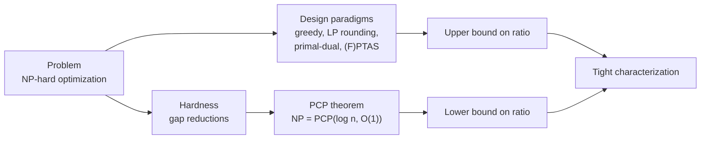
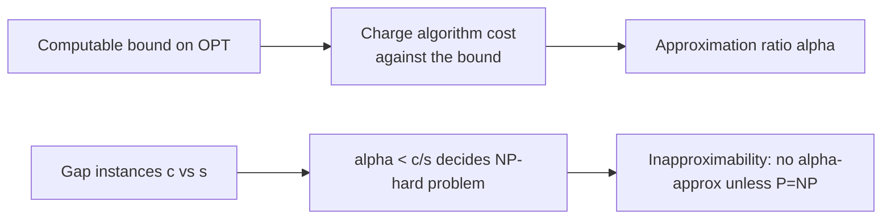
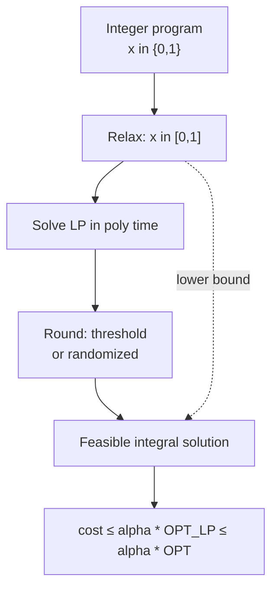
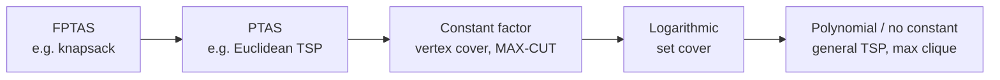
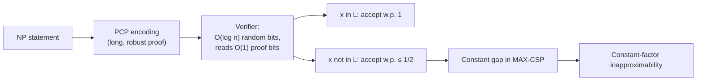

# Approximation Algorithms &amp; Hardness

[Advanced Topics](./) &raquo; Approximation Algorithms &amp; Hardness

<div class="advanced-note" markdown="1">
**Graduate-level research page.** This page develops the theory of approximation algorithms and the complementary theory of *inapproximability*: how to design polynomial-time algorithms with provable guarantees for NP-hard optimization problems, and how the PCP theorem certifies that for many problems no better guarantee is possible unless P = NP. **Prerequisites:** computational complexity (P, NP, NP-completeness), linear programming and LP duality, probability theory, and graph theory. For complexity-class background see the [Quantum Algorithms Research](../quantum-algorithms-research/) page's treatment of BQP and query complexity.
</div>

Most interesting optimization problems are NP-hard: under the standard assumption P &ne; NP, no polynomial-time algorithm finds an exact optimum on every instance. Approximation algorithms refuse to give up. They run in polynomial time and return a feasible solution that is provably within a guaranteed factor of optimal — a 2-approximation for vertex cover is never worse than twice the best possible, on *every* instance, with no probabilistic or average-case caveat. The deep and surprising counterpart is **hardness of approximation**: the PCP theorem and the reductions built on it show that for many problems, even approximating the optimum beyond a specific threshold is itself NP-hard. Together these two theories pin down, often exactly, how well each problem can be solved efficiently.

- **Guarantees, not heuristics.** An &alpha;-approximation bounds the worst case over all instances. This is a theorem about the algorithm, not an empirical claim about typical inputs.
- **Relax and round.** LP relaxation turns an integer program into a solvable continuous one; the rounding step converts the fractional optimum back to an integral solution while controlling the loss.
- **Hardness has a floor.** The PCP theorem reformulates NP as proofs checkable in a few random bits, which converts gap-producing reductions into inapproximability results — some ratios are provably the best possible.
- **A hierarchy of quality.** FPTAS &sub; PTAS &sub; constant-factor &sub; logarithmic &sub; polynomial. Where a problem sits in this hierarchy is often known exactly, matching algorithm and lower bound.

### How to Read This Page

The page is organized as a dialogue between two halves. The first half builds **positive results** — four design paradigms (greedy/combinatorial, LP rounding, primal-dual, and approximation schemes) each illustrated on a canonical problem. The second half builds **negative results** — the PCP theorem and the gap-reduction machinery that turn it into tight inapproximability bounds. The final section assembles a table where, problem by problem, the best algorithm and the matching hardness meet.



## Table of Contents
- [Approximation Ratios](#approximation-ratios)
- [Greedy and Combinatorial Algorithms](#greedy-and-combinatorial-algorithms)
- [LP Relaxation and Rounding](#lp-relaxation-and-rounding)
- [The Primal-Dual Method](#the-primal-dual-method)
- [Approximation Schemes: PTAS and FPTAS](#approximation-schemes-ptas-and-fptas)
- [Hardness of Approximation](#hardness-of-approximation)
- [The PCP Theorem](#the-pcp-theorem)
- [Inapproximability Results](#inapproximability-results)
- [Tight Characterizations](#tight-characterizations)

## Approximation Ratios

<div class="postulate-card" markdown="1">
#### Definition (Approximation Ratio)
Let $\Pi$ be an optimization problem with objective $\mathrm{cost}(\cdot)$ and let $\mathrm{OPT}(I)$ denote the optimal objective value on instance $I$. A polynomial-time algorithm $A$ is an **$\alpha$-approximation algorithm** if for every instance $I$ it returns a feasible solution $A(I)$ with
$$\frac{\mathrm{cost}(A(I))}{\mathrm{OPT}(I)} \leq \alpha \quad \text{(minimization)}, \qquad \frac{\mathrm{OPT}(I)}{\mathrm{cost}(A(I))} \leq \alpha \quad \text{(maximization)}.$$
With this convention $\alpha \geq 1$ always, and $\alpha = 1$ means the algorithm is exact.
</div>

**Intuition first.** The ratio is a *worst-case multiplicative guarantee*. A 2-approximation for a minimization problem promises that on no instance does the returned cost exceed twice the optimum — even though we typically cannot compute the optimum itself. The guarantee must therefore be proved indirectly, by relating the algorithm's output to a *lower bound* on $\mathrm{OPT}$ that the algorithm can see (for minimization), or an *upper bound* (for maximization). Identifying a good, efficiently computable bound is the central craft of the field.

**Why the ratio can be larger than 1 even for maximization.** Some texts define the maximization ratio as $\mathrm{cost}(A(I))/\mathrm{OPT}(I) \leq 1$ (a fraction). The two conventions are reciprocals; we use $\alpha \geq 1$ throughout so that "smaller is better" reads uniformly. A $\tfrac{1}{2}$-approximation for MAX-CUT under the fractional convention is a $2$-approximation here.

**Absolute vs. relative, and additive guarantees.** The definition above is *relative* (multiplicative). A few problems admit *additive* guarantees — e.g., edge coloring within $+1$ of optimum (Vizing's theorem) — but for NP-hard problems additive guarantees are rare, and a polynomial-time additive approximation often implies an exact algorithm by scaling, hence is itself NP-hard.

**Gap and inapproximability.** The hardness side is phrased through *gaps*. A reduction produces, from a decision problem, instances that are either "good" (optimum $\geq c$) or "bad" (optimum $\leq s$), with $c > s$. Any $\alpha$-approximation with $\alpha < c/s$ could distinguish the two cases and hence decide the original problem. If that problem is NP-hard, no such approximation exists unless P = NP. The ratio $c/s$ is the **inapproximability gap**.



## Greedy and Combinatorial Algorithms

The simplest design paradigm makes a locally optimal choice at each step and proves a global guarantee. The art is the *charging argument* that bounds total cost.

### Vertex Cover: a 2-Approximation by Maximal Matching

<div class="principle-card" markdown="1">
#### Problem (Minimum Vertex Cover)
Given a graph $G = (V, E)$, find a minimum-size set $S \subseteq V$ such that every edge has at least one endpoint in $S$.
</div>

**Algorithm (maximal matching).** Repeatedly pick any uncovered edge $(u, v)$, add **both** endpoints to the cover, and delete all edges incident to $u$ or $v$. Stop when no edges remain.

**Analysis.** The selected edges form a *matching* $M$ (they share no endpoint, since once an endpoint is taken its edges are deleted). Any vertex cover must contain at least one endpoint of each matched edge, and these endpoints are distinct, so $\mathrm{OPT} \geq |M|$. The algorithm outputs $2|M|$ vertices. Hence
$$\lvert S\rvert = 2\lvert M\rvert \leq 2\,\mathrm{OPT}.$$
This is a clean $2$-approximation. Remarkably, despite decades of effort no polynomial-time algorithm with ratio $2 - \epsilon$ for fixed $\epsilon > 0$ is known, and (see below) the Unique Games Conjecture predicts none exists.

**Why not the seemingly smarter greedy?** Repeatedly taking the *maximum-degree* vertex looks better but has ratio $\Theta(\log n)$ in the worst case — a cautionary tale that "greedier" is not "better."

### Set Cover: the $H_n$ Greedy Bound

<div class="principle-card" markdown="1">
#### Problem (Minimum Set Cover)
Given a universe $U$ of $n$ elements and a family $\mathcal{S} = \{S_1, \dots, S_m\}$ of subsets (optionally with costs $c_j$), find a minimum-cost subfamily whose union is $U$.
</div>

**Greedy algorithm.** Repeatedly pick the set maximizing *coverage per unit cost* — the set $S_j$ minimizing $c_j / |S_j \setminus C|$, where $C$ is the set of already-covered elements — until $C = U$.

**Theorem.** Greedy is an $H_n$-approximation, where $H_n = \sum_{k=1}^{n} 1/k = \ln n + O(1)$ is the $n$-th harmonic number.

**Proof (cost-sharing / charging).** When an element $e$ is first covered by chosen set $S_j$, charge it $\mathrm{price}(e) = c_j / |S_j \setminus C|$. The total algorithm cost equals $\sum_{e \in U} \mathrm{price}(e)$. Fix any set $S^\*$ in the optimal cover; order its elements $e_1, \dots, e_k$ by the time greedy covered them (latest first). At the moment $e_i$ is covered, $S^\*$ itself was an available candidate covering at least $i$ still-uncovered elements at cost $c(S^\*)$, so greedy's chosen price satisfies $\mathrm{price}(e_i) \leq c(S^\*)/i$. Summing,
$$\sum_{e \in S^\*} \mathrm{price}(e) \leq c(S^\*)\sum_{i=1}^{k}\frac{1}{i} = H_k \, c(S^\*) \leq H_n\, c(S^\*).$$
Summing over the optimal sets covers every element at least once, giving $\mathrm{ALG} \leq H_n \cdot \mathrm{OPT}$. $\blacksquare$

This $\ln n$ guarantee is *tight*: Feige (1998) proved that no $(1 - o(1))\ln n$-approximation exists unless NP has slightly superpolynomial-time algorithms.

```python
def greedy_set_cover(universe, subsets, costs):
    """Greedy set cover. Returns indices of chosen sets.

    universe : set of elements to cover
    subsets  : list of sets
    costs    : list of positive costs, aligned with subsets
    Guarantee: cost(ALG) <= H_n * OPT  (H_n = harmonic number).
    """
    uncovered = set(universe)
    chosen = []
    while uncovered:
        # pick the set with minimum cost per newly covered element
        best, best_eff = None, float("inf")
        for j, s in enumerate(subsets):
            new = len(s & uncovered)
            if new == 0:
                continue
            eff = costs[j] / new            # cost per new element
            if eff < best_eff:
                best, best_eff = j, eff
        if best is None:
            raise ValueError("universe not coverable by given subsets")
        chosen.append(best)
        uncovered -= subsets[best]
    return chosen
```

## LP Relaxation and Rounding

A powerful, general paradigm: write the problem as an *integer linear program* (ILP), drop the integrality constraints to get a polynomial-time-solvable *LP relaxation*, solve it to get a fractional optimum, and **round** the fractional solution to a feasible integral one while bounding the cost increase. The LP optimum is a lower bound (for minimization) on the integral optimum, which provides exactly the computable bound the ratio proof needs.

### The Integrality Gap

<div class="postulate-card" markdown="1">
#### Definition (Integrality Gap)
For a minimization problem with relaxation LP, the integrality gap is
$$\sup_{I}\ \frac{\mathrm{OPT}_{\mathrm{ILP}}(I)}{\mathrm{OPT}_{\mathrm{LP}}(I)}.$$
No rounding scheme that bounds its output against the LP value alone can beat the integrality gap.
</div>

### Vertex Cover via LP Rounding

The ILP uses $x_v \in \{0,1\}$ with constraint $x_u + x_v \geq 1$ for each edge, minimizing $\sum_v w_v x_v$. Relax to $x_v \in [0,1]$ and solve. **Threshold rounding:** include $v$ iff $x_v \geq \tfrac{1}{2}$.

**Analysis.** Every edge $(u,v)$ has $x_u + x_v \geq 1$, so at least one endpoint has $x \geq \tfrac{1}{2}$ and is rounded up — feasibility holds. For cost, rounding up at most doubles each variable's contribution: $\mathbf{1}[x_v \geq \tfrac12] \leq 2 x_v$. Hence
$$\sum_v w_v \mathbf{1}[x_v \geq \tfrac12] \leq 2\sum_v w_v x_v = 2\,\mathrm{OPT}_{\mathrm{LP}} \leq 2\,\mathrm{OPT}.$$
Another weighted $2$-approximation, now extending cleanly to arbitrary vertex weights where the matching argument needs care. The integrality gap of this LP is $2 - o(1)$ (the complete graph $K_n$ has LP value $n/2$ but integral value $n-1$), so no purely LP-based rounding beats $2$ here.

### Randomized Rounding (Set Cover)

For set cover, solve the LP, then for each set $S_j$ independently include it with probability $x_j$, repeating the whole process $O(\log n)$ times and taking the union. Each element is covered in one round with constant probability (its fractional coverage is $\geq 1$), so after $c\ln n$ rounds every element is covered with high probability, and the expected cost is $O(\log n)\cdot \mathrm{OPT}_{\mathrm{LP}}$ — recovering the $\Theta(\log n)$ guarantee through a completely different lens.



## The Primal-Dual Method

LP rounding solves the LP explicitly. The **primal-dual** schema avoids solving the LP at all: it grows a feasible *dual* solution and uses the dual to guide construction of an integral *primal* solution, charging primal cost against the dual objective. By weak LP duality, any feasible dual value is a lower bound on the primal optimum, so bounding primal cost by a multiple of the dual value yields the ratio. This typically gives fast *combinatorial* algorithms with no LP solver in the loop.

### Schema

1. Initialize primal $x = 0$ (infeasible) and dual $y = 0$ (feasible).
2. Raise dual variables until some dual constraint becomes tight; the corresponding primal variable is added to the solution.
3. Repeat until the primal is feasible.
4. Optionally apply a *reverse-delete* clean-up to remove redundant primal choices.

The ratio emerges from a counting argument: if each tight primal choice can be "paid for" by at most $\alpha$ units of dual it touches, then $\mathrm{primal} \leq \alpha \cdot (\text{dual value}) \leq \alpha \cdot \mathrm{OPT}$.

### Vertex Cover, Primal-Dual Form

The dual of the vertex-cover LP places a variable $y_e \geq 0$ on each edge with constraint $\sum_{e \ni v} y_e \leq w_v$ for every vertex $v$. Raise the $y_e$ uniformly; when $\sum_{e \ni v} y_e = w_v$ a vertex goes *tight* and is added to the cover. Each chosen vertex is paid for exactly by the dual mass on its incident edges, and each edge contributes to at most $2$ chosen vertices, giving the same $2$-approximation — but as a near-linear-time combinatorial algorithm needing no LP solver.

### Why Primal-Dual Matters

The primal-dual method generalizes far beyond this example. The classic $2$-approximation for the Steiner forest problem (Agrawal–Klein–Ravi, Goemans–Williamson) and many network-design approximations are primal-dual algorithms; the schema is the workhorse behind constant-factor results for problems where rounding an explicit LP is awkward.

```mermaid
sequenceDiagram
    participant D as Dual (lower bound)
    participant P as Primal (solution)
    Note over D,P: start: primal empty, dual zero
    D->>D: raise dual variables
    D->>P: a dual constraint goes tight -> add that primal element
    Note over D,P: repeat until primal feasible
    P->>P: reverse-delete redundant elements
    Note over D,P: primal cost &le; alpha * dual value &le; alpha * OPT
```

## Approximation Schemes: PTAS and FPTAS

For some problems we can approximate to *any* desired accuracy, trading running time for precision.

<div class="postulate-card" markdown="1">
#### Definitions (PTAS, FPTAS)
A **polynomial-time approximation scheme (PTAS)** is a family of algorithms that, given $\epsilon > 0$, returns a $(1+\epsilon)$-approximation in time polynomial in the input size $n$ for each fixed $\epsilon$ (the dependence on $\epsilon$ may be arbitrary, e.g. $n^{1/\epsilon}$).

A **fully polynomial-time approximation scheme (FPTAS)** is a PTAS whose running time is polynomial in *both* $n$ and $1/\epsilon$, e.g. $O(n^3/\epsilon)$.
</div>

An FPTAS is the gold standard short of an exact polynomial algorithm: arbitrarily good accuracy at a cost that degrades only polynomially in the precision. Strongly NP-hard problems cannot have an FPTAS (unless P = NP), because an FPTAS with $\epsilon$ small enough would solve them exactly in polynomial time.

### FPTAS for the Knapsack Problem

**Problem.** Items with values $v_i$ and weights $w_i$; maximize total value subject to a weight budget $W$.

**Exact dynamic program.** $\mathrm{DP}[i][p]$ = minimum weight achieving exactly value $p$ using the first $i$ items. This runs in $O(n \cdot V)$ where $V = \sum_i v_i$ — pseudo-polynomial, because $V$ can be exponential in the input length.

**The FPTAS trick: scale the values.** Let $v_{\max} = \max_i v_i$ and set a scaling factor
$$K = \frac{\epsilon\, v_{\max}}{n}.$$
Replace each value by $\tilde v_i = \lfloor v_i / K \rfloor$ and run the exact DP on the rounded values. The DP now runs in $O(n^2 \cdot v_{\max}/(\epsilon\, v_{\max})) = O(n^3/\epsilon)$ time — polynomial in $n$ and $1/\epsilon$.

**Accuracy.** Rounding each value down loses at most $K$ per item, so at most $nK = \epsilon\, v_{\max}$ total. Since $\mathrm{OPT} \geq v_{\max}$ (any single item fits or is discarded a priori), the loss is at most $\epsilon\,\mathrm{OPT}$, giving a $(1-\epsilon)$ value guarantee. This is a genuine FPTAS. $\blacksquare$

```python
def knapsack_fptas(values, weights, W, eps):
    """(1 - eps)-approximation for 0/1 knapsack in O(n^3 / eps).

    Scale values by K = eps * vmax / n, then run the exact
    'min weight to reach value p' DP on the rounded values.
    """
    n = len(values)
    vmax = max(values)
    K = eps * vmax / n if vmax > 0 else 1.0
    scaled = [int(v // K) for v in values]      # rounded-down values
    Vtot = sum(scaled)

    INF = float("inf")
    # dp[p] = minimum weight achieving scaled-value exactly p
    dp = [INF] * (Vtot + 1)
    dp[0] = 0
    for i in range(n):
        sv, w = scaled[i], weights[i]
        for p in range(Vtot, sv - 1, -1):       # 0/1: iterate downward
            if dp[p - sv] + w < dp[p]:
                dp[p] = dp[p - sv] + w
    # best achievable scaled value within the weight budget
    best_p = max(p for p in range(Vtot + 1) if dp[p] <= W)
    # recover true value of that solution (re-run trace omitted for brevity)
    return best_p, best_p * K                    # approx scaled & real value
```

### When a PTAS but no FPTAS Exists

Euclidean TSP admits a PTAS (Arora 1998; Mitchell 1999) via a randomized recursive dissection of the plane, but being strongly NP-hard it has no FPTAS. Many geometric and planar-graph problems share this profile — schemes exploiting locality, not value-scaling.

### The Approximation Hierarchy



Each containment is strict (under P &ne; NP), and a problem's place is usually *known*, with matching algorithm and hardness result. The right column is the subject of the rest of the page.

## Hardness of Approximation

A natural question: if a problem is NP-hard to solve exactly, is it also hard to *approximate*? Not necessarily — knapsack is NP-hard yet has an FPTAS. The hardness of approximation must be proved separately, and the tool is the **gap-producing reduction**.

<div class="principle-card" markdown="1">
#### Gap Reductions
To show that $\alpha$-approximating a maximization problem $\Pi$ is NP-hard, reduce an NP-hard decision problem (say 3-SAT) to instances of $\Pi$ such that:
- **YES** instances map to $\Pi$-instances with $\mathrm{OPT} \geq c$;
- **NO** instances map to $\Pi$-instances with $\mathrm{OPT} \leq s$, with $s < c$.

Then any $\alpha$-approximation with $\alpha < c/s$ would let us tell YES from NO, deciding the NP-hard problem. So no such approximation exists unless P = NP. The ratio $c/s$ is the hardness gap.
</div>

The obstacle: ordinary Karp reductions do not preserve gaps. A standard 3-SAT-to-MAX-3-SAT reduction makes unsatisfiable formulas leave only *one* clause unsatisfiable out of $m$ — a vanishing gap $1 - 1/m \to 1$ that proves nothing about constant-factor hardness. Manufacturing a *constant* gap that survives is exactly what the PCP theorem provides.

## The PCP Theorem

The Probabilistically Checkable Proofs theorem is one of the deepest results in complexity theory and the engine of modern inapproximability.

<div class="postulate-card" markdown="1">
#### Theorem (PCP Theorem; Arora–Safra and Arora–Lund–Motwani–Sudan–Szegedy, 1992–1998)
$$\mathrm{NP} = \mathrm{PCP}(O(\log n),\, O(1)).$$
Every language in NP has a proof that a randomized verifier can check, using only $O(\log n)$ random bits and reading only $O(1)$ bits of the proof, such that:
- **Completeness:** if $x$ is in the language, some proof is accepted with probability $1$;
- **Soundness:** if $x$ is not, every proof is accepted with probability at most $\tfrac{1}{2}$.
</div>

**What this says.** Any NP statement can be rewritten so that a verifier, by sampling a *constant number* of bits of a (possibly long) proof and tossing $O(\log n)$ coins, catches every false claim with constant probability while always accepting true ones. The $O(\log n)$ random bits mean there are only polynomially many possible "queries," so the verifier's behavior can be written out explicitly in polynomial time — which is what makes it a reduction.

**Equivalent constraint-satisfaction form.** The PCP theorem is equivalent to: it is NP-hard to distinguish satisfiable instances of a constant-arity constraint-satisfaction problem from instances where at most a $(1-\delta)$ fraction of constraints can be satisfied, for some fixed $\delta > 0$. This is precisely a *constant gap* in MAX-CSP, the missing ingredient from the previous section.



**Hardness of MAX-3-SAT.** Applying the constraint form to 3-SAT: the PCP theorem implies there is a constant $\rho < 1$ such that it is NP-hard to distinguish satisfiable 3-SAT formulas from those where at most a $\rho$ fraction of clauses are simultaneously satisfiable. Hence MAX-3-SAT has no PTAS unless P = NP — a constant lower bound on its approximability.

**Håstad's optimal threshold.** Håstad (2001), via a refined PCP with three-bit "long-code" tests, pinned the constant exactly: MAX-3-SAT is NP-hard to approximate within $\tfrac{7}{8} + \epsilon$ for any $\epsilon > 0$. Since a *random* assignment satisfies each 3-clause with probability $\tfrac{7}{8}$ and hence $\tfrac{7}{8}$ of all clauses in expectation (a trivial $\tfrac{7}{8}$-approximation), this is **tight** — the naive algorithm is optimal.

## Inapproximability Results

Building on the PCP theorem, sharp thresholds are now known for the canonical problems.

### Set Cover: $(1-o(1))\ln n$

Feige (1998) showed, via a multi-prover PCP, that set cover cannot be approximated within $(1 - o(1))\ln n$ unless every problem in NP has algorithms running in time $n^{O(\log\log n)}$. Dinur and Steurer (2014) strengthened the assumption to the standard P &ne; NP. Combined with the greedy $H_n = \ln n + O(1)$ upper bound, set cover's approximability is settled at $\Theta(\log n)$ — algorithm and lower bound meet.

### Max-Clique: $n^{1-\epsilon}$

Håstad (1999), refined by Zuckerman (2007) to a P &ne; NP assumption, showed that maximum clique cannot be approximated within $n^{1-\epsilon}$ for any $\epsilon > 0$. Since the trivial algorithm "output one vertex" is an $n$-approximation, this is essentially the worst possible: clique is *completely* inapproximable to within any nontrivial factor.

### Vertex Cover: $1.36$ Unconditionally, $2$ under UGC

Dinur and Safra (2005) proved vertex cover is NP-hard to approximate within $1.3606$ unconditionally. The natural conjecture is that the matching/LP $2$-approximation is optimal, and indeed Khot and Regev (2008) showed that under the **Unique Games Conjecture** (UGC), vertex cover is hard to approximate within $2 - \epsilon$ for every $\epsilon > 0$.

<div class="postulate-card" markdown="1">
#### The Unique Games Conjecture (Khot, 2002)
It is NP-hard, for every $\delta > 0$, to distinguish instances of the *unique games* constraint problem in which a $(1-\delta)$ fraction of constraints are satisfiable from those in which at most a $\delta$ fraction are. The UGC, if true, implies *optimal* inapproximability thresholds for a wide range of problems (vertex cover, MAX-CUT, and every MAX-CSP simultaneously), unifying the field — but it remains open, and is the central unproven hypothesis of modern hardness theory.
</div>

### Max-Cut: the GW Constant and UGC-Optimality

<div class="principle-card" markdown="1">
#### Problem (MAX-CUT)
Partition the vertices of a weighted graph into two sides to maximize the total weight of edges crossing the cut.
</div>

**The Goemans–Williamson algorithm.** MAX-CUT's celebrated approximation uses *semidefinite programming* (SDP), a relaxation strictly more powerful than LP. Assign each vertex a unit vector $\mathbf{v}_i$ on the sphere maximizing the SDP objective $\sum_{(i,j)} w_{ij}\,\tfrac{1 - \langle \mathbf{v}_i, \mathbf{v}_j\rangle}{2}$, then **round by a random hyperplane**: pick a random direction $\mathbf{r}$ and cut according to $\operatorname{sign}\langle \mathbf{v}_i, \mathbf{r}\rangle$. An edge $(i,j)$ is cut with probability $\theta_{ij}/\pi$, where $\theta_{ij}$ is the angle between $\mathbf{v}_i$ and $\mathbf{v}_j$. Comparing this to the SDP contribution gives a ratio of
$$\alpha_{\mathrm{GW}} = \min_{0 \leq \theta \leq \pi} \frac{\theta/\pi}{(1 - \cos\theta)/2} \approx 0.87856.$$
So Goemans–Williamson is a $0.878$-approximation (an $\approx 1.138$-factor in the $\alpha \geq 1$ convention) — a striking improvement over the trivial $\tfrac{1}{2}$ from a random cut.

**Matching hardness.** Håstad showed MAX-CUT is NP-hard to approximate within $\tfrac{16}{17} \approx 0.941$ unconditionally. Far more strikingly, Khot–Kindler–Mossel–O'Donnell (2007) proved that **under the UGC, $\alpha_{\mathrm{GW}}$ is optimal** — no polynomial-time algorithm beats the Goemans–Williamson constant. This is the canonical demonstration of the UGC's reach: a specific, irrational, geometrically-derived constant is conjecturally the exact approximation threshold.

```python
import numpy as np

def goemans_williamson_round(vectors, edges, weights, trials=20, rng=None):
    """Random-hyperplane rounding for MAX-CUT given SDP vectors.

    vectors : (n, d) array of unit vectors from solving the SDP relaxation
    edges   : list of (i, j)
    weights : list aligned with edges
    Returns the best +/-1 assignment found and its cut weight.
    Expected ratio vs OPT is the GW constant ~0.87856.
    """
    rng = rng or np.random.default_rng()
    n, d = vectors.shape
    best_assign, best_val = None, -np.inf
    for _ in range(trials):
        r = rng.standard_normal(d)                 # random hyperplane normal
        assign = np.sign(vectors @ r)              # +/-1 side per vertex
        val = sum(w for (i, j), w in zip(edges, weights)
                  if assign[i] != assign[j])       # crossing-edge weight
        if val > best_val:
            best_assign, best_val = assign, val
    return best_assign, best_val
```

## Tight Characterizations

The interplay of algorithm and hardness produces, for many problems, an exact picture. The table summarizes the canonical cases discussed above.

| Problem | Best known ratio | Hardness lower bound | Status |
|---|---|---|---|
| Knapsack | FPTAS ($1+\epsilon$) | strongly-NP-hard problems have none | tight: FPTAS optimal |
| Euclidean TSP | PTAS ($1+\epsilon$) | no FPTAS (strongly NP-hard) | PTAS is best possible class |
| Vertex Cover | $2$ (matching / LP / primal-dual) | $1.36$ (P&ne;NP); $2-\epsilon$ under UGC | tight under UGC |
| MAX-CUT | $0.878$ (Goemans–Williamson SDP) | $16/17$ (P&ne;NP); GW-optimal under UGC | tight under UGC |
| MAX-3-SAT | $7/8$ (random assignment) | $7/8 + \epsilon$ (Håstad, P&ne;NP) | tight unconditionally |
| Set Cover | $\ln n + O(1)$ (greedy) | $(1-o(1))\ln n$ (Dinur–Steurer) | tight: $\Theta(\log n)$ |
| Max-Clique | $n$ (trivial) | $n^{1-\epsilon}$ (Zuckerman) | tight: fully inapproximable |

**Reading the table.** Three regimes appear. *Tractable-to-approximate* problems (knapsack, Euclidean TSP) admit schemes. *Constant-factor* problems (vertex cover, MAX-CUT, MAX-3-SAT) have a finite optimal ratio, sometimes proven unconditionally (MAX-3-SAT) and sometimes only under UGC. *Strongly inapproximable* problems (set cover at $\Theta(\log n)$, clique at $n^{1-\epsilon}$) resist any good factor. The recurring theme is that PCP-based gap reductions, refined by the long-code tests of Håstad and the Unique Games framework of Khot, push the lower bounds up until they *meet* the best algorithm.

## Open Problems and Research Frontiers

- **The Unique Games Conjecture.** Its resolution would settle optimal approximability for vertex cover, MAX-CUT, and every MAX-CSP at once. The 2-to-2 Games theorem (Khot–Minzer–Safra, 2018) proved a closely related statement, strong evidence for but not yet a proof of the UGC.
- **Vertex cover below $2$.** Is there a $(2-\epsilon)$-approximation? UGC says no; an unconditional proof or a clever algorithm would be a landmark.
- **Subexponential approximation.** For problems with no good polynomial-time approximation, what ratios are achievable in time $2^{n^{c}}$ for $c < 1$? This connects to the Exponential Time Hypothesis.
- **Approximation via convex hierarchies.** The Sum-of-Squares (Lasserre) hierarchy generalizes LP and SDP relaxations; understanding its power and limits is a central program in modern algorithm design.

## Key Takeaways

- **Ratios are worst-case theorems.** An &alpha;-approximation is a proof bounding cost against an efficiently computable bound on OPT, on every instance — not an empirical average-case claim.
- **Four paradigms.** Greedy/combinatorial, LP relaxation-and-rounding, primal-dual, and approximation schemes cover most positive results. The integrality gap limits any LP-only rounding.
- **FPTAS is the gold standard.** Arbitrary accuracy in time polynomial in n and 1/&epsilon;. Strongly NP-hard problems cannot have one, so they top out at a PTAS or a constant factor.
- **PCP powers hardness.** NP = PCP(log n, O(1)) creates the constant gaps that ordinary reductions cannot, turning NP-hardness into inapproximability.
- **Many thresholds are tight.** MAX-3-SAT at 7/8 and set cover at &Theta;(log n) are settled unconditionally; vertex cover at 2 and MAX-CUT at the GW constant are tight under the UGC.
- **UGC unifies the field.** The Unique Games Conjecture, still open, would simultaneously pin the optimal approximation ratio for a vast family of CSPs.

## See Also

### Related Advanced Topics
- **[Distributed Systems Theory](../distributed-systems-theory/)** - Impossibility results and complexity bounds in a different setting
- **[Quantum Algorithms Research](../quantum-algorithms-research/)** - Complexity classes (BQP) and query complexity lower bounds
- **[AI Mathematics](../ai-mathematics/)** - Optimization landscapes, convex relaxations, and learning-theoretic hardness
- **[Monorepo Strategies](../monorepo/)** - Build-graph and dependency optimization in practice

### Foundational Connections
- **NP-completeness and reductions** - The complexity backdrop for every hardness result here
- **Linear and semidefinite programming** - The relaxations behind LP rounding, primal-dual, and Goemans–Williamson
- **The PCP theorem** - The probabilistic proof-checking result underlying modern inapproximability

### Practical Documentation
- **[Technology Documentation](../../technology/)** - Applied algorithm and systems engineering
- **[Mathematical Reference](../../reference/)** - Formulas, constants, and notation

## References

1. Vazirani, V. V. (2001). *Approximation Algorithms*. Springer.
2. Williamson, D. P., & Shmoys, D. B. (2011). *The Design of Approximation Algorithms*. Cambridge University Press.
3. Arora, S., & Barak, B. (2009). *Computational Complexity: A Modern Approach*. Cambridge University Press.
4. Arora, S., Lund, C., Motwani, R., Sudan, M., & Szegedy, M. (1998). "Proof Verification and the Hardness of Approximation Problems." *JACM*.
5. Håstad, J. (2001). "Some Optimal Inapproximability Results." *JACM*.
6. Goemans, M. X., & Williamson, D. P. (1995). "Improved Approximation Algorithms for Maximum Cut and Satisfiability Problems Using Semidefinite Programming." *JACM*.
7. Dinur, I., & Steurer, D. (2014). "Analytical Approach to Parallel Repetition." *STOC*.
8. Khot, S. (2002). "On the Power of Unique 2-Prover 1-Round Games." *STOC*.

---

*Note: This page contains advanced theoretical content for algorithms and complexity researchers. For applied algorithmic work, see the [main technology documentation](../../technology/).*
