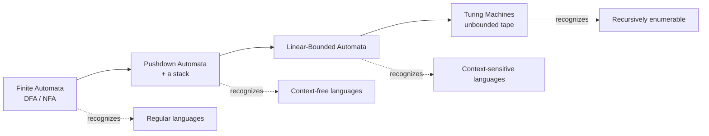
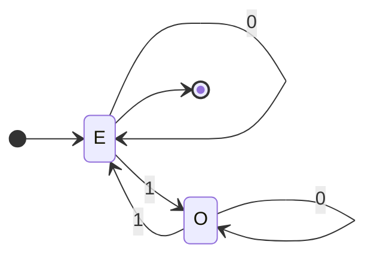
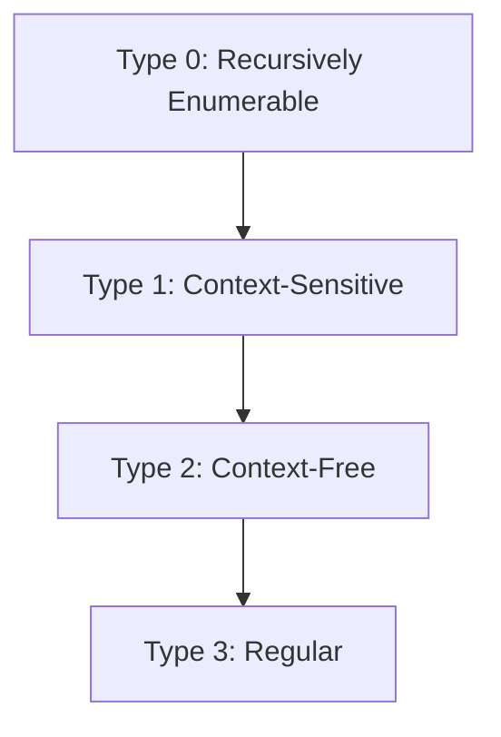

# Automata Theory &amp; Formal Languages

[Advanced Topics](./) &raquo; Automata Theory &amp; Formal Languages

**Graduate-level research page.** This is a rigorous treatment of automata, grammars, and computability intended for theoretical computer scientists, mathematicians, and graduate students. **Prerequisites:** discrete mathematics, set theory, mathematical induction, and basic logic. For applied uses of regular expressions or parsing instead, see the [Technology Hub](../../technology/).

Automata theory asks a deceptively simple question: **what can a machine compute, and what can it never compute, no matter how clever the program?** The answer is a strict hierarchy of machine models — finite automata, pushdown automata, and Turing machines — each strictly more powerful than the last, each recognizing exactly one tier of a corresponding hierarchy of formal languages. The crown jewel is negative: there are perfectly well-posed questions (does this program halt?) that *no* machine can decide. This page develops the machines, the grammars they correspond to, the tools that pin down their exact power, and the impossibility results that bound computation itself.

- **Machines = languages.** Each model of computation recognizes exactly one class of languages. Studying machines and studying grammars are two views of the same hierarchy.
- **Memory is power.** Finite automata have no memory, pushdown automata have a stack, Turing machines have unbounded tape. Each extra memory model strictly widens what is recognizable.
- **Pumping reveals limits.** The pumping lemmas exploit the pigeonhole principle: any long enough accepted string must contain a repeatable substructure, which proves certain languages are *not* regular or context-free.
- **Undecidability is real.** The halting problem and Rice's theorem show that nontrivial questions about program behavior are algorithmically unanswerable — a hard ceiling on what software can ever verify.

### How to Read This Page

The content follows the Chomsky hierarchy from the bottom up: weakest machines first, strongest last. Each tier introduces a machine model, the equivalent grammar, the tool used to delimit its power, and a worked example. The final sections cross the line into uncomputability, where the questions stop being "how do we recognize this?" and become "can any machine decide this at all?"

## Table of Contents
- [Languages, Alphabets, and Grammars](#languages-alphabets-and-grammars)
- [Finite Automata: DFA and NFA](#finite-automata-dfa-and-nfa)
- [Regular Languages and Regular Expressions](#regular-languages-and-regular-expressions)
- [The Pumping Lemma for Regular Languages](#the-pumping-lemma-for-regular-languages)
- [Context-Free Grammars and Pushdown Automata](#context-free-grammars-and-pushdown-automata)
- [The Pumping Lemma for Context-Free Languages](#the-pumping-lemma-for-context-free-languages)
- [The Chomsky Hierarchy](#the-chomsky-hierarchy)
- [Turing Machines](#turing-machines)
- [Decidability and the Halting Problem](#decidability-and-the-halting-problem)
- [Rice's Theorem](#rices-theorem)

## Languages, Alphabets, and Grammars

The entire subject is built on three primitives.

#### Definitions (alphabet, string, language)
An **alphabet** $\Sigma$ is a finite, non-empty set of symbols. A **string** over $\Sigma$ is a finite sequence of symbols; the empty string is written $\varepsilon$. The set of all strings over $\Sigma$ is the *Kleene closure* $\Sigma^{*}$. A **language** $L$ is any subset $L \subseteq \Sigma^{*}$.

Because $\Sigma^{*}$ is countably infinite but the set of *all* languages is the power set $2^{\Sigma^{*}}$, which is uncountable, while there are only countably many programs/machines, a pure cardinality argument already guarantees that **most languages are not recognizable by any machine** before we have even defined a machine. Automata theory is the study of *which* languages live on the recognizable side of that line.

A **grammar** generates a language. Formally a grammar is a 4-tuple $G = (V, \Sigma, R, S)$ where $V$ is a finite set of variables (non-terminals), $\Sigma$ is the terminal alphabet (disjoint from $V$), $S \in V$ is the start symbol, and $R$ is a finite set of production rules $\alpha \to \beta$. The language $L(G)$ is the set of terminal strings derivable from $S$ by repeatedly applying rules. Restricting the *shape* of the rules yields the four tiers of the Chomsky hierarchy developed below.

## Finite Automata: DFA and NFA

A finite automaton is a machine with finitely many states and **no auxiliary memory** — it reads its input once, left to right, and its only "memory" is which of its finite states it currently occupies.

### Deterministic Finite Automata (DFA)

#### Definition (DFA)
A **deterministic finite automaton** is a 5-tuple $M = (Q, \Sigma, \delta, q_0, F)$ where $Q$ is a finite set of states, $\Sigma$ is the input alphabet, $\delta : Q \times \Sigma \to Q$ is the transition function, $q_0 \in Q$ is the start state, and $F \subseteq Q$ is the set of accepting states.

Extend $\delta$ to strings by $\hat{\delta}(q, \varepsilon) = q$ and $\hat{\delta}(q, wa) = \delta(\hat{\delta}(q, w), a)$. The machine **accepts** $w$ iff $\hat{\delta}(q_0, w) \in F$, and the language recognized is

$$L(M) = \{\, w \in \Sigma^{*} \mid \hat{\delta}(q_0, w) \in F \,\}.$$

**Example.** A DFA over $\Sigma = \{0, 1\}$ accepting strings with an even number of $1$s uses two states $E$ (even, accepting) and $O$ (odd). Reading a $0$ self-loops; reading a $1$ toggles.

### Nondeterministic Finite Automata (NFA)

An **NFA** loosens $\delta$ to return a *set* of possible next states and may take $\varepsilon$-moves: $\delta : Q \times (\Sigma \cup \{\varepsilon\}) \to 2^{Q}$. An NFA accepts $w$ if *some* sequence of choices leads to an accepting state — existential acceptance.

NFAs are often far smaller and easier to design (for example, "contains the substring $abc$" is trivial nondeterministically), yet they recognize exactly the same class of languages as DFAs.

#### Theorem (Subset / Rabin–Scott construction)
For every NFA there is a DFA recognizing the same language. The DFA's states are subsets of the NFA's states, so an NFA with $n$ states converts to a DFA with at most $2^{n}$ states, and this exponential blow-up is tight in the worst case.

**Construction.** Given NFA $N = (Q, \Sigma, \delta, q_0, F)$, build DFA $D = (2^{Q}, \Sigma, \delta', S_0, F')$ where $S_0 = E(\{q_0\})$ is the $\varepsilon$-closure of the start state, $\delta'(S, a) = E\!\left(\bigcup_{q \in S} \delta(q, a)\right)$, and $F' = \{\, S \mid S \cap F \neq \varnothing \,\}$. Each DFA state tracks "the set of NFA states reachable so far," which is exactly what an existential simulation must remember.

## Regular Languages and Regular Expressions

The languages recognized by finite automata are the **regular languages**. They admit three equivalent characterizations, and the equivalence is one of the foundational results of the field.

#### Kleene's Theorem
For a language $L$, the following are equivalent: (1) $L$ is recognized by some DFA; (2) $L$ is recognized by some NFA; (3) $L$ is described by a regular expression; (4) $L$ is generated by a right-linear (regular) grammar.

**Regular expressions** over $\Sigma$ are built inductively: $\varnothing$, $\varepsilon$, and each $a \in \Sigma$ are regular expressions, and if $R$ and $S$ are, then so are $R \mid S$ (union), $RS$ (concatenation), and $R^{*}$ (Kleene star). Their semantics:

$$L(R \mid S) = L(R) \cup L(S), \qquad L(RS) = L(R)\, L(S), \qquad L(R^{*}) = \bigcup_{i \geq 0} L(R)^{i}.$$

Two directions establish the equivalence. **Regexp $\to$ NFA** is *Thompson's construction*, which recursively wires together small $\varepsilon$-NFA gadgets for union, concatenation, and star. **NFA $\to$ regexp** is *state elimination* (the Kleene/McNaughton–Yamada algorithm), which rips out states one at a time, relabeling the remaining transitions with regular expressions until a single arrow remains.

### Closure properties

The regular languages are closed under union, concatenation, Kleene star, intersection, complement, reversal, and homomorphism. Complement is immediate from a *complete* DFA — just swap accepting and non-accepting states; intersection follows via the **product construction** $M_1 \times M_2$, which simulates both DFAs in lockstep on state pairs $(q, r)$. These closure properties are not mere curiosities: they are working tools, e.g. proving non-regularity by intersecting with a regular language to isolate a known non-regular core.

### Minimization and the Myhill–Nerode theorem

For every regular language there is a *unique* minimal DFA (up to renaming of states). The structural reason is an equivalence relation on strings.

#### Myhill–Nerode Theorem
Define $x \equiv_L y$ iff for all $z$, $xz \in L \Leftrightarrow yz \in L$. Then $L$ is regular **iff** $\equiv_L$ has finitely many equivalence classes, and that number equals the number of states in the minimal DFA.

This is both a minimization recipe (Hopcroft's algorithm merges equivalent states in $O(n \log n)$) and a *lower-bound* technique: exhibiting infinitely many pairwise-distinguishable strings proves a language is not regular, often more cleanly than the pumping lemma.

## The Pumping Lemma for Regular Languages

The pumping lemma is the classic tool for proving a language is **not** regular. It is a consequence of the pigeonhole principle: a DFA with $p$ states, reading a string of length $\geq p$, must revisit some state, creating a loop that can be traversed any number of times.

#### Pumping Lemma (regular languages)
If $L$ is regular, there exists a *pumping length* $p \geq 1$ such that every $w \in L$ with $\lvert w \rvert \geq p$ can be written $w = xyz$ with (i) $\lvert y \rvert \geq 1$, (ii) $\lvert xy \rvert \leq p$, and (iii) $xy^{i}z \in L$ for all $i \geq 0$.

**Worked example: $L = \{\, a^{n} b^{n} \mid n \geq 0 \,\}$ is not regular.** Suppose it were, with pumping length $p$. Take $w = a^{p} b^{p} \in L$. By the lemma $w = xyz$ with $\lvert xy \rvert \leq p$, so $y$ consists entirely of $a$'s, say $y = a^{k}$ with $k \geq 1$. Then

$$xy^{2}z = a^{p+k}\, b^{p},$$

which has more $a$'s than $b$'s and is therefore not in $L$ — contradicting condition (iii). Hence $L$ is not regular.

**Caution.** The pumping lemma is a *necessary*, not sufficient, condition for regularity: some non-regular languages still satisfy it. For an iff characterization use Myhill–Nerode. Phrase pumping-lemma proofs as a two-player game — the adversary picks $p$, you pick $w$, the adversary splits $xyz$ respecting the constraints, and you pick the pumping count $i$ that breaks membership.

## Context-Free Grammars and Pushdown Automata

Adding a single **stack** to a finite automaton jumps us up the hierarchy to the context-free languages — exactly the languages of balanced nesting, the backbone of programming-language syntax.

### Context-Free Grammars (CFG)

A **context-free grammar** restricts every production to the form $A \to \beta$ with a *single* variable $A \in V$ on the left and $\beta \in (V \cup \Sigma)^{*}$ on the right. The "context-free" name is because $A$ may be rewritten regardless of its surrounding context.

**Example.** Balanced parentheses are generated by $S \to (S)\,S \mid \varepsilon$. The arithmetic-expression grammar

$$E \to E + T \mid T, \qquad T \to T \times F \mid F, \qquad F \to (E) \mid \mathrm{id}$$

builds in operator precedence and associativity through its layered non-terminals — the template every expression parser follows.

A **derivation** is *ambiguous* if some string has two distinct parse trees (equivalently two distinct leftmost derivations). Ambiguity matters in practice: an ambiguous grammar for a programming language admits multiple interpretations of the same source. Some context-free languages are *inherently ambiguous* — no unambiguous grammar exists for them.

### Pushdown Automata (PDA)

#### Definition (PDA)
A **pushdown automaton** is a 7-tuple $M = (Q, \Sigma, \Gamma, \delta, q_0, Z_0, F)$ where $\Gamma$ is the stack alphabet, $Z_0 \in \Gamma$ is the initial stack symbol, and $\delta : Q \times (\Sigma \cup \{\varepsilon\}) \times \Gamma \to 2^{\,Q \times \Gamma^{*}}$ maps a state, input (or $\varepsilon$), and stack-top to a set of (next state, replacement string) pairs.

The stack gives a PDA *unbounded but disciplined* memory: it can remember an arbitrary count by pushing markers and matching them on the way down. That is exactly what recognizing $a^{n} b^{n}$ requires — push an $a$ for each $a$ read, pop one for each $b$, accept iff the stack empties exactly when input ends.

#### Theorem (PDA = CFG)
A language is context-free **iff** it is recognized by some (nondeterministic) pushdown automaton. The grammar-to-PDA direction builds a one-state PDA that simulates leftmost derivations on the stack; the PDA-to-grammar direction introduces variables $[q\,A\,r]$ tracking "go from state $q$ to state $r$ net-popping $A$."

A crucial subtlety: **nondeterministic** PDAs are strictly more powerful than deterministic ones. The deterministic context-free languages (DCFLs) — the practically important class, since they admit efficient $O(n)$ LR parsing — are a proper subset of the CFLs. The canonical separator is $\{\, ww^{R} \mid w \in \Sigma^{*} \,\}$ (even-length palindromes), which a nondeterministic PDA recognizes by guessing the midpoint but no DPDA can.

### Chomsky Normal Form and parsing

Every CFG can be converted to **Chomsky Normal Form** (all rules $A \to BC$ or $A \to a$, plus $S \to \varepsilon$ if needed). CNF makes parse trees binary and powers the **CYK algorithm**, which decides membership in $O(n^{3} \lvert G \rvert)$ time by dynamic programming over substrings — filling a table where entry $(i, j)$ records which non-terminals derive the substring from position $i$ of length $j$.

## The Pumping Lemma for Context-Free Languages

Just as finite automata have a pumping lemma, so do PDAs/CFGs — but now *two* substrings pump in tandem, reflecting the two sides of a balanced parse subtree that repeats.

#### Pumping Lemma (context-free languages)
If $L$ is context-free, there is a pumping length $p$ such that every $w \in L$ with $\lvert w \rvert \geq p$ factors as $w = uvxyz$ with (i) $\lvert vy \rvert \geq 1$, (ii) $\lvert vxy \rvert \leq p$, and (iii) $u v^{i} x y^{i} z \in L$ for all $i \geq 0$.

The two pumped pieces $v$ and $y$ arise because a sufficiently deep parse tree must repeat a non-terminal on some root-to-leaf path; the subtree between the two occurrences can be excised or duplicated, pumping the *frontier on both sides* of the inner subtree simultaneously.

**Worked example: $L = \{\, a^{n} b^{n} c^{n} \mid n \geq 0 \,\}$ is not context-free.** Take $w = a^{p} b^{p} c^{p}$. In any split $uvxyz$ with $\lvert vxy \rvert \leq p$, the window $vxy$ spans at most two of the three symbol-blocks, so $v$ and $y$ together miss at least one of $a, b, c$. Pumping to $i = 2$ then increases the counts of at most two symbols, breaking the equality $\#a = \#b = \#c$. Hence $L \notin \text{CFL}$ — establishing that counting three things in lockstep already exceeds a single stack's power.

## The Chomsky Hierarchy

Restricting grammar rule shapes yields four nested language classes, each matched to a machine model. This is the organizing skeleton of the whole subject.

| Type | Grammar | Rule restriction | Machine | Language class |
|------|---------|------------------|---------|----------------|
| 3 | Regular | $A \to aB$ or $A \to a$ (right-linear) | Finite automaton | Regular |
| 2 | Context-free | $A \to \beta$ | Pushdown automaton | Context-free |
| 1 | Context-sensitive | $\alpha A \beta \to \alpha \gamma \beta$, $\lvert \gamma \rvert \geq 1$ | Linear-bounded automaton | Context-sensitive |
| 0 | Unrestricted | $\alpha \to \beta$ (any) | Turing machine | Recursively enumerable |

The containments are **strict**: regular $\subsetneq$ context-free $\subsetneq$ context-sensitive $\subsetneq$ recursively enumerable. The pumping lemmas furnish the first two separations ($a^{n}b^{n}$ separates type 3 from 2; $a^{n}b^{n}c^{n}$ separates type 2 from 1, since the latter *is* context-sensitive). The final separation is provided by undecidability — the recursively enumerable languages include sets like the halting language that no context-sensitive (hence decidable) grammar can capture.

A note on terminology: the **recursive** (decidable) languages sit strictly between context-sensitive and recursively enumerable but are *not* one of Chomsky's four grammar tiers, because they have no purely syntactic grammar characterization — they are defined by the *semantic* property that a Turing machine halts on every input.

## Turing Machines

The Turing machine is the standard formalization of "effective computation." It is a finite-control machine equipped with an unbounded tape it can both read and write while moving in either direction — the unrestricted memory model at the top of the hierarchy.

#### Definition (Turing machine)
A **Turing machine** is a 7-tuple $M = (Q, \Sigma, \Gamma, \delta, q_0, q_{\text{accept}}, q_{\text{reject}})$ where $\Gamma \supseteq \Sigma$ is the tape alphabet (including a blank symbol $\sqcup \in \Gamma \setminus \Sigma$), and $\delta : Q \times \Gamma \to Q \times \Gamma \times \{L, R\}$ reads the current cell, writes a symbol, and moves the head left or right.

A *configuration* captures the full machine state: tape contents, head position, and current control state. $M$ **accepts** $w$ if some run reaches $q_{\text{accept}}$; it may instead reject or **loop forever**. The possibility of looping is the entire source of the theory's deepest results.

- A language is **recursively enumerable** (Turing-recognizable) if some TM accepts exactly its strings — but may loop on non-members.
- A language is **recursive** (decidable) if some TM *halts on every input*, accepting members and rejecting non-members.

#### Robustness of the model
Multi-tape, nondeterministic, multi-head, and two-dimensional Turing machines all recognize exactly the same languages as the basic single-tape model (with at most a polynomial time penalty, except nondeterminism's possible exponential cost). This robustness is the empirical heart of the <strong>Church–Turing thesis</strong>: every intuitively "effective" computation is realizable by a Turing machine.

A **universal Turing machine** $U$ takes an encoding $\langle M, w \rangle$ of a machine and input, and simulates $M$ on $w$. The existence of $U$ — a single fixed machine that can run any program — is the theoretical ancestor of the stored-program computer and the lever behind the undecidability proofs that follow.

## Decidability and the Halting Problem

We can now state the field's most famous negative result. The proof is a diagonalization, the same Cantor-style argument that shows the reals are uncountable, turned against machines.

#### Theorem (Undecidability of the Halting Problem, Turing 1936)
The language $\mathrm{HALT} = \{\, \langle M, w \rangle \mid M \text{ halts on input } w \,\}$ is recursively enumerable but **not** decidable. No algorithm can determine, for an arbitrary program and input, whether the program eventually halts.

**Proof.** Suppose for contradiction a TM $H$ decides $\mathrm{HALT}$: $H(\langle M, w \rangle)$ halts and outputs *accept* if $M$ halts on $w$, *reject* otherwise. Construct a machine $D$ that, on input $\langle M \rangle$, runs $H(\langle M, \langle M \rangle\rangle)$ and then does the **opposite**:

$$D(\langle M \rangle) = \begin{cases} \text{loop forever} & \text{if } H \text{ says } M \text{ halts on } \langle M \rangle, \\[4pt] \text{halt} & \text{if } H \text{ says } M \text{ loops on } \langle M \rangle. \end{cases}$$

Now run $D$ on its own description $\langle D \rangle$. If $D$ halts on $\langle D \rangle$, then by construction $H$ said it loops, so $D$ must loop — contradiction. If $D$ loops on $\langle D \rangle$, then $H$ said it halts, so $D$ halts — contradiction. Either way is absurd, so no such $H$ exists. $\;\blacksquare$

**Recognizable but not co-recognizable.** $\mathrm{HALT}$ *is* recursively enumerable — just simulate $M$ on $w$ and accept if it halts. But its complement is not r.e.; if both a language and its complement were r.e., the language would be decidable (run both recognizers in parallel, or *dovetail*, and whichever accepts first answers the question). Thus $\mathrm{HALT}$ sits strictly between recursive and recursively enumerable, the canonical witness that the inclusion is proper.

**Reductions.** Undecidability propagates by *many-one reduction*: if $A \leq_m B$ (a computable $f$ maps members of $A$ to members of $B$ and non-members to non-members) and $A$ is undecidable, then $B$ is undecidable. Reducing $\mathrm{HALT}$ to a target problem is the standard route to proving the target undecidable — used below for Rice's theorem and for classics like the Post Correspondence Problem, the emptiness/equivalence problems for Turing machines, and Hilbert's tenth problem (solvability of Diophantine equations).

## Rice's Theorem

The halting problem is undecidable, but one might hope that *some* useful property of programs is decidable. Rice's theorem crushes that hope wholesale: essentially **no nontrivial semantic question about programs is decidable**.

#### Rice's Theorem (1953)
Let $P$ be any property of the *language* recognized by a Turing machine (a property of $L(M)$, not of the machine's syntax) that is **nontrivial** — true for some r.e. languages and false for others. Then deciding whether $\langle M \rangle$ has property $P$ is undecidable.

**Proof sketch.** Let $P$ be a nontrivial property of r.e. languages. Assume WLOG that the empty language $\varnothing$ does *not* have $P$ (otherwise argue with the complement), and let $L_P$ be some r.e. language that *does* have $P$, recognized by a machine $M_P$. Reduce $\mathrm{HALT}$ to deciding $P$: given $\langle M, w \rangle$, construct a machine $N$ that on any input $x$ first simulates $M$ on $w$ (ignoring $x$), and only if that halts goes on to simulate $M_P$ on $x$. Then:

$$L(N) = \begin{cases} L_P & \text{if } M \text{ halts on } w \quad(\text{so } L(N) \text{ has } P), \\[4pt] \varnothing & \text{if } M \text{ loops on } w \quad(\text{so } L(N) \text{ lacks } P). \end{cases}$$

A decider for $P$ applied to $\langle N \rangle$ would therefore decide whether $M$ halts on $w$ — contradicting the halting theorem. $\;\blacksquare$

**Consequences.** Whether a program computes a constant function, whether it ever outputs a given value, whether two programs are equivalent, whether $L(M)$ is empty/finite/regular — all are undecidable. The crucial qualifier is *semantic*: Rice's theorem says nothing about *syntactic* properties such as "does the source code contain 5 states" or "does it ever execute instruction 7," which are perfectly decidable by inspection. This semantic/syntactic boundary is exactly why static analyzers and verifiers must settle for conservative approximation (abstract interpretation, type systems, model checking with bounds) rather than deciding arbitrary behavioral properties exactly.

## Key Takeaways

- **Memory defines the ladder.** No memory gives regular languages, a stack gives context-free, a bounded tape gives context-sensitive, an unbounded tape gives recursively enumerable. Each rung is strictly higher.
- **NFA = DFA, but PDA &ne; DPDA.** Nondeterminism is free for finite automata (subset construction) but genuinely adds power to pushdown automata — palindromes need a nondeterministic stack.
- **Pumping proves non-membership.** The regular and context-free pumping lemmas exploit the pigeonhole principle to show languages like a&#8319;b&#8319; and a&#8319;b&#8319;c&#8319; fall outside their tiers.
- **Kleene unifies regular languages.** DFAs, NFAs, regular expressions, and right-linear grammars all describe exactly the same class — four faces of one definition.
- **Halting is undecidable.** Turing's diagonalization shows no program can decide whether arbitrary programs halt; the halting language is r.e. but not recursive.
- **Rice generalizes the ceiling.** Every nontrivial semantic property of program behavior is undecidable — which is precisely why verification tools approximate rather than decide.

## References

1. Sipser, M. (2012). *Introduction to the Theory of Computation*, 3rd ed.
2. Hopcroft, J., Motwani, R., & Ullman, J. (2006). *Introduction to Automata Theory, Languages, and Computation*, 3rd ed.
3. Kozen, D. (1997). *Automata and Computability*.
4. Turing, A. (1936). "On Computable Numbers, with an Application to the Entscheidungsproblem."
5. Rice, H. G. (1953). "Classes of Recursively Enumerable Sets and Their Decision Problems."

---

*This page develops the theoretical foundations of computation. For applied uses of these ideas — regular expressions, parsing, and language tooling — see the [Technology Hub](../../technology/).*

## See Also

### Related Advanced Topics
- **[AI Mathematics](../ai-mathematics/)** - Computational learning theory and the limits of inference
- **[Distributed Systems Theory](../distributed-systems-theory/)** - Impossibility results and formal verification
- **[Quantum Algorithms Research](../quantum-algorithms-research/)** - Quantum complexity classes and models of computation
- **[Monorepo Strategies](../monorepo/)** - Build-graph dependency modeling at scale

### Practical Connections
- **[Technology Hub](../../technology/)** - Regular expressions, parsers, and language tooling in practice
- **[Mathematical Reference](../../reference/)** - Formulas, notation, and quick references
