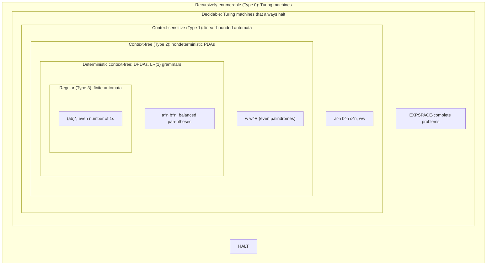
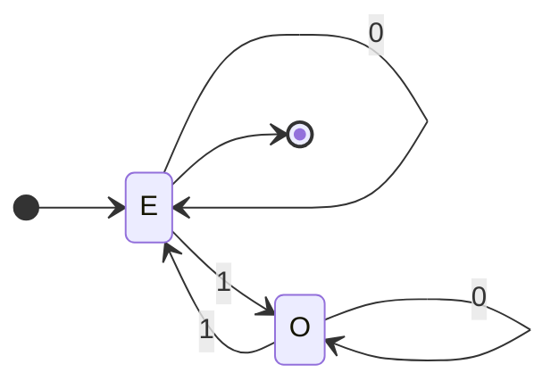
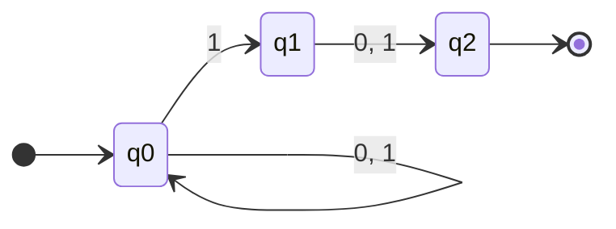
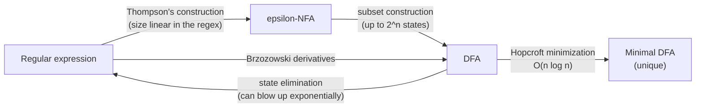
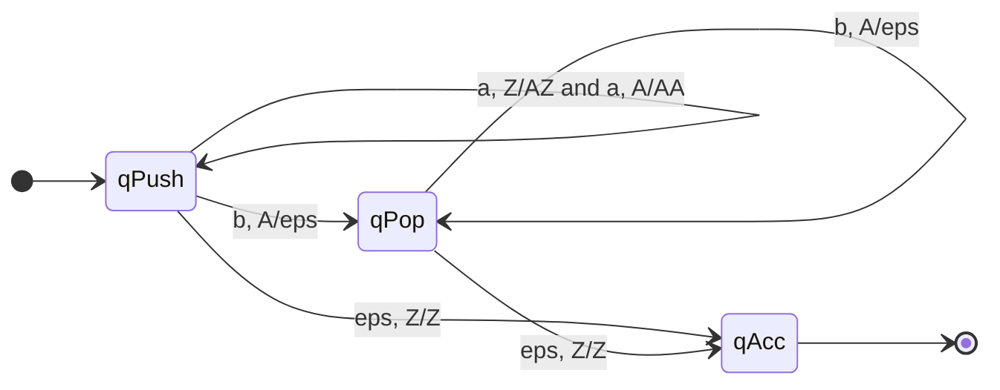
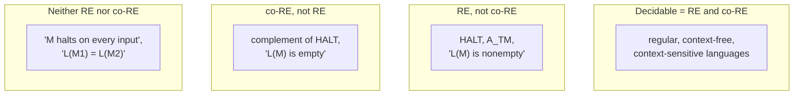

# Automata Theory &amp; Formal Languages

[Advanced Topics](../) &raquo; Automata Theory &amp; Formal Languages

**Graduate-level reference.** **Prerequisites:** discrete mathematics, sets and functions, proof by induction and contradiction. For resource-bounded computation (P, NP, PSPACE) see [Complexity Theory](../complexity-theory/).

**Automata theory** studies abstract machines and the classes of **formal languages** (sets of strings) they recognize. The standard models form a strict hierarchy by memory: finite automata (no memory beyond their state), pushdown automata (a stack), linear-bounded automata (a tape as long as the input), and Turing machines (unbounded tape). Each model corresponds exactly to a class of grammars in the **Chomsky hierarchy**. At the top, Turing machines capture everything that is computable at all, and some well-posed questions, such as whether a program halts, are provably beyond any of them.

The theory is also directly practical: regular expressions and lexers are finite automata, parsers for programming languages are pushdown automata, model checkers verify systems as automata over infinite words, and formal-language benchmarks are now used to measure what neural sequence models can learn.

*Every inclusion is strict; each example belongs to its region but not to the next one inside it.*

## Languages, Alphabets, and Grammars

#### Definitions (alphabet, string, language)
An **alphabet** $\Sigma$ is a finite, non-empty set of symbols. A **string** over $\Sigma$ is a finite sequence of symbols; $\varepsilon$ is the empty string and $\lvert w\rvert$ the length of $w$. $\Sigma^{*}$ is the set of all strings over $\Sigma$ (the Kleene closure). A **language** is any subset $L \subseteq \Sigma^{*}$.

$\Sigma^{*}$ is countably infinite, so the set of all languages, $2^{\Sigma^{*}}$, is uncountable. Every machine has a finite description, so there are only countably many machines. A cardinality argument alone therefore shows that **almost all languages are recognized by no machine**; the rest of the subject determines which ones are.

A **grammar** is a 4-tuple $G = (V, \Sigma, R, S)$: a finite set $V$ of variables (non-terminals), a terminal alphabet $\Sigma$ disjoint from $V$, a start symbol $S \in V$, and a finite set $R$ of productions $\alpha \to \beta$. $L(G)$ is the set of terminal strings derivable from $S$. Restricting the shape of the productions gives the four levels of the Chomsky hierarchy ([table below](#the-chomsky-hierarchy)).

## Finite Automata: DFA and NFA

A finite automaton reads its input once, left to right, and its only memory is which of finitely many states it is in.

### Deterministic finite automata

#### Definition (DFA)
A **deterministic finite automaton** is a 5-tuple $M = (Q, \Sigma, \delta, q_0, F)$: a finite set of states $Q$, an input alphabet $\Sigma$, a transition function $\delta : Q \times \Sigma \to Q$, a start state $q_0 \in Q$, and accepting states $F \subseteq Q$.

Extend $\delta$ to strings by $\hat{\delta}(q, \varepsilon) = q$ and $\hat{\delta}(q, wa) = \delta(\hat{\delta}(q, w), a)$. Then

$$L(M) = \{\, w \in \Sigma^{*} \mid \hat{\delta}(q_0, w) \in F \,\}.$$

**Example.** Binary strings with an even number of 1s: state $E$ (even, start and accepting) and state $O$ (odd). Reading 0 stays put; reading 1 toggles.

A DFA decides membership in $O(n)$ time and $O(1)$ extra space, which is why lexers, protocol parsers, and network packet filters compile patterns to DFAs.

### Nondeterministic finite automata

An **NFA** allows a set of possible next states and $\varepsilon$-moves: $\delta : Q \times (\Sigma \cup \{\varepsilon\}) \to 2^{Q}$. It accepts $w$ if **some** sequence of choices ends in an accepting state.

**Example.** Binary strings whose second-to-last symbol is 1. The NFA guesses when it has reached that position:

#### Theorem (subset construction; Rabin & Scott, 1959)
Every NFA with $n$ states has an equivalent DFA with at most $2^{n}$ states. The bound is tight: the language "the $k$-th symbol from the end is 1" has an NFA with $k+1$ states but no DFA with fewer than $2^{k}$ states.

**Construction.** For an NFA $N = (Q, \Sigma, \delta, q_0, F)$, let $E(S)$ be the $\varepsilon$-closure of a set of states. The DFA has states $2^{Q}$, start state $E(\{q_0\})$, transitions $\delta'(S, a) = E\bigl(\bigcup_{q \in S} \delta(q, a)\bigr)$, and accepting states $\{S : S \cap F \neq \varnothing\}$. Only states reachable from the start need to be built. For the example above:

| DFA state | on 0 | on 1 | accepting? |
|---|---|---|---|
| $\{q_0\}$ (start) | $\{q_0\}$ | $\{q_0,q_1\}$ | no |
| $\{q_0,q_1\}$ | $\{q_0,q_2\}$ | $\{q_0,q_1,q_2\}$ | no |
| $\{q_0,q_2\}$ | $\{q_0\}$ | $\{q_0,q_1\}$ | yes |
| $\{q_0,q_1,q_2\}$ | $\{q_0,q_2\}$ | $\{q_0,q_1,q_2\}$ | yes |

Each DFA state records the last two symbols read, which is exactly the information the language requires. Nondeterminism therefore adds **no power** to finite automata, only succinctness.

## Regular Languages and Regular Expressions

#### Kleene's theorem
For a language $L$ the following are equivalent: (1) some DFA recognizes $L$; (2) some NFA recognizes $L$; (3) some regular expression describes $L$; (4) some right-linear grammar generates $L$. Such languages are called **regular**.

**Regular expressions** over $\Sigma$ are built from $\varnothing$, $\varepsilon$, and each $a \in \Sigma$ using union $R \mid S$, concatenation $RS$, and Kleene star $R^{*}$:

$$L(R \mid S) = L(R) \cup L(S), \qquad L(RS) = \{\, xy : x \in L(R),\ y \in L(S) \,\}, \qquad L(R^{*}) = \bigcup_{i \geq 0} L(R)^{i}.$$

The conversions that prove the theorem are all algorithms used in practice:

- **Thompson's construction** builds an $\varepsilon$-NFA from small gadgets for union, concatenation, and star, with $O(m)$ states for a regex of length $m$.
- **State elimination** (McNaughton–Yamada) removes NFA states one at a time, relabelling edges with regular expressions until one edge remains.
- **Brzozowski derivatives**: the derivative $a^{-1}L = \{\, w : aw \in L \,\}$ of a regular expression is again a regular expression, computable syntactically; repeatedly taking derivatives builds a DFA directly. Derivative-based matchers are used in modern regex engines, e.g. .NET's non-backtracking mode.

### Closure properties

Regular languages are closed under union, intersection, complement, concatenation, star, reversal, homomorphism, and inverse homomorphism. Complement swaps accepting and non-accepting states of a complete DFA. Intersection uses the **product construction**: run two DFAs in lockstep on pairs $(q, r)$ and accept when both accept. Closure is a proof tool: if $L \cap a^{*}b^{*} = \{a^n b^n\}$ and $a^{*}b^{*}$ is regular, then $L$ cannot be regular.

### Myhill–Nerode and minimization

#### Myhill–Nerode theorem
Define $x \equiv_L y$ iff for every $z \in \Sigma^{*}$, $xz \in L \Leftrightarrow yz \in L$. Then $L$ is regular **iff** $\equiv_L$ has finitely many equivalence classes, and the number of classes equals the number of states of the minimal DFA for $L$, which is unique up to renaming states.

The theorem gives both an algorithm and a lower-bound technique. **Hopcroft's algorithm** computes the minimal DFA in $O(n \log n)$ by refining a partition of states until no two states in a block are distinguishable. For lower bounds: the strings $a^0, a^1, a^2, \dots$ are pairwise inequivalent for $L = \{a^n b^n\}$ (the suffix $b^i$ separates $a^i$ from $a^j$), so $\equiv_L$ has infinitely many classes and $L$ is not regular. Unlike the pumping lemma, Myhill–Nerode is an exact characterization.

### Regular expressions in practice

The "regex" syntax of most programming languages is not the regular expressions of theory:

- **Backreferences** such as `(a+)b\1` describe non-regular languages (here $\{a^n b a^n\}$), and matching regexes with backreferences is NP-complete.
- **Backtracking engines** (PCRE, Java, JavaScript, Python's `re`) try alternatives recursively and can take exponential time on patterns like `(a|a)*b` or `(a+)+$` against a long string of `a`s. Exploiting this is a **ReDoS** (regular-expression denial of service) attack.
- **Automata-based engines** (Thompson's NFA simulation, lazy DFA construction) guarantee time linear in the input by giving up backreferences. Google's RE2, Go's `regexp`, and Rust's `regex` crate work this way, and .NET added a non-backtracking option in .NET 7.

For untrusted input, an automata-based engine removes the ReDoS risk entirely.

## The Pumping Lemma for Regular Languages

The pumping lemma is the standard tool for proving that a language is **not** regular. It follows from the pigeonhole principle: a DFA with $p$ states that reads $p$ or more symbols must revisit a state, and the loop between the two visits can be repeated or removed.

#### Pumping lemma (regular languages)
If $L$ is regular, there is a $p \geq 1$ such that every $w \in L$ with $\lvert w \rvert \geq p$ can be written $w = xyz$ with (i) $\lvert y \rvert \geq 1$, (ii) $\lvert xy \rvert \leq p$, and (iii) $xy^{i}z \in L$ for all $i \geq 0$.

**Example: $\{ a^{n} b^{n} \mid n \geq 0 \}$ is not regular.** Suppose it is, with pumping length $p$, and take $w = a^{p} b^{p}$. Since $\lvert xy \rvert \leq p$, the piece $y$ is $a^{k}$ with $k \geq 1$. Then

$$xy^{2}z = a^{p+k}\, b^{p} \notin L,$$

contradicting (iii).

A useful way to structure these proofs is as a game: the adversary picks $p$, you pick $w \in L$, the adversary picks a legal split $xyz$, and you pick $i$ so that $xy^iz \notin L$. You must win against **every** split. The lemma is a necessary condition only: some non-regular languages satisfy it, so a failed pumping argument proves nothing. Myhill–Nerode is the complete test.

## Context-Free Grammars and Pushdown Automata

Adding a stack to a finite automaton gives exactly the languages of nested structure: balanced brackets, arithmetic expressions, and the syntax of programming languages.

### Context-free grammars

A **context-free grammar** (CFG) has productions $A \to \beta$ with a single variable on the left and $\beta \in (V \cup \Sigma)^{*}$. Balanced parentheses are generated by $S \to (S)\,S \mid \varepsilon$. The layered expression grammar

$$E \to E + T \mid T, \qquad T \to T \times F \mid F, \qquad F \to (E) \mid \mathrm{id}$$

encodes precedence ($\times$ binds tighter than $+$) and left associativity through its layers, the template for expression parsers.

A grammar is **ambiguous** if some string has two distinct parse trees (equivalently, two leftmost derivations). The classic example is the "dangling else": `if a then if b then s else t` has two parses unless the grammar forces `else` to attach to the nearest `if`. Some context-free languages, such as $\{a^i b^j c^k : i = j \text{ or } j = k\}$, are **inherently ambiguous**: every grammar for them is ambiguous. Whether a given CFG is ambiguous is undecidable.

### Pushdown automata

#### Definition (PDA)
A **pushdown automaton** is a 7-tuple $M = (Q, \Sigma, \Gamma, \delta, q_0, Z_0, F)$ with stack alphabet $\Gamma$, initial stack symbol $Z_0 \in \Gamma$, and transition function $\delta : Q \times (\Sigma \cup \{\varepsilon\}) \times \Gamma \to$ finite subsets of $Q \times \Gamma^{*}$. A move reads an input symbol (or none), pops the top stack symbol, pushes a string, and changes state.

The stack is unbounded but can only be accessed at the top. That suffices to count one thing: for $a^{n} b^{n}$, push a marker for each $a$, pop one for each $b$, and accept if the stack is back to $Z_0$ exactly when the input ends.

*PDA for $\{a^n b^n : n \geq 0\}$. An edge label "x, Y/W" means: read x, pop Y, push W (leftmost symbol on top).*

#### Theorem (CFG = PDA)
A language is context-free **iff** some nondeterministic PDA recognizes it. From a grammar, a one-state PDA simulates leftmost derivations on its stack. From a PDA, a grammar uses variables $[q\,A\,r]$ meaning "go from state $q$ to state $r$ with the net effect of popping $A$".

**Determinism matters here.** Unlike finite automata, deterministic PDAs are strictly weaker than nondeterministic ones. The **deterministic context-free languages** (DCFLs) are exactly the languages of LR(1) grammars (Knuth, 1965) and can be parsed in linear time; they are the practically important class. Even-length palindromes $\{ww^{R}\}$ are context-free, since a nondeterministic PDA can guess the midpoint, but not deterministic. DCFLs are closed under complement, and equivalence of two DPDAs is decidable (Sénizergues, 1997; Gödel Prize 2002), whereas equivalence of general CFGs is undecidable.

### Normal forms and parsing algorithms

Every CFG can be converted to **Chomsky normal form**, with rules $A \to BC$ or $A \to a$ (plus $S \to \varepsilon$ if needed). This makes parse trees binary and enables the **CYK algorithm**, a dynamic program in which table entry $(i, j)$ holds the variables that derive the substring from position $i$ to position $j$; it decides membership in $O(n^{3}\lvert G\rvert)$ time.

| Algorithm | Grammars handled | Time | Used in |
|---|---|---|---|
| Recursive descent / LL(k) | LL(k): no left recursion, $k$-symbol lookahead | $O(n)$ | hand-written compiler front ends, ANTLR (ALL(*)) |
| LR(1), LALR(1) | deterministic CFLs | $O(n)$ | yacc/Bison-generated parsers |
| CYK | any CFG (in CNF) | $O(n^{3})$ | theory, natural-language parsing |
| Earley | any CFG | $O(n^{3})$; $O(n^{2})$ if unambiguous; $O(n)$ for LR(k) grammars with Leo's optimization | general parsers, grammar tooling |
| GLR | any CFG (forks the LR stack on conflicts) | $O(n^{3})$ worst case | Bison `%glr-parser`, tree-sitter |
| Valiant | any CFG | $O(n^{\omega})$, matrix-multiplication time | theoretical upper bound |

Parsing expression grammars (PEGs), popular in modern parser generators, look like CFGs but use ordered choice and are always unambiguous; they describe a different, incomparable family of languages.

## The Pumping Lemma for Context-Free Languages

For CFLs, two substrings pump together, reflecting a parse subtree that repeats inside itself.

#### Pumping lemma (context-free languages)
If $L$ is context-free, there is a $p$ such that every $w \in L$ with $\lvert w \rvert \geq p$ factors as $w = uvxyz$ with (i) $\lvert vy \rvert \geq 1$, (ii) $\lvert vxy \rvert \leq p$, and (iii) $u v^{i} x y^{i} z \in L$ for all $i \geq 0$.

Take $p = b^{\lvert V\rvert + 1}$, where $b$ is the longest right-hand side. A parse tree for a string of length at least $p$ has height greater than $\lvert V\rvert$, so some root-to-leaf path repeats a variable $A$. The subtree under the upper $A$ derives $vAy$ around the lower one; repeating or deleting that segment pumps $v$ and $y$ simultaneously.

**Example: $\{ a^{n} b^{n} c^{n} \mid n \geq 0 \}$ is not context-free.** Take $w = a^{p} b^{p} c^{p}$. Since $\lvert vxy \rvert \leq p$, the window $vxy$ touches at most two of the three blocks. Pumping with $i = 2$ increases at most two of the three counts, so the result is not in $L$. A single stack can match one pair of counts, not three.

### Closure properties of context-free languages

CFLs are closed under union, concatenation, star, homomorphism, and **intersection with a regular language**, but **not** under intersection or complement: $\{a^n b^n c^m\}$ and $\{a^m b^n c^n\}$ are both context-free, and their intersection is $\{a^n b^n c^n\}$. Since intersection can be written with union and complement (De Morgan), non-closure under complement follows.

## The Chomsky Hierarchy

| Type | Grammar | Production form | Machine | Membership problem |
|---|---|---|---|---|
| 3 | Regular | $A \to aB$, $A \to a$, $S \to \varepsilon$ | Finite automaton | $O(n)$ |
| 2 | Context-free | $A \to \beta$ | Nondeterministic PDA | $O(n^{3})$ |
| 1 | Context-sensitive | $\alpha A \beta \to \alpha \gamma \beta$ with $\gamma \neq \varepsilon$ (equivalently, non-contracting) | Linear-bounded automaton | PSPACE-complete in general |
| 0 | Unrestricted | $\alpha \to \beta$ | Turing machine | undecidable (semi-decidable) |

The inclusions are strict: $a^n b^n$ separates regular from context-free, $a^n b^n c^n$ separates context-free from context-sensitive, and the halting language separates decidable from recursively enumerable. The **decidable** languages sit strictly between context-sensitive and recursively enumerable; they are not one of Chomsky's four grammar types because they are defined semantically (by a machine that halts on every input), not by the shape of productions.

### Context-sensitive languages and LBAs

A **linear-bounded automaton** is a nondeterministic Turing machine that may only use the tape cells holding its input. Kuroda (1964) proved that LBAs recognize exactly the context-sensitive languages, so $\mathrm{CSL} = \mathrm{NSPACE}(n)$. Two classical questions about them:

- **Complement.** Kuroda asked whether CSLs are closed under complement. Immerman and Szelepcsényi independently proved in 1987 that $\mathrm{NSPACE}(s) = \mathrm{co}\text{-}\mathrm{NSPACE}(s)$ for $s(n) \geq \log n$, answering yes (Gödel Prize 1995).
- **Determinism (the LBA problem).** Whether deterministic LBAs recognize all CSLs, i.e. whether $\mathrm{DSPACE}(n) = \mathrm{NSPACE}(n)$, is still open.

### Closure and decision properties

| Operation | Regular | DCFL | CFL | CSL | Decidable | RE |
|---|---|---|---|---|---|---|
| Union | yes | no | yes | yes | yes | yes |
| Intersection | yes | no | no | yes | yes | yes |
| Intersection with regular | yes | yes | yes | yes | yes | yes |
| Complement | yes | yes | no | yes | yes | no |
| Concatenation, star | yes | no | yes | yes | yes | yes |
| Homomorphism | yes | no | yes | no (yes if $\varepsilon$-free) | no | yes |

| Question (given a machine or grammar) | Regular | DCFL | CFL | CSL | RE |
|---|---|---|---|---|---|
| Membership: $w \in L$? | decidable | decidable | decidable | decidable | undecidable |
| Emptiness: $L = \varnothing$? | decidable | decidable | decidable | undecidable | undecidable |
| Universality: $L = \Sigma^{*}$? | decidable | decidable | undecidable | undecidable | undecidable |
| Equivalence: $L_1 = L_2$? | decidable | decidable | undecidable | undecidable | undecidable |
| Inclusion: $L_1 \subseteq L_2$? | decidable | undecidable | undecidable | undecidable | undecidable |

The drop-off in decidability between regular and context-free languages is why regular abstractions dominate program analysis and verification tooling.

## Turing Machines

#### Definition (Turing machine)
A **Turing machine** is a 7-tuple $M = (Q, \Sigma, \Gamma, \delta, q_0, q_{\text{accept}}, q_{\text{reject}})$, where $\Gamma \supseteq \Sigma$ is the tape alphabet containing a blank $\sqcup \notin \Sigma$, and $\delta : Q \times \Gamma \to Q \times \Gamma \times \{L, R\}$ reads the current cell, writes a symbol, moves the head, and changes state.

A **configuration** is the tape contents, head position, and state. On input $w$, $M$ may accept, reject, or **run forever**. The possibility of running forever is the source of every result in the rest of this page.

- $L$ is **recursively enumerable** (Turing-recognizable, semi-decidable) if some TM accepts exactly the strings of $L$; on other strings it may reject or loop.
- $L$ is **decidable** (recursive) if some TM halts on every input and accepts exactly $L$.

#### Robustness and the Church–Turing thesis
Multi-tape, multi-head, two-dimensional, and nondeterministic Turing machines recognize the same languages as the single-tape model. Multi-tape machines are simulated with quadratic slowdown; nondeterministic machines with (as far as anyone knows) exponential slowdown. Every other reasonable model, including the lambda calculus, general recursive functions, register machines, and cellular automata such as Rule 110, has the same power. The **Church–Turing thesis** states that this class is exactly what is effectively computable.

A **universal Turing machine** $U$ takes an encoding $\langle M, w\rangle$ and simulates $M$ on $w$. One fixed machine that runs any program is the theoretical basis of the stored-program computer, and the ability of machines to take machine descriptions as input is what makes the self-reference in the next section possible.

### Busy beavers

The **busy beaver function** $\mathrm{BB}(n)$ is the maximum number of steps any halting $n$-state, 2-symbol Turing machine takes when started on a blank tape. $\mathrm{BB}$ grows faster than every computable function; if it were computable we could decide halting from blank tape by running a machine for $\mathrm{BB}(n)$ steps. Individual values can still be proved:

| $n$ | $\mathrm{BB}(n)$ | Status |
|---|---|---|
| 1–4 | 1, 6, 21, 107 | proved by 1983 (Rado, Lin, Brady) |
| 5 | 47,176,870 | proved in 2024 by the bbchallenge collaboration, with a proof checked in the Coq proof assistant |
| 6 | greater than $2 \uparrow\uparrow\uparrow 5$ | lower bound found in 2025; the true value is unknown |

Determining $\mathrm{BB}(6)$ requires deciding the behaviour of machines whose halting is equivalent to open Collatz-like problems in number theory, which illustrates concretely why halting cannot be decided in general. Beyond some fixed size the values are not even provable: there is an explicit 745-state machine (2023) whose non-halting cannot be proved or refuted in ZFC set theory, so $\mathrm{BB}(745)$ is independent of ZFC.

## Decidability and the Halting Problem

#### Theorem (Turing, 1936)
$\mathrm{HALT} = \{\, \langle M, w \rangle \mid M \text{ halts on input } w \,\}$ is recursively enumerable but **not decidable**.

**Proof.** Suppose a TM $H$ decides $\mathrm{HALT}$. Build a machine $D$ that on input $\langle M \rangle$ runs $H$ on $\langle M, \langle M \rangle\rangle$ and does the opposite:

$$D(\langle M \rangle) = \begin{cases} \text{loop forever} & \text{if } H \text{ reports that } M \text{ halts on } \langle M \rangle, \\[4pt] \text{halt} & \text{if } H \text{ reports that } M \text{ loops on } \langle M \rangle. \end{cases}$$

Run $D$ on $\langle D \rangle$. If $D$ halts, $H$ reported that it loops, so $D$ loops; if $D$ loops, $H$ reported that it halts, so $D$ halts. Both cases are contradictory, so $H$ cannot exist. $\blacksquare$

This is Cantor's diagonal argument applied to machines: list all machines as rows and all machine descriptions as columns, and $D$ is built to differ from every row on the diagonal.

**Semi-decidability.** $\mathrm{HALT}$ is recursively enumerable: simulate $M$ on $w$ and accept if it halts. Its complement is not, because a language is decidable **iff** both it and its complement are recursively enumerable (run both recognizers in alternation; one of them must accept). So $\mathrm{HALT}$ witnesses that decidable $\subsetneq$ RE. Problems such as totality ("does $M$ halt on every input?") are higher still in the **arithmetical hierarchy**, neither RE nor co-RE.

**Reductions.** If $A \leq_m B$ via a computable $f$ with $x \in A \Leftrightarrow f(x) \in B$, and $A$ is undecidable, then $B$ is undecidable. Reductions from $\mathrm{HALT}$ establish the undecidability of:

- the **Post correspondence problem** (given pairs of strings, is there a sequence whose top and bottom concatenations agree?), the usual intermediate step for grammar problems;
- CFG ambiguity, universality, and equivalence (via PCP);
- **Hilbert's tenth problem**: solvability of polynomial Diophantine equations in integers (Matiyasevich, 1970, completing work of Davis, Putnam, and Robinson);
- the **word problem** for finitely presented groups (Novikov, 1955; Boone, 1958);
- Wang tiling of the plane (Berger, 1966).

## Rice's Theorem

Rice's theorem generalizes the halting problem: **every nontrivial property of what a program computes is undecidable.**

#### Rice's theorem (1953)
Let $P$ be a property of recursively enumerable languages that is **nontrivial**: some RE language has it and some does not. Then $\{\langle M \rangle : L(M) \text{ has property } P\}$ is undecidable.

**Proof.** Assume without loss of generality that $\varnothing$ lacks $P$ (otherwise use the complementary property). Let $L_P$ be an RE language with $P$, recognized by $M_P$. Given $\langle M, w\rangle$, build $N$ which on input $x$ first simulates $M$ on $w$ and, if that halts, runs $M_P$ on $x$. Then

$$L(N) = \begin{cases} L_P & \text{if } M \text{ halts on } w, \\[4pt] \varnothing & \text{if } M \text{ does not halt on } w. \end{cases}$$

A decider for $P$ applied to $\langle N\rangle$ would decide $\mathrm{HALT}$. $\blacksquare$

**Consequences.** Whether a program computes a constant function, ever outputs a particular value, is equivalent to another program, or recognizes an empty, finite, or regular language are all undecidable. The theorem concerns **semantic** properties of $L(M)$ only. Syntactic properties ("does $M$ have more than five states?") and properties of bounded runs ("does $M$ halt within 1,000 steps?") are decidable.

**What verification does instead.** Since exact answers are impossible in general, practical tools give up one of completeness, soundness, or full automation:

| Approach | Trade-off | Examples |
|---|---|---|
| Sound static analysis (abstract interpretation, type systems) | may report false alarms | Astrée, type checkers, borrow checkers |
| Bounded model checking, testing, fuzzing | may miss bugs beyond the bound | CBMC, fuzzers |
| Finite-state model checking | requires a finite (or abstracted) model | SPIN, NuSMV, TLA+ (TLC) |
| Interactive theorem proving | requires human-written proofs | Coq/Rocq, Lean, Isabelle |

Model checkers for reactive systems use **Büchi automata**, finite automata that accept infinite words when some accepting state is visited infinitely often. Linear temporal logic formulas translate into Büchi automata, and checking a system against a formula reduces to emptiness of a product automaton, which is decidable.

## Automata and Neural Sequence Models

Formal languages are now a standard probe of what neural networks can learn and represent. Delétang et al. (ICLR 2023, "Neural Networks and the Chomsky Hierarchy") trained RNNs, LSTMs, and transformers on tasks at each level of the hierarchy and measured length generalization: LSTMs generalized on regular and some counter languages, transformers failed on many regular tasks such as parity, and networks augmented with external stack or tape memory climbed the hierarchy. Theoretical results match this picture: fixed-depth transformers without intermediate decoding steps fall in the circuit class $\mathsf{TC}^0$ and cannot track state for general finite automata, while chain-of-thought decoding restores that ability. See [AI Mathematics](../ai-mathematics/#expressivity-of-transformers-and-state-space-models) for details.

## References

1. Sipser, M. (2012). *Introduction to the Theory of Computation*, 3rd ed. Cengage.
2. Hopcroft, J., Motwani, R., & Ullman, J. (2006). *Introduction to Automata Theory, Languages, and Computation*, 3rd ed. Pearson.
3. Kozen, D. (1997). *Automata and Computability*. Springer.
4. Turing, A. (1936). "On Computable Numbers, with an Application to the Entscheidungsproblem." *Proc. London Mathematical Society*.
5. Rabin, M. O., & Scott, D. (1959). "Finite Automata and Their Decision Problems." *IBM Journal of Research and Development*.
6. Rice, H. G. (1953). "Classes of Recursively Enumerable Sets and Their Decision Problems." *Trans. AMS*.
7. Knuth, D. E. (1965). "On the Translation of Languages from Left to Right." *Information and Control*.
8. Cox, R. (2007). "Regular Expression Matching Can Be Simple And Fast." swtch.com.
9. Delétang, G., et al. (2023). "Neural Networks and the Chomsky Hierarchy." *ICLR*.
10. The bbchallenge Collaboration (2024). Proof that BB(5) = 47,176,870, verified in Coq. bbchallenge.org.

## See Also

- [Complexity Theory](../complexity-theory/) — resource-bounded computation: P, NP, PSPACE, and circuit classes
- [Category & Type Theory](../category-and-type-theory/) — lambda calculus and the Curry–Howard view of computation
- [AI Mathematics](../ai-mathematics/) — learning theory and the expressivity of sequence models
- [Approximation Algorithms](../approximation-algorithms/) — what can be computed efficiently when exact optimization is NP-hard
- [Distributed Systems Theory](../distributed-systems-theory/) — impossibility results and formal verification of protocols
- [Cryptography](../cryptography/) — computational hardness as a resource
- [Technology Hub](../../technology/) — regular expressions, parsers, and language tooling in practice
