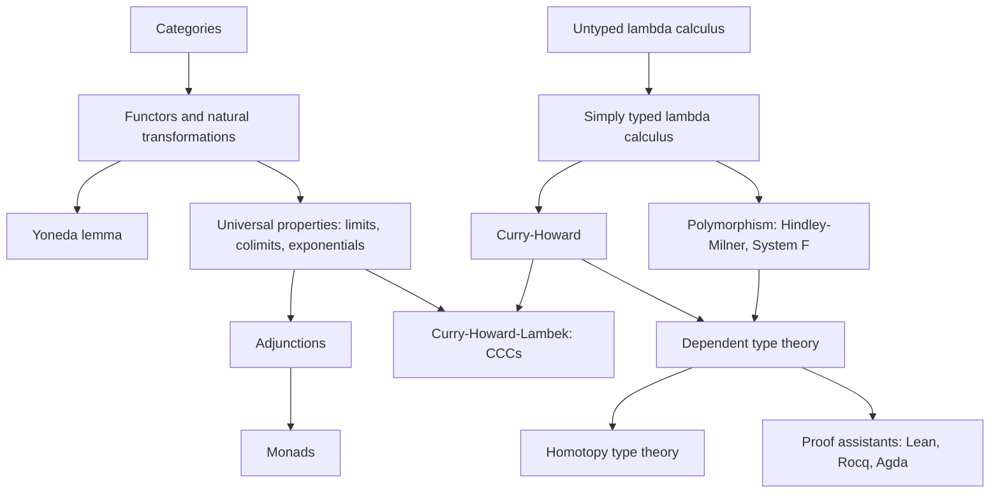
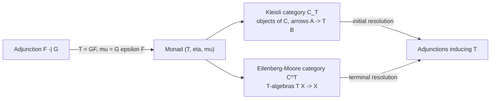
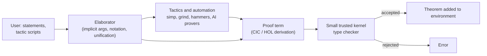

# Category Theory &amp; Type Theory

[Advanced Topics](../) &raquo; Category Theory &amp; Type Theory

<div class="advanced-note" markdown="1">
**Prerequisites:** abstract algebra (groups, monoids), naive set theory, first-order logic. Reading knowledge of a typed functional language (Haskell, OCaml, Lean, or Agda) helps with the code examples.
</div>

**Category theory** studies mathematical structure through the structure-preserving maps (*morphisms*) between objects rather than through the objects' elements. **Type theory** studies formal systems of terms classified by types, and serves both as a foundation for programming languages and as an alternative foundation for mathematics. The two are linked by the **Curry-Howard-Lambek correspondence**: intuitionistic propositions, types, and objects of a cartesian closed category are three presentations of the same structure, as are proofs, programs, and morphisms. This page covers the core categorical vocabulary (categories through monads), the lambda calculus and its type systems, the correspondence itself, dependent type theory, and the proof assistants that implement it.

## Overview

### The three-way dictionary

The table below is the organizing idea of the page. Each row is one concept seen from logic, from programming, and from category theory; later sections develop each column.

| Logic | Type theory / programming | Category theory |
|---|---|---|
| Proposition $A$ | Type $A$ | Object $A$ |
| Proof of $B$ from hypothesis $A$ | Term $x : A \vdash t : B$ | Morphism $A \to B$ |
| True $\top$ | Unit type `()` | Terminal object $1$ |
| False $\bot$ | Empty type `Void` | Initial object $0$ |
| Conjunction $A \land B$ | Pair type `(a, b)` | Product $A \times B$ |
| Disjunction $A \lor B$ | Sum type `Either a b` | Coproduct $A + B$ |
| Implication $A \Rightarrow B$ | Function type `a -> b` | Exponential $B^A$ |
| Cut / modus ponens | Function application, substitution | Composition, evaluation map |
| Proof normalization | Evaluation ($\beta$-reduction) | Equality of morphisms |
| $\forall x{:}A.\,P(x)$ | Dependent function type $\Pi$ | Right adjoint to pullback |
| $\exists x{:}A.\,P(x)$ | Dependent pair type $\Sigma$ | Left adjoint to pullback |

### Dependencies between topics



## Categories

A category keeps only the arrows between objects and how they compose. Everything that can be said about an object is said through the morphisms into and out of it, which is why the same definitions apply unchanged to sets, groups, topological spaces, types, and propositions.

**Definition.** A **category** $\mathcal{C}$ consists of

- a collection of objects $\mathrm{ob}(\mathcal{C})$;
- for each pair of objects $A, B$ a collection $\mathrm{Hom}_{\mathcal{C}}(A, B)$ of morphisms $f : A \to B$;
- a composition operation and an identity morphism $\mathrm{id}_A$ for each object,

$$
\circ : \mathrm{Hom}(B, C) \times \mathrm{Hom}(A, B) \to \mathrm{Hom}(A, C), \qquad \mathrm{id}_A \in \mathrm{Hom}(A, A),
$$

subject to associativity and the unit laws: for all $f : A \to B$, $g : B \to C$, $h : C \to D$,

$$
h \circ (g \circ f) = (h \circ g) \circ f, \qquad \mathrm{id}_B \circ f = f = f \circ \mathrm{id}_A .
$$

A category is **locally small** if every $\mathrm{Hom}(A, B)$ is a set, and **small** if in addition $\mathrm{ob}(\mathcal{C})$ is a set. The distinction matters for statements such as the Yoneda lemma and for completeness results; **Set** itself is locally small but not small.

### Examples

| Category | Objects | Morphisms | Notes |
|---|---|---|---|
| **Set** | Sets | Total functions | The default "category of structureless things" |
| **Grp**, **Ring**, **Vect**$_k$ | Groups, rings, $k$-vector spaces | Homomorphisms, linear maps | Concrete categories: structured sets |
| **Top** | Topological spaces | Continuous maps | Isomorphisms are homeomorphisms |
| **Rel** | Sets | Relations $R \subseteq A \times B$ | Same objects as **Set**, different arrows |
| A monoid $M$ | One object $\star$ | Elements of $M$ | Composition is the monoid product |
| A preorder $(P, \le)$ | Elements of $P$ | At most one arrow $a \to b$, iff $a \le b$ | Composition is transitivity |
| Types of a language | Types | Functions (terms with one free variable) | Haskell's version is conventionally called **Hask** |

The monoid and preorder examples give two useful readings: a category is a *many-object monoid*, and a category is a *preorder in which it matters which proof of $a \le b$ you have*. The **Hask** example is only approximately a category: `seq` and non-termination break some equations (for example, $\eta$-equality for functions), so reasoning about Haskell categorically is usually done in an idealized total fragment.

### Special morphisms

| Kind | Definition | In **Set** |
|---|---|---|
| Monomorphism | Left-cancellable: $f \circ g = f \circ h \implies g = h$ | Injection |
| Epimorphism | Right-cancellable: $g \circ f = h \circ f \implies g = h$ | Surjection |
| Split mono / section | Has a left inverse $r \circ f = \mathrm{id}$ | Injection from a non-empty set |
| Isomorphism | Two-sided inverse $g$: $g \circ f = \mathrm{id}_A$, $f \circ g = \mathrm{id}_B$ | Bijection |

The **Set** intuitions do not transfer in general. In **Ring** the inclusion $\mathbb{Z} \hookrightarrow \mathbb{Q}$ is both mono and epi (a ring map out of $\mathbb{Q}$ is determined by its values on $\mathbb{Z}$) but is not an isomorphism.

### Duality

Every category $\mathcal{C}$ has an **opposite category** $\mathcal{C}^{\mathrm{op}}$ with the same objects and all arrows reversed: $\mathrm{Hom}_{\mathcal{C}^{\mathrm{op}}}(A, B) = \mathrm{Hom}_{\mathcal{C}}(B, A)$. Because the axioms of a category are symmetric under reversal, every theorem has a **dual** obtained by reversing arrows: products become coproducts, monos become epis, limits become colimits, left adjoints become right adjoints. A proof of one statement is a proof of its dual.

## Functors and Natural Transformations

Functors are the structure-preserving maps between categories; natural transformations are the maps between functors. Categories, functors, and natural transformations together form the 2-category **Cat**.

**Definition.** A **functor** $F : \mathcal{C} \to \mathcal{D}$ sends each object $A$ to an object $F(A)$ and each morphism $f : A \to B$ to a morphism $F(f) : F(A) \to F(B)$, preserving identities and composition:

$$
F(\mathrm{id}_A) = \mathrm{id}_{F(A)}, \qquad F(g \circ f) = F(g) \circ F(f).
$$

A **contravariant** functor from $\mathcal{C}$ to $\mathcal{D}$ is a functor $\mathcal{C}^{\mathrm{op}} \to \mathcal{D}$. For a locally small $\mathcal{C}$ the **hom-functors** $\mathrm{Hom}(A, -) : \mathcal{C} \to \mathbf{Set}$ (covariant) and $\mathrm{Hom}(-, B) : \mathcal{C}^{\mathrm{op}} \to \mathbf{Set}$ (contravariant) are the prototypical examples. A functor is **faithful** or **full** when it is injective or surjective on each hom-set; an **equivalence of categories** is a full, faithful functor that is essentially surjective on objects. Equivalence, not isomorphism, is the correct notion of "sameness" for categories.

In a functional language, a type constructor with a lawful `map` is an endofunctor on the category of types. The functor laws are the familiar `fmap` laws:

```haskell
class Functor f where
  fmap :: (a -> b) -> f a -> f b

-- Laws (not checked by the compiler):
--   fmap id      == id
--   fmap (g . f) == fmap g . fmap f

instance Functor [] where
  fmap = map
```

**Definition.** Given functors $F, G : \mathcal{C} \to \mathcal{D}$, a **natural transformation** $\eta : F \Rightarrow G$ is a family of morphisms $\eta_A : F(A) \to G(A)$, one per object, such that for every $f : A \to B$ the **naturality square** commutes:

$$
G(f) \circ \eta_A = \eta_B \circ F(f).
$$

<figure class="diagram">
<svg viewBox="0 0 360 220" role="img" aria-labelledby="ctt-nat-title" style="max-width: 360px; width: 100%; color: inherit;">
  <title id="ctt-nat-title">Naturality square: F(A) to F(B) along F(f), G(A) to G(B) along G(f), with vertical components eta_A and eta_B</title>
  <defs>
    <marker id="ctt-arrow-nat" viewBox="0 0 10 10" refX="9" refY="5" markerWidth="7" markerHeight="7" orient="auto-start-reverse">
      <path d="M0,0 L10,5 L0,10 z" fill="currentColor"/>
    </marker>
  </defs>
  <g font-family="serif" font-size="18" fill="currentColor" text-anchor="middle">
    <text x="70" y="55">F(A)</text>
    <text x="290" y="55">F(B)</text>
    <text x="70" y="185">G(A)</text>
    <text x="290" y="185">G(B)</text>
    <text x="180" y="38" font-size="15">F(f)</text>
    <text x="180" y="210" font-size="15">G(f)</text>
    <text x="42" y="124" font-size="15">η<tspan font-size="11" dy="4">A</tspan></text>
    <text x="322" y="124" font-size="15">η<tspan font-size="11" dy="4">B</tspan></text>
    <text x="180" y="125" font-size="14" opacity="0.7">commutes</text>
  </g>
  <g stroke="currentColor" stroke-width="1.6" fill="none">
    <line x1="105" y1="50" x2="250" y2="50" marker-end="url(#ctt-arrow-nat)"/>
    <line x1="105" y1="180" x2="250" y2="180" marker-end="url(#ctt-arrow-nat)"/>
    <line x1="70" y1="65" x2="70" y2="160" marker-end="url(#ctt-arrow-nat)"/>
    <line x1="290" y1="65" x2="290" y2="160" marker-end="url(#ctt-arrow-nat)"/>
  </g>
</svg>
<figcaption>The naturality square. Both paths from F(A) to G(B) give the same morphism: transforming and then mapping equals mapping and then transforming.</figcaption>
</figure>

Naturality expresses that $\eta$ is defined uniformly, without choices that depend on the particular object. In programming, a polymorphic function `eta :: forall a. f a -> g a` between functors is automatically natural by **parametricity** (Reynolds 1983; Wadler's "Theorems for free!", 1989). For example `reverse :: [a] -> [a]` and `listToMaybe :: [a] -> Maybe a` satisfy `fmap f . eta == eta . fmap f` without any proof obligation.

### The Yoneda lemma

**Lemma (Yoneda).** For a locally small category $\mathcal{C}$, a functor $F : \mathcal{C} \to \mathbf{Set}$, and an object $A$, there is a bijection, natural in $A$ and $F$,

$$
\mathrm{Nat}\big(\mathrm{Hom}(A, -),\, F\big) \;\cong\; F(A), \qquad \alpha \mapsto \alpha_A(\mathrm{id}_A).
$$

*Proof sketch.* Given $x \in F(A)$, define $\alpha_B(f) = F(f)(x)$ for $f : A \to B$; this is natural by functoriality of $F$. Conversely, naturality forces $\alpha_B(f) = \alpha_B(f \circ \mathrm{id}_A) = F(f)(\alpha_A(\mathrm{id}_A))$, so $\alpha$ is determined by the single element $\alpha_A(\mathrm{id}_A)$.

Two consequences are used constantly:

- The **Yoneda embedding** $A \mapsto \mathrm{Hom}(-, A)$ is a full and faithful functor $\mathcal{C} \to \mathbf{Set}^{\mathcal{C}^{\mathrm{op}}}$, so every category embeds in a category of presheaves. This is the categorical analogue of Cayley's theorem.
- **Objects are determined by their arrows:** $A \cong B$ if and only if $\mathrm{Hom}(-, A) \cong \mathrm{Hom}(-, B)$ naturally. This is why a universal property determines an object up to unique isomorphism.

In Haskell the lemma says that `forall b. (a -> b) -> f b` is isomorphic to `f a` for any functor `f`; the isomorphism is the basis of the "Yoneda" and codensity optimizations for fusing repeated `fmap`s:

```haskell
{-# LANGUAGE RankNTypes #-}
newtype Yoneda f a = Yoneda (forall b. (a -> b) -> f b)

toYoneda :: Functor f => f a -> Yoneda f a
toYoneda fa = Yoneda (\k -> fmap k fa)

fromYoneda :: Yoneda f a -> f a
fromYoneda (Yoneda y) = y id          -- alpha_A(id_A)
```

## Universal Constructions

Products, disjoint unions, quotients, free objects, and function spaces are each the solution of a mapping problem that is unique up to unique isomorphism. Category theory states such **universal properties** once, for all categories.

### Products and coproducts

**Definition.** A **product** of $A$ and $B$ is an object $A \times B$ with projections $\pi_1 : A \times B \to A$ and $\pi_2 : A \times B \to B$ such that for every object $X$ and pair of maps $f : X \to A$, $g : X \to B$ there is a *unique* $\langle f, g \rangle : X \to A \times B$ with

$$
\pi_1 \circ \langle f, g \rangle = f, \qquad \pi_2 \circ \langle f, g \rangle = g.
$$

<figure class="diagram">
<svg viewBox="0 0 380 230" role="img" aria-labelledby="ctt-prod-title" style="max-width: 380px; width: 100%; color: inherit;">
  <title id="ctt-prod-title">Universal property of the product: maps f and g from X factor uniquely through A times B</title>
  <defs>
    <marker id="ctt-arrow-prod" viewBox="0 0 10 10" refX="9" refY="5" markerWidth="7" markerHeight="7" orient="auto-start-reverse">
      <path d="M0,0 L10,5 L0,10 z" fill="currentColor"/>
    </marker>
  </defs>
  <g font-family="serif" font-size="18" fill="currentColor" text-anchor="middle">
    <text x="190" y="40">X</text>
    <text x="190" y="185">A × B</text>
    <text x="45" y="185">A</text>
    <text x="335" y="185">B</text>
    <text x="95" y="95" font-size="15">f</text>
    <text x="285" y="95" font-size="15">g</text>
    <text x="222" y="115" font-size="15">⟨f, g⟩</text>
    <text x="112" y="205" font-size="15">π₁</text>
    <text x="268" y="205" font-size="15">π₂</text>
  </g>
  <g stroke="currentColor" stroke-width="1.6" fill="none">
    <line x1="175" y1="50" x2="60" y2="165" marker-end="url(#ctt-arrow-prod)"/>
    <line x1="205" y1="50" x2="320" y2="165" marker-end="url(#ctt-arrow-prod)"/>
    <line x1="190" y1="52" x2="190" y2="162" stroke-dasharray="6 5" marker-end="url(#ctt-arrow-prod)"/>
    <line x1="155" y1="180" x2="62" y2="180" marker-end="url(#ctt-arrow-prod)"/>
    <line x1="225" y1="180" x2="318" y2="180" marker-end="url(#ctt-arrow-prod)"/>
  </g>
</svg>
<figcaption>Product diagram. The dashed arrow is the unique mediating morphism; both triangles commute.</figcaption>
</figure>

The **coproduct** $A + B$ is the dual: injections $\iota_1 : A \to A + B$, $\iota_2 : B \to A + B$ and, for any $f : A \to X$, $g : B \to X$, a unique copairing $[f, g] : A + B \to X$. In **Set** these are the cartesian product and the disjoint union; in **Vect**$_k$ finite products and coproducts coincide as the direct sum (a *biproduct*); in a preorder they are meets and joins.

In a functional language the product is the pair type and the coproduct is the tagged-union type. The uniqueness clause corresponds to the $\eta$-laws: a function into a pair is determined by its two components, and a function out of a sum is determined by its two cases.

```haskell
pair :: (x -> a) -> (x -> b) -> x -> (a, b)     -- <f, g>
pair f g x = (f x, g x)

either :: (a -> c) -> (b -> c) -> Either a b -> c   -- [f, g]
either f _ (Left a)  = f a
either _ g (Right b) = g b
```

### Limits and colimits

Products and coproducts are special cases of **limits** and **colimits** of a diagram $D : J \to \mathcal{C}$. A limit is a universal cone over $D$ (an object with compatible maps *into* every object of the diagram); a colimit is a universal cocone (compatible maps *out of* it).

| Shape of diagram $J$ | Limit | Colimit | In **Set** |
|---|---|---|---|
| Empty | Terminal object $1$ | Initial object $0$ | One-point set; empty set |
| Two objects, no arrows | Product $A \times B$ | Coproduct $A + B$ | Cartesian product; disjoint union |
| Parallel pair $f, g : A \rightrightarrows B$ | Equalizer | Coequalizer | $\{a : f(a) = g(a)\}$; quotient of $B$ |
| Cospan $A \to C \leftarrow B$ | Pullback $A \times_C B$ | — | Fibered product |
| Span $A \leftarrow C \to B$ | — | Pushout $A +_C B$ | Gluing along $C$ |

A category is **complete** (**cocomplete**) if it has all small limits (colimits). **Set**, **Grp**, and **Top** are both. A category has all finite limits if and only if it has a terminal object and pullbacks.

### Exponentials and cartesian closed categories

**Definition.** In a category with binary products, an **exponential** of $B$ by $A$ is an object $B^A$ with an evaluation map $\mathrm{ev} : B^A \times A \to B$ such that every $f : C \times A \to B$ factors uniquely as $\mathrm{ev} \circ (\lambda f \times \mathrm{id}_A)$ for some $\lambda f : C \to B^A$. Equivalently, there is a natural bijection

$$
\mathrm{Hom}(C \times A,\, B) \;\cong\; \mathrm{Hom}(C,\, B^A),
$$

which is **currying**. A **cartesian closed category (CCC)** has a terminal object, binary products, and all exponentials. **Set**, the category of small categories, and every presheaf category are cartesian closed; **Top** is not (compactly generated spaces are the usual fix). CCCs are exactly the categorical models of the simply typed lambda calculus with products, a theorem due to Lambek (Lambek and Scott, 1986).

### Initial algebras and recursion

For an endofunctor $F$, an **$F$-algebra** is an object $X$ with a map $F(X) \to X$. An **initial algebra** $\mu F$, when it exists, is the initial object among $F$-algebras. **Lambek's lemma** says its structure map $F(\mu F) \to \mu F$ is an isomorphism, so $\mu F$ is a least fixed point of $F$.

Inductive data types are initial algebras. Lists over $A$ are the initial algebra of $F(X) = 1 + A \times X$: the structure map combines `[]` and `(:)`, and for any other algebra $[z, s] : 1 + A \times X \to X$ the unique algebra homomorphism out of lists is `foldr s z`. This unique map is called a **catamorphism**, and uniqueness is what justifies fold-fusion laws used in program calculation. Dually, **final coalgebras** $\nu F$ model infinite and coinductive data (streams) and support **anamorphisms** (unfolds).

## Adjunctions

An adjunction is a pair of functors in opposite directions that are inverse "up to a universal mapping property" rather than up to isomorphism. Free constructions, currying, quantifiers, and Galois connections are all adjunctions.

**Definition.** Functors $F : \mathcal{C} \to \mathcal{D}$ and $G : \mathcal{D} \to \mathcal{C}$ form an **adjunction** $F \dashv G$ ($F$ left adjoint, $G$ right adjoint) if there is a bijection, natural in $A \in \mathcal{C}$ and $B \in \mathcal{D}$,

$$
\mathrm{Hom}_{\mathcal{D}}\big(F(A),\, B\big) \;\cong\; \mathrm{Hom}_{\mathcal{C}}\big(A,\, G(B)\big).
$$

Equivalently, there are natural transformations, the **unit** $\eta : \mathrm{Id}_{\mathcal{C}} \Rightarrow G F$ and **counit** $\varepsilon : F G \Rightarrow \mathrm{Id}_{\mathcal{D}}$, satisfying the **triangle identities**

$$
(\varepsilon F) \circ (F \eta) = \mathrm{id}_F, \qquad (G \varepsilon) \circ (\eta G) = \mathrm{id}_G .
$$

| Left adjoint $F$ | Right adjoint $G$ | What the bijection says |
|---|---|---|
| Free group $\mathbf{Set} \to \mathbf{Grp}$ | Forgetful $\mathbf{Grp} \to \mathbf{Set}$ | A homomorphism out of a free group is a function on generators |
| $- \times A$ | $(-)^A$ | Currying |
| Diagonal $\Delta : \mathcal{C} \to \mathcal{C} \times \mathcal{C}$ | Product $\times$ | A map into $A \times B$ is a pair of maps |
| Coproduct $+$ | Diagonal $\Delta$ | A map out of $A + B$ is a pair of maps |
| $\exists_f$ (image along $f$) | Pullback $f^{*}$ (substitution) | Existential quantification is left adjoint to weakening |
| Pullback $f^{*}$ | $\forall_f$ (dependent product) | Universal quantification is right adjoint to weakening |
| Monotone $f$ in a Galois connection | Monotone $g$ | $f(x) \le y \iff x \le g(y)$ |

Two facts make adjunctions a working tool:

- **Adjoints are unique** up to unique natural isomorphism: a functor has at most one right adjoint.
- **Right adjoints preserve limits and left adjoints preserve colimits.** For instance, the forgetful functor $\mathbf{Grp} \to \mathbf{Set}$ preserves products, and $- \times A$ preserves coproducts in any CCC (so $(B + C) \times A \cong B \times A + C \times A$: distributivity comes for free).

Lawvere's observation that the quantifiers are adjoints to substitution (1969) is the bridge from adjunctions to logic and to the semantics of dependent types.

## Monads

**Definition.** A **monad** on $\mathcal{C}$ is an endofunctor $T : \mathcal{C} \to \mathcal{C}$ with natural transformations $\eta : \mathrm{Id} \Rightarrow T$ (unit) and $\mu : T T \Rightarrow T$ (multiplication) such that

$$
\mu \circ T\mu = \mu \circ \mu T, \qquad \mu \circ T\eta = \mathrm{id}_T = \mu \circ \eta T .
$$

These are the associativity and unit laws of a monoid, stated in the category of endofunctors with composition as the tensor product; hence the slogan "a monad is a monoid in the category of endofunctors." A **comonad** is the dual (a counit $T \Rightarrow \mathrm{Id}$ and comultiplication $T \Rightarrow TT$).

### Monads and adjunctions

Every adjunction $F \dashv G$ yields a monad $T = G F$ with unit $\eta$ and multiplication $\mu = G \varepsilon F$. Conversely, every monad arises from an adjunction, and there are two canonical choices: the **Kleisli category** $\mathcal{C}_T$ (the initial one) and the **Eilenberg-Moore category** $\mathcal{C}^T$ of $T$-algebras (the terminal one).



The Kleisli category is the one programmers use: its morphisms $A \to B$ are "effectful functions" $A \to T(B)$, composed by

$$
g \circ_T f = \mu_C \circ T(g) \circ f, \qquad f : A \to T B,\; g : B \to T C,
$$

with $\eta_A$ as identity. The monad laws are exactly the statement that this is a category. Algebras in the Eilenberg-Moore sense recover familiar structure: the algebras of the free-monoid (list) monad on **Set** are monoids, and the algebras of the free-group monad are groups.

### Monads in functional programming

Moggi (1991) proposed monads as a uniform semantics for computational effects; Wadler popularized them as a programming technique, and Haskell adopted them for I/O. Since GHC 7.10 (the Applicative-Monad Proposal), the standard class hierarchy is `Functor` ⊂ `Applicative` ⊂ `Monad`:

```haskell
class Applicative m => Monad m where
  (>>=)  :: m a -> (a -> m b) -> m b      -- bind
  return :: a -> m a                       -- eta; defaults to pure
  return = pure

join :: Monad m => m (m a) -> m a          -- mu
join mma = mma >>= id

(>=>) :: Monad m => (a -> m b) -> (b -> m c) -> a -> m c   -- Kleisli composition
f >=> g = \x -> f x >>= g

-- The Maybe monad (as in base): failure short-circuits
instance Monad Maybe where
  Nothing >>= _ = Nothing
  Just x  >>= f = f x
```

In Kleisli form the monad laws read as the category laws: `return >=> f == f`, `f >=> return == f`, and `(f >=> g) >=> h == f >=> (g >=> h)`.

| Effect | Monad $T(A)$ | Categorical origin |
|---|---|---|
| Partiality / failure | $A + 1$ (`Maybe`) | Coproduct with terminal object |
| Exceptions | $A + E$ (`Either e`) | Coproduct |
| Nondeterminism | Finite lists or finite powerset | Free monoid / free semilattice |
| Reader | $A^R$ | Exponential |
| State | $(A \times S)^S$ | Adjunction $(- \times S) \dashv (-)^S$ |
| Continuations | $R^{(R^A)}$ | Double dualization |

**Beyond monads.** Monads compose poorly in general, which led to monad transformers (`StateT`, `ExceptT`) and, more recently, to **algebraic effects and handlers** (Plotkin and Power; Plotkin and Pretnar), where effects are described by operations and equations and interpreted by handlers. Effect handlers are now in mainstream use: OCaml 5.0 (2022) added native effect handlers to the runtime, and languages such as Koka and Unison are built around effect systems. Applicative functors (lax monoidal functors) and arrows are weaker structures that permit more static analysis than monads.

## The Lambda Calculus and Type Systems

### Untyped lambda calculus

Church's lambda calculus has three term formers:

$$
t ::= x \;\mid\; \lambda x.\, t \;\mid\; t\; t
$$

(variable, abstraction, application). Terms are identified up to renaming of bound variables ($\alpha$-equivalence), and computation is **$\beta$-reduction**,

$$
(\lambda x.\, t)\; u \;\longrightarrow_\beta\; t[x := u],
$$

where substitution must avoid capturing free variables of $u$. The optional **$\eta$-rule** $\lambda x.\, t\, x \to t$ (for $x$ not free in $t$) expresses function extensionality.

Key facts:

- **Church-Rosser (confluence).** If $t \to^{*} u_1$ and $t \to^{*} u_2$ then some $v$ has $u_1 \to^{*} v$ and $u_2 \to^{*} v$. Normal forms, when they exist, are unique.
- **Turing completeness.** Natural numbers can be encoded (Church numerals $\bar n = \lambda f.\,\lambda x.\, f^n\, x$), and general recursion is available through fixed-point combinators such as $Y = \lambda f.\,(\lambda x.\, f\,(x\,x))\,(\lambda x.\, f\,(x\,x))$.
- **Non-termination.** $\Omega = (\lambda x.\, x\,x)(\lambda x.\, x\,x)$ reduces only to itself.
- **Reduction strategies.** Normal-order (leftmost-outermost) reduction finds a normal form whenever one exists; call-by-value and call-by-need (lazy evaluation) are the strategies real languages implement.

### Simply typed lambda calculus

Types are built from base types and the arrow:

$$
\tau ::= \iota \;\mid\; \tau \to \tau .
$$

A **typing judgment** $\Gamma \vdash t : \tau$ reads "in context $\Gamma$, term $t$ has type $\tau$." The simply typed lambda calculus (STLC) has three rules:

$$
\frac{x : \tau \in \Gamma}{\Gamma \vdash x : \tau}\;(\mathrm{var})
\qquad
\frac{\Gamma,\, x : \sigma \vdash t : \tau}{\Gamma \vdash \lambda x{:}\sigma.\, t : \sigma \to \tau}\;(\to\mathrm{I})
\qquad
\frac{\Gamma \vdash t : \sigma \to \tau \quad \Gamma \vdash u : \sigma}{\Gamma \vdash t\; u : \tau}\;(\to\mathrm{E})
$$

Its metatheory is the template for every later system:

- **Subject reduction (preservation):** if $\Gamma \vdash t : \tau$ and $t \to_\beta t'$ then $\Gamma \vdash t' : \tau$.
- **Progress:** a closed well-typed term is either a value or can take a step. Together these give **type safety** ("well-typed programs do not go wrong," Milner 1978).
- **Strong normalization:** every reduction sequence from a well-typed term terminates (Tait's method of reducibility candidates). $\Omega$ has no type. Consequently STLC is *not* Turing-complete, and typed languages recover general recursion by adding a fixed-point operator, at the cost of logical consistency.

### Polymorphism

**Hindley-Milner** (Hindley 1969; Milner 1978; Damas and Milner 1982) adds *let-polymorphism*: type schemes $\forall \alpha.\, \tau$ may be introduced only at `let` bindings, and quantifiers appear only at the outermost level. In exchange, type inference is decidable and every typable term has a **principal type**, computed by Algorithm W using unification. Hindley-Milner is the core of the ML family, OCaml, F#, and Haskell 98 (Haskell adds type classes; modern GHC extends it considerably).

**System F** (Girard 1972; Reynolds 1974) allows quantification anywhere, with explicit type abstraction $\Lambda \alpha.\, t$ and application $t\,[\tau]$. It is still strongly normalizing and is expressive enough to encode natural numbers, lists, and products by their elimination principles (for example $\mathrm{Nat} = \forall \alpha.\,(\alpha \to \alpha) \to \alpha \to \alpha$). However, type inference for full System F is undecidable (Wells, 1994), so practical languages require annotations for higher-rank types. **Parametricity** (Reynolds' abstraction theorem) says polymorphic terms act uniformly on all types; it is the source of the "free theorems" used above for natural transformations.

### The lambda cube

Barendregt's **lambda cube** (1991) organizes typed calculi by which dependencies between terms and types they permit. Starting from STLC ($\lambda{\to}$) at the origin, each axis adds one kind of abstraction.

<figure class="diagram">
<svg viewBox="0 0 440 330" role="img" aria-labelledby="ctt-cube-title" style="max-width: 440px; width: 100%; color: inherit;">
  <title id="ctt-cube-title">Barendregt's lambda cube with STLC at the bottom-front-left corner and the Calculus of Constructions at the top-back-right corner</title>
  <defs>
    <marker id="ctt-arrow-cube" viewBox="0 0 10 10" refX="9" refY="5" markerWidth="6" markerHeight="6" orient="auto-start-reverse">
      <path d="M0,0 L10,5 L0,10 z" fill="currentColor"/>
    </marker>
  </defs>
  <g stroke="currentColor" stroke-width="1.4" fill="none">
    <!-- front face -->
    <line x1="80" y1="270" x2="280" y2="270"/>
    <line x1="80" y1="130" x2="280" y2="130"/>
    <line x1="80" y1="270" x2="80" y2="130"/>
    <line x1="280" y1="270" x2="280" y2="130"/>
    <!-- back face -->
    <line x1="160" y1="210" x2="360" y2="210" stroke-dasharray="5 4"/>
    <line x1="160" y1="70" x2="360" y2="70"/>
    <line x1="160" y1="210" x2="160" y2="70" stroke-dasharray="5 4"/>
    <line x1="360" y1="210" x2="360" y2="70"/>
    <!-- connecting edges -->
    <line x1="80" y1="270" x2="160" y2="210" stroke-dasharray="5 4"/>
    <line x1="280" y1="270" x2="360" y2="210"/>
    <line x1="80" y1="130" x2="160" y2="70"/>
    <line x1="280" y1="130" x2="360" y2="70"/>
  </g>
  <g fill="currentColor">
    <circle cx="80" cy="270" r="3.5"/><circle cx="280" cy="270" r="3.5"/>
    <circle cx="80" cy="130" r="3.5"/><circle cx="280" cy="130" r="3.5"/>
    <circle cx="160" cy="210" r="3.5"/><circle cx="360" cy="210" r="3.5"/>
    <circle cx="160" cy="70" r="3.5"/><circle cx="360" cy="70" r="3.5"/>
  </g>
  <g font-family="serif" font-size="15" fill="currentColor">
    <text x="70" y="292" text-anchor="end">λ→ (STLC)</text>
    <text x="290" y="292">λP (LF)</text>
    <text x="70" y="126" text-anchor="end">λ2 (System F)</text>
    <text x="268" y="150" text-anchor="end">λP2</text>
    <text x="170" y="228">λ<tspan text-decoration="underline">ω</tspan></text>
    <text x="370" y="228">λP<tspan text-decoration="underline">ω</tspan></text>
    <text x="150" y="60" text-anchor="end">λω (Fω)</text>
    <text x="370" y="62">λC (CoC)</text>
  </g>
  <g stroke="currentColor" stroke-width="1.2" fill="none" opacity="0.75">
    <line x1="20" y1="315" x2="80" y2="315" marker-end="url(#ctt-arrow-cube)"/>
    <line x1="20" y1="315" x2="20" y2="265" marker-end="url(#ctt-arrow-cube)"/>
    <line x1="20" y1="315" x2="52" y2="291" marker-end="url(#ctt-arrow-cube)"/>
  </g>
  <g font-family="sans-serif" font-size="11" fill="currentColor" opacity="0.85">
    <text x="86" y="319">types depend on terms</text>
    <text x="26" y="258">terms depend on types</text>
    <text x="58" y="286">types depend on types</text>
  </g>
</svg>
<figcaption>The lambda cube. Moving right adds dependent types, up adds polymorphism, and back adds type operators. The Calculus of Constructions (top-back-right) has all three.</figcaption>
</figure>

| Corner | Adds | Example system or use |
|---|---|---|
| $\lambda{\to}$ | — | Simply typed lambda calculus |
| $\lambda 2$ | Terms depending on types (polymorphism) | System F |
| $\lambda\underline{\omega}$ | Types depending on types (type operators) | Type-level functions |
| $\lambda P$ | Types depending on terms (dependent types) | LF logical framework (Twelf) |
| $\lambda\omega$ | Polymorphism + type operators | System F$\omega$; extended by GHC's Core language (System FC) |
| $\lambda C$ | All three | Calculus of Constructions (Coquand and Huet, 1988) |

Adding inductive types and a hierarchy of universes to $\lambda C$ gives the Calculus of Inductive Constructions (CIC), the kernel theory of Rocq and, in a variant, Lean.

## The Curry-Howard Correspondence

Curry (1934, for combinators) and Howard (1969, for natural deduction) observed that the typing rules of the lambda calculus are the inference rules of intuitionistic natural deduction with the terms erased. The correspondence identifies:

- **propositions with types** and **proofs with terms**: a closed term of type $A$ is a proof of $A$;
- **introduction and elimination rules** with constructors and destructors: $\to$I is $\lambda$-abstraction and $\to$E (modus ponens) is application;
- **proof normalization** (Prawitz's detour elimination) with $\beta$-reduction. Strong normalization of STLC is the computational content of the consistency of intuitionistic propositional logic: a closed normal term of type $\bot$ cannot exist.

**Example.** The proposition $A \Rightarrow (B \Rightarrow A)$ is proved by the K combinator, and $(A \Rightarrow B \Rightarrow C) \Rightarrow (A \Rightarrow B) \Rightarrow A \Rightarrow C$ by the S combinator. Type-checking these definitions is checking the proofs:

```haskell
k :: a -> b -> a
k x _ = x

s :: (a -> b -> c) -> (a -> b) -> a -> c
s f g x = f x (g x)
```

By contrast, Peirce's law $((A \Rightarrow B) \Rightarrow A) \Rightarrow A$ is classically valid but has no total inhabitant of type `((a -> b) -> a) -> a` in Haskell or STLC.

**Curry-Howard-Lambek.** Lambek extended the correspondence to categories: the simply typed lambda calculus with products (equivalently, the $\{\top, \land, \Rightarrow\}$ fragment of intuitionistic logic) is the internal language of cartesian closed categories. Adding coproducts and an initial object gives bicartesian closed categories and the full intuitionistic propositional calculus. Adding dependent types and quantifiers leads to locally cartesian closed categories and, with a subobject classifier, to **toposes**, whose internal logic is intuitionistic higher-order logic.

$$
\text{intuitionistic logic} \;\simeq\; \text{typed } \lambda\text{-calculus} \;\simeq\; \text{cartesian closed categories}
$$

### Extensions of the correspondence

The correspondence is a pattern rather than a single theorem; many logics have a matching computational system.

| Logic | Computational counterpart | Reference point |
|---|---|---|
| Intuitionistic propositional logic | Simply typed lambda calculus | Curry, Howard |
| Second-order propositional logic | System F | Girard, Reynolds |
| Intuitionistic predicate logic, constructive mathematics | Dependent type theory | Martin-Löf |
| Classical logic | Control operators (`call/cc`), continuations, $\lambda\mu$-calculus | Griffin (1990); Parigot (1992) |
| Linear logic | Linear / resource-aware types | Girard (1987); Wadler; Linear Haskell (GHC `LinearTypes`, since 9.0) |
| Modal logic S4 (necessity) | Staged computation, metaprogramming | Davies and Pfenning (2001) |
| Sequent calculus | Abstract machines, explicit evaluation order | Curien and Herbelin (2000) |

Affine and linear type systems have practical descendants: Rust's ownership discipline is affine in spirit (values are used at most once unless copied), and quantitative type theory (Atkey 2018) underlies the multiplicity annotations of Idris 2.

### Constructive logic

Curry-Howard is a correspondence with **intuitionistic** logic. A proof of $A \lor B$ must say which disjunct holds, and a proof of $\exists x.\, P(x)$ must supply a witness; this is exactly the data carried by values of sum and dependent-pair types. The law of excluded middle $A \lor \neg A$ and double-negation elimination $\neg\neg A \Rightarrow A$ (where $\neg A$ abbreviates $A \Rightarrow \bot$) are not provable, because no program can decide an arbitrary proposition. Classical reasoning is still available in two ways: by adding excluded middle as an axiom (proofs then lose some computational content, as in Lean's `Classical.em`), or by interpreting classical proofs via control operators or double-negation translations (Gödel-Gentzen), which recover a computational reading.

## Dependent Type Theory

**Martin-Löf type theory** (MLTT, 1971-1984) allows types to depend on terms. This is what is needed to state mathematics inside the type system: a type such as "vectors of length $n$" is indexed by the natural number $n$, and a proposition such as "$n$ is prime" is a type depending on $n$.

### Pi and Sigma types

$$
\frac{\Gamma,\, x : A \vdash b : B(x)}{\Gamma \vdash \lambda x.\, b : \textstyle\prod_{x : A} B(x)}
\qquad
\frac{\Gamma \vdash a : A \quad \Gamma \vdash b : B(a)}{\Gamma \vdash (a, b) : \textstyle\sum_{x : A} B(x)}
$$

- The **dependent function type** $\prod_{x:A} B(x)$ contains functions whose result type depends on the argument. Read logically, it is $\forall x : A.\, B(x)$.
- The **dependent pair type** $\sum_{x:A} B(x)$ contains pairs of a witness $a$ and evidence $b : B(a)$. Read logically, it is $\exists x : A.\, B(x)$, in its strong constructive form.
- When $B$ does not depend on $x$, these reduce to $A \to B$ and $A \times B$.

Categorically, $\Sigma$ and $\Pi$ are the left and right adjoints to substitution (pullback) along a projection, which is the Lawvere adjunction from the adjunctions table. Models of dependent type theory are accordingly locally cartesian closed categories (Seely 1984, with coherence corrections by Hofmann and others).

### Inductive families

Dependent type theories add **inductive types** (natural numbers, lists, trees) and **inductive families** indexed by values. The type of length-indexed vectors in Lean 4:

```lean
inductive Vec (α : Type u) : Nat → Type u where
  | nil  : Vec α 0
  | cons : α → Vec α n → Vec α (n + 1)

-- Total without a `nil` case: the index n + 1 rules it out.
def Vec.head : Vec α (n + 1) → α
  | .cons a _ => a
```

The type checker verifies that `head` can never be applied to an empty vector, so the property "no out-of-bounds access" is proved once by type-checking rather than tested at run time.

### Universes

A type of all types, $\mathsf{Type} : \mathsf{Type}$, makes the theory inconsistent (Girard's paradox, a type-theoretic Burali-Forti paradox). Proof assistants instead use a cumulative or non-cumulative hierarchy $\mathsf{Type}_0 : \mathsf{Type}_1 : \mathsf{Type}_2 : \cdots$, often with universe polymorphism so that definitions work at every level. Lean and Rocq also have an impredicative universe of propositions (`Prop`), with proof irrelevance in Lean.

### Identity types and homotopy type theory

MLTT represents equality as an **identity type** $a =_A b$, whose inhabitants are proofs of equality, with a single constructor $\mathsf{refl}_a : a =_A a$ and an elimination rule ($J$) for reasoning by path induction. In **intensional** type theory (the default in Rocq, Lean, and Agda) type checking is decidable but some equalities, such as function extensionality, are not provable without an axiom. **Extensional** type theory adds equality reflection, which makes type checking undecidable.

Hofmann and Streicher (1994) showed that uniqueness of identity proofs is not derivable in MLTT. The later observation (Awodey-Warren, Voevodsky, around 2006) that identity types behave like **paths** in a space founded **homotopy type theory (HoTT)**:

| Type theory | Homotopy theory |
|---|---|
| Type $A$ | Space (homotopy type) |
| Term $a : A$ | Point |
| Proof $p : a =_A b$ | Path from $a$ to $b$ |
| Proof of $p = q$ between paths | Homotopy |
| Dependent type $B : A \to \mathsf{Type}$ | Fibration over $A$ |

Voevodsky's **univalence axiom** states that for types in a universe the canonical map $(A = B) \to (A \simeq B)$ is an equivalence: equivalent types are equal, so every construction is automatically invariant under equivalence. Together with **higher inductive types** (for example the circle $S^1$, generated by a point and a loop), this supports synthetic homotopy theory, as developed in the HoTT book (2013). Because univalence as an axiom blocks computation, **cubical type theory** (Cohen, Coquand, Huber, and Mörtberg, 2015) gives it a constructive interpretation in which univalence is a theorem; Cubical Agda implements it.

## Proof Assistants

A proof assistant implements a logic or type theory so that proofs are checked by machine. Most follow the **de Bruijn criterion**: a small trusted kernel checks every proof, so the elaborator, tactics, and automation around it can be large and fallible without compromising soundness.



### Systems

| System | Foundation | Notes |
|---|---|---|
| **Lean 4** | Dependent type theory (CIC variant with quotient types and proof-irrelevant `Prop`) | Also a general-purpose programming language; `mathlib` is the largest unified library of formalized mathematics (over 200,000 theorems as of 2026); the SMT-style `grind` tactic shipped in Lean 4.22 (August 2025) |
| **Rocq** (formerly Coq) | Calculus of Inductive Constructions | Renamed from Coq with the 9.0 release (March 2025), which ships a single `rocq` binary and splits the standard library as `Stdlib`; used for CompCert, the Four Colour Theorem, and Feit-Thompson |
| **Agda** | Intensional Martin-Löf type theory | Dependently typed programming language first; `--cubical` mode implements cubical type theory |
| **Isabelle/HOL** | Classical higher-order logic (not dependent) | Sledgehammer calls external ATPs and SMT solvers; used for the seL4 microkernel proofs; hosts the Archive of Formal Proofs |
| **HOL Light**, HOL4 | Higher-order logic | Very small kernels; HOL Light was central to the Flyspeck proof of the Kepler conjecture |
| **Idris 2** | Quantitative type theory | Dependent types with linearity annotations for resource tracking |

### Terms and tactics

A proof can be written directly as a term or built interactively with **tactics**, commands such as `intro`, `induction`, `rw`, and `simp` that transform the current goal and emit a proof term behind the scenes. Because the kernel checks the resulting term, a buggy tactic can fail but cannot prove a false statement. A small Lean example:

```lean
theorem my_add_comm (m n : Nat) : m + n = n + m := by
  induction n with
  | zero      => simp
  | succ k ih => rw [Nat.add_succ, ih, Nat.succ_add]
```

In practice this goal is closed by `omega` (linear arithmetic) or `grind`, or by citing the library lemma `Nat.add_comm`; the explicit induction shows how the proof term is structured.

### Landmark formalizations

| Year | Result | System |
|---|---|---|
| 2005 | Four Colour Theorem (Gonthier) | Coq |
| 2009 | seL4 microkernel functional correctness | Isabelle/HOL |
| 2009 onward | CompCert verified optimizing C compiler (Leroy) | Coq |
| 2012 | Feit-Thompson Odd Order Theorem | Coq |
| 2014 | Kepler conjecture (Flyspeck project, Hales et al.) | HOL Light, Isabelle |
| 2022 | Liquid Tensor Experiment: a core theorem of Clausen-Scholze condensed mathematics | Lean |
| 2023 | Polynomial Freiman-Ruzsa conjecture (Gowers, Green, Manners, Tao), formalized about three weeks after the preprint | Lean |
| 2024-2025 | Equational Theories Project: all 22,028,942 implications among 4,694 magma laws settled, with a Lean-checked core | Lean |
| 2024 onward | Fermat's Last Theorem project (Buzzard), reducing FLT to results known by the 1980s | Lean, in progress |

### Machine learning and formal proof

Formal verification gives machine-learning systems an unambiguous reward signal: a proof either type-checks or it does not. DeepMind's AlphaProof (reinforcement learning over Lean) reached silver-medal standard on the 2024 International Mathematical Olympiad, with the method published in *Nature* in 2025. At the 2025 IMO, Harmonic's Aristotle produced Lean-verified solutions to five of the six problems, a gold-medal-level score, while other systems reached gold level with unverified natural-language proofs. Current research directions include **autoformalization** (translating informal mathematics into formal statements), premise selection over large libraries such as `mathlib`, and using proof assistants to check AI-generated mathematics; see [Advanced AI Mathematics](../ai-mathematics/).

## Research Directions

- **Univalent foundations and cubical methods.** Making univalence and higher inductive types computational, and building libraries (agda-unimath, Cubical Agda's library) on univalent foundations.
- **Synthetic and higher category theory.** Directed type theories for $(\infty, 1)$-categories, and large formalization efforts for $\infty$-categories.
- **Effects and resources.** Algebraic effect systems, graded and quantitative type theories, and linear types for memory safety and quantum programming (the no-cloning theorem matches linearity; see [Quantum Algorithms Research](../quantum-algorithms-research/)).
- **Applied category theory.** Monoidal categories and string diagrams as a common language for quantum circuits, probabilistic programming (Markov categories), databases, and open systems.
- **Mechanized mathematics at scale.** Library engineering for `mathlib`-sized developments, proof repair, and AI-assisted formalization.

## See Also

- [Automata and Formal Languages](../automata-and-formal-languages/): the other classical model of computation, and decidability
- [Computational Complexity Theory](../complexity-theory/): resource bounds on computation; the complexity of type inference and proof search
- [Distributed Systems Theory](../distributed-systems-theory/): formal specification and verification with temporal logic and TLA+
- [Quantum Algorithms Research](../quantum-algorithms-research/): monoidal categories and linear types as semantics for quantum computation
- [Advanced AI Mathematics](../ai-mathematics/): learning theory and AI-assisted theorem proving
- [Mathematical Reference](../../reference/): notation and quick reference

## References

1. Mac Lane, S. (1998). *Categories for the Working Mathematician* (2nd ed.). Springer.
2. Awodey, S. (2010). *Category Theory* (2nd ed.). Oxford University Press.
3. Riehl, E. (2016). *Category Theory in Context*. Dover.
4. Lambek, J., & Scott, P. J. (1986). *Introduction to Higher-Order Categorical Logic*. Cambridge University Press.
5. Pierce, B. C. (2002). *Types and Programming Languages*. MIT Press.
6. Girard, J.-Y., Lafont, Y., & Taylor, P. (1989). *Proofs and Types*. Cambridge University Press.
7. Sørensen, M. H., & Urzyczyn, P. (2006). *Lectures on the Curry-Howard Isomorphism*. Elsevier.
8. Moggi, E. (1991). "Notions of computation and monads." *Information and Computation* 93(1).
9. Wadler, P. (1989). "Theorems for free!" *FPCA*.
10. Martin-Löf, P. (1984). *Intuitionistic Type Theory*. Bibliopolis.
11. The Univalent Foundations Program (2013). *Homotopy Type Theory: Univalent Foundations of Mathematics*. Institute for Advanced Study.
12. Barendregt, H. (1991). "Introduction to generalized type systems." *Journal of Functional Programming* 1(2).
13. The mathlib Community (2020). "The Lean mathematical library." *CPP 2020*.
