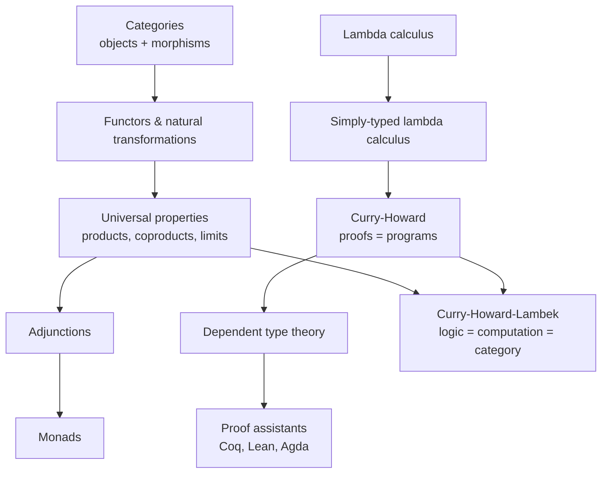

<div class="hero-section" style="background: linear-gradient(135deg, #232526 0%, #414345 100%); color: white; padding: 3rem 2rem; margin: -2rem -3rem 2rem -3rem; text-align: center;">
  <h1 style="color: white; margin: 0; font-size: 2.5rem;">Category Theory &amp; Type Theory</h1>
  <p style="font-size: 1.25rem; margin-top: 1rem; opacity: 0.9;">Categories, functors, and monads; the Curry-Howard correspondence, dependent types, constructive logic, and proof assistants</p>
</div>

[Advanced Topics](./) &raquo; Category Theory &amp; Type Theory

<div class="advanced-note" markdown="1">
**Graduate-level research page.** This is a rigorous treatment of category theory, type theory, and their unification through the Curry-Howard-Lambek correspondence, aimed at theoretical computer scientists, logicians, and mathematicians. **Prerequisites:** abstract algebra (groups, rings), set theory, first-order logic, and familiarity with a typed functional language (Haskell, OCaml, or Agda) is helpful. For an applied, code-first view of functional abstractions instead, see the [AI/ML Documentation](../../ai-ml/) and [Mathematical Reference](../../reference/).
</div>

<div class="intro-card" markdown="1">
<p class="lead-text">Category theory is often called "the mathematics of mathematics" — it studies structures not by their internal elements but by the <em>arrows</em> (structure-preserving maps) between them. Type theory, born from the same logical roots, studies how to build programs and proofs that cannot go wrong. The deep surprise, captured by the <strong>Curry-Howard-Lambek correspondence</strong>, is that these are three views of one object: <strong>propositions are types are objects, proofs are programs are morphisms, and a cartesian closed category, a typed lambda calculus, and an intuitionistic logic are the same thing in different clothing.</strong></p>
</div>

<div class="key-insights">
  <div class="insight-card"><i class="fas fa-project-diagram"></i><h4>Arrows over elements</h4><p>A category forgets what objects "are" and keeps only how they map to each other. Universal properties then characterize constructions uniquely up to isomorphism.</p></div>
  <div class="insight-card"><i class="fas fa-equals"></i><h4>Proofs are programs</h4><p>Curry-Howard makes "A implies B" the same data as a function from A to B. Type-checking a program is checking a proof.</p></div>
  <div class="insight-card"><i class="fas fa-layer-group"></i><h4>Monads structure effects</h4><p>A monad is a monoid in the category of endofunctors — and the disciplined way pure functional languages sequence side effects.</p></div>
  <div class="insight-card"><i class="fas fa-check-double"></i><h4>Machine-checked truth</h4><p>Dependent type theory lets a computer verify a proof to the last detail, underpinning Coq, Lean, and Agda.</p></div>
</div>

### The Logical Spine

The pages below are a dependency chain, not a list. Categories give the ambient language; functors and natural transformations let us compare categories; universal constructions (products, coproducts, limits) and adjunctions pin down "best" objects; monads package adjunctions into a single algebraic structure. In parallel, the lambda calculus gives a syntax for computation, the simply-typed lambda calculus tames it, Curry-Howard reveals it as logic, and dependent types extend logic to full constructive mathematics — which proof assistants then mechanize.



## Table of Contents
- [Categories](#categories)
- [Functors and Natural Transformations](#functors-and-natural-transformations)
- [Universal Constructions](#universal-constructions)
- [Adjunctions](#adjunctions)
- [Monads](#monads)
- [The Lambda Calculus and Type Systems](#the-lambda-calculus-and-type-systems)
- [The Curry-Howard Correspondence](#the-curry-howard-correspondence)
- [Dependent Type Theory and Constructive Logic](#dependent-type-theory-and-constructive-logic)
- [Proof Assistants](#proof-assistants)

## Categories

**Intuition**: A category is a universe of *objects* connected by *arrows* (morphisms) that compose associatively, with an identity arrow on every object. Crucially, the theory never looks inside an object — everything we can say about an object is expressed through the arrows into and out of it. This deliberate amnesia is the source of category theory's generality: groups, topological spaces, vector spaces, types, and logical propositions all become objects in suitable categories.

<div class="theory-card" markdown="1">
#### Definition (Category)
A **category** $\mathcal{C}$ consists of a collection of objects $\mathrm{ob}(\mathcal{C})$ and, for each ordered pair $(A, B)$, a collection of morphisms $\mathrm{Hom}_{\mathcal{C}}(A, B)$, together with a composition operation and identities satisfying:

$$
\circ : \mathrm{Hom}(B, C) \times \mathrm{Hom}(A, B) \to \mathrm{Hom}(A, C)
$$

$$
h \circ (g \circ f) = (h \circ f') \quad\text{where}\quad f' = g \circ f \qquad \text{(associativity)}
$$

$$
\mathrm{id}_B \circ f = f = f \circ \mathrm{id}_A \qquad \text{(identity laws)}
$$

for all $f : A \to B$, $g : B \to C$, $h : C \to D$.
</div>

<div class="example-card" markdown="1">
#### Worked Examples: categories everywhere
- **Set**: objects are sets, morphisms are total functions. Identity is the identity function; composition is function composition.
- **Grp**: objects are groups, morphisms are group homomorphisms.
- **Vect$_k$**: objects are vector spaces over a field $k$, morphisms are linear maps.
- **A monoid as a category**: any monoid $(M, \cdot, e)$ is a category with one object $\star$, with $\mathrm{Hom}(\star, \star) = M$, composition $= \cdot$, identity $= e$. Categories generalize monoids by allowing many objects.
- **A preorder as a category**: a set with a reflexive, transitive relation $\le$ is a category with at most one arrow $A \to B$ (present iff $A \le B$). Composition is transitivity; identities are reflexivity.

The last two examples show the slogan "a category is a *typed, multi-object* monoid" and "a category is a *proof-relevant* preorder."
</div>

### Special Morphisms

A morphism $f : A \to B$ is a **monomorphism** (mono) if it is left-cancellable: $f \circ g = f \circ h \implies g = h$. It is an **epimorphism** (epi) if right-cancellable. It is an **isomorphism** if it has a two-sided inverse $g$ with $g \circ f = \mathrm{id}_A$ and $f \circ g = \mathrm{id}_B$. In **Set**, monos are injections and epis are surjections — but this coincidence fails in general categories (in **Ring**, the inclusion $\mathbb{Z} \hookrightarrow \mathbb{Q}$ is both mono and epi yet not an iso).

### The Opposite Category and Duality

Every category $\mathcal{C}$ has an **opposite** $\mathcal{C}^{\mathrm{op}}$ with the same objects but every arrow reversed: $\mathrm{Hom}_{\mathcal{C}^{\mathrm{op}}}(A, B) = \mathrm{Hom}_{\mathcal{C}}(B, A)$. This gives **duality**: every theorem has a dual obtained by reversing all arrows. Products become coproducts, monos become epis, limits become colimits. Proving one statement proves its dual for free — a remarkable economy.

## Functors and Natural Transformations

**Intuition**: If categories are the objects of interest, functors are the structure-preserving maps *between* categories, and natural transformations are the maps between functors. This forms a tower — categories, functors, natural transformations — that is itself organized as a (2-)category.

<div class="theory-card" markdown="1">
#### Definition (Functor)
A **functor** $F : \mathcal{C} \to \mathcal{D}$ assigns to each object $A$ an object $F(A)$ and to each morphism $f : A \to B$ a morphism $F(f) : F(A) \to F(B)$, preserving identities and composition:

$$
F(\mathrm{id}_A) = \mathrm{id}_{F(A)}, \qquad F(g \circ f) = F(g) \circ F(f).
$$
</div>

A **covariant** functor preserves arrow direction; a **contravariant** functor (equivalently, a functor out of $\mathcal{C}^{\mathrm{op}}$) reverses it. The **hom-functor** $\mathrm{Hom}(A, -) : \mathcal{C} \to \mathbf{Set}$ is the prototypical covariant functor; $\mathrm{Hom}(-, B)$ is contravariant.

<div class="example-card" markdown="1">
#### Worked Example: the list functor
In a typed functional language, `List` is a functor on the category of types: it maps a type `A` to the type `List A`, and a function `f : A -> B` to `map f : List A -> List B`. The functor laws are exactly the familiar `map` laws:

```haskell
-- Identity:    map id        = id
-- Composition: map (g . f)   = map g . map f
fmap :: (a -> b) -> [a] -> [b]
fmap = map
```

A `Functor` instance in Haskell is precisely an endofunctor on the category of Haskell types (often called **Hask**).
</div>

<div class="theory-card" markdown="1">
#### Definition (Natural Transformation)
Given functors $F, G : \mathcal{C} \to \mathcal{D}$, a **natural transformation** $\eta : F \Rightarrow G$ assigns to each object $A$ a morphism $\eta_A : F(A) \to G(A)$ (a *component*) such that for every $f : A \to B$ the **naturality square** commutes:

$$
G(f) \circ \eta_A = \eta_B \circ F(f).
$$
</div>

Naturality says the transformation does not depend on any arbitrary choices — it works "uniformly" across the whole category. The slogan "natural transformations are polymorphic functions" is made precise by parametricity: in Haskell, any polymorphic function `eta :: forall a. F a -> G a` is automatically natural (a "theorem for free").

<div class="principle-card" markdown="1">
#### The Yoneda Lemma
For any functor $F : \mathcal{C} \to \mathbf{Set}$ and object $A$, there is a bijection, natural in both $A$ and $F$:

$$
\mathrm{Nat}(\mathrm{Hom}(A, -),\, F) \;\cong\; F(A).
$$

An object is completely determined (up to isomorphism) by the network of arrows into it: $A \cong B$ iff $\mathrm{Hom}(A, -) \cong \mathrm{Hom}(B, -)$. The **Yoneda embedding** $A \mapsto \mathrm{Hom}(A, -)$ realizes any category as a full subcategory of a functor category, the categorical analogue of Cayley's theorem.
</div>

## Universal Constructions

Many constructions across mathematics — products, disjoint unions, quotients, free objects — share a common shape: each is the *unique-up-to-isomorphism* solution to a mapping problem. Category theory captures this with **universal properties**.

### Products and Coproducts

<div class="theory-card" markdown="1">
#### Definition (Product)
A **product** of $A$ and $B$ is an object $A \times B$ with projections $\pi_1 : A \times B \to A$, $\pi_2 : A \times B \to B$ such that for any object $X$ with maps $f : X \to A$, $g : X \to B$ there is a **unique** $\langle f, g \rangle : X \to A \times B$ with

$$
\pi_1 \circ \langle f, g \rangle = f, \qquad \pi_2 \circ \langle f, g \rangle = g.
$$
</div>

The **coproduct** $A + B$ is the dual: reverse all arrows. It comes with injections $\iota_1, \iota_2$ and a unique copairing $[f, g] : A + B \to X$. In **Set**, the product is the cartesian product and the coproduct is the disjoint union; in **Vect**, both coincide as the direct sum.

<div class="example-card" markdown="1">
#### Worked Example: products and coproducts as types
Under Curry-Howard, the product is the **pair type** and the coproduct is the **sum type**:

```haskell
data Product a b = Pair a b          -- A x B   (logical conjunction A AND B)
data Coproduct a b = InL a | InR b   -- A + B   (logical disjunction A OR B)

fst :: Product a b -> a               -- projection pi_1
fst (Pair a _) = a

either :: (a -> c) -> (b -> c) -> Coproduct a b -> c   -- copairing [f, g]
either f _ (InL a) = f a
either _ g (InR b) = g b
```

The uniqueness in the universal property corresponds to the fact that these pattern matches are *forced* once the components are fixed.
</div>

### Limits and Colimits

Products and coproducts are special cases of **limits** and **colimits**, which take a limit over an arbitrary diagram $D : J \to \mathcal{C}$. A **limit** is a universal cone *into* the diagram; a **colimit** is a universal cocone *out* of it. Equalizers, pullbacks, and terminal objects are limits; coequalizers, pushouts, and initial objects are colimits.

| Construction | Limit form | Colimit (dual) form |
|---|---|---|
| Empty diagram | Terminal object $1$ | Initial object $0$ |
| Two objects | Product $A \times B$ | Coproduct $A + B$ |
| Parallel pair | Equalizer | Coequalizer |
| Cospan / span | Pullback | Pushout |

The **terminal object** $1$ has exactly one arrow from every object (the unit type, logical **true**); the **initial object** $0$ has exactly one arrow *to* every object (the empty type, logical **false**). A category is **complete** if it has all small limits, **cocomplete** if it has all small colimits; **Set** is both.

## Adjunctions

Adjunctions are arguably the central concept of category theory: they express that two functors are "approximate inverses" in a precise, weaker-than-equivalence sense, and they unify free constructions, Galois connections, and the meaning of logical connectives.

<div class="theory-card" markdown="1">
#### Definition (Adjunction)
Functors $F : \mathcal{C} \to \mathcal{D}$ (**left adjoint**) and $G : \mathcal{D} \to \mathcal{C}$ (**right adjoint**), written $F \dashv G$, form an **adjunction** if there is a natural bijection

$$
\mathrm{Hom}_{\mathcal{D}}(F(A),\, B) \;\cong\; \mathrm{Hom}_{\mathcal{C}}(A,\, G(B))
$$

natural in $A$ and $B$. Equivalently, there are natural transformations — the **unit** $\eta : \mathrm{Id} \Rightarrow G F$ and **counit** $\varepsilon : F G \Rightarrow \mathrm{Id}$ — satisfying the **triangle identities**:

$$
(\varepsilon F) \circ (F \eta) = \mathrm{id}_F, \qquad (G \varepsilon) \circ (\eta G) = \mathrm{id}_G.
$$
</div>

<div class="example-card" markdown="1">
#### Worked Example: free-forgetful adjunction
Let $U : \mathbf{Grp} \to \mathbf{Set}$ be the forgetful functor (a group, viewed as its underlying set) and $F : \mathbf{Set} \to \mathbf{Grp}$ the free-group functor. Then $F \dashv U$:

$$
\mathrm{Hom}_{\mathbf{Grp}}(F(S),\, H) \;\cong\; \mathrm{Hom}_{\mathbf{Set}}(S,\, U(H)).
$$

A group homomorphism out of the free group on $S$ is the same data as a function from the *set* $S$ — this is precisely the universal property "to define a homomorphism, just say where the generators go." The unit $\eta_S : S \to U F(S)$ is the inclusion of generators.
</div>

<div class="principle-card" markdown="1">
#### Adjoints and Currying
The defining example in programming is the **product-exponential adjunction** $(- \times A) \dashv (-)^A$:

$$
\mathrm{Hom}(C \times A,\, B) \;\cong\; \mathrm{Hom}(C,\, B^A).
$$

This is **currying**: a two-argument function $C \times A \to B$ corresponds to a one-argument function $C \to (A \to B)$. A category in which this adjunction exists for every $A$ (and which has finite products) is **cartesian closed** — the categorical home of the simply-typed lambda calculus.
</div>

## Monads

A **monad** packages the "two round trips" of an adjunction $T = G F$ into a single self-contained algebraic structure on one category. In computer science, monads are the canonical way to model effects — state, exceptions, nondeterminism, I/O — inside a pure language.

<div class="theory-card" markdown="1">
#### Definition (Monad)
A **monad** on a category $\mathcal{C}$ is an endofunctor $T : \mathcal{C} \to \mathcal{C}$ together with natural transformations — the **unit** $\eta : \mathrm{Id} \Rightarrow T$ and **multiplication** $\mu : T^2 \Rightarrow T$ — satisfying the associativity and unit coherence laws:

$$
\mu \circ T\mu = \mu \circ \mu T, \qquad \mu \circ T\eta = \mathrm{id}_T = \mu \circ \eta T.
$$
</div>

The slogan **"a monad is a monoid in the category of endofunctors"** reads off these diagrams: $\mu$ is the multiplication and $\eta$ the unit of a monoid object whose carrier is the endofunctor $T$, with composition $\circ$ playing the role of the tensor product.

<div class="example-card" markdown="1">
#### Worked Example: the monad in functional programming
In Haskell a monad is given by `return` (the unit $\eta$) and `>>=` ("bind"), which is equivalent to the categorical `join` (the multiplication $\mu$):

```haskell
class Functor m => Monad m where
  return :: a -> m a                 -- unit  eta
  (>>=)  :: m a -> (a -> m b) -> m b  -- bind

join :: Monad m => m (m a) -> m a    -- multiplication mu
join mma = mma >>= id

-- The Maybe monad: short-circuiting computation with failure
instance Monad Maybe where
  return = Just
  Nothing >>= _ = Nothing
  Just x  >>= f = f x
```

The monad laws (left identity, right identity, associativity) are exactly the unit and associativity coherence conditions above:

```haskell
-- return a >>= f      ==  f a            (left unit:  mu . eta T = id)
-- m >>= return        ==  m              (right unit: mu . T eta = id)
-- (m >>= f) >>= g      ==  m >>= (\x -> f x >>= g)   (assoc: mu . T mu = mu . mu T)
```

Every adjunction $F \dashv G$ induces a monad $T = GF$; conversely every monad arises this way (via its Kleisli or Eilenberg-Moore category), tying monads back to adjunctions.
</div>

## The Lambda Calculus and Type Systems

**Intuition**: The lambda calculus is a minimal model of computation built from just three constructs — variables, abstraction, and application — yet it is Turing-complete. Adding *types* rules out meaningless programs and, as the next section shows, turns the calculus into a logic.

### Untyped Lambda Calculus

Terms are generated by

$$
t ::= x \;\mid\; \lambda x.\, t \;\mid\; t\; t
$$

(variable, abstraction, application). Computation is **beta-reduction**:

$$
(\lambda x.\, t)\; u \;\longrightarrow_\beta\; t[x := u],
$$

substituting the argument $u$ for the bound variable $x$. The untyped calculus is Turing-complete but admits non-terminating terms such as $\Omega = (\lambda x.\, x\,x)(\lambda x.\, x\,x)$, which reduces to itself forever.

### Simply-Typed Lambda Calculus (STLC)

Types are built from base types and a function-type constructor:

$$
\tau ::= \iota \;\mid\; \tau \to \tau .
$$

A **typing judgment** $\Gamma \vdash t : \tau$ ("in context $\Gamma$, term $t$ has type $\tau$") is derived from three rules:

$$
\frac{x : \tau \in \Gamma}{\Gamma \vdash x : \tau}\;(\mathrm{var})
\qquad
\frac{\Gamma,\, x : \sigma \vdash t : \tau}{\Gamma \vdash \lambda x.\, t : \sigma \to \tau}\;(\mathrm{abs})
\qquad
\frac{\Gamma \vdash t : \sigma \to \tau \quad \Gamma \vdash u : \sigma}{\Gamma \vdash t\; u : \tau}\;(\mathrm{app})
$$

<div class="principle-card" markdown="1">
#### Strong Normalization
Every well-typed term of the simply-typed lambda calculus is **strongly normalizing**: every reduction sequence terminates. Types exactly exclude the looping terms (like $\Omega$) that have no type. This is the first hint that "well-typed = logically meaningful": a non-terminating proof would be a proof of a falsehood.
</div>

Beyond STLC, the **lambda cube** (Barendregt) classifies type systems along three axes — terms depending on types (polymorphism, **System F**), types depending on types (type operators, **$\lambda\omega$**), and types depending on terms (**dependent types**, $\lambda P$). The top corner, the **Calculus of Constructions**, has all three and underlies Coq.

## The Curry-Howard Correspondence

<div class="principle-card" markdown="1">
#### The Curry-Howard Correspondence (Propositions as Types)
There is an exact, structure-preserving dictionary between **intuitionistic logic** and **typed lambda calculus**: a proposition *is* a type, a proof *is* a program, and proof normalization *is* program evaluation.

| Logic | Type theory / programming |
|---|---|
| Proposition $A$ | Type $A$ |
| Proof of $A$ | Program (term) of type $A$ |
| $A \land B$ (conjunction) | Product / pair type $A \times B$ |
| $A \lor B$ (disjunction) | Sum type $A + B$ |
| $A \Rightarrow B$ (implication) | Function type $A \to B$ |
| $\top$ (true) | Unit type $1$ |
| $\bot$ (false) | Empty type $0$ |
| $\forall x.\, P(x)$ | Dependent product $\prod_{x} P(x)$ |
| $\exists x.\, P(x)$ | Dependent sum $\sum_{x} P(x)$ |
| Proof normalization | Program evaluation (beta-reduction) |
</div>

The correspondence is not a loose analogy but a literal isomorphism of formal systems. Extending it to categories — where a proposition is an *object*, a proof a *morphism*, and the logical connectives the *universal constructions* above — yields the **Curry-Howard-Lambek correspondence**:

$$
\textbf{intuitionistic logic} \;\cong\; \textbf{typed }\lambda\textbf{-calculus} \;\cong\; \textbf{cartesian closed category}.
$$

<div class="example-card" markdown="1">
#### Worked Example: a proof is a program
Consider the tautology $A \Rightarrow (B \Rightarrow A)$ ("from $A$, anything implies $A$"). Its proof, read through Curry-Howard, is the **K combinator** — a function that ignores its second argument:

```haskell
k :: a -> b -> a       -- type  =  proposition  A => (B => A)
k x _ = x              -- term  =  the proof itself
```

Likewise the S combinator `s :: (a -> b -> c) -> (a -> b) -> a -> c` inhabits the type $(A \Rightarrow B \Rightarrow C) \Rightarrow (A \Rightarrow B) \Rightarrow A \Rightarrow C$, a theorem of intuitionistic logic. Type-checking these definitions *is* verifying the proofs.
</div>

### Constructive (Intuitionistic) Logic

Curry-Howard corresponds to **intuitionistic**, not classical, logic. A constructive proof of $\exists x.\, P(x)$ must *produce a witness* $x$ — exactly the data carried by a term of the dependent sum type $\sum_x P(x)$. Consequently the **law of excluded middle** $A \lor \neg A$ and **double-negation elimination** $\neg\neg A \Rightarrow A$ are *not* generally provable: there is no uniform program that, given any proposition, returns either a proof or a refutation. Classical logic can be recovered computationally via control operators (the correspondence with `call/cc`, due to Griffin), at the cost of the clean "proofs compute witnesses" reading.

## Dependent Type Theory and Constructive Logic

**Dependent type theory** (Martin-Löf type theory, MLTT) extends the simply-typed correspondence so that types may *depend on terms*. This is what is needed to express genuine mathematics: "the type of vectors of length $n$" is a type indexed by a natural number $n$.

<div class="theory-card" markdown="1">
#### Dependent Products and Sums
- The **dependent function type** (Pi type) $\prod_{x : A} B(x)$ contains functions whose return type depends on the input value. It interprets the universal quantifier $\forall x : A.\, B(x)$.
- The **dependent pair type** (Sigma type) $\sum_{x : A} B(x)$ contains pairs $(a, b)$ where $b : B(a)$. It interprets the existential $\exists x : A.\, B(x)$, packaging a witness with evidence.

When $B$ does not depend on $x$, these degenerate to the ordinary function type $A \to B$ and product $A \times B$ respectively.
</div>

### Identity Types and Homotopy Type Theory

MLTT internalizes equality as an **identity type** $\mathrm{Id}_A(a, b)$ (often written $a =_A b$), whose terms are proofs that $a$ and $b$ are equal. The discovery that identity types behave like *paths* in a topological space launched **Homotopy Type Theory (HoTT)**: types are spaces, terms are points, equalities are paths, and equalities of equalities are homotopies. The **univalence axiom** (Voevodsky) asserts that equivalent types are equal, formalizing the working mathematician's habit of treating isomorphic structures as the same.

<div class="principle-card" markdown="1">
#### Why dependent types matter
Dependent types make the type system expressive enough to state *arbitrary mathematical theorems as types*. A program inhabiting the type **is** a proof of the theorem, checked mechanically by the type-checker. This is the foundation on which modern proof assistants verify everything from the four-color theorem to compiler correctness.
</div>

## Proof Assistants

Proof assistants are software implementations of these type theories that let humans and machines collaborate on fully formal, machine-checked proofs. They rest on the **de Bruijn criterion**: a small, trustworthy kernel checks every proof term, so the (large, possibly buggy) automation surrounding it cannot produce an unsound result.

<div class="example-card" markdown="1">
#### Worked Example: a verified proof in Lean
The proposition "addition of naturals is commutative" becomes a type; the proof is a term the kernel checks:

```lean
theorem add_comm (m n : Nat) : m + n = n + m := by
  induction n with
  | zero      => simp
  | succ k ih => rw [Nat.add_succ, ih, Nat.succ_add]
```

Once `lean` accepts this, the statement is true with the same certainty as a type-correct program runs — no informal step has been skipped.
</div>

| Assistant | Foundational theory | Notable feature / use |
|---|---|---|
| **Coq / Rocq** | Calculus of (Inductive) Constructions | CompCert verified C compiler; four-color theorem |
| **Lean 4** | Dependent type theory (CIC-style) | `mathlib`, a vast formalized math library; also a programming language |
| **Agda** | Martin-Löf type theory | Dependently-typed programming; HoTT experiments |
| **Isabelle/HOL** | Higher-order logic (not dependent) | Sledgehammer automation; seL4 microkernel proof |

<div class="principle-card" markdown="1">
#### Tactics versus terms
A proof can be written directly as a term (the Curry-Howard program) or built interactively with **tactics** — commands like `intro`, `apply`, `induction`, `rw` that manipulate the proof goal. Tactics produce a proof term behind the scenes; the kernel checks that term, so tactic bugs cannot compromise soundness. This separation is what lets proof assistants combine powerful, untrusted automation with a tiny trusted core.
</div>

## Research Frontiers

- **Homotopy Type Theory and Univalent Foundations**: an alternative to set theory in which equivalence-invariance is built in; cubical type theory gives univalence computational content.
- **Cubical Agda**: makes the univalence axiom and higher inductive types *compute*, restoring canonicity that the axiomatic presentation breaks.
- **Mechanized mathematics at scale**: Lean's `mathlib` now contains hundreds of thousands of theorems; the Liquid Tensor Experiment formalized a frontier result of Scholze.
- **AI-assisted proving**: large language models guiding tactic search (hammer-style premise selection, proof autoformalization) is an active bridge to the [Advanced AI Mathematics](../ai-mathematics/) program.
- **Linear and quantitative type theory**: substructural type systems (linear, affine) track resource usage, connecting to monoidal categories and to the semantics of [quantum computation](../quantum-algorithms-research/).

## Key Takeaways

<div class="takeaway-grid">
  <div class="takeaway-card"><h4>Arrows, not elements</h4><p>Categories describe structure through morphisms and universal properties, characterizing constructions uniquely up to isomorphism.</p></div>
  <div class="takeaway-card"><h4>Functors and Yoneda</h4><p>Functors compare categories, natural transformations compare functors, and Yoneda shows an object is determined by its arrows.</p></div>
  <div class="takeaway-card"><h4>Adjunctions are everywhere</h4><p>Free constructions, currying, and the meaning of connectives are all adjunctions $F \dashv G$.</p></div>
  <div class="takeaway-card"><h4>Monads tame effects</h4><p>A monad is a monoid in endofunctors and the disciplined way pure languages sequence state, failure, and I/O.</p></div>
  <div class="takeaway-card"><h4>Proofs are programs</h4><p>Curry-Howard-Lambek identifies intuitionistic logic, typed lambda calculus, and cartesian closed categories.</p></div>
  <div class="takeaway-card"><h4>Dependent types verify math</h4><p>Pi/Sigma types express full constructive mathematics, which proof assistants like Coq, Lean, and Agda check mechanically.</p></div>
</div>

## See Also

<div class="see-also-card" markdown="1">
#### See Also

**Related Advanced Topics**
- [Advanced AI Mathematics](../ai-mathematics/) — Learning theory and the optimization foundations of ML, with proof assistants as a frontier for formalized ML
- [Quantum Algorithms Research](../quantum-algorithms-research/) — Monoidal categories and linear types as semantics for quantum computation
- [Distributed Systems Theory](../distributed-systems-theory/) — Formal verification, temporal logic, and TLA+ for distributed algorithms
- [Monorepo Strategies](../monorepo/) — Engineering large verified codebases and build graphs

**Applied & Foundational**
- [AI/ML Documentation](../../ai-ml/) — Practical functional abstractions and model tooling
- [Mathematical Reference](../../reference/) — Algebra, logic, and notation quick reference
</div>
