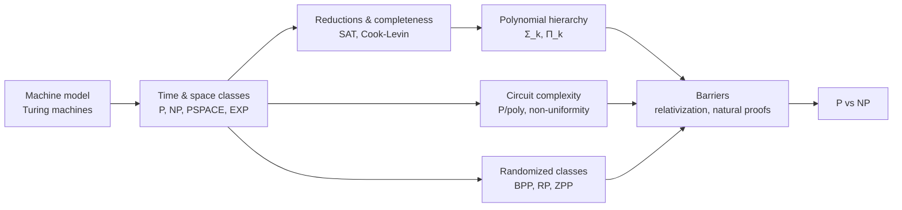
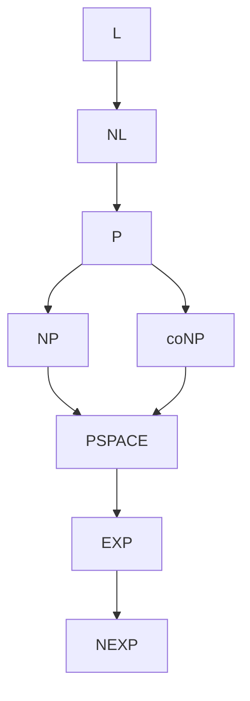
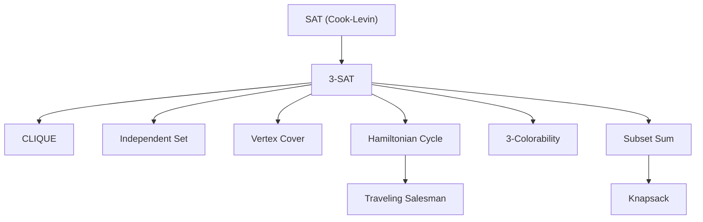
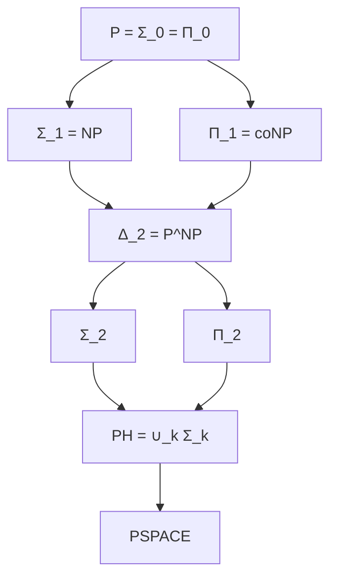
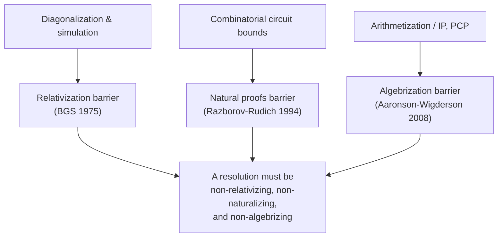
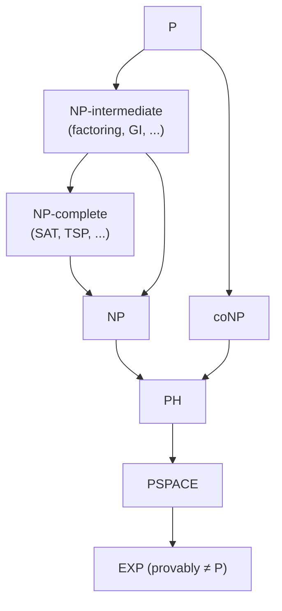

  <h1 style="color: white; margin: 0; font-size: 2.5rem;">Computational Complexity Theory</h1>
  
Machine models, resource-bounded complexity classes, completeness, the polynomial hierarchy, and the barriers around P vs NP

[Advanced Topics](./) &raquo; Computational Complexity Theory

**Graduate-level research page.** This page develops the formal theory of computation: machine models, time and space classes, reductions and completeness, the polynomial hierarchy, circuit complexity, randomized computation, and the relativization/natural-proofs barriers that explain why P vs NP remains open. **Prerequisites:** discrete mathematics, formal languages and automata, graph theory, basic probability, and mathematical maturity with asymptotic analysis. For applied algorithm analysis and Big-O in practice instead, see the [Distributed Systems Theory](../distributed-systems-theory/) page's complexity sections or the practical [Technology Hub](../../technology/).

Complexity theory asks not <em>whether</em> a problem can be solved, but <em>how much</em> of a resource — time, memory, randomness, nondeterminism, circuit size — is required to solve it. Its central objects are <strong>complexity classes</strong>: sets of decision problems solvable within a given resource bound. Its central question is whether these classes are genuinely different. P vs NP is the most famous instance, but the same separation question recurs at every level of the hierarchy, and a recurring theme is that our standard proof techniques are provably too weak to settle it. This page builds the machinery from the Turing machine up to the barriers.

  
<i class="fas fa-cogs"></i><h4>The model barely matters</h4>
Up to polynomial overhead, every "reasonable" sequential model (multi-tape TM, RAM, while-program) computes the same things in the same time class. This robustness is what makes P a meaningful notion of "efficient."

  
<i class="fas fa-project-diagram"></i><h4>Completeness localizes hardness</h4>
A single NP-complete problem — SAT — is a faithful proxy for all of NP. Polynomial-time reductions let one hard problem stand in for thousands.

  
<i class="fas fa-dice"></i><h4>Randomness may be free</h4>
BPP is widely conjectured to equal P: under plausible circuit lower bounds, derandomization shows coin flips add no power to polynomial time.

  
<i class="fas fa-ban"></i><h4>Our tools hit walls</h4>
Relativization, natural proofs, and algebrization each rule out broad classes of techniques for P vs NP. Any resolution must be "non-relativizing" and "non-naturalizing."

### How to Read This Page

The development is bottom-up. We fix a machine model (the Turing machine) so that "time" and "space" have precise meanings, then carve out the standard classes by bounding those resources. Reductions and completeness give us a way to compare problems and identify the hardest members of a class. Stacking nondeterminism produces the polynomial hierarchy; replacing uniform machines with circuit families gives a non-uniform model that is easier to prove lower bounds against; adding randomness gives BPP. Finally, the relativization and natural-proofs barriers explain why, despite all this structure, P vs NP is still open.

## Table of Contents
- [The Turing Machine Model](#the-turing-machine-model)
- [Time and Space Complexity Classes](#time-and-space-complexity-classes)
- [Reductions and Completeness](#reductions-and-completeness)
- [The Polynomial Hierarchy](#the-polynomial-hierarchy)
- [Circuit Complexity and Non-Uniformity](#circuit-complexity-and-non-uniformity)
- [Randomized Complexity Classes](#randomized-complexity-classes)
- [Relativization and the Barriers](#relativization-and-the-barriers)
- [P vs NP](#p-vs-np)

## The Turing Machine Model

Complexity is defined relative to a model of computation. The standard choice is the **multi-tape deterministic Turing machine (DTM)** — expressive enough to be realistic, simple enough to reason about, and robust under polynomial simulation by any other reasonable model.

#### Definition (Multi-tape Turing machine)
A $k$-tape Turing machine is a tuple $M = (Q, \Sigma, \Gamma, \delta, q_0, q_{\mathrm{acc}}, q_{\mathrm{rej}})$ where $Q$ is a finite set of states, $\Sigma$ the input alphabet, $\Gamma \supseteq \Sigma \cup \{\sqcup\}$ the tape alphabet (with blank $\sqcup$), and the transition function is
$$\delta : Q \times \Gamma^{k} \to Q \times \Gamma^{k} \times \{L, R, S\}^{k}.$$
The machine reads one symbol from each tape, writes one symbol to each, moves each head left/right/stay, and changes state. It **halts** on entering $q_{\mathrm{acc}}$ or $q_{\mathrm{rej}}$.

**Configurations and computation.** A *configuration* records the state, the head positions, and the (finite non-blank portions of the) tape contents. The transition function induces a *next-configuration* relation; a computation is the sequence of configurations from the start. For a DTM this sequence is unique. The **time** taken on input $x$ is the number of steps until halting; the **space** is the number of distinct work-tape cells visited (the read-only input tape is not charged, which is what lets us study *sublinear* space).

**Nondeterminism.** A **nondeterministic Turing machine (NTM)** replaces $\delta$ with a *relation* (equivalently $\delta : Q \times \Gamma^k \to \mathcal{P}(Q \times \Gamma^k \times \{L,R,S\}^k)$): from a configuration there may be several legal successors. The computation is a *tree*. An NTM **accepts** $x$ if *some* root-to-leaf branch reaches $q_{\mathrm{acc}}$. Its running time is the height of the shortest accepting branch (or the whole tree's depth on rejection). Nondeterminism is not a physical model — it is a definitional device that captures "is there a short certificate?".

#### The robustness of the model
Any $k$-tape TM running in time $t(n)$ can be simulated by a single-tape TM in time $O(t(n)^2)$, and by a two-tape TM in time $O(t(n)\log t(n))$. A random-access machine (RAM) with unit-cost arithmetic and a TM simulate each other with only polynomial overhead. Consequently **polynomial time is model-independent** — the defining feature that makes P a stable notion.

This is the content of the (modern, strengthened) **Church–Turing thesis** as applied to complexity: every physically realizable *deterministic* sequential model is polynomially equivalent to the Turing machine. Quantum computation is the one widely-studied potential exception, captured by the class **BQP** (see [Quantum Algorithms Research](../quantum-algorithms-research/)).

### Asymptotic notation and complexity measures

We measure resources as functions of the input length $n = |x|$, ignoring constants and lower-order terms.

$$f(n) = O(g(n)) \iff \exists c > 0,\ n_0 :\ \forall n \geq n_0,\ f(n) \leq c\, g(n).$$
$$f(n) = \Omega(g(n)) \iff g(n) = O(f(n)), \qquad f(n) = \Theta(g(n)) \iff f = O(g) \wedge f = \Omega(g).$$

A function $t : \mathbb{N} \to \mathbb{N}$ is **time-constructible** if there is a TM that, on input $1^n$, halts in exactly $t(n)$ steps; **space-constructible** is analogous. All natural bounds ($n$, $n^2$, $2^n$, $n\log n$) are constructible. Constructibility is the technical hypothesis the hierarchy theorems below need so the simulating machine can "count its own budget."

## Time and Space Complexity Classes

Fixing the resource and the bound carves out a class.

#### Definition (Deterministic and nondeterministic resource classes)
For a constructible bound $f$,
$$\mathrm{DTIME}(f(n)) = \{\, L : L \text{ decided by a DTM in } O(f(n)) \text{ time}\,\},$$
$$\mathrm{NTIME}(f(n)) = \{\, L : L \text{ decided by an NTM in } O(f(n)) \text{ time}\,\},$$
$$\mathrm{DSPACE}(f(n)),\ \mathrm{NSPACE}(f(n)) \text{ analogously for space.}$$

The headline classes are unions over all polynomials or exponentials:

| Class | Definition | Intuition |
|-------|-----------|-----------|
| $\mathrm{L}$ | $\mathrm{DSPACE}(\log n)$ | logarithmic work space |
| $\mathrm{NL}$ | $\mathrm{NSPACE}(\log n)$ | nondeterministic log space |
| $\mathrm{P}$ | $\bigcup_k \mathrm{DTIME}(n^k)$ | deterministic polynomial time ("efficient") |
| $\mathrm{NP}$ | $\bigcup_k \mathrm{NTIME}(n^k)$ | poly-checkable certificates |
| $\mathrm{coNP}$ | $\{\overline{L} : L \in \mathrm{NP}\}$ | poly-checkable *dis*proofs |
| $\mathrm{PSPACE}$ | $\bigcup_k \mathrm{DSPACE}(n^k)$ | polynomial memory, unbounded time |
| $\mathrm{EXP}$ | $\bigcup_k \mathrm{DTIME}(2^{n^k})$ | exponential time |
| $\mathrm{NEXP}$ | $\bigcup_k \mathrm{NTIME}(2^{n^k})$ | nondeterministic exponential time |

### NP as certificate-checking

The certificate (or "verifier") definition of NP is the one that connects to practice, and it is provably equivalent to the NTM definition.

#### Definition (NP via verifiers)
$L \in \mathrm{NP}$ iff there is a polynomial $p$ and a polynomial-time DTM $V$ (the *verifier*) such that
$$x \in L \iff \exists\, w \in \{0,1\}^{p(|x|)} :\ V(x, w) = 1.$$
The string $w$ is a *certificate* (witness). "Guess the certificate" is exactly the work the nondeterministic branches do.

For example, $\mathrm{SAT} \in \mathrm{NP}$: the certificate is a satisfying assignment, and $V$ evaluates the formula in linear time. $\mathrm{coNP}$ flips the quantifier — membership has a *universally*-checkable form ($x \in L \iff \forall w,\ V(x,w)=1$); TAUTOLOGY (is a formula true under all assignments?) is the canonical coNP problem.

### Known inclusions

$$\mathrm{L} \subseteq \mathrm{NL} \subseteq \mathrm{P} \subseteq \mathrm{NP} \cap \mathrm{coNP} \subseteq \mathrm{NP} \cup \mathrm{coNP} \subseteq \mathrm{PSPACE} \subseteq \mathrm{EXP} \subseteq \mathrm{NEXP}.$$

Every inclusion shown is *known*; almost none are known to be *strict*. The two structural pillars that organize them are the hierarchy theorems and Savitch's theorem.

### The hierarchy theorems

More resource strictly buys more computational power — the one place we *can* prove separations.

#### Theorem (Time Hierarchy, Hartmanis–Stearns)
If $f$ is time-constructible and $g(n)\log g(n) = o(f(n))$, then
$$\mathrm{DTIME}(g(n)) \subsetneq \mathrm{DTIME}(f(n)).$$
In particular $\mathrm{P} \subsetneq \mathrm{EXP}$, so there *exist* provably intractable decidable problems.

#### Theorem (Space Hierarchy)
If $f$ is space-constructible and $g(n) = o(f(n))$, then
$$\mathrm{DSPACE}(g(n)) \subsetneq \mathrm{DSPACE}(f(n)).$$
Hence $\mathrm{L} \subsetneq \mathrm{PSPACE}$.

**Proof idea (time hierarchy).** Diagonalization. Build a machine $D$ that, on input $\langle M\rangle$, simulates $M$ on $\langle M\rangle$ for $f(n)$ steps and *flips* the answer. $D$ runs in $\mathrm{DTIME}(f)$ (the $\log g$ slowdown is the cost of a universal simulator's bookkeeping). No machine running in time $g \ll f$ can decide $L(D)$, because such a machine would disagree with $D$ on its own encoding — the classic self-reference contradiction. The $\log$ factor is the price of universal simulation; with a RAM-style model it can be removed.

The hierarchy theorems show the *vertical* axis (more of the same resource) is strict. The hard open questions are all about the *horizontal* axis: does *changing the resource* (determinism to nondeterminism, time to space) add power?

### Savitch's theorem and the space classes

For space, nondeterminism is provably almost free.

#### Theorem (Savitch, 1970)
For space-constructible $f(n) \geq \log n$,
$$\mathrm{NSPACE}(f(n)) \subseteq \mathrm{DSPACE}(f(n)^2).$$
In particular $\mathrm{NPSPACE} = \mathrm{PSPACE}$ and $\mathrm{NL} \subseteq \mathrm{DSPACE}(\log^2 n)$.

**Proof idea.** Reachability between configurations is the bottleneck. Define $\mathrm{REACH}(c_1, c_2, i)$ = "can $c_2$ be reached from $c_1$ in $\leq 2^i$ steps?" and solve it recursively by guessing a midpoint $c_m$: $\mathrm{REACH}(c_1,c_2,i)$ holds iff $\exists c_m:\ \mathrm{REACH}(c_1,c_m,i{-}1) \wedge \mathrm{REACH}(c_m,c_2,i{-}1)$. The recursion depth is $O(f(n))$ and each level stores one configuration of size $O(f(n))$, giving $O(f(n)^2)$ total space. Time blows up to exponential, but space is what we are counting.

A companion result, the **Immerman–Szelepcsényi theorem** (1987–88), shows nondeterministic space is closed under complement: $\mathrm{NSPACE}(f) = \mathrm{coNSPACE}(f)$ for $f \geq \log n$, so $\mathrm{NL} = \mathrm{coNL}$. (The analogous question for *time*, whether $\mathrm{NP} = \mathrm{coNP}$, is wide open and conjectured false.)

## Reductions and Completeness

Reductions let us *compare* problems: if $A$ reduces to $B$, then $B$ is "at least as hard" as $A$. Completeness identifies the single hardest problems in a class.

#### Definition (Polynomial-time many-one reduction)
$A \leq_{p} B$ if there is a polynomial-time computable $f$ such that
$$x \in A \iff f(x) \in B \quad \text{for all } x.$$
$A \leq_p B$ means "an efficient algorithm for $B$ yields one for $A$." For space classes we use the stricter **log-space reduction** $\leq_{\log}$, computable in $O(\log n)$ space.

#### Definition (Hardness and completeness)
Let $\mathcal{C}$ be a class and $\leq$ a reduction. A language $B$ is **$\mathcal{C}$-hard** (under $\leq$) if $A \leq B$ for every $A \in \mathcal{C}$. It is **$\mathcal{C}$-complete** if additionally $B \in \mathcal{C}$.
A complete problem is a faithful proxy: $\mathcal{C} = \mathcal{C}'$ collapses to a single reduction question about the complete problem.

We must reduce with *weaker* resources than the class we study, or the reduction could smuggle in the answer. NP-completeness uses $\leq_p$ (P is weaker than NP); NL- and P-completeness use $\leq_{\log}$ (because $\leq_p$ would be useless inside P).

### The Cook–Levin theorem

The foundational completeness result. Boolean satisfiability is the seed from which all of NP-completeness grows.

#### Theorem (Cook 1971, Levin 1973)
$\mathrm{SAT}$ — given a Boolean formula, is there a satisfying assignment? — is **NP-complete**. So is $\mathrm{3SAT}$ (clauses of exactly three literals).

**Proof sketch.** $\mathrm{SAT} \in \mathrm{NP}$ is immediate (the assignment is the certificate). For hardness, take any $L \in \mathrm{NP}$ decided by an NTM $M$ in time $p(n)$. The entire computation fits in a $p(n) \times p(n)$ **tableau** (rows = time steps, columns = tape cells). We build a formula $\varphi_x$ whose variables encode "cell $c$ at time $t$ holds symbol $s$ / head is here / state is $q$," with clauses asserting:
1. the first row encodes the start configuration on input $x$;
2. each $2\times 3$ window of cells obeys $\delta$ (this is where nondeterministic *choices* become existentially-quantified variables);
3. some row is accepting.

Then $x \in L \iff M$ has an accepting branch $\iff \varphi_x \in \mathrm{SAT}$, and $\varphi_x$ is built in polynomial time. The reduction to 3SAT clausifies each constraint into 3-literal clauses with auxiliary variables.

Once SAT is complete, hardness propagates by composition: $\leq_p$ is transitive, so to prove a new problem $B$ is NP-hard it suffices to reduce *one known* NP-hard problem to it.

Karp's 1972 paper exhibited 21 such reductions; thousands are now known. Crucially, **if any NP-complete problem is in P, then P = NP** — because everything in NP reduces to it.

### Completeness for other classes

| Class | A canonical complete problem | Reduction |
|-------|------------------------------|-----------|
| $\mathrm{NL}$ | $\mathrm{STCON}$ (directed $s$–$t$ connectivity) | $\leq_{\log}$ |
| $\mathrm{P}$ | $\mathrm{CVP}$ (Circuit Value Problem) | $\leq_{\log}$ |
| $\mathrm{NP}$ | $\mathrm{SAT}$, $\mathrm{3SAT}$, CLIQUE, … | $\leq_p$ |
| $\mathrm{coNP}$ | $\mathrm{TAUTOLOGY}$, $\mathrm{UNSAT}$ | $\leq_p$ |
| $\mathrm{PSPACE}$ | $\mathrm{TQBF}$ (True Quantified Boolean Formula) | $\leq_p$ |
| $\mathrm{EXP}$ | succinct-circuit versions of P-complete problems | $\leq_p$ |

$\mathrm{TQBF}$ — deciding the truth of $\exists x_1 \forall x_2 \exists x_3 \cdots \varphi$ — is the PSPACE archetype: the alternating quantifiers correspond exactly to exploring a game tree, and game-against-an-adversary problems (generalized Geography, Go, etc.) are typically PSPACE-complete. P-completeness, meanwhile, is the theory of *inherently sequential* problems: a P-complete problem is unlikely to have a fast parallel ($\mathrm{NC}$) algorithm.

## The Polynomial Hierarchy

NP and coNP correspond to one quantifier ($\exists$ or $\forall$) in front of a poly-time predicate. Alternating quantifiers builds an infinite tower — the **polynomial hierarchy (PH)** — that sits between NP and PSPACE.

#### Definition (Polynomial hierarchy)
Set $\Sigma_0^p = \Pi_0^p = \Delta_0^p = \mathrm{P}$. For $k \geq 0$:
$$\Sigma_{k+1}^p = \mathrm{NP}^{\Sigma_k^p}, \qquad \Pi_{k+1}^p = \mathrm{coNP}^{\Sigma_k^p}, \qquad \Delta_{k+1}^p = \mathrm{P}^{\Sigma_k^p},$$
where $\mathcal{C}^{\mathcal{D}}$ denotes $\mathcal{C}$ with an oracle for $\mathcal{D}$. Equivalently, $L \in \Sigma_k^p$ iff there is a poly-time predicate $R$ and polynomial bounds with
$$x \in L \iff \exists w_1\, \forall w_2\, \exists w_3 \cdots Q_k w_k\ R(x, w_1, \dots, w_k),$$
with $k$ alternating quantifiers starting from $\exists$ ($\Pi_k^p$ starts from $\forall$). Then $\mathrm{PH} = \bigcup_k \Sigma_k^p$.

So $\Sigma_1^p = \mathrm{NP}$, $\Pi_1^p = \mathrm{coNP}$, and $\Delta_2^p = \mathrm{P}^{\mathrm{NP}}$ (e.g. computing the *optimal* clique size, not just deciding a threshold). Each level contains the ones below it:
$$\Sigma_k^p \cup \Pi_k^p \subseteq \Delta_{k+1}^p \subseteq \Sigma_{k+1}^p \cap \Pi_{k+1}^p, \qquad \mathrm{PH} \subseteq \mathrm{PSPACE}.$$

#### Collapse theorems
The hierarchy is conjectured **infinite** (all levels distinct). But it is fragile:
- If $\Sigma_k^p = \Pi_k^p$ for some $k$, then $\mathrm{PH} = \Sigma_k^p$ — the hierarchy *collapses to level $k$*.
- In particular, **if $\mathrm{P} = \mathrm{NP}$ then $\mathrm{PH} = \mathrm{P}$**, and **if $\mathrm{NP} = \mathrm{coNP}$ then $\mathrm{PH} = \mathrm{NP}$**.
So "the polynomial hierarchy is infinite" is a strictly stronger conjecture than $\mathrm{P} \neq \mathrm{NP}$, and theorists often state results as "...unless PH collapses" to signal an extremely unlikely conclusion.

**Why a collapse propagates.** If the $\exists/\forall$ at level $k$ can be swapped (that is, $\Sigma_k^p = \Pi_k^p$), then any two adjacent same-type quantifiers in a level-$(k{+}1)$ formula can be merged, and the alternation count never exceeds $k$ thereafter — every higher level folds down. This is the quantifier-alternation analogue of $\mathrm{NP} = \mathrm{coNP}$ trivializing all of PH.

## Circuit Complexity and Non-Uniformity

Turing machines are **uniform**: one finite program handles all input lengths. **Circuits** are **non-uniform**: a *different* circuit is permitted for each length $n$. This extra freedom makes circuits a promising target for lower bounds — combinatorial objects are sometimes easier to argue about than programs.

#### Definition (Boolean circuits and P/poly)
A Boolean circuit on $n$ inputs is a DAG whose nodes are AND/OR/NOT gates (and input/constant nodes), with one output. Its **size** is the number of gates, its **depth** the longest input-to-output path. A *family* $\{C_n\}_{n\in\mathbb{N}}$ decides $L$ if $C_n$ outputs $1$ exactly on the length-$n$ members of $L$. Then
$$\mathrm{P/poly} = \{\, L : L \text{ has a circuit family of size } n^{O(1)}\,\}.$$

The non-uniformity is genuine power: $\mathrm{P/poly}$ contains **undecidable** languages (encode a hard unary language one bit per input length into the circuits). So $\mathrm{P} \subsetneq \mathrm{P/poly}$ in the sense that P/poly contains things P cannot — yet,

#### Why circuit lower bounds attack P vs NP
$\mathrm{P} \subseteq \mathrm{P/poly}$ (unfold a poly-time TM's computation into a poly-size circuit, one layer per step). Therefore **proving $\mathrm{NP} \not\subseteq \mathrm{P/poly}$ would prove $\mathrm{P} \neq \mathrm{NP}$.** This reduces a question about *algorithms* to one about *circuit size* — combinatorics rather than computation.

The **Karp–Lipton theorem** sharpens the stakes: *if* $\mathrm{NP} \subseteq \mathrm{P/poly}$, *then* $\mathrm{PH} = \Sigma_2^p$ (the hierarchy collapses to its second level). So NP having small circuits is itself a near-incredible conclusion, which is why most researchers believe $\mathrm{NP} \not\subseteq \mathrm{P/poly}$.

### Bounded-depth circuits and what we *can* prove

Unconditional lower bounds exist only for *restricted* circuit classes.

| Class | Resources | Status |
|-------|-----------|--------|
| $\mathrm{AC}^0$ | constant depth, unbounded fan-in AND/OR | $\mathrm{PARITY} \notin \mathrm{AC}^0$ (Furst–Saxe–Sipser; Håstad's switching lemma) |
| $\mathrm{AC}^0[p]$ | $\mathrm{AC}^0$ plus mod-$p$ gates | $\mathrm{MOD}_q \notin \mathrm{AC}^0[p]$ for distinct primes (Razborov–Smolensky) |
| $\mathrm{TC}^0$ | constant depth with threshold gates | strong lower bounds *open* |
| $\mathrm{NC}^i$ | depth $O(\log^i n)$, bounded fan-in | $\mathrm{NC} = \bigcup_i \mathrm{NC}^i$ = efficiently parallelizable |
| monotone circuits | AND/OR only, no NOT | $\mathrm{CLIQUE}$ needs exponential monotone size (Razborov) |

These successes are real but stop short: the moment we allow general (unrestricted depth, non-monotone) circuits, no superlinear lower bound is known for any explicit NP problem — and the **natural proofs** barrier (below) explains the wall.

A related uniformity remark: $\mathrm{NC}^1 \subseteq \mathrm{L} \subseteq \mathrm{NL} \subseteq \mathrm{NC}^2 \subseteq \mathrm{P}$, so the parallel ($\mathrm{NC}$) and small-space classes interleave. The **$\mathrm{NC}$ vs P** question — are all efficient problems efficiently parallelizable? — is the parallel-computing analogue of P vs NP, and P-complete problems are the conjectured obstructions.

## Randomized Complexity Classes

Allowing the machine to flip coins yields *probabilistic* classes. The key design choice is what kind of error we tolerate.

#### Definition (Probabilistic polynomial-time classes)
A probabilistic TM has access to random bits; it runs in polynomial time and we bound its error probability over its coins.
- $\mathrm{BPP}$ (bounded-error, two-sided): $x\in L \Rightarrow \Pr[\text{accept}] \geq \tfrac{2}{3}$; $x\notin L \Rightarrow \Pr[\text{accept}] \leq \tfrac{1}{3}$.
- $\mathrm{RP}$ (one-sided): $x\in L \Rightarrow \Pr[\text{accept}] \geq \tfrac{1}{2}$; $x\notin L \Rightarrow \Pr[\text{accept}] = 0$.
- $\mathrm{coRP}$: error only on no-instances.
- $\mathrm{ZPP}$ (zero-error, Las Vegas): always correct, *expected* poly time; $\mathrm{ZPP} = \mathrm{RP} \cap \mathrm{coRP}$.

**Amplification.** The constants $\tfrac{2}{3}, \tfrac{1}{3}$ are arbitrary. Run a BPP machine $k$ times and take the majority vote; by a Chernoff bound the error drops doubly-exponentially in $k$:
$$\Pr[\text{majority wrong}] \leq \exp\!\left(-\,2 k\,\Big(\tfrac{1}{2} - \tfrac{1}{3}\Big)^{2}\right) = \exp\!\left(-\tfrac{k}{18}\right).$$
So any gap bounded away from $\tfrac12$ amplifies to error $2^{-n}$ in polynomial time — the definition is extremely robust.

### Where BPP sits

$$\mathrm{P} \subseteq \mathrm{ZPP} \subseteq \mathrm{RP} \subseteq \mathrm{BPP} \subseteq \Sigma_2^p \cap \Pi_2^p, \qquad \mathrm{RP} \subseteq \mathrm{NP}.$$

The containment $\mathrm{BPP} \subseteq \Sigma_2^p \cap \Pi_2^p$ (Sipser–Gács–Lautemann) is notable because BPP is *not known* to have complete problems and is not known to be inside NP — yet it provably cannot escape the second level of PH. The **Adleman** theorem adds $\mathrm{BPP} \subseteq \mathrm{P/poly}$: a randomized algorithm's coins can be fixed to a single good "advice" string per input length.

#### Is randomness even necessary? — derandomization
The modern expectation is **$\mathrm{P} = \mathrm{BPP}$**. The Nisan–Wigderson and Impagliazzo–Wigderson program shows this follows from plausible *hardness*: if there is a problem in $\mathrm{E} = \mathrm{DTIME}(2^{O(n)})$ requiring circuits of size $2^{\Omega(n)}$, then strong **pseudorandom generators** exist and $\mathrm{BPP} = \mathrm{P}$. The slogan is **"hardness vs randomness"**: a hard enough function can be stretched into pseudorandom bits that fool any efficient test, letting us deterministically simulate the coin flips.

This is a rare *positive* use of lower bounds: rather than separating classes, a circuit lower bound would *collapse* BPP into P. Empirically the program already paid off — the famous **AKS primality test (2002)** put PRIMES in P unconditionally, removing a long-standing flagship problem from the "needs randomness" column.

## Relativization and the Barriers

Why, after fifty years, is P vs NP still open? Because three successive **barrier theorems** show that the techniques we have are provably incapable of resolving it. Any proof must evade all three.

### Relativization (Baker–Gill–Solovay, 1975)

An **oracle** $A$ is a language a machine may query in one step. A proof technique *relativizes* if it works unchanged when every machine is given the same oracle — diagonalization and simulation both do, because they treat machines as black boxes.

#### Theorem (Baker–Gill–Solovay)
There exist oracles $A$ and $B$ with
$$\mathrm{P}^{A} = \mathrm{NP}^{A} \qquad \text{and} \qquad \mathrm{P}^{B} \neq \mathrm{NP}^{B}.$$

**Construction.** For $A$, take any PSPACE-complete oracle: with it, both $\mathrm{P}^A$ and $\mathrm{NP}^A$ equal PSPACE, so they coincide. For $B$, define a unary language $L_B = \{1^n : B \text{ contains a length-}n\text{ string}\}$; clearly $L_B \in \mathrm{NP}^B$ (guess the string and query). By diagonalizing against all poly-time oracle machines — at each stage reserving a long unqueried string we are still free to put into $B$ or not — we force every $\mathrm{P}^B$ machine to err, so $L_B \notin \mathrm{P}^B$.

#### Consequence
Since the *same* proof gives opposite answers under different oracles, **no relativizing technique can settle P vs NP.** This immediately retired the hope that clever diagonalization alone would do it.

### Natural proofs (Razborov–Rudich, 1994)

After BGS, circuit lower bounds (which do *not* obviously relativize) became the great hope. Razborov and Rudich identified why even *those* stalled.

A lower-bound argument is a **natural proof** against a class $\mathcal{C}$ if it works by exhibiting a *property* $P$ of Boolean functions that is (i) **useful** — every function in $\mathcal{C}$ lacks $P$, so possessing $P$ certifies hardness; (ii) **large** — a random function has $P$ with non-negligible probability; and (iii) **constructive** — $P$ is checkable in time polynomial in the truth-table size ($2^n$). Almost every known circuit lower bound is natural in this sense.

#### Theorem (Razborov–Rudich)
If strong **pseudorandom function generators** exist (a standard cryptographic assumption, e.g. from the hardness of factoring/discrete log), then **no natural proof can separate $\mathrm{P}$ from $\mathrm{NP}$** — more precisely, no natural property is useful against $\mathrm{P/poly}$.

**The tension.** A constructive, large property is exactly an efficient *distinguisher* that tells truly-random functions from the pseudorandom ones a PRF produces. If such a property also certified circuit hardness, it would *break* the cryptographic generator. So the very efficiency that makes our proofs work is what cryptography says cannot exist — assuming cryptography is secure, our proof style is self-defeating.

### Algebrization (Aaronson–Wigderson, 2008)

Interactive-proof breakthroughs ($\mathrm{IP} = \mathrm{PSPACE}$, the PCP theorem) used **arithmetization** — lifting Boolean formulas to low-degree polynomials over a field — and these results famously *do not* relativize. Hope rekindled. Aaronson and Wigderson then showed arithmetization has its own wall.

#### Theorem (Aaronson–Wigderson)
A technique **algebrizes** if it relativizes even when one side of an inclusion gets the oracle and the other side gets a low-degree *polynomial extension* of that oracle. There are algebraic oracles forcing $\mathrm{P} = \mathrm{NP}$ and others forcing $\mathrm{P} \neq \mathrm{NP}$. Hence **no algebrizing technique resolves P vs NP** — and arithmetization-based methods, including those behind $\mathrm{IP}=\mathrm{PSPACE}$, algebrize.

The cumulative message: any proof of $\mathrm{P} \neq \mathrm{NP}$ must be **non-relativizing, non-naturalizing, and non-algebrizing** simultaneously. No known technique clears all three bars, which is the most precise modern explanation for why the problem is so hard.

## P vs NP

#### The question
Is $\mathrm{P} = \mathrm{NP}$? Equivalently: if a solution can be *verified* in polynomial time, can one always be *found* in polynomial time? Equivalently again: does $\mathrm{SAT} \in \mathrm{P}$?

It is one of the seven Clay Millennium Prize Problems. The near-universal belief is $\mathrm{P} \neq \mathrm{NP}$, on three grounds: (1) decades of effort have produced no polynomial algorithm for any of thousands of NP-complete problems; (2) the *exponential-time hypothesis* (ETH) and its strong form are consistent with all evidence; (3) a world with $\mathrm{P} = \mathrm{NP}$ would be "too good" — efficient algorithms for theorem-proving, optimal learning, and the collapse $\mathrm{PH} = \mathrm{P}$.

#### What hangs on the answer
- **If $\mathrm{P} = \mathrm{NP}$:** every NP-complete problem (SAT, TSP, scheduling, protein folding's decision versions) is efficiently solvable; the polynomial hierarchy collapses to P; *and* essentially all public-key cryptography breaks, since its security rests on the average-case hardness of problems in NP.
- **If $\mathrm{P} \neq \mathrm{NP}$:** intractability is permanent for the worst case, justifying approximation algorithms, heuristics, parameterized complexity, and cryptography — but note this is a *worst-case* statement; cryptography needs the stronger *average-case* hardness, which $\mathrm{P} \neq \mathrm{NP}$ alone does not guarantee.

### Ladner's theorem: the middle ground

If $\mathrm{P} \neq \mathrm{NP}$, the gap is not clean.

#### Theorem (Ladner, 1975)
If $\mathrm{P} \neq \mathrm{NP}$, there exist **NP-intermediate** languages: problems in $\mathrm{NP} \setminus \mathrm{P}$ that are *not* NP-complete.

The proof "blows holes" into SAT by a delayed-diagonalization (lazy-padding) construction, making the language too sparse to be P yet too irregular to be complete. Natural candidates for NP-intermediate status include **factoring**, **discrete log**, and **graph isomorphism** — none known to be in P, none known to be NP-complete (graph isomorphism was placed in quasipolynomial time by Babai in 2015, strong evidence it is *not* NP-complete unless PH collapses).

### The landscape, assuming the conjectures

The only *unconditional* strict separation visible here is $\mathrm{P} \subsetneq \mathrm{EXP}$ (time hierarchy). Everything else — $\mathrm{P}$ vs $\mathrm{NP}$, $\mathrm{NP}$ vs $\mathrm{coNP}$, $\mathrm{NP}$ vs $\mathrm{PSPACE}$, $\mathrm{P}$ vs $\mathrm{PSPACE}$ — is conjectured strict but unproven, and any one of them being strict would already be a generational result.

## Key Takeaways

  
<h4>The model is robust</h4>
Polynomial time is independent of the (reasonable, classical, sequential) machine model. That robustness is what makes P a meaningful definition of "efficient."

  
<h4>Hierarchies are the easy part</h4>
Diagonalization proves more time/space buys more power (P &ne; EXP, L &ne; PSPACE). Changing the resource — determinism vs nondeterminism — is the hard, open direction.

  
<h4>Completeness compresses a class</h4>
SAT captures all of NP under poly-time reductions. Solve one NP-complete problem efficiently and P = NP follows for free.

  
<h4>Alternation builds PH</h4>
Stacking &exist;/&forall; quantifiers gives the polynomial hierarchy. Any collapse at one level cascades downward; an infinite PH is stronger than P &ne; NP.

  
<h4>Circuits and randomness reframe it</h4>
NP &not;&sube; P/poly would prove P &ne; NP; and a strong circuit lower bound would instead collapse BPP into P via derandomization.

  
<h4>Three barriers, one moral</h4>
Relativization, natural proofs, and algebrization each kill a class of techniques. A resolution of P vs NP must dodge all three.

## References

1. Arora, S., & Barak, B. (2009). *Computational Complexity: A Modern Approach.*
2. Sipser, M. (2013). *Introduction to the Theory of Computation* (3rd ed.).
3. Papadimitriou, C. (1994). *Computational Complexity.*
4. Cook, S. (1971). "The complexity of theorem-proving procedures." *STOC.*
5. Karp, R. (1972). "Reducibility among combinatorial problems."
6. Baker, T., Gill, J., & Solovay, R. (1975). "Relativizations of the P =? NP question." *SIAM J. Comput.*
7. Razborov, A., & Rudich, S. (1997). "Natural proofs." *JCSS.*
8. Aaronson, S., & Wigderson, A. (2009). "Algebrization: A new barrier in complexity theory." *ACM TOCT.*
9. Ladner, R. (1975). "On the structure of polynomial time reducibility." *JACM.*
10. Impagliazzo, R., & Wigderson, A. (1997). "P = BPP if E requires exponential circuits." *STOC.*

---

*This page develops the theoretical foundations of computational complexity for researchers and graduate students. For applied algorithm analysis, see the practical [Technology Hub](../../technology/).*

## See Also

### Related Advanced Topics
- **[Distributed Systems Theory](../distributed-systems-theory/)** - Impossibility results and message/round complexity bounds for distributed computation
- **[Quantum Algorithms Research](../quantum-algorithms-research/)** - Quantum complexity classes (BQP) and where quantum speedups break the classical landscape
- **[AI Mathematics](../ai-mathematics/)** - Computational learning theory, where complexity classes bound what is efficiently learnable
- **[Advanced Topics Research Hub](./)** - All graduate-level research pages

### Foundational and Applied Connections
- **[Technology Hub](../../technology/)** - Practical algorithm and systems engineering
- **[Mathematical Reference](../../reference/)** - Notation, constants, and quick references
