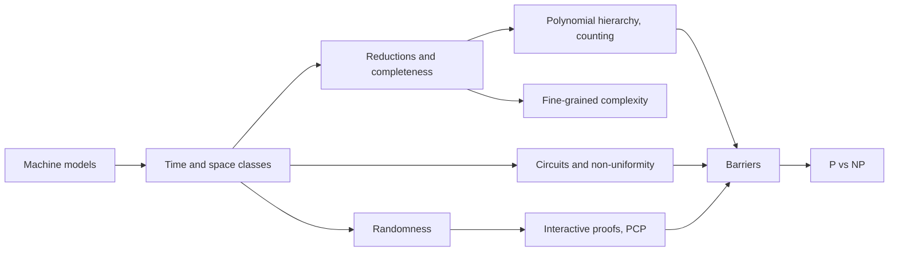
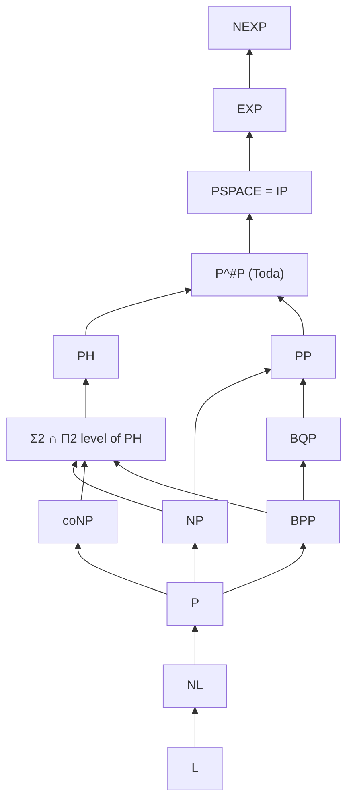
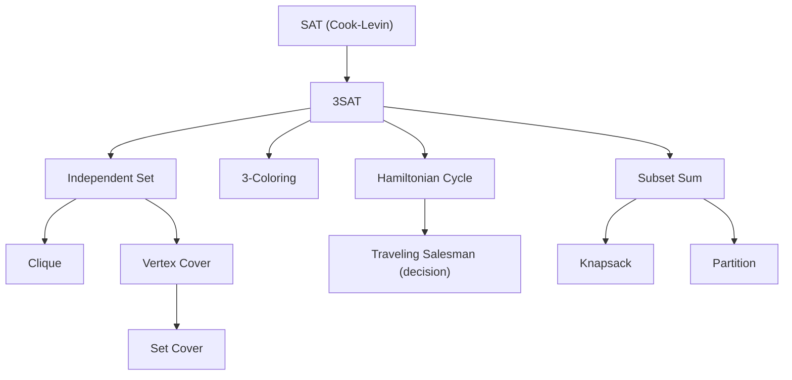
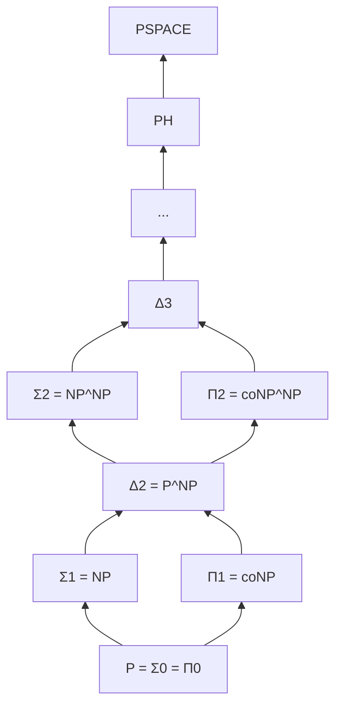
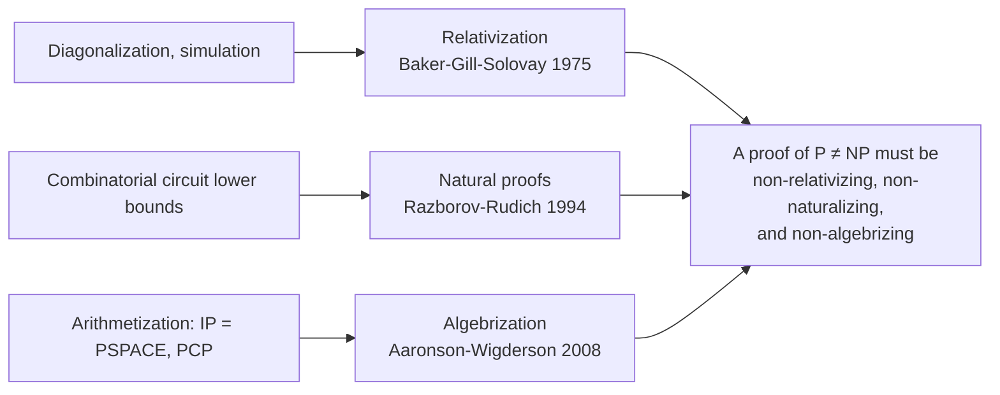

# Computational Complexity Theory

[Advanced Topics](../) &raquo; Computational Complexity Theory

**Prerequisites:** discrete mathematics, automata and computability (see [Automata and Formal Languages](../automata-and-formal-languages/)), basic probability, and comfort with asymptotic analysis.

**Computational complexity theory** classifies problems by the resources needed to solve them: time, memory, randomness, nondeterminism, circuit size, interaction, or quantum operations. Its basic objects are **complexity classes**, sets of decision problems solvable within a resource bound, and its basic questions ask which classes differ. A few separations are proved (more time or space strictly helps), but nearly every separation between *different kinds* of resource, P vs NP included, is open, and three barrier theorems explain why standard techniques cannot settle them. This page develops the standard classes from the Turing machine up, then covers completeness, the polynomial hierarchy, circuits, randomized and interactive computation, fine-grained complexity, the barriers, and the current state of P vs NP.

## Overview

The table summarizes what is known about the most-cited relationships. "Open" means neither equality nor separation has been proved.

| Relationship | Status | Belief |
|---|---|---|
| P vs EXP | $\mathrm{P} \subsetneq \mathrm{EXP}$ (time hierarchy) | — |
| L vs PSPACE | $\mathrm{L} \subsetneq \mathrm{PSPACE}$ (space hierarchy) | — |
| NL vs coNL | $\mathrm{NL} = \mathrm{coNL}$ (Immerman-Szelepcsényi) | — |
| PSPACE vs NPSPACE | Equal (Savitch) | — |
| NP vs NEXP | $\mathrm{NP} \subsetneq \mathrm{NEXP}$ (nondeterministic time hierarchy) | — |
| IP vs PSPACE | Equal (Shamir) | — |
| P vs NP | Open | $\mathrm{P} \neq \mathrm{NP}$ |
| NP vs coNP | Open | Different |
| P vs PSPACE | Open | $\mathrm{P} \neq \mathrm{PSPACE}$ |
| P vs BPP | Open | $\mathrm{P} = \mathrm{BPP}$ |
| L vs P | Open | $\mathrm{L} \neq \mathrm{P}$ |
| BPP vs BQP | Open (separated relative to oracles) | $\mathrm{BPP} \neq \mathrm{BQP}$ |
| NP vs P/poly | Open | $\mathrm{NP} \not\subseteq \mathrm{P/poly}$ |

## Models of Computation

Complexity is defined relative to a machine model. The standard choice is the **multi-tape deterministic Turing machine**, which is simple enough to reason about and simulates, and is simulated by, every other reasonable sequential model with polynomial overhead.

**Definition.** A $k$-tape Turing machine is a tuple $M = (Q, \Sigma, \Gamma, \delta, q_0, q_{\mathrm{acc}}, q_{\mathrm{rej}})$ with finite state set $Q$, input alphabet $\Sigma$, tape alphabet $\Gamma \supseteq \Sigma \cup \{\sqcup\}$ (with blank $\sqcup$), and transition function

$$
\delta : Q \times \Gamma^{k} \to Q \times \Gamma^{k} \times \{L, R, S\}^{k}.
$$

In each step the machine reads one symbol per tape, writes one symbol per tape, moves each head left, right, or not at all, and changes state. It halts on entering $q_{\mathrm{acc}}$ or $q_{\mathrm{rej}}$.

A **configuration** records the state, head positions, and non-blank tape contents. The **running time** on input $x$ is the number of steps before halting. For **space**, the input sits on a read-only tape that is not charged, and space is the number of work-tape cells used; this convention makes sublinear classes such as $\mathrm{L} = \mathrm{DSPACE}(\log n)$ meaningful.

**Nondeterminism.** A **nondeterministic Turing machine** (NTM) has a transition *relation*, so a configuration may have several successors and the computation is a tree. The NTM accepts $x$ if *some* branch reaches $q_{\mathrm{acc}}$, and it runs in time $t(n)$ if *every* branch halts within $t(|x|)$ steps. Nondeterminism is not a physical model; it formalizes "a short certificate exists."

**Robustness.** A $k$-tape machine running in time $t(n)$ can be simulated by a one-tape machine in time $O(t(n)^2)$ and by a two-tape machine in time $O(t(n) \log t(n))$ (Hennie-Stearns). Random-access machines with logarithmic-cost arithmetic and Turing machines simulate each other with polynomial overhead. Polynomial time is therefore model-independent. The **extended (strong) Church-Turing thesis** asserts that every physically realizable model is polynomially equivalent to a probabilistic Turing machine; quantum computation, captured by **BQP**, is the main challenge to it (see [Quantum Complexity](#quantum-complexity)).

**Asymptotics and constructibility.** Resources are measured as functions of the input length $n = \lvert x \rvert$ up to constant factors, using $O$, $\Omega$, $\Theta$, and $o$. A bound $t : \mathbb{N} \to \mathbb{N}$ is **time-constructible** if some machine, on input $1^n$, halts in exactly $t(n)$ steps (space-constructible is analogous). All natural bounds ($n \log n$, $n^2$, $2^n$) are constructible; the hierarchy theorems need this so a simulating machine can measure its own budget.

## Time and Space Complexity Classes

For a constructible bound $f$, $\mathrm{DTIME}(f)$ and $\mathrm{NTIME}(f)$ are the languages decided by deterministic and nondeterministic machines in time $O(f(n))$; $\mathrm{DSPACE}(f)$ and $\mathrm{NSPACE}(f)$ are the space analogues. The standard classes are unions over polynomial or exponential bounds.

| Class | Definition | Informal meaning | Typical problem |
|---|---|---|---|
| $\mathrm{L}$ | $\mathrm{DSPACE}(\log n)$ | A constant number of pointers into the input | Undirected connectivity (Reingold 2005) |
| $\mathrm{NL}$ | $\mathrm{NSPACE}(\log n)$ | Guess a path, remember only the current node | Directed $s$-$t$ reachability |
| $\mathrm{P}$ | $\bigcup_k \mathrm{DTIME}(n^k)$ | Efficiently solvable | Linear programming, primality |
| $\mathrm{NP}$ | $\bigcup_k \mathrm{NTIME}(n^k)$ | Efficiently verifiable certificates | SAT, graph coloring |
| $\mathrm{coNP}$ | Complements of NP languages | Efficiently verifiable refutations | Tautology, UNSAT |
| $\mathrm{PSPACE}$ | $\bigcup_k \mathrm{DSPACE}(n^k)$ | Polynomial memory, unbounded time | TQBF, generalized games |
| $\mathrm{EXP}$ | $\bigcup_k \mathrm{DTIME}(2^{n^k})$ | Exponential time | Generalized chess on $n \times n$ boards |
| $\mathrm{NEXP}$ | $\bigcup_k \mathrm{NTIME}(2^{n^k})$ | Exponentially long certificates | Succinct SAT |

### NP as verification

**Definition.** $L \in \mathrm{NP}$ if and only if there is a polynomial $p$ and a polynomial-time deterministic verifier $V$ such that

$$
x \in L \iff \exists\, w \in \{0,1\}^{p(\lvert x \rvert)} :\ V(x, w) = 1 .
$$

The string $w$ is a **certificate** or **witness**, and a nondeterministic machine's branches correspond to guessing it. $\mathrm{SAT} \in \mathrm{NP}$ because a satisfying assignment can be checked in linear time. $\mathrm{coNP}$ swaps the quantifier ($x \in L \iff \forall w,\ V(x,w) = 1$). Problems in $\mathrm{NP} \cap \mathrm{coNP}$ have short proofs of both membership and non-membership; factoring (as a decision problem) and, historically, primality and linear programming are examples, which is one reason such problems are not expected to be NP-complete.

### Known inclusions

Arrows denote inclusion (upward). Every inclusion shown is proved; the only strict separations known among these classes are the ones implied by the hierarchy theorems, such as $\mathrm{L} \subsetneq \mathrm{PSPACE}$, $\mathrm{P} \subsetneq \mathrm{EXP}$, $\mathrm{NL} \subsetneq \mathrm{PSPACE}$, and $\mathrm{NP} \subsetneq \mathrm{NEXP}$. Consequently at least one inclusion in $\mathrm{P} \subseteq \mathrm{NP} \subseteq \mathrm{PSPACE} \subseteq \mathrm{EXP}$ is strict, but no one knows which.

### Hierarchy theorems

Diagonalization proves that more of the same resource buys more power.

**Theorem (deterministic time hierarchy; Hartmanis-Stearns 1965, sharpened by Hennie-Stearns).** If $f$ is time-constructible and $g(n) \log g(n) = o(f(n))$, then

$$
\mathrm{DTIME}(g(n)) \subsetneq \mathrm{DTIME}(f(n)).
$$

**Theorem (space hierarchy; Stearns-Hartmanis-Lewis 1965).** If $f$ is space-constructible and $g(n) = o(f(n))$, then $\mathrm{DSPACE}(g(n)) \subsetneq \mathrm{DSPACE}(f(n))$.

**Theorem (nondeterministic time hierarchy; Cook 1972, Seiferas-Fischer-Meyer 1978, Žák 1983).** If $f$ is time-constructible and $g(n+1) = o(f(n))$, then $\mathrm{NTIME}(g(n)) \subsetneq \mathrm{NTIME}(f(n))$.

*Proof idea (time).* A machine $D$, on input $\langle M \rangle$, simulates $M$ on its own description for about $f(n)$ steps and outputs the opposite answer. $D$ runs within the larger bound, and any machine running within the smaller bound disagrees with $D$ on its own description. The $\log g$ factor is the overhead of universal simulation on a fixed number of tapes. The nondeterministic version cannot simply flip answers (complementing an NTM is not known to be cheap) and uses *lazy diagonalization* instead.

The hierarchy theorems separate classes that differ in the *amount* of one resource. The hard open problems ask whether changing the *kind* of resource (determinism to nondeterminism, time to space) adds power.

### Savitch and Immerman-Szelepcsényi

For space, nondeterminism is provably cheap.

**Theorem (Savitch 1970).** For space-constructible $f(n) \geq \log n$,

$$
\mathrm{NSPACE}(f(n)) \subseteq \mathrm{DSPACE}\big(f(n)^2\big).
$$

Hence $\mathrm{NPSPACE} = \mathrm{PSPACE}$ and $\mathrm{NL} \subseteq \mathrm{DSPACE}(\log^2 n)$.

*Proof idea.* Let $\mathrm{REACH}(c_1, c_2, i)$ mean "configuration $c_2$ is reachable from $c_1$ in at most $2^i$ steps." It holds if and only if some midpoint $c_m$ satisfies $\mathrm{REACH}(c_1, c_m, i-1)$ and $\mathrm{REACH}(c_m, c_2, i-1)$. Trying every midpoint deterministically and reusing space between the two recursive calls gives recursion depth $O(f(n))$ with $O(f(n))$ space per level.

**Theorem (Immerman 1988; Szelepcsényi 1987).** For $f(n) \geq \log n$, $\mathrm{NSPACE}(f) = \mathrm{coNSPACE}(f)$; in particular $\mathrm{NL} = \mathrm{coNL}$. The proof uses *inductive counting*: a nondeterministic log-space machine can compute the exact number of reachable configurations and then certify unreachability. The analogous statement for time, $\mathrm{NP} = \mathrm{coNP}$, is open and believed false.

### Time versus space

Every time-$t$ computation uses at most $t$ space, so $\mathrm{TIME}(t) \subseteq \mathrm{SPACE}(t)$. For fifty years the best improvement was Hopcroft, Paul, and Valiant (1977): $\mathrm{TIME}(t) \subseteq \mathrm{SPACE}(t / \log t)$ for multitape machines. In 2025 Ryan Williams proved a far stronger simulation:

$$
\mathrm{TIME}(t) \subseteq \mathrm{SPACE}\big(\sqrt{t \log t}\,\big) \qquad \text{for } t(n) \geq n .
$$

The proof reduces a time-$t$ computation to an instance of the **Tree Evaluation** problem and applies the space-efficient algorithm of Cook and Mertz (STOC 2024), which evaluates trees in $O(\log n \cdot \log\log n)$ space by reusing memory that already holds data ("catalytic" techniques). Combined with the space hierarchy theorem, the simulation gives explicit problems solvable in $O(n)$ space that require $n^{2-\varepsilon}$ time on multitape Turing machines for every $\varepsilon > 0$. Separating P from PSPACE would require an analogous result for all polynomial time bounds, which remains far out of reach.

## Reductions and Completeness

**Definition.** $A$ is **polynomial-time many-one reducible** to $B$, written $A \leq_p B$, if there is a polynomial-time computable $f$ with

$$
x \in A \iff f(x) \in B \quad \text{for all } x .
$$

A problem $B$ is **$\mathcal{C}$-hard** if every $A \in \mathcal{C}$ reduces to it, and **$\mathcal{C}$-complete** if it is also in $\mathcal{C}$. A complete problem stands in for the whole class: $\mathcal{C} \subseteq \mathcal{D}$ for a class $\mathcal{D}$ closed under the reduction if and only if the complete problem lies in $\mathcal{D}$.

Reductions must be weaker than the class being studied, or they could solve the problem themselves. NP-completeness uses polynomial-time reductions; completeness for P and NL uses **log-space reductions** $\leq_{\log}$. **Karp** (many-one) reductions make one query and pass the answer through; **Cook** (Turing) reductions may make many adaptive oracle queries. NP-completeness is conventionally defined with Karp reductions, which distinguish NP from coNP.

### The Cook-Levin theorem

**Theorem (Cook 1971; Levin 1973).** SAT is NP-complete, and so is 3SAT, its restriction to clauses of three literals.

*Proof sketch.* Membership is immediate. For hardness, let $L$ be decided by an NTM $M$ in time $p(n)$. An accepting computation fits in a $p(n) \times p(n)$ **tableau** whose rows are successive configurations. Build a formula $\varphi_x$ with variables "cell $(t, j)$ holds symbol $s$" (states and head positions are encoded as extra symbols) and clauses stating that

1. row 0 is the start configuration on input $x$;
2. every $2 \times 3$ window of adjacent cells is consistent with $\delta$ (this is where nondeterministic choices become free variables);
3. some row contains the accepting state.

Then $x \in L \iff \varphi_x$ is satisfiable, and $\varphi_x$ has size polynomial in $n$. Tseitin-style introduction of auxiliary variables converts it to 3-CNF.

Because $\leq_p$ is transitive, a new problem is shown NP-hard by reducing any known NP-hard problem to it. Karp (1972) gave 21 such reductions; thousands are now known.

If any NP-complete problem is in P then $\mathrm{P} = \mathrm{NP}$. Several apparently similar problems fall on opposite sides of the line: 2SAT, 2-coloring, Eulerian circuits, and shortest paths are in P, while 3SAT, 3-coloring, Hamiltonian cycles, and longest paths are NP-complete.

**Dichotomy theorems.** Schaefer (1978) showed that every Boolean constraint satisfaction problem (CSP) is either in P or NP-complete, with no intermediate cases. The Feder-Vardi conjecture extended this to CSPs over any finite domain; it was proved independently by Bulatov and by Zhuk in 2017, using the algebraic approach in which the complexity of a CSP is determined by its *polymorphisms*.

### Complete problems for other classes

| Class | Canonical complete problem | Reduction |
|---|---|---|
| $\mathrm{NL}$ | STCON (directed $s$-$t$ reachability) | $\leq_{\log}$ |
| $\mathrm{P}$ | Circuit Value Problem; Horn-SAT; linear programming | $\leq_{\log}$ |
| $\mathrm{NP}$ | SAT, 3SAT, Clique, 3-Coloring, … | $\leq_p$ |
| $\mathrm{coNP}$ | Tautology, UNSAT | $\leq_p$ |
| $\Sigma_2^p$ | $\exists\forall$-3SAT; minimum equivalent DNF | $\leq_p$ |
| $\mathrm{PP}$ | MAJ-SAT (is a majority of assignments satisfying?) | $\leq_p$ |
| $\#\mathrm{P}$ | #SAT; permanent of a 0/1 matrix (Valiant 1979) | parsimonious / Turing |
| $\mathrm{PSPACE}$ | TQBF; generalized Geography; Sokoban | $\leq_p$ |
| $\mathrm{EXP}$ | Generalized chess and checkers; succinct Circuit Value | $\leq_p$ |

TQBF, the truth of $\exists x_1 \forall x_2 \exists x_3 \cdots \varphi$, is the PSPACE archetype: alternating quantifiers correspond to moves in a two-player game, and many generalized games are PSPACE- or EXP-complete. P-complete problems are the *inherently sequential* ones: a P-complete problem in NC would give $\mathrm{NC} = \mathrm{P}$.

## The Polynomial Hierarchy and Counting

### The polynomial hierarchy

NP and coNP place one quantifier in front of a polynomial-time predicate. Allowing a bounded number of alternations gives the **polynomial hierarchy** (Meyer and Stockmeyer, 1972).

**Definition.** $\Sigma_0^p = \Pi_0^p = \Delta_0^p = \mathrm{P}$, and for $k \geq 0$

$$
\Sigma_{k+1}^p = \mathrm{NP}^{\Sigma_k^p}, \qquad \Pi_{k+1}^p = \mathrm{coNP}^{\Sigma_k^p}, \qquad \Delta_{k+1}^p = \mathrm{P}^{\Sigma_k^p},
$$

where $\mathcal{C}^{\mathcal{D}}$ is $\mathcal{C}$ with an oracle for a $\mathcal{D}$-complete language. Equivalently, $L \in \Sigma_k^p$ if and only if

$$
x \in L \iff \exists w_1\, \forall w_2\, \exists w_3 \cdots Q_k w_k \ R(x, w_1, \ldots, w_k)
$$

for a polynomial-time predicate $R$ and polynomially bounded $w_i$. $\Pi_k^p$ starts with $\forall$, and $\mathrm{PH} = \bigcup_k \Sigma_k^p \subseteq \mathrm{PSPACE}$.

So $\Sigma_1^p = \mathrm{NP}$, $\Pi_1^p = \mathrm{coNP}$, and $\Delta_2^p = \mathrm{P}^{\mathrm{NP}}$ contains optimization problems such as computing the exact size of a maximum clique. Each level contains the previous ones:

$$
\Sigma_k^p \cup \Pi_k^p \subseteq \Delta_{k+1}^p \subseteq \Sigma_{k+1}^p \cap \Pi_{k+1}^p .
$$

**Collapse.** If $\Sigma_k^p = \Pi_k^p$ for some $k$, then $\mathrm{PH} = \Sigma_k^p$: two adjacent quantifiers of the same type can be merged, so no formula needs more than $k$ alternations. In particular $\mathrm{P} = \mathrm{NP}$ implies $\mathrm{PH} = \mathrm{P}$, and $\mathrm{NP} = \mathrm{coNP}$ implies $\mathrm{PH} = \mathrm{NP}$. "The polynomial hierarchy is infinite" is therefore a stronger conjecture than $\mathrm{P} \neq \mathrm{NP}$, and "unless PH collapses" is the standard hypothesis attached to conditional results.

### Counting classes

**$\#\mathrm{P}$** (Valiant 1979) is the class of functions counting the accepting paths of a polynomial-time NTM, for example the number of satisfying assignments of a formula. Counting can be hard even when deciding is easy: deciding whether a bipartite graph has a perfect matching is in P, but counting perfect matchings, equivalently computing the permanent of a 0/1 matrix, is #P-complete. **PP** is the decision analogue ("do more than half the paths accept?").

**Theorem (Toda 1991).** $\mathrm{PH} \subseteq \mathrm{P}^{\#\mathrm{P}} = \mathrm{P}^{\mathrm{PP}}$.

A single call to a counting oracle is thus at least as powerful as the entire polynomial hierarchy. Toda's theorem also underlies the belief that exact counting is much harder than NP.

## Circuit Complexity

Turing machines are **uniform**: one finite program handles all input lengths. Boolean circuits are **non-uniform**: each input length $n$ may use a different circuit. Circuits are finite combinatorial objects, which makes them a natural target for lower bounds.

**Definition.** A Boolean circuit on $n$ inputs is a directed acyclic graph of AND, OR, and NOT gates with one output. Its **size** is the number of gates and its **depth** the length of the longest input-output path. A family $\{C_n\}$ decides $L$ if $C_n$ agrees with $L$ on all inputs of length $n$, and

$$
\mathrm{P/poly} = \{\, L : L \text{ is decided by a circuit family of size } n^{O(1)} \,\}.
$$

Non-uniformity is genuinely powerful: $\mathrm{P/poly}$ contains undecidable unary languages. Nevertheless $\mathrm{P} \subseteq \mathrm{P/poly}$ (unroll the tableau of a polynomial-time machine), so **proving $\mathrm{NP} \not\subseteq \mathrm{P/poly}$ would prove $\mathrm{P} \neq \mathrm{NP}$**. The **Karp-Lipton theorem** (1980) says $\mathrm{NP} \subseteq \mathrm{P/poly}$ would collapse PH to $\Sigma_2^p$, so NP is not expected to have small circuits. Adleman's theorem gives $\mathrm{BPP} \subseteq \mathrm{P/poly}$.

### What is known

A counting argument (Shannon 1949) shows that almost every Boolean function on $n$ variables requires circuits of size about $2^n / n$. The difficulty is exhibiting an *explicit* hard function.

| Circuit class | Model | Best known lower bounds |
|---|---|---|
| General circuits | Unbounded depth, fan-in 2 | $3.1n - o(n)$ for an explicit function in P (Li and Yang, STOC 2022); nothing superlinear for any NP problem |
| Exponential-time classes | General circuits | Symmetric exponential time $\mathrm{S_2E}$ requires size $2^n / n$ (Chen-Hirahara-Ren; Li; STOC 2024) |
| $\mathrm{AC}^0$ | Constant depth, unbounded fan-in AND/OR | PARITY needs exponential size (Furst-Saxe-Sipser, Ajtai, Yao; Håstad's switching lemma, 1986) |
| $\mathrm{AC}^0[p]$ | $\mathrm{AC}^0$ plus MOD-$p$ gates, $p$ prime | MOD-$q$ for a different prime $q$ is not in $\mathrm{AC}^0[p]$ (Razborov 1987, Smolensky 1987) |
| $\mathrm{ACC}^0$ | $\mathrm{AC}^0$ plus MOD-$m$ gates, any $m$ | $\mathrm{NEXP} \not\subseteq \mathrm{ACC}^0$ (Williams 2011); $\mathrm{NQP} \not\subseteq \mathrm{ACC}^0$ (Murray-Williams 2018) |
| $\mathrm{TC}^0$ | Constant depth with majority gates | Only slightly superlinear wire lower bounds; separating $\mathrm{TC}^0$ from NP is open |
| Monotone circuits | AND/OR only | Clique needs exponential monotone size (Razborov 1985; Alon-Boppana) |

Williams' $\mathrm{ACC}^0$ result introduced the **algorithmic method**: a satisfiability algorithm for a circuit class that beats brute force by even a modest factor implies a lower bound against that class. It is the leading example of a lower-bound technique that is not blocked by the barriers discussed below.

### Parallel computation

$\mathrm{NC}^i$ is the class of problems with uniform circuits of polynomial size, depth $O(\log^i n)$, and fan-in 2; $\mathrm{NC} = \bigcup_i \mathrm{NC}^i$ captures efficient parallel algorithms. The classes interleave with small space:

$$
\mathrm{NC}^1 \subseteq \mathrm{L} \subseteq \mathrm{NL} \subseteq \mathrm{NC}^2 \subseteq \mathrm{NC} \subseteq \mathrm{P}.
$$

Whether $\mathrm{NC} = \mathrm{P}$ (whether every efficient problem parallelizes) is open; P-complete problems such as the Circuit Value Problem are the conjectured obstructions. Tree Evaluation, mentioned above, was proposed as a candidate for separating L from P; the Cook-Mertz algorithm weakened that approach by putting it in nearly logarithmic space.

## Randomized Computation

A probabilistic Turing machine reads random bits and must run in polynomial time; classes differ in the error they tolerate.

| Class | Error on yes-instances | Error on no-instances | Example |
|---|---|---|---|
| $\mathrm{BPP}$ | $\leq 1/3$ | $\leq 1/3$ | Polynomial identity testing is in coRP ⊆ BPP |
| $\mathrm{RP}$ | $\leq 1/2$ | 0 | Non-zero-ness of a polynomial |
| $\mathrm{coRP}$ | 0 | $\leq 1/2$ | Polynomial identity testing (Schwartz-Zippel) |
| $\mathrm{ZPP}$ | 0 (expected polynomial time) | 0 | $\mathrm{ZPP} = \mathrm{RP} \cap \mathrm{coRP}$ |
| $\mathrm{PP}$ | $< 1/2$ | $\leq 1/2$ | MAJ-SAT; unbounded error, not practical |

**Amplification.** The constants are arbitrary as long as the gap from $1/2$ is at least an inverse polynomial. Running a BPP algorithm $k$ times independently and taking the majority answer gives, by the Hoeffding (Chernoff) bound,

$$
\Pr[\text{majority is wrong}] \leq \exp\!\left(-2k\left(\tfrac{1}{2} - \tfrac{1}{3}\right)^{2}\right) = e^{-k/18},
$$

so the error falls exponentially in the number of repetitions, and $k = O(n)$ repetitions reduce it below $2^{-n}$.

**Where BPP sits.** $\mathrm{P} \subseteq \mathrm{ZPP} \subseteq \mathrm{RP} \subseteq \mathrm{BPP}$ and $\mathrm{RP} \subseteq \mathrm{NP}$. BPP is not known to be in NP, but the Sipser-Gács-Lautemann theorem places it in $\Sigma_2^p \cap \Pi_2^p$, and Adleman's theorem places it in P/poly (a single good random string per input length works for all inputs of that length).

### Derandomization

The prevailing conjecture is $\mathrm{P} = \mathrm{BPP}$. The **hardness versus randomness** paradigm (Nisan-Wigderson 1994; Impagliazzo-Wigderson 1997) shows that circuit lower bounds imply derandomization: if some problem in $\mathrm{E} = \mathrm{DTIME}(2^{O(n)})$ requires circuits of size $2^{\Omega(n)}$, then there are pseudorandom generators strong enough to replace the random bits, and $\mathrm{P} = \mathrm{BPP}$. The implication partly runs in reverse: Kabanets and Impagliazzo (2004) showed that derandomizing polynomial identity testing would itself imply circuit lower bounds, so derandomization and lower bounds are closely tied.

Unconditional derandomizations exist for specific problems. The AKS test (Agrawal, Kayal, Saxena 2002) put primality in P, and Reingold (2005) showed undirected connectivity is in L, derandomizing a random-walk algorithm. Polynomial identity testing remains the most prominent problem in coRP not known to be in P.

## Interactive Proofs and PCPs

NP is the class of statements with short proofs that a deterministic verifier can check. Letting the verifier use randomness and interact with a prover dramatically increases the power of proof systems.

| Proof system | Class | Result |
|---|---|---|
| Static certificate, deterministic verifier | $\mathrm{NP}$ | Definition |
| Interaction with one prover, public or private coins | $\mathrm{IP} = \mathrm{PSPACE}$ | Lund-Fortnow-Karloff-Nisan; Shamir (1990) |
| Two non-communicating provers | $\mathrm{MIP} = \mathrm{NEXP}$ | Babai-Fortnow-Lund (1991) |
| Random access to a proof, $O(\log n)$ random bits, $O(1)$ queries | $\mathrm{PCP}(\log n, 1) = \mathrm{NP}$ | PCP theorem: Arora-Safra; Arora-Lund-Motwani-Sudan-Szegedy (1992); combinatorial proof by Dinur (2007) |
| Two provers sharing quantum entanglement | $\mathrm{MIP}^{*} = \mathrm{RE}$ | Ji-Natarajan-Vidick-Wright-Yuen (2020) |

The proofs of $\mathrm{IP} = \mathrm{PSPACE}$ and the PCP theorem use **arithmetization**: Boolean formulas are extended to low-degree polynomials over a finite field, and the verifier checks polynomial identities at random points (the **sum-check protocol**). The PCP theorem is equivalent to NP-hardness of approximating MAX-3SAT within some constant, and is the foundation of the theory of inapproximability described in [Approximation Algorithms](../approximation-algorithms/#the-pcp-theorem). $\mathrm{MIP}^{*} = \mathrm{RE}$ shows that entangled provers can convince a verifier of any recursively enumerable statement, including instances of the halting problem; it also refuted the Connes embedding conjecture in operator algebras. Interactive and zero-knowledge proofs are also the theoretical basis of modern succinct proof systems (SNARKs); see [Cryptography](../cryptography/).

## Quantum Complexity

**BQP** is the class of decision problems solvable by polynomial-size uniform quantum circuits with bounded error. Known containments are

$$
\mathrm{BPP} \subseteq \mathrm{BQP} \subseteq \mathrm{PP} \subseteq \mathrm{PSPACE}.
$$

Factoring and discrete logarithms are in BQP (Shor 1994) but are not believed to be in BPP, which is the strongest evidence against the extended Church-Turing thesis. BQP is not believed to contain NP-complete problems: relative to a random oracle, NP is not contained in BQP, and Grover search gives only a quadratic speedup for unstructured search, which is optimal (Bennett-Bernstein-Brassard-Vazirani 1997). In the other direction, Raz and Tal (2018) constructed an oracle relative to which BQP is not contained in PH. See [Quantum Algorithms Research](../quantum-algorithms-research/) for algorithms and quantum advantage experiments.

## Fine-Grained and Parameterized Complexity

Classical complexity asks whether a problem is in P. **Fine-grained complexity** asks for the exact exponent, using reductions that preserve running times up to $n^{o(1)}$ factors and a small number of hardness hypotheses.

| Hypothesis | Statement | Conditional lower bounds |
|---|---|---|
| ETH (Impagliazzo-Paturi 2001) | 3SAT on $n$ variables needs $2^{\Omega(n)}$ time | $2^{o(n)}$ algorithms ruled out for many NP-hard graph problems |
| SETH | For every $\varepsilon > 0$ some $k$-SAT needs $2^{(1-\varepsilon)n}$ time | Edit distance and LCS need $n^{2-o(1)}$ (Backurs-Indyk 2015; Abboud-Backurs-Vassilevska Williams 2015); Orthogonal Vectors needs $n^{2-o(1)}$ |
| 3SUM | 3SUM needs $n^{2-o(1)}$ time | Problems in computational geometry |
| APSP | All-pairs shortest paths needs $n^{3-o(1)}$ time | Negative triangle detection, radius, many graph problems are subcubically equivalent |

**Matrix multiplication** is the most studied case where the exponent is unknown. The exponent $\omega$ satisfies $2 \leq \omega < 2.371339$ (Alman, Duan, Vassilevska Williams, Xu, Xu, Zhou; SODA 2025), obtained by refining Strassen's laser method. An August 2026 preprint by Google DeepMind researchers with Alman, Vassilevska Williams, and Zhou reports $\omega < 2.371177$, found by re-optimizing the laser-method analysis with modern numerical optimization and AlphaEvolve.

**Parameterized complexity** measures running time in terms of the input size $n$ and a parameter $k$. A problem is **fixed-parameter tractable** (FPT) if it can be solved in $f(k) \cdot n^{O(1)}$ time; Vertex Cover parameterized by solution size is FPT. The W-hierarchy plays the role of NP: $k$-Clique is W[1]-complete, and under ETH it has no $f(k) \cdot n^{o(k)}$ algorithm.

## Barriers to Separating Classes

Three theorems show that broad families of proof techniques cannot resolve P vs NP. Any proof must avoid all three.

### Relativization

An **oracle** $A$ is a language that a machine can query at unit cost. A proof technique **relativizes** if it remains valid when all machines are given the same oracle; diagonalization and simulation relativize because they treat machines as black boxes.

**Theorem (Baker-Gill-Solovay 1975).** There are oracles $A$ and $B$ with $\mathrm{P}^{A} = \mathrm{NP}^{A}$ and $\mathrm{P}^{B} \neq \mathrm{NP}^{B}$.

For $A$, take any PSPACE-complete language: then $\mathrm{P}^A = \mathrm{NP}^A = \mathrm{PSPACE}$. For $B$, let $L_B = \{1^n : B \text{ contains a string of length } n\}$, which is in $\mathrm{NP}^B$; construct $B$ in stages so that each polynomial-time oracle machine, which can query only polynomially many of the $2^n$ strings of length $n$, answers incorrectly on some $1^n$. Since a relativizing proof would give the same answer relative to both oracles, **no relativizing technique settles P vs NP**. Non-relativizing results do exist, notably $\mathrm{IP} = \mathrm{PSPACE}$, which fails relative to some oracles.

### Natural proofs

A lower-bound argument against a circuit class $\mathcal{C}$ is **natural** if it identifies a property of Boolean functions that is

1. **useful:** no function computable in $\mathcal{C}$ has it;
2. **large:** a random function has it with non-negligible probability;
3. **constructive:** it can be decided in time polynomial in the truth-table size $2^n$.

Most known circuit lower bounds, including those for $\mathrm{AC}^0$ and $\mathrm{AC}^0[p]$, are natural.

**Theorem (Razborov-Rudich 1994).** If pseudorandom function families secure against subexponential-size circuits exist, then no natural property is useful against $\mathrm{P/poly}$.

A large, constructive property is an efficient test that distinguishes truly random functions from pseudorandom ones, because pseudorandom functions are computable by small circuits and so lack a useful property. Such a test would break the pseudorandom function family. Proving strong lower bounds for general circuits therefore requires non-natural arguments, assuming standard cryptography is secure.

### Algebrization

**Theorem (Aaronson-Wigderson 2008).** A technique **algebrizes** if it remains valid when one side of the statement receives an oracle $A$ and the other receives a low-degree extension $\tilde{A}$ of $A$ over a finite field. Arithmetization-based results, including $\mathrm{IP} = \mathrm{PSPACE}$, algebrize, and there are algebraic oracles relative to which $\mathrm{P} = \mathrm{NP}$ and others relative to which $\mathrm{P} \neq \mathrm{NP}$. Hence **no algebrizing technique resolves P vs NP**.

### Approaches beyond the barriers

- **The algorithmic method** (Williams) derives lower bounds from nontrivial algorithms; the $\mathrm{ACC}^0$ lower bounds are the main success.
- **Meta-complexity** studies the complexity of complexity-theoretic problems themselves, such as the Minimum Circuit Size Problem (MCSP) and time-bounded Kolmogorov complexity. Liu and Pass (2020) showed that one-way functions exist if and only if a time-bounded Kolmogorov complexity problem is mildly hard on average, tying cryptography directly to a natural complexity question.
- **Geometric complexity theory** (Mulmuley-Sohoni) attacks the algebraic analogue, VP vs VNP (determinant vs permanent), through representation theory. Some of its original "occurrence obstruction" strategies were shown not to work (Bürgisser-Ikenmeyer-Panova 2016), but the program continues in modified forms.
- **Proof complexity** asks whether every tautology has short proofs in a given proof system; super-polynomial lower bounds for all proof systems would imply $\mathrm{NP} \neq \mathrm{coNP}$ (Cook-Reckhow 1979).

## P vs NP

**The question.** Is $\mathrm{P} = \mathrm{NP}$? Equivalently: whenever a solution can be verified in polynomial time, can one be found in polynomial time? Equivalently: is $\mathrm{SAT} \in \mathrm{P}$? It is one of the seven Clay Millennium Prize Problems and remains open.

Most researchers believe $\mathrm{P} \neq \mathrm{NP}$. The evidence is indirect: no polynomial algorithm has been found for any of thousands of NP-complete problems from unrelated fields, despite intense effort; $\mathrm{P} = \mathrm{NP}$ would collapse PH to P and make finding proofs of mathematical theorems (of polynomial length) as easy as checking them; and many related structural consequences, such as the collapse of PH, are considered implausible.

### What depends on the answer

Worst-case $\mathrm{P} \neq \mathrm{NP}$ is not enough for cryptography, which needs problems that are hard *on average* and for which hard instances can be generated with known solutions. Impagliazzo (1995) described five possible worlds consistent with current knowledge:

| World | What holds | Consequences |
|---|---|---|
| Algorithmica | $\mathrm{P} = \mathrm{NP}$ (or effectively so) | Search and optimization are easy; public-key cryptography is impossible |
| Heuristica | $\mathrm{P} \neq \mathrm{NP}$, but NP is easy on average | Hard instances exist but are hard to find |
| Pessiland | Hard-on-average problems exist, but no one-way functions | Hardness without cryptography |
| Minicrypt | One-way functions exist, but no public-key encryption | Private-key cryptography, signatures, pseudorandomness |
| Cryptomania | Public-key cryptography exists | The world assumed by current practice (lattices, elliptic curves) |

Proving $\mathrm{P} \neq \mathrm{NP}$ would rule out only Algorithmica. Placing the world in Cryptomania requires stronger, average-case assumptions; see [Cryptography](../cryptography/).

### NP-intermediate problems

**Theorem (Ladner 1975).** If $\mathrm{P} \neq \mathrm{NP}$, there are problems in $\mathrm{NP}$ that are neither in P nor NP-complete.

The proof removes parts of SAT by a delayed-diagonalization construction, producing a language too sparse to be complete but too hard to be in P. Natural candidates include **factoring** and **discrete logarithm** (both in $\mathrm{NP} \cap \mathrm{coNP}$ as decision problems, so NP-completeness would imply $\mathrm{NP} = \mathrm{coNP}$) and **graph isomorphism**. Babai (2015, with a 2017 correction) placed graph isomorphism in quasipolynomial time $\exp\big((\log n)^{O(1)}\big)$; it was already known that GI is not NP-complete unless PH collapses to its second level (Boppana-Håstad-Zachos 1987).

### The conjectured landscape

<figure class="diagram">
<svg viewBox="0 0 560 380" role="img" aria-labelledby="cx-landscape-title" style="max-width: 560px; width: 100%; color: inherit;">
  <title id="cx-landscape-title">Conjectured landscape: nested EXP, PSPACE, and PH containing overlapping NP and coNP, with P in their intersection</title>
  <g fill="none" stroke="currentColor" stroke-width="1.4">
    <rect x="10" y="10" width="540" height="360" rx="18"/>
    <rect x="40" y="45" width="480" height="310" rx="16"/>
    <rect x="70" y="80" width="420" height="260" rx="14"/>
    <ellipse cx="230" cy="220" rx="150" ry="95"/>
    <ellipse cx="330" cy="220" rx="150" ry="95" stroke-dasharray="6 4"/>
    <ellipse cx="280" cy="245" rx="48" ry="38" stroke-width="2"/>
  </g>
  <g font-family="sans-serif" fill="currentColor">
    <text x="30" y="36" font-size="15" font-weight="bold">EXP</text>
    <text x="60" y="70" font-size="15" font-weight="bold">PSPACE</text>
    <text x="90" y="104" font-size="15" font-weight="bold">PH</text>
    <text x="150" y="160" font-size="15" font-weight="bold">NP</text>
    <text x="385" y="160" font-size="15" font-weight="bold">coNP</text>
    <text x="280" y="243" font-size="15" font-weight="bold" text-anchor="middle">P</text>
    <text x="280" y="262" font-size="11" text-anchor="middle">L ⊆ NL ⊆ P</text>
    <text x="125" y="212" font-size="12" text-anchor="middle">NP-complete</text>
    <text x="125" y="227" font-size="11" text-anchor="middle">SAT, TSP</text>
    <text x="435" y="212" font-size="12" text-anchor="middle">coNP-complete</text>
    <text x="435" y="227" font-size="11" text-anchor="middle">UNSAT</text>
    <text x="280" y="180" font-size="11" text-anchor="middle">factoring, discrete log</text>
    <text x="280" y="194" font-size="10" text-anchor="middle" opacity="0.8">(NP ∩ coNP)</text>
    <text x="160" y="272" font-size="11" text-anchor="middle">graph iso.</text>
    <text x="280" y="332" font-size="11" text-anchor="middle" opacity="0.8">TQBF (PSPACE-complete) lies outside PH if PH ≠ PSPACE</text>
  </g>
</svg>
<figcaption>The picture most researchers expect, assuming P ≠ NP ≠ coNP and an infinite PH. Only the outermost separation, P ≠ EXP, is proved. BPP is conjectured to equal P and is omitted.</figcaption>
</figure>

## See Also

- [Automata and Formal Languages](../automata-and-formal-languages/): computability, decidability, and the Chomsky hierarchy
- [Approximation Algorithms](../approximation-algorithms/): coping with NP-hardness, the PCP theorem, and inapproximability
- [Cryptography](../cryptography/): one-way functions, average-case hardness, and zero-knowledge proofs
- [Quantum Algorithms Research](../quantum-algorithms-research/): BQP and quantum speedups
- [Category Theory and Type Theory](../category-and-type-theory/): the lambda calculus and type systems as models of computation
- [Distributed Systems Theory](../distributed-systems-theory/): impossibility results and round and message complexity
- [Advanced AI Mathematics](../ai-mathematics/): computational learning theory
- [Mathematical Reference](../../reference/): notation and quick reference

## References

1. Arora, S., & Barak, B. (2009). *Computational Complexity: A Modern Approach*. Cambridge University Press.
2. Sipser, M. (2012). *Introduction to the Theory of Computation* (3rd ed.). Cengage.
3. Papadimitriou, C. (1994). *Computational Complexity*. Addison-Wesley.
4. Goldreich, O. (2008). *Computational Complexity: A Conceptual Perspective*. Cambridge University Press.
5. Cook, S. (1971). "The complexity of theorem-proving procedures." *STOC*.
6. Karp, R. (1972). "Reducibility among combinatorial problems." In *Complexity of Computer Computations*.
7. Baker, T., Gill, J., & Solovay, R. (1975). "Relativizations of the P =? NP question." *SIAM Journal on Computing* 4(4).
8. Razborov, A., & Rudich, S. (1997). "Natural proofs." *Journal of Computer and System Sciences* 55(1).
9. Aaronson, S., & Wigderson, A. (2009). "Algebrization: A new barrier in complexity theory." *ACM Transactions on Computation Theory* 1(1).
10. Impagliazzo, R. (1995). "A personal view of average-case complexity." *Structure in Complexity Theory Conference*.
11. Impagliazzo, R., & Wigderson, A. (1997). "P = BPP if E requires exponential circuits: Derandomizing the XOR lemma." *STOC*.
12. Williams, R. (2014). "Nonuniform ACC circuit lower bounds." *Journal of the ACM* 61(1).
13. Cook, J., & Mertz, I. (2024). "Tree evaluation is in space $O(\log n \cdot \log\log n)$." *STOC*.
14. Williams, R. (2025). "Simulating time with square-root space." *STOC*.
15. Ji, Z., Natarajan, A., Vidick, T., Wright, J., & Yuen, H. (2020). "MIP* = RE." arXiv:2001.04383.
16. Alman, J., Duan, R., Vassilevska Williams, V., Xu, Y., Xu, Z., & Zhou, R. (2025). "More asymmetry yields faster matrix multiplication." *SODA*.
