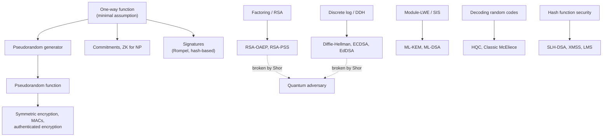
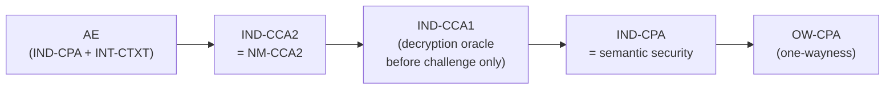
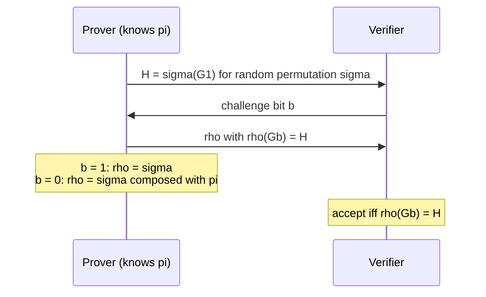
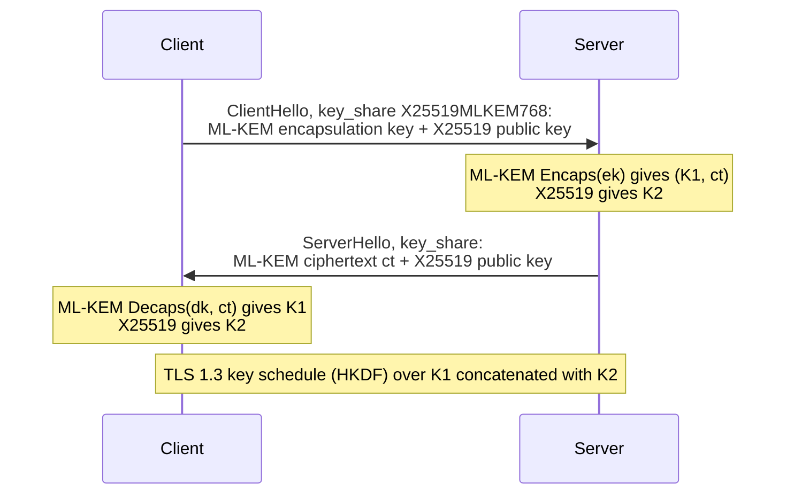

# Cryptography: Foundations &amp; Post-Quantum

[Advanced Topics](../) &raquo; Cryptography: Foundations &amp; Post-Quantum

**Graduate-level research page.** A definition-and-reduction treatment of modern cryptography for theoretical computer scientists, security researchers, and mathematicians. **Prerequisites:** probability, computational complexity (P/NP, polynomial-time reductions), elementary number theory, and linear algebra over finite fields. For TLS, hashing, and key management in practice, see [Applied Cryptography](../../technology/cybersecurity/cryptography.html) and the [Cybersecurity Hub](../../technology/cybersecurity/).

Modern cryptography earns trust from **proofs**, not from secrecy of design. The template is always the same: assume that one well-studied computational problem is hard, then give an explicit **reduction** showing that any efficient adversary against the scheme can be turned into an efficient solver for that problem. This page develops that framework (negligible functions, games, hybrids), the primitives it builds on (one-way functions, PRGs, PRFs), the structured assumptions behind public-key cryptography (factoring, discrete log, lattices), the standard security notions for encryption and key encapsulation, the random-oracle model, and zero-knowledge proofs. It closes with post-quantum cryptography: the quantum threat to factoring and discrete log, the NIST standards (FIPS 203–205, with FN-DSA and HQC to follow), and the state of deployment in 2026.

## Contents

- [The logical structure](#the-logical-structure)
- [Provable security and reductions](#provable-security-and-reductions)
- [One-way functions](#one-way-functions)
- [Computational hardness assumptions](#computational-hardness-assumptions)
- [PRGs, PRFs, and symmetric encryption](#prgs-prfs-and-symmetric-encryption)
- [Security notions for encryption](#security-notions-for-encryption)
- [Key encapsulation and hybrid encryption](#key-encapsulation-and-hybrid-encryption)
- [The random-oracle model](#the-random-oracle-model)
- [Zero-knowledge proofs](#zero-knowledge-proofs)
- [Post-quantum cryptography](#post-quantum-cryptography)
- [Open problems and frontiers](#open-problems-and-frontiers)
- [References](#references)

## The logical structure

A single primitive, the **one-way function**, suffices for the whole symmetric world: pseudorandom generators, pseudorandom functions, MACs, commitments, and even digital signatures. Public-key encryption and key exchange need more — a *trapdoor* or algebraic structure — so they rest on specific problems such as factoring, discrete logarithms, or Learning With Errors. Shor's algorithm breaks the first two on a large quantum computer; the post-quantum replacements rest on lattices, codes, and hash functions.

## Provable security and reductions

Pre-1980s ciphers were broken repeatedly because nobody had said precisely what "secure" meant. Goldwasser and Micali's program replaced this with three ingredients: a **formal definition** (usually a game between a challenger and an adversary), a **precise assumption**, and a **proof by reduction** from the assumption to the definition.

### Asymptotic and concrete security

Everything is parameterized by a **security parameter** $n$. "Efficient" means **probabilistic polynomial time (PPT)** in $n$; "negligible" means eventually smaller than every inverse polynomial.

#### Definition (negligible function)
A function $\mu : \mathbb{N} \to \mathbb{R}_{\ge 0}$ is **negligible** if for every polynomial $p$ there is an $N$ such that for all $n > N$,

$$\mu(n) < \frac{1}{p(n)}.$$

Equivalently $\mu(n) = n^{-\omega(1)}$. Both $2^{-n}$ and $n^{-\log n}$ are negligible; $n^{-100}$ is not.

A scheme is secure if every PPT adversary has negligible **advantage** in its security game. Negligible functions are closed under addition and under multiplication by polynomials, which is exactly what lets polynomially many proof steps be chained together.

Practitioners use the **concrete** version: a scheme is $(t, \varepsilon)$-secure if no adversary running in time at most $t$ has advantage greater than $\varepsilon$. A "128-bit secure" scheme is one for which $t/\varepsilon \gtrsim 2^{128}$ for every known attack. Concrete statements make the cost of a reduction visible, which the asymptotic view hides.

### What a reduction is

#### The reductionist method
To prove "scheme $S$ is secure if problem $P$ is hard":
1. Suppose a PPT adversary $\mathcal{A}$ breaks $S$ with non-negligible advantage $\varepsilon(n)$.
2. Build a PPT algorithm $R^{\mathcal{A}}$ that, given an instance of $P$, **simulates** the security game for $\mathcal{A}$ with the instance embedded in it, and uses $\mathcal{A}$'s output to solve the instance.
3. Show $R^{\mathcal{A}}$ succeeds with non-negligible probability, contradicting the hardness of $P$.

The quality of a reduction is its **tightness**. If $\mathcal{A}$ runs in time $t$ with advantage $\varepsilon$ and $R^{\mathcal{A}}$ runs in time $t' \approx t$ with advantage $\varepsilon' \approx \varepsilon$, the reduction is tight. If instead $\varepsilon' \approx \varepsilon^2/q$ (typical of forking-lemma proofs, with $q$ the number of hash queries), the guarantee degrades and parameters must be enlarged to compensate — or, as is common in practice, the looseness is quietly ignored.

### The hybrid argument

The standard technique for proving two distributions indistinguishable is to walk between them through a sequence of **hybrids**, each differing from the next in one small, separately justified step.

#### Lemma (hybrid argument)
If a distinguisher tells $D_0$ from $D_k$ with advantage $\varepsilon$, it tells some adjacent pair $D_i, D_{i+1}$ apart with advantage at least $\varepsilon/k$.

**Proof.** Let $p_i = \Pr[\text{distinguisher outputs } 1 \text{ on } D_i]$. Then

$$\varepsilon = |p_0 - p_k| = \left| \sum_{i=0}^{k-1} (p_i - p_{i+1}) \right| \le \sum_{i=0}^{k-1} |p_i - p_{i+1}|,$$

so some term is at least $\varepsilon/k$. With $k$ polynomial and each adjacent pair indistinguishable, $\varepsilon$ is negligible. $\square$

Modern proofs are usually written as a **sequence of games** (Shoup; Bellare–Rogaway): Game 0 is the real security experiment, each subsequent game changes one thing, and the final game is one in which the adversary provably has advantage zero. The total advantage is bounded by the sum of the per-step differences.

## One-way functions

The one-way function (OWF) is the **minimal** assumption of complexity-based cryptography: almost every cryptographic primitive implies a OWF, and OWFs in turn imply PRGs, PRFs, MACs, commitments, private-key encryption, and signatures (Rompel, 1990). Whether OWFs exist is open; their existence implies $\mathrm{P} \ne \mathrm{NP}$, though the converse is not known.

#### Definition (one-way function)
A function $f : \lbrace 0,1\rbrace ^{*} \to \lbrace 0,1\rbrace ^{*}$ is **one-way** if it is computable in polynomial time and for every PPT adversary $\mathcal{A}$,

$$\Pr_{x \leftarrow \{0,1\}^{n}}\left[\, f\left(\mathcal{A}(1^{n}, f(x))\right) = f(x) \,\right] \le \mathrm{negl}(n).$$

The adversary only has to find *some* preimage, not $x$ itself. It receives $1^n$ so that its running time is measured against the input length $n$ even when $f$ shrinks its input.

### Hardcore predicates and Goldreich–Levin

A OWF may leak a lot about $x$ (for example, half its bits). Pseudorandomness needs a **hardcore predicate**: one bit of $x$ that is as hard to guess from $f(x)$ as inverting $f$.

#### Goldreich–Levin theorem (1989)
For any one-way $f$, define $g(x, r) = (f(x), r)$ with $|r| = |x|$. Then

$$\mathrm{hc}(x, r) = \langle x, r \rangle = \bigoplus_{i} x_i r_i$$

is a hardcore predicate for $g$: no PPT adversary predicts it from $(f(x), r)$ with probability non-negligibly better than $1/2$.

The proof is a list-decoding argument for the Hadamard code: a predictor for $\langle x, r \rangle$ that beats $1/2$ by $\varepsilon$ is converted into an inverter that recovers $x$ with probability polynomial in $\varepsilon$. This is the bridge from "hard to invert" to "looks random."

### Candidate one-way functions

| Candidate | Forward direction | Inverting it means solving |
|---|---|---|
| Multiplication | $(p, q) \mapsto pq$ for random primes | Integer factoring |
| Modular exponentiation | $x \mapsto g^x \bmod p$ | Discrete logarithm |
| Rabin | $x \mapsto x^2 \bmod N$ | Factoring $N$ (equivalent) |
| Subset sum | $S \mapsto \sum_{i \in S} a_i \bmod 2^n$ | Random subset sum |
| Ajtai | $\mathbf{x} \mapsto A\mathbf{x} \bmod q$ for short $\mathbf{x}$ | Short Integer Solution (SIS) |
| Block cipher / hash | $k \mapsto \mathrm{AES}_k(0)$, $x \mapsto H(x)$ | Heuristic: no reduction, decades of cryptanalysis |

## Computational hardness assumptions

Public-key cryptography needs structured hardness: a trapdoor (RSA), a homomorphism (Diffie–Hellman), or noisy linear algebra (LWE). Each assumption has a best known classical attack, and those attacks set key sizes.

### Factoring and RSA

#### Factoring assumption
For $N = pq$ with $p, q$ random $n/2$-bit primes, no PPT algorithm outputs $\lbrace p, q\rbrace $ from $N$ with non-negligible probability.

#### RSA assumption
Given $(N, e)$ with $\gcd(e, \varphi(N)) = 1$ and uniform $y \in \mathbb{Z}_N^{*}$, no PPT algorithm finds $x$ with $x^e \equiv y \pmod N$ with non-negligible probability.

The trapdoor is $d = e^{-1} \bmod \varphi(N)$, computable from $\varphi(N) = (p-1)(q-1)$. RSA hardness implies factoring hardness is not known to be reversible: breaking RSA might be easier than factoring. The best classical attack is the **General Number Field Sieve**, with heuristic running time

$$L_N\left[\tfrac{1}{3}, c\right] = \exp\left( (c + o(1)) (\ln N)^{1/3} (\ln \ln N)^{2/3} \right), \qquad c = \left(\tfrac{64}{9}\right)^{1/3} \approx 1.923.$$

This sub-exponential curve is why RSA moduli are so much longer than symmetric keys: 2048-bit RSA gives about 112-bit security and 3072-bit about 128-bit.

### The discrete-logarithm family

Let $\mathbb{G} = \langle g \rangle$ be cyclic of prime order $q$, such as a subgroup of $\mathbb{Z}_p^{*}$ or an elliptic-curve group.

#### Discrete log (DL)
Given $h = g^x$ for uniform $x \in \mathbb{Z}_q$, find $x$.

#### Computational Diffie–Hellman (CDH)
Given $(g^a, g^b)$, compute $g^{ab}$.

#### Decisional Diffie–Hellman (DDH)
Distinguish $(g^a, g^b, g^{ab})$ from $(g^a, g^b, g^c)$ for uniform $c$.

Solving DL solves CDH, and solving CDH solves DDH, so the assumptions strengthen in the order DL, CDH, DDH. DDH is false in some groups where DL is believed hard (e.g. groups with an efficient pairing), which is why the choice of group matters. On well-chosen elliptic curves no attack better than the generic $O(\sqrt{q})$ algorithms (Pollard's rho, baby-step giant-step) is known; a 256-bit curve therefore gives about 128-bit security.

### Lattices: LWE and SIS

A **lattice** $\Lambda = \lbrace  \sum_i z_i \mathbf{b}_i : z_i \in \mathbb{Z} \rbrace $ is the set of integer combinations of linearly independent basis vectors $\mathbf{b}_i \in \mathbb{R}^m$. The underlying hard problems are approximate versions of the **Shortest Vector Problem** (GapSVP) and the **Shortest Independent Vectors Problem** (SIVP). Lattices lead post-quantum cryptography because no quantum algorithm beats classical ones on them by more than polynomial factors, and because they admit worst-case to average-case reductions.

#### Learning With Errors (Regev, 2005)
Fix dimension $n$, modulus $q$, and a narrow error distribution $\chi$ over $\mathbb{Z}$ (e.g. a discrete Gaussian of width $\alpha q$). For a secret $\mathbf{s} \in \mathbb{Z}_q^{n}$, an LWE sample is

$$(\mathbf{a},\ b) = \left(\mathbf{a},\ \langle \mathbf{a}, \mathbf{s} \rangle + e \bmod q\right), \qquad \mathbf{a} \leftarrow \mathbb{Z}_q^{n},\ e \leftarrow \chi.$$

- **Search-LWE:** recover $\mathbf{s}$ from polynomially many samples.
- **Decision-LWE:** distinguish $(A,\ A\mathbf{s} + \mathbf{e})$ from $(A,\ \mathbf{u})$ with $\mathbf{u}$ uniform in $\mathbb{Z}_q^{m}$.

Without $\mathbf{e}$, Gaussian elimination recovers $\mathbf{s}$ immediately; the small noise is what makes the problem hard.

#### Regev's worst-case to average-case reduction
If some efficient algorithm solves decision-LWE for random instances, then there is an efficient **quantum** algorithm for GapSVP and SIVP on **every** $n$-dimensional lattice within approximation factor $\tilde{O}(n/\alpha)$. Peikert (2009) and Brakerski–Langlois–Peikert–Regev–Stehlé (2013) made the reduction classical for GapSVP.

The dual problem **SIS** — find a short nonzero $\mathbf{z}$ with $A\mathbf{z} \equiv \mathbf{0} \pmod q$ — is also worst-case hard (Ajtai, 1996) and underlies lattice signatures. Deployed schemes use **Module-LWE / Module-SIS**, where $A$ is a small matrix over the polynomial ring $\mathbb{Z}_q[X]/(X^{256} + 1)$. The structure shrinks keys by roughly a factor of the ring degree; its reductions are to worst-case problems on module lattices, a narrower class whose hardness is well studied but younger.

### Security levels

NIST SP 800-57 relates classical key sizes by estimated attack cost. The PQC standards define matching **categories**: category 1 is as hard to break as AES-128 key search, category 3 as AES-192, category 5 as AES-256.

| Security (bits) | Symmetric key | Hash output (collisions) | RSA / finite-field DH | Elliptic curve | PQC category |
|---|---|---|---|---|---|
| 112 | 3-key 3DES (retired) | 224 | 2048 | 224 | — |
| 128 | AES-128 | 256 | 3072 | 256 | 1 |
| 192 | AES-192 | 384 | 7680 | 384 | 3 |
| 256 | AES-256 | 512 | 15360 | 512 | 5 |

## PRGs, PRFs, and symmetric encryption

### Pseudorandom generators

#### Definition (PRG)
A deterministic polynomial-time $G : \lbrace 0,1\rbrace ^{n} \to \lbrace 0,1\rbrace ^{\ell(n)}$ with $\ell(n) > n$ is a **pseudorandom generator** if for every PPT distinguisher $D$,

$$\left| \Pr_{s \leftarrow \{0,1\}^{n}}[D(G(s)) = 1] - \Pr_{u \leftarrow \{0,1\}^{\ell(n)}}[D(u) = 1] \right| \le \mathrm{negl}(n).$$

Håstad, Impagliazzo, Levin, and Luby (HILL, 1999) proved that any OWF yields a PRG. The special case of a one-way *permutation* $f$ with hardcore bit $\mathrm{hc}$ is short: $s \mapsto (f(s), \mathrm{hc}(s))$ stretches by one bit, and iterating gives the Blum–Micali generator

$$G(s) = \left(\mathrm{hc}(s),\ \mathrm{hc}(f(s)),\ \mathrm{hc}(f^2(s)),\ \dots,\ \mathrm{hc}(f^{\ell-1}(s))\right).$$

### Pseudorandom functions and permutations

#### Definition (PRF)
A keyed function $F : \lbrace 0,1\rbrace ^{n} \times \lbrace 0,1\rbrace ^{n} \to \lbrace 0,1\rbrace ^{n}$ is a **pseudorandom function** if no PPT distinguisher with oracle access can tell $F_k$ (uniform $k$) from a uniformly random function $R$:

$$\left| \Pr_{k}[D^{F_k(\cdot)} = 1] - \Pr_{R}[D^{R(\cdot)} = 1] \right| \le \mathrm{negl}(n).$$

The **GGM construction** (Goldreich–Goldwasser–Micali, 1986) builds a PRF from a length-doubling PRG $G(s) = (G_0(s), G_1(s))$ by walking a binary tree: on input $x = x_1 \cdots x_n$,

$$F_k(x) = G_{x_n}\left( \cdots G_{x_2}(G_{x_1}(k)) \cdots \right).$$

The proof is a hybrid over the tree levels. A **pseudorandom permutation** is a PRF that is an efficiently invertible bijection; Luby–Rackoff (1988) showed three Feistel rounds of a PRF give a PRP and four give a *strong* PRP. Block ciphers such as AES are modeled as strong PRPs — an assumption supported by cryptanalysis, not by a reduction.

### From PRFs to encryption and authentication

A PRF gives CPA-secure encryption directly: choose a fresh random $r$ and send $(r,\ F_k(r) \oplus m)$. Counter mode is the multi-block version, $c_i = F_k(r + i) \oplus m_i$. A PRF on variable-length inputs is also a secure MAC.

Confidentiality alone is not enough against active attackers, so practice uses **authenticated encryption (AE)**. Bellare and Namprempre (2000) showed that **encrypt-then-MAC** with an IND-CPA cipher and a strongly unforgeable MAC is IND-CCA2 secure and has ciphertext integrity, whereas MAC-then-encrypt and encrypt-and-MAC are not generically secure. Deployed AEAD modes (AES-GCM, ChaCha20-Poly1305) are nonce-based; they are secure only if a nonce is never reused under a key, and nonce-misuse-resistant designs (AES-GCM-SIV, RFC 8452) limit the damage when that fails.

## Security notions for encryption

### Semantic security and IND-CPA

Goldwasser and Micali (1984) defined encryption security as: whatever an efficient adversary can compute about the plaintext given the ciphertext, it can compute without it (apart from the length). This **semantic security** is hard to use in proofs, so they also gave an equivalent game-based form.

#### Definition (IND-CPA)
1. The challenger generates keys; the adversary gets the public key (or, in the symmetric setting, an encryption oracle).
2. The adversary submits equal-length messages $m_0, m_1$.
3. The challenger picks $b \leftarrow \lbrace 0,1\rbrace $ and returns $c^{*} = \mathrm{Enc}(m_b)$.
4. The adversary, with continued oracle access, outputs $b'$.

Its advantage is $\left| \Pr[b' = b] - \tfrac{1}{2} \right|$; the scheme is IND-CPA secure if this is negligible for every PPT adversary.

A direct consequence: **encryption must be randomized** (or stateful). Deterministic encryption fails IND-CPA, since the adversary can encrypt $m_0$ itself and compare with $c^{*}$.

### Stronger notions

Active attackers can submit modified ciphertexts and watch how the receiver reacts — the basis of Bleichenbacher's 1998 attack on RSA PKCS#1 v1.5 and of CBC padding-oracle attacks. **IND-CCA2** models this by giving the adversary a decryption oracle for every ciphertext except $c^{*}$, before and after the challenge. It is equivalent to **non-malleability** under the same attack (NM-CCA2) and is the standard target for public-key encryption and KEMs.

Arrows point from stronger to weaker notions; each implication is strict.

### Worked reduction: ElGamal is IND-CPA under DDH

ElGamal over $\mathbb{G} = \langle g \rangle$ of prime order $q$: the secret key is $x \leftarrow \mathbb{Z}_q$ and the public key $h = g^x$. To encrypt $m \in \mathbb{G}$, choose $r \leftarrow \mathbb{Z}_q$ and output $(g^r,\ h^r \cdot m)$.

**Claim.** If DDH holds in $\mathbb{G}$, ElGamal is IND-CPA secure.

**Reduction.** On a DDH instance $(g^a, g^b, T)$, give the adversary the public key $h = g^a$. When it submits $(m_0, m_1)$, choose $\beta \leftarrow \lbrace 0,1\rbrace $ and return $(g^b,\ T \cdot m_\beta)$. Output 1 ("real DH triple") if the adversary's guess equals $\beta$.

- If $T = g^{ab}$, the challenge is a correctly distributed encryption of $m_\beta$ with $r = b$, so the adversary guesses $\beta$ with probability $\tfrac12 + \varepsilon$.
- If $T$ is uniform, $T \cdot m_\beta$ is uniform and independent of $\beta$, so the guess is right with probability exactly $\tfrac12$.

The reduction's DDH advantage is therefore $\varepsilon$ — a tight reduction. ElGamal is malleable (multiplying the second component by $g$ multiplies the plaintext by $g$), so it is *not* IND-CCA2; that is what the Fujisaki–Okamoto transform below repairs.

## Key encapsulation and hybrid encryption

Public-key encryption is almost never used to encrypt data directly. Instead a **key encapsulation mechanism (KEM)** transports a random symmetric key, and an AEAD scheme encrypts the payload (the KEM/DEM paradigm of Cramer and Shoup). Every NIST post-quantum encryption standard is specified as a KEM.

#### Definition (KEM)
A KEM is a triple of algorithms:
- $\mathrm{KeyGen}() \to (ek, dk)$
- $\mathrm{Encaps}(ek) \to (K, c)$: a fresh shared key $K$ and its encapsulation $c$
- $\mathrm{Decaps}(dk, c) \to K$

It is **IND-CCA2 secure** if no PPT adversary with a decapsulation oracle (for ciphertexts other than $c^{*}$) can distinguish the real $K^{*}$ encapsulated in $c^{*}$ from a uniform key.

**The Fujisaki–Okamoto transform** turns an IND-CPA (or merely one-way) public-key encryption scheme into an IND-CCA2 KEM in the random-oracle model. The encryption randomness is derived by hashing the message, $r = G(m)$; decapsulation decrypts and then *re-encrypts* to check that $c$ was honestly formed. On failure, the modern "implicit rejection" variant returns a pseudorandom key derived from a secret value and $c$ rather than an error, so an attacker learns nothing from malformed ciphertexts. ML-KEM uses this variant; its QROM security analysis (Hofheinz–Hövelmanns–Kiltz 2017 and later work) is part of why it was standardized.

A KEM is also a drop-in replacement for Diffie–Hellman in key exchange, which is how post-quantum security is being added to TLS 1.3 and SSH today (see [Migration in practice](#migration-in-practice)).

## The random-oracle model

Many efficient schemes — RSA-OAEP, RSA-PSS, Schnorr and EdDSA signatures, Fujisaki–Okamoto KEMs — have no known proof from standard assumptions alone. The **random-oracle model** (Bellare–Rogaway, 1993) makes such proofs possible by idealizing the hash function.

#### The random-oracle model (ROM)
Every party, including the adversary, can evaluate $H$ only by querying an oracle that returns an independent uniform value for each new input and repeats earlier answers. In a proof, the reduction implements the oracle: it **observes** every query the adversary makes and may **program** answers adaptively, as long as they remain uniformly distributed.

Observability lets a reduction extract a value the adversary must have hashed; programmability lets it plant its challenge inside a hash output.

#### Fiat–Shamir transform (1986)
A public-coin three-move identification protocol ($\Sigma$-protocol) with commitment $a$, challenge $c$, and response $z$ becomes a signature scheme by setting

$$c = H(\text{public key} \,\|\, a \,\|\, m).$$

In the ROM, the reduction simulates signatures by choosing $c$ and $z$ first and programming $H$; the **forking lemma** (Pointcheval–Stern, 2000) rewinds a forger to obtain two valid transcripts with the same $a$ and different $c$, from which special soundness extracts the secret key. Schnorr signatures, EdDSA, and ML-DSA are all instances.

### Limitations

The ROM is a heuristic. Canetti, Goldreich, and Halevi (1998) built contrived schemes that are secure in the ROM but insecure for **every** concrete hash function. For decades such counterexamples were considered artificial. In 2025, Khovratovich, Rothblum, and Soukhanov showed a practical attack on the Fiat–Shamir version of a standard GKR-based succinct argument (CRYPTO 2025): for any concrete hash function, they produced accepting proofs of false statements. The protocol was not contrived, which makes the gap between the ROM and real hash functions a practical concern for succinct proof systems.

For post-quantum schemes the relevant model is the **quantum random-oracle model (QROM)** (Boneh et al., 2011), in which the adversary can query $H$ in superposition. Recording queries and rewinding do not work directly there, so ROM proofs must be redone — for example with Zhandry's compressed-oracle technique (2019) or the measure-and-reprogram technique of Don, Fehr, Majenz, and Schaffner (2019).

## Zero-knowledge proofs

A zero-knowledge proof (Goldwasser–Micali–Rackoff, 1985) lets a prover $P$ convince a verifier $V$ that $x \in L$ without revealing anything beyond that fact.

#### Definition (zero-knowledge interactive proof)
An interactive protocol $(P, V)$ for a language $L$ is a **zero-knowledge proof** if:
- **Completeness:** for $x \in L$, honest $V$ accepts honest $P$ with probability at least $1 - \mathrm{negl}$.
- **Soundness:** for $x \notin L$, no prover — even a computationally unbounded one — makes $V$ accept except with negligible probability. (If soundness holds only against efficient provers, the protocol is an **argument**.)
- **Zero knowledge:** for every PPT verifier $V^{*}$ there is a PPT **simulator** $\mathcal{S}$ that, without the witness, outputs transcripts indistinguishable from real interactions between $P$ and $V^{*}$.

The simulator is the core of the definition: if a verifier could have produced the transcript on its own, seeing it taught the verifier nothing.

### Example: graph isomorphism

To prove $G_1 = \pi(G_0)$ without revealing $\pi$:

- **Soundness.** If $G_0$ and $G_1$ are not isomorphic, $H$ is isomorphic to at most one of them, so a cheating prover fails with probability $1/2$ per round; $k$ sequential rounds give soundness error $2^{-k}$.
- **Zero knowledge.** The simulator guesses $b$ first, sets $H = \rho(G_b)$ for random $\rho$, and rewinds $V^{*}$ whenever its challenge differs from the guess. The output is distributed exactly as a real transcript (perfect ZK), and $\pi$ is never used.

#### Theorem (Goldreich–Micali–Wigderson, 1986)
If one-way functions exist, every language in NP has a computational zero-knowledge proof.

The proof gives a ZK protocol for graph 3-coloring using commitments (built from a OWF) and applies NP-completeness. Anything efficiently verifiable can be proved in zero knowledge.

### Modern proof systems

| Property | Meaning |
|---|---|
| Proof of knowledge | An extractor can recover the witness from any successful prover, so the prover *knows* a witness rather than merely that one exists. |
| Non-interactive (NIZK) | A single message, using a common reference string or Fiat–Shamir. |
| Succinct (SNARK) | Proof size and verification time polylogarithmic in the computation (or constant). |
| Transparent | No trusted setup; all verifier randomness is public. |

Most deployed systems combine a **polynomial interactive oracle proof** (the information-theoretic core, e.g. PLONK-style arithmetization or AIR constraints) with a **polynomial commitment scheme** (the cryptographic compiler), then apply Fiat–Shamir.

| Family | Examples | Setup | Assumption | Post-quantum? |
|---|---|---|---|---|
| Pairing-based SNARKs | Groth16, PLONK with KZG | Trusted (per-circuit or universal) | Pairing assumptions | No |
| Hash-based / FRI | STARKs, Plonky2/3 | Transparent | Collision-resistant hashing (ROM) | Plausibly |
| Folding / accumulation | Nova and successors | Varies | Discrete log or lattices | Depends on instantiation |
| Lattice-based | LaBRADOR, and others | Transparent | Module-SIS/LWE | Plausibly |

Succinct proofs are used for blockchain rollups, zero-knowledge virtual machines that prove execution of arbitrary programs, and privacy-preserving credentials.

## Post-quantum cryptography

### The quantum threat

On a large fault-tolerant quantum computer, **Shor's algorithm** (1994) factors integers and computes discrete logarithms, including on elliptic curves, in polynomial time. That breaks RSA, finite-field and elliptic-curve Diffie–Hellman, ECDSA, and EdDSA. **Grover's algorithm** gives only a quadratic speedup for key search, and it parallelizes poorly, so symmetric primitives survive with at most a size increase; NIST continues to treat AES-128 as adequate for category 1. See [Quantum Algorithms Research](../quantum-algorithms-research/) for both algorithms.

Resource estimates have fallen steadily. Gidney and Ekerå (2019) estimated that RSA-2048 could be factored in about 8 hours with 20 million noisy qubits; Gidney (2025) lowered this to under one million noisy qubits running for under a week. Machines of this size do not yet exist, but the gap is narrowing.

#### Harvest now, decrypt later
An adversary can record encrypted traffic today and decrypt it once a quantum computer exists. Key exchange protecting data with a long confidentiality lifetime must therefore migrate *before* such a machine is built. Signatures are less urgent (a forged signature requires a quantum computer at signing time) except where keys are long-lived and hard to rotate, such as firmware roots of trust and certificate authorities.

### Standardization

| Date | Event |
|---|---|
| Dec 2016 | NIST opens the PQC call for proposals (69 complete submissions in round 1) |
| Jul 2022 | Kyber, Dilithium, Falcon, and SPHINCS+ selected; four KEMs advance to round 4 |
| Jul 2022 | Castryck–Decru break SIKE, a round-4 candidate, in about an hour on one core |
| Aug 2024 | **FIPS 203 (ML-KEM)**, **FIPS 204 (ML-DSA)**, and **FIPS 205 (SLH-DSA)** published |
| Nov 2024 | NIST IR 8547 (draft): deprecate quantum-vulnerable algorithms at 112-bit strength after 2030, disallow all of them after 2035 |
| Mar 2025 | **HQC** selected as a code-based backup KEM; BIKE dropped, Classic McEliece deferred pending ISO standardization |
| Aug 2025 | Draft **FIPS 206 (FN-DSA, from Falcon)** submitted for approval; final standard expected late 2026 or 2027 |
| May 2026 | Additional-signatures process advances nine schemes to round 3: FAEST, HAWK, MAYO, MQOM, QR-UOV, SDitH, SNOVA, SQIsign, UOV |

The additional-signatures track exists to diversify away from lattices and to find schemes with smaller signatures than ML-DSA or SLH-DSA. Its third round is expected to last about two years.

### Lattice-based: ML-KEM, ML-DSA, FN-DSA

- **ML-KEM** (Kyber) is an IND-CPA Module-LWE encryption scheme compiled into an IND-CCA2 KEM with the Fujisaki–Okamoto transform. ML-KEM-768 (category 3) has a 1184-byte encapsulation key and a 1088-byte ciphertext, and runs faster than X25519 on common hardware.
- **ML-DSA** (Dilithium) is a Fiat–Shamir-with-aborts signature over Module-LWE/SIS: the signer rejects and retries any signature whose distribution would leak the key. ML-DSA-65 has a 1952-byte public key and 3309-byte signatures.
- **FN-DSA** (Falcon) is a hash-and-sign scheme over NTRU lattices using a trapdoor and discrete Gaussian sampling. It has the smallest lattice signatures (about 666 bytes at level 1) but needs floating-point arithmetic that is difficult to implement in constant time, which slowed its standardization.

### Code-based: HQC and Classic McEliece

Decoding a random linear code is NP-hard in the worst case, and McEliece's 1978 cryptosystem remains unbroken. In McEliece the public key is a disguised generator matrix of a binary Goppa code, and a ciphertext is a codeword plus a weight-$t$ error:

$$\mathbf{c} = \mathbf{m} G_{\text{pub}} + \mathbf{e}, \qquad G_{\text{pub}} = S G P, \qquad \mathrm{wt}(\mathbf{e}) = t.$$

Only the holder of the secret $S$, $G$, and $P$ can decode efficiently. The cost is size: the smallest Classic McEliece public key is about 261 KB, though ciphertexts are only 96–208 bytes. **HQC** (Hamming Quasi-Cyclic) instead uses quasi-cyclic codes with a public decoder, giving keys of a few kilobytes. NIST chose HQC as a backup to ML-KEM that does not depend on lattices. Classic McEliece is being standardized through ISO instead.

### Hash-based: SLH-DSA, XMSS, LMS

The most conservative family: security depends only on properties of a hash function such as second-preimage resistance.

- **One-time signatures** (Lamport, Winternitz) reveal parts of the secret key when they sign, so each key signs only once.
- **Merkle trees** authenticate many one-time keys under one root, giving **stateful** schemes (XMSS, RFC 8391; LMS, RFC 8554; both in NIST SP 800-208). Reusing a one-time key breaks security, so the signer must never lose track of its state.
- **SLH-DSA** (SPHINCS+) uses a hypertree of Merkle trees plus a few-time scheme and picks leaves pseudorandomly, making it **stateless**. Public keys are 32–64 bytes; signatures run from about 7.9 KB (128s, slow) to about 49 KB (256f, fast).

Stateful schemes are recommended by NSA's CNSA 2.0 for firmware and software signing, where state can be managed carefully.

### Isogeny-based: the SIKE break

Isogeny cryptography works with maps between supersingular elliptic curves. SIDH/SIKE offered the smallest keys of any KEM candidate, but in 2022 Castryck and Decru recovered SIKE keys in polynomial time by exploiting the auxiliary torsion-point images that SIDH publishes, using a 1997 theorem of Kani on abelian surfaces. SIKE was withdrawn.

The break does not apply to schemes that do not reveal torsion points. **SQIsign** has the smallest combined public-key-plus-signature size of any post-quantum signature (148-byte signatures at category 1) and reached round 3 of the additional-signatures process in 2026, though signing remains comparatively slow. The SIKE episode is the main reason NIST standardizes several schemes built on unrelated assumptions.

### Comparison

Sizes are for the category 1 or 3 parameter sets named; they are approximate.

| Scheme | Family | Status (Sep 2026) | Public key | Ciphertext / signature |
|---|---|---|---|---|
| ML-KEM-768 | Module-LWE | FIPS 203 | 1184 B | 1088 B |
| HQC-128 | Quasi-cyclic codes | Selected 2025; draft FIPS pending | ~2.2 KB | ~4.4 KB |
| Classic McEliece 348864 | Goppa codes | Deferred by NIST; ISO track | ~261 KB | 96 B |
| ML-DSA-65 | Module-LWE/SIS | FIPS 204 | 1952 B | 3309 B |
| FN-DSA-512 | NTRU lattices | Draft FIPS 206 | 897 B | ~666 B |
| SLH-DSA-128s | Hash functions | FIPS 205 | 32 B | 7856 B |
| SQIsign (level I) | Isogenies | Round 3, additional signatures | ~65 B | 148 B |
| *For reference:* X25519 / Ed25519 | Elliptic curves | Quantum-vulnerable | 32 B | 32 B / 64 B |

### Migration in practice

Deployment is running ahead of mandates by using **hybrid** key exchange: a classical and a post-quantum shared secret are combined, so the result is secure if *either* component is. Chrome, Firefox, Cloudflare, and other large operators enabled the `X25519MLKEM768` TLS 1.3 group in 2024–2025, and it now protects a large share of web traffic. OpenSSL 3.5 (April 2025) added ML-KEM, ML-DSA, and SLH-DSA, and OpenSSH 10.0 (April 2025) made the hybrid `mlkem768x25519-sha256` its default key exchange.

Signatures and certificates move more slowly because post-quantum signatures are larger and PKI changes need coordination across CAs, browsers, and hardware. NIST IR 8547's draft dates (2030/2035) and NSA's CNSA 2.0 suite (ML-KEM-1024, ML-DSA-87, and LMS/XMSS for firmware) set the policy timeline. The engineering lesson from the transition is **crypto-agility**: protocols and systems need to be able to change algorithms without redesign.

## Open problems and frontiers

- **Do one-way functions exist?** Still open. Liu and Pass (2020) showed OWFs exist if and only if a time-bounded version of Kolmogorov complexity is mildly hard on average, tying cryptography to meta-complexity.
- **Confidence in post-quantum assumptions.** Lattice and code assumptions have far less cryptanalytic history than factoring. In April 2024 a claimed polynomial-time quantum algorithm for LWE (Chen) was withdrawn within about ten days after a bug was found; the episode showed both the stakes and the speed of community review. Improved lattice sieving and side-channel attacks on implementations continue to calibrate real security margins.
- **Indistinguishability obfuscation.** Jain, Lin, and Sahai (2021) built iO from well-founded assumptions (LPN over fields, a PRG in $\mathrm{NC}^0$, and bilinear-map assumptions). iO implies a large part of cryptography, but the construction is far from practical and not post-quantum.
- **Fully homomorphic encryption.** Since Gentry (2009), FHE schemes built on LWE and Ring-LWE (BGV, BFV, CKKS for approximate arithmetic, TFHE for fast bootstrapping) have gone from theoretical to usable for specific workloads. Bootstrapping cost and hardware acceleration are active areas.
- **Closing the ROM gap.** Efficient standard-model constructions matching ROM schemes, tight QROM proofs for deployed schemes, and sound Fiat–Shamir instantiations for succinct arguments after the 2025 attacks.
- **Post-quantum signatures that fit.** ML-DSA and SLH-DSA signatures are too large for some protocols (certificate chains, DNSSEC, constrained devices); much of the additional-signatures process is about this.

## References

1. Katz, J., & Lindell, Y. (2020). *Introduction to Modern Cryptography*, 3rd ed. CRC Press.
2. Goldreich, O. (2001, 2004). *Foundations of Cryptography*, Vols. I–II. Cambridge University Press.
3. Boneh, D., & Shoup, V. *A Graduate Course in Applied Cryptography* (online draft, v0.6).
4. Goldwasser, S., & Micali, S. (1984). "Probabilistic Encryption." *JCSS* 28(2).
5. Goldreich, O., & Levin, L. (1989). "A Hard-Core Predicate for All One-Way Functions." *STOC*.
6. Goldreich, O., Goldwasser, S., & Micali, S. (1986). "How to Construct Random Functions." *JACM* 33(4).
7. Håstad, J., Impagliazzo, R., Levin, L., & Luby, M. (1999). "A Pseudorandom Generator from any One-way Function." *SIAM J. Comput.* 28(4).
8. Goldwasser, S., Micali, S., & Rackoff, C. (1989). "The Knowledge Complexity of Interactive Proof Systems." *SIAM J. Comput.* 18(1).
9. Goldreich, O., Micali, S., & Wigderson, A. (1991). "Proofs that Yield Nothing But Their Validity." *JACM* 38(3).
10. Bellare, M., & Rogaway, P. (1993). "Random Oracles Are Practical." *CCS*.
11. Canetti, R., Goldreich, O., & Halevi, S. (2004). "The Random Oracle Methodology, Revisited." *JACM* 51(4).
12. Bellare, M., & Namprempre, C. (2000). "Authenticated Encryption: Relations among Notions and Analysis of the Generic Composition Paradigm." *ASIACRYPT*.
13. Fujisaki, E., & Okamoto, T. (1999). "Secure Integration of Asymmetric and Symmetric Encryption Schemes." *CRYPTO*.
14. Regev, O. (2009). "On Lattices, Learning with Errors, Random Linear Codes, and Cryptography." *JACM* 56(6).
15. Shor, P. (1997). "Polynomial-Time Algorithms for Prime Factorization and Discrete Logarithms on a Quantum Computer." *SIAM J. Comput.* 26(5).
16. Castryck, W., & Decru, T. (2023). "An Efficient Key Recovery Attack on SIDH." *EUROCRYPT*.
17. Liu, Y., & Pass, R. (2020). "On One-way Functions and Kolmogorov Complexity." *FOCS*.
18. Jain, A., Lin, H., & Sahai, A. (2021). "Indistinguishability Obfuscation from Well-Founded Assumptions." *STOC*.
19. Gidney, C. (2025). "How to factor 2048 bit RSA integers with less than a million noisy qubits." arXiv:2505.15917.
20. Khovratovich, D., Rothblum, R. D., & Soukhanov, L. (2025). "How to Prove False Statements: Practical Attacks on Fiat-Shamir." *CRYPTO*. IACR ePrint 2025/118.
21. NIST (2024). FIPS 203 (ML-KEM), FIPS 204 (ML-DSA), FIPS 205 (SLH-DSA).
22. NIST (2024). IR 8547 (initial public draft), "Transition to Post-Quantum Cryptography Standards."

## See also

**Related advanced topics**
- [Quantum Algorithms Research](../quantum-algorithms-research/) — Shor's and Grover's algorithms and quantum resource estimates
- [Computational Complexity Theory](../complexity-theory/) — P vs NP, average-case complexity, and the reductions this page relies on
- [Information &amp; Coding Theory](../information-coding-theory/) — Error-correcting codes behind code-based cryptography
- [Distributed Systems Theory](../distributed-systems-theory/) — Byzantine agreement and the role of signatures in consensus

**Applied**
- [Applied Cryptography](../../technology/cybersecurity/cryptography.html) — TLS, hashing, and key management in practice
- [Cybersecurity Hub](../../technology/cybersecurity/) — Attacks, defenses, and security operations
- [Networking Hub](../../technology/networking/) — Where cryptographic protocols run on the wire
- [Mathematical Reference](../../reference/) — Number theory, finite fields, and complexity quick reference

