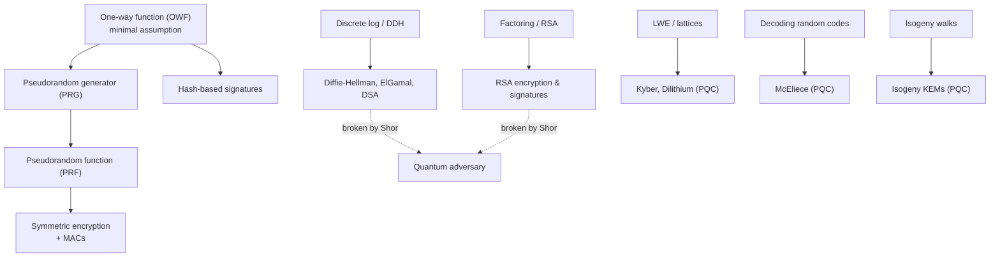

# Cryptography: Foundations &amp; Post-Quantum

[Advanced Topics](../) &raquo; Cryptography: Foundations &amp; Post-Quantum

**Graduate-level research page.** This is a rigorous, definition-and-reduction-oriented treatment of modern cryptography aimed at theoretical computer scientists, security researchers, and mathematicians. **Prerequisites:** probability theory, computational complexity (P/NP, polynomial-time reductions), number theory, and basic linear algebra over finite fields and lattices. For an applied, hands-on introduction to TLS, hashing, and key management instead, see [Applied Cryptography](../../technology/cybersecurity/cryptography.html) and the [Cybersecurity Hub](../../technology/cybersecurity/).

Cryptography earns its trust not from secrecy of design but from *proofs*. Modern provable security follows one template: assume a single, well-studied computational problem is hard, then show by an explicit **reduction** that any efficient adversary who breaks your scheme could be reorganized into an efficient algorithm that solves that hard problem. The security of nearly everything you use online ultimately rests on a small handful of such assumptions — and the looming arrival of quantum computers threatens exactly two of them (factoring and discrete log), which is why the field is now migrating to lattice-, code-, hash-, and isogeny-based replacements.

- **Security is a reduction.** "Scheme S is secure" means: break S efficiently and you have efficiently solved problem P. The contrapositive — P is hard, so S is secure — is the entire game.
- **Hardness is an assumption.** We cannot prove factoring or LWE are hard (that would settle P vs NP-style questions). We assume it, having failed to break it for decades, and build on top.
- **Knowledge can be proven without revealing it.** Zero-knowledge proofs let a prover convince a verifier that a statement is true while leaking nothing beyond its truth.
- **Quantum breaks two pillars.** Shor's algorithm demolishes factoring and discrete log in polynomial time. Lattices, codes, hashes, and isogenies are the candidate replacements NIST is standardizing.

### The Logical Spine

Provable security is built bottom-up. A single primitive — the **one-way function** — is the minimal assumption from which the entire symmetric world (PRGs, PRFs, signatures from hashes) can be constructed. Richer public-key objects need *structured* hardness (factoring, discrete log, LWE). The diagram shows what is built from what.

## Table of Contents
- [Provable Security and Reductions](#provable-security-and-reductions)
- [One-Way Functions](#one-way-functions)
- [Computational Hardness Assumptions](#computational-hardness-assumptions)
- [PRGs, PRFs, and the Symmetric World](#prgs-prfs-and-the-symmetric-world)
- [Semantic Security](#semantic-security)
- [The Random-Oracle Model](#the-random-oracle-model)
- [Zero-Knowledge Proofs](#zero-knowledge-proofs)
- [Post-Quantum Cryptography](#post-quantum-cryptography)
- [Open Problems and Frontiers](#open-problems-and-frontiers)

## Provable Security and Reductions

Classical cryptography ("security through obscurity") was broken repeatedly precisely because it had no definitions. Modern cryptography rests on three pillars introduced by Goldwasser and Micali: **formal definitions** of security, **precise assumptions**, and **proofs by reduction**.

### The Asymptotic Framework

We measure everything against a **security parameter** $n$ (often the key length). "Efficient" means **probabilistic polynomial-time (PPT)**: running time polynomial in $n$. "Negligible" means smaller than any inverse polynomial.

#### Definition (Negligible Function)
A function $\mu : \mathbb{N} \to \mathbb{R}^{+}$ is **negligible** if for every positive polynomial $p$ there exists $N$ such that for all $n > N$,

$$\mu(n) < \frac{1}{p(n)}.$$

Equivalently, $\mu(n) = n^{-\omega(1)}$. Examples: $2^{-n}$ and $n^{-\log n}$ are negligible; $n^{-100}$ is not.

A scheme is **secure** if every PPT adversary succeeds with at most negligible advantage over trivial guessing. Negligibility is closed under multiplication by polynomials and under polynomial summation, which is exactly what makes hybrid arguments (below) go through.

### What a Reduction Is

A security proof is a **reduction**: an explicit, efficient transformation $R$ that turns any adversary $\mathcal{A}$ breaking scheme $S$ into an algorithm $R^{\mathcal{A}}$ solving an assumed-hard problem $P$.

#### The Reductionist Method
To prove "$S$ is secure assuming $P$ is hard":
1. **Assume** a PPT $\mathcal{A}$ breaks $S$ with non-negligible advantage $\varepsilon(n)$.
2. **Construct** a PPT reduction $R$ that, given an instance of $P$, runs $\mathcal{A}$ as a subroutine (simulating $\mathcal{A}$'s expected environment) and uses $\mathcal{A}$'s output to solve $P$.
3. **Conclude** $R$ solves $P$ with probability related to $\varepsilon(n)$ — non-negligible — contradicting the hardness of $P$.

The logic is contrapositive: hard $P \Rightarrow$ no such $\mathcal{A} \Rightarrow$ $S$ is secure.

Reductions have a **tightness**. If $R$ solves $P$ with advantage $\varepsilon$ and runs in time $t$, but the proof only guarantees $\varepsilon_P \approx \varepsilon^2 / q$ for $q$ oracle queries, the reduction is **loose** and forces larger key sizes to compensate. Tight reductions ($\varepsilon_P \approx \varepsilon$ with comparable running time) are prized.

### The Hybrid Argument

The workhorse proof technique. To show two distributions $D_0$ and $D_k$ are computationally indistinguishable, interpolate a sequence of **hybrids** $D_0, D_1, \dots, D_k$ where consecutive hybrids differ in one small step.

#### Lemma (Hybrid Argument)
If $D_0$ and $D_k$ are distinguished with advantage $\varepsilon$, then some adjacent pair $(D_{i}, D_{i+1})$ is distinguished with advantage at least $\varepsilon / k$.

**Proof.** Let $p_i = \Pr[\text{distinguisher outputs } 1 \mid D_i]$. Then

$$\varepsilon = |p_0 - p_k| = \left| \sum_{i=0}^{k-1} (p_i - p_{i+1}) \right| \le \sum_{i=0}^{k-1} |p_i - p_{i+1}|.$$

By averaging, some term is at least $\varepsilon/k$. When $k$ is polynomial and each step relies on a negligible-advantage assumption, the total advantage stays negligible. $\square$

## One-Way Functions

The one-way function (OWF) is the **minimal** cryptographic primitive: its existence is equivalent to the existence of essentially all of symmetric cryptography (PRGs, PRFs, MACs, commitment schemes, digital signatures from hashing). Whether OWFs exist is open — their existence would imply $\mathrm{P} \ne \mathrm{NP}$.

#### Definition (One-Way Function)
A function $f : \{0,1\}^{*} \to \{0,1\}^{*}$ is **one-way** if:
1. **Easy to compute:** there is a PPT algorithm evaluating $f(x)$ for all $x$.
2. **Hard to invert:** for every PPT adversary $\mathcal{A}$,

$$\Pr_{x \leftarrow \{0,1\}^{n}}\!\left[\, f\!\left(\mathcal{A}(1^{n}, f(x))\right) = f(x) \,\right] \le \mathrm{negl}(n).$$

Note the adversary need only find *some* preimage, not $x$ itself; and it is handed $1^n$ so that "polynomial time" is measured in the *input* length, ruling out the trivial attack of writing out the (exponential) inversion table.

### One-Way Permutations and Hardcore Bits

A **one-way permutation** is a length-preserving one-way bijection. Even a OWP can leak partial information about $x$; what we need for pseudorandomness is a **hardcore predicate** — a single bit of $x$ that is as hard to predict as inverting $f$ entirely.

#### Goldreich-Levin Theorem
For any one-way function $f$, the function $f'(x, r) = (f(x), r)$ (with $|r| = |x|$) has a hardcore predicate

$$\mathrm{hc}(x, r) = \langle x, r \rangle = \bigoplus_{i} x_i r_i \pmod 2,$$

the inner product mod 2. No PPT adversary predicts $\langle x, r \rangle$ from $(f(x), r)$ with advantage non-negligibly better than $1/2$.

The proof is a beautiful list-decoding argument: an adversary predicting the inner product better than chance is converted, via the Goldreich-Levin (Hadamard) decoding algorithm, into an inverter for $f$. The hardcore bit is the bridge from "hard to invert" to "looks random," which is exactly what a PRG needs.

### Candidate One-Way Functions

| Candidate | Forward direction | Hard inverse problem |
|-----------|-------------------|----------------------|
| Multiplication | $f(p,q) = pq$ for primes $p,q$ | Integer factoring |
| Modular exponentiation | $f(x) = g^x \bmod p$ | Discrete logarithm |
| Subset sum | $f(S) = \sum_{i \in S} a_i$ | Subset-sum / knapsack |
| Rabin | $f(x) = x^2 \bmod N$ | Square roots mod composite $N$ |
| Lattice (Ajtai) | $f_A(x) = A x \bmod q$, short $x$ | Short Integer Solution (SIS) |

## Computational Hardness Assumptions

Public-key cryptography needs more than a generic OWF — it needs *structured* hardness with trapdoors and algebraic homomorphisms. Three families dominate.

### Factoring and the RSA Assumption

#### Factoring Assumption
For $N = pq$ a product of two random $n/2$-bit primes, no PPT algorithm outputs $\{p, q\}$ given $N$ with non-negligible probability.

#### RSA Assumption
Given $(N, e)$ with $\gcd(e, \varphi(N)) = 1$ and a random $y \in \mathbb{Z}_N^{*}$, no PPT algorithm finds $x$ with $x^e \equiv y \pmod N$ with non-negligible probability.

RSA inverts modular exponentiation; the trapdoor is the private exponent $d = e^{-1} \bmod \varphi(N)$, computable only by whoever knows $\varphi(N) = (p-1)(q-1)$. Best known classical attack is the **General Number Field Sieve**, with sub-exponential complexity

$$L_N\!\left[\tfrac{1}{3},\, \left(\tfrac{64}{9}\right)^{1/3}\right] = \exp\!\left( c\, (\ln N)^{1/3} (\ln \ln N)^{2/3} \right).$$

This is why RSA keys must be $\geq 2048$ bits while symmetric keys need only $128$.

### The Discrete Logarithm Family

Let $\mathbb{G}$ be a cyclic group of prime order $q$ with generator $g$ (e.g., a subgroup of $\mathbb{Z}_p^{*}$ or an elliptic-curve group).

#### Discrete Log (DL)
Given $h = g^x$, find $x$.

#### Computational Diffie-Hellman (CDH)
Given $(g^a, g^b)$, compute $g^{ab}$.

#### Decisional Diffie-Hellman (DDH)
Distinguish $(g^a, g^b, g^{ab})$ from $(g^a, g^b, g^c)$ for random $c$ with only negligible advantage.

These form a hierarchy: $\text{DL hard} \Leftarrow \text{CDH hard} \Leftarrow \text{DDH hard}$ (DDH is the strongest assumption). DDH underpins ElGamal's semantic security. On well-chosen elliptic curves no sub-exponential attack is known, so the generic $O(\sqrt{q})$ algorithms (baby-step giant-step, Pollard's rho) set the bar — giving 256-bit curves about 128-bit security.

### Lattice Assumptions: SIS and LWE

Lattices give the leading *post-quantum* assumptions because (a) no efficient quantum algorithm is known and (b) they enjoy worst-case-to-average-case reductions: breaking the average random instance is as hard as the worst case of a lattice problem.

A **lattice** $\Lambda = \{ \sum_i z_i \mathbf{b}_i : z_i \in \mathbb{Z} \}$ is the set of integer combinations of basis vectors $\mathbf{b}_i \in \mathbb{R}^m$. The core hard problems are the **Shortest Vector Problem (SVP)** and its approximate/decision variants (GapSVP, SIVP).

#### Learning With Errors (LWE)
Fix dimension $n$, modulus $q$, and an error distribution $\chi$ (typically a discrete Gaussian of small width). The secret is $\mathbf{s} \in \mathbb{Z}_q^{n}$. **Samples** are pairs

$$(\mathbf{a}_i,\ b_i) = \left(\mathbf{a}_i,\ \langle \mathbf{a}_i, \mathbf{s} \rangle + e_i \bmod q\right), \qquad \mathbf{a}_i \leftarrow \mathbb{Z}_q^{n},\ e_i \leftarrow \chi.$$

- **Search-LWE:** recover $\mathbf{s}$ from polynomially many samples.
- **Decision-LWE:** distinguish $\{(\mathbf{a}_i, b_i)\}$ from uniform pairs in $\mathbb{Z}_q^{n} \times \mathbb{Z}_q$ with only negligible advantage.

Without the error term, $\mathbf{s}$ is recovered instantly by Gaussian elimination; the small noise $e_i$ is what destroys the linear structure and makes the problem hard. Writing the samples in matrix form, distinguish

$$(A,\ A\mathbf{s} + \mathbf{e}) \quad \text{from} \quad (A,\ \mathbf{u}),\qquad \mathbf{u} \leftarrow \mathbb{Z}_q^{m}.$$

#### Regev's Reduction (worst-case to average-case)
If there is an efficient algorithm solving decision-LWE on the *average* (random $A$, $\mathbf{s}$), then there is an efficient *quantum* algorithm solving the *worst case* of GapSVP and SIVP to within $\tilde{O}(n/\alpha)$ factors, where $\alpha$ is the relative noise width.

This worst-case guarantee is what gives LWE-based schemes their unusual confidence: you need not hope a *random* instance is hard, only that *some* lattice instance is. The dual assumption, **SIS** (Short Integer Solution) — find short nonzero $\mathbf{z}$ with $A\mathbf{z} = 0 \bmod q$ — supports signatures and is also worst-case hard. Practical schemes use the algebraically structured **Ring-LWE / Module-LWE** variants for efficiency, trading some of the worst-case generality for much smaller keys.

## PRGs, PRFs, and the Symmetric World

From a OWF (equivalently, a hardcore bit) we bootstrap the objects that make symmetric encryption possible.

### Pseudorandom Generators

#### Definition (PRG)
A deterministic, poly-time $G : \{0,1\}^{n} \to \{0,1\}^{\ell(n)}$ with $\ell(n) > n$ is a **pseudorandom generator** if its output is computationally indistinguishable from uniform: for every PPT distinguisher $D$,

$$\Big| \Pr_{s \leftarrow \{0,1\}^{n}}[D(G(s)) = 1] - \Pr_{u \leftarrow \{0,1\}^{\ell(n)}}[D(u) = 1] \Big| \le \mathrm{negl}(n).$$

A PRG stretches $n$ truly random bits into $\ell(n)$ pseudorandom ones — the basis of stream ciphers and the "long random pad" needed for encryption. The **HILL theorem** (Håstad-Impagliazzo-Levin-Luby) proves OWFs imply PRGs; the clean special case is that a one-way permutation $f$ with hardcore bit $\mathrm{hc}$ yields the PRG $G(s) = (f(s), \mathrm{hc}(s))$, extended by iteration (the Blum-Micali construction):

$$G(s) = \big(\mathrm{hc}(s),\ \mathrm{hc}(f(s)),\ \mathrm{hc}(f^2(s)),\ \dots,\ \mathrm{hc}(f^{\ell-1}(s))\big).$$

### Pseudorandom Functions

#### Definition (PRF)
A keyed function $F : \{0,1\}^{n} \times \{0,1\}^{n} \to \{0,1\}^{n}$ is a **pseudorandom function** if no PPT distinguisher with *oracle access* can tell $F_k$ (random key $k$) from a truly random function $R : \{0,1\}^{n} \to \{0,1\}^{n}$:

$$\Big| \Pr_{k}[D^{F_k(\cdot)} = 1] - \Pr_{R}[D^{R(\cdot)} = 1] \Big| \le \mathrm{negl}(n).$$

PRFs are the abstraction behind block ciphers (AES is modeled as a pseudorandom *permutation*). The **GGM construction** (Goldreich-Goldwasser-Micali) builds a PRF from any length-doubling PRG $G(s) = (G_0(s), G_1(s))$ via a binary tree of depth $n$: the output on input $x = x_1 x_2 \cdots x_n$ is

$$F_k(x) = G_{x_n}\!\big( \cdots G_{x_2}(G_{x_1}(k)) \cdots \big).$$

Each bit of $x$ selects the left or right half of the PRG output, walking root-to-leaf. The security proof is a hybrid argument over the $n$ tree levels.

### From PRF to Encryption

A PRF immediately gives **CPA-secure** symmetric encryption (counter mode): to encrypt $m$, pick random $r$ and send $(r,\ F_k(r) \oplus m)$. Authenticated encryption combines this with a PRF-based MAC ($\mathrm{tag} = F_{k'}(\text{ciphertext})$) under the **encrypt-then-MAC** composition, which provably achieves the strongest standard notion (IND-CCA / authenticated encryption).

## Semantic Security

What does it mean for encryption to "hide" a message? Goldwasser and Micali's answer revolutionized the field: a ciphertext should leak *nothing* an adversary could not already compute without it.

#### Definition (Semantic Security, IND-CPA form)
A scheme is **IND-CPA secure** if no PPT adversary wins the following game with advantage over $1/2$ that is more than negligible:
1. The challenger generates keys; the adversary may query an encryption oracle.
2. The adversary submits two equal-length messages $m_0, m_1$.
3. The challenger picks $b \leftarrow \{0,1\}$ and returns $c = \mathrm{Enc}(m_b)$.
4. The adversary (with continued oracle access) outputs a guess $b'$. It **wins** if $b' = b$.

Advantage $= \big| \Pr[b' = b] - \tfrac{1}{2} \big|$.

The deep equivalence — proved by Goldwasser and Micali — is that this *indistinguishability* notion is exactly equivalent to **semantic security**: whatever a PPT adversary can compute about the plaintext from the ciphertext, it can compute equally well from the message length alone. Indistinguishability is easier to work with in proofs; semantic security is the intuitive guarantee.

#### Consequence: Encryption Must Be Randomized
No deterministic encryption can be IND-CPA secure: an adversary submitting $m_0 \ne m_1$ simply re-encrypts $m_0$ via the oracle and compares. Hiding *which* message requires fresh randomness (an IV/nonce) on every encryption.

Stronger notions handle active adversaries: **IND-CCA2** gives the adversary a decryption oracle for every ciphertext except the challenge, modeling padding-oracle and reaction attacks. Real protocols (TLS) target IND-CCA2 / authenticated encryption.

### Worked Reduction: ElGamal is IND-CPA under DDH

ElGamal over a group $\mathbb{G} = \langle g \rangle$ of prime order $q$: public key $h = g^x$; to encrypt $m \in \mathbb{G}$, pick $r \leftarrow \mathbb{Z}_q$ and output $(g^r,\ h^r \cdot m)$.

**Claim.** If DDH holds in $\mathbb{G}$, ElGamal is IND-CPA.

**Reduction.** Given a DDH challenge $(g^a, g^b, T)$ — where $T$ is either $g^{ab}$ or random — set the public key $h = g^a$. On the adversary's challenge pair $(m_0, m_1)$, return ciphertext $(g^b,\ T \cdot m_\beta)$ for a random bit $\beta$.

- If $T = g^{ab}$, this is a *genuine* encryption of $m_\beta$ with $r = b$; the adversary guesses $\beta$ with its full advantage $\varepsilon$.
- If $T$ is uniform, then $T \cdot m_\beta$ is uniform and independent of $\beta$; the adversary's guess is correct with probability exactly $1/2$.

So the reduction's DDH advantage equals the adversary's IND-CPA advantage $\varepsilon$. A non-negligible $\varepsilon$ breaks DDH. $\square$

## The Random-Oracle Model

Many efficient real-world schemes (RSA-OAEP, RSA-PSS, full-domain hash, Fiat-Shamir signatures) resist proof under standard assumptions alone. The **random-oracle model (ROM)** is an idealization that makes such proofs go through.

#### The Random-Oracle Model
A hash function $H$ is modeled as a truly random function: every party (including the adversary and the reduction) accesses $H$ only as an **oracle** that returns a fresh uniform value on each new query and is consistent on repeats. The reduction *programs* the oracle — choosing its answers adaptively — while observing every query the adversary makes.

This grants the reduction two superpowers absent in the standard model: **observability** (it sees the adversary's hash queries, often "extracting" a secret the adversary must have computed) and **programmability** (it embeds its challenge into an oracle answer). The classic example:

#### Fiat-Shamir Transform
Any public-coin interactive zero-knowledge proof of knowledge ($\Sigma$-protocol) becomes a **non-interactive signature** by replacing the verifier's random challenge $c$ with $c = H(\text{statement} \,\|\, \text{commitment} \,\|\, \text{message})$. In the ROM, the reduction simulates by programming $H$, and uses the forking lemma to extract two transcripts with the same commitment but different challenges — from which the secret (and hence a solution to the underlying hard problem) is recovered.

### The Caveat

The ROM is a **heuristic, not a theorem about real hash functions**. Canetti-Goldreich-Halevi (1998) constructed (contrived) schemes provably secure in the ROM yet *insecure under every concrete instantiation* of $H$. No real hash is a random oracle. In practice, ROM proofs are treated as strong evidence — a scheme with a ROM proof and no structural weakness is trusted — but standard-model proofs are strictly preferred when available. The **quantum random-oracle model (QROM)**, where the adversary may query $H$ in superposition, is the relevant idealization for post-quantum schemes and is significantly subtler (observation and programming techniques must be rebuilt).

## Zero-Knowledge Proofs

A zero-knowledge proof lets a prover $P$ convince a verifier $V$ that a statement $x \in L$ is true while revealing *nothing else* — not even *why* it is true.

#### Definition (Interactive Proof + Zero Knowledge)
An interactive protocol $(P, V)$ for a language $L$ is a **zero-knowledge proof** if it satisfies:
- **Completeness:** if $x \in L$, the honest $V$ accepts the honest $P$ with probability $\ge 1 - \mathrm{negl}$.
- **Soundness:** if $x \notin L$, no (even unbounded, for statistical soundness) cheating prover makes $V$ accept with more than negligible probability.
- **Zero-knowledge:** for every PPT verifier $V^{*}$ there is a PPT **simulator** $\mathcal{S}$ that, *without* the witness, produces transcripts computationally indistinguishable from real $(P, V^{*})$ interactions.

The simulator is the heart of the definition: if a transcript can be *forged* without the secret, then the real transcript cannot have leaked the secret. Zero-knowledge is thus formalized as **simulatability**.

### The Canonical Example: Graph Isomorphism

To prove two graphs $G_0, G_1$ are isomorphic ($G_1 = \pi(G_0)$) without revealing $\pi$:

1. **Commit.** $P$ picks a random permutation $\sigma$, sends $H = \sigma(G_1)$.
2. **Challenge.** $V$ sends a random bit $b \in \{0,1\}$.
3. **Respond.** $P$ sends a permutation $\rho$ mapping $G_b \to H$ (namely $\rho = \sigma$ if $b=1$, or $\rho = \sigma \circ \pi$ if $b=0$).
4. **Verify.** $V$ checks $\rho(G_b) = H$.

A cheating prover (graphs *not* isomorphic) can satisfy only one of the two challenges, so each round catches it with probability $1/2$; repeating $k$ times drives soundness error to $2^{-k}$. The simulator picks $b$ *first*, then constructs a matching $H$ — producing valid transcripts with no knowledge of $\pi$, which proves zero-knowledge.

#### Theorem (GMW)
If one-way functions exist, then **every** language in NP has a computational zero-knowledge proof.

The constructive proof reduces any NP statement to graph 3-coloring and gives a ZK protocol using a bit-commitment scheme (built from a OWF). Thus ZK is not exotic — anything you can *verify* efficiently, you can *prove in zero knowledge*.

### Variants and Modern Systems

| Property | Meaning |
|----------|---------|
| **Proof of knowledge** | An *extractor* can recover the witness from a prover that succeeds — proving the prover *knows* it, not merely that it exists. |
| **Non-interactive (NIZK)** | Single message, via a common reference string or Fiat-Shamir in the ROM. |
| **Statistical vs computational ZK** | Simulator output is statistically close vs only computationally indistinguishable. |
| **Succinct (zk-SNARK / zk-STARK)** | Proof size and verification time are sub-linear (often polylogarithmic) in the statement size. |

**zk-SNARKs** (succinct non-interactive arguments of knowledge) compress proofs of arbitrary computation to a few hundred bytes verifiable in milliseconds — powering blockchain rollups and private transactions. **zk-STARKs** drop the trusted setup and rely only on collision-resistant hashes, making them *post-quantum plausible*. Both reduce a computation to an arithmetic circuit / polynomial constraint system and prove its satisfiability succinctly.

## Post-Quantum Cryptography

A large fault-tolerant quantum computer running **Shor's algorithm** factors integers and computes discrete logs in polynomial time — destroying RSA, Diffie-Hellman, and elliptic-curve cryptography. **Grover's algorithm** gives only a quadratic speedup against symmetric primitives, so doubling key/output lengths (AES-256, SHA-384) restores symmetric security. The urgent task is replacing public-key cryptography with problems believed hard even for quantum computers. (See [Quantum Algorithms Research](../quantum-algorithms-research/) for Shor and Grover in full.)

#### Harvest Now, Decrypt Later
The threat is not only future: adversaries can record today's encrypted traffic and decrypt it once quantum hardware matures. Data with a long secrecy lifetime (state secrets, medical records, genomic data) must migrate to post-quantum cryptography *now*, even before quantum computers exist.

NIST's standardization (2016–2024) selected the first standards in 2024: **ML-KEM** (Kyber, FIPS 203) for key encapsulation, **ML-DSA** (Dilithium, FIPS 204) and **SLH-DSA** (SPHINCS+, FIPS 205) for signatures, with **FN-DSA** (Falcon) to follow. Four mathematical families compete.

### Lattice-Based (Kyber, Dilithium, Falcon)

Built on **Module-LWE** and **Module-SIS**. The frontrunners: balanced key sizes (around 1–2 KB), fast operations, and worst-case hardness guarantees. **Kyber** is a CPA-secure encryption made CCA-secure via the Fujisaki-Okamoto transform; **Dilithium** is a Fiat-Shamir signature; **Falcon** uses NTRU lattices and Gaussian sampling for the smallest lattice signatures. These are the default choice for general-purpose deployment.

### Code-Based (Classic McEliece)

Based on the hardness of **decoding a random linear code** — NP-hard in the worst case and studied since McEliece (1978), giving it the longest unbroken track record of any candidate. The public key hides the structure of a Goppa code; decryption uses the secret decoder.

$$\text{Ciphertext: } \mathbf{c} = \mathbf{m} G' + \mathbf{e}, \qquad G' = S G P \ (\text{scrambled generator}),\ \mathrm{wt}(\mathbf{e}) = t.$$

The drawback is enormous public keys (hundreds of KB to ~1 MB), but ciphertexts and speed are excellent, so it suits scenarios where the key is distributed once and reused.

### Hash-Based (SPHINCS+, XMSS)

The most *conservative* family: security rests **only** on the collision/preimage resistance of a hash function — the same assumption already trusted everywhere — with no number-theoretic structure to attack.

- **One-time signatures** (Lamport, Winternitz) sign a single message from a hash-chain key.
- **Merkle trees** authenticate many one-time public keys under one root, giving *stateful* many-time schemes (**XMSS**, **LMS**).
- **SPHINCS+** layers a hypertree plus a few-time scheme to become **stateless** (no risk of catastrophic key-reuse), at the cost of larger (~8–50 KB) signatures.

Hash-based signatures are the safest long-term insurance: if every other family falls, secure hashing alone still yields signatures.

### Isogeny-Based (cautionary tale)

Isogeny cryptography uses walks in the graph of **supersingular elliptic curves** connected by isogenies (structure-preserving maps). Its appeal was the smallest keys of any candidate. But in 2022 the **Castryck-Decru attack** broke **SIDH/SIKE** in polynomial time on a laptop, exploiting auxiliary torsion-point information — eliminating a NIST finalist overnight.

**Lesson.** The SIKE break is the field's sharpest reminder that post-quantum hardness is *conjectural and young*. Newer isogeny schemes (**CSIDH**, **SQIsign** — notable for very small signatures) avoid the broken structure and remain under active study, but the episode is why NIST standardized a *diversified portfolio* across unrelated assumptions rather than betting on one.

### Comparison at a Glance

| Family | Hard problem | Public key | Sig/CT size | Status |
|--------|--------------|-----------|-------------|--------|
| Lattice (Kyber/Dilithium) | Module-LWE / SIS | ~1–2 KB | ~1–4 KB | Standardized (FIPS 203/204) |
| Code (McEliece) | Decode random code | ~260 KB–1 MB | ~100 B–KB | NIST round 4 candidate |
| Hash (SPHINCS+) | Hash pre/collision resistance | ~32–64 B | ~8–50 KB | Standardized (FIPS 205) |
| Isogeny (SQIsign) | Endomorphism / isogeny path | small | very small sig | Under study (SIDH broken 2022) |

## Open Problems and Frontiers

- **Do one-way functions exist?** The foundational open question — equivalent to the existence of essentially all of cryptography, and tied to $\mathrm{P} \ne \mathrm{NP}$ and average-case complexity.
- **Closing the ROM gap.** Standard-model constructions matching the efficiency of random-oracle schemes (especially for compact signatures and IBE) remain elusive; QROM security proofs for deployed PQC are still being hardened.
- **Confidence in PQC hardness.** Lattice and code assumptions are decades younger than factoring; ongoing cryptanalysis (algebraic attacks, improved sieving, the SIKE break) calibrates real security margins.
- **Practical succinct ZK.** zk-SNARK/STARK proving time and trusted-setup elimination, plus post-quantum-secure proof systems, are rapidly evolving research areas.
- **Fully homomorphic encryption (FHE).** Computing on encrypted data — built from LWE (Gentry 2009) — is now practical-ish; closing the remaining performance gap is a major frontier.
- **Migration at scale.** Hybrid classical+PQC key exchange, crypto-agility, and protocol redesign (TLS, SSH, PKI) constitute an enormous engineering transition already underway.

## Key Takeaways

- **Security = reduction.** A proof of security is an efficient transformation turning any scheme-breaker into a solver for an assumed-hard problem. No reduction, no guarantee.
- **OWFs are minimal.** One-way functions are equivalent to PRGs, PRFs, MACs, commitments, and hash-based signatures — the whole symmetric world rests on them.
- **Public key needs structure.** Factoring, discrete log, and LWE provide trapdoors and homomorphisms that generic OWFs cannot.
- **Semantic security forces randomness.** IND-CPA is equivalent to leaking nothing beyond message length; deterministic encryption can never achieve it.
- **The ROM is a heuristic.** Programmable random oracles enable efficient proofs but are provably not realizable by any concrete hash.
- **ZK = simulatability.** If a transcript can be forged without the witness, it leaked nothing. Every NP statement has a ZK proof assuming OWFs.
- **Quantum breaks two pillars.** Shor kills factoring and discrete log; lattices, codes, hashes, and isogenies are the diversified post-quantum replacements.

## References

1. Katz, J., & Lindell, Y. (2020). *Introduction to Modern Cryptography*, 3rd ed.
2. Goldreich, O. (2001/2004). *Foundations of Cryptography*, Vols. I–II.
3. Goldwasser, S., & Micali, S. (1984). "Probabilistic Encryption." *JCSS*.
4. Goldreich, O., & Levin, L. (1989). "A Hard-Core Predicate for All One-Way Functions." *STOC*.
5. Goldreich, O., Goldwasser, S., & Micali, S. (1986). "How to Construct Random Functions." *JACM*.
6. Goldwasser, S., Micali, S., & Rackoff, C. (1989). "The Knowledge Complexity of Interactive Proof Systems." *SIAM J. Comput.*
7. Goldreich, O., Micali, S., & Wigderson, A. (1991). "Proofs that Yield Nothing But Their Validity." *JACM*.
8. Bellare, M., & Rogaway, P. (1993). "Random Oracles Are Practical." *CCS*.
9. Canetti, R., Goldreich, O., & Halevi, S. (2004). "The Random Oracle Methodology, Revisited." *JACM*.
10. Regev, O. (2009). "On Lattices, Learning with Errors, Random Linear Codes, and Cryptography." *JACM*.
11. Shor, P. (1997). "Polynomial-Time Algorithms for Prime Factorization and Discrete Logarithms on a Quantum Computer." *SIAM J. Comput.*
12. Castryck, W., & Decru, T. (2023). "An Efficient Key Recovery Attack on SIDH." *EUROCRYPT*.
13. NIST (2024). FIPS 203 (ML-KEM), FIPS 204 (ML-DSA), FIPS 205 (SLH-DSA).

## See Also

#### See Also

**Related Advanced Topics**
- [Quantum Algorithms Research](../quantum-algorithms-research/) — Shor's and Grover's algorithms, the quantum threat to factoring and discrete log
- [AI Mathematics](../ai-mathematics/) — Probability, concentration, and complexity tools shared with provable security
- [Distributed Systems Theory](../distributed-systems-theory/) — Byzantine agreement and the cryptographic primitives consensus relies on

**Foundations & Applied**
- [Applied Cryptography](../../technology/cybersecurity/cryptography.html) — Practical TLS, hashing, and key management
- [Cybersecurity Hub](../../technology/cybersecurity/) — Attacks, defenses, and security operations
- [Networking Hub](../../technology/networking/) — Where cryptographic protocols live on the wire
- [Mathematical Reference](../../reference/) — Number theory, finite fields, and complexity quick reference

