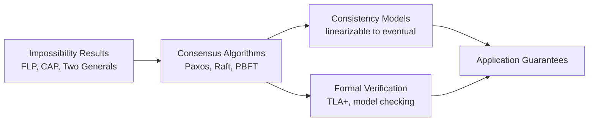
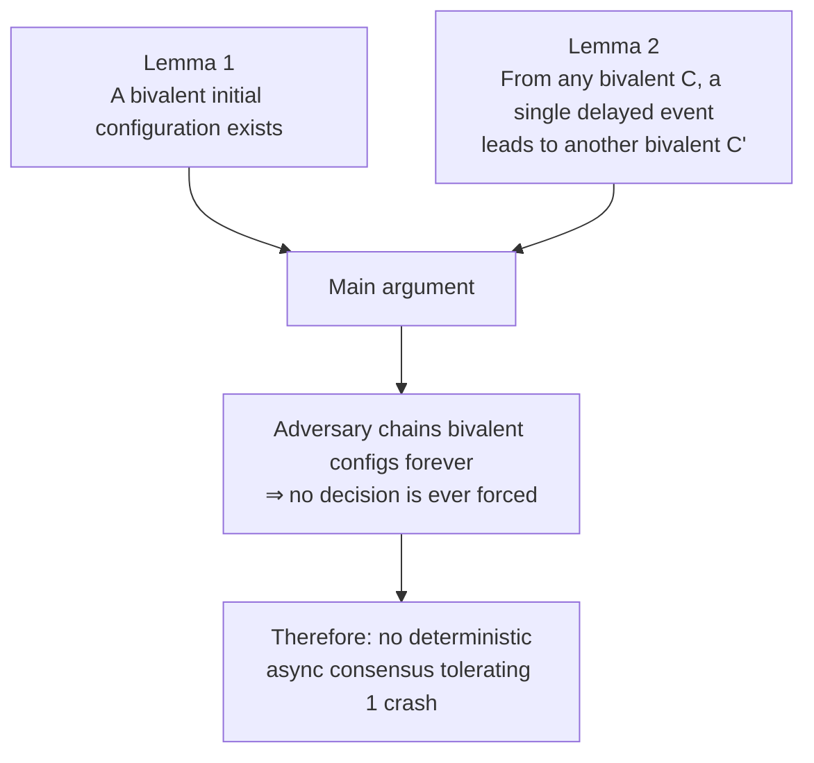
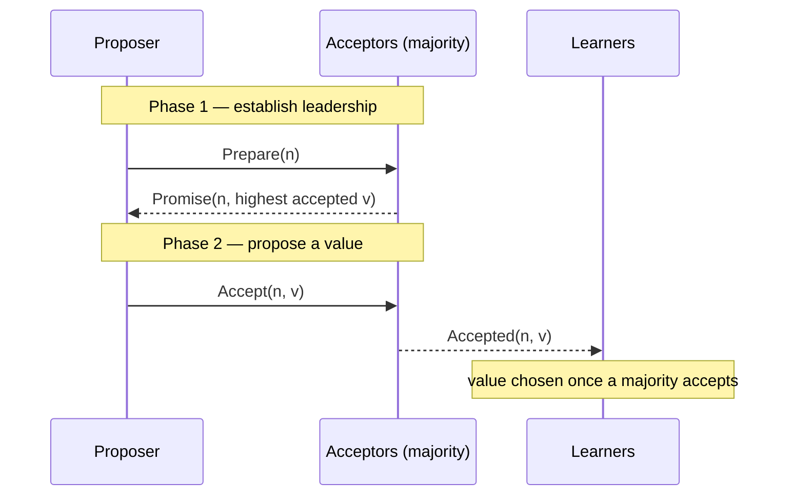
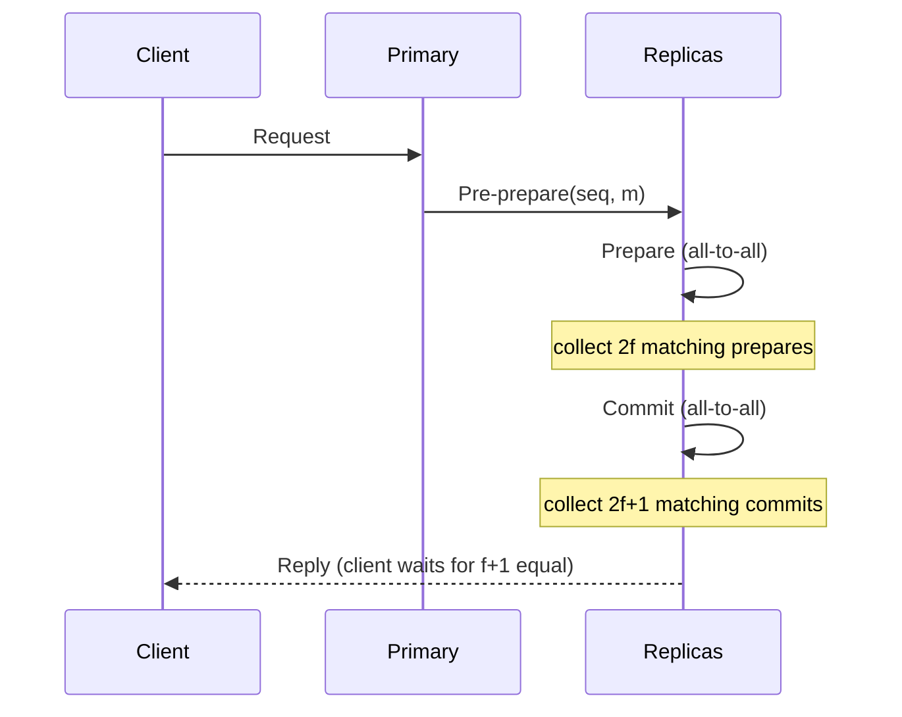

<div class="hero-section" style="background: linear-gradient(135deg, #232526 0%, #414345 100%); color: white; padding: 3rem 2rem; margin: -2rem -3rem 2rem -3rem; text-align: center;">
  <h1 style="color: white; margin: 0; font-size: 2.5rem;">Distributed Systems Theory</h1>
  <p style="font-size: 1.25rem; margin-top: 1rem; opacity: 0.9;">Fundamental impossibility results, consensus algorithms, and formal verification for distributed computing</p>
</div>

<div class="advanced-note" markdown="1">
**Graduate-level research page.** This page develops the formal theory — impossibility proofs, consensus correctness, and verification — for distributed systems researchers and formal-methods practitioners. **Prerequisites:** formal methods, temporal logic, graph theory, probability theory, and complexity theory. For practical patterns and working code instead, see the [Distributed Systems Hub](../../distributed-systems/).
</div>

<div class="intro-card" markdown="1">
<p class="lead-text">Distributed systems theory is, at its core, the study of what is <em>impossible</em> and how to get arbitrarily close to it anyway. A single computer has a global clock, shared memory, and fail-stop behavior; the moment you split computation across machines connected by an unreliable network, every one of those guarantees evaporates. This page develops the formal machinery — impossibility results, consensus protocols, consistency models, and verification techniques — that explains why distributed coordination is hard and what design space remains.</p>
</div>

<div class="key-insights">
  <div class="insight-card"><i class="fas fa-ban"></i><h4>Impossibility shapes design</h4><p>FLP and CAP do not say "give up" — they tell you exactly which guarantee you must relax (synchrony, determinism, or availability) to make progress.</p></div>
  <div class="insight-card"><i class="fas fa-clock"></i><h4>No global time</h4><p>Without a shared clock, "order" is defined by causality (happens-before), captured by logical and vector clocks rather than wall-clock timestamps.</p></div>
  <div class="insight-card"><i class="fas fa-users"></i><h4>Agreement needs a quorum</h4><p>Crash-fault consensus needs a majority (n &ge; 2f+1); Byzantine consensus needs a supermajority (n &ge; 3f+1). The bound is not tunable — it is provable.</p></div>
  <div class="insight-card"><i class="fas fa-shield-alt"></i><h4>Safety vs liveness</h4><p>Protocols are designed so that nothing bad ever happens (safety) even when progress (liveness) must wait for the network to behave.</p></div>
</div>

### How to Read This Page

The results below build on one another. Impossibility results define the boundary; consensus algorithms (Paxos, Raft, PBFT) live just inside it by adding assumptions (partial synchrony, randomization, or failure detectors); consistency models describe the guarantees those algorithms expose to applications; and formal verification gives us tools to prove a given implementation actually respects them.



## Table of Contents
- [Fundamental Impossibility Results](#fundamental-impossibility-results)
- [Consensus Algorithms](#consensus-algorithms)
- [Consistency Models](#consistency-models)
- [Byzantine Fault Tolerance](#byzantine-fault-tolerance)
- [Distributed Computing Theory](#distributed-computing-theory)
- [Formal Verification](#formal-verification)

## Fundamental Impossibility Results

### FLP Impossibility Theorem

<div class="postulate-card" markdown="1">
#### Theorem (Fischer–Lynch–Paterson, 1985)
No deterministic protocol can solve consensus in an **asynchronous** system if even **one** process may crash.
</div>

**Intuition first**: In an asynchronous network you cannot distinguish a *crashed* process from a *slow* one — there is no timeout you can trust. So whenever the protocol is on the verge of deciding, an adversarial scheduler can delay exactly the one message that would tip the decision, keeping the system perpetually undecided. The theorem formalizes this with the notion of *valence*.

**Formal definitions**: Let $C$ be a configuration and $e = (p, m)$ an event (process $p$ receiving message $m$).
- $C$ is **0-valent** if every reachable decision from $C$ is 0.
- $C$ is **1-valent** if every reachable decision from $C$ is 1.
- $C$ is **bivalent** if both decisions remain reachable.

The proof is a two-part argument: establish that an undecided ("bivalent") starting point must exist, then show the adversary can always keep the system in that limbo.



**Lemma 1 (a bivalent start exists)**: If every initial configuration were univalent, two configurations differing in a single process's input would have opposite valence; an execution in which that process crashes is indistinguishable to the rest, forcing the same decision — a contradiction. Hence some initial configuration is bivalent.

**Lemma 2 (bivalence is preserved)**: From any bivalent $C$, there is an event whose delay yields another bivalent configuration $C'$. The scheduler applies Lemma 2 indefinitely, producing an infinite non-deciding execution.

**What this buys real systems**: practical protocols escape FLP by *weakening an assumption* — adding partial synchrony and timeouts (Paxos/Raft), randomization (Ben-Or), or an unreliable failure detector ($\diamond P$, below).

### CAP Theorem

<div class="principle-card" markdown="1">
#### Theorem (Brewer's Conjecture; proved by Gilbert & Lynch, 2002)
A distributed system cannot simultaneously guarantee all three of **C**onsistency, **A**vailability, and **P**artition tolerance. Since partitions are unavoidable in any real network, the practical choice is **CP vs AP**.
</div>

A distributed system cannot simultaneously provide:
- **C**onsistency: All nodes see the same data
- **A**vailability: Every request receives a response
- **P**artition tolerance: System continues despite network failures

**Formal Model**:
- System S = (N, L) where N is set of nodes, L is set of links
- Partition P ⊆ L represents failed links
- Request/response model with read/write operations

**Proof**: By contradiction, assume system provides CAP. Create partition separating nodes. Write different values to each partition. Reads must return inconsistent values, contradicting consistency.

### Two Generals Problem

**Problem**: Two generals must coordinate attack. Communication is unreliable.

**Theorem**: No finite protocol guarantees agreement in presence of arbitrary message loss.

**Proof**: By induction on message rounds. If n messages suffice, then n-1 must suffice (contradiction).

## Consensus Algorithms

### Paxos Algorithm

**Intuition**: Paxos lets a set of unreliable nodes agree on a single value despite crashes and message loss. The trick is a two-phase majority handshake: a proposer first asks acceptors to *promise* not to consider older proposals (locking out stale leaders), then asks them to *accept* a value. Because any two majorities overlap in at least one acceptor, a value that was once chosen can never be "forgotten" by a later round — that overlap is the entire safety argument.



**Basic Paxos** consists of two phases:

**Phase 1a (Prepare)**:
```
Proposer p selects proposal number n > any previous
Sends Prepare(n) to majority of acceptors
```

**Phase 1b (Promise)**:
```
If acceptor a receives Prepare(n) where n > any promised:
  - Promise not to accept proposals numbered < n
  - Send Promise(n, v) where v is highest-numbered accepted value
```

**Phase 2a (Accept)**:
```
If proposer receives promises from majority:
  - If any Promise contained value v, use it
  - Otherwise choose new value
  - Send Accept(n, v) to acceptors
```

**Phase 2b (Accepted)**:
```
If acceptor receives Accept(n, v) and hasn't promised > n:
  - Accept the proposal
  - Send Accepted(n, v) to learners
```

**Safety Proof**: Show that two different values cannot be chosen:
- P1: An acceptor accepts proposal (n, v) only if it hasn't responded to Prepare(m) for m > n
- P2: If proposal (n, v) is chosen, then every proposal (m, v') with m > n has v' = v

### Raft Consensus

**Key Insight**: Decompose consensus into:
1. Leader election
2. Log replication
3. Safety

**Leader Election Correctness**:
- **Election Safety**: At most one leader per term
- **Leader Append-Only**: Leader never overwrites its log
- **Log Matching**: If logs contain entry with same index/term, logs are identical up to that entry

**State Machine Safety Property**:
```
∀ servers s₁, s₂: 
  applied(s₁, i) ∧ applied(s₂, i) → 
  stateMachine(s₁)[i] = stateMachine(s₂)[i]
```

### Virtual Synchrony

**Model**: Process groups with atomic multicast guarantees:
- **View Synchrony**: All processes see same sequence of views
- **Message Stability**: Messages delivered in same view to all recipients

**Formal Properties**:
```
send(p, m, v) ∧ deliver(q, m, v') → v = v'
deliver(p, m) ∧ deliver(q, m') ∧ m ≠ m' → 
  (deliver(p, m') ∧ deliver(q, m))
```

## Consistency Models

### Linearizability

**Definition**: Execution history H is linearizable if:
1. Exists legal sequential history S
2. S respects real-time ordering of H
3. Each operation appears to take effect atomically between invocation and response

**Formal**: History H = ⟨E, <ₕ⟩ where:
- E is set of events (invocations/responses)
- <ₕ is happens-before relation

**Linearization Points**: For each operation op, exists time t:
- inv(op) < t < res(op)
- Operations ordered by linearization points form legal sequential history

### Sequential Consistency

**Definition (Lamport)**: Result of any execution is same as if:
1. Operations of all processors executed in some sequential order
2. Operations of each processor appear in program order

**Formal Model**:
```
∀ processes p, q:
  op₁ <ₚ op₂ → π(op₁) < π(op₂)
where π is the sequential permutation
```

### Causal Consistency

**Definition**: Writes that are causally related must be seen in same order by all processes.

**Happens-Before Relation**:
```
a → b if:
  1. a and b are events in same process, a comes before b
  2. a is send(m) and b is receive(m)
  3. ∃ c: a → c ∧ c → b (transitivity)
```

### Eventual Consistency

**Definition**: If no new updates are made, eventually all accesses will return the last updated value.

**Formal Specification**:
```
∀ t, ∃ t' > t: ∀ p ∈ P, ∀ t'' > t':
  read(p, x, t'') returns v
where v is the last written value
```

## Byzantine Fault Tolerance

### Byzantine Generals Problem

<div class="postulate-card" markdown="1">
#### Theorem (Lamport–Shostak–Pease, 1982)
With $f$ arbitrarily-faulty (Byzantine) participants, agreement is possible **only if** $n \geq 3f + 1$. With unforgeable signatures the bound relaxes to $n \geq f + 1$.
</div>

**Setting**: $n$ generals, at most $f$ are traitors who may send conflicting or arbitrary messages.

**Why 3f + 1?** With only $3f$ nodes, a loyal node cannot tell whether confusion comes from a lying *commander* or a lying *peer* — the two scenarios are message-for-message identical. A two-thirds-plus supermajority of honest nodes is required so that honest votes always outnumber the worst-case forgeries.

**Proof sketch** (for $n=3$, $f=1$): construct three execution scenarios that are pairwise indistinguishable to the loyal generals; any deterministic rule that decides correctly in one decides incorrectly in another — so no algorithm can guarantee agreement.

### PBFT (Practical Byzantine Fault Tolerance)

**Algorithm Phases**: PBFT reaches agreement in three message rounds. The two all-to-all rounds (prepare, commit) are what defeat equivocation by a malicious primary — an honest replica only acts once it sees a quorum of *matching* messages.



1. **Request**: Client sends request to primary
2. **Pre-prepare**: Primary assigns sequence number, broadcasts
3. **Prepare**: Replicas broadcast prepare messages
4. **Commit**: After 2f prepares, broadcast commit
5. **Reply**: After 2f+1 commits, execute and reply

**Safety Property**:
```
∀ correct replicas r₁, r₂:
  committed(r₁, n, m) ∧ committed(r₂, n, m') → m = m'
```

**Liveness**: Guaranteed if at most f replicas are faulty and delay(t) doesn't grow faster than t indefinitely.

### Byzantine Fault Detection

**Theorem**: Cannot distinguish slow replicas from Byzantine in asynchronous systems.

**PeerReview Approach**: Maintain tamper-evident logs:
```
entry = ⟨seq, type, content, hmac⟩
hmac = H(entry[i-1].hmac || entry[i].content)
```

## Distributed Computing Theory

### Time and Clocks

**Logical Clocks (Lamport)**:
```
1. Each process p maintains counter Cₚ
2. On event e at p: Cₚ := Cₚ + 1, timestamp(e) = Cₚ
3. On send(m) at p: include Cₚ in m
4. On receive(m) at q: Cq := max(Cq, Cm) + 1
```

**Vector Clocks**:
```
1. Each process p maintains vector VCₚ[1..n]
2. On event at p: VCₚ[p] := VCₚ[p] + 1
3. On send(m) at p: piggyback VCₚ
4. On receive(m) at q: ∀i: VCq[i] := max(VCq[i], VCm[i])
```

**Causal Ordering Property**:
```
e₁ → e₂ ⟺ VC(e₁) < VC(e₂)
where VC(e₁) < VC(e₂) ⟺ ∀i: VC(e₁)[i] ≤ VC(e₂)[i] ∧ ∃j: VC(e₁)[j] < VC(e₂)[j]
```

### Distributed Snapshots

**Chandy-Lamport Algorithm**:

**Marker Rules**:
1. **Marker Sending**: Process records state and sends markers on all channels
2. **Marker Receiving**: 
   - First marker: Record state, send markers
   - Subsequent: Record channel state

**Correctness**: Snapshot is consistent if:
```
∀ messages m: (send(m) ∈ snapshot) ⟺ (receive(m) ∈ snapshot)
```

### Failure Detectors

**Properties**:
- **Strong Completeness**: Eventually every crashed process is suspected
- **Weak Completeness**: Eventually some crashed process is suspected
- **Strong Accuracy**: No correct process is suspected
- **Weak Accuracy**: Some correct process is never suspected

**Perfect Failure Detector (P)**:
- Strong completeness + Strong accuracy
- Impossible in asynchronous systems

**Eventually Perfect (◇P)**:
- Strong completeness + Eventual strong accuracy
- Weakest to solve consensus

## Formal Verification

### TLA+ Specification

**Example - Two-Phase Commit**:
```tla
---- MODULE TwoPhaseCommit ----
EXTENDS Integers, Sequences, FiniteSets

CONSTANTS Participant

VARIABLES 
  coordinatorState,
  participantState,
  messages

TypeOK ==
  /\ coordinatorState \in {"init", "preparing", "committed", "aborted"}
  /\ participantState \in [Participant -> {"init", "prepared", "committed", "aborted"}]
  /\ messages \subseteq Message

Init ==
  /\ coordinatorState = "init"
  /\ participantState = [p \in Participant |-> "init"]
  /\ messages = {}

Prepare ==
  /\ coordinatorState = "init"
  /\ coordinatorState' = "preparing"
  /\ messages' = messages \cup {[type |-> "prepare", dest |-> p] : p \in Participant}
  /\ UNCHANGED participantState

...

Spec == Init /\ [][Next]_vars
```

### Model Checking

**State Space Exploration**:
```
Reachable = {s₀}
Frontier = {s₀}
while Frontier ≠ ∅:
  s = Frontier.pop()
  for each transition t enabled in s:
    s' = apply(t, s)
    if s' ∉ Reachable:
      Reachable.add(s')
      Frontier.add(s')
    if violates_property(s'):
      return counterexample
```

### Temporal Logic Properties

**Safety**: "Nothing bad happens"
```
□(∀p ∈ correct: delivered(p, m) → sent(m))
```

**Liveness**: "Something good eventually happens"
```
□(sent(m) → ◇(∀p ∈ correct: delivered(p, m)))
```

**Fairness**: "Enabled actions eventually occur"
```
□◇enabled(a) → □◇executed(a)
```

## Performance Analysis

### Latency Bounds

**Theorem**: In synchronous system with diameter D:
- Lower bound for agreement: D rounds
- Upper bound with f failures: min(f+1, D) rounds

**Recent Results (2023-2024)**:
- Expected O(1) latency for optimistic Byzantine consensus
- Adaptive adversary bounds tightened to O(f·polylog(n))

### Message Complexity

**Consensus Algorithms**:
- Paxos: O(n²) messages per decision
- Raft: O(n) messages in common case
- PBFT: O(n²) messages per request

### Scalability Limits

**Theorem (Distributed Coordination)**: For n nodes with failure detector:
- Detection time: O(log n) with high probability
- Message complexity: O(n log n) per round

## Research Frontiers

### Blockchain Consensus

**Proof-of-Work Analysis**:
```
P(successful attack) = (p/q)^z
where p = honest mining power, q = attacker power, z = confirmations
```

### Quantum Distributed Computing

**Quantum Byzantine Agreement**: Can achieve agreement with n ≥ 2f + 1 using quantum channels.

### Machine Learning for Distributed Systems

**Learned Indexes**: Replace traditional B-trees with neural networks for distributed storage.

## References

1. Lynch, N. (1996). *Distributed Algorithms*
2. Attiya, H., & Welch, J. (2004). *Distributed Computing: Fundamentals, Simulations, and Advanced Topics*
3. Cachin, C., Guerraoui, R., & Rodrigues, L. (2011). *Introduction to Reliable and Secure Distributed Programming*
4. Lamport, L. (1998). "The Part-Time Parliament" (Paxos)
5. Castro, M., & Liskov, B. (1999). "Practical Byzantine Fault Tolerance"

---

*Note: This page contains advanced theoretical content for distributed systems researchers. For practical implementations, see our [main distributed systems documentation](../../distributed-systems/).*

## Key Takeaways

<div class="takeaway-grid">
  <div class="takeaway-card"><h4>FLP bounds determinism</h4><p>Deterministic async consensus is impossible with even one crash. Real systems add partial synchrony, randomization, or failure detectors to escape it.</p></div>
  <div class="takeaway-card"><h4>CAP forces a choice</h4><p>Partitions are inevitable, so every system is effectively CP or AP. The interesting design work is choosing <em>which</em> consistency to relax.</p></div>
  <div class="takeaway-card"><h4>Quorums must overlap</h4><p>Paxos and Raft are safe because any two majorities share a node, so a chosen value survives leader changes. Byzantine settings need n &ge; 3f+1.</p></div>
  <div class="takeaway-card"><h4>Consistency is a spectrum</h4><p>From linearizability down to eventual consistency, each model trades coordination cost for stronger guarantees. Pick the weakest one your application tolerates.</p></div>
  <div class="takeaway-card"><h4>Causality replaces clocks</h4><p>Logical and vector clocks order events by happens-before, the only ordering meaningful without a global clock.</p></div>
  <div class="takeaway-card"><h4>Verify, don't assume</h4><p>TLA+ and model checking exhaustively explore interleavings, catching the rare race conditions that ad-hoc testing misses.</p></div>
</div>

## See Also

### Distributed Systems Documentation
- **[Distributed Systems Hub](../../distributed-systems/)** - Comprehensive practical guide to building distributed systems
- **[Kubernetes](../../technology/kubernetes/)** - Container orchestration implementation
- **[Docker](../../technology/docker/)** - Containerization for distributed applications
- **[AWS Cloud Services](../../technology/aws/)** - Cloud infrastructure for distributed systems

### Related Advanced Topics
- **[AI Mathematics](../ai-mathematics/)** - Mathematical foundations for distributed machine learning systems
- **[Quantum Algorithms](../quantum-algorithms-research/)** - Quantum distributed computing and Byzantine agreement
- **[Monorepo Strategies](../monorepo/)** - Managing distributed system codebases at scale

### Theoretical Foundations
- **CAP Theorem** - Consistency, availability, and partition tolerance trade-offs
- **FLP Impossibility** - Fundamental limits of distributed consensus
- **Byzantine Fault Tolerance** - Handling arbitrary failures in distributed systems
- **Consensus Algorithms** - Paxos, Raft, and modern variants

### Performance and Optimization
- **[Performance Optimization](../../optimization/)** - Optimizing distributed systems
- **Complexity Analysis** - Time and message complexity bounds
- **Scalability Theory** - Theoretical limits of distributed coordination