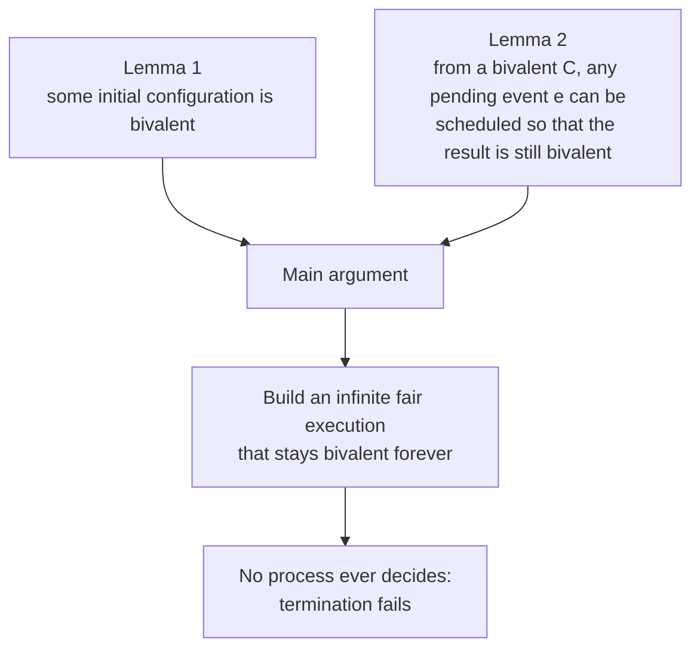
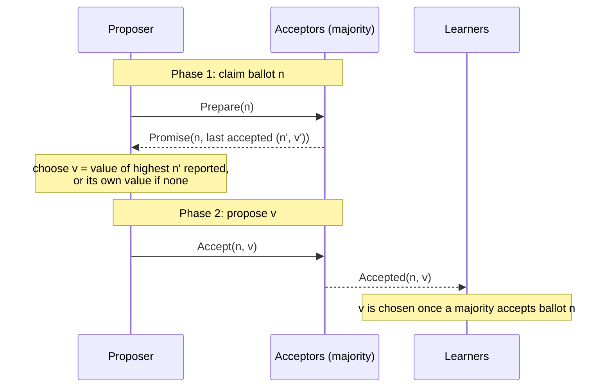
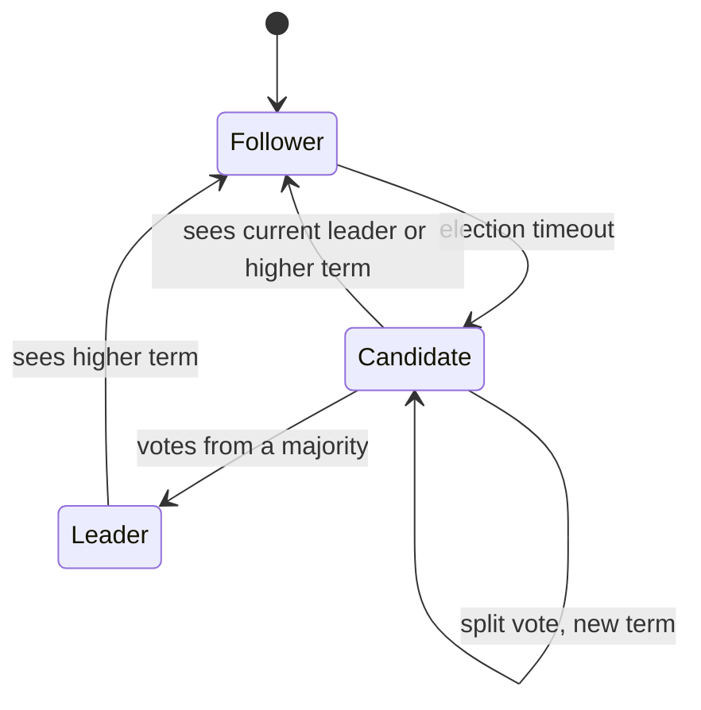
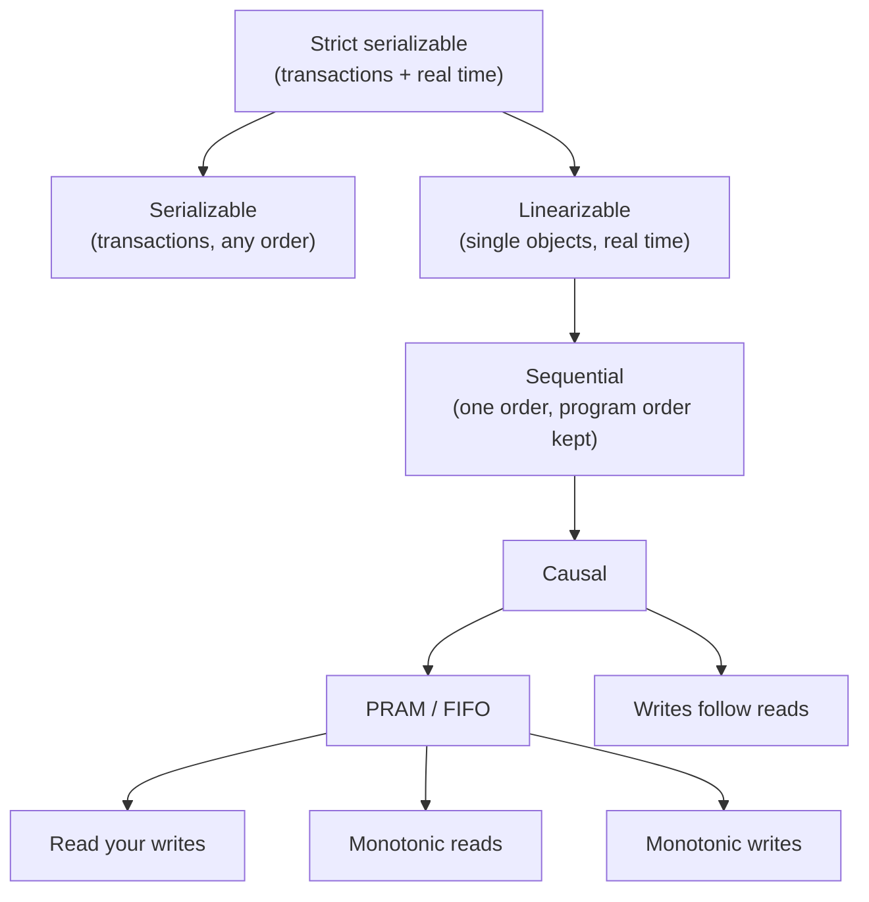
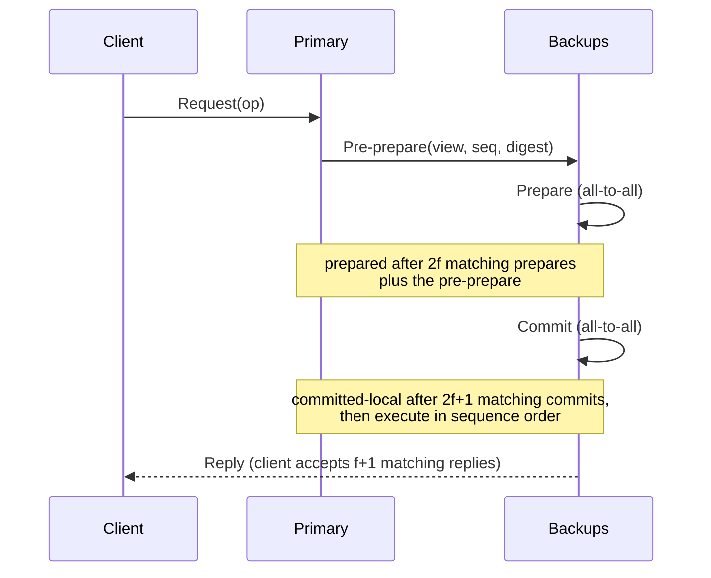
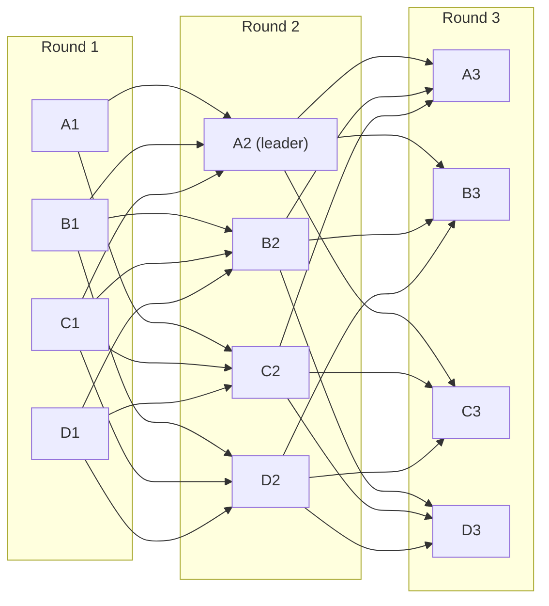

# Distributed Systems Theory

[Advanced Topics](../) &raquo; Distributed Systems Theory

<div class="advanced-note" markdown="1">
**Graduate-level research page.** The formal theory of distributed computing — models, impossibility proofs, consensus correctness, consistency semantics, and verification. **Prerequisites:** discrete mathematics, basic probability, and some familiarity with temporal logic and [complexity theory](../complexity-theory/). For practical patterns and working code, see the [Distributed Systems Hub](../../distributed-systems/) and in particular [Consensus and Coordination](../../distributed-systems/consensus-and-coordination.html).
</div>

Distributed systems theory studies what a set of processes can and cannot compute when they communicate by messages over an unreliable network, without a shared clock, while some of them fail. Its central results are **impossibility theorems** (FLP, CAP, Two Generals, the $3f+1$ bound) that say exactly which combinations of guarantees are unattainable, and **protocols** (Paxos, Raft, PBFT, HotStuff) that come as close as the theorems allow by relaxing one assumption. This page states the standard system models, proves or sketches the main impossibility results, develops crash- and Byzantine-tolerant consensus, defines the hierarchy of consistency models, covers logical time and failure detectors, and ends with how these protocols are verified and where research is heading.

Two ideas recur throughout. **Safety** properties say nothing bad ever happens and can be violated in a finite prefix of an execution; **liveness** properties say something good eventually happens and can only be violated by an infinite one (Alpern and Schneider, 1985). And **quorum intersection** — any two quorums share at least one correct process — is the mechanism behind nearly every safety proof.

## Contents

- [System models](#system-models)
- [Fundamental impossibility results](#fundamental-impossibility-results)
- [Crash-tolerant consensus](#crash-tolerant-consensus)
- [Consistency models](#consistency-models)
- [Byzantine fault tolerance](#byzantine-fault-tolerance)
- [Time, snapshots, and failure detectors](#time-snapshots-and-failure-detectors)
- [Formal verification](#formal-verification)
- [Complexity bounds](#complexity-bounds)
- [Research frontiers](#research-frontiers)
- [References](#references)

## System models

Every result in the field is relative to a model. Changing the timing or failure assumptions can turn an impossible problem into an easy one, so the first step in reading any theorem is to identify its model.

### Timing

| Model | Assumption | Consequence |
|---|---|---|
| **Synchronous** | Known upper bounds on message delay and processing time; computation proceeds in lock-step rounds | Timeouts detect crashes exactly; consensus is solvable for any number of crash faults |
| **Partially synchronous** (Dwork–Lynch–Stockmeyer, 1988) | Bounds exist but are unknown, or hold only after an unknown **global stabilization time** (GST) | Consensus is solvable; safety must hold always, liveness only after GST. This is the model of Paxos, Raft, and PBFT |
| **Asynchronous** | No bounds at all | Deterministic consensus is impossible with one crash (FLP); randomized consensus is possible |

### Failures

| Failure model | Faulty process may | Typical tolerance |
|---|---|---|
| Crash-stop | Halt and never recover | $n \ge 2f+1$ in partial synchrony |
| Crash-recovery | Halt and later restart from stable storage | $n \ge 2f+1$, with durable state |
| Omission | Fail to send or receive some messages | $n \ge 2f+1$ |
| Byzantine | Behave arbitrarily, including lying and equivocating | $n \ge 3f+1$ in partial synchrony |

Channels are usually assumed **reliable** (every message between correct processes is eventually delivered) or **fair-lossy** (a message sent infinitely often is delivered infinitely often), which retransmission reduces to reliable.

### The consensus problem

Each process proposes a value and must irreversibly decide one. A protocol solves consensus if it satisfies:

- **Agreement** (safety): no two correct processes decide different values.
- **Validity** (safety): a decided value was proposed by some process. Byzantine variants require that if all correct processes propose $v$, then $v$ is decided.
- **Termination** (liveness): every correct process eventually decides.

Consensus is equivalent to **atomic (total-order) broadcast** (Chandra and Toueg, 1996): each can be built from the other. Total-order broadcast is in turn what **state machine replication** needs — if deterministic replicas apply the same commands in the same order, they stay identical (Lamport, 1978; Schneider, 1990). That is why "consensus" in practice means agreeing on a replicated log.

## Fundamental impossibility results

### FLP impossibility theorem

<div class="postulate-card" markdown="1">
#### Theorem (Fischer–Lynch–Paterson, 1985)
In an asynchronous message-passing system, no deterministic protocol solves consensus if even one process may crash.
</div>

The intuition is that in an asynchronous system a crashed process is indistinguishable from a slow one, so an adversarial scheduler can always delay the one message that would force a decision.

A **configuration** $C$ is the local state of every process plus the multiset of messages in transit. An **event** $e = (p, m)$ is process $p$ receiving $m$ (or receiving nothing) and taking a step. $C$ is **0-valent** if every decision reachable from $C$ is 0, **1-valent** if every reachable decision is 1, and **bivalent** if both remain reachable.



**Lemma 1 (a bivalent initial configuration exists).** Suppose every initial configuration is univalent. Order the initial configurations so that neighbors differ in one process's input; by validity the all-0 configuration is 0-valent and the all-1 configuration is 1-valent, so some neighbors $C_0$ (0-valent) and $C_1$ (1-valent) differ only in the input of some process $p$. Consider an execution from $C_0$ in which $p$ crashes before taking any step. The other processes cannot distinguish it from the same execution started at $C_1$, so they decide the same value in both — contradicting the opposite valences.

**Lemma 2 (bivalence can be preserved).** Let $C$ be bivalent and $e = (p, m)$ an event applicable to $C$. Let $\mathcal{C}$ be the set of configurations reachable from $C$ without applying $e$, and $\mathcal{D} = \lbrace e(E) : E \in \mathcal{C} \rbrace$. Then $\mathcal{D}$ contains a bivalent configuration. The proof supposes $\mathcal{D}$ is all univalent, finds neighboring configurations whose successors in $\mathcal{D}$ have opposite valence, and shows by a commutativity case analysis on whether the two steps involve the same process that a crash of that process yields a contradiction.

**Main argument.** Start from a bivalent initial configuration. Repeatedly take the process at the head of a round-robin queue and its oldest pending message, and use Lemma 2 to deliver it while remaining bivalent. The resulting execution is fair (every correct process takes infinitely many steps and every message is eventually delivered) yet never decides.

**Ways around FLP.** Every practical protocol breaks one hypothesis:

| Relaxed assumption | Approach | Examples |
|---|---|---|
| Asynchrony | Partial synchrony: safe always, live after GST | Paxos, Raft, PBFT, HotStuff |
| Determinism | Randomization: terminate with probability 1 | Ben-Or (1983), Bracha (1987), common-coin protocols |
| No failure information | Unreliable failure detectors | Chandra–Toueg with $\diamond S$ |

### CAP theorem

<div class="principle-card" markdown="1">
#### Theorem (Brewer's conjecture, 2000; proved by Gilbert and Lynch, 2002)
In an asynchronous network that may lose arbitrarily many messages, no read/write register implementation guarantees both **consistency** (linearizability) and **availability** (every request received by a non-failed node eventually gets a response).
</div>

**Proof.** Partition the nodes into two non-empty groups $G_1$ and $G_2$ and drop every message between them. A client writes $v_1 \ne v_0$ to a node in $G_1$; by availability the write completes. Another client then reads from a node in $G_2$; by availability the read completes. No message from $G_1$ has reached $G_2$, so the execution is indistinguishable, to $G_2$, from one in which the write never happened, and the read returns $v_0$. The read starts after the write finished, so linearizability is violated. $\square$

The theorem is often summarized as "pick two of C, A, P", but partitions are not optional, so the real choice is what to do *during* a partition: refuse some requests (CP) or answer them with possibly stale data (AP). CAP also uses the strongest definitions of both properties; systems routinely offer weaker consistency or partial availability, and Brewer's own 2012 retrospective argues the trade-off should be managed per operation rather than chosen once.

**PACELC** (Abadi, 2012) adds the case CAP ignores: *if* partitioned, choose Availability or Consistency; *else*, choose Latency or Consistency. Even with a healthy network, synchronous replication for strong consistency costs a round trip that asynchronous replication does not.

### Two Generals problem

Two generals on opposite hills win only if both attack at the same time, and communicate by messengers who may be captured. General A sends "attack at dawn". A should attack only if it knows B received the message, so B must acknowledge; B then needs to know its acknowledgment arrived, and so on.

<div class="postulate-card" markdown="1">
#### Theorem (Akkoyunlu–Ekanadham–Huber, 1975; Gray, 1978)
Over a channel that may lose any message, no deterministic protocol guarantees that two processes both decide to act, or both decide not to, whenever each acts only after hearing from the other.
</div>

**Proof.** Suppose some protocol works, and take one that uses the fewest messages in its longest execution. Consider its last message. Whether it arrives cannot affect the sender's decision (the sender gets no further information), and the receiver's decision must match the sender's in both cases; so the protocol works without that message, contradicting minimality. The induction reaches zero messages, where agreement to attack is impossible. $\square$

Halpern and Moses (1990) recast this as the impossibility of attaining **common knowledge** over unreliable channels. In practice systems settle for probabilistic or eventual agreement: TCP's handshake establishes a connection with high probability, and atomic commit protocols block or time out rather than guarantee simultaneity.

### Lower bounds in the synchronous model

Even with perfect timing, faults cost time and messages:

- **Rounds.** Any deterministic consensus protocol tolerating $f$ crash faults needs $f+1$ rounds in the worst case (Fischer–Lynch, 1982; Dolev–Strong, 1983); FloodSet achieves it.
- **Messages.** Deterministic Byzantine agreement needs $\Omega(n^2)$ messages in the worst case when $f = \Theta(n)$ (Dolev–Reischuk, 1985).
- **Resilience.** Without signatures, Byzantine agreement needs $n \ge 3f+1$ even in synchronous systems (see [below](#byzantine-fault-tolerance)).

## Crash-tolerant consensus

### Quorums

A **quorum system** is a collection of subsets of processes, every two of which intersect. With majorities ($|Q| \ge \lfloor n/2 \rfloor + 1$), any two quorums share a process, so information recorded at one quorum is visible to the next. Tolerating $f$ crashes while still being able to form a quorum requires $n \ge 2f+1$.

### Paxos

Paxos (Lamport, 1998; "Paxos Made Simple", 2001) decides a single value using proposers, acceptors, and learners. Proposals carry unique, totally ordered **ballot numbers**.



| Phase | Rule |
|---|---|
| **1a Prepare** | Proposer picks ballot $n$ higher than any it has used and sends `Prepare(n)` to the acceptors. |
| **1b Promise** | If $n$ exceeds every ballot the acceptor has promised, it promises to ignore lower ballots and replies with the highest-numbered proposal $(n', v')$ it has accepted, if any. |
| **2a Accept** | With promises from a majority, the proposer sends `Accept(n, v)`, where $v$ is the value of the highest $n'$ among the replies, or any value if none was reported. |
| **2b Accepted** | An acceptor accepts $(n, v)$ unless it has promised a ballot higher than $n$, and notifies the learners. |

**Safety.** The key invariant is:

<div class="theory-card" markdown="1">
#### Invariant P2
If a proposal with value $v$ is chosen at ballot $n$, then every proposal issued with a ballot $m > n$ has value $v$.
</div>

Proof sketch: a proposer at ballot $m$ collected promises from a majority $Q_1$; $v$ was accepted by a majority $Q_2$ at ballot $n$; $Q_1 \cap Q_2$ contains an acceptor that accepted $(n, v)$ before promising $m$ (otherwise it would have rejected ballot $n$). By induction on the ballots between $n$ and $m$, the highest accepted proposal reported to the proposer carries $v$, so it must propose $v$.

Paxos is always safe but not always live: two proposers can pre-empt each other indefinitely ("duelling proposers"), as FLP predicts. Electing a distinguished proposer with timeouts restores liveness after GST.

**Variants.**

- **Multi-Paxos** runs one instance per log slot. A stable leader performs Phase 1 once for all future slots, so each command then costs only Phase 2: one round trip to a majority.
- **Flexible Paxos** (Howard, Malkhi, Spiegelman, 2016) shows majorities are not needed: only every Phase-1 quorum must intersect every Phase-2 quorum, i.e. $|Q_1| + |Q_2| > n$. Small replication quorums can be traded for large, rare leader-election quorums.
- **Fast Paxos** (Lamport, 2006) lets clients send directly to acceptors, saving a message delay when there is no conflict, at the cost of larger quorums.
- **EPaxos** (Moraru, Andersen, Kaminsky, 2013) is leaderless: any replica can commit non-conflicting commands in one round trip, ordering only commands that interfere.
- **Viewstamped Replication** (Oki–Liskov, 1988) and **Zab** (ZooKeeper) are closely related leader-based protocols developed independently.

### Raft

Raft (Ongaro and Ousterhout, 2014) provides the same guarantees as Multi-Paxos but is structured for understandability. Time is divided into numbered **terms**, each with at most one leader; the leader's log is authoritative and flows only from leader to followers.



- **Leader election.** A follower that hears nothing for a randomized election timeout increments its term and requests votes. A server votes at most once per term, and only for a candidate whose log is **at least as up to date** as its own (higher last term, or equal last term and at least as long).
- **Log replication.** The leader appends a command and sends `AppendEntries` carrying the index and term of the preceding entry; a follower rejects the call if its log does not contain that entry, and the leader backs up until the logs match. An entry is **committed** once stored on a majority.
- **Commit rule.** A leader counts replicas only for entries from its **current** term; earlier-term entries become committed indirectly when a later entry commits. Without this restriction a committed-looking entry can be overwritten (Figure 8 of the Raft paper).

Raft's safety argument rests on five properties:

| Property | Statement |
|---|---|
| Election safety | At most one leader per term. |
| Leader append-only | A leader never overwrites or deletes entries in its log. |
| Log matching | If two logs have an entry with the same index and term, the logs are identical up to that index. |
| Leader completeness | A committed entry is present in the logs of all leaders of later terms. |
| State machine safety | If a server has applied the entry at index $i$, no server ever applies a different entry at $i$. |

Leader completeness follows from quorum intersection: the entry is on a majority, the new leader's votes came from a majority, and the voter they share refused to vote for any less up-to-date log. Production implementations (etcd, Consul, CockroachDB, TiKV, Kafka's KRaft) add **pre-vote** and **check-quorum** to stop partitioned nodes from disrupting a healthy leader, plus joint-consensus or single-server membership changes.

### Virtual synchrony

Virtual synchrony (Birman and Joseph, 1987; Isis, later Spread and JGroups) builds replication on **group membership** instead of per-value consensus. The group agrees on a sequence of **views** (membership lists), and multicasts are delivered relative to views:

- **View agreement.** Every process that installs views installs the same views in the same order.
- **View synchrony.** Two processes that both install views $V$ and $V'$ consecutively deliver the same set of messages while in $V$.
- **Same-view delivery.** A message is delivered in the view in which it was sent.

From the application's point of view, membership changes happen at the same logical instant everywhere. Agreeing on each new view is itself a consensus problem, so virtual synchrony does not escape FLP; it relies on failure detection and on excluding suspected members.

## Consistency models

Consensus is a mechanism; a consistency model is the contract a replicated object offers to clients. Models are defined over **histories**: sets of operation invocations and responses, each tagged with a process and a real time. Stronger models admit fewer histories and need more coordination.



Arrows point from stronger to weaker. The single-object models (right branch) and transactional models (left) are distinct families; serializability says nothing about real time, and linearizability says nothing about multi-object transactions. The four session guarantees at the bottom (Terry et al., 1994) are per-client and cheap, and are covered in [Client-Side Consistency](../../distributed-systems/client-side-consistency.html).

| Model | Constrains real time? | Orders | Available under partition? |
|---|---|---|---|
| Linearizable | Yes | All operations | No |
| Sequential | No | All operations | No |
| Causal (causal+) | No | Causally related operations | Yes (sticky clients) |
| Eventual / strong eventual | No | Nothing, but replicas converge | Yes |

### Linearizability

Herlihy and Wing (1990). Each operation appears to take effect instantaneously at some **linearization point** between its invocation and response, and the resulting sequential order is legal for the object.

<div class="theory-card" markdown="1">
#### Definition (linearizability)
Write $$op_1 <_H op_2$$ if the response of $op_1$ precedes the invocation of $op_2$ in history $H$. $H$ is **linearizable** if it can be completed (by adding responses to some pending invocations and removing the rest) to a history $H'$ that is equivalent to a legal sequential history $S$ with

$$<_{H} \ \subseteq\ <_{S}.$$
</div>

<figure class="diagram" aria-label="Linearizability timeline">
<svg viewBox="0 0 640 190" width="100%" style="max-width:640px" role="img" xmlns="http://www.w3.org/2000/svg" font-family="inherit" font-size="13" fill="currentColor">
<title>Three processes: a write of x = 1 on P1, a concurrent read on P2 that may return 0 or 1, and a later read on P3 that must return 1</title>
<text x="10" y="44">P1</text><text x="10" y="99">P2</text><text x="10" y="154">P3</text>
<line x1="40" y1="40" x2="620" y2="40" stroke="currentColor" stroke-opacity="0.25"/>
<line x1="40" y1="95" x2="620" y2="95" stroke="currentColor" stroke-opacity="0.25"/>
<line x1="40" y1="150" x2="620" y2="150" stroke="currentColor" stroke-opacity="0.25"/>
<rect x="80" y="30" width="220" height="20" rx="4" fill="none" stroke="currentColor" stroke-width="1.5"/>
<text x="190" y="24" text-anchor="middle">write(x, 1)</text>
<circle cx="230" cy="40" r="5"/>
<rect x="180" y="85" width="180" height="20" rx="4" fill="none" stroke="currentColor" stroke-width="1.5"/>
<text x="270" y="79" text-anchor="middle">read(x): 0 or 1 allowed</text>
<rect x="390" y="140" width="190" height="20" rx="4" fill="none" stroke="currentColor" stroke-width="1.5"/>
<text x="485" y="134" text-anchor="middle">read(x): must return 1</text>
<line x1="300" y1="20" x2="300" y2="175" stroke="currentColor" stroke-dasharray="4 4" stroke-opacity="0.6"/>
<text x="304" y="184" font-size="11">write returns</text>
<text x="236" y="62" font-size="11">linearization point</text>
</svg>
</figure>

The read on P2 overlaps the write, so it may be ordered either before or after it. The read on P3 begins after the write has returned, so real-time order forces it after the write.

Two properties make linearizability the default correctness condition for concurrent objects:

- **Locality.** A history is linearizable if and only if its restriction to each object is linearizable, so linearizable objects compose. Sequential consistency does not compose.
- **Non-blocking.** A pending operation never has to wait for another to complete in order to preserve linearizability.

Its cost is coordination on every operation. Under a partition it is unavailable (CAP), and even without failures Attiya and Welch (1994) showed that linearizable reads and writes both have latency lower bounds that grow with message-delay uncertainty, whereas a sequentially consistent register can make either reads or writes purely local (though not both).

### Sequential consistency

Lamport (1979): the result of any execution is the same as if the operations of all processes were executed in some single sequential order, with each process's operations appearing in its program order. Formally, there is a legal sequential history $S$ equivalent to $H$ such that $$op_1 <_p op_2 \Rightarrow op_1 <_S op_2$$ for every process $p$ — the same as linearizability with per-process order in place of real-time order. An operation that finished long ago may therefore be ordered after one that started later on another process.

### Causal consistency

Causal consistency requires that operations related by Lamport's **happens-before** relation $\rightarrow$ (defined in [Time and clocks](#time-and-clocks)) be seen in that order by every process; concurrent writes may be seen in different orders at different replicas. It is the strongest model that remains available under partition (Mahajan, Alvisi, Dahlin, 2011, for a precise version of this claim). **Causal+** consistency (COPS, 2011) adds convergence: replicas that have seen the same writes resolve concurrent writes the same way.

### Eventual and strong eventual consistency

**Eventual consistency** says only that if updates stop, all replicas eventually return the same value. It is a pure liveness property: any value may be returned in the meantime.

**Strong eventual consistency** (Shapiro et al., 2011) adds a safety property: any two replicas that have received the same set of updates are in the same state, with no coordination or rollback. **Conflict-free replicated data types (CRDTs)** achieve it. In a state-based CRDT the states form a join-semilattice, every update is monotone (inflationary), and merge is the least upper bound, so merges are commutative, associative, and idempotent and can be applied in any order, any number of times. The grow-only counter is the simplest example: replica $i$ increments only its own slot of a vector $P$, and

$$\mathrm{value}(P) = \sum_{i} P[i], \qquad \mathrm{merge}(P, Q)[i] = \max\left(P[i], Q[i]\right).$$

Operation-based CRDTs instead require concurrent operations to commute and rely on causal delivery. CRDTs underpin collaborative editors (Automerge, Yjs) and multi-region databases (Riak, Redis Enterprise active-active).

### Transactional models

For multi-object transactions the analogous ladder runs from **strict serializability** (serializable, and consistent with real time — what Spanner and FoundationDB provide) through **serializability**, **snapshot isolation** (which permits write skew), and down to read committed. Adya's formalism (1999) defines these in terms of forbidden cycles in a dependency graph, which is also how tools such as Jepsen's Elle check real databases.

## Byzantine fault tolerance

A **Byzantine** process may deviate arbitrarily from the protocol: send conflicting messages to different peers (equivocation), forge unsigned messages, or collude. This models bugs, compromised nodes, and mutually distrusting parties.

### Byzantine Generals and the 3f+1 bound

<div class="postulate-card" markdown="1">
#### Theorem (Pease–Shostak–Lamport, 1980; Lamport–Shostak–Pease, 1982)
With oral (unsigned) messages, Byzantine agreement among $n$ processes tolerating $f$ Byzantine faults is possible if and only if $n \ge 3f+1$, even in a synchronous system.
</div>

**Proof sketch for $n = 3$, $f = 1$.** Suppose a protocol exists for processes A, B, C. Build a hexagon of six processes — two copies of each — wired so that every process sees neighbors of the right names, with inputs 0 on one side and 1 on the other. Each adjacent pair in the hexagon sees exactly what it would see in some legitimate three-process execution in which the third process is Byzantine and simulates the rest of the ring. Validity forces one pair to decide 0 and another to decide 1, and agreement forces adjacent pairs to agree — a contradiction. A simulation argument extends this to any $n \le 3f$ (Fischer, Lynch, Merritt, 1986).

**Why quorums of $2f+1$.** With $n = 3f+1$, a process can wait for only $n - f = 2f+1$ replies (the other $f$ may be silent). Two such quorums intersect in at least

$$2(2f+1) - (3f+1) = f+1$$

processes, at least one of which is correct. That correct process never votes for two conflicting values, so two conflicting decisions cannot both gather a quorum.

The bound depends on the model:

| Model | Crash faults | Byzantine, no signatures | Byzantine, with signatures |
|---|---|---|---|
| Synchronous | Any $f < n$; $f+1$ rounds | $n \ge 3f+1$ | Broadcast: any $f$ (Dolev–Strong); agreement: $n \ge 2f+1$ |
| Partially synchronous | $n \ge 2f+1$ | $n \ge 3f+1$ | $n \ge 3f+1$ (DLS, 1988) |
| Asynchronous, deterministic | Impossible (FLP) | Impossible | Impossible |
| Asynchronous, randomized | $n \ge 2f+1$ (Ben-Or) | $n \ge 3f+1$ (Bracha) | $n \ge 3f+1$ |

### PBFT

Practical Byzantine Fault Tolerance (Castro and Liskov, 1999) was the first BFT state machine replication protocol efficient enough for real services. It runs in **views**, each with a designated primary, and uses $n = 3f+1$ replicas.



- **Pre-prepare** binds a sequence number to a request within the view.
- **Prepare** ensures that correct replicas agree on the request for that sequence number *within* the view, which defeats an equivocating primary.
- **Commit** ensures the order survives a **view change**: a request committed at one correct replica is prepared at $f+1$ correct replicas, and the new primary must carry forward any request prepared in a quorum of view-change messages.
- The client waits for $f+1$ matching replies, since at least one comes from a correct replica.

Safety (no two correct replicas commit different requests at the same sequence number) holds in asynchrony. Liveness requires that message delays eventually stop growing faster than the view-change timeouts, which PBFT doubles on each unsuccessful view change. Normal-case communication is $O(n^2)$ messages per request; a view change costs $O(n^3)$ in message size.

### Linear and pipelined BFT: HotStuff and successors

The quadratic all-to-all phases limit PBFT to tens of replicas. **HotStuff** (Yin, Malkhi, Reiter, Gueta, Abraham, 2019) routes every vote through the leader and aggregates $2f+1$ votes into a single **quorum certificate** using threshold signatures, making both the normal case and view changes linear in $n$. It adds a third phase to achieve this, but **chains** the phases so that each new block's certificate also advances the previous blocks, committing one block per round in steady state. HotStuff underpinned Diem (formerly Libra) and its descendants.

**HotStuff-2** (Malkhi and Nayak, 2023) showed that two phases suffice while keeping linear communication in the optimistic case and optimistic responsiveness (progress at actual network speed rather than timeout speed). **Tendermint** (used by CometBFT and the Cosmos ecosystem) is a two-phase protocol that uses gossip and waits for a fixed timeout on view change instead.

### DAG-based BFT

A newer family separates **data dissemination** from **ordering**. Every validator continuously broadcasts blocks that reference blocks from the previous round, forming a directed acyclic graph; ordering is then derived from the DAG's structure, often with no extra messages.



Example with $n = 4$, $f = 1$ (edges point from a block to the later blocks that reference it). Each block references at least $2f+1 = 3$ blocks of the previous round. Leader block A2 is referenced by three round-3 blocks — a quorum — so it is committed, and its causal history (the round-1 blocks it references) is then ordered deterministically.

- **Narwhal and Tusk / Bullshark** (Danezis et al., 2022; Spiegelman et al., 2022) use a *certified* DAG — each block collects $2f+1$ signatures before it can be referenced — and order it with a randomized (Tusk) or partially synchronous (Bullshark) commit rule.
- **Mysticeti** (Babel et al., NDSS 2025) drops per-block certification and commits directly from the uncertified DAG, reaching the three-message-delay lower bound in the steady state. On the Sui mainnet it cut consensus latency from about 1.9 s under Bullshark to about 0.4 s.

### Accountability

Because a slow replica cannot be distinguished from a Byzantine one in asynchrony, BFT systems cannot reliably *detect* all faults. They can, however, make some faults **provable**. PeerReview (Haeberlen, Kouznetsov, Druschel, 2007) has each node keep a tamper-evident log in which entry $i$ carries the hash chain value

$$h_i = H\left(h_{i-1} \,\|\, s_i \,\|\, t_i \,\|\, H(c_i)\right),$$

where $s_i$ is a sequence number, $t_i$ the entry type, and $c_i$ its content, and signs authenticators over $h_i$ for its peers. Witnesses replay the log against a reference implementation, so any deviation produces verifiable evidence. Proof-of-stake chains use the same idea to **slash** validators whose signed votes equivocate.

## Time, snapshots, and failure detectors

### Time and clocks

Without a shared clock, the meaningful question is not *when* an event happened but whether it *could have influenced* another. Lamport (1978) defined **happens-before** as the smallest relation such that:

1. if $a$ and $b$ are events on the same process and $a$ occurs first, then $a \rightarrow b$;
2. if $a$ is the sending of a message and $b$ its receipt, then $a \rightarrow b$;
3. if $a \rightarrow c$ and $c \rightarrow b$, then $a \rightarrow b$.

Events with neither $a \rightarrow b$ nor $b \rightarrow a$ are **concurrent**, written $a \parallel b$.

**Lamport clocks.** Each process keeps a counter $C_p$. It increments $C_p$ before each local event and each send, attaches $C_p$ to every message, and on receiving a message with timestamp $t$ sets $C_p \leftarrow \max(C_p, t) + 1$. This guarantees $a \rightarrow b \Rightarrow C(a) < C(b)$, but not the converse. Breaking ties by process identifier gives a total order consistent with causality, which is enough for mutual exclusion and total-order broadcast.

**Vector clocks** (Fidge, 1988; Mattern, 1989). Each process keeps a vector $V_p$ of $n$ counters. Before each local event or send, $p$ increments $V_p[p]$; messages carry the vector; on receipt of $V_m$, process $q$ sets $V_q[i] \leftarrow \max(V_q[i], V_m[i])$ for every $i$ and then increments $V_q[q]$. Comparing vectors pointwise characterizes causality exactly:

$$a \rightarrow b \iff V(a) < V(b), \qquad V(a) < V(b) \iff \forall i\ V(a)[i] \le V(b)[i] \ \wedge\ \exists j\ V(a)[j] < V(b)[j].$$

The cost is $O(n)$ metadata per message, and Charron-Bost (1991) showed no smaller vector can characterize causality in general. Version vectors and dotted version vectors apply the same idea per replica rather than per process, for tracking concurrent updates in stores such as Riak.

**Physical time in practice.**

| Mechanism | Idea | Used by |
|---|---|---|
| Hybrid logical clocks (Kulkarni et al., 2014) | A 64-bit timestamp that stays close to NTP time but also satisfies the Lamport clock condition | CockroachDB, YugabyteDB, MongoDB |
| TrueTime (Spanner, 2012) | GPS- and atomic-clock-backed API returning an interval $[t - \epsilon, t + \epsilon]$ | Spanner: waits out $\epsilon$ before commit to obtain strict serializability |
| Synchronized clocks with bounded skew | PTP or cloud time services with microsecond-level error bounds | Leases and read optimizations in several cloud databases |

Protocols that rely on physical time for **safety** (e.g. leader leases) must assume a bound on clock drift; if the bound is violated, correctness can fail silently.

### Distributed snapshots

A **consistent cut** is a set of events closed under happens-before: if the receipt of a message is in the cut, so is its sending. A global state recorded at a consistent cut is one the system could have passed through, even if it never existed at any single real-time instant. Messages sent before the cut but received after it make up the **channel state**.

The **Chandy–Lamport algorithm** (1985) records such a state over FIFO channels without pausing the system:

1. The initiator records its local state and sends a **marker** on every outgoing channel.
2. When a process receives its first marker (on channel $c$), it records its state, records $c$'s state as empty, and sends markers on all outgoing channels.
3. For each other incoming channel, it records every message received after recording its state and before that channel's marker arrives; those messages are that channel's state.

Snapshots are used for checkpointing (Apache Flink's asynchronous barrier snapshotting is a variant), deadlock detection, and evaluating **stable predicates** such as termination, which remain true once true.

### Failure detectors

Chandra and Toueg (1996) modeled the missing timing information in an asynchronous system as a **failure detector**: a local module that outputs a set of suspected processes and may be wrong. Detectors are classified by two properties:

- **Completeness:** every crashed process is eventually suspected — by every correct process (*strong*) or by some correct process (*weak*).
- **Accuracy:** no correct process is ever suspected (*strong*); some correct process is never suspected (*weak*); or either holds only after some unknown time (*eventual*).

| Detector | Completeness | Accuracy | Notes |
|---|---|---|---|
| $P$ (perfect) | Strong | Strong | Implementable only with synchrony |
| $S$ (strong) | Strong | Weak | Consensus for any number of crashes |
| $\diamond P$ (eventually perfect) | Strong | Eventual strong | Implementable in partial synchrony with adaptive timeouts |
| $\diamond S$ (eventually strong) | Strong | Eventual weak | Consensus with a correct majority |
| $\Omega$ (eventual leader) | — | Eventually all correct processes trust the same correct leader | Equivalent to $\diamond W$ / $\diamond S$ |

<div class="postulate-card" markdown="1">
#### Theorem (Chandra–Hadzilacos–Toueg, 1996)
$\diamond W$ — equivalently $\Omega$ — is the **weakest** failure detector for solving consensus in an asynchronous system with a majority of correct processes ($n \ge 2f+1$).
</div>

$\diamond P$ is strictly stronger than necessary; $\Omega$ is exactly the abstraction a Paxos or Raft leader election provides. In practice failure detectors are built from heartbeats with adaptive timeouts, the **$\phi$-accrual** detector (Hayashibara et al., 2004, used by Cassandra and Akka), or gossip-based protocols such as **SWIM** (Das, Gupta, Motivala, 2002), whose per-member load and expected detection time do not grow with group size. See [Failure Detection](../../distributed-systems/failure-detection.html) for implementations.

### Shared memory and the consensus hierarchy

Consensus also classifies synchronization primitives. The **consensus number** of an object type is the largest $n$ for which it, together with read/write registers, solves wait-free consensus among $n$ processes (Herlihy, 1991).

| Consensus number | Objects |
|---|---|
| 1 | Read/write registers |
| 2 | Test-and-set, swap, fetch-and-add, queues, stacks |
| $2m - 2$ | Atomic assignment to $m$ registers |
| $\infty$ | Compare-and-swap, load-linked/store-conditional |

Objects with lower consensus number cannot implement objects with higher ones wait-free. This is why modern processors provide compare-and-swap, and it is the shared-memory counterpart of FLP (Loui and Abu-Amara, 1987).

## Formal verification

Distributed protocols fail in rare interleavings that tests seldom reach. Formal methods either exhaustively explore a model of the protocol or prove it correct for all executions.

### Temporal logic

Linear temporal logic (Pnueli, 1977) states properties of entire executions. $\Box P$ means $P$ holds in every state from now on; $\Diamond P$ means $P$ holds in some future state.

| Property | Form | Example |
|---|---|---|
| Safety (invariant) | $\Box\, \mathit{Inv}$ | $$\Box\, (\text{decided}_p \wedge \text{decided}_q \Rightarrow v_p = v_q)$$ |
| Liveness (response) | $\Box\, (\mathit{trigger} \Rightarrow \Diamond\, \mathit{response})$ | Every request eventually receives a reply |
| Weak fairness | $\Diamond\Box\, \mathrm{enabled}(a) \Rightarrow \Box\Diamond\, \mathrm{taken}(a)$ | An action enabled continuously is eventually taken |
| Strong fairness | $\Box\Diamond\, \mathrm{enabled}(a) \Rightarrow \Box\Diamond\, \mathrm{taken}(a)$ | An action enabled infinitely often is eventually taken |

Fairness assumptions are what rule out trivial counterexamples to liveness, such as a scheduler that never lets a process run.

### TLA+

In TLA+ (Lamport, 1994) a system is a formula $$\mathit{Init} \wedge \Box[\mathit{Next}]_{\mathit{vars}}$$: a predicate on initial states plus a relation on consecutive states, where primed variables denote next-state values and the subscript allows stuttering steps. The following is Lamport's specification of the transaction-commit problem, which two-phase commit and Paxos Commit both implement:

```tla
------------------------------ MODULE TCommit ------------------------------
CONSTANT RM                  \* the set of resource managers
VARIABLE rmState             \* rmState[r] is the state of resource manager r

TCTypeOK == rmState \in [RM -> {"working", "prepared", "committed", "aborted"}]

TCInit == rmState = [r \in RM |-> "working"]

canCommit    == \A r \in RM : rmState[r] \in {"prepared", "committed"}
notCommitted == \A r \in RM : rmState[r] # "committed"

Prepare(r) == /\ rmState[r] = "working"
              /\ rmState' = [rmState EXCEPT ![r] = "prepared"]

Decide(r) == \/ /\ rmState[r] = "prepared"
                /\ canCommit
                /\ rmState' = [rmState EXCEPT ![r] = "committed"]
             \/ /\ rmState[r] \in {"working", "prepared"}
                /\ notCommitted
                /\ rmState' = [rmState EXCEPT ![r] = "aborted"]

TCNext == \E r \in RM : Prepare(r) \/ Decide(r)

TCConsistent == \A r1, r2 \in RM : ~ /\ rmState[r1] = "aborted"
                                     /\ rmState[r2] = "committed"

TCSpec == TCInit /\ [][TCNext]_rmState

THEOREM TCSpec => [](TCTypeOK /\ TCConsistent)
=============================================================================
```

A lower-level specification (for example, two-phase commit with a coordinator and a message set) is shown correct by proving it **refines** `TCSpec` under a mapping of its variables. Two tools check such specifications: **TLC**, an explicit-state model checker, and **Apalache**, a symbolic checker that encodes bounded executions as SMT problems. The **TLAPS** proof system checks machine-verified proofs for unbounded instances. Stewardship of TLA+ moved to the TLA+ Foundation under the Linux Foundation in 2023.

### Model checking

An explicit-state model checker performs a graph search over reachable states, checking invariants at each state and liveness properties over cycles:

```python
def check(init_states, next_states, invariant):
    seen = set(init_states)
    frontier = list(init_states)
    parent = {s: None for s in init_states}
    while frontier:
        s = frontier.pop(0)                      # breadth-first: shortest counterexample
        if not invariant(s):
            return trace(parent, s)              # path from an initial state to s
        for t in next_states(s):
            if t not in seen:
                seen.add(t)
                parent[t] = s
                frontier.append(t)
    return None                                  # invariant holds in every reachable state
```

The number of states grows exponentially with the number of processes and messages (**state explosion**). Standard mitigations are symmetry reduction, partial-order reduction (exploring only one order of independent steps), and bounding the model to small instances, on the empirical grounds that most protocol bugs appear with two or three processes.

### Verification in practice

| Approach | What it gives | Examples |
|---|---|---|
| Specification and model checking | Exhaustive checking of a design on small instances | TLA+ at AWS (Newcombe et al., 2015), Azure Cosmos DB, MongoDB; the P language at AWS for S3's strong-consistency launch |
| Machine-checked proofs of implementations | Proof that running code refines its spec | IronFleet (Dafny), Verdi (Coq), Verus (Rust) |
| Deterministic simulation testing | The whole system runs in one thread on simulated time, network, and disk; any failing seed replays exactly | FoundationDB, TigerBeetle, Antithesis |
| Black-box consistency checking | Record real client histories under injected faults and search for anomalies | Jepsen with the Knossos and Elle checkers |

These approaches are complementary: a verified design can still be implemented incorrectly, and a well-tested implementation can still embody a flawed design. See [Testing Distributed Systems](../../distributed-systems/testing-distributed-systems.html) for the practical side.

## Complexity bounds

Protocols are compared by **resilience** (faults tolerated), **latency** (message delays to commit in the good case), and **communication** (messages or bits per decision).

| Protocol | Fault model | Replicas | Good-case latency | Messages per decision (normal case) | Leader change |
|---|---|---|---|---|---|
| Multi-Paxos / Raft | Crash | $2f+1$ | 2 delays from leader (1 round trip) | $O(n)$ | $O(n)$ |
| EPaxos | Crash | $2f+1$ | 2 delays from any replica, if no conflict | $O(n)$ | — |
| PBFT | Byzantine | $3f+1$ | 3 delays (pre-prepare, prepare, commit) | $O(n^2)$ | $O(n^3)$ bits |
| HotStuff | Byzantine | $3f+1$ | 3 phases (pipelined) | $O(n)$ with threshold signatures | $O(n)$ |
| HotStuff-2 | Byzantine | $3f+1$ | 2 phases | $O(n)$ optimistic | $O(n^2)$ worst case |
| Mysticeti | Byzantine | $3f+1$ | 3 delays (steady state) | $O(n^2)$ per round, amortized over many transactions | — |

Known lower bounds for reference: $f+1$ rounds for synchronous crash consensus; $\Omega(n^2)$ messages for deterministic Byzantine agreement (Dolev–Reischuk); and two message delays for crash-tolerant consensus in the good case, which Multi-Paxos and Raft meet.

## Research frontiers

### Longest-chain consensus

Nakamoto consensus (Bitcoin, 2008) achieves agreement among an unknown, changing set of participants by making block production costly (proof of work) and following the heaviest chain. Safety is probabilistic. If the attacker controls a fraction $q$ of the hash power and honest miners $p = 1 - q > q$, the probability that an attacker ever catches up from $z$ blocks behind is the gambler's-ruin probability

$$P_z = \left(\frac{q}{p}\right)^{z},$$

and Nakamoto's whitepaper refines this to account for the attacker's progress while the $z$ confirmations are mined. Garay, Kiayias, and Leonardos (2015) formalized the protocol's security as **common prefix**, **chain quality**, and **chain growth**, and Pass, Seeman, and shelat (2017) showed it requires a bound on network delay — it is not secure in full asynchrony. Honest majority is also not incentive-compatible: **selfish mining** (Eyal and Sirer, 2014) is profitable with well under half of the hash power.

Proof-of-stake systems replace mining with stake-weighted voting and combine a longest-chain rule for liveness with a BFT-style finality gadget. Ethereum's Gasper (Casper FFG with LMD-GHOST) finalizes blocks after two epochs, roughly 13–15 minutes, and research into three-slot and single-slot finality aims to reduce this to seconds.

### Quantum distributed computing

Quantum resources change some bounds without eliminating the classical ones. Ben-Or and Hassidim (2005) gave a quantum Byzantine agreement protocol that terminates in $O(1)$ expected rounds against a full-information adaptive adversary, tolerating $f < n/3$ in the synchronous model and $f < n/4$ in the asynchronous model; classical protocols need $\Omega(\sqrt{n / \log n})$ rounds against such an adversary. Fitzi, Gisin, and Maurer (2001) used pre-shared entangled states to achieve *detectable* broadcast among three parties with one fault, sidestepping the $3f+1$ bound for that weaker problem — the classical analogue requires a trusted setup such as pre-distributed correlated randomness or signatures.

### Open directions

- **Latency limits in BFT.** DAG protocols have reached the three-delay steady-state bound; open questions include tail latency under faults, leader reputation, and bandwidth-optimal dissemination.
- **Consensus at scale.** Committee sampling, sharding, and asynchronous BFT with low communication (e.g. $O(n^2)$ asynchronous agreement with threshold cryptography) aim to support thousands of validators.
- **Geo-distributed consistency.** Reducing cross-region round trips for strictly serializable transactions through deterministic databases (Calvin), clock-bounded protocols, and leaderless designs.
- **Verification of real implementations.** Scaling proof-based verification and deterministic simulation from single protocols to whole storage and database systems.

## References

1. Lynch, N. (1996). *Distributed Algorithms*. Morgan Kaufmann.
2. Attiya, H., & Welch, J. (2004). *Distributed Computing: Fundamentals, Simulations, and Advanced Topics*, 2nd ed. Wiley.
3. Cachin, C., Guerraoui, R., & Rodrigues, L. (2011). *Introduction to Reliable and Secure Distributed Programming*, 2nd ed. Springer.
4. Lamport, L. (1978). "Time, Clocks, and the Ordering of Events in a Distributed System." *CACM* 21(7).
5. Fischer, M., Lynch, N., & Paterson, M. (1985). "Impossibility of Distributed Consensus with One Faulty Process." *JACM* 32(2).
6. Lamport, L., Shostak, R., & Pease, M. (1982). "The Byzantine Generals Problem." *ACM TOPLAS* 4(3).
7. Dwork, C., Lynch, N., & Stockmeyer, L. (1988). "Consensus in the Presence of Partial Synchrony." *JACM* 35(2).
8. Chandra, T., & Toueg, S. (1996). "Unreliable Failure Detectors for Reliable Distributed Systems." *JACM* 43(2).
9. Chandra, T., Hadzilacos, V., & Toueg, S. (1996). "The Weakest Failure Detector for Solving Consensus." *JACM* 43(4).
10. Herlihy, M., & Wing, J. (1990). "Linearizability: A Correctness Condition for Concurrent Objects." *ACM TOPLAS* 12(3).
11. Herlihy, M. (1991). "Wait-Free Synchronization." *ACM TOPLAS* 13(1).
12. Lamport, L. (1998). "The Part-Time Parliament." *ACM TOCS* 16(2).
13. Ongaro, D., & Ousterhout, J. (2014). "In Search of an Understandable Consensus Algorithm." *USENIX ATC*.
14. Castro, M., & Liskov, B. (1999). "Practical Byzantine Fault Tolerance." *OSDI*.
15. Gilbert, S., & Lynch, N. (2002). "Brewer's Conjecture and the Feasibility of Consistent, Available, Partition-Tolerant Web Services." *SIGACT News* 33(2).
16. Shapiro, M., Preguiça, N., Baquero, C., & Zawirski, M. (2011). "Conflict-Free Replicated Data Types." *SSS*.
17. Howard, H., Malkhi, D., & Spiegelman, A. (2016). "Flexible Paxos: Quorum Intersection Revisited." *OPODIS*.
18. Yin, M., Malkhi, D., Reiter, M., Gueta, G., & Abraham, I. (2019). "HotStuff: BFT Consensus with Linearity and Responsiveness." *PODC*.
19. Malkhi, D., & Nayak, K. (2023). "HotStuff-2: Optimal Two-Phase Responsive BFT." IACR ePrint 2023/397.
20. Babel, K., et al. (2025). "Mysticeti: Reaching the Latency Limits with Uncertified DAGs." *NDSS*.
21. Newcombe, C., et al. (2015). "How Amazon Web Services Uses Formal Methods." *CACM* 58(4).
22. Ben-Or, M., & Hassidim, A. (2005). "Fast Quantum Byzantine Agreement." *STOC*.

## See also

<div class="see-also-card" markdown="1">
**Distributed systems in practice**
- [Distributed Systems Hub](../../distributed-systems/) — Practical guide to building distributed systems
- [Consensus and Coordination](../../distributed-systems/consensus-and-coordination.html) — Paxos, Raft, and BFT from an engineering perspective
- [Replication Strategies](../../distributed-systems/replication-strategies.html) — Leader-based, multi-leader, and leaderless replication
- [Testing Distributed Systems](../../distributed-systems/testing-distributed-systems.html) — Chaos engineering, deterministic simulation, and Jepsen-style testing
- [Kubernetes](../../technology/kubernetes/) — etcd and Raft underneath container orchestration

**Related advanced topics**
- [Computational Complexity Theory](../complexity-theory/) — The asymptotic notation and lower-bound techniques behind round and message complexity
- [Cryptography](../cryptography/) — Signatures, threshold cryptography, and hash chains used by Byzantine protocols
- [Quantum Algorithms Research](../quantum-algorithms-research/) — Background for quantum Byzantine agreement
- [Performance Optimization](../../optimization/) — Latency and throughput engineering
</div>
