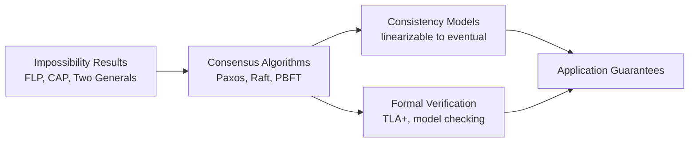
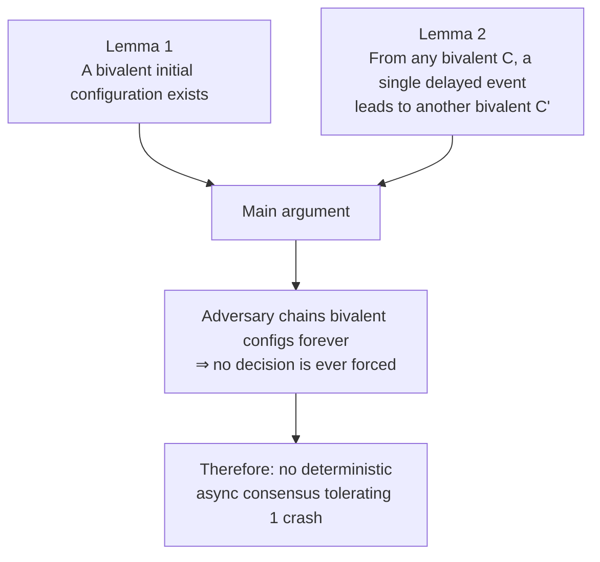
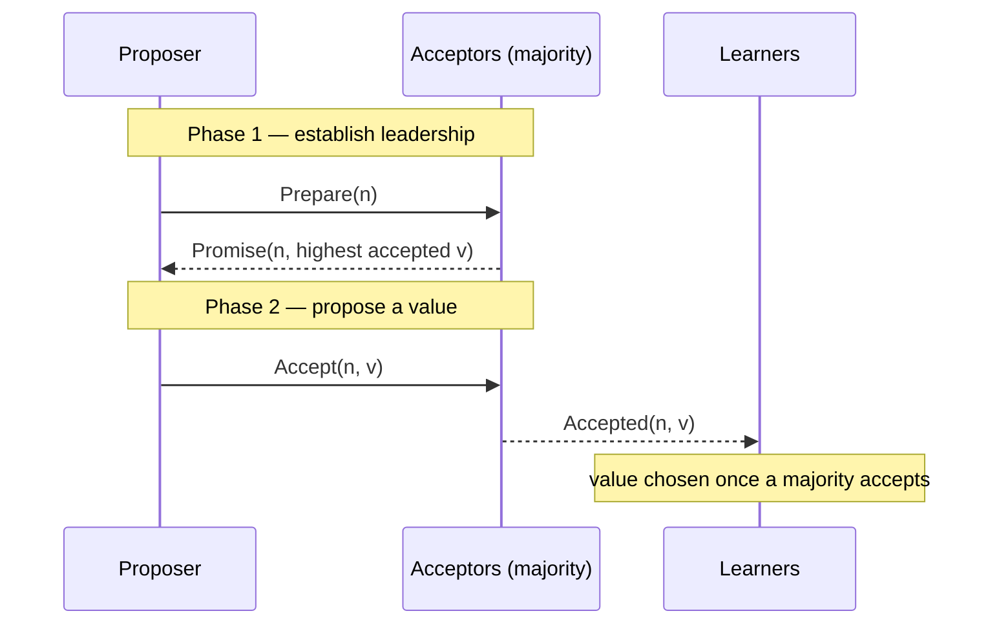
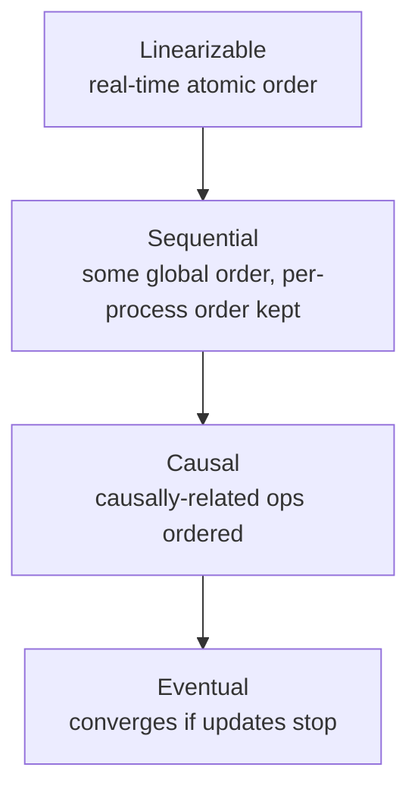
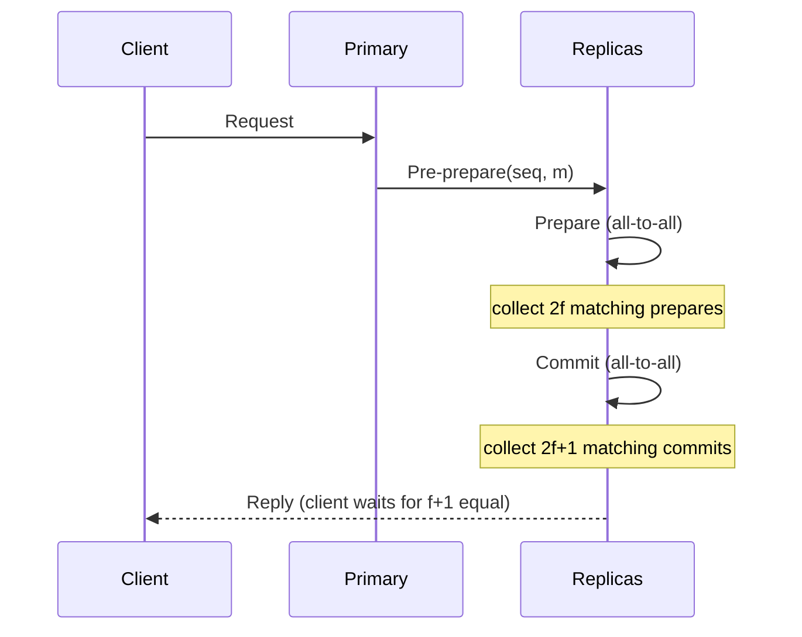

# Distributed Systems Theory

[Advanced Topics](./) &raquo; Distributed Systems Theory

<div class="advanced-note" markdown="1">
**Graduate-level research page.** This page develops the formal theory — impossibility proofs, consensus correctness, and verification — for distributed systems researchers and formal-methods practitioners. **Prerequisites:** formal methods, temporal logic, graph theory, probability theory, and complexity theory. The message- and round-complexity bounds throughout draw on [Computational Complexity Theory](../complexity-theory/); for practical patterns and working code instead, see the [Distributed Systems Hub](../../distributed-systems/).
</div>

Distributed systems theory is, at its core, the study of what is *impossible* and how to get arbitrarily close to it anyway. A single computer has a global clock, shared memory, and fail-stop behavior; the moment you split computation across machines connected by an unreliable network, every one of those guarantees evaporates. This page develops the formal machinery — impossibility results, consensus protocols, consistency models, and verification techniques — that explains why distributed coordination is hard and what design space remains.

- **Impossibility shapes design.** FLP and CAP do not say "give up" — they tell you exactly which guarantee you must relax (synchrony, determinism, or availability) to make progress.
- **No global time.** Without a shared clock, "order" is defined by causality (happens-before), captured by logical and vector clocks rather than wall-clock timestamps.
- **Agreement needs a quorum.** Crash-fault consensus needs a majority (n &ge; 2f+1); Byzantine consensus needs a supermajority (n &ge; 3f+1). The bound is not tunable — it is provable.
- **Safety vs liveness.** Protocols are designed so that nothing bad ever happens (safety) even when progress (liveness) must wait for the network to behave.

### How to Read This Page

The eight sections below are not independent topics to dip into at random — they tell one continuous story, and each one answers a question raised by the one before it. If you are coming to this material without a deep distributed-systems background, read them in order; each section's opening **"Intuition"** paragraph states the core idea in plain language before any formalism appears, so you can build a mental model first and reach for the proofs second.

The narrative arc is:

1. **[Fundamental Impossibility Results](#fundamental-impossibility-results)** — *What is provably impossible?* We start at the boundary. FLP, CAP, and the Two Generals problem each show that some combination of guarantees simply cannot coexist in an unreliable network. Everything afterward is a strategy for living just inside that boundary.
2. **[Consensus Algorithms](#consensus-algorithms)** — *How do real systems get useful work done despite those limits?* Paxos, Raft, and virtual synchrony each escape the impossibility results by *relaxing one assumption* (adding partial synchrony, timeouts, or a failure detector). Read this section as "the impossibility results told us what to give up; here is what we do with the room that leaves."
3. **[Consistency Models](#consistency-models)** — *What does the agreement the algorithms produce actually look like to an application?* Consensus is the mechanism; consistency is the contract. This section orders the guarantees from strongest (linearizable) to weakest (eventual) and explains the latency you pay for each.
4. **[Byzantine Fault Tolerance](#byzantine-fault-tolerance)** — *What changes when nodes can lie, not just crash?* Everything above assumes crash failures. Byzantine faults are strictly harder, which is why the quorum sizes grow (from a simple majority to a two-thirds supermajority).
5. **[Distributed Computing Theory](#distributed-computing-theory)** — *Without a global clock, how do we even define "before"?* Logical and vector clocks, distributed snapshots, and failure detectors are the supporting toolkit every algorithm above quietly relies on.
6. **[Formal Verification](#formal-verification)** — *How do we know an implementation is actually correct?* TLA+, model checking, and temporal logic let us exhaustively check the safety and liveness properties the earlier sections defined, rather than hoping tests catch the rare races.
7. **[Performance Analysis](#performance-analysis)** and **[Research Frontiers](#research-frontiers)** — *What does all this cost, and where is the field going?* Latency, message complexity, and open problems (blockchain, quantum, learned systems).

Two threads run through every section and are worth holding in mind: the distinction between **safety** ("nothing bad ever happens") and **liveness** ("something good eventually happens"), and the fact that **quorum overlap** is the recurring trick that makes agreement safe. The resource bounds (rounds and messages) are complexity-theoretic statements — if the asymptotic notation here is unfamiliar, the [Computational Complexity Theory](../complexity-theory/) page develops it from first principles. For runnable implementations of these algorithms, pair this page with the [Distributed Systems Hub](../../distributed-systems/).



## Table of Contents
- [Fundamental Impossibility Results](#fundamental-impossibility-results)
- [Consensus Algorithms](#consensus-algorithms)
- [Consistency Models](#consistency-models)
- [Byzantine Fault Tolerance](#byzantine-fault-tolerance)
- [Distributed Computing Theory](#distributed-computing-theory)
- [Formal Verification](#formal-verification)

## Fundamental Impossibility Results

### FLP Impossibility Theorem

<div class="postulate-card" markdown="1">
#### Theorem (Fischer–Lynch–Paterson, 1985)
No deterministic protocol can solve consensus in an **asynchronous** system if even **one** process may crash.
</div>

**Intuition first**: In an asynchronous network you cannot distinguish a *crashed* process from a *slow* one — there is no timeout you can trust. So whenever the protocol is on the verge of deciding, an adversarial scheduler can delay exactly the one message that would tip the decision, keeping the system perpetually undecided. The theorem formalizes this with the notion of *valence*.

**Formal definitions**: Let $C$ be a configuration and $e = (p, m)$ an event (process $p$ receiving message $m$).
- $C$ is **0-valent** if every reachable decision from $C$ is 0.
- $C$ is **1-valent** if every reachable decision from $C$ is 1.
- $C$ is **bivalent** if both decisions remain reachable.

The proof is a two-part argument: establish that an undecided ("bivalent") starting point must exist, then show the adversary can always keep the system in that limbo.



**Lemma 1 (a bivalent start exists)**: If every initial configuration were univalent, two configurations differing in a single process's input would have opposite valence; an execution in which that process crashes is indistinguishable to the rest, forcing the same decision — a contradiction. Hence some initial configuration is bivalent.

**Lemma 2 (bivalence is preserved)**: From any bivalent $C$, there is an event whose delay yields another bivalent configuration $C'$. The scheduler applies Lemma 2 indefinitely, producing an infinite non-deciding execution.

**What this buys real systems**: practical protocols escape FLP by *weakening an assumption* — adding partial synchrony and timeouts (Paxos/Raft), randomization (Ben-Or), or an unreliable failure detector ($\diamond P$, below).

### CAP Theorem

<div class="principle-card" markdown="1">
#### Theorem (Brewer's Conjecture; proved by Gilbert & Lynch, 2002)
A distributed system cannot simultaneously guarantee all three of **C**onsistency, **A**vailability, and **P**artition tolerance. Since partitions are unavoidable in any real network, the practical choice is **CP vs AP**.
</div>

**Intuition first**: Imagine two replicas separated by a cut cable. A client writes to one side. You now face a forced dilemma: either the *other* replica refuses to answer until the cable heals (sacrificing **availability** to stay consistent — a CP system), or it answers with stale data (sacrificing **consistency** to stay available — an AP system). There is no third option, because the unanswered replica has no way to learn the new value. CAP is just this dilemma made precise: once a partition exists, you must pick which of C or A to give up.

A distributed system cannot simultaneously provide:
- **C**onsistency: All nodes see the same data
- **A**vailability: Every request receives a response
- **P**artition tolerance: System continues despite network failures

**Formal Model**:
- System S = (N, L) where N is set of nodes, L is set of links
- Partition P ⊆ L represents failed links
- Request/response model with read/write operations

**Proof**: By contradiction, assume system provides CAP. Create partition separating nodes. Write different values to each partition. Reads must return inconsistent values, contradicting consistency.

### Two Generals Problem

**Intuition first**: Two allied generals on opposite hills must attack *together* or both lose, but their only channel is a messenger who may be captured. General A sends "attack at dawn." Should A attack? Not unless A knows B received it — so B must acknowledge. But then B cannot attack unless B knows A received the *acknowledgment* — so A must acknowledge the acknowledgment, and so on. Every message needs a confirmation, and the *last* message sent is always one that the sender cannot be sure arrived. No finite exchange ever closes this gap. This is the practical reason TCP handshakes and commit protocols can guarantee detection of failure but never perfect, instantaneous mutual agreement over a lossy link.

**Problem**: Two generals must coordinate attack. Communication is unreliable.

**Theorem**: No finite protocol guarantees agreement in presence of arbitrary message loss.

**Proof**: By induction on message rounds. If n messages suffice, then n-1 must suffice (contradiction).

## Consensus Algorithms

### Paxos Algorithm

**Intuition**: Paxos lets a set of unreliable nodes agree on a single value despite crashes and message loss. The trick is a two-phase majority handshake: a proposer first asks acceptors to *promise* not to consider older proposals (locking out stale leaders), then asks them to *accept* a value. Because any two majorities overlap in at least one acceptor, a value that was once chosen can never be "forgotten" by a later round — that overlap is the entire safety argument.



**Basic Paxos** consists of two phases:

**Phase 1a (Prepare)**:
```
Proposer p selects proposal number n > any previous
Sends Prepare(n) to majority of acceptors
```

**Phase 1b (Promise)**:
```
If acceptor a receives Prepare(n) where n > any promised:
  - Promise not to accept proposals numbered < n
  - Send Promise(n, v) where v is highest-numbered accepted value
```

**Phase 2a (Accept)**:
```
If proposer receives promises from majority:
  - If any Promise contained value v, use it
  - Otherwise choose new value
  - Send Accept(n, v) to acceptors
```

**Phase 2b (Accepted)**:
```
If acceptor receives Accept(n, v) and hasn't promised > n:
  - Accept the proposal
  - Send Accepted(n, v) to learners
```

**Safety Proof**: Show that two different values cannot be chosen:
- P1: An acceptor accepts proposal (n, v) only if it hasn't responded to Prepare(m) for m > n
- P2: If proposal (n, v) is chosen, then every proposal (m, v') with m > n has v' = v

### Raft Consensus

**Intuition first**: Paxos is famously hard to reason about because proposals from competing leaders can interleave. Raft makes the same safety guarantee far easier to understand by enforcing a strict order: at most one leader exists per *term*, that leader's log is the single source of truth, and followers only ever copy from it (never the reverse). All the subtlety collapses into one rule — a server grants its vote only to a candidate whose log is at least as up-to-date as its own — which guarantees a new leader already contains every committed entry. Where Paxos asks "could two values both have been chosen?", Raft asks the simpler "could a stale node have become leader?" and answers "no" by construction.

**Key Insight**: Decompose consensus into:
1. Leader election
2. Log replication
3. Safety

**Leader Election Correctness**:
- **Election Safety**: At most one leader per term
- **Leader Append-Only**: Leader never overwrites its log
- **Log Matching**: If logs contain entry with same index/term, logs are identical up to that entry

**State Machine Safety Property**:
```
∀ servers s₁, s₂: 
  applied(s₁, i) ∧ applied(s₂, i) → 
  stateMachine(s₁)[i] = stateMachine(s₂)[i]
```

### Virtual Synchrony

**Intuition first**: Instead of agreeing on one value at a time, virtual synchrony has the whole group agree on *who the members are* and delivers every multicast relative to that membership "view." The key promise is that any two surviving processes see the same set of messages between two consecutive membership changes — so from each process's perspective the group behaves as if all members took an identical, synchronized snapshot at every view change. That lets application code be written *as though* failures and joins happen at clean, agreed-upon instants, even though physically they do not.

**Model**: Process groups with atomic multicast guarantees:
- **View Synchrony**: All processes see same sequence of views
- **Message Stability**: Messages delivered in same view to all recipients

**Formal Properties**:
```
send(p, m, v) ∧ deliver(q, m, v') → v = v'
deliver(p, m) ∧ deliver(q, m') ∧ m ≠ m' → 
  (deliver(p, m') ∧ deliver(q, m))
```

## Consistency Models

Consensus tells us *how* replicas agree; consistency models specify *what* that agreement looks like to a client. The models form a strict hierarchy — each one below is strictly weaker (permits more behaviors) than the one above it, and weaker models can be implemented with less coordination and therefore lower latency. The formal definitions below make precise the intuitive ordering: linearizable implies sequential implies causal, and all three imply eventual.



The key formal distinction is whether the model constrains *real time* (linearizability does; sequential consistency does not) and whether it constrains *all* operation pairs (linearizable, sequential) or only *causally related* ones (causal).

### Linearizability

**Intuition first**: Linearizability is the gold standard: the system behaves *as if* every operation happened instantaneously at some single moment between when the client issued it and when the client got a reply, and that moment respects real wall-clock order. Concretely, if your write finishes before my read begins — even on a different node — my read must see your write. This is the "it just works like one machine" guarantee, and it is exactly why it is the most expensive: every operation must coordinate enough to pin down a real-time order.

**Definition**: Execution history H is linearizable if:
1. Exists legal sequential history S
2. S respects real-time ordering of H
3. Each operation appears to take effect atomically between invocation and response

**Formal**: History H = ⟨E, <ₕ⟩ where:
- E is set of events (invocations/responses)
- <ₕ is happens-before relation

**Linearization Points**: For each operation op, exists time t:
- inv(op) < t < res(op)
- Operations ordered by linearization points form legal sequential history

### Sequential Consistency

**Intuition first**: Sequential consistency keeps everything linearizability promises *except* the real-time constraint. There must still be one global order all processes agree on, and each process's own operations keep their program order — but that global order need not match wall-clock time. So an operation you finished a full second ago may legitimately be ordered *after* mine, as long as everyone agrees on the same shuffling. This single relaxation is what lets sequential consistency be implemented without the tight cross-node coordination linearizability demands.

**Definition (Lamport)**: Result of any execution is same as if:
1. Operations of all processors executed in some sequential order
2. Operations of each processor appear in program order

**Formal Model**:
```
∀ processes p, q:
  op₁ <ₚ op₂ → π(op₁) < π(op₂)
where π is the sequential permutation
```

### Causal Consistency

**Definition**: Writes that are causally related must be seen in same order by all processes.

**Happens-Before Relation**:
```
a → b if:
  1. a and b are events in same process, a comes before b
  2. a is send(m) and b is receive(m)
  3. ∃ c: a → c ∧ c → b (transitivity)
```

### Eventual Consistency

**Definition**: If no new updates are made, eventually all accesses will return the last updated value.

**Formal Specification**:
```
∀ t, ∃ t' > t: ∀ p ∈ P, ∀ t'' > t':
  read(p, x, t'') returns v
where v is the last written value
```

## Byzantine Fault Tolerance

### Byzantine Generals Problem

<div class="postulate-card" markdown="1">
#### Theorem (Lamport–Shostak–Pease, 1982)
With $f$ arbitrarily-faulty (Byzantine) participants, agreement is possible **only if** $n \geq 3f + 1$. With unforgeable signatures the bound relaxes to $n \geq f + 1$.
</div>

**Setting**: $n$ generals, at most $f$ are traitors who may send conflicting or arbitrary messages.

**Why 3f + 1?** With only $3f$ nodes, a loyal node cannot tell whether confusion comes from a lying *commander* or a lying *peer* — the two scenarios are message-for-message identical. A two-thirds-plus supermajority of honest nodes is required so that honest votes always outnumber the worst-case forgeries.

**Proof sketch** (for $n=3$, $f=1$): construct three execution scenarios that are pairwise indistinguishable to the loyal generals; any deterministic rule that decides correctly in one decides incorrectly in another — so no algorithm can guarantee agreement.

### PBFT (Practical Byzantine Fault Tolerance)

**Algorithm Phases**: PBFT reaches agreement in three message rounds. The two all-to-all rounds (prepare, commit) are what defeat equivocation by a malicious primary — an honest replica only acts once it sees a quorum of *matching* messages.



1. **Request**: Client sends request to primary
2. **Pre-prepare**: Primary assigns sequence number, broadcasts
3. **Prepare**: Replicas broadcast prepare messages
4. **Commit**: After 2f prepares, broadcast commit
5. **Reply**: After 2f+1 commits, execute and reply

**Safety Property**:
```
∀ correct replicas r₁, r₂:
  committed(r₁, n, m) ∧ committed(r₂, n, m') → m = m'
```

**Liveness**: Guaranteed if at most f replicas are faulty and delay(t) doesn't grow faster than t indefinitely.

### Byzantine Fault Detection

**Theorem**: Cannot distinguish slow replicas from Byzantine in asynchronous systems.

**PeerReview Approach**: Maintain tamper-evident logs:
```
entry = ⟨seq, type, content, hmac⟩
hmac = H(entry[i-1].hmac || entry[i].content)
```

## Distributed Computing Theory

### Time and Clocks

**Intuition first**: With no shared clock, you cannot ask "what time did this happen?" — only "did this *have* to happen before that?" A **Lamport clock** is a single counter that guarantees one direction: if event *a* causally precedes *b*, then `C(a) < C(b)`. It cannot run the implication backward, though — a smaller counter does not prove causality, only the absence of it. **Vector clocks** fix exactly that gap by giving each process its own counter, so comparing two vectors tells you precisely whether the events are causally ordered or genuinely concurrent. This is the machinery underpinning causal consistency above.

**Logical Clocks (Lamport)**:
```
1. Each process p maintains counter Cₚ
2. On event e at p: Cₚ := Cₚ + 1, timestamp(e) = Cₚ
3. On send(m) at p: include Cₚ in m
4. On receive(m) at q: Cq := max(Cq, Cm) + 1
```

**Vector Clocks**:
```
1. Each process p maintains vector VCₚ[1..n]
2. On event at p: VCₚ[p] := VCₚ[p] + 1
3. On send(m) at p: piggyback VCₚ
4. On receive(m) at q: ∀i: VCq[i] := max(VCq[i], VCm[i])
```

**Causal Ordering Property**:
```
e₁ → e₂ ⟺ VC(e₁) < VC(e₂)
where VC(e₁) < VC(e₂) ⟺ ∀i: VC(e₁)[i] ≤ VC(e₂)[i] ∧ ∃j: VC(e₁)[j] < VC(e₂)[j]
```

### Distributed Snapshots

**Intuition first**: You want a coherent photograph of a running distributed system — all node states plus all messages still in flight — but you cannot freeze every node at the same instant. Chandy-Lamport sidesteps this with a clever trick: a process records its own state and then injects a special **marker** into every outgoing channel. The marker acts as a tripwire that cleanly separates "messages that belong before the snapshot" from "messages that belong after it." Because the markers flow along the same FIFO channels as ordinary messages, the assembled snapshot is *consistent* — it corresponds to a global state the system could genuinely have passed through, even though no such instant was ever globally synchronized.

**Chandy-Lamport Algorithm**:

**Marker Rules**:
1. **Marker Sending**: Process records state and sends markers on all channels
2. **Marker Receiving**: 
   - First marker: Record state, send markers
   - Subsequent: Record channel state

**Correctness**: Snapshot is consistent if:
```
∀ messages m: (send(m) ∈ snapshot) ⟺ (receive(m) ∈ snapshot)
```

### Failure Detectors

**Intuition first**: FLP says deterministic async consensus is impossible because you cannot tell a crashed node from a slow one. A **failure detector** is a deliberate abstraction of *exactly* that missing oracle: a black box that emits suspicions about which processes have failed. The genius of the model is splitting the requirement into **completeness** (it must eventually suspect every truly-dead process) and **accuracy** (it must not falsely suspect live ones). The eventually-perfect detector ◇P is allowed to make mistakes for a while and only has to *stop* being wrong — and that minimal concession is provably the weakest extra power you can add to an asynchronous system to make consensus solvable.

**Properties**:
- **Strong Completeness**: Eventually every crashed process is suspected
- **Weak Completeness**: Eventually some crashed process is suspected
- **Strong Accuracy**: No correct process is suspected
- **Weak Accuracy**: Some correct process is never suspected

**Perfect Failure Detector (P)**:
- Strong completeness + Strong accuracy
- Impossible in asynchronous systems

**Eventually Perfect (◇P)**:
- Strong completeness + Eventual strong accuracy
- Weakest to solve consensus

## Formal Verification

### TLA+ Specification

**Intuition first**: A TLA+ spec describes a system as a tiny mathematical state machine: an `Init` predicate saying which states are legal starting points, and a `Next` predicate saying which state-to-state transitions are allowed. You never write loops or threads — you write the *set of all permitted steps*, and the model checker then explores every interleaving of those steps for you. The payoff is that the rare, adversarial schedule that breaks your protocol (the one a load test almost never hits) is discovered exhaustively rather than by luck. The snippet below models two-phase commit; read `/\` as "and" and primed variables like `coordinatorState'` as "the value in the next state."

**Example - Two-Phase Commit**:
```tla
---- MODULE TwoPhaseCommit ----
EXTENDS Integers, Sequences, FiniteSets

CONSTANTS Participant

VARIABLES 
  coordinatorState,
  participantState,
  messages

TypeOK ==
  /\ coordinatorState \in {"init", "preparing", "committed", "aborted"}
  /\ participantState \in [Participant -> {"init", "prepared", "committed", "aborted"}]
  /\ messages \subseteq Message

Init ==
  /\ coordinatorState = "init"
  /\ participantState = [p \in Participant |-> "init"]
  /\ messages = {}

Prepare ==
  /\ coordinatorState = "init"
  /\ coordinatorState' = "preparing"
  /\ messages' = messages \cup {[type |-> "prepare", dest |-> p] : p \in Participant}
  /\ UNCHANGED participantState

...

Spec == Init /\ [][Next]_vars
```

### Model Checking

**State Space Exploration**:
```
Reachable = {s₀}
Frontier = {s₀}
while Frontier ≠ ∅:
  s = Frontier.pop()
  for each transition t enabled in s:
    s' = apply(t, s)
    if s' ∉ Reachable:
      Reachable.add(s')
      Frontier.add(s')
    if violates_property(s'):
      return counterexample
```

### Temporal Logic Properties

**Intuition first**: Temporal logic lets you state properties about *whole executions over time*, not just single states. Two operators carry most of the weight: □ ("always" / "in every state from here on") and ◇ ("eventually" / "in some future state"). The two fundamental property shapes drop straight out of these — a **safety** property has the form "□(nothing bad)" (an invariant that must hold in every state), while a **liveness** property has the form "□◇(something good)" or "trigger → ◇(response)" (a promise that progress eventually occurs). Almost every correctness goal on this page is one of these two shapes, which is why model checkers are built to verify exactly them.

**Safety**: "Nothing bad happens"
```
□(∀p ∈ correct: delivered(p, m) → sent(m))
```

**Liveness**: "Something good eventually happens"
```
□(sent(m) → ◇(∀p ∈ correct: delivered(p, m)))
```

**Fairness**: "Enabled actions eventually occur"
```
□◇enabled(a) → □◇executed(a)
```

## Performance Analysis

### Latency Bounds

**Theorem**: in a synchronous system with diameter $D$:
- Lower bound for agreement: $D$ rounds
- Upper bound with $f$ failures: $\min(f+1, D)$ rounds

**Recent Results (2023-2024)**:
- Expected $O(1)$ latency for optimistic Byzantine consensus
- Adaptive-adversary bounds tightened to $O(f \cdot \mathrm{polylog}(n))$

### Message Complexity

**Consensus Algorithms**:
- Paxos: $O(n^2)$ messages per decision
- Raft: $O(n)$ messages in the common case
- PBFT: $O(n^2)$ messages per request

### Scalability Limits

**Theorem (Distributed Coordination)**: for $n$ nodes with a failure detector:
- Detection time: $O(\log n)$ with high probability
- Message complexity: $O(n \log n)$ per round

## Research Frontiers

### Blockchain Consensus

**Proof-of-Work Analysis**: an attacker controlling a $q$ fraction of mining power (with honest fraction $p = 1 - q$) succeeds in overtaking a chain $z$ confirmations deep with probability that decays geometrically when $q < p$:

$$P(\text{successful attack}) \approx \left(\frac{q}{p}\right)^{z}.$$

This is why "wait for $z$ confirmations" is the standard defense — each extra block makes a double-spend exponentially less likely.

### Quantum Distributed Computing

**Quantum Byzantine Agreement**: agreement is achievable with $n \geq 2f + 1$ using quantum channels (beating the classical $3f+1$ bound).

### Machine Learning for Distributed Systems

**Learned Indexes**: Replace traditional B-trees with neural networks for distributed storage.

## References

1. Lynch, N. (1996). *Distributed Algorithms*
2. Attiya, H., & Welch, J. (2004). *Distributed Computing: Fundamentals, Simulations, and Advanced Topics*
3. Cachin, C., Guerraoui, R., & Rodrigues, L. (2011). *Introduction to Reliable and Secure Distributed Programming*
4. Lamport, L. (1998). "The Part-Time Parliament" (Paxos)
5. Castro, M., & Liskov, B. (1999). "Practical Byzantine Fault Tolerance"

---

*Note: This page contains advanced theoretical content for distributed systems researchers. For practical implementations, see our [main distributed systems documentation](../../distributed-systems/).*

## Key Takeaways

- **FLP bounds determinism.** Deterministic async consensus is impossible with even one crash. Real systems add partial synchrony, randomization, or failure detectors to escape it.
- **CAP forces a choice.** Partitions are inevitable, so every system is effectively CP or AP. The interesting design work is choosing *which* consistency to relax.
- **Quorums must overlap.** Paxos and Raft are safe because any two majorities share a node, so a chosen value survives leader changes. Byzantine settings need n &ge; 3f+1.
- **Consistency is a spectrum.** From linearizability down to eventual consistency, each model trades coordination cost for stronger guarantees. Pick the weakest one your application tolerates.
- **Causality replaces clocks.** Logical and vector clocks order events by happens-before, the only ordering meaningful without a global clock.
- **Verify, don't assume.** TLA+ and model checking exhaustively explore interleavings, catching the rare race conditions that ad-hoc testing misses.

## See Also

### Distributed Systems Documentation
- **[Distributed Systems Hub](../../distributed-systems/)** - Comprehensive practical guide to building distributed systems
- **[Kubernetes](../../technology/kubernetes/)** - Container orchestration implementation
- **[Docker](../../technology/docker/)** - Containerization for distributed applications
- **[AWS Cloud Services](../../technology/aws/)** - Cloud infrastructure for distributed systems

### Related Advanced Topics
- **[Computational Complexity Theory](../complexity-theory/)** - Resource bounds, complexity classes, and the asymptotic notation behind the round- and message-complexity results above
- **[AI Mathematics](../ai-mathematics/)** - Mathematical foundations for distributed machine learning systems
- **[Quantum Algorithms](../quantum-algorithms-research/)** - Quantum distributed computing and Byzantine agreement
- **[Monorepo Strategies](../monorepo/)** - Managing distributed system codebases at scale

### Theoretical Foundations
- **CAP Theorem** - Consistency, availability, and partition tolerance trade-offs
- **FLP Impossibility** - Fundamental limits of distributed consensus
- **Byzantine Fault Tolerance** - Handling arbitrary failures in distributed systems
- **Consensus Algorithms** - Paxos, Raft, and modern variants

### Performance and Optimization
- **[Performance Optimization](../../optimization/)** - Optimizing distributed systems
- **Complexity Analysis** - Time and message complexity bounds
- **Scalability Theory** - Theoretical limits of distributed coordination