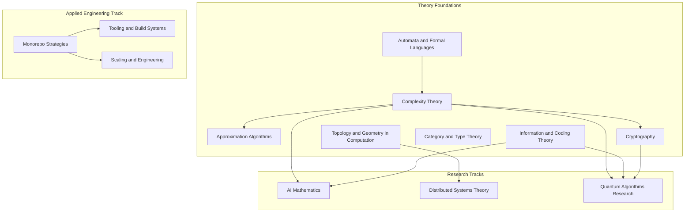

  <h1 style="color: white; margin: 0; font-size: 2.5rem;">Advanced Topics Research Hub</h1>
  
Rigorous treatments of theoretical computer science, quantum computing, and the foundations of AI

The Advanced Topics section collects the site's proof-oriented material: definitions, theorems, derivations, and pointers to current research in theoretical computer science, information theory, cryptography, quantum computation, distributed computing, and the mathematics of machine learning. One cluster is different in kind: the **monorepo** pages are an applied engineering deep-dive on operating very large codebases and assume systems experience rather than graduate mathematics.

**Prerequisites.** Apart from the monorepo cluster, these pages assume graduate-level mathematics or theoretical computer science. Each page lists its specific prerequisites at the top. For intuition-first introductions, start from the [main documentation](../) instead.

## Organization

The pages fall into three groups. **Theory Foundations** are self-contained pages on the core machinery of theoretical computer science. The **Research Tracks** apply that machinery to specific fields and end at open problems. The **Applied Engineering Track** stands apart.

Arrows point from a page to the pages that rely on it most. For example, complexity theory supplies the reductions used in approximation hardness and cryptography, and information theory supplies the entropy and divergence bounds used in learning theory and quantum error correction.

## Theory Foundations

| Page | Covers | Suggested background |
|---|---|---|
| [Automata Theory &amp; Formal Languages](automata-and-formal-languages/) | Finite, pushdown, and Turing machines; the Chomsky hierarchy; pumping lemmas; decidability, the halting problem, Rice's theorem | Discrete mathematics, proof technique |
| [Computational Complexity Theory](complexity-theory/) | Time and space classes, P vs NP, reductions and completeness, the polynomial hierarchy, circuits, randomized classes, relativization and natural-proofs barriers | Automata and Turing machines |
| [Approximation Algorithms &amp; Hardness](approximation-algorithms/) | Greedy, LP rounding, primal-dual; PTAS and FPTAS; the PCP theorem; inapproximability and the Unique Games Conjecture | Complexity theory, linear programming |
| [Information &amp; Coding Theory](information-coding-theory/) | Entropy and mutual information, source and channel coding theorems, finite-blocklength limits, LDPC, polar and Reed–Solomon codes, rate–distortion, quantum information measures | Probability, linear algebra over finite fields |
| [Cryptography: Foundations &amp; Post-Quantum](cryptography/) | Provable security and reductions, one-way functions, PRGs and PRFs, zero-knowledge, the random-oracle model, lattice-, code-, and hash-based post-quantum schemes | Complexity theory, probability, number theory |
| [Category Theory &amp; Type Theory](category-and-type-theory/) | Categories, functors, adjunctions, monads; lambda calculus; the Curry–Howard correspondence; dependent types; proof assistants | Abstract algebra, logic |
| [Topology &amp; Geometry in Computation](topology-and-geometry-in-computation/) | Simplicial complexes and homology, persistent homology and TDA, topological characterization of distributed task solvability | Linear algebra, basic point-set topology |

## Research Tracks

| Page | Covers | Builds on |
|---|---|---|
| [AI Mathematics: Theoretical Foundations](ai-mathematics/) | PAC learning and VC dimension, Rademacher complexity and generalization bounds, optimization for deep learning, kernels and RKHS, information-theoretic views of learning | [Complexity](complexity-theory/), [Information Theory](information-coding-theory/) |
| [Distributed Systems Theory](distributed-systems-theory/) | FLP impossibility, consensus protocols, consistency models and CAP, Byzantine fault tolerance, formal verification and temporal logic | [Topology](topology-and-geometry-in-computation/), [Complexity](complexity-theory/) |
| [Quantum Algorithms Research](quantum-algorithms-research/) | Quantum circuit model, core algorithms, BQP and quantum complexity, error correction and fault tolerance, topological quantum computing, NISQ algorithms, quantum advantage | [Complexity](complexity-theory/), [Cryptography](cryptography/), [Information Theory](information-coding-theory/) |

## Applied Engineering Track

The monorepo cluster covers how organizations build, test, and version very large codebases. It is an engineering reference, not a proof page.

| Page | Covers |
|---|---|
| [Monorepo Strategies and Management](monorepo/) | What a monorepo is, the polyrepo trade-off, core concepts, when to adopt one, case studies. Start here. |
| [Monorepos: Tooling &amp; Build Systems](monorepo-tooling/) | Bazel, Buck2, Pants, Nx, Turborepo, Rush, moon, and package-manager workspaces compared; remote caching internals; selection guidance |
| [Monorepos: Scaling &amp; Engineering](monorepo-scaling/) | Affected-target analysis, content-addressed caching, distributed and remote execution, dependency boundaries, change-driven CI and merge queues, Git scaling |

## Reading Paths

The pages are self-contained, but reading a track's foundations first pays off. A foundations-first order is: automata, complexity, information and coding theory, approximation, cryptography, category and type theory, topology; then one of the research tracks.

| Background | Suggested sequence | Emphasis |
|---|---|---|
| Theoretical computer science | [Automata](automata-and-formal-languages/) → [Complexity](complexity-theory/) → [Approximation](approximation-algorithms/) → [AI Mathematics](ai-mathematics/) or [Distributed Systems](distributed-systems-theory/) → [Quantum Algorithms](quantum-algorithms-research/) | Reductions, hardness, impossibility results, query complexity |
| Mathematics | [Category &amp; Type Theory](category-and-type-theory/) and [Topology](topology-and-geometry-in-computation/) → [AI Mathematics](ai-mathematics/) → [Quantum Algorithms](quantum-algorithms-research/) → [Distributed Systems](distributed-systems-theory/) | Structure, functional analysis, representation theory, logic |
| Physics / quantum | [Quantum Algorithms](quantum-algorithms-research/) → [Information &amp; Coding Theory](information-coding-theory/) → [Cryptography](cryptography/) → [AI Mathematics](ai-mathematics/) | Error correction, entropy, post-quantum migration |
| Communications / statistics | [Information &amp; Coding Theory](information-coding-theory/) → [AI Mathematics](ai-mathematics/) → [Cryptography](cryptography/) | Capacity, compression, learning as compression |
| Platform / build engineering | [Monorepo Strategies](monorepo/) → [Tooling](monorepo-tooling/) → [Scaling](monorepo-scaling/) | Build graphs, caching, CI, Git internals; no graduate mathematics required |

## Conventions on These Pages

Each page states its prerequisites, gives formal definitions before results, and marks proofs, proof sketches, and worked examples. Notation follows the standard textbook for the field where one exists, and each page ends with references and links to related applied documentation. Research frontiers change quickly; claims about open problems and recent results carry dates, and primary sources should be checked before relying on them in published work. Corrections are welcome as issues or pull requests on the [GitHub repository](https://github.com/AndrewAltimit/Documentation).

## Tools

| Purpose | Tools |
|---|---|
| Proof assistants | Lean 4 with Mathlib, Rocq (formerly Coq), Isabelle/HOL, Agda |
| Specification and model checking | TLA+ (TLC, Apalache), Alloy, P |
| Automated reasoning | Z3, cvc5 (SMT solvers); Vampire, E (first-order provers) |
| Computer algebra and numerics | SageMath, Mathematica, NumPy/SciPy |
| Quantum software | Qiskit, Cirq, PennyLane; Stim for fast stabilizer-circuit simulation |
| Machine learning research | PyTorch, JAX |
| Typesetting | LaTeX with `amsmath`/`amsthm`, `algorithm2e` or `algorithmicx`, `tikz`, `quantikz` for circuits |

## Venues and Journals

| Field | Main conferences | Journals |
|---|---|---|
| Algorithms and complexity | STOC, FOCS, SODA, CCC, ICALP, ITCS | JACM, SICOMP |
| Cryptography | CRYPTO, EUROCRYPT, ASIACRYPT, TCC, PKC | Journal of Cryptology |
| Information and coding theory | ISIT, ITW | IEEE Transactions on Information Theory |
| Logic and programming languages | LICS, POPL, ICFP, CSL, ITP | Logical Methods in Computer Science |
| Learning theory and ML | COLT, ALT, NeurIPS, ICML, ICLR | JMLR, TMLR |
| Distributed computing | PODC, DISC, OPODIS, SRDS | Distributed Computing |
| Quantum computing | QIP, TQC, QCrypt | Quantum, PRX Quantum, npj Quantum Information |

Preprints for nearly all of these fields appear first on arXiv (cs.CC, cs.DS, cs.IT, cs.CR, cs.LO, cs.LG, cs.DC, quant-ph); the IACR ePrint archive is the equivalent for cryptography.

## Related Documentation

**Applied counterparts**
- [Technology](../technology/) — practical distributed systems, cloud, and infrastructure
- [Quantum Computing Hub](../quantum-computing/) — programming quantum computers
- [AI/ML Documentation](../ai-ml/) — practical machine learning
- [Cybersecurity Hub](../technology/cybersecurity/) — applied cryptography, TLS, and key management

**Physics foundations**
- [Quantum Mechanics](../physics/quantum-mechanics/) — states, operators, and measurement
- [Quantum Field Theory](../physics/quantum-field-theory.html) — relativistic quantum theory
- [Statistical Mechanics](../physics/statistical-mechanics/) — entropy and its links to learning theory

**Reference**
- [Mathematical Reference](../reference/) — formulas and constants
- [Computational Physics](../physics/computational-physics/) — numerical methods and simulation
