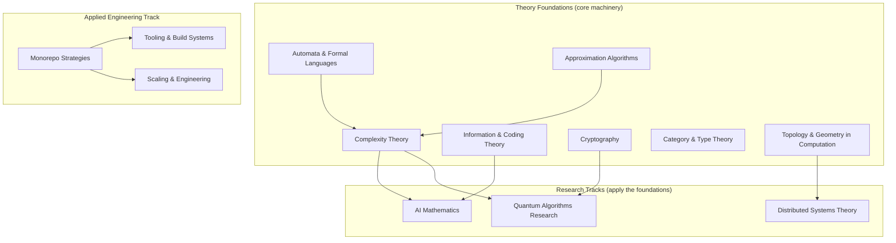
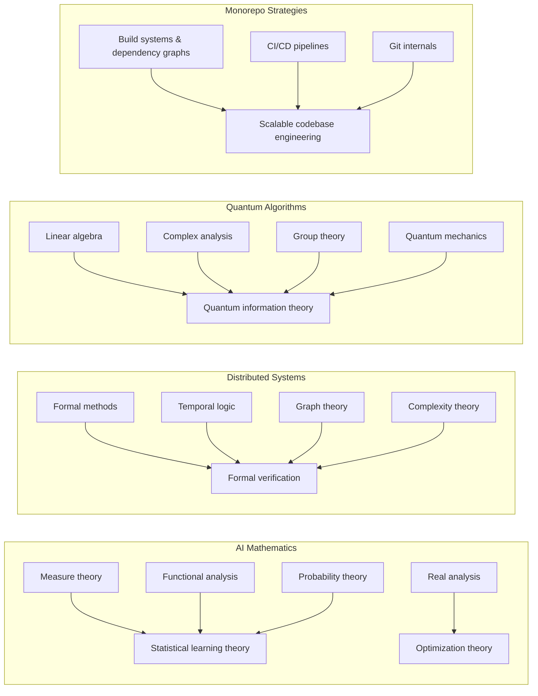
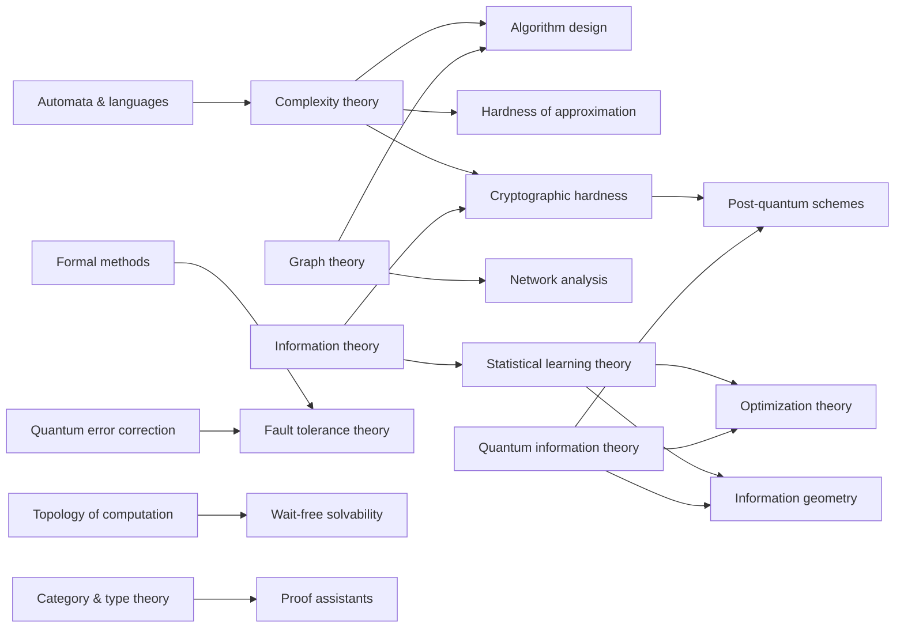

<div class="hero-section" style="background: linear-gradient(135deg, #232526 0%, #414345 100%); color: white; padding: 3rem 2rem; margin: -2rem -3rem 2rem -3rem; text-align: center;">
  <h1 style="color: white; margin: 0; font-size: 2.5rem;">Advanced Topics Research Hub</h1>
  <p style="font-size: 1.25rem; margin-top: 1rem; opacity: 0.9;">Rigorous mathematical treatments and cutting-edge research in theoretical computer science, quantum computing, and AI foundations</p>
</div>

Welcome to the research-oriented section of our documentation. This area contains rigorous mathematical treatments, formal proofs, and cutting-edge research topics spanning theoretical computer science, quantum computing, and mathematical foundations of AI — alongside one deeply *applied* engineering track on operating large-scale codebases.

<div class="hub-intro">
  <p class="lead">These resources are designed for researchers, PhD students, and professionals working on theoretical foundations. Whether you're conducting original research, implementing state-of-the-art algorithms, or writing academic work, you'll find rigorous mathematical treatments and complete derivations.</p>
</div>

<div class="notice--warning" markdown="1">
#### Prerequisites Warning
These pages assume graduate-level knowledge in mathematics, computer science, and related fields. Each topic includes specific prerequisite requirements at the top of the page.
</div>

## How This Hub Is Organized

The pages here fall into **four distinct groups**. The first three are proof-oriented *research tracks*; the last is an applied *engineering track*. The new **Theory Foundations** group supplies the core theoretical machinery (complexity, cryptography, information theory, logic, automata, approximation, topology) that the research tracks repeatedly draw on.



- **Theory Foundations** — self-contained, proof-first pages on the pillars of theoretical CS. Start here if you want the underlying mathematics before specializing.
- **Graduate Research Tracks** — AI mathematics, distributed-systems theory, and quantum-algorithms research. Each *consumes* the foundations and pushes to open research frontiers.
- **Applied Engineering Track** — the monorepo cluster: an engineering deep-dive (not a proof page) on operating very large codebases, split across a hub and two specialized children.

---

## Theory Foundations

Self-contained, definition-and-theorem pages covering the core machinery of theoretical computer science. Read these first if you want the underlying mathematics before specializing into a research track; the research tracks cross-link back to them constantly.

<div class="command-grid">
  <div class="feature-card" markdown="1">
#### [Computational Complexity Theory](complexity-theory/)
*Resource-bounded computation*

- Turing machines, time/space classes, P vs NP
- Reductions, completeness, the polynomial hierarchy
- Circuit complexity and randomized classes
- Relativization and natural-proofs barriers

*Audience: theoretical CS, complexity researchers*
  </div>
  <div class="feature-card" markdown="1">
#### [Automata Theory & Formal Languages](automata-and-formal-languages/)
*What machines can and cannot compute*

- Finite, pushdown, and Turing machines
- The Chomsky hierarchy and corresponding grammars
- Pumping lemmas and closure properties
- Decidability, undecidability, and the halting problem

*Audience: theoretical CS, logicians, mathematicians*
  </div>
  <div class="feature-card" markdown="1">
#### [Information & Coding Theory](information-coding-theory/)
*The mathematics of the bit*

- Entropy, mutual information, channel capacity
- Source coding and the noisy-channel theorem
- Linear, Reed-Solomon, LDPC, and polar codes
- Rate-distortion and the separation principle

*Audience: communications, CS, statistics researchers*
  </div>
  <div class="feature-card" markdown="1">
#### [Cryptography: Foundations & Post-Quantum](cryptography/)
*Provable security from hardness*

- Reductions, hardness assumptions, the random-oracle model
- One-way functions, PRGs, and PRFs
- Zero-knowledge proofs and commitments
- Lattice-, code-, and hash-based post-quantum schemes

*Audience: cryptography & security researchers*
  </div>
  <div class="feature-card" markdown="1">
#### [Category Theory & Type Theory](category-and-type-theory/)
*Structure, logic, and proof*

- Categories, functors, natural transformations, monads
- The Curry-Howard-Lambek correspondence
- Dependent types and constructive logic
- Proof assistants (Coq, Lean, Agda)

*Audience: logicians, PL theorists, mathematicians*
  </div>
  <div class="feature-card" markdown="1">
#### [Approximation Algorithms & Hardness](approximation-algorithms/)
*Provable guarantees for NP-hard problems*

- Greedy, LP rounding, and primal-dual methods
- PTAS, FPTAS, and approximation schemes
- The PCP theorem and inapproximability
- Unique Games Conjecture and optimal thresholds

*Audience: algorithms & complexity researchers*
  </div>
  <div class="feature-card" markdown="1">
#### [Topology & Geometry in Computation](topology-and-geometry-in-computation/)
*Shape as a computational tool*

- Simplicial complexes and homology
- Persistent homology and topological data analysis
- The topological theory of distributed solvability
- Geometric obstructions to wait-free computation

*Audience: applied topology, theoretical CS, data science*
  </div>
</div>

---

## Graduate Research Tracks

Proof-oriented pages aimed at original research. Each track *applies* the Theory Foundations above and pushes to current open problems.

<div class="command-grid">
  <div class="feature-card" markdown="1">
#### [AI Mathematics: Theoretical Foundations](ai-mathematics/)
*Foundations of machine learning*

- Computational learning theory (PAC, VC dimension, Rademacher complexity)
- Statistical learning theory and generalization bounds
- Optimization landscapes and convergence analysis
- Kernel methods and RKHS
- Information-theoretic perspectives

*Audience: ML researchers, theoretical CS, mathematicians*

*Builds on:* [Complexity Theory](complexity-theory/), [Information & Coding Theory](information-coding-theory/)
  </div>
  <div class="feature-card" markdown="1">
#### [Distributed Systems Theory](distributed-systems-theory/)
*Distributed computing theory*

- FLP impossibility and consensus limitations
- CAP theorem and consistency models
- Byzantine fault tolerance and agreement protocols
- Formal verification of distributed algorithms
- Temporal logic and specifications

*Audience: distributed systems researchers, formal methods*

*Builds on:* [Topology & Geometry in Computation](topology-and-geometry-in-computation/), [Complexity Theory](complexity-theory/)
  </div>
  <div class="feature-card" markdown="1">
#### [Quantum Algorithms Research](quantum-algorithms-research/)
*Quantum computing foundations*

- Quantum complexity theory and models
- Error correction codes and fault tolerance
- Topological quantum computing
- NISQ-era variational algorithms
- Quantum advantage demonstrations

*Audience: quantum computing researchers, physicists*

*Builds on:* [Complexity Theory](complexity-theory/), [Cryptography](cryptography/), [Information & Coding Theory](information-coding-theory/)
  </div>
</div>

---

## Applied Engineering Track

The odd one out — and deliberately so. The monorepo cluster is an **engineering deep-dive**, not a proof-oriented research page. It assumes systems and build-tooling background rather than graduate mathematics, and it is split across a hub page and two specialized children.

<div class="command-grid">
  <div class="feature-card" markdown="1">
#### [Monorepo Strategies and Management](monorepo/)
*Large-scale codebase engineering — start here*

- Monorepo vs polyrepo trade-offs
- Build-graph modeling and affected-only builds
- Ownership, visibility, and governance
- Migration strategies and case studies

*Audience: platform & build engineers, tech leads*
  </div>
  <div class="feature-card" markdown="1">
#### [Monorepos: Tooling & Build Systems](monorepo-tooling/)
*The build-tool landscape*

- Affected-graph runners: Nx, Turborepo
- Publishing managers: Lerna, Rush
- Hermetic polyglot builds: Bazel, Buck2, Pants
- Remote caching internals and selection guidance

*Audience: build engineers choosing a toolchain*
  </div>
  <div class="feature-card" markdown="1">
#### [Monorepos: Scaling & Engineering](monorepo-scaling/)
*Keeping a huge repo fast*

- Build graphs and affected-target analysis
- Distributed remote execution
- Dependency-visibility rules and code ownership
- CI at scale and VCS scaling techniques

*Audience: platform & infrastructure engineers*
  </div>
</div>

---

## Prerequisites Overview

Each research topic requires different mathematical and theoretical foundations:



Of the four groups, the **Applied Engineering Track** (monorepos) is the most applied: it is an engineering deep-dive rather than a proof-oriented research page, and asks for systems background rather than graduate mathematics. The **Theory Foundations** pages are the common ancestors of the three research tracks — for example, complexity theory feeds both AI mathematics and quantum algorithms, while information theory feeds AI mathematics and cryptography.

## How to Navigate These Resources

### You Should Use These Pages If You Are:
- Conducting original research in theoretical computer science or physics
- Writing academic papers, theses, or dissertations
- Implementing algorithms from research papers with full mathematical rigor
- Seeking complete proofs and formal derivations
- Understanding fundamental theoretical limits and impossibility results

### Consider the Main Documentation If You Want:
- Practical implementations and code examples
- Quick reference guides for daily development work
- Intuitive explanations without heavy formalism
- Introductory learning materials
- Applied tutorials and how-to guides

### What Each Advanced Topic Provides:
- **Formal Definitions**: Precise mathematical notation and rigorous terminology
- **Theorems and Proofs**: Complete derivations with all steps shown
- **Research References**: Primary sources from academic literature
- **Open Problems**: Current research frontiers and unsolved questions
- **Practical Links**: Connections to applied documentation when relevant

---

## Recommended Reading Order

The pages are individually self-contained, but they reward a deliberate order. Read the **Theory Foundations** that a track depends on before the track itself.

<div class="code-example" markdown="1">
**Foundations-first sequence (recommended default):**
1. [Automata Theory & Formal Languages](automata-and-formal-languages/) — the machine models and the Chomsky hierarchy that everything else assumes
2. [Computational Complexity Theory](complexity-theory/) — time/space classes, P vs NP, reductions and completeness
3. [Information & Coding Theory](information-coding-theory/) — entropy, capacity, and the codes that approach the limits
4. [Approximation Algorithms & Hardness](approximation-algorithms/) — what complexity buys you, and the PCP-based hardness wall
5. [Cryptography: Foundations & Post-Quantum](cryptography/) — provable security built on the hardness from step 2
6. [Category Theory & Type Theory](category-and-type-theory/) — the logical and structural backbone for proof assistants
7. [Topology & Geometry in Computation](topology-and-geometry-in-computation/) — homological tools for data and for distributed solvability

**Then specialize into a research track:**
8. [AI Mathematics](ai-mathematics/), [Distributed Systems Theory](distributed-systems-theory/), or [Quantum Algorithms Research](quantum-algorithms-research/)

**Engineering, separately:** the monorepo cluster — [Monorepo Strategies](monorepo/) → [Tooling & Build Systems](monorepo-tooling/) and [Scaling & Engineering](monorepo-scaling/) — stands on its own and can be read at any time.
</div>

---

## Recommended Reading Paths

Choose your path based on your background and research interests:

### For Theoretical Computer Scientists

<div class="code-example" markdown="1">
**Learning Path:**
1. Ground yourself in [Automata & Formal Languages](automata-and-formal-languages/) and [Complexity Theory](complexity-theory/)
   - The Chomsky hierarchy, reductions, and completeness
   - P vs NP and the relativization/natural-proofs barriers
2. Add [Approximation Algorithms & Hardness](approximation-algorithms/)
   - LP rounding and primal-dual design
   - The PCP theorem and inapproximability thresholds
3. Apply it in [AI Mathematics](ai-mathematics/) and [Distributed Systems Theory](distributed-systems-theory/)
   - PAC learning, VC dimension, uniform convergence
   - Consensus impossibility and Byzantine fault tolerance
4. Explore complexity connections in [Quantum Algorithms](quantum-algorithms-research/)
   - BQP complexity class and quantum speedups
   - Quantum query complexity

**Key Focus**: Computational complexity, algorithm analysis, formal methods
</div>

### For Mathematicians

<div class="code-example" markdown="1">
**Learning Path:**
1. Start structural with [Category Theory & Type Theory](category-and-type-theory/) and [Topology & Geometry in Computation](topology-and-geometry-in-computation/)
   - Functors, monads, and the Curry-Howard-Lambek correspondence
   - Simplicial complexes, homology, and persistent homology
2. Move to measure-theoretic foundations in [AI Mathematics](ai-mathematics/)
   - Functional analysis in learning theory
   - Information-theoretic bounds
3. Study topological and algebraic methods in [Quantum Algorithms](quantum-algorithms-research/)
   - Topological quantum computing
   - Group representation theory in quantum circuits
4. Examine logic and verification in [Distributed Systems](distributed-systems-theory/)
   - Temporal logic specifications
   - Formal verification techniques

**Key Focus**: Mathematical rigor, abstract structures, proof techniques
</div>

### For Physicists and Quantum Researchers

<div class="code-example" markdown="1">
**Learning Path:**
1. Start with [Quantum Algorithms](quantum-algorithms-research/)
   - Quantum error correction codes
   - Adiabatic quantum computing
   - NISQ algorithm development
2. Anchor the formalism with [Information & Coding Theory](information-coding-theory/) and [Cryptography](cryptography/)
   - Entropy, capacity, and the classical–quantum coding parallel
   - Why factoring/discrete-log fall, and the post-quantum migration
3. Connect to learning theory in [AI Mathematics](ai-mathematics/)
   - Quantum information bounds
   - Statistical mechanics of learning
4. Study fault tolerance in [Distributed Systems](distributed-systems-theory/)
   - Classical error correction parallels
   - Distributed quantum computing

**Key Focus**: Physical implementations, quantum mechanics, experimental connections
</div>

### For Platform and Build Engineers

<div class="code-example" markdown="1">
**Learning Path:**
1. Start with [Monorepo Strategies and Management](monorepo/)
   - Monorepo vs polyrepo trade-offs and the build-graph model
   - Ownership, visibility, and migration strategy
2. Pick your toolchain in [Tooling & Build Systems](monorepo-tooling/)
   - Nx/Turborepo vs Bazel/Buck2/Pants vs Lerna/Rush
   - Remote caching internals
3. Make it fast at scale in [Scaling & Engineering](monorepo-scaling/)
   - Affected-target analysis and distributed remote execution
   - CI-at-scale and VCS scaling techniques

**Key Focus**: Build systems, dependency graphs, CI/CD, Git internals — not graduate mathematics
</div>

---

## Research Tools and Computational Resources

### Mathematical Typesetting
```latex
% Essential LaTeX packages for research documentation
\usepackage{amsmath, amsthm, amssymb}  % AMS mathematics
\usepackage{algorithm, algorithmic}     % Algorithm typesetting
\usepackage{complexity}                 % Complexity classes
\usepackage{tikz}                       % Diagrams and figures
\usepackage{quantikz}                   % Quantum circuits
```

### Formal Verification Tools
- **Coq**: Proof assistant for functional programming and mathematics
- **Lean**: Modern proof assistant with extensive mathematical libraries
- **Isabelle/HOL**: Higher-order logic theorem proving
- **TLA+**: Temporal logic for distributed systems specifications
- **Z3**: SMT solver for automated reasoning

### Computational Frameworks
- **SageMath**: Computer algebra system for pure mathematics
- **Qiskit/Cirq**: Quantum computing frameworks for algorithm development
- **NetworkX**: Graph theory and network analysis
- **PyTorch/JAX**: Automatic differentiation for optimization research

---

## Academic and Research Resources

### Leading Conferences by Field

**Theoretical Computer Science (complexity, algorithms, approximation):**
- STOC (Symposium on Theory of Computing)
- FOCS (Foundations of Computer Science)
- CCC (Computational Complexity Conference)
- SODA (Symposium on Discrete Algorithms)
- ICALP (International Colloquium on Automata, Languages and Programming)

**Cryptography:**
- CRYPTO and EUROCRYPT (IACR flagship conferences)
- TCC (Theory of Cryptography Conference)
- PKC (Public-Key Cryptography)

**Logic, Types, and Category Theory:**
- LICS (Logic in Computer Science)
- POPL (Principles of Programming Languages)
- CSL (Computer Science Logic)

**Machine Learning Theory:**
- NeurIPS (Conference on Neural Information Processing Systems)
- ICML (International Conference on Machine Learning)
- ICLR (International Conference on Learning Representations)
- COLT (Conference on Learning Theory)
- ALT (Algorithmic Learning Theory)

**Distributed Systems:**
- PODC (Principles of Distributed Computing)
- DISC (International Symposium on Distributed Computing)
- OPODIS (International Conference on Principles of Distributed Systems)
- SRDS (Symposium on Reliable Distributed Systems)

**Quantum Computing:**
- QIP (Quantum Information Processing)
- TQC (Theory of Quantum Computation)
- AQIS (Asian Quantum Information Science)

### Key Academic Journals
- **JMLR**: Journal of Machine Learning Research (open access)
- **JACM**: Journal of the ACM (theoretical CS)
- **Journal of Cryptology**: IACR journal of record
- **IEEE Transactions on Information Theory**: information and coding theory
- **Quantum**: Open-access quantum computing journal
- **Distributed Computing**: Springer journal on distributed systems
- **Physical Review Letters**: For quantum physics foundations

### Online Learning Resources
- **MIT OpenCourseWare**: Advanced algorithms and complexity theory
- **Stanford Online**: Statistical learning theory courses
- **IBM Qiskit Textbook**: Quantum algorithms with implementations
- **Berkeley CS294**: Foundations of deep learning
- **ETH Zurich**: Distributed computing principles
- **Caltech/IBM**: Quantum computation theory

### Recent Survey Papers (2023-2025)
- "Mechanistic Interpretability: A Survey" - Neural network interpretability methods
- "Byzantine Consensus in the Blockchain Era" - Modern fault tolerance
- "Quantum Machine Learning: Prospects and Challenges" - Current state of QML
- "Theory of Grokking: Dynamic Phase Transitions" - Understanding delayed generalization
- "Foundations of Quantum Error Correction" - Latest developments in QEC
- "A Decade of Lattice Cryptography" - Foundations of the post-quantum transition

---

## Using These Resources Responsibly

### Academic Integrity Guidelines

When using this research documentation:
- **Cite Appropriately**: Reference primary sources and this documentation when using proofs or theorems
- **Verify Independently**: Always check results before using in publications
- **Check Recent Literature**: Fields evolve rapidly; verify with latest research
- **Contribute Corrections**: Submit issues or PRs if you find errors
- **Credit Original Authors**: Follow academic citation standards

### Contributing Advanced Content

Researchers wanting to contribute should:
1. Ensure mathematical rigor and correctness
2. Provide complete proofs or clear proof sketches
3. Include recent research references (within 5 years when possible)
4. Mark prerequisites clearly at the beginning
5. Link to simpler explanations in main documentation
6. Use standard notation and define all symbols
7. Include computational examples where applicable

---

## Related Documentation

### Practical Implementations
For applied guides and working code examples, see:
- **[Technology Documentation](../technology/)** - Practical implementations of distributed systems, cloud computing
- **[Quantum Computing Hub](../quantum-computing/)** - Programming quantum computers with Qiskit and Cirq
- **[AI/ML Documentation](../ai-ml/)** - Practical machine learning guides and tools
- **[Cybersecurity Hub](../technology/cybersecurity/)** - Applied cryptography, TLS, and key management

### Foundational Physics
Theoretical physics foundations for quantum computing:
- **[Quantum Mechanics](../physics/quantum-mechanics/)** - Wave functions, operators, and quantum states
- **[Quantum Field Theory](../physics/quantum-field-theory.html)** - Advanced quantum theoretical framework
- **[Statistical Mechanics](../physics/statistical-mechanics/)** - Connections to machine learning theory

### Mathematical Background
- **[Mathematical Reference](../reference/)** - Formulas, constants, and quick references
- **[Computational Physics](../physics/computational-physics/)** - Numerical methods and simulations

---

## How Topics Interconnect

The advanced topics form a rich network of connections. The Theory Foundations are the common ancestors that the research tracks repeatedly draw on:



Understanding these connections enables interdisciplinary research and novel problem-solving approaches.

---

*These advanced topics represent the cutting edge of theoretical computer science and quantum physics, plus one deeply applied engineering track. For practical, accessible content, visit our [main documentation](../). The theoretical foundations here support the applied work throughout the site.*

**Questions or corrections?** Visit our [GitHub repository](https://github.com/AndrewAltimit/Documentation) to contribute.
