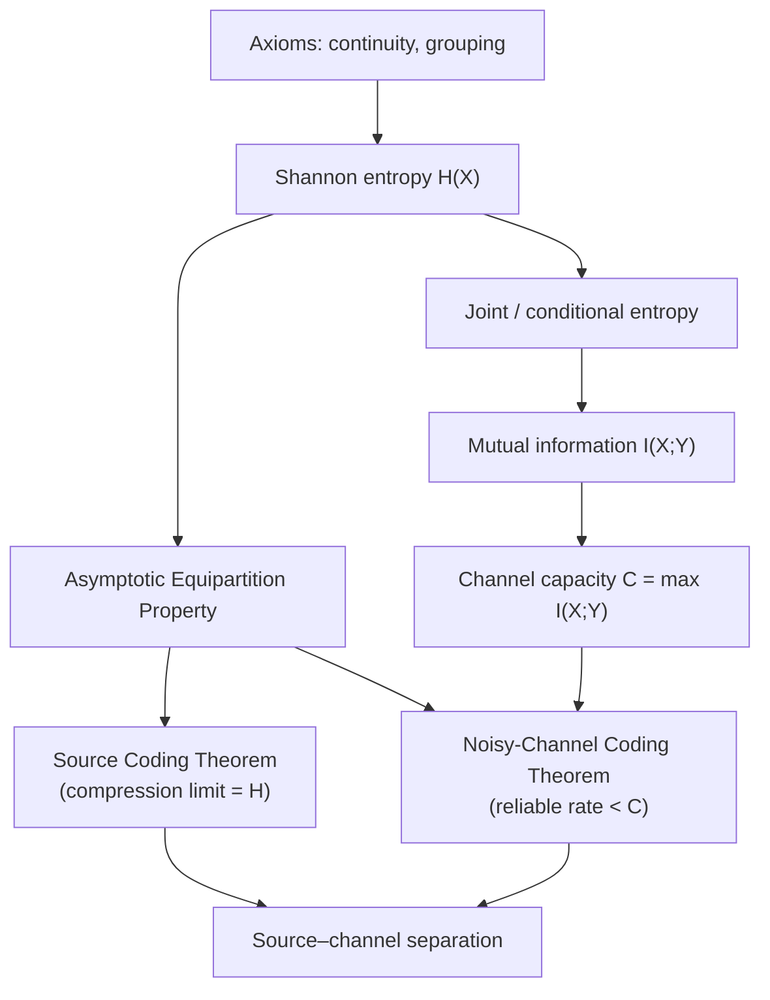
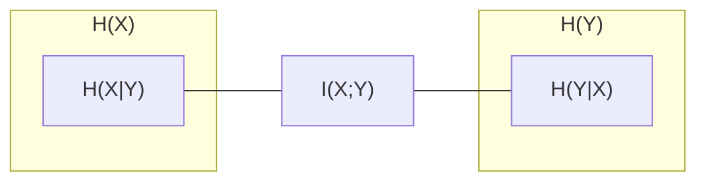
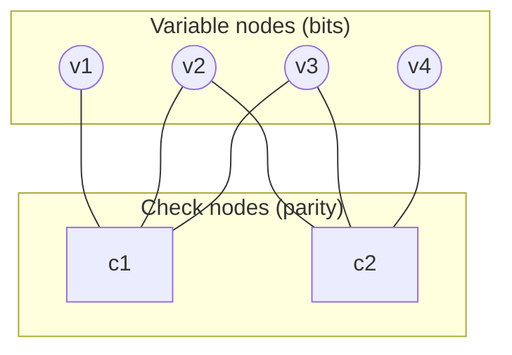

# Information &amp; Coding Theory

[Advanced Topics](./) &raquo; Information &amp; Coding Theory

<div class="advanced-note" markdown="1">
**Graduate-level research page.** This is a rigorous, theorem-oriented treatment of Shannon's information theory and the coding theory that operationalizes it, aimed at researchers in communications, computer science, and statistics. **Prerequisites:** probability theory, linear algebra over finite fields, and basic real analysis. For an accessible introduction to compression and reliable transmission, see the [Networking](../../technology/networking/) section.
</div>

In 1948 Claude Shannon asked two questions that look unrelated and answered them with the same currency — the *bit*. How far can a source be compressed without losing information? And how fast can information be pushed through a noisy channel while keeping the error probability arbitrarily small? The astonishing answer is that both limits are sharp, both are computed from the same logarithmic quantity, and — crucially — **the two problems separate**: you can compress optimally first and protect against noise second, losing nothing by treating them independently.

- **Entropy is the only sensible measure.** Demanding continuity, monotonicity, and a grouping (chain) rule forces the measure of uncertainty to be Shannon entropy up to the choice of logarithm base.
- **Compression has a floor.** No uniquely decodable code beats the source entropy on average; Huffman and arithmetic coding get within one bit and one symbol of it respectively.
- **Capacity is a phase transition.** Below capacity, error probability can be driven to zero; above it, error is bounded away from zero. There is no graceful middle ground in the asymptotic limit.
- **Random codes are optimal.** Shannon proved capacity is achievable by averaging over random codebooks — but the constructive race to build explicit, efficiently decodable capacity-achieving codes took another fifty years (LDPC, turbo, polar).

### The Logical Spine

The results below form a dependency chain, not a list. Entropy and its conditional/joint variants are defined axiomatically; mutual information is the unique quantity that drops out as "shared uncertainty"; the Asymptotic Equipartition Property (AEP) turns these averages into hard combinatorial facts about *typical sequences*; and the two coding theorems — source coding and channel coding — are both proved by counting typical sequences.



## Table of Contents
- [Entropy and Information Measures](#entropy-and-information-measures)
- [Mutual Information and Relative Entropy](#mutual-information-and-relative-entropy)
- [The Asymptotic Equipartition Property](#the-asymptotic-equipartition-property)
- [Source Coding (Compression)](#source-coding-compression)
- [Channel Capacity and the Noisy-Channel Theorem](#channel-capacity-and-the-noisy-channel-theorem)
- [Error-Correcting Codes](#error-correcting-codes)
- [Rate–Distortion Theory](#ratedistortion-theory)
- [Quantum Information Measures](#quantum-information-measures)

## Entropy and Information Measures

### Shannon Entropy

**Intuition**: The entropy of a random variable is the average number of bits needed to describe its outcome — equivalently, the average "surprise" of an observation, where the surprise of an event of probability $p$ is $\log(1/p)$. Rare events carry more information.

<div class="theory-card" markdown="1">
#### Definition (Entropy)
For a discrete random variable $X$ with probability mass function $p(x)$ over alphabet $\mathcal{X}$, the **entropy** is

$$H(X) = -\sum_{x \in \mathcal{X}} p(x) \log_2 p(x) = \mathbb{E}\!\left[\log_2 \frac{1}{p(X)}\right],$$

measured in bits (using $\log_2$). With the natural logarithm the unit is the *nat*. By convention $0 \log 0 = 0$.
</div>

Entropy is not an arbitrary choice. Shannon's axiomatic theorem shows that any measure $H(p_1,\dots,p_n)$ that is (i) continuous in the probabilities, (ii) monotonically increasing in $n$ for the uniform distribution, and (iii) satisfies the grouping/chain rule must equal $-K\sum_i p_i \log p_i$ for some positive constant $K$ — the base of the logarithm being the only freedom.

<div class="example-card" markdown="1">
#### Worked Example: the binary entropy function
For a Bernoulli($p$) variable, $H(X) = H_b(p) = -p\log_2 p - (1-p)\log_2(1-p)$. It is $0$ at $p=0$ and $p=1$ (a sure outcome carries no information), rises to its maximum $1$ bit at $p=\tfrac12$ (maximal uncertainty), and is concave and symmetric about $\tfrac12$. A biased coin with $p=0.11$ has $H_b(0.11)\approx 0.5$ bits — so a long sequence of such flips can in principle be compressed to half its naive length.
</div>

### Joint, Conditional, and the Chain Rule

For a pair $(X,Y)\sim p(x,y)$ the **joint entropy** is $H(X,Y) = -\sum_{x,y} p(x,y)\log_2 p(x,y)$, and the **conditional entropy** — the residual uncertainty in $Y$ once $X$ is known — is

$$H(Y \mid X) = -\sum_{x,y} p(x,y) \log_2 p(y \mid x) = \mathbb{E}_X\!\left[H(Y \mid X = x)\right].$$

These obey the **chain rule**, the workhorse identity of the whole subject:

$$H(X,Y) = H(X) + H(Y \mid X) = H(Y) + H(X \mid Y).$$

More generally, $H(X_1,\dots,X_n) = \sum_{i=1}^n H(X_i \mid X_1,\dots,X_{i-1})$. Conditioning never increases entropy, $H(Y\mid X) \le H(Y)$, with equality iff $X$ and $Y$ are independent — extra side information can only reduce (or preserve) uncertainty.

<div class="principle-card" markdown="1">
#### Bounds on Entropy
For a variable on an alphabet of size $|\mathcal{X}|$,

$$0 \le H(X) \le \log_2 |\mathcal{X}|,$$

with the upper bound attained **iff** $X$ is uniform (maximum-entropy principle) and the lower bound iff $X$ is deterministic. The maximum-entropy property generalizes: subject to moment constraints, the entropy-maximizing distribution is exponential-family (e.g. Gaussian under a variance constraint, geometric under a mean constraint).
</div>

## Mutual Information and Relative Entropy

### Relative Entropy (KL Divergence)

The **Kullback–Leibler divergence** measures the inefficiency of assuming distribution $q$ when the truth is $p$ — the extra bits per symbol paid by coding for the wrong distribution:

$$D(p \,\|\, q) = \sum_{x} p(x) \log_2 \frac{p(x)}{q(x)}.$$

By Gibbs' inequality, $D(p\,\|\,q) \ge 0$, with equality iff $p = q$. It is **not** a metric — asymmetric and violating the triangle inequality — but it is the canonical "statistical distance" and underlies hypothesis testing (Stein's lemma) and large-deviations theory.

### Mutual Information

<div class="theory-card" markdown="1">
#### Definition (Mutual Information)
The **mutual information** between $X$ and $Y$ is the KL divergence between the joint and the product of marginals:

$$I(X;Y) = D\big(p(x,y) \,\big\|\, p(x)p(y)\big) = \sum_{x,y} p(x,y)\log_2 \frac{p(x,y)}{p(x)p(y)}.$$

Equivalently, in entropy terms,

$$I(X;Y) = H(X) - H(X \mid Y) = H(Y) - H(Y \mid X) = H(X) + H(Y) - H(X,Y).$$
</div>

Mutual information is the reduction in uncertainty about $X$ from observing $Y$ (and symmetrically). It is non-negative, symmetric, and zero **iff** $X \perp Y$. The relationships are captured by the familiar information diagram:



The **data-processing inequality** is the structural consequence that matters most in practice: if $X \to Y \to Z$ forms a Markov chain (post-processing $Y$ to get $Z$), then

$$I(X;Z) \le I(X;Y).$$

No deterministic or stochastic processing of the data can manufacture information about $X$ that the data did not already contain. This single inequality bounds estimators, justifies sufficient statistics, and constrains the layers of any pipeline.

## The Asymptotic Equipartition Property

The AEP is the information-theoretic analog of the law of large numbers, and it is the technical engine behind both coding theorems.

<div class="principle-card" markdown="1">
#### Theorem (AEP)
If $X_1, X_2, \dots$ are i.i.d. $\sim p(x)$, then

$$-\frac{1}{n}\log_2 p(X_1,\dots,X_n) \xrightarrow{\ \text{prob}\ } H(X).$$

Consequently, for any $\epsilon>0$, the **typical set** $A_\epsilon^{(n)}$ of sequences with empirical log-probability within $\epsilon$ of $H(X)$ satisfies: (i) $P(A_\epsilon^{(n)}) \to 1$; (ii) every typical sequence has probability $\approx 2^{-nH(X)}$; and (iii) $|A_\epsilon^{(n)}| \doteq 2^{nH(X)}$.
</div>

In words: although there are $|\mathcal{X}|^n$ possible sequences, essentially all the probability concentrates on roughly $2^{nH(X)}$ of them, each nearly equally likely. Compression simply indexes the typical set with $nH(X)$ bits; everything outside it is rare enough to ignore. This is why entropy is *the* compression limit.

## Source Coding (Compression)

### The Source Coding Theorem and Kraft's Inequality

A code assigns to each symbol a binary string (codeword). For a code to be **uniquely decodable**, codeword lengths $\ell(x)$ must satisfy the **Kraft–McMillan inequality**:

$$\sum_{x \in \mathcal{X}} 2^{-\ell(x)} \le 1.$$

Conversely, any lengths satisfying Kraft admit a *prefix* (instantaneously decodable) code. Minimizing expected length $L = \sum_x p(x)\ell(x)$ subject to Kraft, via Lagrange multipliers, gives the ideal lengths $\ell^*(x) = -\log_2 p(x)$ and recovers the entropy.

<div class="principle-card" markdown="1">
#### Theorem (Shannon Source Coding)
For any uniquely decodable code, the expected codeword length satisfies $L \ge H(X)$. Moreover there exists a prefix code with

$$H(X) \le L < H(X) + 1,$$

and by coding blocks of $n$ symbols the per-symbol overhead shrinks to $1/n$, so the rate approaches $H(X)$ arbitrarily closely.
</div>

### Huffman Coding

Huffman's algorithm builds the **provably optimal** symbol-by-symbol prefix code by a greedy bottom-up merge: repeatedly combine the two least-probable symbols into a subtree, summing their probabilities, until one tree remains. Its expected length satisfies $H(X) \le L_{\text{Huffman}} < H(X)+1$ and no other prefix code does better on the same symbol distribution.

<div class="example-card" markdown="1">
#### Worked Example: a four-symbol Huffman code
Let $p = (0.5, 0.25, 0.125, 0.125)$ for symbols $(a,b,c,d)$. Merge $c,d \to 0.25$; merge that with $b \to 0.5$; merge with $a \to 1.0$. Codewords: $a=0$, $b=10$, $c=110$, $d=111$. Expected length $L = 0.5(1) + 0.25(2) + 0.125(3) + 0.125(3) = 1.75$ bits. Here $H(X) = 1.75$ bits exactly — the code is optimal *and* hits the entropy because every probability is a power of two (a dyadic source).
</div>

```python
import heapq
from collections import Counter

def huffman(symbol_probs):
    """Build a Huffman code; returns {symbol: bitstring}."""
    heap = [[p, [sym, ""]] for sym, p in symbol_probs.items()]
    heapq.heapify(heap)
    while len(heap) > 1:
        lo = heapq.heappop(heap)
        hi = heapq.heappop(heap)
        for pair in lo[1:]:
            pair[1] = "0" + pair[1]
        for pair in hi[1:]:
            pair[1] = "1" + pair[1]
        heapq.heappush(heap, [lo[0] + hi[0]] + lo[1:] + hi[1:])
    return {sym: code for sym, code in heap[0][1:]}

probs = {"a": 0.5, "b": 0.25, "c": 0.125, "d": 0.125}
code = huffman(probs)
L = sum(probs[s] * len(c) for s, c in code.items())  # 1.75 bits
```

### Arithmetic Coding

Huffman's one-bit-per-symbol overhead is wasteful when symbols are highly skewed (a symbol with $p=0.9$ "deserves" $0.15$ bits but Huffman must spend at least one). **Arithmetic coding** sidesteps this by encoding the *entire message* as a single real number in $[0,1)$. The current interval is recursively subdivided in proportion to the symbol probabilities; the final interval is identified by any binary fraction inside it.

Its expected length for a block of $n$ symbols satisfies $L_n < nH(X) + 2$, so the per-symbol redundancy is $O(1/n)$ — vanishing, regardless of how skewed the source is. It also pairs naturally with **adaptive** and **context** models (the basis of modern codecs like the range coder in PPM/CABAC and the entropy stage of many image and video standards).

<div class="comparison-table" markdown="1">

| Property | Huffman | Arithmetic |
|---|---|---|
| Granularity | integer bits/symbol | fractional bits/symbol |
| Redundancy | $< 1$ bit/symbol | $< 2$ bits/message ($O(1/n)$/symbol) |
| Adaptivity | needs code rebuild | natural, online |
| Speed | very fast (table lookup) | slower (arithmetic per symbol) |
| Optimality | optimal *prefix* code | approaches entropy arbitrarily |

</div>

## Channel Capacity and the Noisy-Channel Theorem

### Discrete Memoryless Channels

A **discrete memoryless channel (DMC)** is specified by an input alphabet $\mathcal{X}$, output alphabet $\mathcal{Y}$, and transition probabilities $p(y \mid x)$, applied independently to each transmitted symbol. The **capacity** is the maximum mutual information over input distributions:

<div class="theory-card" markdown="1">
#### Definition (Channel Capacity)
$$C = \max_{p(x)} I(X;Y) \quad \text{bits per channel use.}$$
</div>

<div class="example-card" markdown="1">
#### Worked Example: capacities of two canonical channels
**Binary symmetric channel (BSC)** with crossover probability $p$ flips each bit independently with probability $p$. Its capacity is

$$C_{\text{BSC}} = 1 - H_b(p),$$

so a clean channel ($p=0$) carries 1 bit/use, a useless one ($p=\tfrac12$) carries 0, and the loss is exactly the binary entropy of the noise. **Binary erasure channel (BEC)** with erasure probability $\alpha$ either delivers the bit or outputs "?"; it has

$$C_{\text{BEC}} = 1 - \alpha,$$

the intuitive statement that a fraction $\alpha$ of uses are simply lost.
</div>

### The Noisy-Channel Coding Theorem

<div class="principle-card" markdown="1">
#### Theorem (Shannon, 1948)
For a DMC with capacity $C$, and any rate $R < C$, there exist codes of rate $R$ whose maximal probability of error $\to 0$ as the block length $n \to \infty$. Conversely (the **converse**), every sequence of codes with $R > C$ has error probability bounded away from zero.
</div>

The proof of achievability is a *non-constructive* tour de force: pick a codebook of $2^{nR}$ codewords i.i.d. from the capacity-achieving input distribution, decode by **joint typicality** (declare the unique codeword jointly typical with the received sequence), and show the average error over random codebooks $\to 0$ when $R<C$. Since the average is small, *some* codebook is good. The converse follows from Fano's inequality, which lower-bounds the error probability by the residual conditional entropy:

$$H(W \mid \hat{W}) \le 1 + P_e \log_2 |\mathcal{W}|.$$

The theorem is a genuine **threshold phenomenon**: arbitrarily reliable communication is possible up to $C$ and impossible beyond it. For the bandlimited Gaussian channel with bandwidth $B$, signal power $P$, and noise power spectral density $N_0$, this specializes to the celebrated **Shannon–Hartley** formula

$$C = B \log_2\!\left(1 + \frac{P}{N_0 B}\right) \quad \text{bits per second.}$$

## Error-Correcting Codes

Shannon proved capacity-achieving codes *exist*; coding theory builds them with **structure** so that encoding and decoding are efficient. The central objects are **linear block codes** over finite fields.

### Linear Block Codes and the Hamming Bound

An $[n,k]$ **linear code** over $\mathbb{F}_q$ is a $k$-dimensional subspace of $\mathbb{F}_q^n$: $k$ information symbols map to $n$ transmitted symbols, giving rate $R = k/n$. It is described by a **generator matrix** $G$ (codewords are $\mathbf{c} = \mathbf{m}G$) and a **parity-check matrix** $H$ with $G H^\top = 0$, so that $\mathbf{c}H^\top = 0$ for every codeword. The **minimum distance** $d$ — the smallest Hamming weight of a nonzero codeword — governs error handling: a code can **detect** up to $d-1$ errors and **correct** up to $\lfloor (d-1)/2 \rfloor$. The **Hamming (sphere-packing) bound** limits how good a code can be:

$$q^k \le \frac{q^n}{\sum_{i=0}^{t} \binom{n}{i}(q-1)^i}, \qquad t = \left\lfloor \frac{d-1}{2} \right\rfloor.$$

### Hamming Codes

The $[7,4]$ **Hamming code** is the canonical single-error-correcting code: $d=3$, so it corrects any single bit error. Decoding is elegant — compute the **syndrome** $\mathbf{s} = \mathbf{r}H^\top$ of the received word $\mathbf{r}$; if $\mathbf{s}=0$ the word is a codeword, otherwise $\mathbf{s}$ equals the column of $H$ indexed by the error position, which directly names the bit to flip. Hamming codes are **perfect**: they meet the sphere-packing bound with equality, tiling the space exactly.

```python
import numpy as np

# Parity-check matrix for the [7,4] Hamming code (columns 1..7 in binary)
H = np.array([
    [0,0,0,1,1,1,1],
    [0,1,1,0,0,1,1],
    [1,0,1,0,1,0,1],
])

def correct(r):
    s = H.dot(r) % 2            # syndrome
    pos = int("".join(map(str, s)), 2)   # column index (1-based) or 0
    if pos:
        r = r.copy()
        r[pos - 1] ^= 1        # flip the indicated bit
    return r
```

### Reed–Solomon Codes

**Reed–Solomon (RS)** codes are nonbinary $[n,k]$ codes over $\mathbb{F}_q$ (typically $q=256$, working on bytes) built by evaluating a degree-$<k$ message polynomial at $n$ distinct field points. They are **maximum-distance-separable (MDS)**: they meet the Singleton bound

$$d = n - k + 1$$

with equality, the best possible distance for given $n,k$. An $[n,k]$ RS code corrects up to $\lfloor (n-k)/2 \rfloor$ symbol errors (or twice as many erasures), and because errors are counted *per symbol*, a single corrupted byte costs only one of the budget no matter how many of its bits flipped — making RS ideal against **burst errors**. Practical decoders (Berlekamp–Massey, Euclidean) run in polynomial time. RS codes underpin QR codes, CDs/DVDs, deep-space telemetry (the Voyager probes), and RAID-6 storage.

### LDPC Codes and Modern Capacity-Approaching Codes

**Low-density parity-check (LDPC)** codes, introduced by Gallager (1962) and rediscovered in the 1990s, are linear codes whose parity-check matrix $H$ is **sparse**. That sparsity is the whole point: it admits near-linear-time iterative decoding by **belief propagation** (the sum–product algorithm) on the code's bipartite **Tanner graph**, passing log-likelihood messages between variable nodes and check nodes until they converge.



Well-designed LDPC ensembles provably approach the Shannon limit — the **density-evolution** analysis predicts a decoding *threshold* noise level below which the bit-error rate $\to 0$, and optimized irregular degree distributions push that threshold to within hundredths of a dB of capacity. LDPC codes are now standard in Wi-Fi (802.11n/ac/ax), 5G NR data channels, DVB-S2, and 10GBASE-T Ethernet. Alongside them sit two other capacity-approaching families: **turbo codes** (parallel concatenated convolutional codes with iterative decoding, used in 3G/4G and deep space) and **polar codes** (Arıkan, 2009 — the first *provably* capacity-achieving codes with explicit construction and $O(n\log n)$ decoding, adopted for 5G control channels).

<div class="comparison-table" markdown="1">

| Code family | Structure | Distance / limit | Decoding | Where used |
|---|---|---|---|---|
| Hamming | perfect linear, $d=3$ | meets sphere-packing | syndrome lookup | ECC RAM, teaching |
| Reed–Solomon | MDS over $\mathbb{F}_q$ | $d = n-k+1$ (Singleton) | Berlekamp–Massey | QR, CD/DVD, RAID-6, space |
| LDPC | sparse parity-check | approaches capacity | belief propagation | Wi-Fi, 5G, DVB-S2 |
| Turbo | concatenated convolutional | approaches capacity | iterative (BCJR) | 3G/4G, deep space |
| Polar | channel polarization | achieves capacity | successive cancellation | 5G control |

</div>

## Rate–Distortion Theory

Lossless compression bottoms out at $H(X)$. **Rate–distortion theory** answers the lossy question: if we tolerate average distortion $D$ under a measure $d(x,\hat{x})$, what is the *minimum* rate $R(D)$ needed to represent the source? It is the **dual** of channel coding — instead of maximizing mutual information subject to a power constraint, we minimize it subject to a fidelity constraint.

<div class="theory-card" markdown="1">
#### Definition (Rate–Distortion Function)
$$R(D) = \min_{p(\hat{x} \mid x)\,:\,\mathbb{E}[d(X,\hat{X})] \le D} I(X;\hat{X}).$$
</div>

$R(D)$ is non-increasing and convex: more allowed distortion buys a lower rate, with diminishing returns. Two cornerstone results make it concrete:

- **Gaussian source, squared-error distortion.** For $X \sim \mathcal{N}(0,\sigma^2)$,
  $$R(D) = \begin{cases} \frac{1}{2}\log_2 \frac{\sigma^2}{D}, & 0 \le D \le \sigma^2 \\ 0, & D > \sigma^2. \end{cases}$$
  Each extra bit halves the distortion (the classic 6 dB/bit rule), and once $D \ge \sigma^2$ the source is described for free by its mean.

- **Bernoulli source, Hamming distortion.** For $X \sim \text{Bernoulli}(p)$ with $p \le \tfrac12$,
  $$R(D) = \begin{cases} H_b(p) - H_b(D), & 0 \le D \le p \\ 0, & D > p. \end{cases}$$

The **rate–distortion theorem** establishes that $R(D)$ is the true asymptotic limit (achievable and not beatable), proved again by a random-coding/typicality argument that mirrors the channel theorem. This is the theoretical backbone of every lossy codec — JPEG, MP3/AAC, and modern neural compressors all trade rate against a perceptual distortion measure.

## Quantum Information Measures

Classical information theory has a non-commutative sibling. Replace probability distributions by **density operators** $\rho$ (positive semidefinite, unit trace) and the role of Shannon entropy is played by the **von Neumann entropy**:

$$S(\rho) = -\operatorname{Tr}(\rho \log_2 \rho) = -\sum_i \lambda_i \log_2 \lambda_i,$$

where $\lambda_i$ are the eigenvalues of $\rho$. For a diagonal $\rho$ this reduces to Shannon entropy, but quantum mechanics adds genuinely new phenomena:

- **Entanglement breaks subadditivity intuition.** Classically $H(X,Y) \ge \max\{H(X),H(Y)\}$, but a pure entangled state can have $S(\rho_{AB}) = 0$ while each subsystem is maximally mixed, $S(\rho_A) = S(\rho_B) > 0$. The **conditional entropy can go negative** — a uniquely quantum signature with operational meaning in state merging.
- **Holevo bound.** The accessible classical information extractable from a quantum ensemble $\{p_i, \rho_i\}$ is capped by the Holevo quantity $\chi = S\!\big(\sum_i p_i \rho_i\big) - \sum_i p_i S(\rho_i)$. This is *why* $n$ qubits store at most $n$ classical bits despite their continuous parameters.
- **Quantum mutual information** $I(A;B) = S(\rho_A) + S(\rho_B) - S(\rho_{AB})$ remains non-negative (strong subadditivity), and quantum channel capacities (classical, quantum, private) replace the single classical $C$.

These measures are developed in full — together with stabilizer error correction and the quantum threshold theorem — on the [Quantum Algorithms Research](../quantum-algorithms-research/) page. The recurring lesson is that Shannon's framework is robust enough that its scaffolding (entropy, mutual information, capacity, coding theorems) survives the jump to the quantum world, even as the inequalities acquire new and stranger behavior.

## Key Takeaways

- **Entropy is the unique measure.** Continuity plus a grouping axiom forces Shannon's $-\sum p\log p$; it is both the compression floor and the building block of every other measure.
- **Mutual information is shared bits.** $I(X;Y)$ quantifies how much $Y$ reveals about $X$, obeys the data-processing inequality, and defines channel capacity as $\max_{p(x)} I(X;Y)$.
- **Capacity is a sharp threshold.** Below $C$, error $\to 0$; above $C$, error is bounded away from zero — proved by typicality (achievability) and Fano's inequality (converse).
- **Compression reaches the entropy.** Huffman is optimal among prefix codes; arithmetic coding drives per-symbol redundancy to $O(1/n)$ for any source.
- **Structured codes approach the limit.** Hamming and Reed–Solomon give exact algebraic guarantees; LDPC, turbo, and polar codes approach or achieve capacity with efficient decoders.
- **Lossy has its own limit.** The rate–distortion function $R(D)$ is the sharp rate for tolerated distortion $D$, the dual of channel coding and the basis of every lossy codec.

## See Also

<div class="see-also-card" markdown="1">
#### See Also

**Related Advanced Topics**
- [AI Mathematics](../ai-mathematics/) — The information bottleneck, MDL, and PAC-Bayes recast learning as compression
- [Quantum Algorithms Research](../quantum-algorithms-research/) — Quantum error correction, the Holevo bound, and quantum Shannon theory
- [Distributed Systems Theory](../distributed-systems-theory/) — Coding-theoretic tools in replication, erasure-coded storage, and consensus
- [Monorepo Strategies](../monorepo/) — Content-addressable caching and hashing in large-scale build systems

**Applied & Foundational**
- [Networking](../../technology/networking/) — Channels, error detection, and reliable transmission in practice
- [Cybersecurity](../../technology/cybersecurity/) — Hash functions, entropy, and key material
- [Statistical Mechanics](../../physics/statistical-mechanics/) — Boltzmann/Gibbs entropy and the physics roots of information
- [AI/ML Documentation](../../ai-ml/) — Where compression, cross-entropy, and KL divergence appear in practice
- [Mathematical Reference](../../reference/) — Probability, linear algebra, and finite-field quick reference
</div>
