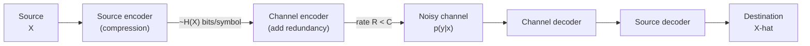
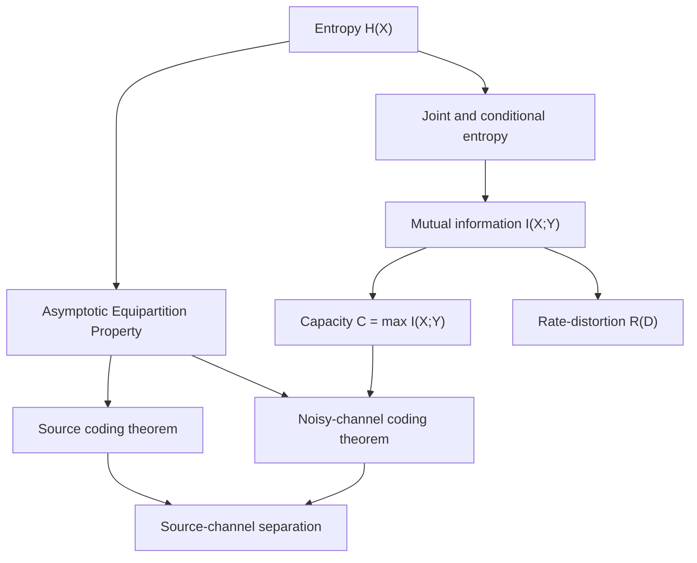
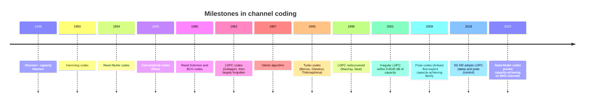
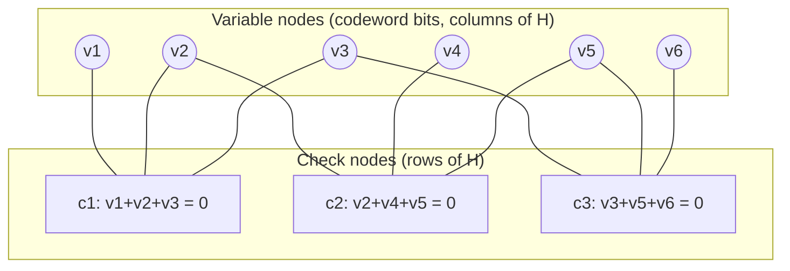

# Information &amp; Coding Theory

[Advanced Topics](../) &raquo; Information &amp; Coding Theory

<div class="advanced-note" markdown="1">
**Graduate-level reference.** Theorem-oriented treatment of Shannon theory and the coding theory that realizes it. **Prerequisites:** probability, linear algebra over finite fields, basic real analysis. The standard textbook is Cover &amp; Thomas, *Elements of Information Theory* (2nd ed.); for modern codes, Richardson &amp; Urbanke, *Modern Coding Theory*. For applied error detection in protocols see [Networking](../../technology/networking/).
</div>

**Information theory** quantifies how much can be said about a random quantity, how compactly it can be stored, and how quickly it can be sent through a noisy medium. **Coding theory** builds the explicit codes that approach those limits with efficient encoders and decoders. Claude Shannon's 1948 paper answered the two founding questions — *how far can a source be compressed?* and *how fast can data cross a noisy channel reliably?* — with sharp limits computed from one quantity, entropy, and showed that the two problems **separate**: compress to the entropy, then protect against noise at any rate below capacity, and nothing is lost by designing the two stages independently.

## Overview

A point-to-point communication system has the structure below. Each block corresponds to one of the theorems on this page.



| Block | Governing limit | Result | Practical realizations |
|---|---|---|---|
| Source encoder (lossless) | Entropy $H(X)$ | Source coding theorem | Huffman, arithmetic coding, ANS, Lempel–Ziv |
| Source encoder (lossy) | Rate–distortion function $R(D)$ | Rate–distortion theorem | Transform codecs, vector quantization, neural codecs |
| Channel encoder/decoder | Capacity $C = \max I(X;Y)$ | Noisy-channel coding theorem | LDPC, polar, turbo, Reed–Solomon |
| Whole chain | $H(X) < C$ (or $R(D) < C$) | Source–channel separation | Almost every digital system |

The results form a dependency chain. Entropy and its conditional variants are defined first; mutual information falls out as "shared uncertainty"; the Asymptotic Equipartition Property (AEP) turns averages into counting statements about typical sequences; and both coding theorems are proved by counting typical sequences.



## Entropy and Information Measures

### Shannon entropy

The **surprise** of an outcome of probability $p$ is $\log(1/p)$: rare events carry more information. Entropy is the expected surprise, equivalently the average number of bits needed to describe the outcome.

<div class="theory-card" markdown="1">
#### Definition (Entropy)
For a discrete random variable $X$ with probability mass function $p(x)$ on alphabet $\mathcal{X}$,

$$H(X) = -\sum_{x \in \mathcal{X}} p(x) \log_2 p(x) = \mathbb{E}\!\left[\log_2 \frac{1}{p(X)}\right].$$

The unit is the **bit** with $\log_2$ and the **nat** with $\ln$; by convention $0 \log 0 = 0$.
</div>

Entropy is not an arbitrary choice. Shannon's uniqueness theorem (refined by Khinchin and Faddeev) shows that any measure $H(p_1,\dots,p_n)$ that is continuous, increasing in $n$ for uniform distributions, and satisfies the **grouping rule** (splitting an outcome into sub-outcomes adds the weighted entropy of the split) must equal $-K\sum_i p_i \log p_i$ for some $K>0$. The only freedom is the base of the logarithm.

For a Bernoulli($p$) variable the entropy is the **binary entropy function** $H_b(p) = -p\log_2 p - (1-p)\log_2(1-p)$. It is zero at $p \in \{0,1\}$, peaks at 1 bit when $p = \tfrac12$, and is concave and symmetric. A coin with $p = 0.11$ has $H_b(0.11) \approx 0.50$ bits, so a long run of its flips can in principle be stored in about half the naive length. The same curve reappears below as the capacity of the binary symmetric channel.

<figure style="margin:1.5rem auto; max-width:520px;">
<svg viewBox="0 0 500 290" width="100%" role="img" aria-label="Binary entropy H_b(p) and binary symmetric channel capacity 1 - H_b(p) plotted against p from 0 to 1" style="color:currentColor; background:transparent; font-family:inherit;">
<line x1="50" y1="210" x2="455" y2="210" stroke="currentColor" stroke-width="1"/>
<line x1="50" y1="210" x2="50" y2="25" stroke="currentColor" stroke-width="1"/>
<g stroke="currentColor" stroke-opacity="0.15" stroke-width="1"><line x1="50" y1="30" x2="450" y2="30"/><line x1="50" y1="120" x2="450" y2="120"/><line x1="250" y1="30" x2="250" y2="210"/><line x1="450" y1="30" x2="450" y2="210"/></g>
<g fill="currentColor" font-size="12" text-anchor="middle"><text x="50" y="226">0</text><text x="150" y="226">0.25</text><text x="250" y="226">0.5</text><text x="350" y="226">0.75</text><text x="450" y="226">1</text><text x="250" y="248">crossover / bias probability p</text></g>
<g fill="currentColor" font-size="12" text-anchor="end"><text x="44" y="214">0</text><text x="44" y="124">0.5</text><text x="44" y="34">1</text></g>
<text x="16" y="120" fill="currentColor" font-size="12" text-anchor="middle" transform="rotate(-90 16 120)">bits</text>
<polyline fill="none" stroke="currentColor" stroke-width="2.25" points="50,210.0 54,195.5 58,184.5 62,175.0 66,166.4 74,151.1 82,137.6 90,125.6 98,114.7 106,104.8 114,95.8 122,87.6 130,80.1 138,73.2 146,66.9 154,61.2 162,56.0 170,51.4 178,47.2 186,43.5 194,40.3 202,37.6 210,35.2 218,33.3 226,31.9 234,30.8 242,30.2 250,30.0 258,30.2 266,30.8 274,31.9 282,33.3 290,35.2 298,37.6 306,40.3 314,43.5 322,47.2 330,51.4 338,56.0 346,61.2 354,66.9 362,73.2 370,80.1 378,87.6 386,95.8 394,104.8 402,114.7 410,125.6 418,137.6 426,151.1 434,166.4 438,175.0 442,184.5 446,195.5 450,210.0"/>
<polyline fill="none" stroke="currentColor" stroke-width="2" stroke-dasharray="6 4" points="50,30.0 54,44.5 58,55.5 62,65.0 66,73.6 74,88.9 82,102.4 90,114.4 98,125.3 106,135.2 114,144.2 122,152.4 130,159.9 138,166.8 146,173.1 154,178.8 162,184.0 170,188.6 178,192.8 186,196.5 194,199.7 202,202.4 210,204.8 218,206.7 226,208.1 234,209.2 242,209.8 250,210.0 258,209.8 266,209.2 274,208.1 282,206.7 290,204.8 298,202.4 306,199.7 314,196.5 322,192.8 330,188.6 338,184.0 346,178.8 354,173.1 362,166.8 370,159.9 378,152.4 386,144.2 394,135.2 402,125.3 410,114.4 418,102.4 426,88.9 434,73.6 438,65.0 442,55.5 446,44.5 450,30.0"/>
<line x1="70" y1="272" x2="100" y2="272" stroke="currentColor" stroke-width="2.25"/><line x1="265" y1="272" x2="295" y2="272" stroke="currentColor" stroke-width="2" stroke-dasharray="6 4"/><g fill="currentColor" font-size="12"><text x="106" y="276">H_b(p): source entropy</text><text x="301" y="276">1 - H_b(p): BSC capacity</text></g>
</svg>
<figcaption style="text-align:center; font-size:0.9em;">Binary entropy (solid) and the capacity of a binary symmetric channel with crossover probability p (dashed).</figcaption>
</figure>

### Joint and conditional entropy; the chain rule

For $(X,Y)\sim p(x,y)$ the **joint entropy** is $H(X,Y) = -\sum_{x,y} p(x,y)\log_2 p(x,y)$. The **conditional entropy** is the uncertainty left in $Y$ once $X$ is known:

$$H(Y \mid X) = -\sum_{x,y} p(x,y) \log_2 p(y \mid x) = \sum_x p(x)\, H(Y \mid X = x).$$

These satisfy the **chain rule**, the most-used identity in the subject:

$$H(X,Y) = H(X) + H(Y \mid X), \qquad H(X_1,\dots,X_n) = \sum_{i=1}^{n} H(X_i \mid X_1,\dots,X_{i-1}).$$

Conditioning never increases entropy on average, $H(Y\mid X) \le H(Y)$, with equality iff $X$ and $Y$ are independent. (A *particular* observation $X = x$ can increase uncertainty; only the average cannot.)

### Bounds and maximum entropy

$$0 \le H(X) \le \log_2 |\mathcal{X}|,$$

with the lower bound attained iff $X$ is deterministic and the upper bound iff $X$ is uniform. More generally, among all distributions satisfying linear moment constraints $\mathbb{E}[f_k(X)] = \alpha_k$, entropy is maximized by the exponential-family form $p(x) \propto \exp\big(\sum_k \lambda_k f_k(x)\big)$: the geometric distribution under a mean constraint on $\{0,1,2,\dots\}$, the Gaussian under a variance constraint on $\mathbb{R}$.

### Differential entropy

For a continuous density $f$, the **differential entropy** is $h(X) = -\int f(x)\log_2 f(x)\,dx$. It can be negative and is not invariant under change of variables ($h(aX) = h(X) + \log_2|a|$), so it is not a limit of discrete entropy; but differences such as mutual information remain well defined. The key example: for $X\sim\mathcal{N}(\mu,\sigma^2)$,

$$h(X) = \tfrac{1}{2}\log_2\!\left(2\pi e\,\sigma^2\right),$$

and this is the largest differential entropy of any density with variance $\sigma^2$. That extremal property is why Gaussian noise is the worst case for a power-limited channel.

## Relative Entropy and Mutual Information

### Relative entropy (Kullback–Leibler divergence)

$$D(p \,\|\, q) = \sum_{x} p(x) \log_2 \frac{p(x)}{q(x)}$$

is the expected number of extra bits per symbol paid for coding a $p$-source with a code optimized for $q$. **Gibbs' inequality** gives $D(p\,\|\,q) \ge 0$ with equality iff $p = q$. KL divergence is not a metric (it is asymmetric and violates the triangle inequality), but it is the exponent that governs hypothesis testing: by **Stein's lemma**, the best type-II error probability at fixed type-I error decays as $2^{-n D(p\|q)}$. Cross-entropy training loss in machine learning is $H(p) + D(p\,\|\,q_\theta)$, so minimizing it minimizes the divergence from the data distribution.

### Mutual information

<div class="theory-card" markdown="1">
#### Definition (Mutual Information)
$$I(X;Y) = D\big(p(x,y) \,\big\|\, p(x)p(y)\big) = H(X) - H(X \mid Y) = H(X) + H(Y) - H(X,Y).$$
</div>

Mutual information is the reduction in uncertainty about $X$ from observing $Y$. It is symmetric, non-negative, and zero iff $X$ and $Y$ are independent. The relations among the entropies are captured by the information diagram:

<figure style="margin:1.5rem auto; max-width:460px;">
<svg viewBox="0 0 440 210" width="100%" role="img" aria-label="Information diagram: two overlapping circles H(X) and H(Y); the overlap is I(X;Y), the left-only part is H(X|Y), the right-only part is H(Y|X), and the union is H(X,Y)" style="color:currentColor; background:transparent; font-family:inherit;">
<circle cx="170" cy="105" r="85" fill="currentColor" fill-opacity="0.08" stroke="currentColor" stroke-width="1.5"/>
<circle cx="270" cy="105" r="85" fill="currentColor" fill-opacity="0.08" stroke="currentColor" stroke-width="1.5"/>
<g fill="currentColor" font-size="13" text-anchor="middle"><text x="130" y="110">H(X|Y)</text><text x="220" y="110" font-weight="bold">I(X;Y)</text><text x="310" y="110">H(Y|X)</text><text x="120" y="14">H(X)</text><text x="320" y="14">H(Y)</text><text x="220" y="206">union = H(X,Y)</text></g>
</svg>
</figure>

The diagram is a mnemonic for two variables only: for three or more, the central "co-information" region can be negative.

### Data-processing and Fano inequalities

If $X \to Y \to Z$ is a Markov chain (so $Z$ is any processing of $Y$, deterministic or random), then

$$I(X;Z) \le I(X;Y).$$

No post-processing creates information about $X$ that $Y$ did not already carry. Equality holds iff $Z$ is a **sufficient statistic** of $Y$ for $X$.

**Fano's inequality** turns this into a bound on estimation error. For any estimator $\hat{X}$ of $X$ built from $Y$, with $P_e = \Pr[\hat{X} \ne X]$,

$$H(X \mid Y) \le H_b(P_e) + P_e \log_2\!\left(|\mathcal{X}| - 1\right) \le 1 + P_e \log_2 |\mathcal{X}|.$$

If the residual uncertainty $H(X\mid Y)$ is large, no estimator can have small error. Fano's inequality supplies the converse half of almost every coding theorem.

## The Asymptotic Equipartition Property

The AEP is the law of large numbers applied to $-\log p(X)$, and it is the engine behind both coding theorems.

<div class="principle-card" markdown="1">
#### Theorem (AEP)
If $X_1, X_2, \dots$ are i.i.d. with pmf $p$, then

$$-\frac{1}{n}\log_2 p(X_1,\dots,X_n) \xrightarrow{\ \text{prob}\ } H(X).$$

For $\epsilon>0$ define the **typical set** $A_\epsilon^{(n)}$ as the sequences with $2^{-n(H+\epsilon)} \le p(x^n) \le 2^{-n(H-\epsilon)}$. Then for large $n$: (i) $\Pr[A_\epsilon^{(n)}] > 1-\epsilon$; (ii) $|A_\epsilon^{(n)}| \le 2^{n(H+\epsilon)}$; (iii) $|A_\epsilon^{(n)}| \ge (1-\epsilon)\,2^{n(H-\epsilon)}$.
</div>

Of the $|\mathcal{X}|^n$ possible sequences, essentially all the probability sits on about $2^{nH(X)}$ of them, each roughly equally likely. Unless $X$ is uniform this is an exponentially small fraction of all sequences. Compression indexes the typical set with about $nH$ bits and spends a flag bit plus a raw description on the rare non-typical sequences. **Joint typicality** extends the idea to pairs $(x^n, y^n)$ and underlies the channel coding theorem. The AEP extends to stationary ergodic sources (the Shannon–McMillan–Breiman theorem), with $H$ replaced by the entropy rate.

## Source Coding

### Kraft–McMillan inequality

A code maps each symbol to a binary codeword. **Prefix codes** (no codeword is a prefix of another) decode instantaneously. Any **uniquely decodable** code has codeword lengths satisfying

$$\sum_{x \in \mathcal{X}} 2^{-\ell(x)} \le 1,$$

and conversely any lengths satisfying this admit a prefix code. So restricting to prefix codes loses nothing. Minimizing expected length $L = \sum_x p(x)\ell(x)$ subject to Kraft, ignoring integrality, gives $\ell^*(x) = -\log_2 p(x)$ and $L^* = H(X)$.

<div class="principle-card" markdown="1">
#### Theorem (Source Coding)
Every uniquely decodable code has $L \ge H(X)$, and there is a prefix code (for example with lengths $\lceil -\log_2 p(x) \rceil$) with

$$H(X) \le L < H(X) + 1.$$

Coding blocks of $n$ symbols reduces the overhead to $1/n$ bit per symbol, so the rate approaches $H(X)$. For a stationary source the limit is the **entropy rate** $\mathcal{H} = \lim_{n\to\infty} \tfrac{1}{n} H(X_1,\dots,X_n)$.
</div>

### Huffman coding

Huffman's algorithm builds the optimal symbol-by-symbol prefix code by repeatedly merging the two least-probable nodes. For $p = (0.5, 0.25, 0.125, 0.125)$ on $(a,b,c,d)$ it yields $a=0$, $b=10$, $c=110$, $d=111$, with $L = 1.75$ bits, which equals $H(X)$ exactly because every probability is a power of two (a dyadic source). For non-dyadic sources the gap to entropy can approach 1 bit per symbol when one symbol dominates.

```python
import heapq
from itertools import count

def huffman(probs):
    """Return an optimal prefix code {symbol: bitstring} for a pmf."""
    tie = count()                       # tie-breaker so the heap never compares dicts
    heap = [(p, next(tie), {s: ""}) for s, p in probs.items()]
    heapq.heapify(heap)
    if len(heap) == 1:                  # degenerate one-symbol source
        return {s: "0" for s in probs}
    while len(heap) > 1:
        p0, _, c0 = heapq.heappop(heap)
        p1, _, c1 = heapq.heappop(heap)
        merged = {s: "0" + w for s, w in c0.items()}
        merged.update({s: "1" + w for s, w in c1.items()})
        heapq.heappush(heap, (p0 + p1, next(tie), merged))
    return heap[0][2]

probs = {"a": 0.5, "b": 0.25, "c": 0.125, "d": 0.125}
code = huffman(probs)                   # {'a': '0', 'b': '10', 'c': '110', 'd': '111'}
L = sum(probs[s] * len(w) for s, w in code.items())   # 1.75
```

### Arithmetic coding and ANS

**Arithmetic coding** removes Huffman's integer-length restriction by encoding the whole message as a subinterval of $[0,1)$: the interval is repeatedly subdivided in proportion to the (possibly adaptive) symbol probabilities, and any binary fraction inside the final interval identifies the message. A block of $n$ symbols costs fewer than $nH(X) + 2$ bits, so the per-symbol redundancy is $O(1/n)$ however skewed the source. Because the model can change at every symbol, arithmetic coding is the natural back end for context modeling: **CABAC** in H.264/HEVC/VVC is a binary arithmetic coder driven by adaptive context models.

**Asymmetric numeral systems (ANS)**, introduced by Jarek Duda (2009–2013), achieve arithmetic-coding compression at roughly Huffman speed by keeping the state in a single integer that is updated with table lookups (tANS) or a multiply-and-shift (rANS). ANS is now the entropy stage of Zstandard (as "FSE"), Apple's LZFSE, JPEG XL, and several GPU and genomics codecs.

| Property | Huffman | Arithmetic | ANS |
|---|---|---|---|
| Bits per symbol | Integer | Fractional | Fractional |
| Redundancy | $< 1$ bit/symbol | $< 2$ bits/message | Near-arithmetic; small table-quantization loss |
| Adaptive models | Needs code rebuild | Natural | Possible (rANS); static tables typical for tANS |
| Speed | Very fast (table lookup) | Slower (per-symbol multiply/renormalize) | Near Huffman speed |
| Order | FIFO | FIFO | LIFO (encode in reverse) |
| Typical use | DEFLATE, JPEG baseline | CABAC, PPM, CM compressors | Zstandard, LZFSE, JPEG XL |

### Universal coding and the prediction–compression equivalence

Huffman and arithmetic coding need the source distribution. **Universal** codes do not. Lempel–Ziv parsing (LZ77, LZ78) replaces repeated substrings with back-references and achieves the entropy rate of *any* stationary ergodic source asymptotically; LZ77 plus Huffman is DEFLATE (gzip, PNG, zip), and LZ77 plus ANS is Zstandard.

Arithmetic coding also makes explicit that **compression equals prediction**: a model assigning probability $q(x_t \mid x_{<t})$ to each next symbol yields a code of length $-\sum_t \log_2 q(x_t \mid x_{<t})$ bits, which is exactly the model's cross-entropy (log-loss) on the data. Better predictors are better compressors. Delétang et al., "Language Modeling Is Compression" (ICLR 2024), made the point quantitatively: Chinchilla 70B driving an arithmetic coder compressed ImageNet patches to 43.4% of raw size and LibriSpeech audio to 16.4%, beating PNG (58.5%) and FLAC (30.3%), though the model's own size is not counted and it is far too slow for practical use. The same identity is the basis of the minimum description length (MDL) principle discussed on the [AI Mathematics](../ai-mathematics/) page.

## Channel Capacity and the Noisy-Channel Coding Theorem

### Discrete memoryless channels

A **discrete memoryless channel (DMC)** has input alphabet $\mathcal{X}$, output alphabet $\mathcal{Y}$, and transition probabilities $p(y\mid x)$ applied independently to each use.

<div class="theory-card" markdown="1">
#### Definition (Capacity)
$$C = \max_{p(x)} I(X;Y) \quad \text{bits per channel use.}$$
</div>

$I(X;Y)$ is concave in $p(x)$ for a fixed channel, so the maximization is a convex problem.

| Channel | Model | Capacity | Optimal input |
|---|---|---|---|
| Binary symmetric (BSC) | Each bit flipped with probability $p$ | $1 - H_b(p)$ | Uniform |
| Binary erasure (BEC) | Each bit erased ("?") with probability $\alpha$ | $1 - \alpha$ | Uniform |
| Z-channel | $1 \to 0$ with probability $p$; $0$ is error-free | $\log_2\!\big(1 + (1-p)\,p^{p/(1-p)}\big)$ | Non-uniform |
| AWGN (real, power $P$, noise variance $N$) | $Y = X + Z$, $Z\sim\mathcal{N}(0,N)$ | $\tfrac12\log_2(1 + P/N)$ | Gaussian |

For channels without a closed form, the **Blahut–Arimoto algorithm** (1972) computes capacity by alternating maximization; each iteration also gives upper and lower bounds on $C$, so it has a built-in stopping rule.

```python
import numpy as np

def dmc_capacity(W, iters=1000, tol=1e-12):
    """Blahut-Arimoto. W[x, y] = p(y|x). Returns (capacity in bits, optimal p(x))."""
    p = np.full(W.shape[0], 1.0 / W.shape[0])
    for _ in range(iters):
        q = p @ W                                        # induced output distribution
        with np.errstate(divide="ignore", invalid="ignore"):
            d = np.where(W > 0, W * np.log2(W / q), 0.0).sum(axis=1)  # D(W(.|x) || q)
        lower, upper = p @ d, d.max()                    # lower <= C <= upper
        if upper - lower < tol:
            break
        p = p * np.exp2(d)
        p /= p.sum()
    return lower, p

eps = 0.11
bsc = np.array([[1 - eps, eps], [eps, 1 - eps]])
C, p_opt = dmc_capacity(bsc)     # C ~ 0.5000 bits = 1 - H_b(0.11); p_opt = [0.5, 0.5]
```

### The coding theorem

<div class="principle-card" markdown="1">
#### Theorem (Shannon, 1948)
For a DMC of capacity $C$: for every rate $R < C$ there exist block codes of rate $R$ whose maximal error probability tends to $0$ as the block length $n \to \infty$ (**achievability**). Every sequence of codes with $R > C$ has error probability bounded away from zero (**weak converse**); in fact for DMCs it tends to one (**strong converse**, Wolfowitz).
</div>

**Achievability** is proved by random coding. Draw $2^{nR}$ codewords i.i.d. from the capacity-achieving input distribution; decode by finding the unique codeword jointly typical with the received sequence. The transmitted codeword is jointly typical with high probability, while any other codeword is jointly typical by chance with probability about $2^{-nI(X;Y)}$; a union bound over $2^{nR}$ competitors gives vanishing error when $R < I(X;Y)$. Since the error averaged over codebooks is small, some fixed codebook is good, and discarding its worst half of codewords turns average error into maximal error.

**The converse** applies Fano's inequality to the message $W$: $nR = H(W) \le I(W;\hat{W}) + 1 + P_e nR \le nC + 1 + P_e nR$, so $P_e \ge 1 - C/R - 1/(nR)$, which is bounded away from zero when $R > C$.

Feedback does not increase the capacity of a memoryless channel, though it can greatly simplify coding and improve error exponents.

### The Gaussian channel and the Shannon limit

For a band-limited AWGN channel with bandwidth $B$ (Hz), received power $P$, and one-sided noise spectral density $N_0$, the **Shannon–Hartley** formula is

$$C = B \log_2\!\left(1 + \frac{P}{N_0 B}\right) \quad \text{bits per second.}$$

Writing $P = E_b C$ (energy per information bit times bit rate) and letting the spectral efficiency $C/B \to 0$ gives the ultimate power-efficiency limit

$$\frac{E_b}{N_0} \ge \ln 2 \approx 0.693, \quad \text{i.e. about } -1.59 \text{ dB}.$$

No code, at any bandwidth, communicates reliably below this ratio. With parallel Gaussian sub-channels of different noise levels (OFDM tones, MIMO eigenmodes), the capacity-achieving power allocation is **water-filling**: pour power into the quietest sub-channels first, up to a common "water level".

### Finite blocklength

The coding theorem is asymptotic. Real systems use blocks of hundreds to tens of thousands of bits, and ultra-reliable low-latency links (5G URLLC, control loops) use very short blocks. Polyanskiy, Poor, and Verdú (2010) gave the second-order **normal approximation** for the largest number of messages $M^*(n,\epsilon)$ decodable with error probability $\epsilon$ at blocklength $n$:

$$\log_2 M^*(n,\epsilon) = nC - \sqrt{nV}\, Q^{-1}(\epsilon) + O(\log n),$$

where $V$ is the **channel dispersion** (the variance of the information density) and $Q^{-1}$ is the inverse Gaussian tail function. The rate penalty shrinks only as $1/\sqrt{n}$: for the BSC with $p = 0.11$ ($C \approx 0.50$, $V \approx 0.89$), blocklength $n = 1000$ and block error $\epsilon = 10^{-3}$, the approximation gives about 0.41 bits per use, roughly 18% below capacity. Benchmarking modern short codes against this bound, rather than against $C$, is now standard.

## Error-Correcting Codes

Shannon's proof shows that good codes exist but gives no efficient decoder; a random code of length $n$ needs exponential-time decoding. Coding theory supplies **structured** codes with fast encoders and decoders. The history splits into an *algebraic* era (distance guarantees, bounded-distance decoding) and a *modern* era (sparse graphs and iterative or successive decoding that operate near capacity).



### Linear block codes

An $[n,k,d]$ **linear code** over $\mathbb{F}_q$ is a $k$-dimensional subspace of $\mathbb{F}_q^n$ with minimum Hamming distance $d$. It has rate $R = k/n$, a **generator matrix** $G$ ($\mathbf{c} = \mathbf{m}G$), and a **parity-check matrix** $H$ with $GH^\top = 0$, so every codeword satisfies $\mathbf{c}H^\top = 0$. For a linear code, $d$ equals the minimum weight of a nonzero codeword. A code detects up to $d-1$ errors, corrects up to $t = \lfloor (d-1)/2 \rfloor$ errors, or corrects up to $d-1$ erasures.

The fundamental bounds relate $n$, $k$, and $d$:

| Bound | Statement | Type | Codes meeting it |
|---|---|---|---|
| Singleton | $d \le n - k + 1$ | Upper | MDS codes (Reed–Solomon) |
| Hamming (sphere packing) | $q^k \sum_{i=0}^{t} \binom{n}{i}(q-1)^i \le q^n$ | Upper | Perfect codes: Hamming, Golay |
| Gilbert–Varshamov | Codes exist with $q^k \sum_{i=0}^{d-2}\binom{n-1}{i}(q-1)^i < q^n$ | Existence (lower) | Random linear codes |
| Plotkin, Elias–Bassalygo, LP (MRRW) | Tighter upper bounds at large $d/n$ | Upper | — |

Whether the Gilbert–Varshamov bound is asymptotically tight for binary codes is a long-standing open problem.

### Hamming codes

The $[7,4,3]$ **Hamming code** corrects any single error. Its parity-check matrix lists the binary numbers 1 to 7 as columns, so the **syndrome** $\mathbf{s} = H\mathbf{r}^\top$ of a received word is zero for a codeword and otherwise spells out the position of the flipped bit. Hamming codes are **perfect**: radius-1 spheres around the 16 codewords tile $\mathbb{F}_2^7$ exactly. Extended with an overall parity bit they become the SEC-DED codes of ECC memory.

```python
import numpy as np

# Parity-check matrix of the [7,4] Hamming code: column j is j in binary (MSB on top)
H = np.array([
    [0, 0, 0, 1, 1, 1, 1],
    [0, 1, 1, 0, 0, 1, 1],
    [1, 0, 1, 0, 1, 0, 1],
])

def correct(r):
    """Correct up to one bit error in a length-7 received word."""
    s = H @ r % 2                               # syndrome
    pos = int("".join(map(str, s)), 2)          # 1-based error position, 0 = none
    if pos:
        r = r.copy()
        r[pos - 1] ^= 1
    return r
```

### Reed–Solomon codes

**Reed–Solomon (RS)** codes evaluate a message polynomial of degree less than $k$ at $n$ distinct points of $\mathbb{F}_q$ (typically $q = 256$, so symbols are bytes, and $n \le q$). Two distinct polynomials of degree less than $k$ agree on at most $k-1$ points, so codewords differ in at least $n-k+1$ positions: RS codes are **MDS**, meeting the Singleton bound. An RS code corrects $\lfloor (n-k)/2 \rfloor$ symbol errors or $n-k$ erasures, and because errors are counted per symbol, a burst that corrupts every bit of a byte costs one unit of the budget. Berlekamp–Massey or Euclidean decoding runs in polynomial time; Guruswami–Sudan **list decoding** corrects beyond half the distance (up to $n - \sqrt{nk}$ errors).

Applications: CDs and DVDs (cross-interleaved RS), QR codes, deep-space telemetry (concatenated with convolutional codes on Voyager), DSL, RAID-6, and **erasure-coded storage**, where an object is split into $k$ data and $n-k$ parity fragments and survives the loss of any $n-k$ disks or nodes. Large storage systems also use **locally repairable codes** (for example Azure's LRC) that trade a little of RS's optimality for cheaper single-node repair.

### LDPC codes

**Low-density parity-check (LDPC)** codes, introduced by Gallager in 1962 and rediscovered in the 1990s, are linear codes with a **sparse** parity-check matrix. Sparsity allows near-linear-time decoding by **belief propagation** (the sum–product algorithm) on the code's bipartite **Tanner graph**: variable nodes (bits) and check nodes (parity equations) exchange log-likelihood-ratio messages for a fixed number of iterations or until all checks are satisfied.



**Density evolution** (Richardson–Urbanke) tracks the distribution of messages in the large-$n$ limit and predicts a sharp noise **threshold** below which decoding succeeds with high probability. Optimized irregular degree distributions push that threshold to within a few thousandths of a dB of capacity on the AWGN channel (Chung et al., 2001). **Spatially coupled** LDPC codes go further: their belief-propagation threshold provably rises to the optimal (MAP) threshold, a phenomenon called *threshold saturation*. The practical challenges are the **error floor** (a flattening of the error curve at low error rates caused by small graph substructures called trapping sets) and hardware-friendly structure, typically obtained with quasi-cyclic constructions.

LDPC codes are used in Wi-Fi (802.11n onward, including Wi-Fi 6/7), the 5G NR data channels, DVB-S2/S2X, 10GBASE-T and faster Ethernet PHYs, and the read channels of NAND flash SSDs.

### Turbo, polar, and Reed–Muller codes

**Turbo codes** (1993) concatenate two convolutional encoders through an interleaver and decode iteratively by exchanging soft information between two BCJR decoders. They were the first practical codes within about 1 dB of capacity and were used in 3G/4G LTE data channels and deep-space links.

**Polar codes** (Arıkan, 2009) are the first explicit, provably capacity-achieving codes for binary-input symmetric memoryless channels with $O(n\log n)$ encoding and decoding. Recursively combining two copies of a channel and splitting them creates synthetic channels that **polarize**: as $n$ grows, a fraction $C$ of them become nearly noiseless and the rest nearly useless. Information bits go on the good channels and known "frozen" bits on the bad ones. Plain successive-cancellation decoding is weak at short lengths; **CRC-aided successive-cancellation list decoding** (Tal–Vardy) makes polar codes competitive, and this is the form adopted for the 5G NR control channels.

**Reed–Muller (RM) codes** (1954) are among the oldest codes and are closely related to polar codes (both use the same Kronecker-power matrix, choosing rows differently). Whether they achieve capacity was open for decades. Kudekar et al. (2016) proved it for the erasure channel; Reeves and Pfister (2021) showed vanishing bit-error probability on binary memoryless symmetric (BMS) channels; and Abbe and Sandon (FOCS 2023) proved vanishing block-error probability, settling the question for BMS channels. Efficient decoding that matches this performance at long lengths remains an active research topic.

### Comparison

| Family | Structure | Guarantee | Decoder | Deployed in |
|---|---|---|---|---|
| Hamming / BCH | Algebraic, binary | Designed distance | Syndrome, Berlekamp–Massey | ECC DRAM, flash (older), teaching |
| Reed–Solomon | MDS over $\mathbb{F}_q$ | $d = n-k+1$ | Berlekamp–Massey, list decoding | QR, optical media, RAID-6, storage clusters |
| Convolutional | Shift-register trellis | Free distance | Viterbi | Legacy cellular, satellite, Wi-Fi (legacy rates) |
| Turbo | Parallel concatenated convolutional | Near capacity | Iterative BCJR | 3G/4G data, deep space |
| LDPC | Sparse parity-check graph | Near capacity (threshold) | Belief propagation | Wi-Fi, 5G data, DVB-S2, Ethernet, SSDs |
| Polar | Channel polarization | Achieves capacity (BMS) | SC list + CRC | 5G control channels |
| Reed–Muller | Evaluations of Boolean polynomials | Achieves capacity (BMS, 2023) | Recursive / list (research) | Research; historical deep space (Mariner 9) |

## Rate–Distortion Theory

Lossless compression stops at $H(X)$, and continuous sources cannot be described losslessly with finitely many bits at all. **Rate–distortion theory** asks: at average distortion at most $D$ under a per-symbol measure $d(x,\hat{x})$, what is the least rate needed?

<div class="theory-card" markdown="1">
#### Definition (Rate–Distortion Function)
$$R(D) = \min_{p(\hat{x} \mid x)\,:\,\mathbb{E}[d(X,\hat{X})] \le D} I(X;\hat{X}).$$
</div>

The **rate–distortion theorem** states that $R(D)$ is exactly the minimum achievable rate at distortion $D$, proved by a random-coding argument that mirrors the channel theorem. $R(D)$ is non-increasing and convex, and it is the *dual* of capacity: capacity maximizes mutual information over the input, rate–distortion minimizes it over the "test channel" from source to reconstruction. Blahut–Arimoto computes both.

Two closed forms:

- **Gaussian source, squared error.** For $X\sim\mathcal{N}(0,\sigma^2)$,

  $$R(D) = \max\!\left(0,\ \tfrac{1}{2}\log_2 \frac{\sigma^2}{D}\right).$$

  Each additional bit per sample divides the distortion by four (about 6.02 dB per bit), and for $D \ge \sigma^2$ the mean alone suffices. For a vector of independent Gaussians with different variances the optimal allocation is **reverse water-filling**: components with variance below a threshold get zero bits.

- **Bernoulli($p$) source, Hamming distortion** ($p \le \tfrac12$):

  $$R(D) = \max\!\big(0,\ H_b(p) - H_b(D)\big) \quad \text{for } 0 \le D \le p.$$

**Source–channel separation** combines the two halves: a source can be sent over a channel and reconstructed with distortion $D$ iff $R(D) \le C$ (per channel use, with matched symbol rates), and it loses nothing to design the source code and channel code separately. Separation can fail for multi-user networks and for finite blocklengths, which is one motivation for joint source–channel coding.

Every lossy codec is an engineering approximation of $R(D)$: transform coding (DCT in JPEG, MDCT in AAC and Opus) decorrelates the source so that reverse water-filling can be approximated by quantizing coefficients separately. **Learned (neural) image and video codecs**, trained end-to-end on a loss of the form $R + \lambda D$ with an entropy model driving an arithmetic coder, now outperform hand-designed codecs such as VVC intra coding in rate–distortion terms in research benchmarks, at much higher decoding cost. JPEG AI, the first standardized learning-based image codec, was completed by the JPEG committee in 2025. For perceptual quality, **rate–distortion–perception** theory (Blau and Michaeli, 2019) adds a constraint on the divergence between source and reconstruction distributions and shows that realism costs extra rate.

## Quantum Information Measures

Replace probability distributions by **density operators** $\rho$ (positive semidefinite, unit trace). Shannon entropy becomes the **von Neumann entropy**

$$S(\rho) = -\mathrm{Tr}\left(\rho \log_2 \rho\right) = -\sum_i \lambda_i \log_2 \lambda_i,$$

where $\lambda_i$ are the eigenvalues of $\rho$; for diagonal $\rho$ it reduces to Shannon entropy. Schumacher compression (1995) is the quantum source coding theorem: $n$ copies of a source with average state $\rho$ can be compressed into about $nS(\rho)$ qubits. Quantum mechanics also adds new behavior:

- **Negative conditional entropy.** Classically $H(X,Y) \ge H(X)$. For a maximally entangled pair of qubits, $S(\rho_{AB}) = 0$ while $S(\rho_A) = S(\rho_B) = 1$, so $S(A\mid B) = S(\rho_{AB}) - S(\rho_B) = -1$. Negative conditional entropy has an operational meaning in **state merging**: it counts entanglement gained rather than consumed.
- **Holevo bound.** The classical information accessible from an ensemble $\{p_i, \rho_i\}$ is at most $\chi = S\big(\sum_i p_i \rho_i\big) - \sum_i p_i S(\rho_i)$. Hence $n$ qubits convey at most $n$ classical bits despite their continuous parameters (or $2n$ with pre-shared entanglement, via superdense coding).
- **Strong subadditivity.** $S(\rho_{ABC}) + S(\rho_B) \le S(\rho_{AB}) + S(\rho_{BC})$ (Lieb–Ruskai, 1973), equivalent to non-negativity of quantum conditional mutual information, is the deepest general inequality of the theory.
- **Many capacities.** A quantum channel has distinct classical, private, and quantum capacities; the quantum capacity is not additive in general and needs regularization, and entanglement assistance changes the answer.

Quantum error correction transfers classical coding ideas to qubits. Stabilizer codes are built from pairs of classical codes (CSS construction), and **quantum LDPC codes** are the active frontier: IBM's bivariate-bicycle "gross" code, $[[144,12,12]]$, encodes 12 logical qubits in 144 data qubits (Bravyi et al., *Nature*, 2024), roughly an order of magnitude fewer physical qubits than a surface code of similar distance. Details, together with the threshold theorem, are on the [Quantum Algorithms Research](../quantum-algorithms-research/) page.

## Key Takeaways

- **Entropy is forced by its axioms.** Continuity, monotonicity, and grouping determine $-\sum p\log p$; it is the lossless compression limit and the building block of every other measure.
- **Mutual information is shared information.** It defines capacity, obeys the data-processing inequality, and with Fano's inequality supplies converse bounds.
- **Capacity is a sharp threshold, approached at rate $1/\sqrt{n}$.** Error can be made arbitrarily small below $C$ and not above it; channel dispersion measures the finite-length penalty.
- **Compression is prediction.** Huffman, arithmetic coding, and ANS turn a probability model into bits; the code length is the model's log-loss.
- **Modern codes operate at the limit.** LDPC and polar codes run within a fraction of a dB of capacity in Wi-Fi, 5G, and storage; Reed–Muller codes were proved capacity-achieving in 2023.
- **Lossy compression has its own limit.** $R(D)$ is the dual of capacity and the target every lossy and learned codec approximates.

## See Also

<div class="see-also-card" markdown="1">
**Related advanced topics**
- [AI Mathematics](../ai-mathematics/) — information bottleneck, MDL, PAC-Bayes, and learning as compression
- [Quantum Algorithms Research](../quantum-algorithms-research/) — quantum error correction, the Holevo bound, and fault tolerance
- [Cryptography](../cryptography/) — perfect secrecy, min-entropy, randomness extraction, and code-based post-quantum schemes
- [Distributed Systems Theory](../distributed-systems-theory/) — erasure-coded replication and storage
- [Complexity Theory](../complexity-theory/) — Kolmogorov complexity and the limits of compression

**Applied and foundational**
- [Networking](../../technology/networking/) — checksums, CRCs, and reliable transmission in practice
- [Cybersecurity](../../technology/cybersecurity/) — hash functions, entropy, and key material
- [Statistical Mechanics](../../physics/statistical-mechanics/) — Boltzmann and Gibbs entropy
- [AI/ML Documentation](../../ai-ml/) — cross-entropy and KL divergence in practice
- [Mathematical Reference](../../reference/) — probability and linear-algebra quick reference
</div>
