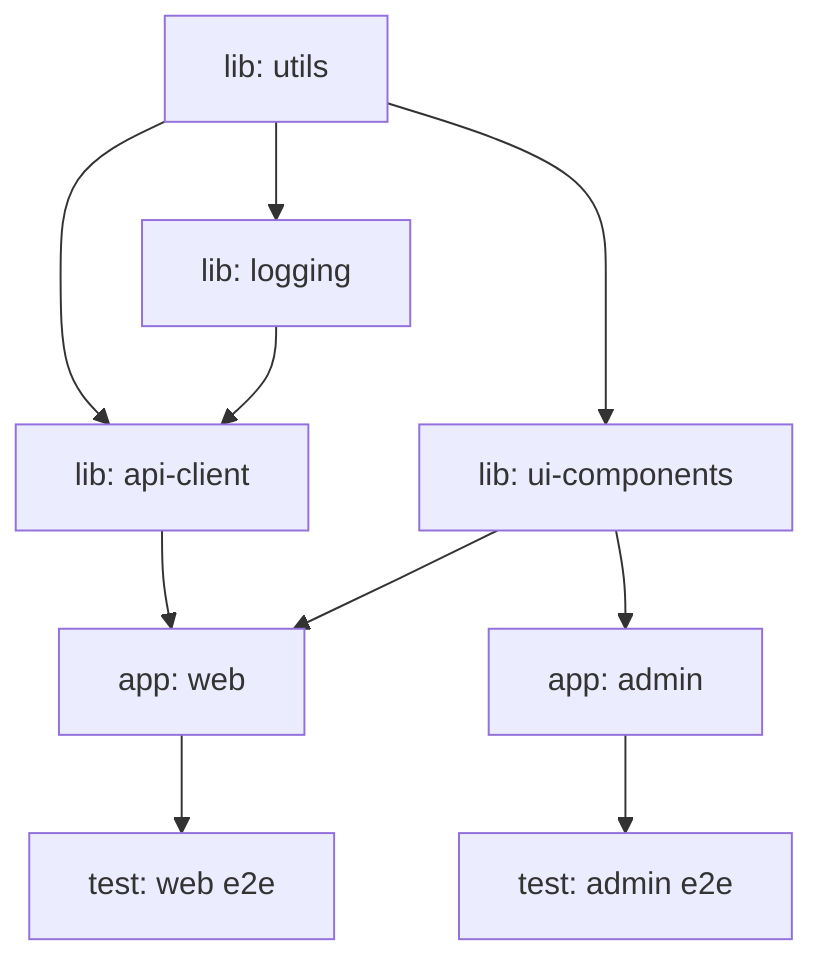
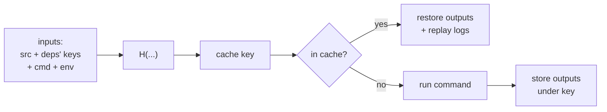
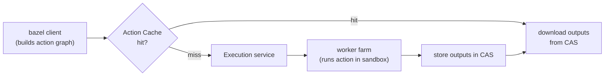

<div class="hero-section" style="background: linear-gradient(135deg, #232526 0%, #414345 100%); color: white; padding: 3rem 2rem; margin: -2rem -3rem 2rem -3rem; text-align: center;">
  <h1 style="color: white; margin: 0; font-size: 2.5rem;">Monorepos: Scaling &amp; Engineering</h1>
  <p style="font-size: 1.25rem; margin-top: 1rem; opacity: 0.9;">Build graphs, remote execution, dependency rules, ownership, and the VCS techniques that keep a repository workable at billion-line scale</p>
</div>

[Advanced Topics](./) &raquo; Monorepos: Scaling &amp; Engineering

<div class="advanced-note" markdown="1">
**Advanced engineering deep-dive.** This page is for platform, build, and infrastructure engineers who already run a monorepo and need it to stay fast as it grows past the point where naïve "build everything" stops working. **Helpful background:** dependency graphs and topological ordering, distributed systems, content-addressed caching, and Git internals. For monorepo fundamentals, the polyrepo trade-off, and tool selection, start with [Monorepo Strategies and Management](../monorepo/). For pipeline basics see [CI/CD Pipelines](../../technology/ci-cd/); for the VCS mechanics see the [Git Reference](../../technology/git-reference.html).
</div>

<div class="intro-card" markdown="1">
<p class="lead-text">A monorepo's central problem is not <em>storage</em> — modern VCS can hold an enormous tree — it is <strong>work amplification</strong>. With <em>N</em> projects in one repository, the temptation is to rebuild and retest all <em>N</em> on every change, turning an O(1) edit into O(N) CI. Everything on this page is, at bottom, a technique to break that coupling: model the code as a graph, compute the small set a change actually affects, cache results so identical inputs are never recomputed, distribute the remaining work across many machines, and keep the working tree on disk small enough to clone and index. Get these right and a 100-engineer monorepo feels as fast as a single small repo; get them wrong and CI becomes the bottleneck that dooms the whole strategy.</p>
</div>

<div class="key-insights">
  <div class="insight-card"><i class="fas fa-project-diagram"></i><h4>The graph is the substrate</h4><p>Every scaling technique — affected analysis, caching, remote execution, parallelism — is an operation on the project dependency DAG. Without an accurate graph, none of them are sound.</p></div>
  <div class="insight-card"><i class="fas fa-bullseye"></i><h4>Affected, not everything</h4><p>A change touches a set of files; those map to nodes; the transitive reverse-dependency closure of those nodes is the only work that must run. Everything else is provably unaffected.</p></div>
  <div class="insight-card"><i class="fas fa-server"></i><h4>Push work off the laptop</h4><p>Remote execution turns a build into a distributed map over a worker pool; remote caching means an input built anywhere is built once, ever, across the whole org.</p></div>
  <div class="insight-card"><i class="fas fa-hard-drive"></i><h4>Don't materialize what you don't need</h4><p>Sparse checkout and virtual filesystems let a developer see and edit a billion-file repo while only a few thousand files ever hit local disk.</p></div>
</div>

## The Build Graph as the Unit of Scale

Naïve monorepo CI scales linearly with repository size: every push reruns the full build and test suite, so cost grows as the repo grows even though an individual change rarely touches more than a handful of projects. The fix is to make the *graph* — not the repository — the unit of work.

A monorepo's code is modelled as a directed acyclic graph (DAG) of **targets** (Bazel's term) or **projects/tasks** (Nx, Turborepo). Each node has:

- a set of **inputs** (source files, configuration, the versions of its dependencies' outputs, the toolchain),
- a **command** that transforms those inputs, and
- a set of **outputs** (compiled artifacts, test results, bundles).

An edge `A -> B` means *B depends on A*: B's inputs include A's outputs. Acyclicity is non-negotiable — a cycle has no valid topological build order — which is why monorepo tools enforce "no circular dependencies" as a hard rule.



### Affected-Target Analysis

The core algorithm of every scaling monorepo tool is **affected-target analysis**. Given a changeset (typically the diff between a feature branch and a merge base), it answers: *which targets must rebuild and retest?*

The procedure is:

1. **Map changed files to source nodes.** Each modified file belongs to exactly one project/package; that project is *directly affected*.
2. **Compute the reverse-dependency (downstream) closure.** A change to a node invalidates every node that transitively depends on it, because their inputs include its outputs. This is a graph reachability problem on the *reversed* edges.
3. **Add graph-structure changes.** Editing a `BUILD`/`project.json`/`package.json` can add or remove edges, so dependency-manifest changes are treated as affecting the project (and sometimes the whole graph).

Formally, let $G = (V, E)$ be the build graph with edge $u \to v$ meaning "*v* depends on *u*". Let $C \subseteq V$ be the set of directly-changed projects. The affected set is the closure under the reverse reachability relation:

$$
A(C) = \{\, v \in V : \exists\, u \in C \text{ with a directed path } u \rightsquigarrow v \,\} \cup C
$$

In words: a node is affected iff it *is* changed or *depends, transitively, on* something changed. Computing $A(C)$ is a multi-source breadth-first search from $C$ over $E$, running in $O(|V| + |E|)$ — linear in the graph, independent of how large the unaffected portion is.

```python
from collections import deque

def affected(changed, dependents):
    """changed: set of directly-changed node ids.
       dependents: adjacency where dependents[u] = nodes that depend on u.
       Returns the transitive set of affected nodes (BFS over reverse edges)."""
    seen, queue = set(changed), deque(changed)
    while queue:
        node = queue.popleft()
        for d in dependents.get(node, ()):  # who depends on `node`
            if d not in seen:
                seen.add(d)
                queue.append(d)
    return seen
```

The corresponding CLI invocations across tools:

```bash
# Nx: build/test only what the diff against main affects
nx affected --target=build --base=origin/main --head=HEAD
nx affected --target=test  --base=origin/main --head=HEAD

# Turborepo: filter by changed packages since a ref
turbo run build --filter=...[origin/main]
turbo run test  --filter=...[origin/main]

# Bazel: query the reverse dependencies of changed targets, then build them
bazel query "rdeps(//..., set($(git diff --name-only origin/main | \
  sed 's|/[^/]*$||' | sort -u | sed 's|^|//|;s|$|/...|' )))" \
  | xargs bazel test
```

<div class="tip-card" markdown="1">
#### Soundness depends on input completeness
Affected analysis is only correct if the graph captures *every* input that can change a target's output. A test that reads an environment variable, a build that pulls the current Git SHA, or a generator that hits the network all create **hidden inputs** — edges the tool can't see. The result is a target that *should* be affected but isn't, so CI passes on a change that actually broke it. This is why hermetic build systems (Bazel, Buck2) sandbox actions and declare inputs explicitly: it is the only way to make affected analysis trustworthy at scale.
</div>

### Merge-Base Selection and `nx-set-shas`

Affected analysis needs the right comparison point. On a pull request, the base is the merge-base with the target branch. On `main` after a merge, the base should be the **last successfully-built commit**, not the immediate parent — otherwise a flaky or skipped CI run leaves a gap where some affected targets are never built. Nx ships `nrwl/nx-set-shas` for exactly this: it records the SHA of the last green pipeline and uses it as the base on subsequent runs.

```yaml
- uses: nrwl/nx-set-shas@v4
  # sets NX_BASE = last successful main build, NX_HEAD = HEAD
- run: nx affected --target=build --parallel=3
```

## Computation Caching: Build Once, Ever

Affected analysis shrinks the *set* of targets to run. Caching ensures that even within that set, no target is recomputed if its inputs have not changed.

### Content-Addressed Caching

Each cacheable target is reduced to a **cache key**: a hash of all of its inputs — source files, the resolved hashes of its dependencies' outputs, the command, environment, and toolchain version. Because the key is derived from inputs (it is *content-addressed*), identical inputs always map to the same key, and the key can be computed *before* running the command. The lookup is:

$$
\mathrm{key}(t) = H\big(\mathrm{srcs}(t) \,\|\, \mathrm{cmd}(t) \,\|\, \mathrm{env}(t) \,\|\, \{\, \mathrm{key}(d) : d \in \mathrm{deps}(t)\,\}\big)
$$

Note the recursion: a target's key folds in its dependencies' keys, so the hash propagates structurally up the graph. If `utils` changes, its key changes, which changes the key of `api-client`, which changes the key of `web` — exactly the targets affected analysis flagged. **Caching and affected analysis are two views of the same hash.**



On a cache hit the tool restores the stored outputs (and replays captured stdout/stderr so logs look identical) instead of running the command. A correctly-cached `test` target that hits is effectively free.

### Local vs Remote Cache

A **local cache** lives on one machine and helps an individual developer rebuild after switching branches. A **remote cache** is a shared, networked store (an object store like S3/GCS, or a managed service such as Nx Cloud or Turborepo Remote Cache) keyed by the same content hashes. With a remote cache, a target built by *any* developer or CI job is available to *everyone*: CI populates the cache on `main`, and a developer pulling the latest code gets warm artifacts for everything they didn't change.

```bash
# Turborepo remote cache (managed or self-hosted)
turbo login && turbo link              # managed Vercel cache
# self-hosted: point at your own server
TURBO_API=https://cache.internal TURBO_TOKEN=... turbo run build

# Nx Cloud remote cache + distributed execution
nx connect            # registers the workspace with Nx Cloud

# Bazel remote cache over gRPC/HTTP (any REAPI-compatible backend)
bazel build //... \
  --remote_cache=grpcs://remote.internal:443 \
  --remote_upload_local_results=true
```

<div class="warning-card" markdown="1">
#### Cache poisoning and the "read-only on PRs" rule
A remote cache is only as trustworthy as the inputs that produced its entries. If a target has a hidden input (see above), two genuinely different builds can collide on one key, and a *wrong* artifact gets served forever. The standard mitigations: (1) make builds hermetic so keys are complete; (2) give untrusted contexts (PR builds from forks) **read-only** access to the cache, letting only trusted `main` CI *write* entries; and (3) scope cache writes by a signed token so a compromised PR cannot poison the shared cache.
</div>

## Distributed and Remote Build Execution

Caching and affected analysis reduce *total* work; **distributed execution** parallelizes the work that remains across many machines. Two distinct mechanisms are often conflated:

| Mechanism | What is distributed | Granularity | Examples |
|-----------|--------------------|-------------|----------|
| **Distributed Task Execution (DTE)** | Whole targets/tasks of the build graph | Per-project (e.g. "build app A", "test lib B") | Nx Cloud DTE, Turborepo (via CI sharding) |
| **Remote Execution (RE)** | Individual build *actions* (a single compiler/test invocation) | Per-action (one `.o` file, one test shard) | Bazel/Buck2 over the Remote Execution API (REAPI) |

### Distributed Task Execution

DTE shards the affected target list across a pool of CI agents. A coordinator computes the graph, then hands each agent a slice respecting topological order — an agent cannot run `web`'s build until `ui` and `api` have been built (possibly by *other* agents), so completed outputs are exchanged through the remote cache.

```yaml
# Nx Cloud DTE: one coordinator + N agents that pull tasks off a shared queue
jobs:
  main:
    steps:
      - run: nx-cloud start-ci-run --distribute-on="8 linux-medium"
      - run: nx affected --target=build,test,lint --parallel=3
      # agents started by nx-cloud pick up tasks; outputs flow via the cache
```

The speedup is bounded by the graph's **critical path** — the longest chain of dependent targets, which no amount of parallelism can shorten. If `utils -> api -> web -> web-e2e` is the longest dependent chain, the build cannot finish faster than the sum of those four durations regardless of how many agents you add. This is Amdahl's law applied to the build DAG: with $W$ total work, critical-path length $L$, and $p$ workers, makespan is bounded below by

$$
T(p) \geq \max\!\left(L,\; \frac{W}{p}\right)
$$

so once $p \geq W/L$, adding workers buys nothing. Shortening the critical path (splitting a monolithic target, breaking a long dependency chain) is the only way past that floor — and is precisely why over-coupled graphs scale poorly even with a huge worker fleet.

### Remote Execution (REAPI)

Hermetic systems go finer-grained. Bazel and Buck2 decompose a build into thousands of individual **actions**, each a fully-declared `(input files, command, output files)` triple. Because actions are hermetic, any action can run on any worker in any order consistent with the DAG. The Remote Execution API standardizes this as three services:

1. **Content-Addressable Storage (CAS):** input/output blobs keyed by digest (`hash:size`).
2. **Action Cache (AC):** maps an action's digest to its cached result.
3. **Execution service:** schedules cache-missing actions onto a worker farm.



A developer on a laptop can drive a build whose compilation runs entirely on a remote farm of hundreds of cores, downloading only the final outputs they asked for. This is how Google/Meta-scale builds remain interactive: the client orchestrates, the farm computes, the CAS deduplicates.

## Dependency Management and Visibility Rules

Affected analysis presumes the graph is *accurate* and *acyclic*. At scale, the graph degrades unless actively governed — every undeclared dependency is a hidden input, and every accidental edge widens the affected set and the blast radius of a change.

### Visibility / Module Boundary Rules

Without constraints, any project can import any other, and the graph drifts toward a fully-connected "big ball of mud" where every change rebuilds everything. **Visibility rules** declare which targets may depend on which, and CI fails the build when a forbidden edge appears.

```python
# Bazel: a target lists who is allowed to depend on it
java_library(
    name = "internal_impl",
    srcs = glob(["impl/*.java"]),
    visibility = ["//billing:__subpackages__"],  # only billing/ may depend
)
```

Nx encodes the same idea with **tags** and an ESLint rule that bans cross-boundary imports:

```jsonc
// project.json — tag each project by type and scope
{ "tags": ["type:feature", "scope:checkout"] }
```

```jsonc
// .eslintrc — enforce-module-boundaries
"@nx/enforce-module-boundaries": ["error", {
  "depConstraints": [
    { "sourceTag": "type:feature", "onlyDependOnLibsWithTags": ["type:ui", "type:util"] },
    { "sourceTag": "scope:checkout", "onlyDependOnLibsWithTags": ["scope:checkout", "scope:shared"] }
  ]
}]
```

These rules do real architectural work: they keep the DAG shallow and well-layered, prevent feature teams from reaching into each other's internals, and bound the affected set so a `util` change does not accidentally cascade into unrelated domains because someone took an illicit shortcut.

### Single-Version Policy

Large monorepos almost universally adopt a **single-version policy (SVP)**: at most one version of any third-party dependency exists in the tree. The benefits are structural — no "diamond" version conflicts, no duplicated transitive copies bloating bundles, atomic upgrades that are tested across every consumer at once. The cost is real too: upgrading a widely-used dependency means fixing every breakage in one (large) change, which is why monorepos invest heavily in automated codemods and large-scale-change tooling.

```yaml
# pnpm catalogs: declare each dependency's version once, reference by name
catalog:
  react: ^18.2.0
  typescript: ^5.4.0
packages:
  - 'packages/*'
  - 'apps/*'
```

```jsonc
// a package references the catalog version instead of pinning its own
{ "dependencies": { "react": "catalog:" } }
```

Bazel's `bzlmod` (`MODULE.bazel`) enforces SVP at the build-system level by resolving the whole external dependency graph to a single version per module via Minimal Version Selection.

### Detecting Phantom and Undeclared Dependencies

A **phantom dependency** is a package a project imports but never declares — it works only because a hoisted `node_modules` happened to make it resolvable. Phantom deps are invisible to the graph, so affected analysis and caching silently miss them. Strict package managers (pnpm's non-flat `node_modules`, Rush's strict mode) and Bazel's sandboxing surface these by making undeclared imports *fail to resolve*, forcing every real edge into the declared graph.

## Code Ownership at Scale

One repository still needs many owners. `CODEOWNERS` maps path patterns to teams; the VCS host auto-requests review from the owning team and (with branch protection) blocks merge until they approve.

```
# .github/CODEOWNERS — last matching pattern wins
*                          @org/platform-eng
/apps/web/                 @org/web-team
/apps/web/src/checkout/    @org/checkout-team   # more specific overrides
/packages/ui-components/   @org/design-system
*.sql                      @org/data-platform
/.github/                  @org/release-eng
```

<div class="tip-card" markdown="1">
#### Ownership scales with the graph, not just the tree
`CODEOWNERS` is path-based, but the *meaningful* ownership boundary is the project graph. Aligning ownership to graph boundaries (each library/app owned by one team, boundary rules preventing cross-team reach-ins) means a change's required reviewers fall out naturally from the affected projects. Tooling like Nx's `nx affected --graph` or `bazel query 'rdeps(...)'` can surface *which teams* a change touches, so reviews are routed by impact rather than by accidental file location.
</div>

For finer control than `CODEOWNERS` offers — per-path minimum-approval counts, escalating sensitive directories — teams layer a policy file enforced in CI:

```typescript
// ownership.config.ts — augments CODEOWNERS with approval thresholds
export const ownership = {
  rules: [
    { pattern: 'packages/core/**',   owners: ['@core-team'],     minApprovals: 2 },
    { pattern: 'infra/terraform/**', owners: ['@platform-eng'],  minApprovals: 2 },
    { pattern: 'apps/**',            owners: ['@app-team'],       minApprovals: 1 },
  ],
};
```

## CI at Scale

Putting the pieces together, a monorepo CI pipeline is fundamentally different from a polyrepo pipeline: it is *change-driven*, not *repo-driven*. The shape is always the same — compute the affected set, fan it out across agents with caching, then converge.

### Dynamic Matrix Generation

Because the set of projects to build depends on the diff, the CI matrix must be *generated at runtime* rather than hard-coded:


```yaml
name: CI
on: { pull_request: { branches: [main] } }
jobs:
  setup:
    runs-on: ubuntu-latest
    outputs:
      matrix: ${{ steps.affected.outputs.matrix }}
    steps:
      - uses: actions/checkout@v4
        with: { fetch-depth: 0 }      # full history so merge-base resolves
      - uses: nrwl/nx-set-shas@v4
      - id: affected
        run: |
          APPS=$(nx show projects --affected --type app --json)
          echo "matrix={\"app\":$APPS}" >> "$GITHUB_OUTPUT"

  build:
    needs: setup
    if: ${{ needs.setup.outputs.matrix != '{"app":[]}' }}
    strategy:
      matrix: ${{ fromJson(needs.setup.outputs.matrix) }}
    runs-on: ubuntu-latest
    steps:
      - uses: actions/checkout@v4
      - run: nx build ${{ matrix.app }} --configuration=production
```


### The "Required Check" Problem

Branch protection wants a *fixed* set of required status checks, but a change-driven pipeline produces a *variable* set of jobs (a CSS-only change may run zero build jobs). The reconciliation is a **fan-in / convergence job** that always runs and reports the aggregate result; it is the single required check, and it passes only if every dynamically-generated job it depends on passed (or was correctly skipped):


```yaml
  ci-success:                       # the one required status check
    needs: [build, test, lint]
    if: always()
    runs-on: ubuntu-latest
    steps:
      - run: |
          # fail if any needed job failed (skipped is OK; failure/cancel is not)
          [[ "${{ contains(needs.*.result, 'failure') }}" == "false" ]] || exit 1
          [[ "${{ contains(needs.*.result, 'cancelled') }}" == "false" ]] || exit 1
```


### Flaky-Test Management

At scale, even a 0.1%-flaky test fails constantly: across thousands of test targets run on every PR, the probability that *some* test flakes approaches one. If $n$ independent test targets each pass with probability $1 - f$, the chance a run is *flake-free* is $(1-f)^n$, which collapses toward zero as $n$ grows — a 0.1% flake rate over 2000 targets gives only $(0.999)^{2000} \approx 0.135$, i.e. roughly 86% of green-code runs fail spuriously. Monorepos therefore treat flakiness as a first-class scaling problem: automatic retries with quarantine, flaky-test detection from historical pass/fail data, and dashboards that demote chronically-flaky targets out of the required path until fixed.

### Merge Queues

When many PRs target a busy `main`, testing each against a stale base is unsound — two individually-green PRs can conflict semantically once both land. A **merge queue** serializes integration: it tests each PR against the *prospective* `main` (with the PRs ahead of it already applied) before merging, optionally batching several together and bisecting on failure. Combined with affected analysis, the queue only reruns the targets a batch actually affects, keeping throughput high without sacrificing a green trunk.

## VCS Scaling: Keeping the Working Tree Tractable

The final scaling axis is the version-control system itself. A repository with millions of files and deep history strains `git status`, `git checkout`, and clone times — operations that are linear in working-tree or history size. The techniques below decouple "what the repo contains" from "what hits local disk."

### Partial and Shallow Clone

```bash
# Shallow clone: truncate history to the most recent commit(s)
git clone --depth=1 https://github.com/org/monorepo.git
git fetch --deepen=100            # pull more history on demand

# Partial clone: fetch commits + trees now, blobs lazily on access
git clone --filter=blob:none https://github.com/org/monorepo.git
# blobs are downloaded transparently the first time a file is read
```

A **partial clone** (`--filter=blob:none`) is usually preferable to a shallow clone for monorepos: it keeps full history (so `git log`, `blame`, and merge-base all work) while deferring the bulk — file *contents* — until actually needed. The trade is occasional latency when first touching an old blob.

### Sparse Checkout

Even with all blobs available, materializing every file is wasteful when a developer works on one corner of the tree. **Sparse checkout** restricts the working tree to a declared set of directories; the rest exist in the index but are never written to disk.

```bash
git sparse-checkout init --cone        # cone mode: directory-prefix based, fast
git sparse-checkout set apps/web packages/ui-components packages/utils
# working tree now contains only those subtrees (plus root files)
git sparse-checkout add packages/api-client   # widen the cone later
```

Cone mode trades the full flexibility of arbitrary pattern matching for performance: it matches on directory prefixes only, which keeps the pattern-matching cost proportional to the cone size rather than the whole tree. Combined with partial clone, a developer downloads and materializes only the subtree they own, even if the full repo is hundreds of gigabytes.

### Virtual / Scalar Filesystems

The endgame is to virtualize the filesystem entirely so files appear present but are hydrated on first access:

- **Microsoft's VFS for Git (formerly GVFS)** projects the Windows repo as a virtual filesystem; a 300 GB+ repo presents instantly and blobs stream in as files are opened. It was built precisely because vanilla Git could not handle the Windows monorepo.
- **Scalar** (now bundled with Git) is the modern, cross-platform successor that orchestrates partial clone, sparse checkout in cone mode, background prefetch, and filesystem monitoring without a custom virtual filesystem driver. `scalar clone` configures all of these for you.
- **Meta's EdenFS** (with the Sapling SCM) virtualizes the working copy on a Mercurial-derived backend, fetching file contents lazily and using `Watchman` to make `status` queries O(changed files) instead of O(tree).

```bash
# Scalar: one command sets up partial clone + cone sparse-checkout + prefetch
scalar clone https://github.com/org/monorepo.git
cd monorepo/src
git sparse-checkout set apps/web        # only hydrate what you work on
```

### Filesystem Monitor

`git status` is O(working-tree size) by default because it `lstat`s every tracked file. A **filesystem monitor** (`Watchman`, or Git's built-in `core.fsmonitor`) subscribes to OS change notifications so Git only re-examines files that actually changed — turning status into O(changed files). On a multi-million-file checkout this is the difference between a multi-second and a sub-second `status`.

```bash
git config core.fsmonitor true     # use the built-in fsmonitor daemon
git config core.untrackedcache true
git config core.preloadindex true  # parallelize index lstat on platforms without fsmonitor
```

<div class="key-insights">
  <div class="insight-card"><i class="fas fa-clone"></i><h4>Clone less</h4><p>Partial clone (<code>--filter=blob:none</code>) keeps full history but fetches file contents lazily, shrinking clone from hours to seconds on a huge repo.</p></div>
  <div class="insight-card"><i class="fas fa-folder-tree"></i><h4>Materialize less</h4><p>Cone-mode sparse checkout writes only the subtrees a developer declares, so the on-disk working tree is bounded by their area of ownership.</p></div>
  <div class="insight-card"><i class="fas fa-eye"></i><h4>Scan less</h4><p>A filesystem monitor makes <code>git status</code> O(changed files) instead of O(tree), keeping everyday commands instant.</p></div>
  <div class="insight-card"><i class="fas fa-magic"></i><h4>Virtualize the rest</h4><p>Scalar / VFS / EdenFS present the whole repo while hydrating blobs on first access — the only way Windows- and Meta-scale repos stay usable.</p></div>
</div>

## Putting It Together: A Scaling Checklist

<div class="tip-card" markdown="1">
#### From small monorepo to fleet-scale
1. **Model the graph accurately.** Declare every dependency; ban cycles; enforce module-boundary/visibility rules so the DAG stays layered.
2. **Make builds hermetic enough to trust the cache.** Sandbox actions or at least declare all inputs, so cache keys are complete and affected analysis is sound.
3. **Turn on local + remote caching.** Give `main` CI write access, PRs read-only access, and key everything by content hash.
4. **Compute affected, not everything.** Use merge-base-aware affected commands and record the last-green SHA on the trunk.
5. **Distribute the residual work.** DTE for project-level fan-out, or REAPI remote execution for action-level farms; remember the critical path is the floor.
6. **Make CI change-driven.** Dynamic matrices, a single fan-in required check, merge queues, and active flaky-test quarantine.
7. **Scale the VCS.** Partial clone + cone sparse checkout + fsmonitor; graduate to Scalar/VFS/EdenFS when the working tree outgrows plain Git.
</div>

## Key Takeaways

<div class="takeaway-grid">
  <div class="takeaway-card"><h4>The graph is the unit of scale</h4><p>Affected analysis, caching, and distribution are all operations on the project DAG; an inaccurate graph makes every one of them unsound.</p></div>
  <div class="takeaway-card"><h4>Affected = reverse-reachability</h4><p>The set to rebuild is the transitive downstream closure of changed nodes — a linear-time BFS over reversed edges, independent of unaffected repo size.</p></div>
  <div class="takeaway-card"><h4>Cache keys are content hashes</h4><p>Hashing inputs (including dependencies' keys) makes caching and affected analysis two views of the same computation; remote caches share the result org-wide.</p></div>
  <div class="takeaway-card"><h4>Critical path bounds parallelism</h4><p>Remote execution shrinks total work but cannot beat the longest dependency chain; shortening that chain is the only way past the floor.</p></div>
  <div class="takeaway-card"><h4>Boundaries keep the DAG shallow</h4><p>Visibility rules, single-version policy, and phantom-dependency detection prevent the graph from collapsing into a rebuild-everything mud ball.</p></div>
  <div class="takeaway-card"><h4>Decouple repo size from disk</h4><p>Partial clone, cone sparse checkout, fsmonitor, and virtual filesystems let a billion-file repo feel local while only a few thousand files hit disk.</p></div>
</div>

## See Also

<div class="see-also-card" markdown="1">
#### See Also

**Related Advanced Topics**
- [Monorepo Strategies and Management](../monorepo/) — Fundamentals, the polyrepo trade-off, tooling overview, and migration
- [Distributed Systems Theory](../distributed-systems-theory/) — The consistency and scheduling theory behind remote execution farms
- [Information & Coding Theory](../information-coding-theory/) — Content-addressed hashing and deduplication foundations
- [AI Mathematics](../ai-mathematics/) — Managing very large ML research codebases

**Applied Technology**
- [Git Reference](../../technology/git-reference.html) — Sparse checkout, partial/shallow clone, LFS, and fsmonitor
- [CI/CD Pipelines](../../technology/ci-cd/) — Change-driven pipelines and merge queues
- [Docker](../../technology/docker/) — Hermetic, containerized build environments
- [Performance Optimization](../../optimization/) — Build-time, caching, and parallelism optimization

**External Documentation**
- [Nx Affected](https://nx.dev/ci/features/affect) · [Turborepo](https://turbo.build) · [Bazel Remote Execution](https://bazel.build/remote/rbe) · [Remote Execution API](https://github.com/bazelbuild/remote-apis) · [Scalar](https://github.com/microsoft/scalar) · [Sapling/EdenFS](https://sapling-scm.com)
</div>
