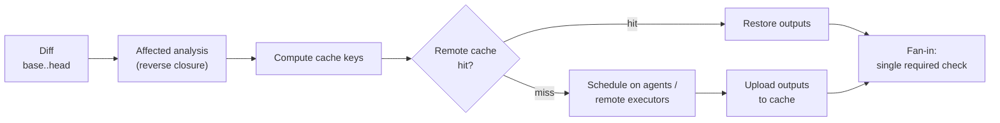
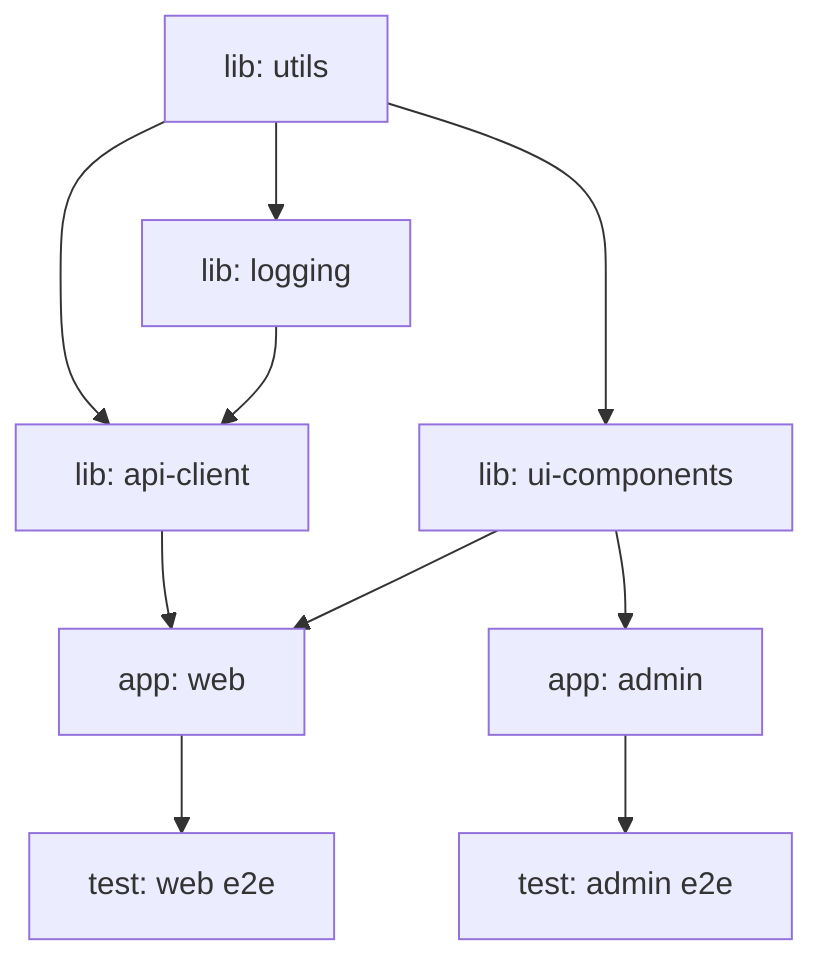
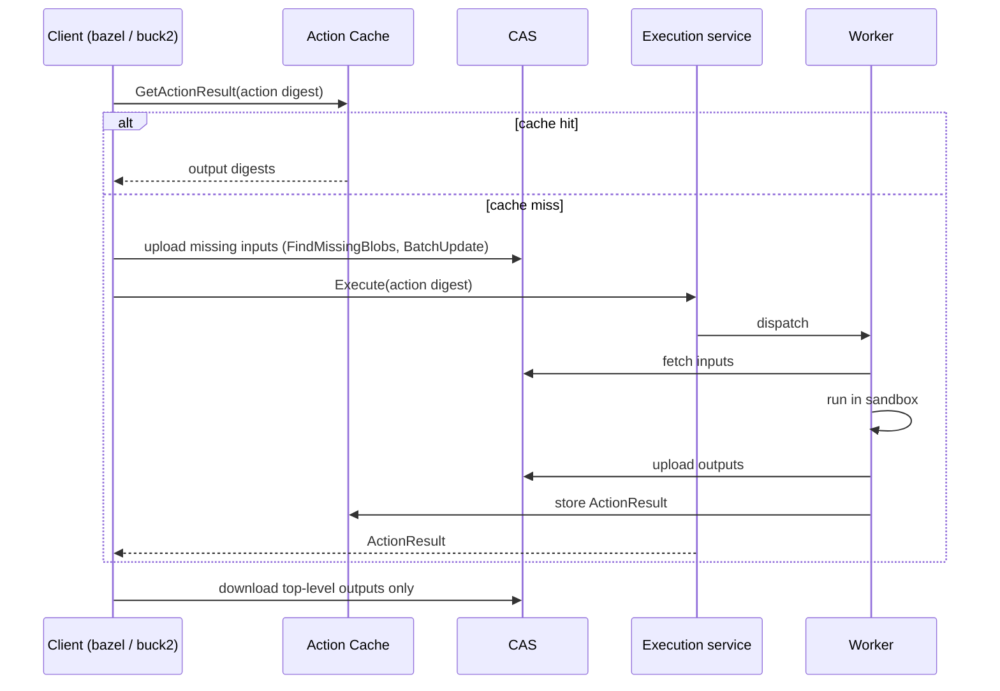
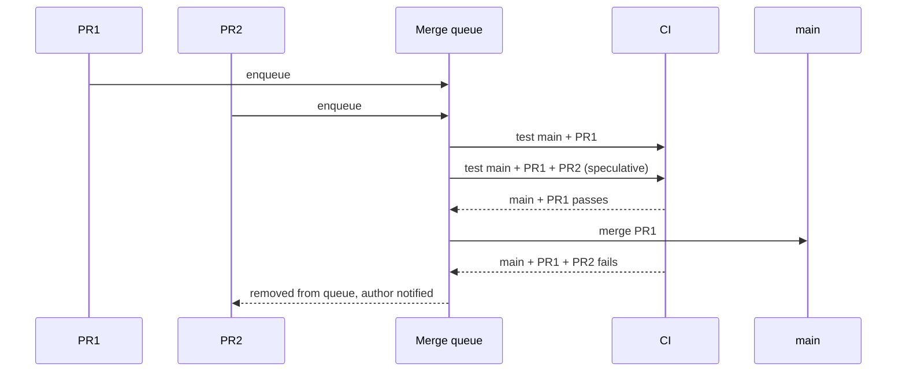
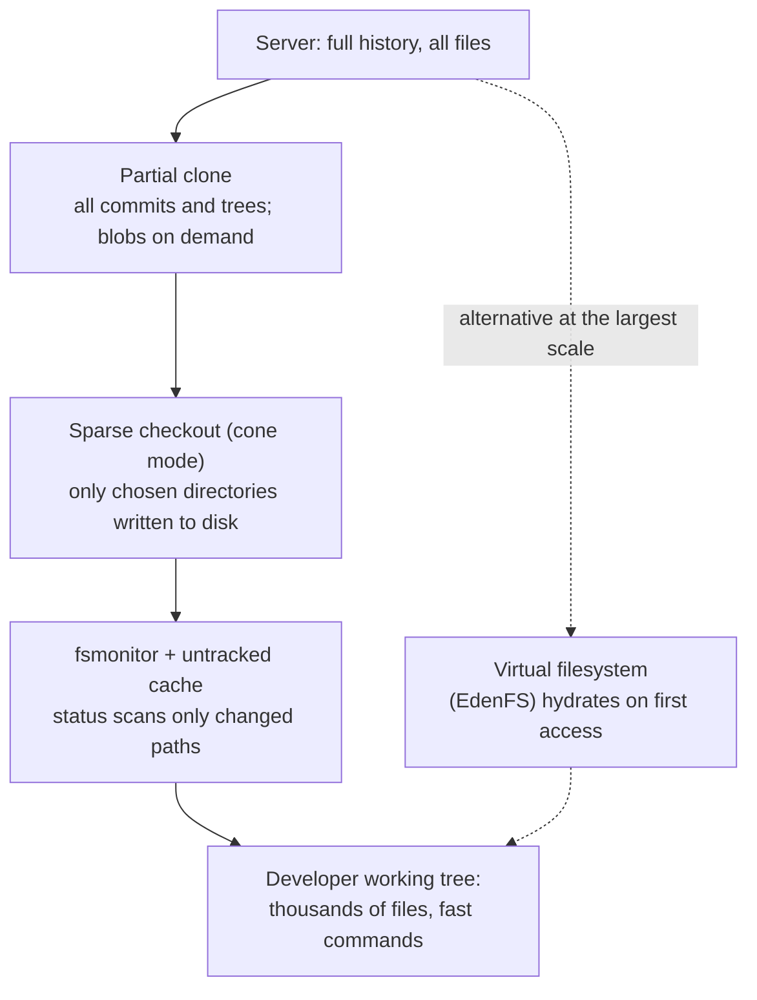

# Monorepos: Scaling &amp; Engineering

[Advanced Topics](../) &raquo; Monorepos: Scaling &amp; Engineering

<div class="advanced-note" markdown="1">
**Engineering deep-dive.** For platform, build, and infrastructure engineers running a monorepo that has outgrown "build everything on every push". **Background:** dependency graphs, content-addressed caching, basic distributed systems, and Git internals. Fundamentals and the polyrepo trade-off are in [Monorepo Strategies and Management](../monorepo/); tool-by-tool comparison is in [Tooling &amp; Build Systems](../monorepo-tooling/). Tool versions and commands on this page were checked in September 2026.
</div>

The scaling problem in a monorepo is not storage but **work amplification**. With $N$ projects in one repository, rebuilding and retesting everything on each change turns an $O(1)$ edit into $O(N)$ CI, and cost keeps growing with the repository even though a typical change touches a handful of projects. Each technique on this page breaks that coupling at a different layer:

| Layer | Technique | What it bounds |
|---|---|---|
| Graph | Affected-target analysis | Work to the downstream closure of the change |
| Results | Content-addressed caching | Recomputation to inputs never seen before, org-wide |
| Compute | Distributed task execution, remote execution | Wall-clock time to the critical path |
| Graph hygiene | Visibility rules, single-version policy, strict dependencies | Growth of the affected set over time |
| Process | Change-driven CI, merge queues, flaky-test quarantine | CI cost and trunk breakage per merge |
| VCS | Partial clone, sparse checkout, fsmonitor, virtual filesystems | Local disk and command latency to the area being worked on |

The first three layers compose into a single pipeline, shown below. Every one of them depends on the build graph being accurate.



## The Build Graph

A monorepo build is modeled as a directed acyclic graph (DAG) of **targets** (Bazel, Buck2, Pants) or **projects and tasks** (Nx, Turborepo). Each node has **inputs** (sources, configuration, dependencies' outputs, toolchain, relevant environment), a **command**, and **outputs** (artifacts, test results, bundles). An edge $A \to B$ means *B depends on A*. The graph must be acyclic, because a cycle has no valid build order; every monorepo tool rejects cycles.



Graph granularity matters. **Package-level** graphs (Nx, Turborepo, Rush) are cheap to compute from manifests and imports but coarse: any change to a package invalidates all of it. **File- or action-level** graphs (Bazel, Buck2, Pants) are declared in `BUILD` files or inferred and are far more precise, at the cost of maintaining the declarations.

### Affected-target analysis

Given a changeset, which targets must rebuild and retest?

1. **Map changed files to owning nodes.** These are *directly affected*.
2. **Take the downstream closure.** Everything that transitively depends on a changed node has changed inputs.
3. **Handle graph edits.** Changes to `BUILD`, `project.json`, `package.json`, lockfiles, or toolchain configuration can add or remove edges or affect every node; tools treat them conservatively.

Formally, let $G = (V,E)$ with $u \to v$ meaning "$v$ depends on $u$", and let $C \subseteq V$ be the directly changed nodes. The affected set is

$$A(C) = C \cup \{\, v \in V : \exists\, u \in C \text{ with a directed path from } u \text{ to } v \,\}.$$

It is computed by a multi-source breadth-first search over the dependents adjacency list in $O(|V| + |E|)$, and in practice only the reachable part is visited.

```python
from collections import deque

def affected(changed, dependents):
    """changed: directly changed node ids.
    dependents[u]: nodes that depend directly on u.
    Returns the downstream closure (changed nodes included)."""
    seen, queue = set(changed), deque(changed)
    while queue:
        node = queue.popleft()
        for d in dependents.get(node, ()):
            if d not in seen:
                seen.add(d)
                queue.append(d)
    return seen
```

Tool invocations:

```bash
# Nx
nx affected -t build test lint --base=origin/main --head=HEAD
nx show projects --affected --base=origin/main       # list only

# Turborepo 2.1+: compares against the default branch; in CI set the refs explicitly
TURBO_SCM_BASE=origin/main TURBO_SCM_HEAD=HEAD turbo run build test --affected
turbo run build --filter='...[origin/main]'           # older filter syntax, still supported

# Bazel: use a target-determination tool rather than hand-built rdeps queries
bazel-diff generate-hashes -w "$PWD" -b "$(which bazel)" base.json    # at the base commit
bazel-diff generate-hashes -w "$PWD" -b "$(which bazel)" head.json    # at the head commit
bazel-diff get-impacted-targets -sh base.json -fh head.json -o impacted.txt
bazel test --target_pattern_file=impacted.txt
```

For Bazel, mapping file paths to packages with shell scripts and feeding them to `rdeps()` misses changes to `.bzl` macros, `MODULE.bazel`, toolchains, and flags. **bazel-diff** (hash-based, fast) and **target-determinator** (bazel-contrib; compares configured targets at both commits, slower but more precise) exist for this. Neither is perfect: hash-based tools can under-select, and configured-graph comparison can over-select changes such as comment-only edits.

<div class="tip-card" markdown="1">
#### Soundness depends on input completeness
Affected analysis is only correct if the graph captures every input that can change an output. A test that reads an environment variable, a build stamping the current Git SHA, a code generator that hits the network, or a script that globs outside its package are **hidden inputs**: edges the tool cannot see. The target should be affected but is not, and CI passes on a change that broke it. Hermetic systems (Bazel, Buck2) sandbox actions so undeclared inputs are unreadable; JavaScript task runners rely on explicit `inputs` and environment declarations in `nx.json` or `turbo.json`, which must be kept honest.
</div>

### Choosing the base commit

On a pull request the base is the merge-base with the target branch (clone with `fetch-depth: 0`, or at least enough history to resolve it). On the trunk after a merge, the base should be the **last commit whose CI succeeded**, not the parent: otherwise a failed or skipped run leaves changes that are never rebuilt. `nrwl/nx-set-shas` finds that commit via the GitHub API and exports `NX_BASE`/`NX_HEAD`; the same idea applies to any tool.

```yaml
- uses: actions/checkout@v4
  with: { fetch-depth: 0 }
- uses: nrwl/nx-set-shas@v5        # v5 runs on the node24 Actions runtime
- run: npx nx affected -t build test lint
```

## Computation Caching: Build Once, Ever

Affected analysis shrinks the set of targets; caching ensures that no target in that set is recomputed for inputs already seen by anyone.

A target's **cache key** is a hash of everything that determines its output:

$$\mathrm{key}(t) = \mathrm{hash}\big(\mathrm{srcs}(t),\ \mathrm{cmd}(t),\ \mathrm{env}(t),\ \mathrm{toolchain}(t),\ \{\mathrm{key}(d) : d \in \mathrm{deps}(t)\}\big).$$

Because dependency keys are folded in, a change to `utils` changes the key of `api-client`, then `web`: exactly the nodes affected analysis selects. **Caching and affected analysis are two views of the same hash.** Bazel refines this further: an action's key uses its dependencies' *output digests*, not their keys, so if a change to `utils` leaves its compiled output byte-identical (a comment edit, say), downstream actions still hit the cache. This "early cutoff" requires reproducible outputs.

On a hit, the tool restores outputs and replays captured logs instead of running the command; a cached test run costs a download.

### Local and remote caches

A **local cache** helps one machine across branch switches. A **remote cache** shares entries across every developer and CI job: trunk CI populates it, and developers pulling the trunk get warm results for everything they did not change.

```bash
# Turborepo: Vercel Remote Cache, or any server implementing the open cache API
turbo login && turbo link
TURBO_API=https://cache.internal TURBO_TEAM=myteam TURBO_TOKEN=... turbo run build

# Nx: Nx Cloud (or a self-hosted cache server implementing Nx's remote cache API)
npx nx connect

# Bazel: any Remote Execution API (REAPI) backend - bazel-remote, BuildBuddy,
# EngFlow, NativeLink, Buildbarn, Buildfarm
bazel build //... --remote_cache=grpcs://cache.internal:443
```

Since Bazel 7, **Build without the Bytes** is the default (`--remote_download_outputs=toplevel`): intermediate outputs stay in the remote store and only the requested top-level artifacts are downloaded, which removes most network traffic from remote-cached builds.

<div class="warning-card" markdown="1">
#### Cache poisoning
A shared cache serves whatever was stored under a key. With a hidden input, two different builds can share one key and a wrong artifact is served until the key changes; a malicious writer can deliberately plant one. Standard mitigations: make keys complete (hermeticity); let only trusted trunk CI **write**, and give PR builds, especially from forks, **read-only** tokens; scope write tokens per pipeline; and for release artifacts, rebuild without the cache or verify provenance (for example SLSA attestations).
</div>

## Distributed and Remote Execution

Caching and affected analysis reduce total work. **Distribution** parallelizes what remains. Two mechanisms are often confused:

| Mechanism | Unit distributed | Coordination | Examples |
|---|---|---|---|
| **Distributed task execution (DTE)** | Whole tasks ("build app A", "test lib B") | Coordinator hands tasks to CI agents; outputs move via the remote cache | Nx Agents (Nx Cloud), CI sharding with Turborepo |
| **Remote execution (RE)** | Individual actions (one compile, one test shard) | Client submits actions to a scheduler; workers read inputs from CAS | Bazel, Buck2, Pants over REAPI |

### Distributed task execution

A coordinator computes the task graph and assigns tasks to agents in dependency order; an agent cannot start `web` until `ui` and `api-client` are built, possibly on other agents. In Nx the agent pool is declared in a versioned file and started with `start-nx-agents`:

```yaml
# .nx/ci-config.yaml
dte:
  distribute-on: 8 linux-medium-js
```

```yaml
# CI job
- run: npx nx-cloud start-nx-agents
- run: npx nx affected -t build test lint e2e
```

The older form, `nx-cloud start-ci-run --distribute-on="..."`, still works but does not read `.nx/ci-config.yaml`; a workspace uses one or the other.

### The critical-path bound

With total work $W$, **critical path** length $L$ (the longest chain of dependent targets, weighted by duration), and $p$ workers, any schedule's makespan $T(p)$ satisfies

$$\max\!\left(L,\ \frac{W}{p}\right) \le T(p) \le \frac{W}{p} + L,$$

where the upper bound is achieved by any greedy list scheduler (Graham, 1966; Brent). Once $p$ exceeds about $W/L$, more workers barely help. The only remaining lever is to shorten $L$: split a monolithic library, break long chains, or move slow end-to-end tests off the critical path. This is why over-coupled graphs scale poorly no matter how large the worker fleet.

### Remote execution (REAPI)

Hermetic build systems decompose a build into thousands of **actions**, each a fully declared (inputs, command, outputs) triple. The **Remote Execution API** (bazelbuild/remote-apis), shared by Bazel, Buck2, Pants, and others, defines:

1. **Content-Addressable Storage (CAS):** blobs keyed by digest (hash and size), deduplicated across all builds.
2. **Action Cache (AC):** maps an action digest to its result (output digests, exit code, logs).
3. **Execution service:** schedules cache-missing actions onto a worker pool.



A laptop can drive a build whose compilation runs on thousands of remote cores, which is how Google-, Meta-, and Uber-scale builds remain interactive. The operational cost is running the farm (or buying it as a service), keeping worker images identical to the declared toolchain, and debugging actions that behave differently remotely than locally.

## Keeping the Graph Healthy

Affected analysis is only as good as the graph, and graphs degrade: every undeclared dependency is a hidden input, and every unnecessary edge enlarges the affected set of every change upstream of it.

### Visibility and module-boundary rules

Without constraints, any project can import any other and the graph drifts toward a densely connected tangle where most changes rebuild most things. **Visibility rules** declare who may depend on what, and the build fails on a forbidden edge.

```python
# Bazel BUILD file: only targets under //billing may depend on this
java_library(
    name = "internal_impl",
    srcs = glob(["impl/*.java"]),
    visibility = ["//billing:__subpackages__"],
)
```

Nx expresses the same rule with project **tags** and an ESLint rule (flat config, `eslint.config.mjs`):

```js
// eslint.config.mjs
import nx from "@nx/eslint-plugin";

export default [
  ...nx.configs["flat/base"],
  {
    files: ["**/*.ts", "**/*.tsx"],
    rules: {
      "@nx/enforce-module-boundaries": ["error", {
        depConstraints: [
          { sourceTag: "type:feature",   onlyDependOnLibsWithTags: ["type:ui", "type:util"] },
          { sourceTag: "scope:checkout", onlyDependOnLibsWithTags: ["scope:checkout", "scope:shared"] },
        ],
      }],
    },
  },
];
```

```json
{ "name": "checkout-feature", "tags": ["type:feature", "scope:checkout"] }
```

Boundary rules keep the DAG layered, stop teams reaching into each other's internals, and cap the blast radius of a low-level change.

### Single-version policy

Most large monorepos enforce a **single-version policy**: one version of each third-party dependency in the tree. It eliminates diamond conflicts and duplicate copies and makes every upgrade atomic and tested against all consumers. The cost is that upgrading a widely used dependency means fixing every consumer in one change, which is why large monorepos invest in codemods and large-scale-change tooling (Google's Rosie, for example, splits such changes into reviewable shards).

In the JavaScript ecosystem, pnpm **catalogs** (pnpm 9.5+) declare each version once in the workspace file:

```yaml
# pnpm-workspace.yaml
packages:
  - "apps/*"
  - "packages/*"
catalog:
  react: ^19.1.0
  typescript: ^5.9.0
```

```json
{ "dependencies": { "react": "catalog:" } }
```

Bazel resolves external dependencies with **Bzlmod** (`MODULE.bazel`) using Minimal Version Selection, producing one version per module across the graph. Bzlmod is mandatory from Bazel 9, which removed the legacy `WORKSPACE` mechanism.

### Phantom dependencies

A **phantom dependency** is imported but never declared; it resolves only because a hoisted `node_modules` happened to contain it. It is invisible to the graph, so affected analysis and caching silently ignore it, and it breaks when the hoisting changes. pnpm's isolated `node_modules` layout, Yarn Plug'n'Play, Rush's strict mode, and Bazel's sandboxing make undeclared imports fail to resolve, forcing every real edge into the declared graph.

## Code Ownership

One repository still has many owners. A `CODEOWNERS` file maps path patterns to teams; the host requests reviews from owners, and branch protection or rulesets can require their approval.

```text
# .github/CODEOWNERS - the LAST matching pattern wins
*                          @org/platform-eng
/apps/web/                 @org/web-team
/apps/web/src/checkout/    @org/checkout-team
/packages/ui-components/   @org/design-system
*.sql                      @org/data-platform
/.github/                  @org/release-eng
```

`CODEOWNERS` is path-based and flat: one owner set per file, no per-directory approval counts, and no inheritance rules beyond "last match wins". Very large repositories use hierarchical **OWNERS** files (Chromium, Google, Kubernetes via Prow), where each directory's file adds to its parents' owners and approval means an owner of every touched directory has approved. Whatever the mechanism, align ownership with graph boundaries: if each project has one owning team, the set of reviewers a change needs follows directly from the directly-changed projects, and the affected set tells you which downstream teams to notify.

## Change-Driven CI

A monorepo pipeline is driven by the change, not by the repository: compute the affected set, fan out across agents with caching, then converge on one result.

### Dynamic matrices

Because the set of jobs depends on the diff, the CI matrix is generated at runtime:


```yaml
name: CI
on:
  pull_request:
    branches: [main]
jobs:
  setup:
    runs-on: ubuntu-latest
    outputs:
      apps: ${{ steps.affected.outputs.apps }}
    steps:
      - uses: actions/checkout@v4
        with: { fetch-depth: 0 }
      - uses: nrwl/nx-set-shas@v5
      - run: npm ci
      - id: affected
        run: echo "apps=$(npx nx show projects --affected --type app --json)" >> "$GITHUB_OUTPUT"

  build:
    needs: setup
    if: ${{ needs.setup.outputs.apps != '[]' }}
    strategy:
      fail-fast: false
      matrix:
        app: ${{ fromJson(needs.setup.outputs.apps) }}
    runs-on: ubuntu-latest
    steps:
      - uses: actions/checkout@v4
      - run: npm ci
      - run: npx nx build ${{ matrix.app }} --configuration=production
```


### One required check

Branch protection needs a fixed list of required checks, but a change-driven pipeline produces a variable set of jobs (a docs-only change may run none). The standard fix is a **fan-in job** that always runs and is the only required check:


```yaml
  ci-success:
    needs: [build, test, lint]
    if: always()
    runs-on: ubuntu-latest
    steps:
      - name: Fail if any needed job failed or was cancelled (skipped is fine)
        run: |
          [[ "${{ contains(needs.*.result, 'failure') }}" == "false" ]] || exit 1
          [[ "${{ contains(needs.*.result, 'cancelled') }}" == "false" ]] || exit 1
```


### Flaky tests

If $n$ independent test targets each fail spuriously with probability $f$, a run on correct code is fully green with probability $(1-f)^n \approx e^{-fn}$. At $f = 0.1\%$ and $n = 2000$ targets that is $e^{-2} \approx 0.135$: about 86% of runs on correct code fail somewhere. At scale, flakiness is a throughput problem, not an annoyance. Standard countermeasures:

- **Detect** from history: a target that both passed and failed on the same inputs (same cache key) is flaky by definition.
- **Retry** failed tests once or twice, and record retried passes as flaky signals rather than hiding them.
- **Quarantine** chronically flaky targets out of the required path, with an owner and a deadline.
- **Select tests predictively**: Meta and Google have both described models trained on historical results that choose the tests most likely to catch a given change; combined with affected analysis this cuts test cost further.

### Merge queues

When many PRs land on a busy trunk, testing each against a stale base is unsound: two PRs green in isolation can break the trunk together. A **merge queue** tests each PR against the prospective trunk, meaning the current trunk plus every PR ahead of it in the queue, and merges only if that combination passes. Queues typically **batch** PRs and **bisect** a failing batch to evict the culprit.



GitHub merge queue (generally available since 2023), GitLab merge trains, and third-party services (Mergify, Aviator, Graphite, Trunk) implement this; Uber's SubmitQueue added probabilistic speculation over which pending changes will pass. Because queue runs are also change-driven, affected analysis keeps each run proportional to the batch rather than the repository.

## VCS Scaling: Keeping the Working Tree Tractable

The last axis is version control. Plain Git operations like `status`, `checkout`, and `clone` scale with working-tree or history size; at millions of files and years of history they become the bottleneck. The goal is to decouple *what the repository contains* from *what is on local disk and scanned per command*.



### Partial and shallow clone

```bash
# Blobless partial clone: full commit and tree history, file contents fetched lazily
git clone --filter=blob:none https://github.com/org/monorepo.git

# Git 2.49+: prefetch missing blobs in large batches instead of one at a time
git backfill --sparse

# Shallow clone: truncated history (fine for throwaway CI jobs)
git clone --depth=1 https://github.com/org/monorepo.git
```

For developers, a **blobless partial clone** is usually better than a shallow clone: `log`, `merge-base`, and affected-analysis base resolution still work, and only file contents are deferred. The cost is latency when an old blob is first needed (for example by `blame`), which `git backfill` (experimental, Git 2.49+) mitigates by fetching needed blobs in batches. A **treeless** clone (`--filter=tree:0`) is smaller still but makes history-walking commands slow; it suits CI jobs that build one commit.

### Sparse checkout

Sparse checkout writes only declared directories to disk:

```bash
git sparse-checkout set --cone apps/web packages/ui-components packages/utils
git sparse-checkout add packages/api-client     # widen later
git sparse-checkout list
```

**Cone mode** (the default since Git 2.37) restricts patterns to directory prefixes, which lets Git match in time proportional to the number of cones rather than evaluating arbitrary gitignore-style patterns against every path. Enabling the **sparse index** (`git sparse-checkout init --cone --sparse-index`, or `index.sparse=true`) also shrinks the index itself to the cone, so commands like `status` and `add` scale with the cone rather than the whole tree. A useful refinement is to derive the cone from the build graph: check out a project plus its transitive dependencies (Nx and Bazel can both list them).

### Filesystem monitor and maintenance

Without help, `git status` `lstat`s every tracked file. A **filesystem monitor** subscribes to OS change notifications so Git examines only paths that changed.

```bash
git config core.fsmonitor true        # built-in daemon: Windows, macOS; Linux since Git 2.55 (inotify)
git config core.untrackedcache true
git maintenance start                 # background prefetch, commit-graph, incremental repack
```

On Linux, the built-in daemon uses one inotify watch per directory, so very large trees may need a higher `fs.inotify.max_user_watches`; before Git 2.55, Linux users relied on Watchman through a hook. `git maintenance` keeps the commit-graph and multi-pack index current, which keeps history walks and object lookups fast as the repository grows.

### Scalar and virtual filesystems

- **Scalar**, shipped with Git since 2.38, is a one-command setup for large repositories: `scalar clone` configures a blobless partial clone, cone-mode sparse checkout (initially just the root), fsmonitor, commit-graph, multi-pack index, and scheduled background maintenance. It grew out of Microsoft's work on the Windows and Office repositories.
- **VFS for Git** (formerly GVFS) virtualized the working tree on Windows so a 300 GB repository appeared instantly and files hydrated when opened. It is in maintenance mode, and Microsoft recommends Scalar for new deployments.
- **Sapling and EdenFS** (Meta, open-sourced 2022) pair a Mercurial-derived client with a virtual filesystem that fetches file contents lazily and answers `status` from its own change journal. Google's Piper with CitC workspaces is a proprietary system in the same design space.

```bash
scalar clone https://github.com/org/monorepo.git     # creates monorepo/src as the worktree
cd monorepo/src
git sparse-checkout set apps/web packages/ui-components
```

| Technique | Reduces | Cost | Typical use |
|---|---|---|---|
| Blobless partial clone | Clone size and time | Lazy fetch latency for old blobs | Developer clones |
| Treeless / shallow clone | Clone size further | Slow or unavailable history | Single-commit CI jobs |
| Cone sparse checkout + sparse index | Disk, checkout and status time | Must manage the cone | Developers on a subset |
| fsmonitor + untracked cache | `status` and `add` latency | Daemon, inotify limits on Linux | Any large working tree |
| Scalar | Setup effort for all of the above | Opinionated defaults | Large Git monorepos |
| Virtual filesystem (EdenFS) | Everything local, down to on-access | Custom VCS and daemon | Meta-scale repositories |

## Scaling Checklist

1. **Model the graph accurately.** Declare every dependency, forbid cycles, and enforce boundaries so the DAG stays layered.
2. **Make builds hermetic enough to trust the cache.** Sandbox actions or declare every input and environment variable.
3. **Enable local and remote caching.** Trunk CI writes; PRs read only; release builds verify provenance.
4. **Build what is affected.** Use merge-base-aware affected commands on PRs and the last-green SHA on the trunk; use a real target-determination tool with Bazel.
5. **Distribute the remainder.** DTE for task-level fan-out, REAPI for action-level farms; then shorten the critical path.
6. **Make CI change-driven.** Dynamic matrices, one fan-in required check, a merge queue, and active flaky-test quarantine.
7. **Scale Git.** Partial clone, cone sparse checkout with sparse index, fsmonitor, and `git maintenance`, or simply `scalar clone`; move to a virtual filesystem only at the very largest scale.

## Key Takeaways

- **The graph is the unit of scale.** Affected analysis, caching, and distribution all operate on the dependency DAG; an inaccurate graph makes each of them unsound.
- **Affected means downstream closure.** A linear-time search from the changed nodes over reversed edges, independent of the size of the unaffected repository.
- **Cache keys are content hashes.** Folding dependency keys into each key makes caching and affected analysis the same computation; a remote cache shares it org-wide.
- **The critical path is the floor.** Parallelism approaches $\max(L, W/p)$; beyond that, only restructuring the graph helps.
- **Boundaries preserve all of the above.** Visibility rules, a single-version policy, and strict dependency resolution keep the affected set small as the repository grows.
- **Decouple repository size from local cost.** Partial clone, sparse checkout, fsmonitor, and virtual filesystems keep daily Git commands proportional to the area being worked on.

## See Also

<div class="see-also-card" markdown="1">
**Related advanced topics**
- [Monorepo Strategies and Management](../monorepo/) — fundamentals, the polyrepo trade-off, migration, case studies
- [Monorepos: Tooling &amp; Build Systems](../monorepo-tooling/) — Bazel, Buck2, Pants, Nx, Turborepo, Rush compared
- [Distributed Systems Theory](../distributed-systems-theory/) — consistency and scheduling theory behind execution farms
- [Information &amp; Coding Theory](../information-coding-theory/) — hashing, content addressing, and erasure-coded storage

**Applied technology**
- [Git Reference](../../technology/git-reference.html) — sparse checkout, partial clone, LFS, fsmonitor
- [CI/CD Pipelines](../../technology/ci-cd/) — pipeline design and merge queues
- [Docker](../../technology/docker/) — containerized, reproducible build environments
- [Performance Optimization](../../optimization/) — build-time and parallelism optimization

**External documentation**
- [Nx: affected](https://nx.dev/docs/features/ci-features/affected) · [Nx Agents](https://nx.dev/docs/features/ci-features/distribute-task-execution) · [Turborepo: constructing CI](https://turborepo.dev/docs/crafting-your-repository/constructing-ci) · [Bazel remote execution](https://bazel.build/remote/rbe) · [Remote Execution API](https://github.com/bazelbuild/remote-apis) · [bazel-diff](https://github.com/Tinder/bazel-diff) · [target-determinator](https://github.com/bazel-contrib/target-determinator) · [Scalar](https://git-scm.com/docs/scalar) · [Sapling](https://sapling-scm.com)
</div>
