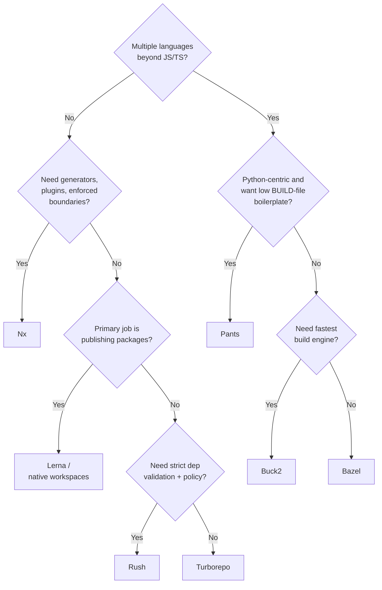

# Monorepos: Tooling &amp; Build Systems

[Monorepo Strategies](../monorepo/) &raquo; Tooling &amp; Build Systems

<div class="advanced-note" markdown="1">
**Advanced engineering deep-dive.** This page surveys the build-tool ecosystem that makes monorepos scale: the affected-graph runners (Nx, Turborepo), the publishing-oriented managers (Lerna, Rush), and the hermetic polyglot build systems (Bazel, Buck2, Pants). **Helpful background:** dependency graphs, content-addressed caching, and CI/CD pipelines. For the broader architecture and trade-offs see [Monorepo Strategies and Management](../monorepo/).
</div>

## Why Tooling Is the Whole Game

A monorepo without a graph-aware build tool is just a large folder. The value of a monorepo — atomic cross-project changes, frictionless code reuse, fast CI even at thousands of projects — is unlocked entirely by tools that **model the project dependency graph** and answer one question efficiently: *given this change, what is the minimal set of projects I must rebuild, retest, and redeploy?*

- **The graph is the API.** Every modern tool builds a project DAG, then derives affected sets, build ordering, and parallelism from it. Pick a tool by how well it discovers and trusts that graph.
- **Caching is content-addressed.** Each task's inputs are hashed; the hash keys a cache of outputs. A given input is built once, ever — locally and, with remote caching, across the whole team and CI fleet.
- **Language mix decides the tier.** JS/TS-only teams stay in the lightweight tier (Turborepo, Nx). Polyglot, hermetic, massive-scale builds push you to Bazel, Buck2, or Pants.
- **Power costs configuration.** Zero-config tools trade away correctness guarantees for ergonomics; hermetic tools trade ergonomics for reproducibility. Choose the point on that curve that matches your scale.

## The Tool Landscape

The ecosystem splits into three overlapping tiers:

| Tier | Tools | Core promise |
|------|-------|--------------|
| Task runners / affected-graph | Nx, Turborepo | Run only what changed; cache task outputs |
| Workspace managers / publishers | Lerna, Rush, native workspaces | Install, version, and publish many packages |
| Hermetic build systems | Bazel, Buck2, Pants | Reproducible, sandboxed, polyglot builds with remote execution |

The tiers are not mutually exclusive — Nx can drive Bazel-like graph builds for JS, and Rush can sit atop pnpm workspaces — but they describe where each tool's center of gravity lies.

### Nx

Nx is a smart, extensible build framework designed for monorepos. It infers a project graph from your config and source imports, then runs cacheable targets only on affected projects.

```json
// nx.json
{
  "npmScope": "myorg",
  "affected": {
    "defaultBase": "main"
  },
  "tasksRunnerOptions": {
    "default": {
      "runner": "@nrwl/nx-cloud",
      "options": {
        "cacheableOperations": ["build", "test", "lint"]
      }
    }
  }
}
```

> **Note:** This config reflects older Nx versions (`npmScope`, the `@nrwl/nx-cloud` runner). Modern Nx centers on `nx.json` with `namedInputs` and `targetDefaults` instead, and the cache/distribution runner is configured via Nx Cloud or the built-in default runner.

**Key Features:**
- Intelligent build system with computation caching
- Affected commands run only on changed projects
- Rich plugin ecosystem (generators, executors, language plugins)
- Distributed task execution (DTE) across CI agents
- First-class support for JS/TS, with plugins for other ecosystems

**Best for:** JS/TS-heavy organizations that want code generation, enforced module boundaries, and a managed distributed-cache/agent solution out of the box.

### Turborepo

Turborepo is a high-performance build system for JavaScript and TypeScript monorepos, emphasizing near-zero configuration on top of existing package-manager workspaces.

```json
// turbo.json
{
  "$schema": "https://turbo.build/schema.json",
  "pipeline": {
    "build": {
      "dependsOn": ["^build"],
      "outputs": ["dist/**"]
    },
    "test": {
      "dependsOn": ["build"],
      "outputs": []
    },
    "dev": {
      "cache": false
    }
  }
}
```

The `dependsOn` syntax is the heart of Turborepo: `^build` means "the `build` target of all upstream dependencies must finish first," which is how the tool derives task ordering from the package graph.

**Key Features:**
- Incremental builds keyed on hashed inputs
- Remote caching (Vercel-hosted or self-hosted)
- Parallel execution constrained by the task graph
- Near zero-config: reads `package.json` workspaces directly

**Best for:** JS/TS teams that want fast affected builds and remote caching without adopting a heavyweight framework or new project model.

### Lerna

Lerna optimizes the workflow around managing and publishing multi-package repositories. Historically the original JS monorepo tool; it is now maintained by the Nx team and can delegate task running to Nx's cache.

```json
// lerna.json
{
  "version": "independent",
  "npmClient": "yarn",
  "useWorkspaces": true,
  "command": {
    "publish": {
      "conventionalCommits": true,
      "message": "chore(release): publish"
    },
    "bootstrap": {
      "hoist": true
    }
  }
}
```

**Key Features:**
- Independent or fixed versioning modes
- Automated publishing to npm with changelog generation
- Conventional-commits-driven version bumps
- Optional Nx-powered task caching for `lerna run`

**Best for:** Libraries and SDK monorepos whose primary job is **versioning and publishing many packages** to a registry, rather than building large applications.

### Rush

Rush is a scalable monorepo manager for the web, built by Microsoft, with a strong emphasis on dependency hygiene and deterministic installs.

```json
// rush.json
{
  "rushVersion": "5.100.0",
  "pnpmVersion": "8.6.0",
  "projects": [
    {
      "packageName": "@myorg/core",
      "projectFolder": "libraries/core"
    },
    {
      "packageName": "@myorg/app",
      "projectFolder": "apps/main-app"
    }
  ]
}
```

**Key Features:**
- Phantom-dependency detection (catches imports of packages you never declared)
- Strict, deterministic installs with a single shared lockfile
- Incremental builds via the Rush build cache
- Rush plugins and policy enforcement for large, governed repos

**Best for:** Large organizations that prioritize **strict dependency validation, policy enforcement, and reproducibility** over zero-config convenience.

### Bazel

Bazel is Google's open-source build tool (the public sibling of internal Blaze), designed for hermetic, language-agnostic builds at massive scale.

```python
# WORKSPACE
workspace(name = "my_monorepo")

load("@bazel_tools//tools/build_defs/repo:http.bzl", "http_archive")

# BUILD file
js_library(
    name = "core",
    srcs = glob(["src/**/*.js"]),
    deps = [
        "//packages/utils",
        "@npm//lodash",
    ],
)
```

**Key Features:**
- Language-agnostic (Go, Java, C++, Python, JS, Rust, and more)
- Hermetic builds: every action declares its exact inputs and runs sandboxed
- Remote caching **and** remote execution across a build farm
- Proven at billion-line scale with fine-grained, reproducible incrementality

**Best for:** Polyglot organizations needing reproducible builds, remote execution, and correctness guarantees that justify a steep configuration cost.

### Buck2 and Pants

Two further hermetic systems round out the polyglot tier:

- **Buck2** (Meta) is a Rust rewrite of the original Buck. It uses a similar BUILD-file model to Bazel but with a more aggressive, fully parallel execution engine and a Starlark-based rule API. It targets the same large-scale, polyglot, remote-execution use case as Bazel, with an emphasis on build-engine performance.
- **Pants** (v2) is a Python-first hermetic build system that auto-infers much of the dependency graph from source imports — significantly reducing the BUILD-file boilerplate that Bazel demands. It has strong support for Python, Go, Java/Scala/Kotlin, and shell, and ships remote caching/execution.

**Best for:** Buck2 — teams wanting Bazel-class hermeticity with a faster engine; Pants — Python-centric or mixed-language teams that want hermetic builds without hand-writing the whole graph.

### Native Workspaces, Bun, and pnpm Catalogs

Not every monorepo needs a dedicated build tool. Package managers ship workspace primitives that handle linking and hoisting, and you can layer a task runner on top later.

**Bun Workspaces** — Bun's built-in workspace support:

```json
// package.json
{
  "workspaces": ["packages/*", "apps/*"]
}
```

- Native workspace support with very fast dependency installation
- Built-in TypeScript and bundler support
- Compatible with existing tooling conventions

**pnpm Catalogs** — centralized version pinning across a workspace:

```yaml
# pnpm-workspace.yaml
catalog:
  react: ^18.2.0
  typescript: ^5.3.0
  vite: ^5.0.0

packages:
  - 'packages/*'
  - 'apps/*'
```

Catalogs let every package reference `catalog:` for a shared dependency, so the version is pinned in exactly one place — eliminating drift across dozens of `package.json` files.

**Best for:** Smaller or early-stage monorepos that want workspace linking and a single lockfile without committing to a graph-aware build tool yet. Turborepo or Nx can be added on top later without restructuring.

## Feature Comparison

The tools differ most along four axes: language scope, how they discover the graph, what kind of caching they offer, and how hermetic/reproducible their builds are.

| Tool | Languages | Graph source | Local cache | Remote cache | Remote execution | Hermetic |
|------|-----------|--------------|-------------|--------------|------------------|----------|
| Turborepo | JS/TS | `package.json` workspaces + `dependsOn` | Yes | Yes | No | No |
| Nx | JS/TS (plugins for more) | Inferred from imports + project config | Yes | Yes (Nx Cloud) | Yes (DTE agents) | No |
| Lerna | JS/TS | Workspaces (+ Nx for caching) | Via Nx | Via Nx | No | No |
| Rush | JS/TS | `rush.json` project list | Yes | Yes | No | Partial (phantom-dep checks) |
| Bazel | Polyglot | Explicit BUILD files | Yes | Yes | Yes | Yes |
| Buck2 | Polyglot | Explicit BUILD files | Yes | Yes | Yes | Yes |
| Pants | Polyglot (Python-first) | Auto-inferred from imports | Yes | Yes | Yes | Yes |

A few practical reads of this table:

- **Graph trust.** Turborepo and Nx infer the graph cheaply, which is ergonomic but means caching correctness depends on you declaring `inputs`/`outputs` accurately. Bazel/Buck2 demand an explicit, complete graph, which is more work but makes the cache provably correct. Pants splits the difference by inferring the graph from real imports.
- **Hermeticity vs convenience.** Only the Bazel-family tools sandbox each action so that undeclared inputs cannot leak in. That is what makes their remote cache safe to share blindly across machines; the JS tools rely on you keeping `inputs` honest.
- **Remote execution** (offloading build actions to a farm, not just sharing cache artifacts) is exclusive to the hermetic tier plus Nx's distributed task execution.

### Affected / Incremental Commands

All graph-aware tools expose an "only do what changed" command, computed by diffing against a base ref and walking the DAG:

```bash
# Run tests only for changed code and their dependents
nx affected:test --base=main
turbo run test --filter=...[origin/main]
lerna run test --since origin/main

# Bazel queries the reverse-dependency set explicitly
bazel query 'rdeps(//..., set(//packages/utils:lib))'
```

```bash
# Run targets across many projects in parallel
nx run-many --target=test --parallel=3
turbo run test --concurrency=4
```

## Remote Caching

Remote caching is the single feature that lets a monorepo scale a team and a CI fleet without rebuilding the same artifacts repeatedly. The mechanism is the same across tools, even though the configuration differs.

### How It Works

1. **Hash the inputs.** For a task, the tool computes a hash over everything that can affect the output: source files in the task's declared `inputs`, the resolved versions of its dependencies, the task's own configuration/command, environment variables it reads, and the hashes of upstream tasks it `dependsOn`.
2. **Look up the hash.** That hash is the cache key. The tool checks the local cache, then a shared remote cache, for an entry under that key.
3. **Hit or miss.** On a **hit**, the cached outputs (build artifacts, logs, exit code) are replayed instantly — the task never runs. On a **miss**, the task runs, and its outputs are written back under the key for everyone else.

Because the key is **content-addressed**, the same inputs always map to the same key. The first machine in the world to build a given input populates the cache; every other machine — laptop or CI agent — gets a hit. This is why a well-cached monorepo CI run can be dominated by "FULL TURBO" / "cache hit" lines rather than actual compilation.

```text
input files + deps + config + env  --hash-->  cache key
                                                  |
                              local cache  <------+------>  remote cache
                                  |                              |
                                 hit? --no--> run task --> write outputs to both
                                  |                              ^
                                 yes --> replay outputs ---------+
```

### Configuring Remote Caching

```bash
# Turborepo: log in and link the repo to a remote cache (Vercel-hosted)
turbo login
turbo link

# Self-hosted Turborepo cache via a custom endpoint
turbo run build --api="https://cache.internal.example.com" --token="$TURBO_TOKEN"
```

```bash
# Nx Cloud: connect the workspace to a remote cache + distributed execution
nx g @nrwl/nx-cloud:init
```

```python
# Bazel: point at a remote cache (any HTTP/gRPC cache or build farm)
# .bazelrc
build --remote_cache=grpc://cache.internal.example.com:9092
build --remote_upload_local_results=true
# Add remote execution by also setting --remote_executor
build --remote_executor=grpc://rbe.internal.example.com:8980
```

### Correctness Pitfalls

A remote cache is only as trustworthy as its keys. The classic failure modes:

- **Undeclared inputs.** If a task reads a file not in its `inputs` (a config file, a generated header, an env var), two different real inputs can collide on one key, serving a stale artifact. Hermetic tools (Bazel/Buck2/Pants) prevent this by sandboxing; JS tools rely on you listing `inputs` completely.
- **Non-deterministic outputs.** Embedding timestamps, absolute paths, or build hostnames in artifacts makes outputs differ even when inputs match, which poisons cross-machine cache validation. Strip non-determinism (e.g. `SOURCE_DATE_EPOCH`, deterministic module IDs) to keep the cache useful.
- **Environment skew.** A cache shared between machines with different toolchain versions can replay artifacts built by a different compiler. Pin toolchains (and include them in the hash) so the key reflects the real build environment.

### Computation Caching Config Examples

```typescript
// nx.json — declare which targets are cacheable and where the cache lives
{
  "tasksRunnerOptions": {
    "default": {
      "runner": "@nrwl/workspace/tasks-runners/default",
      "options": {
        "cacheableOperations": ["build", "test", "lint", "e2e"],
        "cacheDirectory": ".cache/nx"
      }
    }
  }
}
```

```javascript
// turbo.json — inputs/outputs scope what is hashed and what is cached
{
  "pipeline": {
    "build": {
      "dependsOn": ["^build"],
      "outputs": ["dist/**", ".next/**"]
    },
    "test": {
      "dependsOn": ["build"],
      "inputs": ["src/**", "tests/**"]
    }
  }
}
```

```json
// tsconfig.json — TypeScript's own incremental cache complements task caching
{
  "compilerOptions": {
    "incremental": true,
    "tsBuildInfoFile": ".tsbuildinfo"
  }
}
```

## Remote Execution vs Remote Caching

The two are often conflated but solve different problems:

- **Remote caching** shares *results*. The build still runs on whichever machine has a cache miss; the network only transfers artifacts.
- **Remote execution** shares *compute*. Individual build actions are dispatched to a farm of workers, so a single developer machine can drive a build that uses hundreds of remote cores, with results streamed back. This is how Bazel/Buck2 make a clean build of an enormous repo finish in minutes.

Nx approximates the compute-sharing benefit with **Distributed Task Execution (DTE)**: it shards whole tasks (not sub-actions) across CI agents and merges the results. It is coarser-grained than Bazel's action-level remote execution but requires far less setup and no hermetic graph.

## Selection Guidance

The decision hinges on two variables: **language mix** and **scale**. Single-language teams rarely need Bazel's complexity; polyglot organizations at scale rarely escape it.

<div class="tip-card" markdown="1">
#### Quick Tool Selection Guide
- **JS/TS only, want zero-config speed** → Turborepo
- **JS/TS with rich plugins, generators, and affected graph** → Nx
- **JS/TS, primary job is versioning + publishing packages** → Lerna (or native workspaces)
- **Large governed JS/TS repo needing strict dependency validation** → Rush
- **Polyglot (Go, Java, C++, Python) at large scale, hermetic builds** → Bazel or Buck2
- **Python-first or mixed-language, want hermeticity with less boilerplate** → Pants
- **Small/early monorepo, not ready for a build tool** → npm/yarn/pnpm/Bun workspaces, add Turborepo/Nx later
</div>

### A Decision Flow



### Cost-of-Adoption Considerations

- **Migration effort.** Turborepo and native workspaces drop onto an existing repo in an afternoon. Nx and Rush impose more structure. Bazel/Buck2/Pants require writing (or generating) BUILD files for every target — a multi-month effort for a large existing codebase.
- **Operational surface.** Remote execution farms (Bazel/Buck2) and self-hosted caches are infrastructure you must run and secure. Hosted options (Nx Cloud, Turborepo's Vercel cache) trade that operational burden for a vendor dependency and per-seat cost.
- **Team familiarity.** Starlark (Bazel/Buck2) and the hermetic mindset have a real learning curve. If your engineers already think in `package.json` scripts, staying in the JS tier preserves velocity.
- **Reversibility.** Workspaces + Turborepo is the most reversible choice; you can always layer more tooling on. Committing to Bazel is a large, sticky investment that is hard to unwind.

## Key Takeaways

- **The graph is the product.** Every tool's value comes from modeling the project DAG; choose by how it discovers the graph and how much it trusts it.
- **Caching is content-addressed.** Hash inputs to a key, look it up locally then remotely, replay on a hit. Correct keys make the cache safe to share fleet-wide.
- **Hermeticity buys correctness.** Bazel/Buck2/Pants sandbox actions so undeclared inputs cannot leak — the price is explicit graphs and a steeper curve.
- **Remote execution ≠ remote caching.** Caching shares results; remote execution shares compute. Only the hermetic tier (and Nx DTE, coarsely) does the latter.
- **Match tool to language &amp; scale.** JS/TS → Turborepo/Nx; publishing → Lerna; governed JS → Rush; polyglot at scale → Bazel/Buck2/Pants.
- **Favor reversible first steps.** Start with workspaces + Turborepo; escalate to heavier tooling only when scale and language mix force the issue.

## See Also

<div class="see-also-card" markdown="1">
#### See Also

**Related Advanced Topics**
- [Monorepo Strategies and Management](../monorepo/) — Architecture, structure, dependency management, and migration
- [Distributed Systems Theory](../distributed-systems-theory/) — Distributed and remote build execution
- [AI Mathematics](../ai-mathematics/) — Managing large ML research codebases

**Applied Technology**
- [Git Reference](../../technology/git-reference.html) — Sparse checkout, LFS, and large-repo workflows
- [CI/CD Pipelines](../../technology/ci-cd/) — Affected-only builds in continuous integration
- [Docker](../../technology/docker/) — Containerizing monorepo builds
- [Performance Optimization](../../optimization/) — Build-time and caching optimization

**External Documentation**
- [Nx](https://nx.dev) · [Turborepo](https://turbo.build) · [Lerna](https://lerna.js.org) · [Rush](https://rushjs.io) · [Bazel](https://bazel.build) · [Buck2](https://buck2.build) · [Pants](https://www.pantsbuild.org) · [Monorepo.tools](https://monorepo.tools)
</div>
