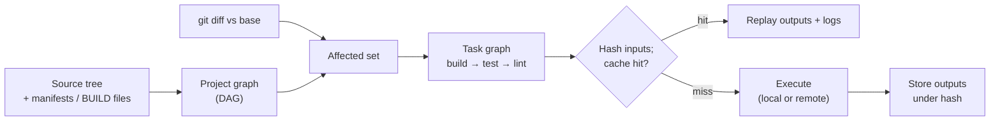
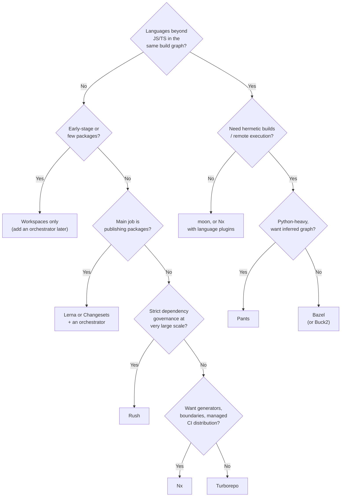

# Monorepos: Tooling &amp; Build Systems

[Monorepo Strategies](../monorepo/) &raquo; Tooling &amp; Build Systems

<div class="advanced-note" markdown="1">
**Advanced engineering deep-dive.** This page covers the tools that turn a large repository into a working monorepo. It explains the three tiers of tooling, gives current (2026) configuration for each major tool, compares them feature by feature, and ends with selection guidance. The concepts behind them (the monorepo model, trade-offs, when to adopt one) are on [Monorepo Strategies](../monorepo/). How affected-target analysis, caching, and remote execution behave at fleet scale is on [Scaling &amp; Engineering](../monorepo-scaling/).
</div>

## Why Tooling Matters

Without a graph-aware build tool, a monorepo is just a large folder. Every CI run rebuilds and retests everything, and developers can't tell what a change will break. Monorepo tools do three things:

1. **Build the project graph.** They find projects and the dependencies between them, either from explicit build files or by reading manifests and imports.
2. **Schedule tasks over the graph.** They run `build`, `test`, and `lint` in dependency order, run independent tasks in parallel, and run only the projects a change affects.
3. **Cache results by content.** They hash each task's inputs and reuse the stored outputs when the hash matches, locally or from a cache shared by the whole team and CI fleet.

The tools differ in how much of this they do and how much they trust the graph they build. That difference is the most useful way to compare them.



## The Tool Landscape

Monorepo tools fall into three tiers that overlap:

| Tier | Tools | What it gives you | How it gets the graph |
|------|-------|-------------------|-----------------------|
| Workspace managers | npm/pnpm/Yarn/Bun workspaces, Cargo, Go, uv, Gradle | Linking, one lockfile, shared installs | Package manifests |
| Task orchestrators | Nx, Turborepo, moon, Lerna, Rush | Affected runs, parallel scheduling, task caching | Manifests + config (+ imports for Nx) |
| Hermetic build systems | Bazel, Buck2, Pants | Sandboxed, reproducible, polyglot builds with remote execution | Explicit BUILD files (Pants infers most of them) |

The tiers stack. A typical JavaScript/TypeScript monorepo runs pnpm workspaces with Turborepo or Nx on top. Rush wraps pnpm. Bazel's `rules_js` reads the pnpm lockfile. In practice you choose a workspace manager and then decide whether to add an orchestrator or move to a hermetic system.

## Task Orchestrators

### Nx

Nx is a build platform from Nrwl, the company that also maintains Lerna. It builds the project graph from `package.json`/`project.json` files and **plugins** that infer targets from tool configs. For example, `@nx/vite/plugin` sees a `vite.config.ts` and creates `build`, `test`, and `serve` targets without any per-project configuration. It then runs cacheable targets on affected projects only.

Recent versions (Nx 20–23, 2024–2026) removed the old `tasksRunnerOptions`/`cacheableOperations` model. Caching is now set per target with `cache: true`, and **named inputs** define what gets hashed. Nx 22.7 added task sandboxing, which checks the files a task actually reads and writes against its declared inputs and outputs. Nx 23 (June 2026) extended that sandboxing and raised the minimum Node.js version to 22.

`nx.json`:

```json
{
  "$schema": "./node_modules/nx/schemas/nx-schema.json",
  "defaultBase": "main",
  "namedInputs": {
    "default": ["{projectRoot}/**/*", "sharedGlobals"],
    "production": ["default", "!{projectRoot}/**/*.spec.ts"],
    "sharedGlobals": ["{workspaceRoot}/tsconfig.base.json"]
  },
  "targetDefaults": {
    "build": {
      "dependsOn": ["^build"],
      "inputs": ["production", "^production"],
      "outputs": ["{projectRoot}/dist"],
      "cache": true
    },
    "test": {
      "inputs": ["default", "^production"],
      "cache": true
    }
  },
  "plugins": [
    { "plugin": "@nx/vite/plugin", "options": { "buildTargetName": "build" } }
  ]
}
```

`^production` means "the `production` inputs of every upstream dependency". This is how a change to a library's source invalidates the cached builds of its consumers.

```bash
nx affected -t test lint          # only projects affected by the diff vs defaultBase
nx run-many -t build --parallel=4 # every project
nx graph                          # interactive project-graph viewer
npx nx connect                    # attach the workspace to Nx Cloud (remote cache, Nx Agents)
```

Nx Cloud provides the remote cache. **Nx Agents** (the successor to "Distributed Task Execution") spread tasks across CI machines. Nx also enforces **module boundaries**: a lint rule rejects imports that break tag-based dependency constraints.

**Best for:** JS/TS-centered organizations that want code generators, inferred configuration, enforced boundaries, and managed CI distribution. Nx also has plugins for Gradle, Maven, .NET, Go, and Rust.

### Turborepo

Turborepo is Vercel's task runner for JS/TS workspaces. It is now written in Rust, and its docs are at turborepo.dev. It adds almost no project model of its own: packages come from the package manager's workspaces and tasks come from `package.json` scripts. `turbo.json` only declares how tasks relate to each other and what they produce.

Turborepo 2.0 (2024) renamed the top-level `pipeline` key to `tasks`. Configs that still use `pipeline` are v1 syntax. Later 2.x releases added `--affected` (2.1), more composable configuration (2.7), and a stable `turbo query` (2.9). `turbo query` exposes the package and task graph and replaces the deprecated `turbo-ignore`.

`turbo.json`:

```json
{
  "$schema": "https://turborepo.dev/schema.json",
  "tasks": {
    "build": {
      "dependsOn": ["^build"],
      "outputs": ["dist/**", ".next/**", "!.next/cache/**"]
    },
    "test": {
      "dependsOn": ["build"],
      "inputs": ["$TURBO_DEFAULT$", "!README.md"]
    },
    "lint": {},
    "dev": { "cache": false, "persistent": true }
  }
}
```

`^build` means "the `build` task of every workspace dependency must finish first". `$TURBO_DEFAULT$` is the default input set (all git-tracked files in the package), and the other entries adjust it.

```bash
turbo run build test                   # whole repo, cached
turbo run test --affected              # packages changed vs the base branch, plus dependents
turbo run test --filter=...[origin/main]  # same idea with explicit filter syntax
turbo query affected                   # JSON list of affected packages/tasks for CI scripting
```

**Best for:** JS/TS teams that want fast affected builds and remote caching with minimal configuration and no new project model.

### moon

[moon](https://moonrepo.dev) is a Rust-based orchestrator. It sits between Turborepo's minimalism and Bazel's rigor. Projects and tasks are declared in `moon.yml` files. Its distinguishing feature is **toolchain management**: moon pins and installs the exact Node.js, Bun, Rust, Python, or Go version each project uses, so every laptop and CI agent runs the same toolchain. moon 2.0 (May 2026) moved toolchains into WASM plugins.

**Best for:** multi-language web-ecosystem repos that want reproducible toolchains without adopting a hermetic build system.

### Lerna

Lerna was the original JS monorepo tool. Its focus is **versioning and publishing** many packages to a registry. Nrwl maintains it, and it delegates task running and caching to Nx. v7 (2023) removed `lerna bootstrap` and `useWorkspaces`, so linking is now always the package manager's job. v9 was released in September 2025.

`lerna.json`:

```json
{
  "$schema": "node_modules/lerna/schemas/lerna-schema.json",
  "version": "independent",
  "npmClient": "pnpm",
  "command": {
    "version": { "conventionalCommits": true, "message": "chore(release): publish" }
  }
}
```

```bash
lerna run test --since origin/main   # affected run (Nx-powered)
lerna version && lerna publish from-git
```

**Best for:** library and SDK repositories whose main job is publishing packages. For publishing alone, [Changesets](https://github.com/changesets/changesets) is a widely used lighter-weight option that works with any orchestrator.

### Rush

Rush is Microsoft's monorepo manager (part of Rush Stack). It emphasizes **dependency hygiene** and governance for large JS/TS repositories:

- It installs with pnpm into a single shared lockfile and blocks **phantom dependencies**, where code imports a package it never declared.
- **Subspaces** split one huge lockfile into several, so teams can upgrade dependencies independently.
- **Cobuilds** share an incremental build across multiple CI machines.
- A build cache, policy plugins, and approved-package lists support governance.

`rush.json` (excerpt; pin the Rush and pnpm versions your repository actually uses):

```json
{
  "rushVersion": "5.179.0",
  "pnpmVersion": "10.x.x",
  "projects": [
    { "packageName": "@myorg/core", "projectFolder": "libraries/core" },
    { "packageName": "@myorg/app",  "projectFolder": "apps/main-app" }
  ]
}
```

**Best for:** large, governed JS/TS repositories where strict dependency validation and deterministic installs matter more than zero-config convenience.

## Hermetic Build Systems

Hermetic build systems require every **action** to declare its exact inputs and outputs, and they run it in a sandbox where nothing else is visible. An action is a single compiler or test invocation, which is much smaller than a whole task. Undeclared inputs can't leak in, so a cache key built from declared inputs is correct by construction. That property is what makes it safe to share caches between machines and to run actions on remote workers. See [Remote Execution](../monorepo-scaling/#remote-execution-reapi).

### Bazel

Bazel is the open-source version of Google's internal Blaze. It supports Go, Java/Kotlin, C++, Python, JS/TS, Rust, and more through rule sets. **Bazel 9 (January 2026, LTS)** removed the legacy `WORKSPACE` mechanism entirely: external dependencies are declared only in `MODULE.bazel` (Bzlmod) and resolved from the [Bazel Central Registry](https://registry.bazel.build). Bazel 9 also finished moving the built-in language rules out of the core binary. The C++ rules, for example, now live in `rules_cc`. JavaScript now uses Aspect's `rules_js`, which replaced the older `rules_nodejs` and its `@npm//lodash`-style labels.

`MODULE.bazel`:

```python
module(name = "my_monorepo")

bazel_dep(name = "aspect_rules_js", version = "3.4.1")

npm = use_extension("@aspect_rules_js//npm:extensions.bzl", "npm")
npm.npm_translate_lock(name = "npm", pnpm_lock = "//:pnpm-lock.yaml")
use_repo(npm, "npm")
```

`packages/core/BUILD.bazel`:

```python
load("@aspect_rules_js//js:defs.bzl", "js_library")

js_library(
    name = "core",
    srcs = glob(["src/**/*.js"]),
    deps = [
        "//packages/utils",
        "//:node_modules/lodash",   # linked by npm_link_all_packages in the root BUILD
    ],
    visibility = ["//apps:__subpackages__"],
)
```

`visibility` is enforced at build time. A target outside `//apps/...` that depends on `core` fails to build. This is Bazel's form of the module boundaries Nx enforces with lint rules.

```bash
bazel build //...                                        # everything
bazel test //packages/...                                # a subtree
bazel query 'rdeps(//..., //packages/utils:utils)'       # reverse deps = affected set
```

**Best for:** polyglot organizations that need reproducible builds, remote execution, and correctness guarantees worth a steep configuration and learning cost.

### Buck2

Buck2 is Meta's build system. It was written from scratch in Rust and open-sourced in 2023. Like Bazel it uses BUILD files and Starlark rules, but all rules, including the language rules, are written in Starlark rather than built into the core. Its execution engine is a single incremental computation graph designed for parallelism, and it was built from the start for remote execution over the same REAPI protocol Bazel uses.

**Best for:** teams that want Bazel-class hermeticity with a faster engine and are comfortable with a smaller ecosystem of open-source rules.

### Pants

Pants (v2) is a hermetic build system written in Rust and Python. Its main advantage is **dependency inference**: it reads `import` statements to build most of the graph, so BUILD files stay small. `pants tailor` generates them. It has strong support for Python, and also supports Go, JVM languages, Shell, Docker, and Helm, with remote caching and execution over REAPI.

```bash
pants tailor ::                                              # generate BUILD targets
pants --changed-since=origin/main --changed-dependents=transitive test
```

**Best for:** Python-heavy or mixed-language teams that want hermetic builds without writing the whole graph by hand.

## Language-Native Workspaces

Every major ecosystem ships a workspace feature. Workspaces link local packages together and share one lockfile, which is enough for a small monorepo. Orchestrators like Turborepo and Nx are built on top of them.

| Ecosystem | Mechanism | Declared in |
|-----------|-----------|-------------|
| npm / Yarn / Bun | `workspaces` array | root `package.json` |
| pnpm | `packages` list, `workspace:` protocol | `pnpm-workspace.yaml` |
| Rust | `[workspace] members` | root `Cargo.toml` |
| Go | multi-module workspace (Go 1.18+) | `go.work` |
| Python (uv) | `[tool.uv.workspace] members` | root `pyproject.toml` |
| JVM | multi-project / multi-module builds | `settings.gradle(.kts)` / parent `pom.xml` |

**Catalogs** address version drift in JS workspaces: dozens of `package.json` files each pinning a slightly different version of the same package. pnpm (since 9.5) and Bun (since 1.2.14) let you declare a version once and refer to it with `catalog:`:

```yaml
# pnpm-workspace.yaml
packages:
  - "packages/*"
  - "apps/*"
catalog:
  react: ^19.0.0
  typescript: ^5.9.0
```

```json
{ "dependencies": { "react": "catalog:", "@org/utils": "workspace:*" } }
```

`workspace:*` resolves an internal dependency to the source in the tree. When the package is published, pnpm rewrites it to a real version range.

## Feature Comparison

| Tool | Languages | Graph source | Remote cache | Distributed / remote execution | Hermetic |
|------|-----------|--------------|--------------|--------------------------------|----------|
| Turborepo | JS/TS | Workspaces + `turbo.json` | Yes (Vercel or self-hosted API) | No | No |
| Nx | JS/TS first; Gradle, Maven, .NET, Go, Rust plugins | Manifests + plugin inference + imports | Yes (Nx Cloud) | Task-level (Nx Agents) | No (sandbox *checks* declared I/O) |
| moon | JS/TS, Rust, Python, Go, Bun, more | `moon.yml` + manifests | Yes (REAPI-compatible) | No | No (pinned toolchains) |
| Lerna | JS/TS | Workspaces (via Nx) | Via Nx | Via Nx | No |
| Rush | JS/TS | `rush.json` | Yes (cloud storage) | Cobuilds (task-level) | No (strict installs) |
| Bazel | Polyglot | Explicit BUILD files | Yes (REAPI) | Action-level (REAPI) | Yes |
| Buck2 | Polyglot | Explicit BUILD files | Yes (REAPI) | Action-level (REAPI) | Yes |
| Pants | Polyglot, Python-first | Inferred from imports | Yes (REAPI) | Action-level (REAPI) | Yes |

How to read the table:

- **Graph trust.** Orchestrators infer the graph cheaply. Their cache is correct only if you declare `inputs` and `outputs` accurately. Nx's sandboxing now detects mismatches but doesn't prevent them. Hermetic tools make an undeclared input a build error, so the cache is correct by construction.
- **Granularity.** Task-level distribution (Nx Agents, Rush cobuilds) sends whole `build`/`test` tasks to CI machines. Action-level remote execution (Bazel, Buck2, Pants) sends individual compiler and test invocations to a worker farm, which is finer-grained and scales further but needs a hermetic graph.
- **Language scope.** Only the hermetic tier treats every language as a peer. The JS orchestrators have added other languages through plugins, but their model still centers on `package.json`.

### Equivalent Commands

| Intent | Nx | Turborepo | Bazel | Pants |
|--------|----|-----------|-------|-------|
| Test what changed | `nx affected -t test` | `turbo run test --affected` | `bazel query 'rdeps(...)'` then `bazel test` | `pants --changed-since=main --changed-dependents=transitive test` |
| Run everywhere | `nx run-many -t test` | `turbo run test` | `bazel test //...` | `pants test ::` |
| Visualize graph | `nx graph` | `turbo query` / `--graph` | `bazel query --output=graph` | `pants dependencies` |

## Remote Caching

Remote caching lets a team and its CI fleet avoid rebuilding the same artifact twice. It works the same way in every tool. The task's inputs are hashed: source files, resolved dependency versions, the command, relevant environment variables, and the hashes of upstream tasks. That hash is the cache key. On a hit, the outputs and logs are replayed. On a miss, the task runs and uploads its outputs under the key. The full mechanism, and how to measure hit rates, is covered in [Computation Caching](../monorepo-scaling/#computation-caching-build-once-ever).

```bash
# Turborepo: Vercel-hosted
turbo login && turbo link
# Turborepo: self-hosted server implementing the Remote Cache API
export TURBO_API="https://cache.internal.example.com" TURBO_TEAM="myteam" TURBO_TOKEN="..."

# Nx: Nx Cloud
npx nx connect
```

```text
# .bazelrc: any REAPI-compatible cache or build farm
build --remote_cache=grpcs://cache.internal.example.com
build --remote_upload_local_results=false       # developers read only
build:ci --remote_upload_local_results=true     # trusted CI writes
build:rbe --remote_executor=grpcs://rbe.internal.example.com
```

### Correctness and Security Pitfalls

A shared cache is only as trustworthy as its keys and its write path:

- **Undeclared inputs.** If a task reads a file or environment variable that isn't in its inputs, two different builds can hash to the same key and a stale artifact gets served. Hermetic tools prevent this. Orchestrators rely on complete `inputs` declarations. Turborepo's strict environment mode and Nx's sandbox checks help.
- **Non-deterministic outputs.** Timestamps, absolute paths, or hostnames embedded in artifacts make otherwise identical builds differ. Use `SOURCE_DATE_EPOCH` and deterministic bundler settings.
- **Toolchain skew.** Artifacts from a different compiler or Node.js version can be replayed unless the toolchain is part of the key. Pin toolchains (Bazel toolchains, moon, `.nvmrc` plus Corepack) and hash them.
- **Cache poisoning.** If every CI job, including jobs on untrusted pull-request branches, can write to one shared cache, an attacker can upload a malicious artifact under a legitimate key. The CI workflow itself usually isn't part of the key. This class of attack was disclosed as **CVE-2025-36852 ("CREEP")**. In May 2026 Nx deprecated its bucket-backed self-hosted cache packages (`@nx/s3-cache`, `@nx/gcs-cache`, `@nx/azure-cache`, `@nx/shared-fs-cache`) because of it. The mitigations are to give writes only to trusted branches (PR builds read only), sign artifacts (Turborepo's `remoteCache.signature` with `TURBO_REMOTE_CACHE_SIGNATURE_KEY`), and scope cache namespaces per branch.

## Choosing a Tool

The decision depends mostly on **language mix** and **scale**, and then on whether your main job is building applications or publishing packages.



### Cost of Adoption

| Factor | Workspaces / Turborepo | Nx / moon / Rush | Bazel / Buck2 / Pants |
|--------|------------------------|------------------|------------------------|
| Migration effort | An afternoon | Days to weeks | Months for a large codebase (every target needs BUILD rules; Pants infers most of them) |
| Operational surface | Optional hosted cache | Hosted cache/agents or self-hosted | Remote cache and execution farm you run and secure, or a commercial provider |
| Learning curve | `package.json` scripts | A tool-specific project model | Starlark, hermeticity, toolchain rules |
| Reversibility | High | Moderate | Low: a large, sticky investment |

Start with the most reversible step that solves today's problem. Workspaces plus Turborepo or Nx covers most JS/TS repositories. Move to a hermetic system when language mix, cache correctness, or build scale forces it. Hermetic migrations are usually done incrementally, one language or subtree at a time.

## Key Takeaways

- **The graph is the product.** Every tool works by modeling the project DAG. Compare them by how they discover that graph and how far they trust it.
- **Configurations from before 2024 are stale.** Turborepo's `pipeline`, Nx's `tasksRunnerOptions`, Lerna's `bootstrap`, and Bazel's `WORKSPACE` have all been removed or replaced.
- **Hermeticity buys correctness.** Only Bazel, Buck2, and Pants make undeclared inputs impossible. Orchestrators depend on accurate `inputs` declarations.
- **Remote caching needs a security design.** Restrict writes to trusted CI, keep PR builds read-only, and sign artifacts where the tool supports it.
- **Match the tool to language mix and scale.** JS/TS: Turborepo or Nx. Publishing: Lerna or Changesets. Governed JS at very large scale: Rush. Polyglot at scale: Bazel, Buck2, or Pants.

## See Also

<div class="see-also-card" markdown="1">
#### See Also

**Monorepo Pages**
- [Monorepo Strategies and Management](../monorepo/): concepts, trade-offs, adoption, and migration
- [Monorepos: Scaling &amp; Engineering](../monorepo-scaling/): affected analysis, caching, remote execution, ownership, CI, and VCS scaling

**Related Topics**
- [Distributed Systems Theory](../distributed-systems-theory/): background for distributed and remote build execution
- [Git Reference](../../technology/git-reference.html): sparse checkout, worktrees, and large-repo workflows
- [CI/CD Pipelines](../../technology/ci-cd/): affected-only builds in continuous integration
- [Docker](../../technology/docker/): containerizing monorepo builds
- [Performance Optimization](../../optimization/): build-time and caching optimization

**External Documentation**
- [Nx](https://nx.dev) · [Turborepo](https://turborepo.dev) · [moon](https://moonrepo.dev) · [Lerna](https://lerna.js.org) · [Rush](https://rushjs.io) · [Bazel](https://bazel.build) · [Buck2](https://buck2.build) · [Pants](https://www.pantsbuild.org) · [monorepo.tools](https://monorepo.tools)
</div>
