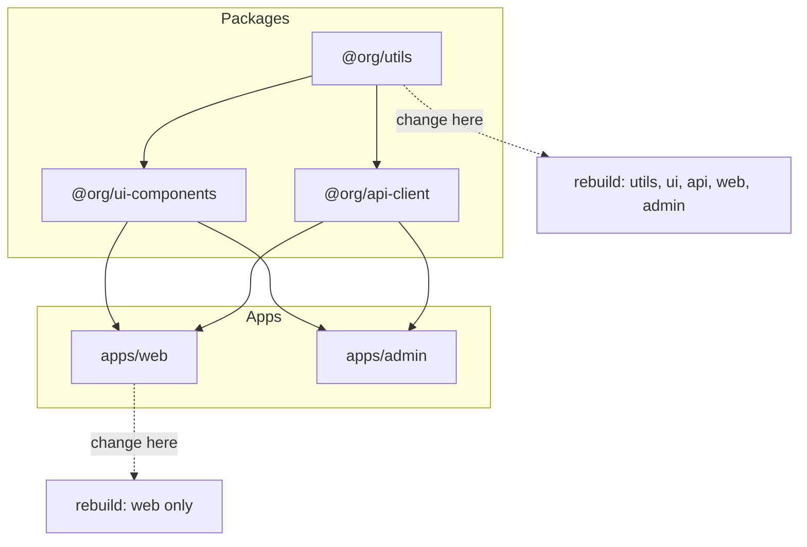
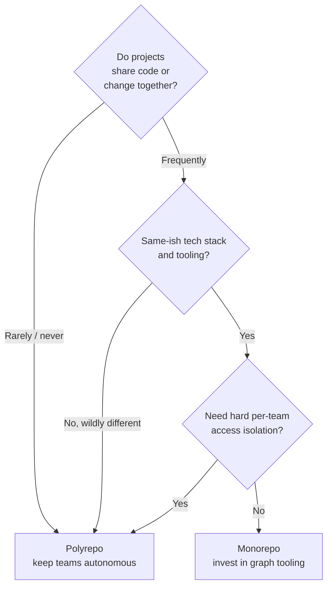

<div class="hero-section" style="background: linear-gradient(135deg, #232526 0%, #414345 100%); color: white; padding: 3rem 2rem; margin: -2rem -3rem 2rem -3rem; text-align: center;">
  <h1 style="color: white; margin: 0; font-size: 2.5rem;">Monorepo Strategies and Management</h1>
  <p style="font-size: 1.25rem; margin-top: 1rem; opacity: 0.9;">What a monorepo is, the polyrepo trade-off, the core concepts that define it, and when adopting one actually pays off</p>
</div>

[Advanced Topics](./) &raquo; Monorepo Strategies and Management

<div class="advanced-note" markdown="1">
**Advanced engineering deep-dive.** This page is the conceptual hub for monorepos: what they are, how they differ from polyrepos, the core properties that make them worthwhile, and the decision of whether to adopt one. The two companion pages go deeper — [Tooling &amp; Build Systems](../monorepo-tooling/) surveys Bazel, Nx, Turborepo, Rush, Lerna, and Pants; [Scaling &amp; Engineering](../monorepo-scaling/) covers build graphs, remote execution, ownership, and VCS scaling. **Helpful background:** build systems and dependency graphs, CI/CD pipelines, and Git internals. For day-to-day Git workflows see the [Git Reference](../../technology/git-reference.html); for pipeline fundamentals see [CI/CD Pipelines](../../technology/ci-cd/).
</div>

## Introduction

A monorepo (monolithic repository) is a software development strategy where code for multiple projects is stored in a single repository. This approach has gained significant traction among large tech companies and is increasingly adopted by teams of all sizes.

<div class="key-insights">
  <div class="insight-card"><i class="fas fa-code-branch"></i><h4>One repo, many projects</h4><p>A monorepo is not a monolith. Many independently-deployable projects share one version-controlled tree, enabling atomic cross-project changes.</p></div>
  <div class="insight-card"><i class="fas fa-project-diagram"></i><h4>The build graph is everything</h4><p>Modern monorepo tools model projects as a dependency DAG, so they can build, test, and deploy only what a change actually affects.</p></div>
  <div class="insight-card"><i class="fas fa-database"></i><h4>Caching makes it scale</h4><p>Content-addressed local and remote caches mean a given input is built once, ever — across the whole team and CI fleet.</p></div>
  <div class="insight-card"><i class="fas fa-balance-scale-right"></i><h4>It's a trade-off</h4><p>You trade per-team autonomy and small clones for shared tooling and frictionless code reuse. Worth it when projects are coupled; costly when they aren't.</p></div>
</div>

## What is a Monorepo?

A monorepo contains multiple distinct projects with well-defined relationships and dependencies, all within a single repository. Unlike a monolithic application, projects in a monorepo can be deployed independently.

The mental model that unlocks every monorepo tool is the **project dependency graph**. Tools like Nx, Turborepo, and Bazel parse this graph, then use it to answer the only question that matters at scale: *given this change, what is the minimal set of projects I must rebuild, retest, and redeploy?*



A change to a leaf app rebuilds just that app; a change to a foundational package like `utils` cascades to everything that transitively depends on it. "Affected" commands (`nx affected`, `turbo run --filter`) compute exactly this set, which is why monorepos can keep CI fast even with thousands of projects. The mechanics of computing and exploiting that affected set are the subject of the [Scaling &amp; Engineering](../monorepo-scaling/) page.

### Monorepo, Monolith, and Polyrepo

These three terms are routinely confused; pinning them down is the fastest way to understand what a monorepo actually is.

| Term | What it describes | Deployment unit |
|------|-------------------|-----------------|
| **Monolith** | One application built and deployed as a single unit | One artifact |
| **Monorepo** | One repository holding many projects | Many independent artifacts |
| **Polyrepo** | Many repositories, typically one project each | Many independent artifacts |

A monorepo is an axis of *source organization*, not of *runtime architecture*. You can ship a single monolith out of a polyrepo, or hundreds of independently-deployed microservices out of a monorepo. The defining property of a monorepo is simply that conceptually distinct, separately-deployable projects share one version-controlled tree — and therefore one commit history, one set of tooling, and one place where a single change can atomically touch many projects at once.

## Core Concepts

Three properties define what a monorepo *is* and explain why teams reach for one. Everything else — the tooling, the caching, the CI strategy — exists to deliver or protect these three.

### Single Source of Truth

In a monorepo, there is exactly one version of every internal package at any given commit. There is no "which version of `@org/utils` is `apps/web` actually running?" — the answer is *whatever is on this commit*, because both live in the same tree. This eliminates an entire class of problems that polyrepos spend significant effort managing:

- **No internal version skew.** A consumer always builds against the current source of its dependencies, not a published snapshot that may be weeks stale.
- **No diamond dependency conflicts between internal packages.** Two libraries cannot transitively demand incompatible versions of a third internal package, because there is only one version of it.
- **One canonical place to look.** Cross-cutting concerns — a shared lint config, a security patch, an API contract — have a single authoritative location rather than being copied across repos.

```typescript
// In a monorepo, an internal dependency is a workspace reference,
// not a pinned published version:
{
  "dependencies": {
    "@org/utils": "workspace:*"   // always the source in this tree
  }
}
```

The cost is that "the truth" is now large: every developer's checkout conceptually contains the whole organization's code. Keeping that workable is exactly what the VCS-scaling techniques on the [Scaling &amp; Engineering](../monorepo-scaling/) page address.

### Atomic Cross-Project Changes

Because every project shares one commit history, a single commit (and a single pull request) can change a shared library *and* every consumer of it together. The change either lands as a coherent whole or not at all.

This is the property that most cleanly distinguishes a monorepo from a polyrepo. In a polyrepo, renaming a function in a shared library is a multi-step dance: change and publish the library, then open a follow-up PR in each consumer to bump the dependency and adapt to the new API, coordinating the merges so nothing breaks in between. In a monorepo it is one PR:

```bash
# One commit renames the API and updates every caller at once.
# CI builds the affected set; the change is atomic and bisectable.
git commit -am "rename formatDate -> formatTimestamp across all consumers"
```

Atomicity has two compounding benefits:

- **Refactoring is cheap.** IDEs and codemods can find and update every usage in the tree, so large cross-cutting refactors become routine rather than dreaded.
- **History stays coherent.** Every commit on `main` represents a buildable, internally-consistent state of the whole organization, which makes `git bisect` and rollbacks meaningful across project boundaries.

### Unified Versioning and Consistent Tooling

A monorepo centralizes the decisions a polyrepo distributes. There is one root toolchain configuration — one TypeScript version, one linter config, one formatter, one set of CI conventions — inherited by every project unless it deliberately overrides it. Upgrading the whole organization to a new compiler is a single PR rather than a campaign across dozens of repos.

Versioning of *published* artifacts can still follow different policies, and the choice is a deliberate one:

```typescript
// Version strategies for what a monorepo publishes externally
enum VersionStrategy {
  FIXED = "fixed",             // all packages share one version, bumped together
  INDEPENDENT = "independent", // each package carries its own semver
  GROUPED = "grouped"          // groups of related packages version together
}
```

- **Fixed** (lockstep) versioning trades semantic precision for simplicity: every release bumps everything, so the version number stops meaning "what changed in *this* package." Good for tightly-coupled suites.
- **Independent** versioning preserves per-package semver, at the cost of release tooling that can compute exactly which packages changed and bump only those.

The key point is that *internal* dependencies need no versioning at all — they are workspace references resolved from source — so versioning becomes purely an *external publishing* concern rather than an everyday-development one.

## Monorepo vs Polyrepo Comparison

Choosing a monorepo is choosing a set of trade-offs, not an unambiguous upgrade. The right answer depends on how coupled your projects are and how much your teams need isolation from one another.

### Monorepo Advantages
- **Atomic Changes**: Refactor across multiple projects in one commit
- **Shared Code**: Easy code reuse without package publishing
- **Consistent Tooling**: Single set of build tools and configurations
- **Simplified Dependencies**: No version conflicts between internal packages
- **Better Refactoring**: IDEs can find and update all usages

### Polyrepo Advantages
- **Independent Versioning**: Each project has its own release cycle
- **Smaller Repositories**: Faster cloning and operations
- **Clear Boundaries**: Enforced separation between projects
- **Flexible Tech Stacks**: Each repo can use different tools
- **Granular Access Control**: Per-repository permissions

### Comparison Table

| Aspect | Monorepo | Polyrepo |
|--------|----------|----------|
| Code Sharing | Direct imports | Published packages |
| Atomic Changes | Native | Requires coordination |
| Build Complexity | Higher | Lower per repo |
| Repository Size | Large | Small |
| Team Autonomy | Lower | Higher |
| Tooling Investment | High upfront | Lower initial |

A useful way to read this table: a monorepo *moves complexity from coordination into tooling*. Polyrepos keep each repository simple but push complexity into the spaces between repos — publishing, version negotiation, and multi-repo change coordination. Monorepos collapse that inter-repo complexity but demand graph-aware build tools and VCS scaling techniques to stay fast. You are choosing *where* the hard problems live, not whether you have any.

## When to Adopt a Monorepo

The deciding question is **coupling**: how often do changes need to cross project boundaries, and how much code do projects genuinely share? The more your projects move together, the more a monorepo's atomicity and single-source-of-truth pay for their tooling cost.

**Consider a monorepo when:**
- You have multiple projects that share code
- Teams frequently collaborate across projects
- You need atomic commits across multiple projects
- Consistent tooling and standards are important
- You want simplified dependency management

**Avoid a monorepo when:**
- Projects have completely different tech stacks
- Teams require strict access control separation
- Projects have vastly different release cycles
- Your VCS struggles with large repositories



<div class="tip-card" markdown="1">
#### Adopt gradually, not all at once
A monorepo is rarely worth a big-bang migration. The lower-risk path is to start a monorepo with the few projects that are most tightly coupled, prove out the tooling and CI on them, and migrate additional projects only as the coupling (and the pain of keeping them separate) justifies it. The mechanics of polyrepo-to-monorepo migration — preserving history with `git subtree`/`git filter-repo`, rewriting import paths, and wiring up the workspace — live on the [Scaling &amp; Engineering](../monorepo-scaling/) page.
</div>

## Going Deeper

This hub covers the *what* and *whether* of monorepos. The two companion pages cover the *how*: the tools that make a monorepo more than a large folder, and the engineering that keeps it fast at scale.

<div class="command-grid">
  <div class="feature-card" markdown="1">
#### [Tooling &amp; Build Systems](../monorepo-tooling/)
*Pick and configure the build tool*

- The three tiers: affected-graph runners, package managers, hermetic build systems
- Nx, Turborepo, Lerna, Rush, Bazel, Buck2, Pants compared
- Workspace configuration and internal dependency wiring
- Computation caching and remote-cache internals
- A decision guide keyed to language mix and scale

*Read this when: choosing or configuring a monorepo tool*
  </div>
  <div class="feature-card" markdown="1">
#### [Scaling &amp; Engineering](../monorepo-scaling/)
*Keep it fast as it grows*

- Build graphs and affected-target analysis
- Distributed remote execution and parallelism
- Dependency-visibility rules and enforced boundaries
- Code ownership (CODEOWNERS) and review policy
- CI strategy and VCS scaling (sparse checkout, partial clone, VFS)

*Read this when: operating a monorepo at scale*
  </div>
</div>

## Real-World Case Studies

The largest monorepos in industry validate the core concepts above — and show that delivering them at scale requires substantial custom tooling.

### Google

- **Size**: 2+ billion lines of code
- **Tool**: Bazel (originally Blaze)
- **Strategy**: Single massive repository
- **Benefits**: Unified tooling, atomic changes
- **Challenges**: Custom VCS (Piper), specialized tools

### Facebook (Meta)

- **Size**: Hundreds of millions of lines
- **Tool**: Buck (now open source)
- **Strategy**: Mercurial-based monorepo
- **Benefits**: Rapid iteration, code sharing
- **Challenges**: Performance at scale

### Microsoft

- **Project**: Windows codebase
- **Tool**: Git with VFS (Virtual File System)
- **Strategy**: Git-based monorepo
- **Benefits**: Unified Windows development
- **Challenges**: 300GB+ repo size

### Uber

- **Migration**: Polyrepo to monorepo (2018)
- **Tool**: Bazel
- **Languages**: Go, Java, JavaScript
- **Benefits**: 50% reduction in build times
- **Results**: Improved developer productivity

## Key Takeaways

<div class="takeaway-grid">
  <div class="takeaway-card"><h4>A monorepo organizes source, not runtime</h4><p>It is about one repository of many independently-deployable projects — orthogonal to whether you ship a monolith or microservices.</p></div>
  <div class="takeaway-card"><h4>Single source of truth removes version skew</h4><p>One version of every internal package per commit eliminates internal diamond conflicts and "which version is running?" entirely.</p></div>
  <div class="takeaway-card"><h4>Atomic changes are the killer feature</h4><p>One commit can change a library and every consumer together, making cross-cutting refactors routine and history coherent.</p></div>
  <div class="takeaway-card"><h4>It moves complexity, it doesn't remove it</h4><p>Inter-repo coordination cost is traded for graph-aware tooling and VCS-scaling cost. You choose where the hard problems live.</p></div>
  <div class="takeaway-card"><h4>Coupling is the deciding question</h4><p>Adopt when projects share code and change together; keep polyrepos when teams need autonomy, isolation, or divergent stacks.</p></div>
  <div class="takeaway-card"><h4>Adopt gradually</h4><p>Start with the most coupled projects, prove the tooling, and migrate the rest as the trade-off justifies it — not in a big bang.</p></div>
</div>

## See Also

<div class="see-also-card" markdown="1">
#### See Also

**Monorepo Companion Pages**
- [Monorepos: Tooling &amp; Build Systems](../monorepo-tooling/) — Bazel, Nx, Turborepo, Rush, Lerna, Pants compared, with caching internals
- [Monorepos: Scaling &amp; Engineering](../monorepo-scaling/) — Build graphs, remote execution, ownership, CI, and VCS scaling

**Related Advanced Topics**
- [Distributed Systems Theory](../distributed-systems-theory/) — Distributed and remote build execution
- [AI Mathematics](../ai-mathematics/) — Managing large ML research codebases
- [Quantum Algorithms Research](../quantum-algorithms-research/) — Organizing quantum software projects

**Applied Technology**
- [Git Reference](../../technology/git-reference.html) — Sparse checkout, LFS, and large-repo workflows
- [CI/CD Pipelines](../../technology/ci-cd/) — Affected-only builds in continuous integration
- [Docker](../../technology/docker/) — Containerizing monorepo builds
- [Performance Optimization](../../optimization/) — Build-time and caching optimization

**External Documentation**
- [Nx](https://nx.dev) · [Turborepo](https://turbo.build) · [Lerna](https://lerna.js.org) · [Rush](https://rushjs.io) · [Bazel](https://bazel.build) · [Monorepo.tools](https://monorepo.tools)
</div>
