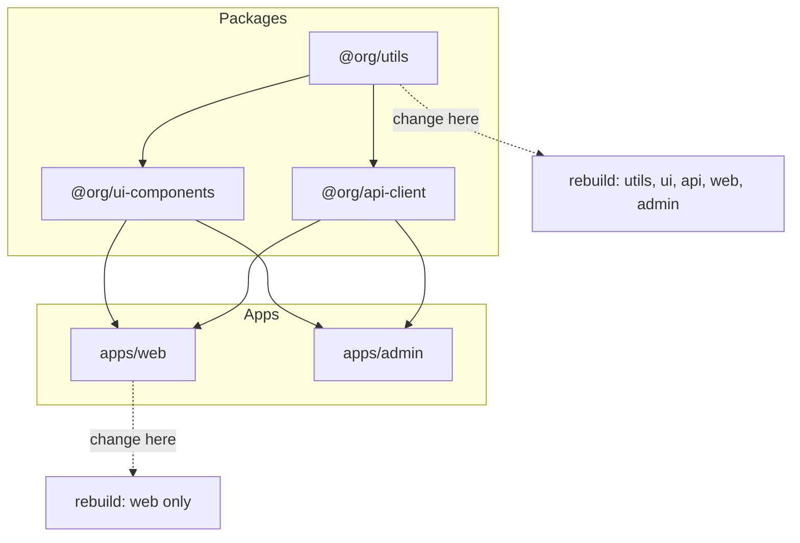

<div class="hero-section" style="background: linear-gradient(135deg, #232526 0%, #414345 100%); color: white; padding: 3rem 2rem; margin: -2rem -3rem 2rem -3rem; text-align: center;">
  <h1 style="color: white; margin: 0; font-size: 2.5rem;">Monorepo Strategies and Management</h1>
  <p style="font-size: 1.25rem; margin-top: 1rem; opacity: 0.9;">Comprehensive architecture patterns, tooling, and best practices for managing large-scale unified codebases</p>
</div>

## Introduction

A monorepo (monolithic repository) is a software development strategy where code for multiple projects is stored in a single repository. This approach has gained significant traction among large tech companies and is increasingly adopted by teams of all sizes.

<div class="key-insights">
  <div class="insight-card"><i class="fas fa-code-branch"></i><h4>One repo, many projects</h4><p>A monorepo is not a monolith. Many independently-deployable projects share one version-controlled tree, enabling atomic cross-project changes.</p></div>
  <div class="insight-card"><i class="fas fa-project-diagram"></i><h4>The build graph is everything</h4><p>Modern monorepo tools model projects as a dependency DAG, so they can build, test, and deploy only what a change actually affects.</p></div>
  <div class="insight-card"><i class="fas fa-database"></i><h4>Caching makes it scale</h4><p>Content-addressed local and remote caches mean a given input is built once, ever — across the whole team and CI fleet.</p></div>
  <div class="insight-card"><i class="fas fa-balance-scale-right"></i><h4>It's a trade-off</h4><p>You trade per-team autonomy and small clones for shared tooling and frictionless code reuse. Worth it when projects are coupled; costly when they aren't.</p></div>
</div>

## What is a Monorepo?

A monorepo contains multiple distinct projects with well-defined relationships and dependencies, all within a single repository. Unlike a monolithic application, projects in a monorepo can be deployed independently.

The mental model that unlocks every monorepo tool is the **project dependency graph**. Tools like Nx, Turborepo, and Bazel parse this graph, then use it to answer the only question that matters at scale: *given this change, what is the minimal set of projects I must rebuild, retest, and redeploy?*



A change to a leaf app rebuilds just that app; a change to a foundational package like `utils` cascades to everything that transitively depends on it. "Affected" commands (`nx affected`, `turbo run --filter`) compute exactly this set, which is why monorepos can keep CI fast even with thousands of projects.

### When to Use a Monorepo

**Consider a monorepo when:**
- You have multiple projects that share code
- Teams frequently collaborate across projects
- You need atomic commits across multiple projects
- Consistent tooling and standards are important
- You want simplified dependency management

**Avoid a monorepo when:**
- Projects have completely different tech stacks
- Teams require strict access control separation
- Projects have vastly different release cycles
- Your VCS struggles with large repositories

## Monorepo vs Polyrepo Comparison

### Monorepo Advantages
- **Atomic Changes**: Refactor across multiple projects in one commit
- **Shared Code**: Easy code reuse without package publishing
- **Consistent Tooling**: Single set of build tools and configurations
- **Simplified Dependencies**: No version conflicts between internal packages
- **Better Refactoring**: IDEs can find and update all usages

### Polyrepo Advantages
- **Independent Versioning**: Each project has its own release cycle
- **Smaller Repositories**: Faster cloning and operations
- **Clear Boundaries**: Enforced separation between projects
- **Flexible Tech Stacks**: Each repo can use different tools
- **Granular Access Control**: Per-repository permissions

### Comparison Table

| Aspect | Monorepo | Polyrepo |
|--------|----------|----------|
| Code Sharing | Direct imports | Published packages |
| Atomic Changes | ✅ Native | ❌ Requires coordination |
| Build Complexity | Higher | Lower per repo |
| Repository Size | Large | Small |
| Team Autonomy | Lower | Higher |
| Tooling Investment | High upfront | Lower initial |

## Popular Monorepo Tools

### Nx

Nx is a smart, extensible build framework designed for monorepos.

```json
// nx.json
{
  "npmScope": "myorg",
  "affected": {
    "defaultBase": "main"
  },
  "tasksRunnerOptions": {
    "default": {
      "runner": "@nrwl/nx-cloud",
      "options": {
        "cacheableOperations": ["build", "test", "lint"]
      }
    }
  }
}
```

**Key Features:**
- Intelligent build system with computation caching
- Affected commands run only on changed projects
- Rich plugin ecosystem
- Distributed task execution

### Lerna

Lerna optimizes workflow around managing multi-package repositories.

```json
// lerna.json
{
  "version": "independent",
  "npmClient": "yarn",
  "useWorkspaces": true,
  "command": {
    "publish": {
      "conventionalCommits": true,
      "message": "chore(release): publish"
    },
    "bootstrap": {
      "hoist": true
    }
  }
}
```

**Key Features:**
- Independent or fixed versioning modes
- Automated publishing to npm
- Bootstrapping local dependencies
- Conventional commits support

### Rush

Rush is a scalable monorepo manager for the web.

```json
// rush.json
{
  "rushVersion": "5.100.0",
  "pnpmVersion": "8.6.0",
  "projects": [
    {
      "packageName": "@myorg/core",
      "projectFolder": "libraries/core"
    },
    {
      "packageName": "@myorg/app",
      "projectFolder": "apps/main-app"
    }
  ]
}
```

**Key Features:**
- Phantom dependencies detection
- Incremental builds
- Rush plugins for extensibility
- Strict dependency validation

### Bazel

Bazel is Google's build tool, designed for large-scale monorepos.

```python
# WORKSPACE
workspace(name = "my_monorepo")

load("@bazel_tools//tools/build_defs/repo:http.bzl", "http_archive")

# BUILD file
js_library(
    name = "core",
    srcs = glob(["src/**/*.js"]),
    deps = [
        "//packages/utils",
        "@npm//lodash",
    ],
)
```

**Key Features:**
- Language-agnostic build system
- Hermetic builds
- Remote caching and execution
- Proven at massive scale

### Turborepo

Turborepo is a high-performance build system for JavaScript and TypeScript monorepos.

```json
// turbo.json
{
  "$schema": "https://turbo.build/schema.json",
  "pipeline": {
    "build": {
      "dependsOn": ["^build"],
      "outputs": ["dist/**"]
    },
    "test": {
      "dependsOn": ["build"],
      "outputs": []
    },
    "dev": {
      "cache": false
    }
  }
}
```

**Key Features:**
- Incremental builds
- Remote caching
- Parallel execution
- Zero-config setup

## Repository Structure Best Practices

### Recommended Structure

```
monorepo/
├── apps/                    # Application projects
│   ├── web-app/
│   ├── mobile-app/
│   └── admin-dashboard/
├── packages/               # Shared packages
│   ├── ui-components/
│   ├── utils/
│   └── api-client/
├── libs/                   # Internal libraries
│   ├── auth/
│   └── data-access/
├── tools/                  # Build tools and scripts
│   ├── eslint-config/
│   └── webpack-config/
├── docs/                   # Documentation
├── .github/               # GitHub specific files
├── package.json           # Root package.json
└── turbo.json            # Monorepo tool config
```

### Naming Conventions

```typescript
// Package naming
@myorg/ui-components
@myorg/utils
@myorg/api-client

// Internal imports
import { Button } from '@myorg/ui-components';
import { formatDate } from '@myorg/utils';
```

### Workspace Configuration

```json
// package.json (root)
{
  "name": "my-monorepo",
  "private": true,
  "workspaces": [
    "apps/*",
    "packages/*",
    "libs/*",
    "tools/*"
  ],
  "scripts": {
    "build": "turbo run build",
    "test": "turbo run test",
    "lint": "turbo run lint"
  }
}
```

## Dependency Management Strategies

### Internal Dependencies

```json
// packages/app/package.json
{
  "dependencies": {
    "@myorg/ui-components": "workspace:*",
    "@myorg/utils": "workspace:*"
  }
}
```

### Version Management

```typescript
// Version strategies
enum VersionStrategy {
  FIXED = "fixed",           // All packages same version
  INDEPENDENT = "independent", // Each package own version
  GROUPED = "grouped"        // Groups of packages share versions
}
```

### Dependency Hoisting

```yaml
# .npmrc or .yarnrc.yml
nodeLinker: node-modules
nmHoistingLimits: workspaces
```

### Lock File Management

```bash
# Single lock file at root
yarn.lock
pnpm-lock.yaml
package-lock.json

# Ensure deterministic installs
npm ci
yarn install --frozen-lockfile
pnpm install --frozen-lockfile
```

## Build Optimization and Caching

### Computation Caching

```typescript
// nx.json
{
  "tasksRunnerOptions": {
    "default": {
      "runner": "@nrwl/workspace/tasks-runners/default",
      "options": {
        "cacheableOperations": [
          "build",
          "test",
          "lint",
          "e2e"
        ],
        "cacheDirectory": ".cache/nx"
      }
    }
  }
}
```

### Remote Caching

```bash
# Turborepo remote caching
turbo login
turbo link

# Nx Cloud
nx g @nrwl/nx-cloud:init
```

### Incremental Builds

```json
// tsconfig.json
{
  "compilerOptions": {
    "incremental": true,
    "tsBuildInfoFile": ".tsbuildinfo"
  }
}
```

### Build Pipeline Optimization

```javascript
// turbo.json
{
  "pipeline": {
    "build": {
      "dependsOn": ["^build"],
      "outputs": ["dist/**", ".next/**"]
    },
    "test": {
      "dependsOn": ["build"],
      "inputs": ["src/**", "tests/**"]
    }
  }
}
```

## Testing Strategies for Monorepos

### Test Organization

```
monorepo/
├── apps/web/__tests__/        # App-specific tests
├── packages/ui/src/__tests__/ # Package tests
├── e2e/                       # End-to-end tests
└── integration/               # Integration tests
```

### Affected Testing

```bash
# Run tests only for changed code
nx affected:test --base=main
turbo run test --filter=...[origin/main]
lerna run test --since origin/main
```

### Test Configuration

```javascript
// jest.config.base.js
module.exports = {
  preset: '../../jest.preset.js',
  coverageDirectory: '../../coverage/packages/ui',
  transform: {
    '^.+\\.(ts|tsx)$': 'ts-jest'
  }
};
```

### Parallel Testing

```bash
# Run tests in parallel
jest --maxWorkers=50%
nx run-many --target=test --parallel=3
turbo run test --concurrency=4
```

## Code Ownership and CODEOWNERS

### CODEOWNERS File

```
# .github/CODEOWNERS
# Global owners
* @monorepo-admins

# App owners
/apps/web/ @web-team
/apps/mobile/ @mobile-team

# Package owners
/packages/ui-components/ @design-system-team
/packages/api-client/ @api-team

# Specific file patterns
*.sql @database-team
*.yml @devops-team
```

### Ownership Strategies

```typescript
// ownership.config.ts
export const ownership = {
  rules: [
    {
      pattern: 'packages/core/**',
      owners: ['@core-team'],
      minApprovals: 2
    },
    {
      pattern: 'apps/**',
      owners: ['@app-team'],
      minApprovals: 1
    }
  ]
};
```

## Git Strategies for Large Repos

### Sparse Checkout

```bash
# Enable sparse checkout
git sparse-checkout init --cone

# Add specific paths
git sparse-checkout set apps/web packages/ui
```

### Shallow Clone

```bash
# Clone with limited history
git clone --depth=1 https://github.com/org/monorepo.git

# Fetch more history as needed
git fetch --deepen=100
```

### Git LFS for Large Files

```bash
# Track large files
git lfs track "*.psd"
git lfs track "*.zip"

# .gitattributes
*.psd filter=lfs diff=lfs merge=lfs -text
*.zip filter=lfs diff=lfs merge=lfs -text
```

### Branch Strategies

```bash
# Feature branches
feature/APP-123-new-feature

# Release branches
release/2023.10.0

# Hotfix branches
hotfix/critical-bug-fix
```

## CI/CD for Monorepos

### GitHub Actions Example

```yaml
# .github/workflows/ci.yml
name: CI

on:
  push:
    branches: [main]
  pull_request:
    branches: [main]

jobs:
  build:
    runs-on: ubuntu-latest
    strategy:
      matrix:
        package: [web, api, mobile]
    steps:
      - uses: actions/checkout@v3
        with:
          fetch-depth: 0
      
      - name: Setup Node
        uses: actions/setup-node@v3
        with:
          node-version: 18
          cache: 'yarn'
      
      - name: Install dependencies
        run: yarn install --frozen-lockfile
      
      - name: Build affected
        run: yarn nx affected:build --base=origin/main
      
      - name: Test affected
        run: yarn nx affected:test --base=origin/main
```

### Deployment Strategies

```yaml
# Selective deployment
deploy:
  runs-on: ubuntu-latest
  steps:
    - name: Deploy changed apps
      run: |
        AFFECTED=$(yarn nx affected:apps --base=origin/main --plain)
        for app in $AFFECTED; do
          yarn deploy:$app
        done
```

### Build Matrix Optimization

```javascript
// scripts/generate-matrix.js
const { execSync } = require('child_process');

const affected = execSync('nx affected:apps --plain')
  .toString()
  .trim()
  .split(' ');

console.log(JSON.stringify({ app: affected }));
```

## Migration Strategies

### Polyrepo to Monorepo

```bash
# Step 1: Create monorepo structure
mkdir my-monorepo && cd my-monorepo
git init

# Step 2: Add repos as subdirectories
git subtree add --prefix=apps/web https://github.com/org/web-app.git main
git subtree add --prefix=apps/api https://github.com/org/api.git main

# Step 3: Update import paths
find . -type f -name "*.js" -exec sed -i 's/from "shared"/from "@myorg\/shared"/g' {} +

# Step 4: Setup workspace
yarn init -y
yarn add -D lerna nx turbo
```

### Monorepo to Polyrepo

```bash
# Extract package with history
git subtree push --prefix=packages/ui origin ui-package

# Create new repo
git clone https://github.com/org/monorepo.git ui-components
cd ui-components
git filter-branch --subdirectory-filter packages/ui -- --all

# Update dependencies
npm init -y
npm install
```

### Gradual Migration

```typescript
// migration.config.ts
export const migrationPhases = [
  {
    phase: 1,
    packages: ['shared-utils', 'ui-components'],
    deadline: '2024-Q1'
  },
  {
    phase: 2,
    packages: ['api-client', 'auth'],
    deadline: '2024-Q2'
  }
];
```

## Real-World Case Studies

### Google

- **Size**: 2+ billion lines of code
- **Tool**: Bazel (originally Blaze)
- **Strategy**: Single massive repository
- **Benefits**: Unified tooling, atomic changes
- **Challenges**: Custom VCS (Piper), specialized tools

### Facebook (Meta)

- **Size**: Hundreds of millions of lines
- **Tool**: Buck (now open source)
- **Strategy**: Mercurial-based monorepo
- **Benefits**: Rapid iteration, code sharing
- **Challenges**: Performance at scale

### Microsoft

- **Project**: Windows codebase
- **Tool**: Git with VFS (Virtual File System)
- **Strategy**: Git-based monorepo
- **Benefits**: Unified Windows development
- **Challenges**: 300GB+ repo size

### Uber

- **Migration**: Polyrepo to monorepo (2018)
- **Tool**: Bazel
- **Languages**: Go, Java, JavaScript
- **Benefits**: 50% reduction in build times
- **Results**: Improved developer productivity

## Common Challenges and Solutions

### Challenge: Long Clone Times

```bash
# Solution 1: Shallow clone
git clone --depth=1 --single-branch

# Solution 2: Partial clone
git clone --filter=blob:none

# Solution 3: Sparse checkout
git sparse-checkout init --cone
```

### Challenge: IDE Performance

```json
// Solution: Scope IDE to specific packages
// .vscode/settings.json
{
  "files.exclude": {
    "**/node_modules": true,
    "apps/!(web)/**": true,
    "packages/!(ui)/**": true
  },
  "search.exclude": {
    "**/dist": true,
    "**/coverage": true
  }
}
```

### Challenge: Merge Conflicts

```bash
# Solution: Automated conflict resolution
# .gitattributes
*.generated.ts merge=ours
package-lock.json merge=ours
```

### Challenge: CI Build Times

```yaml
# Solution: Distributed builds
- name: Distribute builds
  uses: nrwl/nx-set-shas@v3
  
- run: |
    npx nx affected --target=build \
      --parallel=3 \
      --configuration=production \
      --nx-cloud
```

### Bun Workspaces

**New Addition (2023-2024)**: Bun's built-in workspace support
```json
// package.json
{
  "workspaces": ["packages/*", "apps/*"]
}
```

**Key Features**:
- Native workspace support
- Fast dependency installation
- Built-in TypeScript support
- Compatible with existing tools

### PNPM Catalogs

**Centralized Dependency Management**:
```yaml
# pnpm-workspace.yaml
catalog:
  react: ^18.2.0
  typescript: ^5.3.0
  vite: ^5.0.0

packages:
  - 'packages/*'
  - 'apps/*'
```

## Performance Optimization Techniques

### File System Optimization

```bash
# Use watchman for file watching
brew install watchman

# Configure git
git config core.preloadindex true
git config core.fscache true
git config gc.auto 256
```

### Build Performance

```javascript
// webpack.config.js
module.exports = {
  cache: {
    type: 'filesystem',
    buildDependencies: {
      config: [__filename]
    }
  },
  optimization: {
    runtimeChunk: 'single',
    moduleIds: 'deterministic'
  }
};
```

### Memory Management

```json
// .npmrc
max-old-space-size=4096

// package.json
{
  "scripts": {
    "build": "NODE_OPTIONS='--max-old-space-size=4096' nx build"
  }
}
```

### Parallel Processing

```typescript
// parallel-tasks.ts
import { cpus } from 'os';
import pLimit from 'p-limit';

const limit = pLimit(cpus().length);
const tasks = packages.map(pkg => 
  limit(() => buildPackage(pkg))
);

await Promise.all(tasks);
```

## Best Practices Summary

### Do's
- ✅ Start with clear package boundaries
- ✅ Invest in tooling early
- ✅ Use computation caching
- ✅ Implement clear ownership rules
- ✅ Automate dependency updates
- ✅ Monitor repository metrics

### Don'ts
- ❌ Mix unrelated projects
- ❌ Ignore tooling investment
- ❌ Allow circular dependencies
- ❌ Skip documentation
- ❌ Neglect CI/CD optimization
- ❌ Force monorepo on all projects

## Choosing a Tool

<div class="tip-card" markdown="1">
#### Quick Tool Selection Guide
- **JS/TS only, want zero-config speed** → Turborepo
- **JS/TS with rich plugins, generators, and affected graph** → Nx
- **Polyglot (Go, Java, C++, Python) at large scale, hermetic builds** → Bazel (or Buck2, Pants)
- **Strict dependency validation and phantom-dependency detection** → Rush
- **Just need npm/yarn/pnpm workspaces with publishing** → Lerna or native workspaces

The decision hinges on language mix and scale: single-language teams rarely need Bazel's complexity, while polyglot organizations rarely escape it.
</div>

## Conclusion

Monorepos can significantly improve development workflow for teams working on related projects. Success requires careful planning, appropriate tooling, and ongoing optimization. Start small, measure constantly, and scale gradually.

## Key Takeaways

<div class="takeaway-grid">
  <div class="takeaway-card"><h4>Model the dependency graph</h4><p>Every benefit — affected builds, caching, atomic refactors — flows from tools understanding the project DAG.</p></div>
  <div class="takeaway-card"><h4>Caching is non-negotiable at scale</h4><p>Local + remote computation caching turns "rebuild the world" into "rebuild what changed," shared across the whole team.</p></div>
  <div class="takeaway-card"><h4>Match the tool to the stack</h4><p>Turborepo/Nx for JS/TS; Bazel/Buck2/Pants for polyglot, hermetic, massive-scale builds.</p></div>
  <div class="takeaway-card"><h4>Invest in Git ergonomics</h4><p>Sparse checkout, shallow clones, and partial clone keep large repos workable on developer machines.</p></div>
  <div class="takeaway-card"><h4>Enforce boundaries with CODEOWNERS</h4><p>A single repo still needs clear ownership and module boundaries to avoid a tangled big ball of mud.</p></div>
  <div class="takeaway-card"><h4>It's a trade-off, not a default</h4><p>Adopt a monorepo when projects are coupled and share code; keep polyrepos when teams need autonomy and isolation.</p></div>
</div>

## See Also

<div class="see-also-card" markdown="1">
#### See Also

**Related Advanced Topics**
- [Distributed Systems Theory](../distributed-systems-theory/) — Distributed and remote build execution
- [AI Mathematics](../ai-mathematics/) — Managing large ML research codebases
- [Quantum Algorithms Research](../quantum-algorithms-research/) — Organizing quantum software projects

**Applied Technology**
- [Git Reference](../../technology/git-reference.html) — Sparse checkout, LFS, and large-repo workflows
- [CI/CD Pipelines](../../technology/ci-cd.html) — Affected-only builds in continuous integration
- [Docker](../../technology/docker/) — Containerizing monorepo builds
- [Performance Optimization](../../optimization/) — Build-time and caching optimization

**External Documentation**
- [Nx](https://nx.dev) · [Turborepo](https://turbo.build) · [Lerna](https://lerna.js.org) · [Rush](https://rushjs.io) · [Bazel](https://bazel.build) · [Monorepo.tools](https://monorepo.tools)
</div>