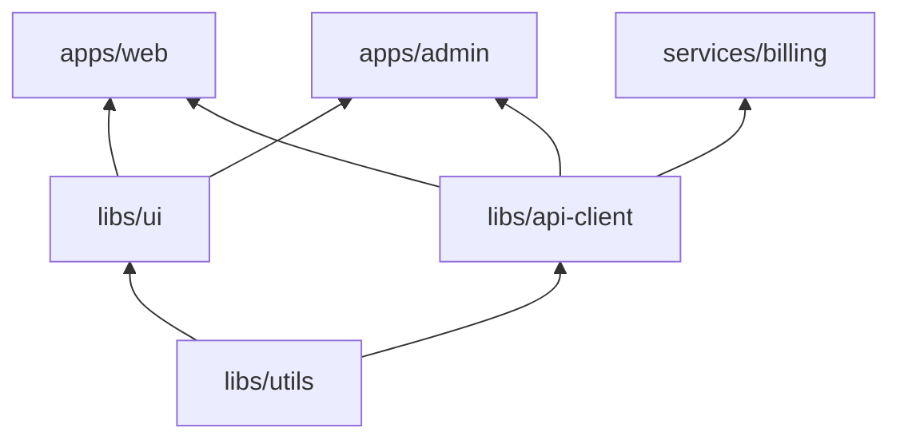
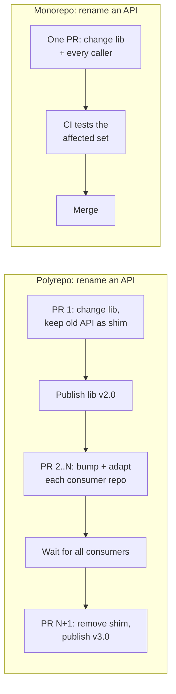
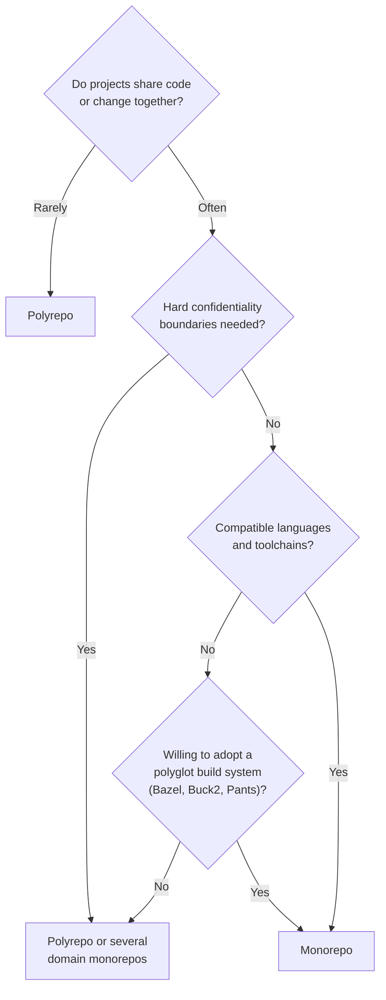

# Monorepo Strategies and Management

[Advanced Topics](../) &raquo; Monorepo Strategies and Management

<div class="advanced-note" markdown="1">
**Advanced engineering deep-dive.** This is the hub page for monorepos. It covers what a monorepo is, how it differs from a polyrepo, what it gives you, whether to adopt one, and how to migrate into one. Two companion pages go deeper. [Tooling &amp; Build Systems](../monorepo-tooling/) compares Nx, Turborepo, moon, Lerna, Rush, Bazel, Buck2, and Pants. [Scaling &amp; Engineering](../monorepo-scaling/) covers affected-target analysis, caching, remote execution, ownership, CI, and VCS scaling. **Helpful background:** dependency graphs, CI/CD pipelines, and Git internals. See also the [Git Reference](../../technology/git-reference.html) and [CI/CD Pipelines](../../technology/ci-cd/).
</div>

A **monorepo** is a single version-controlled repository that holds many distinct projects, such as applications, services, and libraries, that can each be built and deployed independently. Google, Meta, and Microsoft each run very large monorepos. The approach is also common in small teams, because modern build tools make it practical at any size. A monorepo doesn't remove complexity. It moves complexity out of coordination *between* repositories and into tooling *within* one repository.

## Definition

### Monorepo, Monolith, and Polyrepo

These three terms are often confused. A monorepo describes how **source code is organized**. It says nothing about how the software runs.

| Term | What it describes | Deployment unit |
|------|-------------------|-----------------|
| **Monolith** | One application built and deployed as a single unit | One artifact |
| **Monorepo** | One repository holding many projects | Many independent artifacts |
| **Polyrepo** | Many repositories, typically one project each | Many independent artifacts |

You can ship one monolith out of several repositories, or hundreds of microservices out of one monorepo. A monorepo is defined by one thing: separately deployable projects share one tree. As a result they share one commit history and one toolchain, and a single commit can change many of them together.

A folder of unrelated projects with no shared tooling is not really a monorepo. It is *co-location*. The benefits below come from treating the repository as one **dependency graph**.

### The Project Graph

Every monorepo tool models projects as a directed acyclic graph (DAG) of dependencies. It uses the graph to answer one question: *given this change, what is the smallest set of projects that must be rebuilt, retested, and redeployed?*



Arrows point from a dependency to its consumers. A change to `apps/web` affects only `web`. A change to `libs/api-client` affects `api`, `web`, `admin`, and `svc`. A change to `libs/utils` affects every node. "Affected" commands (`nx affected`, `turbo run --affected`, `bazel query 'rdeps(...)'`) compute these sets, which keeps CI time proportional to the change rather than to the repository. How the affected set is computed is covered in [Affected-Target Analysis](../monorepo-scaling/#affected-target-analysis).

## Core Properties

Three properties explain why teams adopt monorepos. The tooling, caching, and CI strategy all exist to deliver or protect them.

### Single Source of Truth

At any commit, each internal package has exactly one version. The question "which version of `utils` is `web` running?" always has the same answer: the one in this commit. This removes several problems polyrepos spend real effort on:

- **No internal version skew.** Consumers build against the current source of their dependencies, not a published snapshot that may be weeks old.
- **No internal diamond conflicts.** Two libraries can't require incompatible versions of a third internal package, because only one version exists.
- **One place for shared concerns.** Lint config, a security patch, or an API contract lives in one authoritative location instead of being copied between repositories.

In JS/TS workspaces, an internal dependency is a reference to source in the tree, not a pinned published version:

```json
{ "dependencies": { "@org/utils": "workspace:*" } }
```

Many monorepos extend this to **third-party** dependencies with a *single-version policy*: the whole repository uses one version of `react` or `protobuf`. Google enforces this rule. JS repositories can get the same effect with pnpm or Bun catalogs (see [Tooling](../monorepo-tooling/#language-native-workspaces)).

The cost is that the source of truth is now large. Conceptually, every checkout contains the whole organization's code. The VCS-scaling techniques on [Scaling &amp; Engineering](../monorepo-scaling/#vcs-scaling-keeping-the-working-tree-tractable) keep that manageable.

### Atomic Cross-Project Changes

All projects share one history, so a single commit can change a shared library and every consumer of it. The change lands completely or not at all. Of the three properties, this one most clearly separates a monorepo from a polyrepo:



This has two benefits that build on each other:

- **Refactoring is cheap.** IDEs, codemods, and tools like Google's Rosie can find and update every usage in the tree, so large cross-cutting refactors become routine.
- **History stays coherent.** Every commit on the main branch is a buildable, consistent state of the whole codebase. That makes `git bisect`, reverts, and rollbacks meaningful across project boundaries.

Atomic commits are not atomic *deployments*. Services built from one commit still roll out independently, so wire protocols and database schemas still need backward compatibility during a rollout. A monorepo makes code changes atomic. Runtime compatibility is still your job.

### Unified Toolchain and Versioning

A monorepo centralizes decisions that a polyrepo spreads across repositories. There is one TypeScript version, one linter and formatter configuration, and one set of CI conventions. Projects inherit them unless they deliberately override them. Upgrading a compiler across the organization takes one pull request, not a campaign across dozens of repositories.

Internal dependencies don't need version numbers at all. Versioning matters only for artifacts **published** outside the repository, and the policy for those is a deliberate choice:

| Strategy | Behavior | Suits | Tooling |
|----------|----------|-------|---------|
| **Fixed** (lockstep) | Every package shares one version, bumped together | Tightly coupled suites released as one product | Lerna fixed mode, Nx Release |
| **Independent** | Each package has its own semver, bumped only when it changes | Loosely related libraries | Changesets, Lerna independent, Nx Release |
| **Grouped** | Related packages version together, groups are independent | Large SDK families | Nx Release groups, Rush version policies |

## Monorepo vs Polyrepo

Choosing a monorepo means accepting one set of trade-offs in place of another. It is not automatically an upgrade.

| Aspect | Monorepo | Polyrepo |
|--------|----------|----------|
| Code sharing | Direct source imports | Published, versioned packages |
| Cross-project changes | One atomic commit | Coordinated multi-repo sequence |
| Internal version skew | Impossible by construction | Normal; managed with bots (Renovate, Dependabot) |
| Toolchain consistency | Enforced centrally | Drifts per repository |
| Build tooling required | Graph-aware tool essential at scale | Simple per-repo builds |
| Clone / checkout size | Large; needs partial clone and sparse checkout at scale | Small |
| Team autonomy | Lower; shared conventions and a shared main branch | Higher; each team owns its repo end to end |
| Access control | Path-level review (CODEOWNERS); read access usually repo-wide | Per-repository permissions |
| CI | Must be affected-aware to stay fast | Naturally scoped per repo |
| Blast radius of a bad commit | Can break many projects at once (needs merge queues) | Contained to one repo |

The table shows where the difficult problems end up. Polyrepos keep each repository simple and push the complexity into the gaps between them: publishing, version negotiation, and change coordination. Monorepos remove those gaps, but they need graph-aware build tools, affected-aware CI, a merge queue, and VCS scaling to stay fast.

### Common Misconceptions

- **"A monorepo means a monolith."** No. Deployment granularity is independent of repository layout.
- **"Monorepos don't scale."** They do, but only with investment. The largest known monorepos run on custom version-control systems.
- **"Everyone can change everything."** Write access is usually controlled per path through required reviews (CODEOWNERS). Build-level visibility rules then restrict which projects may depend on which.
- **"Git can't handle it."** Stock Git now includes partial clone, sparse checkout, the commit-graph, a filesystem monitor, and Scalar (bundled since Git 2.38), which cover most organizations short of the very largest.

### Middle Grounds

Not every organization has to choose one extreme:

- **Several domain monorepos.** One repository per product line or language. This keeps most of the benefits and limits size and blast radius.
- **Meta-repositories.** Git submodules, or tools like `repo` and `meta`, stitch several repositories into one checkout. You get co-location, but not atomic commits or a single source of truth.
- **Hybrid.** Core shared libraries live in a monorepo. Loosely coupled or externally open-sourced projects stay in their own repositories and consume published packages.

## When to Adopt a Monorepo

The deciding question is **coupling**. How often do changes cross project boundaries, and how much code do projects actually share? The more your projects change together, the more atomic changes and a single source of truth are worth their tooling cost.

| Favors a monorepo | Favors polyrepos |
|-------------------|------------------|
| Projects share libraries and change together | Projects are independent products |
| Similar languages and toolchains | Radically different stacks and build systems |
| Frequent cross-team refactors or API changes | Stable, versioned interfaces between teams |
| Desire for consistent standards and one CI system | Teams need full autonomy over process and tooling |
| Organization can staff build and developer-experience tooling | No capacity to own build infrastructure |
| Read access can be broad | Hard confidentiality boundaries between codebases |



## Migrating to a Monorepo

A big-bang migration is rarely worth the risk. The lower-risk path looks like this:

1. **Start with the most tightly coupled projects.** Pick the libraries and their main consumers that already suffer from version-bump churn.
2. **Set up the tooling first.** Configure workspaces, an orchestrator, an affected-aware CI pipeline, and CODEOWNERS before most projects move in.
3. **Import repositories with history.** Rewrite each source repository into its target subdirectory, then merge it in:

   ```bash
   # in a fresh clone of the source repo
   git filter-repo --to-subdirectory-filter services/billing

   # in the monorepo
   git remote add billing ../billing
   git fetch billing
   git merge --allow-unrelated-histories billing/main
   git remote remove billing
   ```

   `git filter-repo` is a separate tool that replaces the deprecated `git filter-branch`. `git subtree add --prefix=...` is a built-in alternative that doesn't rewrite paths in old commits.
4. **Rewire dependencies.** Replace published-version dependencies on internal packages with workspace references, and delete the old publish-and-bump automation.
5. **Archive the old repository.** Make it read-only with a pointer to the new location, so history and links still resolve.
6. **Repeat** only while the coupling justifies it. Some projects are better left out.

## Industry Examples

The largest monorepos show that the core properties hold at extreme scale. They also show that reaching that scale took custom infrastructure.

| Organization | Scale (as published) | Version control | Build system | Notes |
|--------------|---------------------|-----------------|--------------|-------|
| **Google** | ~2 billion lines, ~9 million source files, 86 TB (2016) | Piper (custom) with CitC cloud workspaces | Blaze (open-sourced as Bazel) | Trunk-based development, single-version policy, automated large-scale changes (Rosie) |
| **Meta** | Hundreds of millions of lines | Custom Mercurial, later **Sapling** (open-sourced 2022) with EdenFS virtual filesystem | Buck, now **Buck2** (open-sourced 2023) | Custom VCS built because stock Mercurial and Git could not scale |
| **Microsoft (Windows)** | ~3.5 million files, ~300 GB (2017) | Git + GVFS / VFS for Git, later **Scalar** (merged into Git 2.38) | Internal | Showed stock Git could be extended to extreme scale |
| **Uber** | Large Go monorepo (plus separate mobile monorepos) | Git | Bazel | Built **SubmitQueue** to keep main green under high commit rates (EuroSys 2019) |

Sources: Potvin &amp; Levenberg, "Why Google Stores Billions of Lines of Code in a Single Repository," *CACM* 59(7), 2016; Microsoft DevOps blog posts on GVFS (2017); Meta Engineering blog announcements of Sapling (2022) and Buck2 (2023); Ananthanarayanan et al., "Keeping Master Green at Scale," EuroSys 2019.

## Further Reading on This Site

| Page | Covers | Read it when |
|------|--------|--------------|
| [Tooling &amp; Build Systems](../monorepo-tooling/) | The three tool tiers; Nx, Turborepo, moon, Lerna, Rush, Bazel, Buck2, Pants; workspaces and catalogs; remote-cache security; selection guide | Choosing or configuring a tool |
| [Scaling &amp; Engineering](../monorepo-scaling/) | Affected analysis, content-addressed caching, distributed and remote execution, visibility rules, CODEOWNERS, CI matrices, merge queues, partial clone, sparse checkout, Scalar | Operating a monorepo as it grows |

## Key Takeaways

- **A monorepo is about source layout, not runtime architecture.** It is one repository of many independently deployable projects.
- **The graph is the point.** Without a dependency graph and graph-aware tooling, a monorepo is just co-location.
- **Single source of truth removes internal version skew.** Atomic commits make cross-cutting refactors routine. Deployments are still not atomic.
- **It moves complexity rather than removing it.** Coordination between repositories is replaced by the cost of build tooling, CI, and VCS scaling.
- **Coupling decides.** Adopt a monorepo when projects share code and change together, migrate incrementally, and leave independent projects out.

## See Also

<div class="see-also-card" markdown="1">
#### See Also

**Monorepo Companion Pages**
- [Monorepos: Tooling &amp; Build Systems](../monorepo-tooling/): tools compared, with current configuration and caching security
- [Monorepos: Scaling &amp; Engineering](../monorepo-scaling/): build graphs, remote execution, ownership, CI, and VCS scaling

**Related Topics**
- [Distributed Systems Theory](../distributed-systems-theory/): background for distributed and remote build execution
- [Git Reference](../../technology/git-reference.html): sparse checkout, worktrees, LFS, and large-repo workflows
- [CI/CD Pipelines](../../technology/ci-cd/): affected-only builds in continuous integration
- [Docker](../../technology/docker/): containerizing monorepo builds
- [Performance Optimization](../../optimization/): build-time and caching optimization

**External**
- [monorepo.tools](https://monorepo.tools): vendor-neutral feature comparison
- Potvin &amp; Levenberg, [Why Google Stores Billions of Lines of Code in a Single Repository](https://cacm.acm.org/research/why-google-stores-billions-of-lines-of-code-in-a-single-repository/) (CACM, 2016)
</div>
