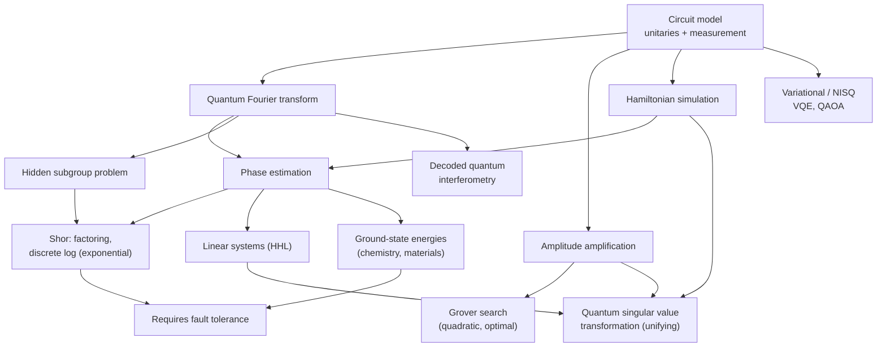
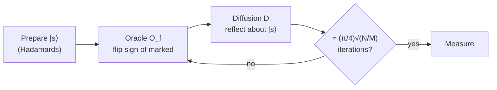
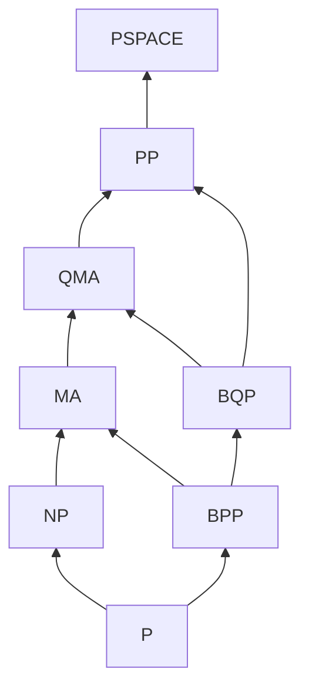
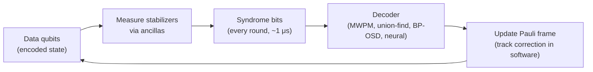
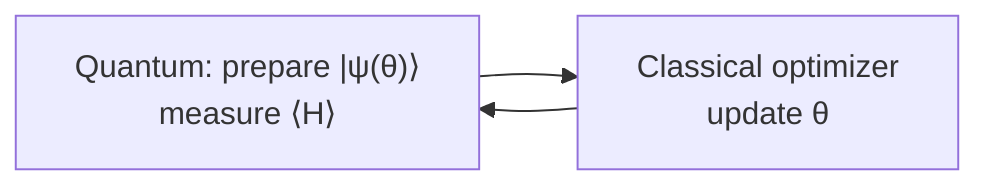

# Quantum Algorithms Research

**Graduate-level research page.** This is a rigorous survey of quantum algorithms, quantum complexity theory, quantum error correction, and the current experimental frontier. **Prerequisites:** linear algebra, basic group theory, computational complexity (P, NP, BPP), and quantum mechanics fundamentals. For a hands-on introduction with runnable circuits, start at the [Quantum Computing Hub](../../quantum-computing/).

A quantum computer can prepare a superposition over exponentially many inputs, but a measurement returns only one outcome. Quantum speedups therefore come from **interference**. Unitary operations are arranged so that the amplitudes of wrong answers cancel and the amplitude of the right answer grows. This page covers the model of computation, the core algorithmic primitives (phase estimation, amplitude amplification, Hamiltonian simulation, and the singular-value transformation that unifies them), the complexity theory that bounds what they can do, the error correction and fault tolerance that make them physically realizable, and the state of the field as of 2026.

The size of the speedup depends on the structure of the problem:

- **Hidden algebraic structure** gives exponential speedups. Shor's algorithm finds the period of a function using the quantum Fourier transform.
- **No structure** gives at most a quadratic speedup. Grover's search is provably optimal.
- **Simulating quantum systems** is the most natural application, with exponential speedups for many physical dynamics problems.
- **Heuristic and variational methods** on noisy hardware have not yet shown a clear advantage on practically relevant problems.

## Map of the Field

## Contents

- [Quantum Computation Model](#quantum-computation-model): states, gates, measurement, universality, the oracle model
- [Core Algorithmic Primitives](#core-algorithmic-primitives): QFT, phase estimation, Shor, hidden subgroups, Grover, Hamiltonian simulation, linear systems, QSVT
- [Quantum Complexity Theory](#quantum-complexity-theory): BQP, QMA, query and communication complexity, quantum advantage experiments
- [Quantum Error Correction](#quantum-error-correction): stabilizer, surface, and qLDPC codes, decoding, fault tolerance, experimental milestones
- [Near-Term Algorithms](#near-term-algorithms): variational methods, barren plateaus, error mitigation
- [Quantum Machine Learning](#quantum-machine-learning)
- [Optimization](#optimization): adiabatic computation, QAOA, decoded quantum interferometry
- [Topological Quantum Computing](#topological-quantum-computing)
- [Cryptographic Implications](#cryptographic-implications)
- [Quantum Shannon Theory](#quantum-shannon-theory)

## Quantum Computation Model

### States, Operations, and Measurement

An $n$-qubit pure state is a unit vector in $\mathbb{C}^{2^n}$:

$$|\psi\rangle = \sum_{x \in \{0,1\}^n} \alpha_x |x\rangle, \qquad \sum_x |\alpha_x|^2 = 1.$$

The three primitive operations are:

1. **Unitary evolution.** $|\psi\rangle \mapsto U|\psi\rangle$ with $U^\dagger U = I$.
2. **Measurement.** Measuring in the computational basis gives outcome $x$ with probability $|\langle x|\psi\rangle|^2$ (the Born rule), and the state collapses to $|x\rangle$.
3. **Mixed states and noise.** An ensemble $\{p_i, |\psi_i\rangle\}$ is described by a density matrix $\rho = \sum_i p_i |\psi_i\rangle\langle\psi_i|$. General physical processes, including noise, are completely positive trace-preserving (CPTP) maps with a Kraus representation:

$$\mathcal{E}(\rho) = \sum_k K_k \rho K_k^\dagger, \qquad \sum_k K_k^\dagger K_k = I.$$

### Circuits and Universality

#### Theorem (Universality of Clifford + T)
The gate set $\{H, S, \text{CNOT}, T\}$ is universal. Any $n$-qubit unitary can be approximated to arbitrary precision by a finite circuit over it. Here $S = T^2$, so $\{H, T, \text{CNOT}\}$ is also universal.

$$H = \frac{1}{\sqrt{2}}\begin{pmatrix}1 & 1\\ 1 & -1\end{pmatrix}, \qquad S = \begin{pmatrix}1 & 0\\ 0 & i\end{pmatrix}, \qquad T = \begin{pmatrix}1 & 0\\ 0 & e^{i\pi/4}\end{pmatrix}, \qquad \text{CNOT}: |x, y\rangle \mapsto |x, y \oplus x\rangle.$$

Two results set the cost of this universality:

- **Gottesman–Knill theorem.** Circuits made only of Clifford gates ($H$, $S$, CNOT) acting on computational-basis states, followed by Pauli measurements, can be simulated efficiently on a classical computer. The **non-Clifford** $T$ gate is therefore the resource that carries quantum advantage. In fault-tolerant settings $T$ is also the expensive gate (see [magic states](#fault-tolerant-computation)), so algorithm costs are usually quoted in **T-count** or **Toffoli count**.
- **Solovay–Kitaev theorem.** Any single-qubit unitary can be approximated to precision $\epsilon$ with $O(\log^c(1/\epsilon))$ gates from any finite universal set that is closed under inverses. The standard construction gives $c \approx 4$. For Clifford+T specifically, number-theoretic synthesis (Ross–Selinger) achieves about $3\log_2(1/\epsilon)$ T gates, which is asymptotically optimal.

### The Oracle Model and Phase Kickback

Many algorithms are stated in the **query model**: the input is a black box $f$, and cost is counted in queries to it. A classical function is embedded reversibly as

$$U_f : |x\rangle|y\rangle \mapsto |x\rangle|y \oplus f(x)\rangle.$$

If the target register holds $|-\rangle = (|0\rangle - |1\rangle)/\sqrt{2}$, then $U_f|x\rangle|-\rangle = (-1)^{f(x)}|x\rangle|-\rangle$. The function value ends up in a **phase** on the input register. This *phase kickback* is how oracles interact with interference. Applying $U_f$ to a uniform superposition evaluates $f$ on every input at once. That alone is useless, because measurement returns one random $(x, f(x))$ pair. The algorithms below add a final interference step that converts a global property of $f$ into a measurable outcome.

## Core Algorithmic Primitives

The algorithms below build on one another. The QFT enables phase estimation. Phase estimation enables Shor's algorithm and HHL. Amplitude amplification generalizes Grover's search. The quantum singular value transformation unifies most of them.

### Quantum Fourier Transform

On $N = 2^n$ basis states,

$$\mathrm{QFT}: |x\rangle \mapsto \frac{1}{\sqrt{N}}\sum_{y=0}^{N-1} e^{2\pi i xy/N}|y\rangle.$$

It factorizes into a tensor product of single-qubit states. Write $x = x_1 x_2 \cdots x_n$ in binary and let $0.x_j \cdots x_n$ denote a binary fraction. Then

$$|x_1 x_2 \cdots x_n\rangle \mapsto \bigotimes_{j=1}^{n} \frac{1}{\sqrt{2}}\left(|0\rangle + e^{2\pi i\,(0.x_{n-j+1} \cdots x_n)}|1\rangle\right).$$

This factorization gives an exact circuit of $n$ Hadamards and $n(n-1)/2$ controlled phase rotations, which is $O(n^2)$ gates. The classical FFT on $2^n$ numbers costs $O(n2^n)$. Dropping rotations smaller than $\epsilon$ gives an approximate QFT with $O(n\log(n/\epsilon))$ gates. The QFT does not *output* Fourier coefficients. It produces a state whose measurement statistics reveal periodicity in the input amplitudes.

### Phase Estimation

**Problem.** You are given a unitary $U$ as controlled powers $C\text{-}U^{2^j}$ and an eigenstate $U|u\rangle = e^{2\pi i\varphi}|u\rangle$. Estimate $\varphi \in [0,1)$.

**Algorithm.** Prepare $t$ ancilla qubits in uniform superposition and apply $C\text{-}U^{2^j}$ controlled by ancilla $j$. Phase kickback leaves the ancilla register in the state

$$\frac{1}{\sqrt{2^t}}\sum_{k=0}^{2^t-1} e^{2\pi i \varphi k}|k\rangle,$$

which is the Fourier transform of $|2^t\varphi\rangle$. An inverse QFT followed by measurement returns a $t$-bit approximation of $\varphi$.

<figure class="diagram" style="margin: 1.5em 0; text-align: center;">
<svg viewBox="0 0 600 230" role="img" aria-label="Phase estimation circuit: three ancilla qubits each receive a Hadamard, then control U to the powers 4, 2 and 1 on the eigenstate register, followed by an inverse QFT and measurement of the ancillas" style="max-width: 600px; width: 100%; color: inherit;" fill="none" stroke="currentColor" stroke-width="1.5" font-family="serif" font-size="15">
<g fill="currentColor" stroke="none" text-anchor="end">
<text x="40" y="45">|0⟩</text><text x="40" y="85">|0⟩</text><text x="40" y="125">|0⟩</text><text x="40" y="195">|u⟩</text>
</g>
<path d="M45 40 H60 M90 40 H380 M45 80 H60 M90 80 H380 M45 120 H60 M90 120 H380 M450 40 H490 M450 80 H490 M450 120 H490"/>
<path d="M45 190 H125 M175 190 H205 M255 190 H285 M335 190 H560"/>
<rect x="60" y="27" width="30" height="26"/><rect x="60" y="67" width="30" height="26"/><rect x="60" y="107" width="30" height="26"/>
<g fill="currentColor" stroke="none" text-anchor="middle">
<text x="75" y="45">H</text><text x="75" y="85">H</text><text x="75" y="125">H</text>
</g>
<circle cx="150" cy="120" r="4" fill="currentColor"/><path d="M150 120 V175"/>
<circle cx="230" cy="80" r="4" fill="currentColor"/><path d="M230 80 V175"/>
<circle cx="310" cy="40" r="4" fill="currentColor"/><path d="M310 40 V175"/>
<rect x="125" y="175" width="50" height="30"/><rect x="205" y="175" width="50" height="30"/><rect x="285" y="175" width="50" height="30"/>
<g fill="currentColor" stroke="none" text-anchor="middle">
<text x="150" y="195">U</text><text x="159" y="186" font-size="11">1</text>
<text x="227" y="195">U</text><text x="240" y="186" font-size="11">2</text>
<text x="307" y="195">U</text><text x="320" y="186" font-size="11">4</text>
</g>
<rect x="380" y="25" width="70" height="110"/>
<text x="415" y="85" fill="currentColor" stroke="none" text-anchor="middle">QFT†</text>
<rect x="490" y="27" width="30" height="26"/><rect x="490" y="67" width="30" height="26"/><rect x="490" y="107" width="30" height="26"/>
<path d="M495 47 A10 10 0 0 1 515 47 M505 47 L513 33 M495 87 A10 10 0 0 1 515 87 M505 87 L513 73 M495 127 A10 10 0 0 1 515 127 M505 127 L513 113"/>
<g fill="currentColor" stroke="none" text-anchor="start" font-size="13">
<text x="528" y="85">bits of φ</text>
<text x="565" y="195">|u⟩</text>
</g>
</svg>
<figcaption>Phase estimation with a 3-qubit readout register. Ancilla <em>j</em> controls <em>U</em>2j. The inverse QFT converts the kicked-back phases into the binary digits of φ.</figcaption>
</figure>

**Precision.** With $t = m + \lceil \log_2(2 + 1/(2\delta)) \rceil$ ancillas, the first $m$ bits are correct with probability at least $1 - \delta$. The cost is $O(2^m)$ applications of $U$, so precision $\epsilon$ costs $O(1/\epsilon)$ uses of $U$. This is the **Heisenberg limit**. Statistical sampling would need $O(1/\epsilon^2)$.

If the input is a superposition of eigenstates rather than one eigenstate, phase estimation *samples* an eigenphase with probability equal to that eigenstate's squared overlap with the input. This is the basis of fault-tolerant quantum chemistry: to estimate a ground-state energy you need an initial state with non-negligible overlap with the true ground state.

### Shor's Algorithm

> **Intuition.** Factoring $N$ reduces to finding the multiplicative *order* $r$ of a random $a$ modulo $N$. That is the period of $f(x) = a^x \bmod N$. Evaluating $f$ in superposition and applying the QFT makes every amplitude cancel except those near multiples of $2^t/r$. The peaks reveal $r$, and number theory turns $r$ into a factor.

**Classical reduction.** Pick $a$ uniformly at random with $\gcd(a, N) = 1$ and find its order $r$. If $r$ is even and $a^{r/2} \not\equiv -1 \pmod N$, then $\gcd(a^{r/2} - 1, N)$ is a nontrivial factor. For odd $N$ with at least two distinct prime factors, this happens with probability at least $1/2$.

**Order finding as phase estimation.** Define the unitary $U_a|y\rangle = |ay \bmod N\rangle$. Its eigenstates

$$|u_s\rangle = \frac{1}{\sqrt{r}}\sum_{k=0}^{r-1} e^{-2\pi i sk/r}|a^k \bmod N\rangle$$

have eigenvalues $e^{2\pi i s/r}$, and $\frac{1}{\sqrt r}\sum_s |u_s\rangle = |1\rangle$. Phase estimation on the easily prepared input $|1\rangle$ therefore returns $s/r$ for a uniformly random $s$. The powers $U_a^{2^j}$ are implemented by repeated squaring (modular exponentiation), and the **continued-fraction expansion** of the measured value recovers $r$ whenever $\gcd(s, r) = 1$. That happens with probability $\Omega(1/\log\log r)$.

**Success probability.** When $r$ does not divide $2^t$, each of the $r$ outcomes nearest to $k \cdot 2^t/r$ still occurs with probability at least $4/(\pi^2 r)$. So some good outcome is observed with probability at least $4/\pi^2 \approx 0.405$, and a constant number of repetitions suffices.

**Complexity.** For an $n$-bit $N$, schoolbook arithmetic uses $O(n^3)$ gates. Fast multiplication brings this to $O(n^2 \log n \log\log n)$. The best known classical algorithm, the general number field sieve, runs in heuristic time

$$\exp\!\left(\left(\sqrt[3]{64/9} + o(1)\right)(\ln N)^{1/3}(\ln \ln N)^{2/3}\right).$$

The same machinery solves **discrete logarithms**, including over elliptic-curve groups.

**Beyond Shor.** Regev (2023) gave a multidimensional variant that uses about $O(n^{3/2})$ gates per run, compared with $O(n^2)$ for fast-arithmetic Shor. It needs about $\sqrt{n}$ independent runs combined by classical lattice reduction. Follow-up work reduced its qubit count. Whether it beats optimized Shor circuits in practice under fault-tolerance overheads is still being studied.

**Resource estimates** are the practical measure of the cryptographic threat:

| Target | Estimate | Assumptions | Source |
|--------|----------|-------------|--------|
| RSA-2048 | ~20 million physical qubits, ~8 hours | Surface code, $10^{-3}$ physical error, planar superconducting | Gidney &amp; Ekerå (2019) |
| RSA-2048 | **< 1 million** physical qubits, **< 1 week** | Same hardware assumptions; approximate residue arithmetic, yoked surface codes, magic state cultivation | Gidney (2025) |
| 256-bit ECDLP (secp256k1) | < 1,200 logical qubits and < 90 M Toffolis (or < 1,450 and < 70 M); < 500,000 physical qubits; minutes of runtime | Superconducting, $10^{-3}$ physical error | Google Quantum AI et al. (2026) |

Elliptic-curve cryptography is a smaller target than RSA at comparable classical security, because its keys are much shorter. Experimental demonstrations of Shor's algorithm remain tiny. The honest records are on numbers like 15 and 21, often with circuits simplified using prior knowledge of the answer. No quantum computer has factored a number that is hard classically. See [Cryptographic Implications](#cryptographic-implications).

### The Hidden Subgroup Problem

Simon's, Shor's, and several other exponential speedups are instances of one problem. Given $f: G \to S$ that is constant on the cosets of an unknown subgroup $H \le G$ and distinct between cosets, find $H$.

| Group $G$ | Instance | Quantum status |
|-----------|----------|----------------|
| $\mathbb{Z}_2^n$ | Simon's problem | Polynomial; exponential query separation vs. classical |
| $\mathbb{Z}_N$, $\mathbb{Z}_N \times \mathbb{Z}_N$ | Order finding, discrete log | Polynomial (Shor) |
| $\mathbb{R}$, number fields | Pell's equation, unit group, class group | Polynomial (Hallgren and successors) |
| Any finite abelian group | General abelian HSP | Polynomial (Fourier sampling) |
| Dihedral group $D_N$ | Related to unique-SVP lattice problems | Subexponential $2^{O(\sqrt{\log N})}$ (Kuperberg); no polynomial algorithm known |
| Symmetric group $S_n$ | Graph isomorphism | Standard Fourier sampling provably fails; open |

Efficient algorithms for non-abelian groups remain largely out of reach. This matters for cryptography: lattice-based schemes are believed quantum-safe partly because the HSP instances that would break them are exactly the hard non-abelian cases.

### Grover's Algorithm and Amplitude Amplification

**Problem.** Given oracle access to $f: \{0,\dots,N-1\} \to \{0,1\}$ with $M$ marked inputs, find one.

**Algorithm.** Start from $|s\rangle = \frac{1}{\sqrt N}\sum_x |x\rangle$ and repeat the **Grover iterate** $G = D \cdot O_f$, where $O_f|x\rangle = (-1)^{f(x)}|x\rangle$ and $D = 2|s\rangle\langle s| - I$ is the "inversion about the mean".

**Geometry.** Let $|\alpha\rangle$ and $|\beta\rangle$ be the normalized uniform superpositions of unmarked and marked items, and define $\sin\theta = \sqrt{M/N}$. Then $|s\rangle = \cos\theta|\alpha\rangle + \sin\theta|\beta\rangle$. $G$ is a product of two reflections, so it is a rotation by $2\theta$ in this plane:

$$G^k|s\rangle = \cos\big((2k+1)\theta\big)|\alpha\rangle + \sin\big((2k+1)\theta\big)|\beta\rangle.$$

Choosing $k \approx \frac{\pi}{4\theta} \approx \frac{\pi}{4}\sqrt{N/M}$ makes the success probability close to 1. Iterating further rotates *past* the target, so $M$ must be known or estimated. Quantum counting, which is phase estimation on $G$, provides the estimate. Exponentially growing random schedules (Boyer–Brassard–Høyer–Tapp) avoid the problem entirely.

**Amplitude amplification** generalizes this. Suppose any algorithm $\mathcal{A}$ succeeds with probability $p$. Replacing $|s\rangle$ with $\mathcal{A}|0\rangle$ and $D$ with $\mathcal{A}(2|0\rangle\langle 0| - I)\mathcal{A}^\dagger$ boosts the success probability to near 1 in $O(1/\sqrt{p})$ calls, where classical repetition needs $O(1/p)$. **Amplitude estimation** similarly estimates $p$ to additive error $\epsilon$ in $O(1/\epsilon)$ calls instead of $O(1/\epsilon^2)$. This quadratic Monte Carlo speedup is the one usually cited for finance applications.

#### Theorem (Bennett–Bernstein–Brassard–Vazirani, 1997)
Any quantum algorithm that finds a marked item among $N$ with bounded error needs $\Omega(\sqrt{N})$ oracle queries. Grover's algorithm is therefore optimal, and quantum computers cannot solve unstructured NP search in polynomial time by black-box methods alone.

**Practical caveat.** A quadratic speedup is fragile. Error-corrected gates are orders of magnitude slower than classical operations, Grover iterations are inherently sequential, and parallelizing over $P$ machines only gains a factor of $\sqrt{P}$. Babbush et al. (2021) estimated that quadratic speedups on early fault-tolerant hardware are largely erased by these overheads unless problem sizes are very large. Quartic and higher speedups are needed for a practical advantage.

### Hamiltonian Simulation

Simulating $e^{-iHt}$ for a physical Hamiltonian was Feynman's original motivation and is the most widely expected source of useful quantum advantage.

**Product formulas (Trotterization).** For $H = \sum_{j=1}^{L} H_j$ with each $e^{-iH_j t}$ easy to implement,

$$e^{-iHt} \approx \left(\prod_{j=1}^{L} e^{-iH_j t/r}\right)^{r}, \qquad \text{error } O\!\left(\frac{t^2}{r}\sum_{j<k}\big\|[H_j, H_k]\big\|\right).$$

Higher-order Suzuki formulas of order $2k$ reduce the error to $O\big((\Lambda t)^{2k+1}/r^{2k}\big)$. Commutator-scaling analyses (Childs et al., 2021) showed product formulas perform much better in practice than their older worst-case bounds suggested.

**Post-Trotter methods.** Linear combinations of unitaries (LCU), quantum signal processing, and **qubitization** (Low–Chuang) access $H$ through a *block encoding*. A block encoding is a unitary whose top-left block is $H/\alpha$. These methods reach query complexity

$$O\!\left(\alpha t + \frac{\log(1/\epsilon)}{\log\log(1/\epsilon)}\right),$$

which is optimal in both $t$ and $\epsilon$. Combined with phase estimation, qubitization is the method used in most fault-tolerant resource estimates for chemistry, such as the FeMoco nitrogenase cofactor.

### Linear Systems (HHL) and Its Fine Print

> **Intuition.** To apply $A^{-1}$ to $|b\rangle$, decompose $|b\rangle$ in the eigenbasis of $A$, use phase estimation to write each eigenvalue $\lambda_j$ into a register, and rotate an ancilla by an angle proportional to $1/\lambda_j$. After uncomputing and post-selecting on the ancilla, the state is $|x\rangle \propto A^{-1}|b\rangle$.

For $N \times N$ Hermitian $A$ with $|b\rangle = \sum_j \beta_j |u_j\rangle$:

1. Phase estimation: $\sum_j \beta_j |u_j\rangle|0\rangle \mapsto \sum_j \beta_j |u_j\rangle|\tilde\lambda_j\rangle$.
2. Controlled rotation: $|\tilde\lambda_j\rangle|0\rangle \mapsto |\tilde\lambda_j\rangle\left(\sqrt{1 - C^2/\tilde\lambda_j^2}\,|0\rangle + \frac{C}{\tilde\lambda_j}|1\rangle\right)$.
3. Uncompute phase estimation, then post-select the ancilla on $|1\rangle$. Amplitude amplification is used to boost this step.

| Algorithm | Query complexity |
|-----------|------------------|
| HHL (2009) | $\tilde O(\log N \cdot s^2\kappa^2/\epsilon)$ for $s$-sparse $A$ |
| Childs–Kothari–Somma (2017) | $\mathrm{poly}(\log(1/\epsilon))$ dependence on precision |
| Costa et al. (2022), discrete adiabatic | $O(\kappa\log(1/\epsilon))$, optimal |

The exponential speedup in $N$ holds only under conditions that Aaronson summarized as "read the fine print":

- $|b\rangle$ must be preparable efficiently.
- $A$ must be sparse or block-encodable and well-conditioned ($\kappa = \mathrm{polylog}\,N$).
- The output is a *quantum state*. Reading out all of $x$ costs $\Omega(N)$, so only global quantities such as $\langle x|M|x\rangle$ are cheap.

When classical algorithms get comparable sampling access to the input, many claimed exponential speedups disappear. Tang's 2018 **dequantization** of quantum recommendation systems is the canonical example, and it was later extended to low-rank linear algebra in general. HHL-type speedups survive mainly for sparse, high-rank, well-conditioned problems.

### Quantum Singular Value Transformation

Gilyén, Su, Low, and Wiebe (2019) showed that given a block encoding of $A = \sum_i \sigma_i |w_i\rangle\langle v_i|$, a sequence of single-qubit phase rotations interleaved with the block encoding implements

$$P^{(SV)}(A) = \sum_i P(\sigma_i)\,|w_i\rangle\langle v_i|$$

for any bounded polynomial $P$ of degree $d$, using $O(d)$ queries. Choosing $P$ appropriately recovers amplitude amplification, Hamiltonian simulation (with $P \approx e^{-i\lambda t}$), matrix inversion (with $P \approx 1/x$), phase estimation, and fixed-point search. The cost of an algorithm then reduces to the degree of the polynomial approximation. QSVT is the standard language of modern algorithm design ("a grand unification of quantum algorithms", Martyn et al. 2021).

### Summary of Primitives

| Primitive | Speedup | Structure exploited | Hardware regime |
|-----------|---------|---------------------|-----------------|
| Shor / abelian HSP | Exponential (superpolynomial) | Periodicity in an abelian group | Fault-tolerant |
| Hamiltonian simulation + phase estimation | Exponential for many physical systems | Locality and sparsity of physical Hamiltonians | Fault-tolerant |
| HHL / QSVT linear algebra | Exponential only under strict input/output conditions | Sparsity, conditioning | Fault-tolerant |
| Grover / amplitude amplification / estimation | Quadratic (optimal) | None needed | Fault-tolerant; overheads often erase the gain |
| DQI | Superpolynomial vs. known classical for specific algebraic problems | Algebraic codes | Fault-tolerant |
| VQE / QAOA | Unproven (heuristic) | Problem Hamiltonian | NISQ / early fault-tolerant |

## Quantum Complexity Theory

### BQP

$L \in \mathrm{BQP}$ if a uniform family of polynomial-size quantum circuits decides it with bounded error:

$$x \in L \Rightarrow \Pr[\text{accept}] \geq \tfrac{2}{3}, \qquad x \notin L \Rightarrow \Pr[\text{accept}] \leq \tfrac{1}{3}.$$

**Known inclusions:**

$$\mathrm{BPP} \subseteq \mathrm{BQP} \subseteq \mathrm{PP} \subseteq \mathrm{PSPACE}.$$

The containment $\mathrm{BQP} \subseteq \mathrm{PP}$ is due to Adleman–DeMarrais–Huang (1997). None of these inclusions is known to be strict unconditionally, because proving $\mathrm{BPP} \neq \mathrm{BQP}$ would separate P from PSPACE. The evidence is relative and conditional:

- **Factoring** is in BQP and is not believed to be in BPP.
- **Oracle separations.** Simon's problem separates BQP from BPP relative to an oracle. Raz and Tal (2019) gave an oracle relative to which **BQP is not contained in PH**, the polynomial hierarchy. So quantum computation can escape all of PH in the black-box setting.
- **NP.** BQP is not believed to contain NP-complete problems. The BBBV bound rules out black-box approaches, and no structural approach is known.

*Arrows denote known inclusions (lower ⊆ upper). BQP and NP are believed incomparable.* (For the classical hierarchy see [Complexity Theory](../complexity-theory/).)

### QMA and the Local Hamiltonian Problem

**QMA** is the quantum analogue of NP (more precisely of MA). A quantum verifier checks a polynomial-size quantum witness. Kitaev showed that the **$k$-local Hamiltonian problem** is QMA-complete: deciding whether the ground energy of $H = \sum_i H_i$ is below $a$ or above $b$, with $b - a \geq 1/\mathrm{poly}(n)$. The result is the quantum Cook–Levin theorem, and it holds already for 2-local Hamiltonians. So even quantum computers are not expected to find ground states of arbitrary Hamiltonians efficiently. Quantum chemistry depends on physical instances being easier than the worst case, and in particular on good initial states.

### Query Complexity

The query model is where quantum speedups can be proved unconditionally. The two main lower-bound techniques are:

- **Polynomial method** (Beals et al.). A $T$-query algorithm's acceptance probability is a polynomial of degree at most $2T$ in the input bits, so approximate-degree lower bounds give query lower bounds. For example, OR has approximate degree $\Theta(\sqrt{N})$.
- **Adversary method** (Ambainis). The general (negative-weight) adversary bound of Høyer–Lee–Špalek is **tight** for bounded-error quantum query complexity, as Reichardt showed.

For *total* Boolean functions, quantum and classical query complexities are polynomially related: $D(f) = O(Q(f)^4)$ (Aaronson et al., 2021). Exponential separations therefore require promises or partial functions, which is exactly the structure Shor and Simon exploit.

### Communication Complexity

Alice holds $x$, Bob holds $y$, both $n$ bits, and they must compute $f(x, y)$.

| Problem | Classical (randomized) | Quantum | Notes |
|---------|------------------------|---------|-------|
| Equality, simultaneous-message model | $\Theta(\sqrt{n})$ | $O(\log n)$ | Quantum fingerprinting (Buhrman–Cleve–Watrous–de Wolf) |
| Disjointness | $\Theta(n)$ | $\Theta(\sqrt{n})$ | Upper bound via distributed Grover (Aaronson–Ambainis); lower bound Razborov |
| Inner product mod 2 | $\Theta(n)$ | $\Theta(n)$ | No quantum advantage, **even with shared entanglement** (Cleve–van Dam–Nielsen–Tapp) |
| Specific promise problems | $n^{\Omega(1)}$ | $O(\log n)$ | Exponential separations (Raz 1999; Gavinsky et al.) |

### Quantum Advantage Experiments

A **quantum advantage** (formerly "supremacy") experiment performs a well-defined task that no feasible classical computation can match. The complexity-theoretic basis is that exact, or multiplicatively approximate, classical sampling from these distributions would collapse PH (Aaronson–Arkhipov; Bremner–Jozsa–Shepherd). For the additive-error sampling that experiments actually do, hardness rests on additional conjectures.

| Year | Experiment | Task | Status |
|------|-----------|------|--------|
| 2019 | Google Sycamore, 53 qubits | Random circuit sampling (RCS) | Original "10,000 years" estimate later undercut by tensor-network simulations (2021–2022) |
| 2020–2022 | USTC Jiuzhang; Xanadu Borealis (216 modes) | Gaussian boson sampling | Classical spoofing attacks debated; advantage claims narrowed |
| 2023 | IBM Eagle, 127 qubits (Kim et al.) | Kicked-Ising dynamics with error mitigation ("utility") | Reproduced classically within weeks (belief-propagation tensor networks and others) |
| 2024 | Google Willow, 105 qubits | RCS | Estimated $10^{25}$ years on a classical supercomputer; unverifiable at full scale by design |
| 2025 | Google Willow, 65-qubit subsystem ("Quantum Echoes") | Out-of-time-order correlators (OTOCs) | Reported ~13,000× faster than best classical; the output is a reproducible expectation value, so it is *verifiable* |

The field has moved from sampling tasks, whose output cannot be checked, toward **verifiable** advantage on physically meaningful observables. Classical simulation methods (tensor networks, Pauli-path propagation, belief propagation) keep improving at the same time and move the bar with them.

## Quantum Error Correction

Physical qubits decohere, and every gate has errors. Current hardware reaches two-qubit error rates of about $10^{-3}$, while useful algorithms need logical error rates of $10^{-10}$ or lower. Error correction closes that gap by encoding one logical qubit in many physical ones and repeatedly measuring **parity checks** (stabilizers). The checks reveal *which error occurred* without revealing, and so without disturbing, the encoded state. This gets around the no-cloning theorem and measurement collapse, which rule out classical repetition codes as-is.

### Error Model and Discretization

Any single-qubit error operator is a linear combination of Paulis $I, X, Y, Z$: $X$ is a bit flip, $Z$ a phase flip, and $Y = iXZ$ both. Syndrome measurement projects a continuous error onto one of these discrete Paulis. **Correcting a discrete set of Pauli errors therefore corrects all errors in their linear span.** This is why quantum codes are designed around Pauli errors.

**Knill–Laflamme conditions.** A code with projector $P$ corrects the error set $\{E_a\}$ if and only if

$$P E_a^\dagger E_b P = c_{ab} P$$

for some Hermitian matrix $(c_{ab})$. The errors must act on the codespace in a way that doesn't depend on which codeword is present.

### Stabilizer Codes

An $[[n, k, d]]$ **stabilizer code** is the joint $+1$ eigenspace of an abelian subgroup $\mathcal{S}$ of the $n$-qubit Pauli group, with $-I \notin \mathcal{S}$ and $n - k$ independent generators. It encodes $k$ logical qubits and has distance $d$, the minimum weight of a Pauli that commutes with $\mathcal{S}$ but is not in it. Such a code corrects $\lfloor (d-1)/2 \rfloor$ arbitrary errors. Measuring the generators gives an $(n-k)$-bit **syndrome**.

| Code | Parameters | Notes |
|------|-----------|-------|
| Shor code | [[9,1,3]] | First QEC code (1995); concatenates bit- and phase-flip repetition codes |
| Steane code | [[7,1,3]] | CSS code built from the classical Hamming code; transversal Clifford gates |
| Five-qubit code | [[5,1,3]] | Smallest code correcting any single-qubit error; saturates the quantum Hamming bound |
| Rotated surface code | [[$d^2$,1,$d$]] | Local weight-4 checks on a 2D grid; the workhorse of current experiments |
| Bivariate bicycle ("gross") code | [[144,12,12]] | qLDPC; about 10× fewer qubits than a surface code with comparable protection (Bravyi et al., 2024) |

The five-qubit code's generators are the cyclic shifts of $XZZXI$:

$$\mathcal{S} = \langle XZZXI,\; IXZZX,\; XIXZZ,\; ZXIXZ \rangle.$$

**CSS codes** (Calderbank–Shor–Steane) take two classical codes $C_2 \subset C_1$ and use $X$-type checks from one and $Z$-type checks from the other, so bit flips and phase flips are corrected separately. The surface code and most qLDPC codes are CSS codes.

**Quantum Singleton bound.** Every $[[n,k,d]]$ code satisfies $n - k \geq 2(d-1)$.

### Surface Codes

In the rotated surface code, $d^2$ data qubits sit on a $d \times d$ grid. $d^2 - 1$ measurement qubits read out alternating weight-4 $X$-type and $Z$-type checks in the bulk, with weight-2 checks on the boundary, for $2d^2 - 1$ qubits in total. Logical $\bar X$ and $\bar Z$ are strings of $X$ or $Z$ operators crossing the lattice between opposite boundaries. Its attractions are:

- **Nearest-neighbor connectivity only.** This matches planar superconducting chips.
- **High threshold.** About 1% under circuit-level depolarizing noise.
- **Simple scaling.** Below threshold, the logical error per round falls exponentially with distance:

$$\epsilon_L(d) \approx A \left(\frac{p}{p_{\text{th}}}\right)^{(d+1)/2}, \qquad \Lambda \equiv \frac{\epsilon_L(d)}{\epsilon_L(d+2)}.$$

$\Lambda > 1$ is the experimental signature of below-threshold operation. The price is low encoding rate. Each surface-code patch holds one logical qubit, and at $p \approx 10^{-3}$ a logical error rate of $10^{-12}$ needs $d \approx 25$, which is over a thousand physical qubits per logical qubit.

**qLDPC codes** give up strict planarity, needing some long-range couplers, in exchange for far better encoding rates. IBM's roadmap is built on bivariate bicycle codes, and neutral-atom and trapped-ion platforms can realize such codes natively because they can move qubits. **Floquet codes** (Hastings–Haah, 2021) produce their logical qubits from a periodic sequence of two-qubit measurements, which suits hardware with native pair measurements.

**Decoding** must keep up with syndrome generation in real time, typically one round per microsecond on superconducting hardware. Otherwise a backlog builds up exponentially. Standard decoders are minimum-weight perfect matching (PyMatching, with sparse blossom), union-find, belief propagation with ordered-statistics post-processing (BP-OSD) for qLDPC codes, and neural decoders. Google DeepMind's AlphaQubit (2024) was more accurate than matching on experimental data but was not yet real-time. Corrections are usually tracked in a classical **Pauli frame** rather than applied physically.

### Fault-Tolerant Computation

#### Threshold Theorem
There is a constant $p_{\text{th}} > 0$ such that if every physical component fails with probability $p < p_{\text{th}}$, a circuit of size $T$ can be simulated to accuracy $\epsilon$ with only $O(\mathrm{polylog}(T/\epsilon))$ overhead per gate (Aharonov–Ben-Or; Kitaev; Knill–Laflamme–Zurek). With concatenated codes, each level of encoding squares the relative error, $p^{(\ell)} \approx p_{\text{th}}(p/p_{\text{th}})^{2^\ell}$, so the error falls doubly exponentially in the number of levels.

**No free universal gate set.** By the **Eastin–Knill theorem**, no code that can detect errors has a universal set of *transversal* gates, meaning gates applied qubit-by-qubit that therefore cannot spread errors within a block. Surface codes implement Clifford gates cheaply through lattice surgery. The non-Clifford $T$ gate is supplied by consuming a **magic state** $|T\rangle = T|+\rangle$:

- **Magic state distillation** (Bravyi–Kitaev, 2005) turns many noisy magic states into fewer, cleaner ones. The 15-to-1 protocol takes the error from $p$ to $35p^3$. Distillation "factories" have historically dominated the qubit budgets of fault-tolerant resource estimates.
- **Magic state cultivation** (Gidney–Shutty–Jones, 2024) grows a high-fidelity $T$ state inside a single surface-code patch, at a small fraction of distillation's cost. It is one reason the 2025 RSA-2048 estimate dropped below a million qubits.

### Experimental Milestones

| Year | Group / platform | Result |
|------|------------------|--------|
| 2023 | Google, superconducting (Sycamore) | Distance-5 surface code slightly beats distance-3, the first sign of scaling |
| 2023–24 | Harvard / QuEra / MIT, neutral atoms | Logical processor with up to 48 logical qubits; transversal gates on reconfigurable atom arrays (Bluvstein et al.) |
| 2024 | Quantinuum, trapped ions; Microsoft collaboration | Logical qubits with error rates well below physical, using high-fidelity ion gates |
| Dec 2024 | Google Willow, 105 qubits | Below threshold: $\Lambda = 2.14 \pm 0.02$; distance-7 memory at 0.143% error per cycle, 2.4× longer lifetime than the best physical qubit; real-time decoding at distance 5 |
| 2025 | Harvard / MIT / QuEra | 448-atom integrated fault-tolerant architecture operating below threshold; separately, a 3,000-qubit array run continuously for over two hours with atom reloading |
| 2025 | Quantinuum Helios, 98 barium ions | Commercial system with 99.92% two-qubit fidelity |
| 2025 | IBM Loon / Nighthawk | Test chip with long-range couplers for qLDPC codes; roadmap targets "Starling" (~200 logical qubits, $10^8$ gates) by 2029 |

The field's main question has shifted. It is no longer whether error correction works, but how fast overheads fall and when a machine with hundreds of logical qubits running $10^8$ to $10^{12}$ logical operations becomes available.

## Near-Term Algorithms

**NISQ** (Noisy Intermediate-Scale Quantum, Preskill 2018) describes machines with tens to hundreds of qubits and no full error correction. The standard NISQ approach is the **variational hybrid loop**:

### VQE and Variational Algorithms

The **variational quantum eigensolver** minimizes $E(\theta) = \langle\psi(\theta)|H|\psi(\theta)\rangle \geq E_0$ over a parameterized circuit $U(\theta) = \prod_i e^{-i\theta_i G_i}$. Gradients come from the **parameter-shift rule**: for generators with eigenvalues $\pm\frac{1}{2}$,

$$\frac{\partial E}{\partial \theta_i} = \frac{1}{2}\left[E\!\left(\theta + \tfrac{\pi}{2}e_i\right) - E\!\left(\theta - \tfrac{\pi}{2}e_i\right)\right].$$

Ansatz choices range from hardware-efficient layers to chemistry-inspired unitary coupled cluster (UCCSD) and adaptive constructions (ADAPT-VQE). VQE has several known obstacles:

- **Measurement cost.** Estimating $E$ to precision $\epsilon$ needs $O(1/\epsilon^2)$ shots per term. Chemical accuracy on realistic molecules requires an impractical number of shots.
- **Barren plateaus.** For sufficiently expressive random circuits (approximate 2-designs), gradient variance vanishes exponentially, $\mathrm{Var}[\partial_i E] \in O(2^{-n})$ (McClean et al., 2018). Global cost functions and noise cause the same effect.
- **Barren plateaus vs. simulability.** A 2023–2025 line of work (Cerezo et al. and others) argues that the architectures *provably* free of barren plateaus are, in most known cases, the ones whose loss landscapes can be simulated or estimated classically. Trainability and quantum advantage appear to be in tension.

### Error Mitigation

Error *mitigation* estimates noise-free **expectation values** from noisy runs without encoding logical qubits:

- **Zero-noise extrapolation (ZNE).** Deliberately amplify noise, by pulse stretching or gate folding, to levels $\lambda, 2\lambda, 3\lambda, \dots$, then extrapolate to $\lambda = 0$.
- **Probabilistic error cancellation (PEC).** Learn the noise channel, write its inverse as a quasi-probability mixture of implementable operations, and sample from it. The result is unbiased, but the variance is multiplied by $\gamma^2$ per layer.
- **Symmetry verification, virtual distillation, and Clifford data regression.** These exploit conserved quantities, multiple state copies, or classically simulable training circuits.

**Fundamental limit.** For generic noise, every mitigation method needs a sampling overhead exponential in circuit depth times error rate. That result is proven for broad classes of methods (Takagi et al.; Quek et al., 2022–2024). Mitigation extends the reach of today's devices and pairs well with partial error correction, but it cannot replace fault tolerance.

## Quantum Machine Learning

Quantum machine learning (QML) has two distinct settings with different outlooks:

- **Classical data, quantum model.** Examples are quantum kernels $K(x, x') = |\langle\phi(x)|\phi(x')\rangle|^2$ with feature maps $x \mapsto |\phi(x)\rangle$ (Havlíček et al., 2019), and parameterized circuits used as neural networks. A *provable* advantage exists for engineered data built on discrete-log hardness (Liu–Arunachalam–Temme, 2021), but not for natural datasets. Loading classical data into amplitudes can cancel any speedup, and dequantization removes many claimed advantages. Quantum kernels also suffer from **exponential concentration**: kernel values converge to a constant as $n$ grows, which parallels barren plateaus. (Classical kernel theory is covered in [AI Mathematics](../ai-mathematics/).)
- **Quantum data.** The data are quantum states or processes produced by experiments or sensors. Here the advantages are rigorous and large. Learners with quantum memory can predict properties of unknown states and processes with **exponentially fewer experiments** than conventional measure-and-analyze protocols (Huang et al., *Science* 2022). **Classical shadows** (Huang–Kueng–Preskill, 2020) predict $M$ observables from $O(\log M)$ randomized measurements and are now a standard tool.

## Optimization

### Adiabatic Quantum Computation

Evolve slowly from $H(0) = H_{\text{init}}$, whose ground state is easy to prepare, to $H(1) = H_{\text{problem}}$, whose ground state encodes the answer, along $H(s)$, $s = t/T$. By the adiabatic theorem the system stays near the instantaneous ground state if

$$T = O\!\left(\frac{\max_s \|\partial_s H\|}{g_{\min}^2}\right), \qquad g_{\min} = \min_{s \in [0,1]} \big(E_1(s) - E_0(s)\big),$$

up to refinements for the precise form of the bound. Adiabatic computation is polynomially equivalent to the circuit model (Aharonov et al., 2004). For hard optimization instances, however, $g_{\min}$ typically closes exponentially at first-order phase transitions, and no generic exponential speedup is known. Quantum annealers are the noisy, finite-temperature, non-universal version of this idea.

### QAOA

The **Quantum Approximate Optimization Algorithm** (Farhi–Goldstone–Gutmann, 2014) alternates a cost Hamiltonian $H_C$ and a mixer $H_B = \sum_i X_i$ for $p$ layers:

$$|\vec\gamma, \vec\beta\rangle = \prod_{\ell=1}^{p} e^{-i\beta_\ell H_B} e^{-i\gamma_\ell H_C}\,|+\rangle^{\otimes n}.$$

At $p = 1$ on 3-regular graphs, QAOA guarantees a MaxCut approximation ratio of at least $0.6924$. That is below the Goemans–Williamson SDP bound of $0.878$. As $p \to \infty$ it recovers adiabatic evolution. Locality arguments limit low-depth QAOA on sparse random graphs, and no advantage over the best classical heuristics has been shown for any practical problem class.

### Decoded Quantum Interferometry

**DQI** (Jordan et al., arXiv 2024, *Nature* 2025) uses the QFT to reduce an optimization problem to a *decoding* problem for a related classical code. When that code has algebraic structure that makes decoding efficient, as Reed–Solomon codes do, DQI satisfies a larger fraction of constraints than any known polynomial-time classical algorithm. The main example is **Optimal Polynomial Intersection**, where DQI gives a superpolynomial speedup over known classical methods. DQI is one of the few new candidates for exponential advantage on an optimization-type problem. It needs fault-tolerant hardware, and whether classical algorithms can catch up remains open.

## Topological Quantum Computing

Topological quantum computing stores information in global degrees of freedom of a topological phase, which local noise cannot access. Error protection would then be a property of the hardware instead of an expensive software layer.

### Anyons and Braiding

In two dimensions, exchanging particles can produce statistics other than bosonic or fermionic:

- **Abelian anyons.** An exchange multiplies the state by a phase $e^{i\theta}$. Examples are the excitations of the toric code and of Laughlin fractional quantum Hall states.
- **Non-abelian anyons.** A collection of anyons has a degenerate fusion space, and braiding acts on it by a **unitary matrix** $B \in U(D)$. Braids compose non-commutatively, and together they form a representation of the braid group.

Computational power depends on the anyon model:

| Anyon model | Fusion rule | Braiding gives | Realization |
|-------------|-------------|----------------|-------------|
| Ising (Majorana) | $\sigma \times \sigma = 1 + \psi$ | Only Clifford gates; needs magic states for universality | Candidate: Majorana zero modes, $\nu = 5/2$ FQH |
| Fibonacci | $\tau \times \tau = 1 + \tau$ | Dense in $SU(2)$, so **universal** from braiding alone | Candidate: $\nu = 12/5$ FQH; not yet realized |

### The Toric Code

Place qubits on the edges of an $L \times L$ lattice on a torus, with star and plaquette operators

$$A_s = \prod_{i \in \mathrm{star}(s)} X_i, \qquad B_p = \prod_{i \in \partial p} Z_i, \qquad H = -\sum_s A_s - \sum_p B_p.$$

The ground space is 4-fold degenerate, which encodes 2 logical qubits. The logical operators are non-contractible loops, so the code distance is $L$. A $Z$ error anticommutes with neighboring star operators and creates a pair of **$e$** (electric) excitations. An $X$ error creates **$m$** (magnetic) excitations on plaquettes. The fusion rules are $e \times e = m \times m = 1$ and $e \times m = \epsilon$, a fermion. Braiding $e$ around $m$ gives a phase of $-1$. These anyons are abelian. The planar version of this model is the surface code.

### The Kitaev Chain and Majorana Zero Modes

For spinless fermions with $p$-wave pairing on an $N$-site chain,

$$H = -\mu\sum_{j} c_j^\dagger c_j - \sum_{j}\left(t\, c_j^\dagger c_{j+1} - \Delta\, c_j c_{j+1} + \text{h.c.}\right).$$

Write each fermion as two Majorana operators, $c_j = \frac{1}{2}(a_j + i b_j)$, with $a_j^\dagger = a_j$ and $a_j^2 = 1$. At the special point $\mu = 0$, $t = \Delta$ the Hamiltonian becomes

$$H = i t \sum_{j=1}^{N-1} b_j a_{j+1},$$

up to sign convention. This pairs Majoranas on *neighboring* sites and leaves $a_1$ and $b_N$ unpaired at the two ends. Together they form one zero-energy fermionic mode whose occupation is a nonlocally stored qubit. The topological phase persists for $|\mu| < 2|t|$ with $\Delta \neq 0$, where the end modes are exponentially localized with splitting $\sim e^{-N/\xi}$.

**Experimental status.** Braiding of Majorana modes has not been demonstrated unambiguously. Microsoft's 2025 "Majorana 1" announcement and the accompanying Nature paper reported interferometric parity measurements in InAs–Al nanowires. The paper's own editorial note stated that it did not establish the presence of topological modes, and the claims remain disputed. Topological protection is still a long-term bet, and the leading fault-tolerance roadmaps rely on conventional codes.

## Cryptographic Implications

Shor's algorithm breaks RSA, finite-field Diffie–Hellman, and elliptic-curve cryptography once a large enough fault-tolerant machine exists. Grover's algorithm only halves the effective key length of symmetric primitives. The 2025–2026 resource estimates cut the projected qubit counts by about 20× within a few years, so migration timelines have tightened. **"Harvest now, decrypt later"** makes the threat current for any data that must stay confidential for years.

**Standards status (2026):**

| Standard | Algorithm | Basis | Status |
|----------|-----------|-------|--------|
| FIPS 203 (ML-KEM) | CRYSTALS-Kyber | Module-LWE | Final, Aug 2024 |
| FIPS 204 (ML-DSA) | CRYSTALS-Dilithium | Module-LWE/SIS | Final, Aug 2024 |
| FIPS 205 (SLH-DSA) | SPHINCS+ | Hash-based | Final, Aug 2024 |
| FIPS 206 (FN-DSA) | Falcon | NTRU lattices | Draft submitted for approval Aug 2025 |
| (forthcoming) | HQC | Quasi-cyclic codes | Selected Mar 2025 as backup KEM |

The quantum hardness of lattice schemes rests on **Learning With Errors**: given $(A, As + e \bmod q)$ with small error $e$, recover $s$. Regev (2005) gave a *quantum* reduction from worst-case lattice problems (GapSVP, SIVP) to LWE. Solving LWE efficiently would therefore give a quantum algorithm for worst-case lattice problems, which are believed hard even for quantum computers. The isogeny scheme SIKE was broken *classically* in 2022, a reminder that "post-quantum" also requires classical cryptanalysis. For constructions, security proofs, and the full post-quantum landscape, see [Cryptography: Post-Quantum](../cryptography/#post-quantum-cryptography).

## Quantum Shannon Theory

**Holevo bound.** If classical messages are encoded into states $\rho_i$ with probabilities $p_i$, the accessible information is bounded by the Holevo quantity

$$\chi\big(\{p_i, \rho_i\}\big) = S\!\left(\sum_i p_i \rho_i\right) - \sum_i p_i S(\rho_i) \leq \log_2 d,$$

where $S$ is the von Neumann entropy and $d$ the dimension. So $n$ qubits carry at most $n$ bits of classical information without entanglement assistance.

**Classical capacity (Holevo–Schumacher–Westmoreland).** The capacity of a channel $\mathcal{N}$ is the *regularized* Holevo quantity

$$C(\mathcal{N}) = \lim_{n \to \infty} \frac{1}{n}\,\chi^*\!\left(\mathcal{N}^{\otimes n}\right), \qquad \chi^*(\mathcal{N}) = \max_{\{p_i, \rho_i\}} \chi\big(\{p_i, \mathcal{N}(\rho_i)\}\big).$$

Hastings (2009) showed that $\chi^*$ is **not additive** in general, so the regularization cannot be dropped, and computing the capacity is hard in general.

**Quantum capacity (Lloyd–Shor–Devetak).** The rate of reliable qubit transmission is the regularized **coherent information**:

$$Q(\mathcal{N}) = \lim_{n\to\infty}\frac{1}{n}\max_{\rho} I_c\big(\rho, \mathcal{N}^{\otimes n}\big), \qquad I_c = S(B) - S(AB).$$

Quantum capacity shows **superactivation**: two channels that each have zero quantum capacity can have positive capacity when used together (Smith–Yard, 2008). Entanglement-assisted classical capacity, by contrast, is given by a single-letter formula, the quantum mutual information (Bennett–Shor–Smolin–Thapliyal). See [Information &amp; Coding Theory](../information-coding-theory/#quantum-information-measures) for the underlying entropy measures.

## Key Takeaways

- **Speedups come from interference guided by structure.** Periodicity gives exponential speedups (Shor), physical locality gives exponential speedups for simulation, and with no structure the limit is a provably optimal quadratic speedup (Grover).
- **Phase estimation and QSVT are the core machinery.** Most fault-tolerant algorithms reduce to preparing a state, block-encoding an operator, and applying a polynomial transformation or phase estimation.
- **BQP probably contains neither NP nor PH, and is probably not contained in them.** Quantum computers are not general NP solvers. Relative to oracles they can solve problems outside PH.
- **Error correction now works below threshold.** Since 2024, experiments on superconducting, neutral-atom, and trapped-ion platforms have shown logical error falling as code size grows. The remaining problem is overhead, which qLDPC codes and magic-state cultivation are reducing quickly.
- **The cryptographic threat is sooner than older estimates implied.** RSA-2048 is estimated at under a million noisy qubits and ECC-256 at under half a million. Migrating to the NIST post-quantum standards is under way.
- **NISQ advantage is still unproven.** Variational methods face barren plateaus and measurement costs, and mitigation has exponential overhead. The strongest near-term results are verifiable physics simulations, not optimization or machine learning.

## References

**Textbooks and surveys**

1. Nielsen, M. A., &amp; Chuang, I. L. (2010). *Quantum Computation and Quantum Information* (10th anniversary ed.). Cambridge University Press.
2. Kitaev, A., Shen, A., &amp; Vyalyi, M. (2002). *Classical and Quantum Computation*. AMS.
3. Preskill, J. (2018). "Quantum Computing in the NISQ era and beyond." *Quantum* 2, 79.
4. Martyn, J. M., Rossi, Z. M., Tan, A. K., &amp; Chuang, I. L. (2021). "Grand unification of quantum algorithms." *PRX Quantum* 2, 040203.
5. Gottesman, D. (1997). *Stabilizer Codes and Quantum Error Correction*. PhD thesis, Caltech.

**Algorithms and complexity**

6. Shor, P. W. (1997). "Polynomial-time algorithms for prime factorization and discrete logarithms on a quantum computer." *SIAM J. Comput.* 26(5).
7. Grover, L. K. (1996). "A fast quantum mechanical algorithm for database search." *STOC '96*.
8. Harrow, A. W., Hassidim, A., &amp; Lloyd, S. (2009). "Quantum algorithm for linear systems of equations." *PRL* 103, 150502.
9. Gilyén, A., Su, Y., Low, G. H., &amp; Wiebe, N. (2019). "Quantum singular value transformation and beyond." *STOC '19*.
10. Raz, R., &amp; Tal, A. (2019). "Oracle separation of BQP and PH." *STOC '19*.
11. Regev, O. (2023). "An efficient quantum factoring algorithm." arXiv:2308.06572.
12. Jordan, S. P., et al. (2025). "Optimization by decoded quantum interferometry." *Nature*. arXiv:2408.08292.

**Resource estimates**

13. Gidney, C., &amp; Ekerå, M. (2021). "How to factor 2048 bit RSA integers in 8 hours using 20 million noisy qubits." *Quantum* 5, 433.
14. Gidney, C. (2025). "How to factor 2048 bit RSA integers with less than a million noisy qubits." arXiv:2505.15917.
15. Google Quantum AI et al. (2026). "Securing Elliptic Curve Cryptocurrencies against Quantum Vulnerabilities: Resource Estimates and Mitigations." arXiv:2603.28846.

**Error correction and experiments**

16. Arute, F., et al. (2019). "Quantum supremacy using a programmable superconducting processor." *Nature* 574, 505.
17. Google Quantum AI (2023). "Suppressing quantum errors by scaling a surface code logical qubit." *Nature* 614, 676.
18. Kim, Y., et al. (2023). "Evidence for the utility of quantum computing before fault tolerance." *Nature* 618, 500.
19. Bluvstein, D., et al. (2024). "Logical quantum processor based on reconfigurable atom arrays." *Nature* 626, 58.
20. Bravyi, S., et al. (2024). "High-threshold and low-overhead fault-tolerant quantum memory." *Nature* 627, 778.
21. Google Quantum AI and Collaborators (2025). "Quantum error correction below the surface code threshold." *Nature* 638, 920. arXiv:2408.13687.
22. Gidney, C., Shutty, N., &amp; Jones, C. (2024). "Magic state cultivation: growing T states as cheap as CNOT gates." arXiv:2409.17595.
23. Google Quantum AI and Collaborators (2025). "Observation of constructive interference at the edge of quantum ergodicity" (Quantum Echoes). *Nature*.

**Learning**

24. Huang, H.-Y., Kueng, R., &amp; Preskill, J. (2020). "Predicting many properties of a quantum system from very few measurements." *Nature Physics* 16, 1050.
25. Huang, H.-Y., et al. (2022). "Quantum advantage in learning from experiments." *Science* 376, 1182.

## See Also

#### See Also

**Related Advanced Topics**
- [Complexity Theory](../complexity-theory/): the classical hierarchy (P, NP, PH, PSPACE) against which BQP is measured
- [Cryptography: Foundations &amp; Post-Quantum](../cryptography/): LWE, lattice constructions, and NIST standardization
- [Information &amp; Coding Theory](../information-coding-theory/): classical codes (Hamming, LDPC) underlying CSS and qLDPC codes, and quantum entropy
- [Topology &amp; Geometry in Computation](../topology-and-geometry-in-computation/): topology beyond anyonic computation
- [AI Mathematics](../ai-mathematics/): kernel theory underlying quantum machine learning

**Foundations &amp; Applied**
- [Quantum Mechanics](../../physics/quantum-mechanics/): states, operators, and measurement
- [Quantum Field Theory](../../physics/quantum-field-theory.html): the deeper theoretical framework
- [Quantum Computing Hub](../../quantum-computing/): programming with Qiskit and Cirq
- [Quantum Computing (Technology)](../../technology/quantumcomputing.html): practical introduction
- [Mathematical Reference](../../reference/): linear algebra and complexity quick reference

