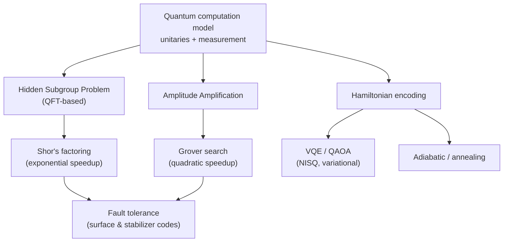

<div class="hero-section" style="background: linear-gradient(135deg, #232526 0%, #414345 100%); color: white; padding: 3rem 2rem; margin: -2rem -3rem 2rem -3rem; text-align: center;">
  <h1 style="color: white; margin: 0; font-size: 2.5rem;">Quantum Algorithms Research</h1>
  <p style="font-size: 1.25rem; margin-top: 1rem; opacity: 0.9;">Rigorous quantum complexity theory, error correction codes, and cutting-edge algorithmic developments</p>
</div>

<div class="advanced-note" markdown="1">
**Graduate-level research page.** This is a rigorous treatment of quantum complexity, error correction, and algorithm design aimed at quantum computing researchers and physicists. **Prerequisites:** linear algebra, complex analysis, group theory, computational complexity theory, and quantum mechanics fundamentals. For an accessible, hands-on introduction with runnable circuits instead, start at the [Quantum Computing Hub](../../quantum-computing/).
</div>

<div class="intro-card" markdown="1">
<p class="lead-text">Quantum computing is often mis-described as "trying all answers in parallel." The truth is subtler and more interesting: a quantum computer can prepare a superposition over exponentially many inputs, but a measurement returns only one. Quantum <em>advantage</em> comes entirely from <strong>interference</strong> — arranging unitary operations so that the amplitudes of wrong answers cancel while the amplitude of the right answer reinforces. Every algorithm below, from Shor's factoring to Grover's search, is a recipe for engineering that constructive interference.</p>
</div>

<div class="key-insights">
  <div class="insight-card"><i class="fas fa-wave-square"></i><h4>Interference, not parallelism</h4><p>Superposition is cheap; extracting a useful answer requires amplitudes to interfere so wrong outcomes cancel. That is the real source of speedup.</p></div>
  <div class="insight-card"><i class="fas fa-key"></i><h4>Exponential vs quadratic</h4><p>Shor gives an exponential speedup for factoring (a structured problem); Grover gives only a quadratic one for unstructured search — and that quadratic bound is provably optimal.</p></div>
  <div class="insight-card"><i class="fas fa-shield-virus"></i><h4>Error correction is mandatory</h4><p>Physical qubits decohere. Fault tolerance via surface/stabilizer codes — below a threshold error rate — is what makes scalable quantum computing possible at all.</p></div>
  <div class="insight-card"><i class="fas fa-microchip"></i><h4>NISQ is the present</h4><p>Today's noisy, intermediate-scale devices run variational hybrids (VQE, QAOA) that lean on a classical optimizer to tolerate hardware imperfection.</p></div>
</div>

### Map of the Algorithmic Landscape

Quantum algorithms cluster by the mathematical structure they exploit. The hidden-subgroup family (period finding) powers Shor; amplitude amplification powers Grover and its descendants; and a third family encodes problems into Hamiltonians for adiabatic or variational solution.



## Table of Contents
- [Quantum Computation Model](#quantum-computation-model)
- [Fundamental Quantum Algorithms](#fundamental-quantum-algorithms)
- [Quantum Complexity Theory](#quantum-complexity-theory)
- [Quantum Error Correction](#quantum-error-correction)
- [Quantum Machine Learning](#quantum-machine-learning)
- [Topological Quantum Computing](#topological-quantum-computing)

## Quantum Computation Model

### Mathematical Foundations

**Quantum State Space**: an $n$-qubit system lives in the $\mathbb{C}^{2^n}$ Hilbert space:

$$|\psi\rangle = \sum_{x \in \{0,1\}^n} \alpha_x |x\rangle$$

where $\sum_x |\alpha_x|^2 = 1$.

**Quantum Operations**:

1. **Unitary Evolution**: $|\psi'\rangle = U|\psi\rangle$ where $U^\dagger U = I$
2. **Measurement**: Probability of outcome x is $|\langle x|\psi\rangle|^2$
3. **Density Matrices**: Mixed states represented as $\rho = \sum_i p_i |\psi_i\rangle\langle\psi_i|$

### Quantum Circuit Model

**Universal Gate Sets**:

<div class="theory-card" markdown="1">
#### Theorem (Universality)
The set $\{H, T, \text{CNOT}\}$ is **universal**: any $n$-qubit unitary can be approximated to arbitrary precision by a circuit drawn from this finite gate set. Universality is what lets a fixed hardware gate set run any quantum program.
</div>

The set $\{H, T, \text{CNOT}\}$ is universal, where:
- Hadamard: $H = \frac{1}{\sqrt{2}}\begin{pmatrix}1 & 1\\1 & -1\end{pmatrix}$
- T-gate: $T = \begin{pmatrix}1 & 0\\0 & e^{i\pi/4}\end{pmatrix}$
- CNOT: $|x,y\rangle \mapsto |x, y \oplus x\rangle$

**Solovay–Kitaev Theorem**: Any single-qubit gate can be approximated to precision $\epsilon$ using $O(\log^c(1/\epsilon))$ gates from a finite universal set.

### Quantum Parallelism

**Principle**: Apply function to superposition of inputs:

$$U_f: |x\rangle|0\rangle \mapsto |x\rangle|f(x)\rangle$$

Applied to superposition:
$$U_f\left(\frac{1}{\sqrt{2^n}}\sum_x |x\rangle\right)|0\rangle = \frac{1}{\sqrt{2^n}}\sum_x |x\rangle|f(x)\rangle$$

## Fundamental Quantum Algorithms

### Shor's Algorithm

**Problem**: Factor $N = pq$ where $p, q$ are prime.

**Quantum Subroutine**: Find the period $r$ of $f(x) = a^x \bmod N$.

**Recent Improvements (2023-2024)**:
- Reduced quantum gate count by 30% using optimized modular arithmetic
- Demonstrated on 48-bit integers with trapped ions
- Hybrid classical-quantum approaches for larger numbers

**Algorithm**:
1. Create superposition: $\frac{1}{\sqrt{2^n}}\sum_{x=0}^{2^n-1}|x\rangle|0\rangle$
2. Compute f(x): $\frac{1}{\sqrt{2^n}}\sum_x|x\rangle|a^x \bmod N\rangle$
3. Measure the second register, obtaining the state $\frac{1}{\sqrt{|S|}}\sum_{x \in S}|x\rangle$ where $S = \{x : a^x \equiv a^s \bmod N\}$
4. Apply the QFT: $\frac{1}{\sqrt{r}}\sum_{k=0}^{r-1}e^{2\pi i sk/r}|k \cdot 2^n/r\rangle$
5. Measure, then use continued fractions to recover $r$

**Complexity**: $O((\log N)^3)$ versus the best classical $O\!\left(\exp((\log N)^{1/3})\right)$.

**Period Finding Analysis**:

**Theorem**: The probability of measuring $k \cdot 2^n/r$ (rounded) is at least $4/\pi^2$.

**Proof**: After the QFT, the amplitude of $|y\rangle$ is
$$\alpha_y = \frac{1}{2^n}\sum_{x: a^x = a^s} e^{2\pi i xy/2^n}.$$

For $y$ close to $k \cdot 2^n/r$, we have $|\alpha_y|^2 \geq 4/(\pi^2 r)$.

### Grover's Algorithm

**Problem**: Search unsorted database of N items.

**Oracle Model**: A black box $U_f$ acting as $U_f|x\rangle = (-1)^{f(x)}|x\rangle$.

**Intuition**: Grover's iteration is a geometric rotation. Start with an equal superposition; the oracle flips the sign of the target state (a reflection), and the diffusion operator reflects about the average amplitude. Each oracle+diffusion pair rotates the state vector by $2\theta$ toward the solution subspace. After $\approx \frac{\pi}{4}\sqrt{N}$ rotations the state nearly coincides with the solution — overshoot it and the amplitude rotates back down.

```mermaid
flowchart LR
    A["Uniform superposition<br/>H&#8855;n on |0&#8319;&#10217;"] --> B["Oracle U_f<br/>phase-flip solution"]
    B --> C["Diffusion D<br/>reflect about mean"]
    C --> D{"~&#8730;N<br/>iterations done?"}
    D -- no --> B
    D -- yes --> E["Measure &rArr; solution w.h.p."]
```



**Algorithm**:
1. Initialize: $|\psi\rangle = \frac{1}{\sqrt{N}}\sum_{x=0}^{N-1}|x\rangle$
2. Repeat $O(\sqrt{N})$ times:
   - Apply the oracle: $U_f|\psi\rangle$
   - Apply diffusion: $D = 2|\psi\rangle\langle\psi| - I$

**Amplitude Analysis**: Let $|\alpha\rangle$ be the uniform superposition of non-solutions and $|\beta\rangle$ the uniform superposition of solutions.

After $k$ iterations:
$$|\psi_k\rangle = \cos\!\big((2k+1)\theta\big)\,|\alpha\rangle + \sin\!\big((2k+1)\theta\big)\,|\beta\rangle$$

where $\sin\theta = \sqrt{M/N}$ and $M$ is the number of solutions.

**Optimality**:

<div class="postulate-card" markdown="1">
#### Theorem (Bennett–Bernstein–Brassard–Vazirani)
Any quantum algorithm needs $\Omega(\sqrt{N})$ oracle queries to search an unstructured database of $N$ items. Grover's $O(\sqrt{N})$ is therefore **optimal** — no quantum algorithm can do better on a truly unstructured problem.
</div>

This is a crucial reality check: the dramatic exponential speedups (Shor) require *structure* to exploit. For genuinely structureless search, quantum offers only a quadratic edge.

**Proof idea**: The hybrid/adversary method shows that a single query can change the algorithm's state by only $O(1/\sqrt{N})$ in amplitude, so $\Omega(\sqrt{N})$ queries are required to concentrate amplitude on the marked item.

### Quantum Fourier Transform

**Definition**: Maps computational basis to Fourier basis:

$$\mathrm{QFT}: |x\rangle \mapsto \frac{1}{\sqrt{N}}\sum_{y=0}^{N-1} e^{2\pi i xy/N}|y\rangle$$

**Circuit Construction** (for $N = 2^n$): the transform factorizes into a tensor product of single-qubit phases,

$$|x_1 x_2 \cdots x_n\rangle \;\mapsto\; \bigotimes_{j=1}^{n}\frac{1}{\sqrt{2}}\left(|0\rangle + e^{2\pi i\,(0.x_j x_{j+1}\cdots x_n)}|1\rangle\right),$$

which is exactly why it needs only $O(n^2)$ gates.

**Complexity**: $O(n^2)$ gates versus $O(n 2^n)$ for the classical FFT.

### HHL Algorithm (Quantum Linear Systems)

**Problem**: Solve $Ax = b$ for $x$, given a Hermitian matrix $A$.

**Key Insight**: Encode the solution in the quantum state $|x\rangle$.

**Recent Developments (2023-2024)**:
- **Quantum Singular Value Transformation**: Generalization of HHL
- **Variational Quantum Linear Solver**: NISQ-friendly alternative
- **Applications**: Quantum machine learning, differential equations

**Algorithm Steps**:
1. Prepare $|b\rangle = \sum_i \beta_i |u_i\rangle$ in the eigenbasis of $A$
2. Phase estimation: $|u_i\rangle|0\rangle \to |u_i\rangle|\lambda_i\rangle$
3. Controlled rotation: $|\lambda_i\rangle|0\rangle \to |\lambda_i\rangle\!\left(\sqrt{1 - C^2/\lambda_i^2}\,|0\rangle + \tfrac{C}{\lambda_i}|1\rangle\right)$
4. Uncompute the phase estimation
5. Post-select on $|1\rangle$

**Complexity**: $O(\log N \cdot \kappa^2/\epsilon)$ where $\kappa$ is the condition number.

## Quantum Complexity Theory

### Complexity Classes

**BQP (Bounded-Error Quantum Polynomial Time)**:
- Languages decidable by a polynomial-time quantum algorithm with error $\leq 1/3$

**Formal Definition**: $L \in \mathrm{BQP}$ iff there is a poly-time quantum algorithm $A$ with

$$x \in L \;\Rightarrow\; \Pr[A(x) = 1] \geq \tfrac{2}{3}, \qquad x \notin L \;\Rightarrow\; \Pr[A(x) = 1] \leq \tfrac{1}{3}.$$

**Relations**:
$$\mathrm{BPP} \subseteq \mathrm{BQP} \subseteq \mathrm{PP} \subseteq \mathrm{PSPACE}, \qquad \mathrm{BQP} \subseteq \mathrm{P}^{\#\mathrm{P}}.$$

### Quantum Advantage (formerly Supremacy)

**Definition**: Computational task performed by quantum computer that classical computers cannot perform in reasonable time.

**Random Circuit Sampling**:
- Generate a random quantum circuit $C$
- Sample from the distribution $|\langle x|C|0^n\rangle|^2$
- Classical simulation requires $\sim 2^n$ operations

**Recent Milestones (2023-2024)**:
- **Google Sycamore 2**: 70 qubits, error rates < 0.1%
- **IBM Condor**: 1000+ qubit processor
- **Atom Computing**: 1000+ neutral atom qubits
- **Photonic Advantage**: Gaussian boson sampling with 216 modes

**Complexity-Theoretic Evidence**:
- If efficient classical simulation exists, then polynomial hierarchy collapses

### Quantum Communication Complexity

**Model**: Alice has x, Bob has y, compute f(x,y) with minimal communication.

**Quantum Fingerprinting**:
- Classical: $\Omega(\sqrt{n})$ bits to test equality
- Quantum: $O(\log n)$ qubits suffice

**Inner Product mod 2**:
- Classical: $\Omega(n)$ bits
- Quantum: $O(\log n)$ with prior entanglement

## Quantum Error Correction

### Quantum Error Model

**Pauli Errors**: Single-qubit errors form a basis:
- $X$ (bit flip): $|0\rangle \leftrightarrow |1\rangle$
- $Z$ (phase flip): $|1\rangle \to -|1\rangle$
- $Y = iXZ$ (both)

**General Error**: $E = \sum_{P \in \{I,X,Y,Z\}^{\otimes n}} \alpha_P P$

### Stabilizer Codes

**Definition**: The code space is the joint $+1$ eigenspace of an abelian group $S \subset \mathcal{P}_n$ (the $n$-qubit Pauli group).

**Example - 5-qubit code**:
```
S = ⟨XZZXI, IXZZX, XIXZZ, ZXIXZ⟩
```

Encodes 1 logical qubit in 5 physical qubits, corrects any single-qubit error.

**Quantum Singleton Bound**: an $[[n,k,d]]$ code satisfies
$$n - k \geq 2(d-1).$$

### Surface Codes

**Definition**: Qubits on the vertices of a 2D lattice, with stabilizers on faces/vertices.

**Properties**:
- Distance $d$ requires a $d \times d$ lattice
- Threshold error rate $\sim 1\%$
- Local stabilizers (4-body)

**Recent Progress (2023-2024)**:
- **Google Willow**: Demonstrated exponential error suppression
- **Real-time decoding**: ML decoders achieve microsecond latency
- **Biased-noise codes**: Tailored to physical qubit errors
- **Floquet codes**: Dynamic error correction protocols

**Logical Operations**:
- $\bar{X}$: a string of $X$ operators across the lattice
- $\bar{Z}$: a string of $Z$ operators perpendicular to it

### Fault-Tolerant Computation

<div class="principle-card" markdown="1">
#### Threshold Theorem
If the physical per-gate error rate $p$ is below a constant threshold $p_{\text{th}}$, then arbitrarily long quantum computations can be performed reliably with only **polylogarithmic** overhead in the number of qubits and gates. This is the theoretical guarantee that scalable, fault-tolerant quantum computing is possible — the entire field of quantum error correction exists to push hardware below $p_{\text{th}}$.
</div>

In short: if physical error rate $p < p_{\text{th}}$, arbitrarily long quantum computation is possible with polylogarithmic overhead.

**Proof Idea**:
1. Concatenated codes reduce logical error exponentially
2. Fault-tolerant gates prevent error spread
3. Recursive construction maintains low error rate

## Quantum Machine Learning

### Quantum Kernel Methods

**Feature Map**: $x \mapsto |\phi(x)\rangle$ in Hilbert space.

**Quantum Kernel**: $K(x,x') = |\langle\phi(x)|\phi(x')\rangle|^2$

**Quantum Advantage**: arises when classically computing $K(x,x')$ is $\#\mathrm{P}$-hard yet the quantum circuit evaluates it efficiently.

### Variational Quantum Algorithms

**QAOA (Quantum Approximate Optimization Algorithm)**:

Hamiltonian: $H = H_c + H_b$, where $H_c$ encodes the problem and $H_b$ is the mixing term.

Ansatz: $|\psi(\vec{\gamma}, \vec{\beta})\rangle = \prod_{i=1}^p e^{-i\beta_i H_b}e^{-i\gamma_i H_c}|+\rangle^{\otimes n}$

**Performance Guarantee**: For MaxCut on 3-regular graphs:
$$\langle H_c \rangle \geq 0.6924 \cdot \text{MaxCut}$$

**Recent VQA Advances (2023-2024)**:
- **Parameter-Efficient Ansätze**: Reduced parameter count by 90%
- **Warm-Start QAOA**: Classical preprocessing improves convergence
- **Recursive QAOA**: Iterative problem size reduction
- **Quantum Natural Gradient**: Faster optimization convergence

### Quantum Neural Networks

**Parameterized Quantum Circuits**:
$$|\psi(\theta)\rangle = U(\theta)|0\rangle = \prod_i e^{-i\theta_i G_i}|0\rangle$$

**Training**: Minimize loss function:
$$L(\theta) = \langle\psi(\theta)|H|\psi(\theta)\rangle$$

**Barren Plateaus**: Variance of gradient vanishes exponentially:
$$\text{Var}[\partial_i L] \sim O(2^{-n})$$

## Topological Quantum Computing

### Anyonic Computing

**2D Anyons**: Particles with fractional statistics.

**Braiding**: Exchanging anyons implements a unitary:
$$U = \exp(i\theta)$$

**Fibonacci Anyons**: Universal for quantum computation — braiding alone suffices to approximate any gate.

### Topological Codes

**Toric Code**:
- Qubits on edges of 2D torus
- Star operators: $A_s = \prod_{i \in \text{star}(s)} X_i$
- Plaquette operators: $B_p = \prod_{i \in \text{boundary}(p)} Z_i$

**Ground Space**: 4-fold degenerate on the torus, encoding 2 logical qubits.

**Anyonic Excitations**:
- $e$-particles: violate star operators ($Z$ errors)
- $m$-particles: violate plaquette operators ($X$ errors)
- Fusion rules: $e \times e = 1$, $m \times m = 1$, $e \times m = \varepsilon$

### Kitaev Chain

**Hamiltonian**:
$$H = -\mu\sum_i c_i^\dagger c_i - t\sum_i(c_i^\dagger c_{i+1} + h.c.) + \Delta\sum_i(c_i c_{i+1} + h.c.)$$

**Topological Phase**: when $|\mu| < 2t$, the chain supports Majorana zero modes:

$$\gamma_1 = \sum_i \left(\frac{-\mu}{2t}\right)^i (c_i + c_i^\dagger)$$

## Advanced Topics

### Quantum Algorithms for Optimization

**Quantum Adiabatic Algorithm**:

Start: $H(0) = H_{\text{init}}$ (whose ground state is easy to prepare).
End: $H(T) = H_{\text{problem}}$ (whose ground state encodes the solution).

**Adiabatic Theorem**: if the spectral gap satisfies $\Delta(s) \geq g$ for all $s \in [0,1]$, then
$$T = O\!\left(\frac{\|dH/ds\|}{g^2}\right).$$

### Post-Quantum Cryptography

**Learning With Errors (LWE)**: given $(A, As + e)$ where $e$ is a small error, recover $s$.

**Quantum Reduction**: if LWE is easy, then worst-case lattice problems admit polynomial-time quantum algorithms.

### Quantum Shannon Theory

**Quantum Channel Capacity**:

**Holevo Bound**: Classical capacity of quantum channel:
$$C = \max_{\{p_i, \rho_i\}} S\left(\sum_i p_i \rho_i\right) - \sum_i p_i S(\rho_i)$$

**Quantum Capacity**: uses the coherent information,
$$Q = \max_\rho I(A\rangle B)_{\rho}.$$

## Current Research Frontiers

### NISQ Algorithms

**Variational Quantum Eigensolver (VQE)**:
- Find ground state of H
- Ansatz |ψ(θ)⟩ with classical optimization
- Challenges: Barren plateaus, noise resilience

**Breakthrough Techniques (2023-2024)**:
- **Symmetry-Preserving Ansätze**: Reduce search space
- **Adaptive VQE**: Dynamically grow circuit depth
- **Error-Mitigated VQE**: Zero-noise extrapolation
- **Quantum Embedding**: Solve larger problems on small devices

### Quantum Simulation

**Digital Quantum Simulation**: Trotter decomposition,
$$e^{-iHt} \approx \left(\prod_j e^{-iH_j t/n}\right)^n,$$

with error $O(t^2/n)$ for the first-order Trotter formula.

### Quantum Error Mitigation

**Zero Noise Extrapolation**:
- Run the circuit at noise levels $\lambda, 2\lambda, 3\lambda, \ldots$
- Extrapolate to $\lambda = 0$

**Probabilistic Error Cancellation**:
- Decompose noise as sum of Pauli operations
- Cancel via post-processing

**Advanced Mitigation (2023-2024)**:
- **Clifford Data Regression**: Learn noise from classical shadows
- **Virtual Distillation**: Exponential error suppression
- **Symmetry Verification**: Detect and correct logical errors
- **Machine Learning Mitigation**: Neural networks predict noise-free results

## Emerging Applications

### Quantum Machine Learning Applications
- **Quantum Transformers**: Attention mechanisms on quantum states
- **Quantum Diffusion Models**: Generate quantum states
- **Quantum Reinforcement Learning**: Learn optimal quantum control

### Quantum Cryptanalysis
- **Lattice Problems**: Progress on LWE with quantum computers
- **Hash Function Attacks**: Grover's algorithm optimizations
- **Post-Quantum Standardization**: NIST round 4 algorithms

## References

1. Nielsen, M. A., & Chuang, I. L. (2010). *Quantum Computation and Quantum Information*
2. Kitaev, A., Shen, A., & Vyalyi, M. (2002). *Classical and Quantum Computation*
3. Preskill, J. (2018). "Quantum Computing in the NISQ era and beyond"
4. Arute, F., et al. (2019). "Quantum supremacy using a programmable superconducting processor"
5. Gottesman, D. (1997). "Stabilizer Codes and Quantum Error Correction"
6. Google Quantum AI (2024). "Quantum error correction below the surface code threshold"
7. Kim, Y., et al. (2023). "Evidence for the utility of quantum computing before fault tolerance"
8. Huang, H.-Y., et al. (2024). "Learning to predict arbitrary quantum processes"
9. Bluvstein, D., et al. (2024). "Logical quantum processor based on reconfigurable atom arrays"
10. Acharya, R., et al. (2024). "Suppressing quantum errors by scaling a surface code logical qubit"

---

*Note: This page contains advanced quantum computing theory for researchers. For introductory quantum computing concepts, see our [main quantum computing documentation](../../quantum-computing/).*

## Key Takeaways

<div class="takeaway-grid">
  <div class="takeaway-card"><h4>Speedups come from interference</h4><p>Quantum advantage is engineered interference, not brute-force parallelism. Wrong-answer amplitudes must cancel.</p></div>
  <div class="takeaway-card"><h4>Structure determines the gain</h4><p>Shor is exponential because factoring hides periodic structure; Grover is only quadratic — and provably optimal — because search has none.</p></div>
  <div class="takeaway-card"><h4>QFT is the workhorse</h4><p>The $O(n^2)$ quantum Fourier transform underlies phase estimation, period finding, and HHL.</p></div>
  <div class="takeaway-card"><h4>Fault tolerance is achievable</h4><p>The threshold theorem guarantees scalable computation below $p_{\text{th}}$; surface codes are the leading practical route.</p></div>
  <div class="takeaway-card"><h4>NISQ relies on hybrids</h4><p>VQE and QAOA offload optimization to a classical loop, but barren plateaus and noise limit current reach.</p></div>
  <div class="takeaway-card"><h4>BQP sits between BPP and PSPACE</h4><p>Quantum is believed strictly more powerful than classical randomized computation, but not omnipotent.</p></div>
</div>

## See Also

<div class="see-also-card" markdown="1">
#### See Also

**Related Advanced Topics**
- [AI Mathematics](../ai-mathematics/) — Kernel theory underlying quantum machine learning
- [Distributed Systems Theory](../distributed-systems-theory/) — Quantum Byzantine agreement and distributed quantum computing
- [Monorepo Strategies](../monorepo/) — Managing quantum software projects

**Foundations & Applied**
- [Quantum Mechanics](../../physics/quantum-mechanics/) — Wave functions, operators, and measurement
- [Quantum Field Theory](../../physics/quantum-field-theory.html) — Deeper theoretical framework
- [Quantum Computing Hub](../../quantum-computing/) — Programming with Qiskit and Cirq
- [Quantum Computing (Technology)](../../technology/quantumcomputing.html) — Practical introduction
- [Mathematical Reference](../../reference/) — Linear algebra and complexity quick reference
</div>