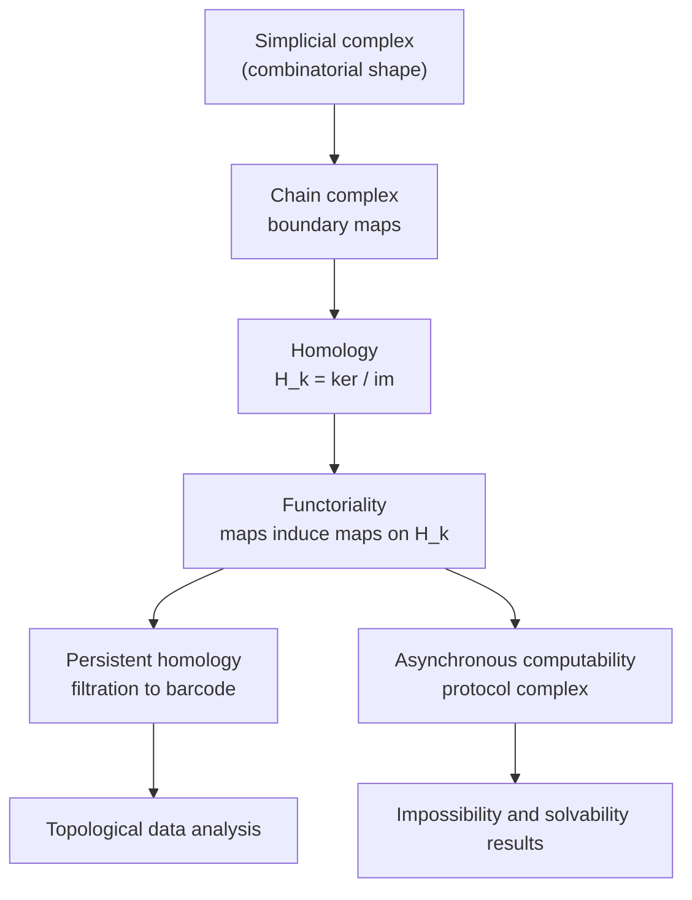

# Topology &amp; Geometry in Computation

[Advanced Topics](../) &raquo; Topology &amp; Geometry in Computation

<div class="advanced-note" markdown="1">
**Graduate-level research page.** This page develops the algebraic-topological machinery behind topological data analysis (TDA) and the topological theory of asynchronous distributed computing. **Prerequisites:** point-set topology, linear algebra over a field, basic abstract algebra (groups, quotients), and, for the distributed-computing sections, the read–write shared-memory model treated in [Distributed Systems Theory](../distributed-systems-theory/). For an applied tour of data geometry, see the [AI/ML Documentation](../../ai-ml/).
</div>

Topology studies the properties of a shape that survive continuous deformation. Two ideas make it computational. First, a finite point cloud, or the finite set of states a distributed system can reach, can be encoded as a **simplicial complex**: a combinatorial object that a computer can store. Second, the **homology groups** of that complex count connected components, loops, and voids using nothing but linear algebra, and the count does not depend on coordinates or a choice of basis. This page builds that pipeline and then applies it twice. In **topological data analysis**, persistent homology extracts multiscale structure from data. In **distributed computing**, the same homological obstructions decide which coordination tasks can be solved at all.

- **Shape becomes combinatorics.** A simplicial complex replaces a continuous space by a finite list of simplices.
- **Homology counts holes.** The Betti number $b_k = \dim H_k$ counts $k$-dimensional holes: $b_0$ components, $b_1$ loops, $b_2$ voids.
- **Persistence separates signal from noise.** Tracking homology across a range of scales ranks features by lifetime, and a stability theorem guarantees that small perturbations of the input change the result only slightly.
- **Topology decides solvability.** An asynchronous task is wait-free solvable if and only if a certain simplicial map exists from a subdivided input complex to the output complex. Connectivity obstructions are therefore impossibility proofs.

### The Logical Spine

The results form a dependency chain. The simplicial complex is the data structure. The chain complex and its boundary maps turn it into linear algebra. Homology, a kernel-modulo-image quotient, extracts the holes. Functoriality lets homology follow a whole *family* of complexes (a filtration), which is persistence. The same functorial picture, applied to the *protocol complex* of a distributed system, yields impossibility theorems.



## Topological Foundations

### What Topology Keeps and What It Forgets

Geometry keeps distances and angles. Topology discards them and keeps only what is preserved by *homeomorphisms*, which are continuous bijections with continuous inverses. A coffee mug and a doughnut are topologically the same because each has exactly one handle. Computational topology makes "number of holes" precise, independent of any basis, and computable.

<div class="theory-card" markdown="1">
#### Definition (Topological space)
A **topological space** is a set $X$ with a collection $\tau$ of subsets (the *open sets*) such that $\varnothing, X \in \tau$, $\tau$ is closed under arbitrary unions, and $\tau$ is closed under finite intersections. A map $f: X \to Y$ is **continuous** if preimages of open sets are open. $X$ and $Y$ are **homeomorphic** ($X \cong Y$) if there is a continuous bijection with continuous inverse.
</div>

Homeomorphism is too rigid to compute with directly, so applied topology works with the coarser relation of **homotopy equivalence**. Two maps $f, g: X \to Y$ are *homotopic* if one can be continuously deformed into the other. Two spaces satisfy $X \simeq Y$ if there are maps $f: X \to Y$ and $g: Y \to X$ whose composites are homotopic to the identities. Homology is a *homotopy invariant*: homotopy-equivalent spaces have isomorphic homology. We may therefore replace an awkward continuous space by any convenient combinatorial model of the same homotopy type.

### From Spaces to Invariants

The general strategy is *algebraization*. Each space is assigned an algebraic object (here a sequence of vector spaces, its homology), and each continuous map is assigned a linear map, in a way that respects composition. A topological question such as "are these spaces different?" then becomes an algebraic one: "are these vector spaces non-isomorphic?" Impossibility results follow the same way. If the required linear map cannot exist, the continuous map cannot exist either.

<div class="principle-card" markdown="1">
#### The functoriality principle
Homology is a **functor**. A continuous map $f: X \to Y$ induces linear maps $f_*: H_k(X) \to H_k(Y)$ for every $k$, with $(g \circ f)_* = g_* \circ f_*$ and $(\mathrm{id})_* = \mathrm{id}$. So if no linear maps between the homologies can satisfy a required equation, no continuous map between the spaces exists. This one observation underlies both the stability of persistence diagrams and the impossibility theorems of distributed computing.
</div>

## Simplicial Complexes

A simplicial complex is the finite, combinatorial stand-in for a space. It is the object a computer actually stores.

<div class="theory-card" markdown="1">
#### Definition (Abstract simplicial complex)
Given a finite vertex set $V$, an **abstract simplicial complex** $K$ is a collection of nonempty subsets of $V$ (the **simplices**) that is closed under taking nonempty subsets: if $\sigma \in K$ and $\varnothing \neq \tau \subseteq \sigma$, then $\tau \in K$. A simplex with $k+1$ vertices is a **$k$-simplex** of **dimension** $k$, and its nonempty subsets are its **faces**.
</div>

A 0-simplex is a vertex, a 1-simplex an edge, a 2-simplex a filled triangle, and a 3-simplex a solid tetrahedron. The **geometric realization** $\lvert K\rvert$ is built by taking one standard geometric simplex for each abstract simplex and gluing them along shared faces. The result is a genuine topological space, but every invariant on this page is computed from the combinatorial list $K$ alone.

A complex need not be simplicial. **Cubical complexes** index cells by pixels or voxels and are the natural model for images and volumetric data. **Cell (CW) complexes** allow cells with arbitrary attaching maps. The homology theory below carries over to both with the appropriate boundary maps.

### Building Complexes from Data

Real input is usually a point cloud $X = \{x_1, \dots, x_n\}$ in a metric space, not a complex. Two standard constructions turn distances into a complex that depends on a scale parameter $\varepsilon$.

<div class="theory-card" markdown="1">
#### Definition (Vietoris–Rips and Čech complexes)
For a finite metric space $X$ and scale $\varepsilon > 0$:

- The **Vietoris–Rips complex** $\mathrm{VR}_\varepsilon(X)$ contains a simplex $\{x_{i_0}, \dots, x_{i_k}\}$ whenever every pairwise distance satisfies $d(x_{i_a}, x_{i_b}) \le \varepsilon$. (It is the *clique complex* of the $\varepsilon$-neighborhood graph.)
- The **Čech complex** $\check{\mathrm{C}}_\varepsilon(X)$ contains $\{x_{i_0}, \dots, x_{i_k}\}$ whenever the closed balls $\bar B(x_{i_a}, \varepsilon/2)$ have a common point.
</div>

The Rips complex needs only pairwise distances, so it is cheap to build and very widely used. The Čech complex is geometrically faithful: by the **Nerve Theorem**, $\check{\mathrm{C}}_\varepsilon(X)$ is homotopy equivalent to the union of the balls. It is, however, expensive to test. The two complexes interleave. In Euclidean space $\mathbb{R}^d$, Jung's theorem gives

$$\check{\mathrm{C}}_{\varepsilon}(X) \subseteq \mathrm{VR}_{\varepsilon}(X) \subseteq \check{\mathrm{C}}_{\sqrt{2}\,\varepsilon}(X),$$

and in a general metric space the right-hand factor becomes $2$. An interleaving of this kind is all persistence needs: the two complexes carry the same long-lived features, up to a bounded rescaling of $\varepsilon$.

For low-dimensional Euclidean data, the **alpha complex** is usually preferable. It is the subcomplex of the Delaunay triangulation obtained by intersecting each ball with its Voronoi cell. The Nerve Theorem still applies, so it has the same homotopy type as the Čech complex, but it has far fewer simplices.

<div class="example-card" markdown="1">
#### Worked Example: a complex on four points
Take the four corners of a unit square, with side length $1$ and diagonal $\sqrt 2 \approx 1.41$, and build $\mathrm{VR}_\varepsilon$.

- **$\varepsilon < 1$:** four isolated vertices, so $b_0 = 4$.
- **$1 \le \varepsilon < \sqrt 2$:** the four sides become edges but the diagonals do not. $K$ is a 4-cycle with one 1-dimensional hole, so $b_0 = 1$ and $b_1 = 1$.
- **$\varepsilon \ge \sqrt 2$:** both diagonals appear, every triple is pairwise within $\varepsilon$, so all four triangles and the tetrahedron fill in. $K$ is contractible and $b_1 = 0$.

The loop is *born* at $\varepsilon = 1$ and *dies* at $\varepsilon = \sqrt 2$. Three of the four components die at $\varepsilon = 1$ when they merge, and one survives indefinitely. These birth–death pairs are exactly what persistent homology records.
</div>

<figure style="margin: 1.5rem auto; max-width: 640px;">
<svg viewBox="0 0 640 330" width="100%" role="img" aria-labelledby="sqfilt-title" style="color: inherit; background: transparent;">
<title id="sqfilt-title">Rips filtration of four square corners and its barcode</title>
<g fill="none" stroke="currentColor" stroke-width="2">
<circle cx="60" cy="40" r="5" fill="currentColor"/><circle cx="140" cy="40" r="5" fill="currentColor"/><circle cx="60" cy="120" r="5" fill="currentColor"/><circle cx="140" cy="120" r="5" fill="currentColor"/>
<rect x="260" y="40" width="80" height="80"/>
<circle cx="260" cy="40" r="5" fill="currentColor"/><circle cx="340" cy="40" r="5" fill="currentColor"/><circle cx="260" cy="120" r="5" fill="currentColor"/><circle cx="340" cy="120" r="5" fill="currentColor"/>
<rect x="460" y="40" width="80" height="80" fill="currentColor" fill-opacity="0.18"/>
<line x1="460" y1="40" x2="540" y2="120"/><line x1="540" y1="40" x2="460" y2="120"/>
<circle cx="460" cy="40" r="5" fill="currentColor"/><circle cx="540" cy="40" r="5" fill="currentColor"/><circle cx="460" cy="120" r="5" fill="currentColor"/><circle cx="540" cy="120" r="5" fill="currentColor"/>
</g>
<g fill="currentColor" font-size="14" text-anchor="middle" font-family="sans-serif">
<text x="100" y="150">&#949; &lt; 1: four points</text>
<text x="300" y="150">1 &#8804; &#949; &lt; &#8730;2: a loop</text>
<text x="500" y="150">&#949; &#8805; &#8730;2: filled</text>
<text x="40" y="199" text-anchor="start">H0</text>
<text x="40" y="279" text-anchor="start">H1</text>
<text x="100" y="322">0</text><text x="340" y="322">1</text><text x="448" y="322">&#8730;2</text><text x="600" y="322">&#949;</text>
</g>
<g stroke="currentColor" stroke-width="6" stroke-linecap="butt">
<line x1="100" y1="180" x2="590" y2="180"/>
<line x1="100" y1="194" x2="340" y2="194"/>
<line x1="100" y1="208" x2="340" y2="208"/>
<line x1="100" y1="222" x2="340" y2="222"/>
<line x1="340" y1="274" x2="448" y2="274"/>
</g>
<g stroke="currentColor" stroke-width="1" fill="none">
<line x1="100" y1="300" x2="610" y2="300"/>
<line x1="340" y1="170" x2="340" y2="300" stroke-dasharray="4 4" stroke-opacity="0.5"/>
<line x1="448" y1="170" x2="448" y2="300" stroke-dasharray="4 4" stroke-opacity="0.5"/>
<polyline points="582,172 592,180 582,188"/>
</g>
</svg>
<figcaption>Top: the Rips complex of the four corners of a unit square at three scales. Bottom: the resulting barcode. In H0, one bar is infinite and three die at &#949; = 1. In H1, a single bar spans [1, &#8730;2).</figcaption>
</figure>

## Simplicial Homology

Homology turns a complex into a sequence of vector spaces whose dimensions count holes. We work over a field $\mathbb{F}$, most often $\mathbb{F}_2 = \mathbb{Z}/2$, which removes the need to track orientation signs. The chain groups are then vector spaces, and so are the homology groups. Over $\mathbb{Z}$, homology can also contain *torsion* (for example $H_1(\mathbb{RP}^2;\mathbb{Z}) = \mathbb{Z}/2$), which field coefficients either lose or detect depending on the characteristic.

### Chains, Boundaries, Cycles

<div class="theory-card" markdown="1">
#### Definition (Chain complex)
Let $C_k(K)$ be the $\mathbb{F}$-vector space with basis the $k$-simplices of $K$. The **boundary map** $\partial_k : C_k \to C_{k-1}$ sends an oriented simplex to the alternating sum of its codimension-one faces:

$$\partial_k [v_0, v_1, \dots, v_k] = \sum_{i=0}^{k} (-1)^i [v_0, \dots, \hat v_i, \dots, v_k],$$

where $\hat v_i$ means that $v_i$ is omitted. The sequence $(C_k, \partial_k)$ is the **chain complex** of $K$.
</div>

Homology rests on one fact: a boundary has no boundary.

$$\partial_{k-1} \circ \partial_k = 0 \quad\Longleftrightarrow\quad \operatorname{im} \partial_{k} \subseteq \ker \partial_{k-1}.$$

Elements of $Z_k := \ker \partial_k$ are **cycles**, closed chains such as loops with no endpoints. Elements of $B_k := \operatorname{im}\partial_{k+1}$ are **boundaries**, cycles that bound a higher-dimensional region. Since $B_k \subseteq Z_k$, we can form the quotient.

<div class="principle-card" markdown="1">
#### Definition (Homology and Betti numbers)
The **$k$-th homology group** is the quotient vector space

$$H_k(K) = Z_k / B_k = \ker \partial_k \,/\, \operatorname{im}\partial_{k+1}.$$

Its dimension is the **$k$-th Betti number** $b_k = \dim_{\mathbb F} H_k(K)$. In low dimensions, $b_0$ counts connected components, $b_1$ independent loops, and $b_2$ enclosed voids. A cycle that is *not* a boundary represents a genuine hole. Taking the quotient by $B_k$ discards holes that have been filled in.
</div>

<div class="example-card" markdown="1">
#### Worked Example: homology of a hollow triangle
Let $K$ be the boundary of a triangle, with vertices $\{a,b,c\}$, edges $\{ab, bc, ca\}$, and no 2-simplex. Over $\mathbb{F}_2$:

- $\partial_1(ab) = a+b$, and similarly for the other edges. The chain $z = ab + bc + ca$ has $\partial_1 z = (a+b)+(b+c)+(c+a) = 0$, so $z \in Z_1$.
- There are no 2-simplices, so $B_1 = \operatorname{im}\partial_2 = 0$.
- $\partial_1$ has rank $2$ on the 3-dimensional edge space, so $\dim Z_1 = 1$ and $H_1 = Z_1 = \langle z\rangle$. This gives $b_1 = 1$, one loop.
- The figure is connected, so $b_0 = 3 - \operatorname{rank}\partial_1 = 1$.

The **Euler characteristic** provides a check: $\chi = b_0 - b_1 = 0$, which matches $\#\text{vertices} - \#\text{edges} = 3 - 3 = 0$. In general the **Euler–Poincaré formula** says $\chi = \sum_k (-1)^k b_k = \sum_k (-1)^k \,\#\{k\text{-simplices}\}$. The same homotopy invariant is computed in two different ways.
</div>

### Computing Homology

Over a field, Betti numbers are determined by the ranks of the boundary matrices (rank–nullity):

$$b_k = \dim C_k - \operatorname{rank}\partial_k - \operatorname{rank}\partial_{k+1}.$$

Gaussian elimination gives each rank. When torsion matters, the Smith normal form over $\mathbb{Z}$ is used instead. Dense elimination costs $O(n^3)$ in the number of simplices $n$, and matrix-multiplication-time algorithms reach $O(n^\omega)$. In practice the boundary matrices are extremely sparse, and persistence uses a column-reduction algorithm designed for filtrations, described below.

**Cohomology** is the dual theory: cochains $C^k = \operatorname{Hom}(C_k, \mathbb F)$ with the transposed coboundary $\delta^k$. Over a field it has the same Betti numbers. Its extra structure (the cup product) and its better computational behavior on Rips filtrations are the reasons Ripser computes persistent *co*homology.

## Persistent Homology and TDA

Single-scale homology forces a choice of $\varepsilon$. If it is too small, the complex is scattered dust. If it is too large, everything fuses into one blob. **Persistent homology** avoids the choice by computing homology at all scales at once and recording when each feature is born and when it dies.


### Filtrations and the Persistence Module

<div class="theory-card" markdown="1">
#### Definition (Filtration and persistence module)
A **filtration** of $K$ is a nested family of subcomplexes indexed by a scale parameter:

$$\varnothing = K_0 \subseteq K_1 \subseteq \cdots \subseteq K_N = K.$$

Applying $H_k(-;\mathbb F)$ and the maps induced by inclusion gives a **persistence module**, a sequence of vector spaces connected by linear maps:

$$H_k(K_0) \to H_k(K_1) \to \cdots \to H_k(K_N).$$

For $i \le j$, the map $H_k(K_i) \to H_k(K_j)$ records which homology classes survive from scale $i$ to scale $j$.
</div>

A class is **born** at the first index where it appears. It **dies** at the first index where it becomes a boundary or merges into an older class (the *elder rule*: when two classes merge, the younger one dies). The **persistence** of a feature is $\text{death} - \text{birth}$.

<div class="principle-card" markdown="1">
#### Structure Theorem (decomposition into intervals)
Over a field, a pointwise finite-dimensional persistence module indexed by a totally ordered set decomposes **uniquely**, up to isomorphism and reordering, as a direct sum of *interval modules* $\mathbb{I}[b, d)$. Each interval module is $\mathbb F$ on $[b,d)$ and zero elsewhere, with identity maps inside the interval. Each interval is one **bar**, and the multiset of bars is a complete invariant of the module. (Zomorodian and Carlsson, 2005, for finite filtrations; Crawley-Boevey, 2015, in general.)
</div>

The collection of bars is the **barcode**. Plotting each bar as a point $(b,d)$ gives the equivalent **persistence diagram**. Long bars, whose points lie far from the diagonal $b=d$, are robust topological features. Short bars are usually noise.

<div class="example-card" markdown="1">
#### Worked Example: a noisy circle
Sample $200$ points near the unit circle with small radial jitter and build the Vietoris–Rips filtration.

- **$H_0$:** at $\varepsilon=0$ there are 200 components. They merge quickly as $\varepsilon$ grows, so the $H_0$ barcode is one infinite bar (the connected circle) plus many short bars.
- **$H_1$:** a single long bar appears once $\varepsilon$ is large enough to close the ring and dies once the disk fills in, at roughly $\varepsilon \approx \sqrt 3$, the side of an inscribed equilateral triangle. That bar is the circle's loop. The algorithm recovers $b_1 = 1$ without being told the data came from a circle, and despite the noise.

The gap between the one long $H_1$ bar and the cloud of short ones is the core of TDA: **persistence ranks features by lifetime**, which separates signal from sampling noise without a hand-picked scale.
</div>

### The Stability Theorem

Persistence would be of little use if a tiny perturbation of the data could scramble the diagram. The **stability theorem** rules this out. Diagrams are compared with the **bottleneck distance** $W_\infty(D_1, D_2)$: the smallest $\delta$ for which there is a bijection between the points of $D_1$ and $D_2$ that moves every point by at most $\delta$ in the $\ell^\infty$ norm. Points may be matched to the diagonal.

<div class="principle-card" markdown="1">
#### Stability Theorem (Cohen-Steiner–Edelsbrunner–Harer, 2007)
If $f, g: \lvert K\rvert \to \mathbb{R}$ are tame functions whose sublevel-set filtrations have persistence diagrams $D_f, D_g$, then

$$W_\infty(D_f, D_g) \le \lVert f - g \rVert_\infty.$$

For point clouds (Chazal–de Silva–Oudot, 2014), the Rips diagrams of two finite metric spaces satisfy $W_\infty \le 2\, d_{GH}(X,Y)$ in the diameter convention used here, where $d_{GH}$ is the Gromov–Hausdorff distance. The Hausdorff distance between two samples of the same space bounds $d_{GH}$. Persistence is therefore **Lipschitz**: a small perturbation of the input produces a small change in the diagram, so short bars stay short.
</div>

Stability is the property that justifies statistics on diagrams. It allows confidence sets, bootstrap bands that separate significant bars from noise, and the use of diagrams as inputs to learning algorithms.

### The Persistence Algorithm

The **standard algorithm** computes the barcode by reducing the *filtered boundary matrix* $D$, whose rows and columns are ordered by the time each simplex enters the filtration. Columns are processed left to right. Each column is reduced by adding earlier columns until its lowest nonzero entry, $\mathrm{low}(j)$, is not shared with any earlier column. After reduction:

- a column that becomes zero belongs to a **positive** simplex, which creates a cycle (a birth);
- a nonzero column $j$ with $\mathrm{low}(j) = i$ belongs to a **negative** simplex, which kills the class born at simplex $i$. This gives the bar $[t_i, t_j)$;
- a positive simplex that is never paired gives an infinite bar.

```python
import numpy as np

def persistence_pairs(D):
    """Standard persistence reduction over F2.

    D: square 0/1 NumPy array, the filtered boundary matrix, with
       rows and columns in filtration order. It is modified in place.
    Returns (pairs, essential): birth-death simplex index pairs and the
    indices of simplices that create classes which never die.
    """
    n = D.shape[1]
    low_to_col = {}                       # pivot row -> column that owns it
    pairs = []
    for j in range(n):
        while D[:, j].any():
            low = np.flatnonzero(D[:, j])[-1]
            k = low_to_col.get(low)
            if k is None:
                low_to_col[low] = j       # simplex `low` is born, `j` kills it
                pairs.append((low, j))
                break
            D[:, j] ^= D[:, k]            # add the earlier column (mod 2)
    paired = {i for p in pairs for i in p}
    essential = [j for j in range(n) if j not in paired and not D[:, j].any()]
    return pairs, essential
```

The worst case is cubic in the number of simplices. Real complexes are sparse, however, and production implementations (PHAT, Ripser, GUDHI) add further optimizations. **Clearing** (the twist) skips columns already known to reduce to zero. **Apparent pairs** are read off without any reduction. Computing **cohomology** makes clearing far more effective on Rips filtrations. Together these make filtrations with hundreds of millions of simplices routine.

### Applications of TDA

- **Shape of data.** Recovering loops, voids, and branching from high-dimensional point clouds. Examples include the $H_1$ circle and Klein-bottle structure in natural-image patch statistics, the toroidal population activity of grid cells in neuroscience, and branching trajectories in single-cell genomics.
- **Featurization for machine learning.** Persistence diagrams are converted into vectors (*persistence images*, *landscapes*, *silhouettes*) or compared with kernels (the sliced-Wasserstein kernel, for example) so they can feed standard classifiers. This connects to the kernel methods in [AI Mathematics](../ai-mathematics/).
- **Materials and molecules.** Persistence of atomic configurations characterizes pore geometry in porous materials, medium-range order in glasses, and protein-ligand binding sites.
- **Sensor coverage.** Homological criteria can certify that a network of range-limited sensors covers a region with no holes, *without* knowing the sensors' coordinates.
- **Time series.** Sliding-window (Takens) embeddings turn periodic behavior into a persistent $H_1$ loop, which gives a topological detector for periodicity.
- **Analysis of learned representations.** Persistence of activation and embedding point clouds is used to study how the topology of data changes through the layers of a neural network, and to compare representations across models.

## Topology in Distributed Computing

In computer science, one of the deepest uses of combinatorial topology is not data analysis. It is the question of what asynchronous distributed systems *can and cannot* compute. The **asynchronous computability theorem** of Herlihy and Shavit recasts solvability as the existence of a simplicial map. Herlihy–Shavit and Saks–Zaharoglou shared the 2004 Gödel Prize for the topological proofs that wait-free $k$-set agreement is impossible. Borowsky and Gafni obtained the same result independently in 1993.

### Encoding Computation as Topology

In the wait-free shared-memory model, $n+1$ processes communicate through atomic read–write registers. Any subset of them may run at arbitrary relative speeds or crash. A *wait-free* protocol must let every non-faulty process finish in a bounded number of its own steps, whatever the others do. The key idea is to encode global states as simplices.

<div class="theory-card" markdown="1">
#### Definition (Input, output, and protocol complexes)
- The **input complex** $\mathcal I$ has one vertex per (process id, input value) pair. Its simplices are sets of such vertices with distinct process ids, each a consistent assignment of inputs to a group of processes.
- The **output complex** $\mathcal O$ is defined in the same way for output values. Its simplices are the *legal* joint outputs.
- A **task** is a carrier map $\Delta$ that assigns to each input simplex the subcomplex of output simplices allowed for it.
- The **protocol complex** $\mathcal P$ is the complex of reachable final states. Each vertex is one process's local view (its id together with everything it has read), and each simplex is a set of views that can occur together in a single execution.
</div>

A protocol *solves* the task if there is a **simplicial map** $\delta : \mathcal P \to \mathcal O$, a vertex map that sends simplices to simplices, that is *carried by* $\Delta$. In other words, each process's final view is mapped to an output that is legal for the inputs actually present. Simplicial maps are the combinatorial counterpart of continuous maps, so solvability becomes the topological question of whether $\mathcal P$ can be mapped into $\mathcal O$ compatibly with $\Delta$.

<div class="principle-card" markdown="1">
#### Asynchronous Computability Theorem (Herlihy–Shavit, 1999)
A task $(\mathcal I, \mathcal O, \Delta)$ is **wait-free solvable** by $n+1$ asynchronous processes using read–write registers **if and only if** there exist a chromatic subdivision $\mathrm{Div}(\mathcal I)$ of the input complex and a color-preserving simplicial map

$$\delta : \mathrm{Div}(\mathcal I) \to \mathcal O$$

that is carried by $\Delta$.
</div>

The reason is geometric. One round of the *immediate-snapshot* protocol, in which each process writes its value and then takes an atomic snapshot of memory, produces the **standard chromatic subdivision** of each participating simplex. Repeated rounds iterate that subdivision, and any wait-free read–write protocol can be simulated in this iterated model. A subdivision refines a simplex into smaller pieces without tearing it, changing its connectivity, or creating holes: its geometric realization is homeomorphic to the original. Every impossibility result below comes from this fact.

<figure style="margin: 1.5rem auto; max-width: 640px;">
<svg viewBox="0 0 640 220" width="100%" role="img" aria-labelledby="chrom-title" style="color: inherit; background: transparent;">
<title id="chrom-title">One immediate-snapshot round subdivides an input edge into three edges</title>
<g stroke="currentColor" stroke-width="2" fill="none">
<line x1="60" y1="60" x2="580" y2="60"/>
<line x1="60" y1="160" x2="580" y2="160"/>
<circle cx="60" cy="60" r="8" fill="currentColor"/>
<circle cx="580" cy="60" r="8" fill="currentColor" fill-opacity="0.001"/>
<circle cx="60" cy="160" r="8" fill="currentColor"/>
<circle cx="233" cy="160" r="8" fill="currentColor" fill-opacity="0.001"/>
<circle cx="407" cy="160" r="8" fill="currentColor"/>
<circle cx="580" cy="160" r="8" fill="currentColor" fill-opacity="0.001"/>
</g>
<g fill="currentColor" font-size="14" font-family="sans-serif" text-anchor="middle">
<text x="320" y="40">input edge: P has input 0, Q has input 1</text>
<text x="60" y="95">P:0</text><text x="580" y="95">Q:1</text>
<text x="60" y="195">P sees {P}</text>
<text x="233" y="195">Q sees {P,Q}</text>
<text x="407" y="195">P sees {P,Q}</text>
<text x="580" y="195">Q sees {Q}</text>
<text x="320" y="128">after one round: three edges, still one connected path</text>
</g>
</svg>
<figcaption>The chromatic subdivision for two processes. Filled circles are process P and hollow circles are process Q. The three edges correspond to the three possible orders: P runs first, both run concurrently, or Q runs first. The subdivided edge is still connected, so it cannot be mapped onto an output complex that splits into disconnected pieces.</figcaption>
</figure>

### Impossibility via Connectivity

A subdivision preserves connectivity. A task is therefore unsolvable whenever its output complex is less connected than the task requires of the image of any subdivision of the input. The canonical example is **consensus**.

<div class="example-card" markdown="1">
#### Worked Example: why wait-free consensus is impossible
Consider two processes that must agree on a bit. The input complex has four vertices, $P{:}0, P{:}1, Q{:}0, Q{:}1$, and an edge joining every $P$ vertex to every $Q$ vertex. It is a 4-cycle and in particular **connected**. The output complex for binary consensus consists of the two edges "both decide 0" and "both decide 1", which are **disjoint**.

Validity requires the edge $\{P{:}0, Q{:}0\}$ to be mapped into "both decide 0" and $\{P{:}1, Q{:}1\}$ into "both decide 1". The mixed edge $\{P{:}0, Q{:}1\}$ joins these two regions, and any subdivision of it is still a connected path from a 0-deciding vertex to a 1-deciding vertex. A simplicial map sends connected complexes to connected complexes, so the path would have to land inside a single component of the output. It cannot. Wait-free consensus is therefore impossible. This is the shared-memory, topological counterpart of the [FLP impossibility result](../distributed-systems-theory/), obtained from connectivity alone.
</div>

The framework grades tasks by how much connectivity they require:

- **Consensus** fails because of a $0$-dimensional obstruction, disconnection. It is impossible wait-free even for two processes.
- **$k$-set agreement** requires that at most $k$ distinct input values be decided among $n+1$ processes. It is wait-free solvable if and only if $k \ge n+1$, where the trivial protocol in which each process decides its own input works. The lower bound uses **Sperner's lemma**: every subdivision of an $n$-simplex whose vertices are colored consistently with the boundary contains a fully colored ("rainbow") small simplex. That simplex is an execution in which $n+1$ distinct values are decided, so $n$-set agreement is impossible. Here a classical combinatorial-topology lemma is exactly a lower bound in computing.
- **Renaming** requires processes to pick distinct names from a small namespace. For $n+1$ processes, $2n+1$ names always suffice. Castañeda and Rajsbaum proved that $2n$ names suffice **if and only if $n+1$ is not a prime power**. This corrected an error in the original topological lower-bound proof, and the number-theoretic condition comes from the topology of the associated *weak symmetry breaking* task.

<div class="principle-card" markdown="1">
#### The unifying message
Asynchronous solvability is a **topological property of the task**, not an artifact of a particular protocol or proof technique. The obstruction is the higher-dimensional connectivity of the protocol complex. A task is solvable if and only if its output complex can receive a sufficiently fine subdivision of the inputs in a way the task allows. The classical pencil-and-paper impossibility proofs, such as bivalency arguments, are low-dimensional special cases of a single connectivity statement.
</div>

The same approach extends well beyond read–write registers. Adding objects such as test-and-set or compare-and-swap, or tolerating only $t$ crashes, changes which protocol complexes can be built. This gives geometric characterizations of $t$-resilient computation, of message-passing models, and of the levels of Herlihy's **consensus hierarchy**, which connects to the consensus-number theory in [Distributed Systems Theory](../distributed-systems-theory/).

## Computation and Tooling

Computational topology has a mature software ecosystem.

| Library | Language | Strengths |
|---------|----------|-----------|
| **GUDHI** | C++ / Python | Broadest coverage: Rips, alpha, Čech, witness, cubical, and simplex-tree complexes; persistence, representations, and scikit-learn-style estimators. Actively released (3.13 in July 2026). |
| **Ripser** / **ripser.py** | C++ / Python | Very fast Vietoris–Rips persistence using cohomology, clearing, and apparent pairs. The standard baseline. |
| **Ripser++** | CUDA / Python | GPU port of Ripser, with large speedups on big Rips filtrations. |
| **PHAT / DIPHA** | C++ | Reference implementations of matrix reduction, shared-memory and distributed. |
| **Dionysus 2** | C++ / Python | Zigzag persistence, cohomology, and persistent cohomology circular coordinates. |
| **giotto-tda, scikit-tda (persim, kmapper)** | Python | Integration with scikit-learn pipelines, Mapper graphs, diagram distances, and vectorizations. |
| **multipers, RIVET** | Python / C++ | Two- and multi-parameter persistence. multipers supports PyTorch autodiff. |
| **TopoX (TopoNetX, TopoModelX)** | Python | Data structures and neural layers for topological deep learning on simplicial and cell complexes. |

A minimal persistence computation on a point cloud:

```python
import numpy as np
from ripser import ripser
from persim import plot_diagrams

rng = np.random.default_rng(0)

# Sample a noisy circle: 200 points with radial jitter
theta = rng.uniform(0, 2 * np.pi, 200)
r = 1.0 + 0.05 * rng.standard_normal(200)
X = np.column_stack([r * np.cos(theta), r * np.sin(theta)])

# Vietoris-Rips persistence in dimensions 0 and 1
dgms = ripser(X, maxdim=1)["dgms"]   # dgms[0]: H0 pairs, dgms[1]: H1 pairs

h1 = dgms[1]
lifetimes = h1[:, 1] - h1[:, 0]
print("most persistent H1 bar:", h1[lifetimes.argmax()])   # death near sqrt(3)

plot_diagrams(dgms, show=False)
```

**Complexity in practice.** A Rips complex on $n$ points has up to $\binom{n}{k+1}$ simplices of dimension $k$, so the size grows combinatorially in $n$ and exponentially in dimension. Several mitigations are standard:

- cap the maximum homology dimension, since $H_0$ and $H_1$ are often enough;
- truncate the filtration at a threshold radius;
- use **sparse Rips** (Sheehy), which approximates the filtration with a guaranteed multiplicative error and has linear size;
- build **witness complexes** on a small set of landmark points;
- use **alpha complexes** in low ambient dimension, which have the exact homotopy type with far fewer simplices;
- use **cubical complexes** for image and voxel data.

## Research Frontiers

- **Multiparameter persistence.** Filtering by two or more parameters at once (for example scale *and* density, which makes the result robust to outliers) produces modules over $\mathbb{F}[x_1, \dots, x_m]$. These have no complete discrete invariant analogous to the barcode. Current work focuses on computable, stable partial invariants: the rank invariant, fibered barcodes, signed barcodes, Hilbert-function decompositions, and multiparameter landscapes. Libraries such as multipers make these usable in machine-learning pipelines.
- **Topological deep learning.** Message passing on simplicial, cell, and combinatorial complexes, sheaf neural networks, and differentiable persistence layers bring higher-order topology into trainable models. The persistence map is differentiable almost everywhere, and its subgradients are well characterized, so topological losses and regularizers can be optimized with ordinary gradient descent.
- **Statistical foundations.** Confidence sets for persistence diagrams, bootstrap and subsampling procedures, Fréchet means in diagram space, and limit theorems for persistence summaries give TDA a rigorous inferential basis.
- **Beyond wait-free.** Topological characterizations of $t$-resilient, message-passing, Byzantine, and dynamic-network models. The relationship between higher-dimensional connectivity and the round and space complexity of tasks such as set agreement is still only partly understood.
- **Dynamics and directed data.** Zigzag persistence for time-varying complexes, directed flag complexes for connectomes and other directed networks, and persistence of dynamical systems through Conley-index methods.

## References and Further Reading

1. Edelsbrunner, H., & Harer, J. (2010). *Computational Topology: An Introduction*. AMS.
2. Hatcher, A. (2002). *Algebraic Topology*. Cambridge University Press. (Standard reference for simplicial homology.)
3. Carlsson, G. (2009). "Topology and Data." *Bulletin of the AMS*, 46(2).
4. Zomorodian, A., & Carlsson, G. (2005). "Computing Persistent Homology." *Discrete & Computational Geometry*, 33.
5. Cohen-Steiner, D., Edelsbrunner, H., & Harer, J. (2007). "Stability of Persistence Diagrams." *Discrete & Computational Geometry*, 37.
6. Chazal, F., de Silva, V., & Oudot, S. (2014). "Persistence stability for geometric complexes." *Geometriae Dedicata*, 173.
7. Otter, N., Porter, M. A., Tillmann, U., Grindrod, P., & Harrington, H. A. (2017). "A roadmap for the computation of persistent homology." *EPJ Data Science*, 6.
8. Bauer, U. (2021). "Ripser: efficient computation of Vietoris–Rips persistence barcodes." *Journal of Applied and Computational Topology*, 5.
9. Botnan, M. B., & Lesnick, M. (2023). "An Introduction to Multiparameter Persistence." In *Representations of Algebras and Related Structures*, EMS Press.
10. Herlihy, M., & Shavit, N. (1999). "The Topological Structure of Asynchronous Computability." *Journal of the ACM*, 46(6).
11. Saks, M., & Zaharoglou, F. (2000). "Wait-Free k-Set Agreement Is Impossible: The Topology of Public Knowledge." *SIAM Journal on Computing*, 29(5).
12. Herlihy, M., Kozlov, D., & Rajsbaum, S. (2013). *Distributed Computing Through Combinatorial Topology*. Morgan Kaufmann.
13. Castañeda, A., & Rajsbaum, S. (2010, 2012). "New combinatorial topology bounds for renaming: the lower bound" and "... the upper bound." *Distributed Computing* and *Journal of the ACM*.

## See Also

<div class="see-also-card" markdown="1">
#### See Also

**Related Advanced Topics**
- [Distributed Systems Theory](../distributed-systems-theory/): FLP impossibility and consensus, the operational counterpart of the topological computability results here
- [AI Mathematics](../ai-mathematics/): kernel methods and RKHS that consume persistence-based features, and statistical learning theory
- [Quantum Algorithms Research](../quantum-algorithms-research/): topological quantum computing and anyonic braiding, a different role for topology in computation
- [Monorepo Strategies](../monorepo/): build-graph and dependency-graph modeling at scale

**Applied & Foundational**
- [AI/ML Documentation](../../ai-ml/): practical dimensionality reduction, manifold learning, and clustering
- [Computational Physics](../../physics/computational-physics/): numerical methods, meshing, and simulation that share simplicial machinery
- [Mathematical Reference](../../reference/): linear algebra and group theory quick reference
</div>
