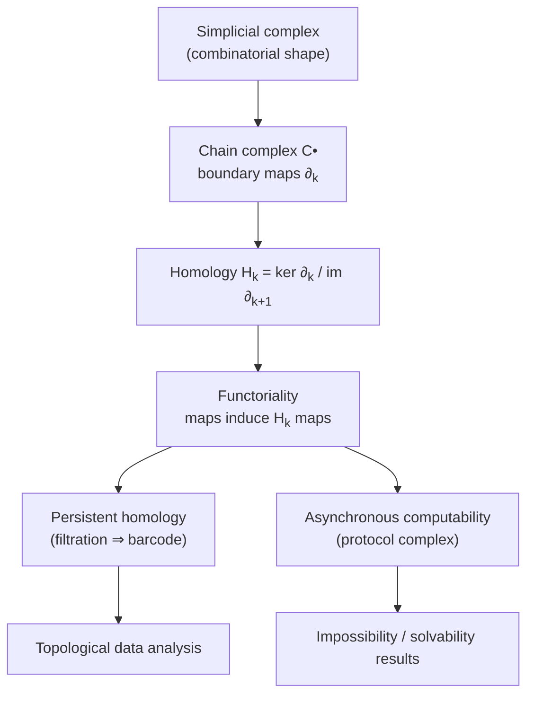

<div class="hero-section" style="background: linear-gradient(135deg, #232526 0%, #414345 100%); color: white; padding: 3rem 2rem; margin: -2rem -3rem 2rem -3rem; text-align: center;">
  <h1 style="color: white; margin: 0; font-size: 2.5rem;">Topology &amp; Geometry in Computation</h1>
  <p style="font-size: 1.25rem; margin-top: 1rem; opacity: 0.9;">Simplicial complexes, persistent homology, and the topological theory of distributed solvability and data analysis</p>
</div>

[Advanced Topics](./) &raquo; Topology &amp; Geometry in Computation

<div class="advanced-note" markdown="1">
**Graduate-level research page.** This page develops the algebraic-topological machinery behind topological data analysis (TDA) and the topological theory of asynchronous distributed computing, for researchers in applied topology, theoretical computer science, and data science. **Prerequisites:** point-set topology, linear algebra over fields, basic abstract algebra (groups, rings, quotients), and — for the distributed-computing sections — the read–write shared-memory model treated in [Distributed Systems Theory](../distributed-systems-theory/). For a gentler, applied tour of data geometry instead, see the [AI/ML Documentation](../../ai-ml/).
</div>

<div class="intro-card" markdown="1">
<p class="lead-text">Topology is the mathematics of shape that survives continuous deformation — what stays the same when you stretch but do not tear. Two ideas turn this into a computational tool. First, the shape of a finite point cloud or a finite set of process states can be encoded as a <em>simplicial complex</em>, a combinatorial object a computer can store and manipulate. Second, the algebraic invariants of that complex — its <em>homology groups</em> — count connected components, loops, and voids in a way that is robust to noise and basis choice. This page builds that pipeline twice: once for <strong>topological data analysis</strong>, where persistent homology reads multiscale structure out of data, and once for <strong>distributed computing</strong>, where the same homological obstructions decide which coordination tasks are solvable at all.</p>
</div>

<div class="key-insights">
  <div class="insight-card"><i class="fas fa-cubes"></i><h4>Shape becomes combinatorics</h4><p>A simplicial complex turns a continuous space into a finite list of simplices, so its topology can be computed with linear algebra over a field.</p></div>
  <div class="insight-card"><i class="fas fa-circle-notch"></i><h4>Homology counts holes</h4><p>The Betti number b<sub>k</sub> = dim H<sub>k</sub> counts k-dimensional holes: b<sub>0</sub> components, b<sub>1</sub> loops, b<sub>2</sub> voids. It is a deformation invariant.</p></div>
  <div class="insight-card"><i class="fas fa-wave-square"></i><h4>Persistence separates signal from noise</h4><p>Tracking homology across a filtration ranks features by how long they survive; long bars are real structure, short bars are noise — with a stability guarantee.</p></div>
  <div class="insight-card"><i class="fas fa-network-wired"></i><h4>Topology decides solvability</h4><p>An asynchronous task is solvable iff a continuous-looking simplicial map exists between input and output complexes — connectivity obstructions are impossibility proofs.</p></div>
</div>

### The Logical Spine

The results below form a dependency chain, not a grab-bag. A simplicial complex is the data structure; the chain complex and its boundary maps turn it into algebra; homology is the cokernel/kernel quotient that extracts holes; functoriality lets homology track a *family* of complexes (a filtration), which is persistence; and the same functorial picture, applied to the *protocol complex* of a distributed system, yields impossibility theorems.



## Table of Contents
- [Topological Foundations](#topological-foundations)
- [Simplicial Complexes](#simplicial-complexes)
- [Simplicial Homology](#simplicial-homology)
- [Persistent Homology and TDA](#persistent-homology-and-tda)
- [Topology in Distributed Computing](#topology-in-distributed-computing)
- [Computation and Tooling](#computation-and-tooling)
- [Research Frontiers](#research-frontiers)

## Topological Foundations

### What Topology Keeps and What It Forgets

**Intuition.** Geometry remembers distances and angles; topology forgets them and remembers only what is preserved by *homeomorphisms* — continuous bijections with continuous inverses. A coffee mug and a doughnut are the same to a topologist because each has exactly one handle (one "hole"). The job of computational topology is to make "number of holes" precise, basis-independent, and computable.

<div class="theory-card" markdown="1">
#### Definition (Topological space)
A **topological space** is a set $X$ with a collection $\tau$ of subsets (the *open sets*) such that $\varnothing, X \in \tau$, $\tau$ is closed under arbitrary unions, and $\tau$ is closed under finite intersections. A map $f: X \to Y$ is **continuous** if preimages of open sets are open. $X$ and $Y$ are **homeomorphic** ($X \cong Y$) if there is a continuous bijection with continuous inverse.
</div>

Homeomorphism is too rigid to compute with directly, so applied topology works one level coarser, with **homotopy equivalence**: two maps $f, g: X \to Y$ are homotopic if one can be continuously deformed into the other, and $X \simeq Y$ if there are maps whose composites are homotopic to the identities. Homology, the central invariant of this page, is a *homotopy invariant*: homotopy-equivalent spaces have identical homology, so we may replace an awkward continuous space by any convenient combinatorial model of the same homotopy type.

### From Spaces to Invariants

The strategy is *algebraization*: assign to each space an algebraic object (here a sequence of vector spaces, its homology) and to each continuous map a linear map, in a way that respects composition. Then a topological question ("are these spaces different?") reduces to an algebraic one ("are these vector spaces non-isomorphic?"), and impossibility ("there is no continuous map of such-and-such kind") follows whenever the induced algebra cannot exist.

<div class="principle-card" markdown="1">
#### The functoriality principle
Homology is a **functor**: a continuous map $f: X \to Y$ induces linear maps $f_*: H_k(X) \to H_k(Y)$ for every $k$, with $(g \circ f)_* = g_* \circ f_*$ and $(\mathrm{id})_* = \mathrm{id}$. Consequently, if no linear map between the homologies can satisfy a required equation, no continuous map between the spaces exists. This single observation is what powers both the stability of persistence diagrams and the impossibility theorems of distributed computing.
</div>

## Simplicial Complexes

A simplicial complex is the finite, combinatorial stand-in for a space — the object a computer actually stores.

<div class="theory-card" markdown="1">
#### Definition (Abstract simplicial complex)
Given a finite vertex set $V$, an **abstract simplicial complex** $K$ is a collection of nonempty subsets of $V$ (called **simplices**) that is closed under taking nonempty subsets: if $\sigma \in K$ and $\varnothing \neq \tau \subseteq \sigma$, then $\tau \in K$. A simplex with $k+1$ vertices is a **$k$-simplex** and has **dimension** $k$; the subsets $\tau \subset \sigma$ are its **faces**.
</div>

A 0-simplex is a vertex, a 1-simplex an edge, a 2-simplex a filled triangle, a 3-simplex a solid tetrahedron. The **geometric realization** $|K|$ glues one standard geometric simplex per abstract simplex along shared faces, producing an honest topological space; computational topology computes invariants of $|K|$ purely from the combinatorial list $K$.

### Building Complexes from Data

Real input is usually a point cloud $X = \{x_1, \dots, x_n\} \subset \mathbb{R}^d$, not a complex. Two constructions turn distances into a complex parameterized by a scale $\varepsilon$:

<div class="theory-card" markdown="1">
#### Definition (Vietoris–Rips and Cech complexes)
For a finite metric space and scale $\varepsilon > 0$:

- The **Vietoris–Rips complex** $\mathrm{VR}_\varepsilon(X)$ contains a simplex $\{x_{i_0}, \dots, x_{i_k}\}$ whenever every pairwise distance satisfies $d(x_{i_a}, x_{i_b}) \le \varepsilon$.
- The **Cech complex** $\check{\mathrm{C}}_\varepsilon(X)$ contains $\{x_{i_0}, \dots, x_{i_k}\}$ whenever the closed balls $\bar B(x_{i_a}, \varepsilon/2)$ have nonempty common intersection.
</div>

The Rips complex needs only pairwise distances, so it is cheap and ubiquitous; the Cech complex is geometrically faithful (its **Nerve Theorem** guarantees $\check{\mathrm{C}}_\varepsilon(X)$ is homotopy equivalent to the union of balls) but expensive to check. They interleave, which is enough for persistence:

$$\check{\mathrm{C}}_{\varepsilon}(X) \subseteq \mathrm{VR}_{\varepsilon}(X) \subseteq \check{\mathrm{C}}_{\sqrt{2}\,\varepsilon}(X).$$

<div class="example-card" markdown="1">
#### Worked Example: a complex on four points
Take four points at the corners of a unit square, with side length $1$ and diagonal $\sqrt 2 \approx 1.41$.

- At $\varepsilon < 1$: only the four vertices. $K$ is four disjoint 0-simplices.
- At $1 \le \varepsilon < \sqrt 2$: the four sides become edges, but the diagonals do not. $K$ is a 4-cycle (a square loop) — it has one 1-dimensional hole.
- At $\varepsilon \ge \sqrt 2$: both diagonals appear, all $\binom{4}{2}=6$ edges are present, and every triple is within $\varepsilon$, so all four triangles fill in. The loop is killed; $K$ is a filled solid (contractible).

The "loop" feature is born at $\varepsilon = 1$ and dies at $\varepsilon = \sqrt 2$. That birth–death pair is exactly what persistent homology records.
</div>

## Simplicial Homology

Homology turns the complex into a sequence of vector spaces whose dimensions count holes. We work over a field $\mathbb{F}$ (commonly $\mathbb{F}_2 = \mathbb{Z}/2$, which removes orientation bookkeeping), so chain groups are vector spaces and homology groups are too.

### Chains, Boundaries, Cycles

<div class="theory-card" markdown="1">
#### Definition (Chain complex)
Let $C_k(K)$ be the $\mathbb{F}$-vector space with basis the $k$-simplices of $K$. The **boundary map** $\partial_k : C_k \to C_{k-1}$ sends an oriented simplex to the alternating sum of its codimension-one faces:

$$\partial_k [v_0, v_1, \dots, v_k] = \sum_{i=0}^{k} (-1)^i [v_0, \dots, \hat v_i, \dots, v_k],$$

where $\hat v_i$ denotes omission of vertex $v_i$. The graded sequence $(C_k, \partial_k)$ is the **chain complex** of $K$.
</div>

The single fact that makes homology work is that boundaries have no boundary:

$$\partial_{k-1} \circ \partial_k = 0 \quad\Longleftrightarrow\quad \operatorname{im} \partial_{k+1} \subseteq \ker \partial_k.$$

Elements of $Z_k := \ker \partial_k$ are **cycles** (closed chains, e.g. loops with no endpoints); elements of $B_k := \operatorname{im}\partial_{k+1}$ are **boundaries** (cycles that bound a higher-dimensional region). The inclusion $B_k \subseteq Z_k$ lets us take a quotient.

<div class="principle-card" markdown="1">
#### Definition (Homology and Betti numbers)
The **$k$-th homology group** is the quotient vector space

$$H_k(K) = Z_k / B_k = \ker \partial_k \,/\, \operatorname{im}\partial_{k+1}.$$

Its dimension is the **$k$-th Betti number** $b_k = \dim_{\mathbb F} H_k(K)$. Intuitively $b_0$ counts connected components, $b_1$ counts independent loops, $b_2$ counts enclosed voids, and $b_k$ counts $k$-dimensional holes. A cycle that is *not* a boundary represents a genuine hole; quotienting by $B_k$ discards holes that have been filled in.
</div>

<div class="example-card" markdown="1">
#### Worked Example: homology of a hollow triangle
Let $K$ be the boundary of a triangle: vertices $\{a,b,c\}$ and edges $\{ab, bc, ca\}$, with no 2-simplex. Over $\mathbb{F}_2$:

- $\partial_1(ab) = a+b$, and similarly for the others. The cycle $z = ab + bc + ca$ satisfies $\partial_1 z = (a+b)+(b+c)+(c+a) = 0$, so $z \in Z_1$.
- There are no 2-simplices, so $B_1 = \operatorname{im}\partial_2 = 0$.
- Hence $H_1 = Z_1/B_1 = Z_1 = \langle z\rangle$, giving $b_1 = 1$: one loop, as expected.
- $\partial_1$ has rank $2$ on the 3-dimensional edge space, so $\dim Z_1 = 1$ confirms the count; and $b_0 = 1$ since the figure is connected.

The **Euler characteristic** offers a sanity check: $\chi = b_0 - b_1 = 1 - 1 = 0$, matching $\chi = \#\text{vertices} - \#\text{edges} = 3 - 3 = 0$. In general $\chi = \sum_k (-1)^k b_k = \sum_k (-1)^k (\#k\text{-simplices})$ — the **Euler–Poincare formula**, a homotopy invariant computed two different ways.
</div>

### Computing Homology

Because everything is linear algebra over a field, Betti numbers are just ranks of the boundary matrices:

$$b_k = \dim C_k - \operatorname{rank}\partial_k - \operatorname{rank}\partial_{k+1}.$$

Gaussian elimination (or Smith normal form over $\mathbb{Z}$ when torsion matters) reduces each $\partial_k$ to read off its rank. The naive cost is cubic in the number of simplices, but the boundary matrices are extremely sparse, and persistence introduces a column-reduction algorithm tuned to filtrations (below).

## Persistent Homology and TDA

The defect of single-scale homology is the choice of $\varepsilon$: too small and the complex is dust, too large and everything fuses into one blob. **Persistent homology** removes the choice by computing homology across *all* scales at once and recording how features are born and die.

### Filtrations and the Persistence Module

<div class="theory-card" markdown="1">
#### Definition (Filtration and persistence module)
A **filtration** of $K$ is a nested family of subcomplexes indexed by a scale parameter,

$$\varnothing = K_0 \subseteq K_1 \subseteq \cdots \subseteq K_N = K.$$

Applying $H_k(-;\mathbb F)$ and the inclusion-induced maps yields a **persistence module**: a sequence of vector spaces with linear transition maps

$$H_k(K_0) \to H_k(K_1) \to \cdots \to H_k(K_N).$$

The map $H_k(K_i) \to H_k(K_j)$ for $i \le j$ tracks which homology classes survive from scale $i$ to scale $j$.
</div>

A class is **born** at the first index where it appears and **dies** at the first index where it merges into an older class or becomes a boundary. The **persistence** of a feature is $\text{death} - \text{birth}$.

<div class="principle-card" markdown="1">
#### Structure Theorem (decomposition into intervals)
Over a field, a persistence module indexed by a finite totally ordered set decomposes **uniquely** (up to isomorphism and reordering) as a direct sum of *interval modules* $\mathbb{I}[b, d)$ — modules that are $\mathbb F$ on $[b,d)$, zero elsewhere, with identity transition maps inside the interval. Each interval $[b,d)$ is one **bar**; the multiset of bars is a complete invariant of the module.
</div>

The collected bars form a **barcode**; plotting each bar as a point $(b,d)$ in the plane gives the equivalent **persistence diagram**. Long bars (far from the diagonal $b=d$) are robust topological features; short bars are noise.

<div class="example-card" markdown="1">
#### Worked Example: a noisy circle
Sample $200$ points near the unit circle with small radial jitter, then build the Vietoris–Rips filtration.

- **$H_0$:** at $\varepsilon=0$ there are 200 components; as $\varepsilon$ grows they merge, so the $H_0$ barcode is one infinite bar (the whole connected circle) plus many short bars that die quickly — the merging of nearby samples.
- **$H_1$:** a single long bar appears once $\varepsilon$ is large enough to close the ring but small enough that the disk has not filled in. That one persistent bar is the loop of the circle: the algorithm recovers $b_1 = 1$ despite never being told the data came from a circle, and despite the noise.

The contrast between the one long $H_1$ bar and the cloud of short ones is the entire value proposition of TDA: **persistence ranks features by lifetime**, separating signal from sampling noise automatically.
</div>

### The Stability Theorem

Persistence would be useless if a tiny perturbation of the data could scramble the diagram. The **stability theorem** guarantees it cannot. Distances between diagrams use the **bottleneck distance** $W_\infty(D_1, D_2)$, the smallest $\delta$ for which some bijection between the points of $D_1$ and $D_2$ (allowing points to be matched to the diagonal) moves every point by at most $\delta$ in $\ell^\infty$.

<div class="principle-card" markdown="1">
#### Stability Theorem (Cohen-Steiner–Edelsbrunner–Harer)
If $f, g: |K| \to \mathbb{R}$ are tame functions inducing sublevel-set filtrations with persistence diagrams $D_f, D_g$, then

$$W_\infty(D_f, D_g) \le \lVert f - g \rVert_\infty.$$

For point clouds, perturbing the input by $\eta$ in Hausdorff distance moves the Rips/Cech persistence diagram by at most $\eta$ in bottleneck distance. Persistence is **Lipschitz**: small input noise yields a small diagram change, which is exactly why short bars (noise) stay short.
</div>

### The Persistence Algorithm

The **standard algorithm** computes the barcode by reducing the *filtration boundary matrix* $\partial$ — columns and rows ordered by filtration time. One left-to-right column reduction, where column $j$ is reduced against earlier columns until its lowest nonzero entry ("low$(j)$") is unique, pairs each *positive* simplex (one that creates a cycle, a birth) with a *negative* simplex (one that destroys it, a death):

```python
def persistence(D):
    # D: boundary matrix over F2, columns/rows in filtration order.
    # Returns birth-death simplex pairs. low[j] = row index of lowest 1 in col j.
    n = D.shape[1]
    low = [None] * n
    pairs = []
    for j in range(n):
        while True:
            rows = [i for i in range(D.shape[0]) if D[i, j] == 1]
            if not rows:
                low[j] = None          # empty column: a birth (unpaired so far)
                break
            lj = max(rows)
            # find an earlier column with the same lowest 1
            k = next((c for c in range(j) if low[c] == lj), None)
            if k is None:
                low[j] = lj             # column reduced; lj pairs birth(lj)-death(j)
                pairs.append((lj, j))
                break
            D[:, j] = (D[:, j] + D[:, k]) % 2   # add earlier column, retry
    return pairs
```

The reduction is cubic in the number of simplices in the worst case, but real complexes are sparse and the practical implementations (PHAT, Ripser, GUDHI) add clearing, twist, and cohomology optimizations that make million-simplex filtrations routine.

### Applications of TDA

- **Shape of data.** Recovering loops, voids, and clusters from high-dimensional point clouds (e.g. the celebrated $H_1$ loop in natural-image patch statistics, or branching structure in single-cell genomics).
- **Featurization for ML.** Persistence diagrams are vectorized into *persistence images*, *landscapes*, or kernels so they can feed standard classifiers; this connects directly to the kernel methods in [AI Mathematics](../ai-mathematics/).
- **Sensor coverage.** Homological criteria certify that a network of range-limited sensors covers a region with no holes, *without* knowing sensor coordinates.
- **Time series.** Sliding-window (Takens) embeddings turn periodicity into a persistent $H_1$ loop, giving a topological periodicity detector.

## Topology in Distributed Computing

The deepest application of computational topology in computer science is not in data analysis but in establishing what asynchronous distributed systems *can and cannot* compute. This is the **Herlihy–Shavit asynchronous computability theorem**, which won the 2004 Godel Prize and recasts solvability as the existence of a simplicial map.

### Encoding Computation as Topology

In the wait-free shared-memory model, $n+1$ processes communicate through atomic read–write registers; any subset may run at arbitrary speed or crash, and a *wait-free* protocol must let every non-faulty process finish in a bounded number of its own steps regardless of others. The key move is to encode global states as simplices.

<div class="theory-card" markdown="1">
#### Definition (Input, output, and protocol complexes)
- The **input complex** $\mathcal I$ has one vertex per (process id, input value) pair; a simplex is a set of such vertices with distinct process ids — a globally consistent assignment of inputs to a group of processes.
- The **output complex** $\mathcal O$ is defined the same way for output values, with simplices the *legal* joint outputs.
- A **task** is a relation $\Delta \subseteq \mathcal I \times \mathcal O$ specifying, for each input simplex, the output simplices that satisfy the task.
- The **protocol complex** $\mathcal P$ is the complex of all *reachable executions*: each vertex is a process's local view (its id plus everything it has read), and a simplex is a set of mutually compatible views from one run.
</div>

A protocol *solves* the task if there is a **simplicial map** $\delta : \mathcal P \to \mathcal O$ — a vertex map carrying simplices to simplices — that is *carried by* $\Delta$ (each process's view maps to a legal output consistent with the inputs). Simplicial maps are the combinatorial shadow of continuous maps, so solvability becomes a topological question about whether $\mathcal P$ can be mapped compatibly into $\mathcal O$.

<div class="principle-card" markdown="1">
#### Asynchronous Computability Theorem (Herlihy–Shavit)
A task $(\mathcal I, \mathcal O, \Delta)$ is **wait-free solvable** by $n+1$ asynchronous processes using read–write registers **if and only if** there exists a subdivision $\mathrm{Div}(\mathcal I)$ of the input complex and a simplicial map

$$\delta : \mathrm{Div}(\mathcal I) \to \mathcal O$$

that is carried by $\Delta$. Wait-free read–write protocols can realize exactly the subdivisions of the input complex — and nothing more.
</div>

The reason is geometric: a single round of write-then-snapshot performs a **chromatic (barycentric-style) subdivision** of the participating simplex, and repeated rounds iterate the subdivision. Crucially, *subdivision preserves topology* — it refines a simplex into smaller pieces but does not tear it, change its connectivity, or create holes. Whatever a wait-free protocol does to the input complex, the result is homeomorphic to the original. This is the source of every impossibility result below.

### Impossibility via Connectivity

Because subdivision preserves connectivity, a task is unsolvable whenever its output complex is "less connected" than any subdivision of the input can be. The canonical example is **consensus**.

<div class="example-card" markdown="1">
#### Worked Example: why wait-free consensus is impossible
For two processes deciding a single bit, the input complex (each can start with $0$ or $1$) is a connected path of edges — it is **path-connected**, i.e. $0$-connected. Binary consensus requires all non-faulty processes to agree, so its output complex is *two disjoint simplices* — "all decide 0" and "all decide 1" — which is **disconnected**.

Any wait-free protocol can only subdivide the input complex, and **subdivision cannot disconnect a connected complex** (a path stays a path no matter how finely you cut it). So there is no simplicial map from a subdivided, still-connected input complex onto the disconnected output complex that respects the task. Hence wait-free consensus is impossible — the topological counterpart of the [FLP impossibility result](../distributed-systems-theory/), recovered from pure connectivity.
</div>

The framework grades tasks by *how much* connectivity is needed:

- **Consensus** needs the output to be disconnected ($0$-dimensional obstruction): impossible wait-free.
- **$k$-set agreement** (decide so that at most $k$ distinct values survive among $n+1$ processes) is wait-free solvable iff $k \ge n+1$ — i.e. *not* for $k \le n$. The proof needs **Sperner's lemma**: any chromatic subdivision of an $n$-simplex with a proper boundary coloring contains a fully-colored ("rainbow") small simplex, which forces $n+1$ distinct decisions and blocks $n$-set agreement. This is a striking case where a classical combinatorial-topology lemma is *exactly* a lower bound in computing.
- **Renaming** (pick distinct names from a small space) is solvable, but the minimal name-space size is governed by the topology of the output complex (a result on the existence of certain simplicial maps).

<div class="principle-card" markdown="1">
#### The unifying message
Asynchronous solvability is a **topological invariant of the task**, not an artifact of any particular protocol or proof technique. Higher-dimensional connectivity of the protocol complex is the obstruction: a task is solvable iff its output complex can absorb a sufficiently subdivided, sufficiently connected image of the inputs. The classical pencil-and-paper impossibility proofs (bivalency arguments) are special low-dimensional cases of one connectivity statement.
</div>

This topological program extends well past read–write registers: stronger synchronization primitives (test-and-set, compare-and-swap) correspond to richer allowable subdivisions and operations on the protocol complex, giving Herlihy's **consensus hierarchy** a clean geometric reading, and connecting directly to the consensus-number theory in [Distributed Systems Theory](../distributed-systems-theory/).

## Computation and Tooling

Computational topology is a mature software area. The dominant tools:

- **GUDHI** (C++/Python) — simplicial complexes, Rips/Cech/alpha filtrations, persistence, representations.
- **Ripser** — extremely fast Vietoris–Rips persistence via the cohomology algorithm; the de facto baseline for large point clouds.
- **PHAT / DIPHA** — high-performance persistence reduction (matrix and distributed).
- **Dionysus, scikit-tda, giotto-tda** — Python ecosystems integrating persistence with NumPy/scikit-learn pipelines.

A minimal end-to-end persistence computation on a point cloud, using the standard scientific Python stack:

```python
import numpy as np
from ripser import ripser
from persim import plot_diagrams

# Sample a noisy circle: 200 points, radial jitter
theta = np.random.uniform(0, 2 * np.pi, 200)
r = 1.0 + 0.05 * np.random.randn(200)
X = np.column_stack([r * np.cos(theta), r * np.sin(theta)])

# Vietoris-Rips persistence up to dimension 1
result = ripser(X, maxdim=1)
dgms = result["dgms"]          # dgms[0] = H0 bars, dgms[1] = H1 bars

# The single long H1 bar = the circle's loop; short bars = noise
h1 = dgms[1]
lifetimes = h1[:, 1] - h1[:, 0]
print("most persistent H1 lifetime:", lifetimes.max())

plot_diagrams(dgms, show=False)   # birth-death scatter (persistence diagram)
```

**Complexity in practice.** The number of simplices in a Rips complex up to dimension $k$ grows like $\binom{n}{k+1}$, so the cost is combinatorial in $n$ and exponential in dimension. Mitigations are essential: capping the maximal dimension, **sparse Rips** (approximating the filtration with a guaranteed multiplicative error), **witness complexes** (building on a small landmark subset), and the cohomology/clearing optimizations in Ripser. For coverage and many geometric problems, **alpha complexes** (subcomplexes of the Delaunay triangulation) give the exact homotopy type with far fewer simplices in low ambient dimension.

## Research Frontiers

- **Multiparameter persistence.** Filtering by two or more parameters at once (e.g. scale *and* density) has no complete discrete invariant like the barcode — its algebraic structure (modules over $\mathbb{F}[x,y]$) is genuinely harder, and finding stable, computable invariants is an active area.
- **Topological deep learning.** Differentiable persistence layers, message passing on simplicial and cell complexes, and sheaf neural networks push topology into trainable models; the differentiability of the persistence map (a.k.a. its subgradients) is now well understood.
- **Statistical foundations.** Confidence sets for persistence diagrams, bootstrap procedures, and central-limit behavior of persistence summaries put TDA on rigorous inferential footing.
- **Distributed computing beyond wait-free.** Topological characterizations for $t$-resilient, message-passing, and Byzantine models; the relationship between higher-dimensional connectivity and the round/space complexity of set agreement remains incompletely mapped.
- **Directed and persistent (co)homology of dynamics.** Applying these invariants to time-evolving and directed data (directed flag complexes, zigzag persistence) for networks and neuroscience.

## Key Takeaways

<div class="takeaway-grid">
  <div class="takeaway-card"><h4>Complexes make shape computable</h4><p>A simplicial complex stores a space as a finite list of simplices; Rips and Cech complexes turn point clouds into complexes parameterized by scale.</p></div>
  <div class="takeaway-card"><h4>Homology is a quotient</h4><p>H<sub>k</sub> = ker &part;<sub>k</sub> / im &part;<sub>k+1</sub> counts k-dimensional holes via ranks of boundary matrices — pure linear algebra over a field.</p></div>
  <div class="takeaway-card"><h4>Persistence ranks features</h4><p>The barcode of a filtration separates long-lived signal from short-lived noise, with a Lipschitz stability guarantee in bottleneck distance.</p></div>
  <div class="takeaway-card"><h4>Solvability is topological</h4><p>The asynchronous computability theorem makes wait-free solvability equivalent to the existence of a simplicial map from a subdivided input complex.</p></div>
  <div class="takeaway-card"><h4>Connectivity is the obstruction</h4><p>Subdivision preserves connectivity, so consensus (disconnected output) and k-set agreement (Sperner's lemma) are impossible — FLP recovered geometrically.</p></div>
  <div class="takeaway-card"><h4>Functoriality unifies both halves</h4><p>The same "maps induce maps" principle drives persistence stability and distributed impossibility — one idea, two applications.</p></div>
</div>

## References and Further Reading

1. Edelsbrunner, H., & Harer, J. (2010). *Computational Topology: An Introduction*.
2. Hatcher, A. (2002). *Algebraic Topology*. (Standard reference for simplicial homology.)
3. Carlsson, G. (2009). "Topology and Data." *Bulletin of the AMS*.
4. Cohen-Steiner, D., Edelsbrunner, H., & Harer, J. (2007). "Stability of Persistence Diagrams." *Discrete & Computational Geometry*.
5. Zomorodian, A., & Carlsson, G. (2005). "Computing Persistent Homology." *Discrete & Computational Geometry*.
6. Herlihy, M., & Shavit, N. (1999). "The Topological Structure of Asynchronous Computability." *Journal of the ACM*. (Godel Prize 2004.)
7. Herlihy, M., Kozlov, D., & Rajsbaum, S. (2013). *Distributed Computing Through Combinatorial Topology*.
8. Saraf, M., & Edelsbrunner, H. — surveys on multiparameter persistence and stability.
9. Otter, N., et al. (2017). "A roadmap for the computation of persistent homology." *EPJ Data Science*.
10. Bauer, U. (2021). "Ripser: efficient computation of Vietoris-Rips persistence barcodes." *Journal of Applied and Computational Topology*.

---

*Note: This page assumes graduate-level mathematics. For applied, code-first material on data geometry and dimensionality reduction, see the [AI/ML Documentation](../../ai-ml/).*

## See Also

<div class="see-also-card" markdown="1">
#### See Also

**Related Advanced Topics**
- [Distributed Systems Theory](../distributed-systems-theory/) — FLP impossibility and consensus, the operational counterpart of the topological computability results here
- [AI Mathematics](../ai-mathematics/) — Kernel methods and RKHS that consume persistence-based features; statistical learning theory
- [Quantum Algorithms Research](../quantum-algorithms-research/) — Topological quantum computing and anyonic braiding, a different role for topology in computation
- [Monorepo Strategies](../monorepo/) — Build-graph and dependency-graph modeling at scale

**Applied & Foundational**
- [AI/ML Documentation](../../ai-ml/) — Practical dimensionality reduction, manifold learning, and clustering
- [Computational Physics](../../physics/computational-physics/) — Numerical methods, meshing, and simulation that share simplicial machinery
- [Mathematical Reference](../../reference/) — Linear algebra and group theory quick reference
</div>
