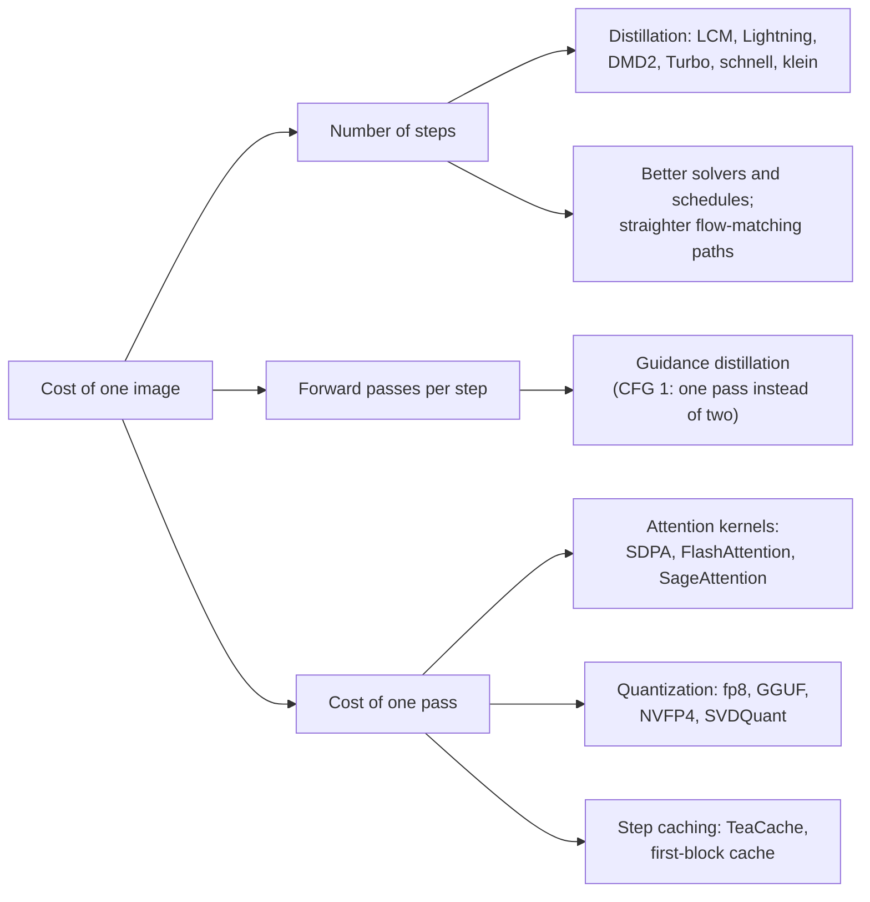
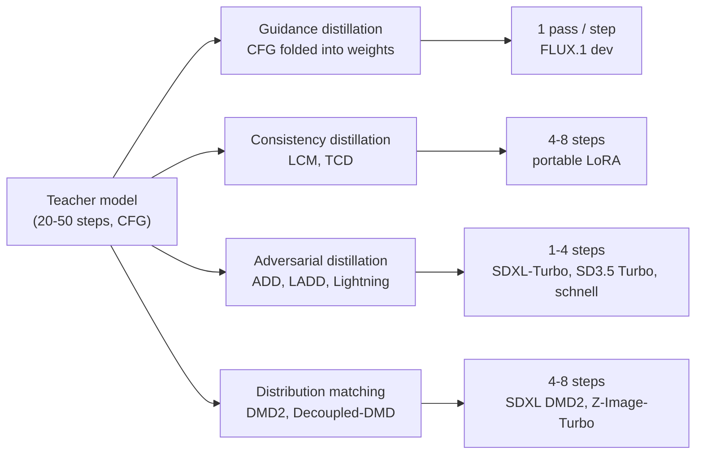
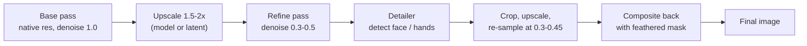

[AI/ML Documentation](./) &raquo; Advanced Techniques

This page is a reference for image-generation techniques that go beyond choosing a prompt, sampler, and step count. It covers latent-space manipulation, regional control, guidance methods that improve on plain classifier-free guidance, few-step distillation and flow matching, multi-stage pipelines, and the kernels, caches, and quantization formats that make large models practical on consumer GPUs. It assumes familiarity with the material in [Stable Diffusion Fundamentals](stable-diffusion-fundamentals.html) and basic [ComfyUI](comfyui-guide.html) workflows.

Most of these techniques are consumed rather than implemented: a LoRA, a distilled checkpoint, a node, or a launch flag. Knowing what each one changes explains its trade-offs and which combinations are compatible.

## Where the Cost of an Image Goes

The cost of an image is roughly the product of three factors. Each technique family on this page attacks one of them.



Quality techniques (guidance variants, detailers, multi-pass upscaling) usually add cost. The practical skill is spending that budget where it shows.

## Latent-Space Techniques

The latent is a tensor, so it can be manipulated directly before or between sampling passes: blended, interpolated, or composited by region.

### Linear and spherical interpolation

Linear interpolation (LERP) blends two latents with a weight $\alpha$:

$$\mathbf{x}_\alpha = (1-\alpha)\,\mathbf{x}_a + \alpha\,\mathbf{x}_b, \qquad \alpha \in [0, 1].$$

For **initial noise** this is the wrong operation. A high-dimensional Gaussian sample lies close to a sphere of radius $\sqrt{d}$, and the midpoint of two independent samples has norm about $\sqrt{d/2}$. The sampler then receives noise with too little variance and produces flat, washed-out images. **Spherical linear interpolation (SLERP)** follows the arc between the two vectors and keeps the norm approximately constant:

$$\operatorname{slerp}(\mathbf{a}, \mathbf{b}; \alpha) = \frac{\sin\big((1-\alpha)\theta\big)}{\sin\theta}\,\mathbf{a} + \frac{\sin(\alpha\theta)}{\sin\theta}\,\mathbf{b}, \qquad \theta = \arccos\!\left(\frac{\mathbf{a}\cdot\mathbf{b}}{\lVert\mathbf{a}\rVert\,\lVert\mathbf{b}\rVert}\right)$$

The angle must be computed over the whole latent of each sample, not per channel:

```python
import torch

def slerp(a: torch.Tensor, b: torch.Tensor, alpha: float, eps: float = 1e-6) -> torch.Tensor:
    """Spherical interpolation between two batches of latents of shape [B, C, H, W]."""
    a_flat, b_flat = a.flatten(1), b.flatten(1)
    a_unit = a_flat / a_flat.norm(dim=1, keepdim=True)
    b_unit = b_flat / b_flat.norm(dim=1, keepdim=True)
    dot = (a_unit * b_unit).sum(dim=1).clamp(-1 + eps, 1 - eps)
    theta = torch.acos(dot)
    sin_theta = torch.sin(theta)
    wa = (torch.sin((1 - alpha) * theta) / sin_theta).unsqueeze(1)
    wb = (torch.sin(alpha * theta) / sin_theta).unsqueeze(1)
    out = wa * a_flat + wb * b_flat
    # Nearly parallel vectors: SLERP degenerates, fall back to LERP
    lerp = (1 - alpha) * a_flat + alpha * b_flat
    out = torch.where(sin_theta.abs().unsqueeze(1) < 1e-4, lerp, out)
    return out.view_as(a)
```

Sweeping $\alpha$ while holding the prompt fixed produces a smooth morph between two seeds. Interpolating the text conditioning instead, or as well, morphs between concepts. For video-quality transitions, dedicated video models (Wan, LTX-Video, HunyuanVideo) now do far better than frame-by-frame latent walks.

### Latent composition

Instead of blending globally, latents can be **composited by region** with masks: latent A where mask A is set, latent B where mask B is set. Seams blend more cleanly than pasted pixels because a subsequent low-denoise pass and the VAE decode harmonize the boundary. This is the latent-space counterpart of regional prompting.

## Regional and Layout Control

A single prompt applies to the whole image. On CLIP-conditioned models, "a robot on the left, a forest on the right" often bleeds the two together. Two remedies exist: route different prompts to different regions, or use a model whose text encoder understands layout.

| Technique | Mechanism | Where available |
|-----------|-----------|-----------------|
| Area / mask conditioning | Each prompt's conditioning is restricted to a rectangle or mask; the predictions are combined per region | ComfyUI *Conditioning (Set Area)* and *Conditioning (Set Mask)*; Forge Regional Prompter |
| Attention masking | Cross-attention from each region's pixels is restricted to that region's prompt tokens | Regional-prompting node packs; built into some FLUX and SDXL regional nodes |
| GLIGEN | Extra gated attention layers ground phrases in bounding boxes | SD 1.5 (largely superseded) |
| Composable diffusion (`AND`) | Each sub-prompt is denoised separately and the guided predictions are summed | A1111/Forge syntax; ComfyUI via *Conditioning (Combine)* |
| Prompt scheduling | The prompt changes partway through sampling (`[cat:dog:0.4]` switches at 40%) | A1111/Forge syntax; ComfyUI via timestep-range conditioning nodes |
| Layout in the prompt | The model's LLM text encoder resolves "left", "behind", and counts directly | FLUX.2, Qwen-Image, Z-Image, HiDream |

On current LLM-encoded models, spatial phrasing in the prompt succeeds often enough that regional conditioning is needed mainly for strict layouts, or for several characters that each need their own LoRA.

## Guidance Beyond Plain CFG

Classifier-free guidance combines an unconditional (or negative-prompt) prediction $\epsilon_u$ with a conditional one $\epsilon_c$:

$$\hat{\epsilon} = \epsilon_u + w\,(\epsilon_c - \epsilon_u).$$

A large $w$ improves prompt adherence but pushes the prediction outside the range the model was trained on. The result is oversaturated colors, burnt contrast, and reduced diversity. The methods below keep the benefit and reduce the damage, or recover guidance for models that cannot run true CFG.

| Method | What it does | Typical use |
|--------|--------------|-------------|
| **CFG rescale** (Lin et al., 2023) | Rescales the guided prediction to match the standard deviation of $\epsilon_c$, then blends with factor $\phi \approx 0.7$ | High CFG on v-prediction and zero-terminal-SNR models |
| **Dynamic thresholding** (Imagen) | Clamps the predicted clean image to a per-step percentile of its magnitude | Very high CFG on pixel or latent models |
| **Guidance interval** (Kynkäänniemi et al., 2024) | Applies CFG only in the middle of the noise range and skips it at the highest and lowest noise levels | Better diversity and fewer artifacts at no extra cost |
| **APG** (Sadat et al., 2024) | Splits the guidance update into components parallel and orthogonal to the conditional prediction and down-weights the parallel part | Removes oversaturation at high guidance scales |
| **PAG** (Ahn et al., 2024) | Guides away from a prediction made with self-attention maps replaced by identity, which degrades structure | Sharper structure; works without a prompt |
| **SAG** (Hong et al., 2023) | Guides away from a version blurred in the regions the model attends to | Mild detail enhancement |
| **NAG** (Chen et al., 2025) | Applies guidance in attention-feature space with normalization, using the negative prompt | Negative prompts on few-step and guidance-distilled models that run at CFG 1 |

APG shows how simple these fixes can be. With $D_c$ the conditional denoised prediction and $\Delta = D_c - D_u$ the guidance direction:

$$\Delta_\parallel = \frac{\langle \Delta, D_c\rangle}{\lVert D_c\rVert^2}\,D_c, \qquad \Delta_\perp = \Delta - \Delta_\parallel, \qquad \hat{D} = D_c + (w-1)\left(\Delta_\perp + \eta\,\Delta_\parallel\right)$$

With $\eta = 1$ this reduces to standard CFG. Setting $\eta$ near $0$ removes the component that mainly inflates saturation, while the orthogonal component that improves detail and adherence is kept.

**Guidance-distilled models.** FLUX.1 [dev] and similar models embed guidance strength as an input and run a single forward pass per step at `cfg = 1.0`. Raising CFG on them doubles the cost and usually harms the image. Negative prompts on these models need NAG, or a *true CFG* pass that deliberately runs the model twice at a low scale.

## Samplers and Noise Schedules

- **Ancestral samplers** (`euler_ancestral`, `dpmpp_2s_ancestral`, and other `_a` or SDE variants) inject fresh noise at every step. They never converge to a fixed image as the step count rises, which trades reproducibility for variety and texture. Deterministic samplers (`euler`, `dpmpp_2m`, `uni_pc`) converge.
- **Karras schedule.** Places the noise levels on the curve below, with $\rho = 7$, which concentrates steps at low noise levels where fine detail forms:

  $$\sigma_i = \left(\sigma_{\max}^{1/\rho} + \frac{i}{n-1}\big(\sigma_{\min}^{1/\rho} - \sigma_{\max}^{1/\rho}\big)\right)^{\rho}, \qquad i = 0, \dots, n-1.$$

  `dpmpp_2m` with `karras` remains a strong default for SD 1.5 and SDXL.
- **Timestep shift for flow models.** Flow-matching models are sampled on $t \in [0,1]$ with a *shift* that spends more steps at high noise for larger images. It corresponds to ComfyUI's `ModelSamplingFlux`, `ModelSamplingSD3`, and `ModelSamplingAuraFlow` nodes. Use `euler` or `dpmpp_2m` with the `simple` or `beta` scheduler, and raise the shift if large images come out incoherent.
- **Restart sampling** (Xu et al., 2023) periodically re-adds a large amount of noise and re-integrates. This recovers some of the quality advantage of stochastic sampling at deterministic-sampler step counts.
- **Best-of-N.** Generating 4–8 seeds and choosing one is still the cheapest quality lever. Automatic selection with an aesthetic or preference model (for example, a VLM judge) works at scale but inherits the scorer's biases.

## Few-Step Generation

Standard diffusion needs 20–50 steps because each step moves only a short distance along a curved trajectory from noise to image. Two strategies reduce this: **make the path straighter** (flow matching and reflow) or **train a student that takes large jumps** (distillation).



| Method | Idea | Steps | Examples | Trade-off |
|--------|------|-------|----------|-----------|
| Guidance distillation | Student reproduces the CFG output in one pass, with guidance scale as an input | Unchanged (halves passes) | FLUX.1 [dev] | Negative prompts need extra techniques |
| Consistency distillation | Student maps any point on a trajectory to its endpoint | 4–8 | LCM-LoRA, TCD | Softer detail; ships as a LoRA |
| Adversarial distillation | Discriminator loss keeps few-step outputs sharp | 1–4 | SDXL-Turbo (ADD), SD3-Turbo and SD3.5 Large Turbo (LADD), FLUX.1 [schnell] | Lower diversity; CFG must stay near 1 |
| Progressive adversarial distillation | Step count halved in stages with an adversarial loss | 2–8 | SDXL-Lightning, Hyper-SD | LoRA or full checkpoint; per-step-count variants |
| Distribution matching (DMD2 and variants) | Student's output distribution is matched to the teacher's through score differences, plus a GAN loss | 1–8 | SDXL DMD2, Z-Image-Turbo (Decoupled-DMD) | Among the best quality-per-step today |
| Size and step distillation | Smaller student distilled from a large flow model | 4 | FLUX.2 [klein] | Smaller model, lower ceiling |

Most of these ship both as full checkpoints and as LoRAs that retrofit an existing fine-tune. Use the sampler, scheduler, and CFG listed on the distilled model's card. They are usually `euler` or LCM, few steps, and CFG between 1 and 2, and defaults tuned for a 30-step model give poor results.

### Flow matching

SD3, FLUX, Qwen-Image, and Z-Image are trained with **flow matching** (rectified flow). With $\mathbf{x}_0$ noise and $\mathbf{x}_1$ data, the model learns a velocity field along the straight-line interpolant:

$$\mathbf{x}_t = (1-t)\,\mathbf{x}_0 + t\,\mathbf{x}_1, \qquad \mathcal{L} = \mathbb{E}_{t,\mathbf{x}_0,\mathbf{x}_1}\Big[\big\lVert \mathbf{v}_\theta(\mathbf{x}_t, t) - (\mathbf{x}_1 - \mathbf{x}_0)\big\rVert^2\Big]$$

Libraries differ in the direction of $t$. Diffusers and the SD3 paper put noise at $t = 1$, so check the convention before reusing code. SD3 found that sampling $t$ from a **logit-normal** distribution, which concentrates training on intermediate noise levels, works better than uniform sampling.

```python
import torch
import torch.nn.functional as F

def flow_matching_loss(model, x_data, cond):
    """Rectified-flow training loss; noise at t=0, data at t=1."""
    noise = torch.randn_like(x_data)
    t = torch.sigmoid(torch.randn(x_data.shape[0], device=x_data.device))  # logit-normal
    t_b = t.view(-1, *([1] * (x_data.dim() - 1)))                          # broadcastable
    x_t = (1 - t_b) * noise + t_b * x_data
    return F.mse_loss(model(x_t, t, cond), x_data - noise)

@torch.no_grad()
def sample_euler(model, shape, cond, steps=28, device="cuda"):
    """Integrate dx/dt = v(x, t) from noise (t=0) to data (t=1)."""
    x = torch.randn(shape, device=device)
    ts = torch.linspace(0, 1, steps + 1, device=device)
    for t0, t1 in zip(ts[:-1], ts[1:]):
        x = x + (t1 - t0) * model(x, t0.expand(shape[0]), cond)
    return x
```

The ideal paths are straight, but the paths the model actually learns are only close to straight. That is why flow models still use about 20–30 steps, and why reflow (retraining on the model's own noise–image pairs) and distillation are still needed to reach 1–4 steps.

## Multi-Stage Workflows

The strongest results rarely come from one pass. Multi-stage pipelines establish composition at native resolution, then add resolution and detail in controlled increments. Each later pass uses a lower denoise so that it refines the image rather than redrawing it.



### Progressive upscaling

| Stage | Resolution | Denoise | Purpose |
|-------|-----------|---------|---------|
| Base | Native (about 1 MP) | 1.0 | Composition |
| Upscale 1 | ~1.5× | 0.4–0.5 | Structure and coherence at the new scale |
| Upscale 2 (tiled) | ~2× | 0.25–0.35 | Fine detail |
| Final (optional) | Target | 0.15–0.25 | Polish without redrawing |

Beyond about 2 MP, sample in overlapping tiles (Ultimate SD Upscale, or tiled-diffusion nodes), optionally with a Tile ControlNet so that each tile stays faithful to the low-resolution image. FLUX.2 and Qwen-Image generate natively at higher resolutions than the U-Net models, so they need fewer stages. Dedicated restoration upscalers (SUPIR, SeedVR2) are an alternative when the goal is fidelity rather than added detail.

### Detailers

A detailer finds a region with a detector (a YOLO face or hand model, or a segmentation model such as SAM 2), crops it with padding, upscales the crop so the model works at its native resolution, re-samples it at low denoise, and pastes it back with a feathered mask. ComfyUI's Impact Pack *FaceDetailer* and Forge's ADetailer implement this pattern. It fixes small faces and hands far more cheaply than regenerating the whole image.

### Editing models as a stage

Instruction-editing models (FLUX.1 Kontext, FLUX.2 with reference images, Qwen-Image-Edit-2511) can now replace several classic stages: changing an outfit, relighting, removing an object, or keeping a character consistent across shots. They take the image plus a text instruction and need no mask. See [Inpainting and Editing](inpainting-editing.html) for when a mask-based approach is still better. [Differential diffusion](inpainting-editing.html#differential-diffusion) generalizes the binary mask to a continuous per-pixel change strength and gives seamless, feathered edits.

### Style mixing

To combine the character of several models, the options, from most to least controllable, are: one base model with stacked style LoRAs at reduced strengths; a merged checkpoint (a fixed weighted blend of models *of the same architecture*); and switching checkpoints between passes, for example composing with one model and refining with another at low denoise. Averaging latents across different model families does not work, because their latent spaces differ.

## Performance and Memory

When resolution, batch size, or model size exceeds the GPU, there are three kinds of lever: make each forward pass cheaper, skip redundant computation, or trade speed for memory. The [Optimization Guide](optimization-guide.html) covers the underlying numerics.

### Faster forward passes

| Technique | Effect | Notes |
|-----------|--------|-------|
| PyTorch SDPA / FlashAttention | Fused, memory-efficient attention | Default in current PyTorch, ComfyUI, and diffusers; xFormers is no longer needed |
| **SageAttention** (2 and 3) | 8-bit (and on Blackwell GPUs, FP4) attention kernels | ComfyUI `--use-sage-attention`; large gains on video and high-resolution work, small quality cost |
| `torch.compile` | Fuses operations into optimized kernels | Warm-up compile on first run; recompiles when shapes change |
| fp8 weights | Halves memory versus bf16 with little quality loss | Native fp8 compute on Ada, Hopper, and Blackwell GPUs; ComfyUI `--fast` enables fp8 matrix multiplication |
| **SVDQuant / Nunchaku** | 4-bit weights *and* activations, with a low-rank branch that absorbs outliers | About 3.5× less memory than bf16 FLUX.1 with ~3× speedup over NF4 (ICLR 2025); community ComfyUI nodes for FLUX, Qwen-Image, and others |
| NVFP4 | Hardware 4-bit floating point on Blackwell (RTX 50-series, B200) | Official NVFP4 checkpoints exist for FLUX.2 [klein] and other models |
| Token merging (ToMe) | Merges redundant tokens before attention | Mainly SD 1.5 and SDXL; less useful on DiTs |

### Skipping redundant computation

Adjacent sampling steps produce very similar intermediate features. **Step caching** methods reuse them. TeaCache (CVPR 2025) estimates from the timestep-modulated input how much the output will change and skips the transformer when the change is small. First-block caching compares the first block's residual between steps for the same purpose. Speedups of 1.5–2× are common, and the cost is a loss of fine detail if the threshold is set too aggressively. Caching is especially valuable for video models.

### Fitting in memory

- **Offloading.** ComfyUI loads and unloads models automatically, and `--lowvram` or `--novram` force weights to stream from system RAM. diffusers offers `enable_model_cpu_offload()` and sequential offload. Both are slower but let 20–30B models run on 12–16 GB cards.
- **GGUF quantization** (Q8 down to Q4 and below) through the ComfyUI-GGUF nodes. Q8 is nearly lossless; Q4 visibly degrades fine detail.
- **Tiled VAE decode.** The VAE decode of a large image can use more memory than the denoiser. Use `VAE Decode (Tiled)`, whose peak memory scales with tile size.
- **Text-encoder placement.** A 7–24B text encoder can run on the CPU or in fp8, or be unloaded after encoding, because it runs only once per prompt.
- **Gradient checkpointing** matters only for training (see [LoRA Training](lora-training.html)).

## Advanced ControlNet Use

These patterns extend the basics covered in the [ControlNet guide](controlnet.html).

- **Control windowing.** Apply structure strongly early and release it before the final steps (`start_percent` and `end_percent` on *Apply ControlNet*). Late steps then add detail that the control map never specified, which avoids the "traced" look.
- **Union and multi-condition models.** Single ControlNets that accept several control types (for example the Union models for SDXL and FLUX) replace a stack of per-type models, which saves VRAM.
- **Reference instead of control.** For identity and style, reference-image conditioning (IP-Adapter, FLUX Redux, or the reference inputs of FLUX.2 and Qwen-Image-Edit) often beats structural ControlNets.
- **Temporal consistency.** Per-frame control maps flicker because each is estimated independently. For video, use a video model with native control inputs (Wan VACE, for example) rather than image ControlNets applied frame by frame.

## Automation and Experiment Design

Once a workflow works, run it reproducibly and at scale through ComfyUI's HTTP and WebSocket API. The [ComfyUI guide](comfyui-guide.html#automation-with-the-api) shows the request format.

- **Parameter sweeps.** Load an API-format workflow, patch the fields to vary (seed, CFG, LoRA strength, shift), queue each variant, and store the patched values with each output. ComfyUI also embeds the full workflow in each PNG's metadata.
- **Change one variable at a time.** Hold seeds fixed and vary a single axis. Lay the results out as an XY grid, so each difference has a single known cause.
- **Real-time loops.** Keep the model resident, cache text encodings for repeated prompts, and use a 1–4-step distilled model (FLUX.2 [klein], Z-Image-Turbo, SDXL with DMD2 or Lightning). This combination makes live preview responsive.
- **Profile before optimizing.** Measure wall-clock time and peak VRAM per stage, including model load, text encoding, sampling, and VAE decode. The bottleneck is often not the sampler.

## See Also

- [Stable Diffusion Fundamentals](stable-diffusion-fundamentals.html): diffusion, samplers, CFG, and flow matching
- [ComfyUI Guide](comfyui-guide.html): building the workflows described here
- [Base Models Comparison](base-models-comparison.html): choosing between SDXL, FLUX, Qwen-Image, Z-Image, and others
- [Inpainting and Editing](inpainting-editing.html): masks, differential diffusion, and instruction editing
- [ControlNet](controlnet.html): structural control
- [LoRA Training](lora-training.html): training custom adapters
- [Optimization Guide](optimization-guide.html): precision, quantization, and inference speed
- [Output Formats](output-formats.html): exporting and using generated content
- [AI/ML Documentation Hub](./)
