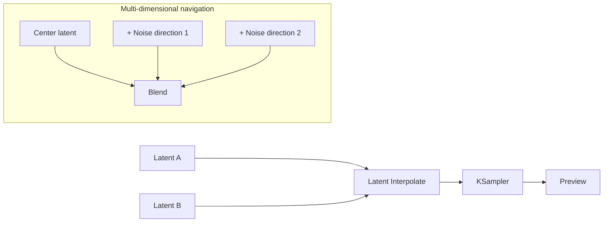
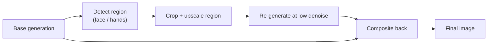

<div class="hero-section" style="background: linear-gradient(135deg, #667eea 0%, #764ba2 100%); color: white; padding: 3rem 2rem; margin: -2rem -3rem 2rem -3rem; text-align: center;">
  <h1 style="color: white; margin: 0; font-size: 2.5rem;">Advanced Techniques & Workflows</h1>
  <p style="font-size: 1.25rem; margin-top: 1rem; opacity: 0.9;">Cutting-edge techniques including latent space manipulation, regional prompting, advanced sampling, and multi-stage workflows for expert-level AI image generation.</p>
</div>

<div class="code-example" markdown="1">
Cutting-edge techniques and complex workflows for pushing the boundaries of AI image generation.
</div>

## Who This Guide Is For

This guide is for users already comfortable with prompting, samplers, and basic ComfyUI workflows who want to push further. It covers latent-space manipulation, regional prompting, advanced sampling, and multi-stage pipelines — plus the newer ideas (consistency distillation, flow matching, adversarial distillation) that now make near-real-time generation possible without collapsing quality. Read it as a toolbox: most real results come from combining a few of these techniques, not from any single one.

<div class="key-insights">
  <div class="insight-card">
    <i class="fas fa-bezier-curve"></i>
    <h4>Latent Control</h4>
    <p>Interpolate, blend, and mask in latent space (SLERP, regional prompts) for transitions and composition prompts alone can't reach.</p>
  </div>
  <div class="insight-card">
    <i class="fas fa-bolt"></i>
    <h4>Faster Sampling</h4>
    <p>Distillation (LCM, ADD) and flow matching cut 30+ steps to 1-8, trading a little quality for real-time speed.</p>
  </div>
  <div class="insight-card">
    <i class="fas fa-layer-group"></i>
    <h4>Multi-Stage Pipelines</h4>
    <p>Progressive upscaling, detail passes, and self-attention guidance stack into reference-grade results.</p>
  </div>
</div>

## Latent Space Techniques

The latent is just a tensor, so you can do math on it directly — blend two latents, walk between them, or composite regions — before or between sampling passes. This unlocks transitions and compositions that prompting alone cannot reach.

### Latent Interpolation

The simplest move is **linear interpolation**: blend two latents with a weight $\alpha$ that sweeps from 0 to 1, sampling each blend to produce a frame. Stepping $\alpha$ across a range gives a morph sequence between two images or concepts:

$$\mathbf{x}_\alpha = (1-\alpha)\,\mathbf{x}_a + \alpha\,\mathbf{x}_b, \qquad \alpha \in [0, 1]$$

Linear blends are easy but flawed — see SLERP next.

### Spherical Linear Interpolation (SLERP)

Linear interpolation cuts a straight chord through latent space, which can pass through low-quality regions. SLERP instead follows the arc of the hypersphere, preserving the magnitude that diffusion models expect:

$$\text{slerp}(\mathbf{a}, \mathbf{b}; \alpha) = \frac{\sin\big((1-\alpha)\theta\big)}{\sin\theta}\,\mathbf{a} + \frac{\sin(\alpha\theta)}{\sin\theta}\,\mathbf{b}, \qquad \theta = \arccos\!\left(\frac{\mathbf{a}\cdot\mathbf{b}}{\lVert\mathbf{a}\rVert\,\lVert\mathbf{b}\rVert}\right)$$

This keeps interpolated latents on the sphere, producing smoother, higher-quality transitions:

```python
def slerp(latent_a, latent_b, alpha):
    # Normalize vectors
    a_norm = latent_a / torch.norm(latent_a, dim=1, keepdim=True)
    b_norm = latent_b / torch.norm(latent_b, dim=1, keepdim=True)
    
    # Calculate angle
    dot = (a_norm * b_norm).sum(1)
    theta = torch.acos(torch.clamp(dot, -1, 1))
    
    # SLERP formula
    sin_theta = torch.sin(theta)
    wa = torch.sin((1 - alpha) * theta) / sin_theta
    wb = torch.sin(alpha * theta) / sin_theta
    
    return wa.unsqueeze(1) * latent_a + wb.unsqueeze(1) * latent_b
```

### Latent Space Navigation

A ComfyUI exploration workflow blends two (or more) latents before sampling:



### Latent Composition

Instead of blending two latents globally, you can **composite by region** using masks: keep latent A where mask A is white, latent B where mask B is white, and so on. This stitches separately-generated content into one frame at the latent level, which blends more cleanly than pasting pixels because the VAE decode harmonizes the seams. It is the latent-space cousin of regional prompting below.

## Regional Prompting

A single prompt applies everywhere, which is why "a robot on the left, a forest on the right" so often bleeds the two together. **Regional prompting** fixes this by routing different prompts to different image regions, each with its own mask and weight.

### Attention Masking

The most common approach masks the **cross-attention** so each prompt only influences its region. You define a region as a (prompt, mask, weight) triple — for example a `detailed robot` prompt bound to the left half and a `lush forest` prompt bound to the right — and the sampler keeps each prompt's influence inside its mask. ComfyUI offers this through nodes like *Conditioning (Set Area)* / *Set Mask*; A1111/Forge through the Regional Prompter extension.

### GLIGEN: Box-Grounded Placement

Where masks define *areas*, **GLIGEN** (Grounded Language-to-Image Generation) places phrases inside **bounding boxes** — "put `a red car` in this box" — giving object-level layout control without hand-painting masks. It is the cleaner choice when you know *where* each object goes but not its exact silhouette.

### Composable and Scheduled Prompts

Two prompt-level techniques complement masking:

- **Composable diffusion** combines independent concepts with `AND`, denoising each separately and merging — `a cat AND a dog` makes both more likely to appear (and survive) than `a cat and a dog`. Per-term weights (`(cat:1.2) AND (dog:0.8)`) bias the balance.
- **Prompt scheduling** swaps the prompt partway through sampling, e.g. `[a cat|a dog]` alternates each step, or `[cat:dog:0.4]` switches from cat to dog at 40% — useful for hybrids and gradual morphs.

## Advanced Sampling Methods

Beyond picking a sampler and step count, several refinements address specific failure modes — oversaturation at high CFG, the distribution of noise across steps, and getting more quality from the same step budget. Most are exposed as toggles in your tool rather than something you implement.

| Technique | Problem it solves | What it does |
|-----------|-------------------|--------------|
| CFG rescale | Washed-out, oversaturated images at high CFG | Rescales the guided prediction back toward the conditional prediction's statistics, so high CFG follows the prompt without blowing out contrast |
| Dynamic thresholding | Color/clipping artifacts at high guidance | Clamps extreme latent values per-step using a high percentile instead of a hard limit, preventing the "burnt" look |
| Karras schedule | Wasted steps on low-information ranges | Distributes noise levels (sigmas) so more steps land where they matter; reaches quality in fewer steps |
| EDM-style stochasticity | Over-smooth, lifeless detail | Injects a controlled bit of noise mid-sampling (the `s_churn` knob) to recover texture |
| Restart sampling | Detail plateaus on long runs | Periodically re-adds noise and re-denoises, escaping the smoothing that long deterministic runs cause |

### Karras Scheduling, Briefly

The most useful of these in everyday work is the **Karras** noise schedule (offered alongside `normal`/`simple`/`exponential`). It places the sampling sigmas along a curve

$$\sigma_i = \left(\sigma_{\max}^{1/\rho} + \frac{i}{n-1}\big(\sigma_{\min}^{1/\rho} - \sigma_{\max}^{1/\rho}\big)\right)^{\rho}$$

with $\rho \approx 7$, which concentrates steps in the perceptually important mid-noise range. Pairing `dpmpp_2m` with `karras` is a strong default for SD/SDXL; FLUX prefers `simple`.

### High CFG Without the Burn

If you need strong prompt adherence (high CFG) but get oversaturated results, enable **CFG rescale** (sometimes "CFG rescale φ", ~0.7) rather than just lowering CFG. It keeps the prompt-following strength while pulling the output's statistics back toward natural contrast.

## Multi-Stage Workflows

The strongest images rarely come from one pass. Multi-stage pipelines generate a solid base, then add resolution and detail in controlled increments — each pass at a lower denoise so it refines rather than redraws.

### Progressive Upscaling

Rather than jumping straight to 4K (which causes repetition and OOM), climb in stages, dropping the denoise strength as you go so each pass adds detail without changing the composition:

| Stage | Resolution | Denoise | Purpose |
|-------|-----------|---------|---------|
| Base | 1024 (native) | 1.0 | Establish composition |
| Upscale 1 | ~1.5x | ~0.5 | Add structure, fix coherence |
| Upscale 2 | ~2x | ~0.35 | Sharpen detail |
| Final | target | ~0.25 | Polish without redrawing |

The "Ultimate SD Upscale" and tiled-diffusion workflows automate this, optionally with a Tile ControlNet to keep tiles coherent.

### Detail Enhancement (Face/Region Fixing)

A second common pattern detects a region (commonly faces, via the Impact Pack's detectors), crops and re-generates just that region at higher effective resolution, then composites it back. This is why workflows like ADetailer/FaceDetailer dramatically improve faces and hands without re-rolling the whole image:



### Style Mixing

To blend the character of several models, generate the same seed/prompt with each and combine — either by **merging the models** beforehand (a fixed blend) or by **prompt-traveling** between checkpoints. A simpler, more controllable alternative is one base model plus stacked style LoRAs at reduced strengths, which avoids the unpredictability of latent averaging across different model distributions.

## Optimization Techniques

When you push resolution, batch size, or step count, you eventually hit compute or VRAM limits. Two categories of optimization help — making attention cheaper, and trading time for memory.

### Speed: Cheaper Attention

Attention is the dominant cost in diffusion. The practical levers:

| Technique | Effect | How to use it |
|-----------|--------|---------------|
| Flash Attention / SDPA | Fused, memory-efficient attention kernels | On by default in recent PyTorch/diffusers; just keep your stack current |
| `torch.compile` | Fuses ops into optimized kernels | One-line wrapper; large speedup after a warm-up compile |
| Token Merging (ToMe) | Merges redundant tokens before attention | A ratio knob (~0.5); trades a little fidelity for speed |
| xFormers | Memory-efficient attention (older stacks) | Mostly superseded by built-in SDPA/Flash Attention |

### Memory: Trade Time for VRAM

When you are VRAM-bound rather than time-bound:

- **Tiled VAE / tiled diffusion** decode (or generate) the image in overlapping tiles, so peak memory scales with tile size, not full resolution — the standard fix for high-res OOM.
- **Sequential CPU offload** keeps idle components (text encoder, VAE) in system RAM and streams them to GPU on demand. Slower, but lets large models fit small cards.
- **Quantization (fp8, GGUF)** shrinks the model's footprint with minor quality cost — the difference between FLUX fitting in 12 GB or not.
- **Gradient checkpointing** matters only when *training* (e.g. LoRAs): it recomputes activations instead of storing them.

## Advanced Prompt Engineering

At the expert level, prompting becomes less about stacking adjectives and more about *structure and iteration*:

- **Build, don't dump.** Lead with subject, then composition, then style, then lighting. Newer models (FLUX, SD3) reward natural sentences; older CLIP-based ones reward ordered tags. Quality-spam ("masterpiece, 4k, trending on ArtStation") helps SD 1.5 far more than it helps FLUX.
- **Iterate one axis at a time.** Fix the seed, change a single clause, and compare. This isolates what each phrase actually does — the manual version of the "optimize toward a target" idea, and far more reliable than changing several things at once.
- **Push concepts into regions or weights** when a flat prompt won't separate two subjects — use the regional prompting and composable-diffusion techniques above instead of longer prose.
- **Let a VLM draft the prompt.** A vision-language model can caption a reference image into a detailed starting prompt you then refine — a practical substitute for hand-tuning from scratch.

## Picking and Tuning Samplers

Two ideas explain most sampler behavior:

- **Ancestral samplers** (the `_a` family, e.g. `euler_a`) inject fresh noise each step, so they keep exploring and never fully converge — great for creative variety, worse for reproducibility. Non-ancestral samplers (`euler`, `dpmpp_2m`) converge to a stable image as steps increase.
- **Best-of-N selection** is the simplest quality boost: generate several seeds and keep the best. Automated pickers score candidates with an aesthetic or CLIP model, but for most work, eyeballing a batch of 4-8 is enough and avoids baking a scorer's bias into your output.

## Advanced ControlNet Techniques

Two patterns extend basic ControlNet (covered fully in the [ControlNet guide](controlnet.html)):

- **Control windowing.** Apply structure strongly early (when composition is set) and release it before the final steps via `end_percent`, so late steps add detail the control map never specified. This is the practical form of "multi-scale" control and prevents the traced look.
- **Temporal control for video.** Extracting a control map per frame causes flicker because each map is computed independently. Blending each frame's map slightly toward the previous frame's smooths the conditioning over time, reducing jitter — a cheap consistency win before reaching for dedicated video models.

## Few-Step Generation: How the Speedups Work

Standard diffusion needs 20-50 steps because each step makes a small, careful move along a curved path from noise to image. The techniques below all attack that step count — and you mostly *consume* them (as an LCM-LoRA, a Turbo/Lightning checkpoint, or a FLUX-schnell model) rather than implement them. Knowing what each does explains their trade-offs:

| Method | Idea | Steps | Trade-off |
|--------|------|-------|-----------|
| Consistency distillation (LCM, TCD) | Train a student to jump directly toward the clean image from any point on the path | 4-8 | Slight softness; LCM ships as a portable LoRA |
| Adversarial distillation (ADD → SDXL-Turbo) | Add a GAN-style discriminator so few-step outputs look real, not blurry | 1-4 | Less diversity; can over-sharpen |
| Latent Adversarial (LADD → SD3-Turbo) | ADD applied in latent space for higher-res efficiency | 1-4 | Same family of trade-offs |
| Rectified flow (FLUX, SD3) | Train near-straight paths that an ODE solver can traverse in few steps | 20-28 (1-4 distilled) | Architectural, not bolt-on |

**Consistency models** ask the network to map *any* noisy point on a trajectory to the same endpoint, so a handful of big steps replace many small ones. **Adversarial distillation** instead pits the few-step generator against a discriminator, which is why SDXL-Turbo produces a usable image in a single step. Both are *distillations* of a slow teacher model — you trade a little diversity and fidelity for a large speedup.

### Flow Matching

The alternative to traditional diffusion used in FLUX and SD3. Instead of predicting noise, the model learns a **velocity field** that transports a sample along a straight path from noise $\mathbf{x}_0$ to data $\mathbf{x}_1$. The interpolant and its target velocity are simply:

$$\mathbf{x}_t = (1-t)\,\mathbf{x}_0 + t\,\mathbf{x}_1, \qquad \mathbf{v}_{\text{target}} = \mathbf{x}_1 - \mathbf{x}_0$$

The model is trained to match that velocity, $\mathcal{L} = \mathbb{E}\big[\lVert \mathbf{v}_\theta(\mathbf{x}_t, t) - (\mathbf{x}_1 - \mathbf{x}_0)\rVert^2\big]$. Because the target paths are nearly straight, sampling needs far fewer ODE steps than classic diffusion:

```python
def flow_matching_loss(model, x0, x1, t):
    """Rectified flow training"""
    # Interpolate between noise and data
    xt = t * x1 + (1 - t) * x0
    
    # Target velocity
    target_v = x1 - x0
    
    # Predicted velocity vs. target; the loss is a simple MSE
    return F.mse_loss(model(xt, t), target_v)
```

Sampling then just integrates that velocity field as an ODE — start at noise and step forward with $\mathbf{x}_{t+\Delta t} = \mathbf{x}_t + \mathbf{v}_\theta(\mathbf{x}_t, t)\,\Delta t$. Because the learned paths are nearly straight, a coarse step size still lands on a good image.

## Automating and Scaling Workflows

Once a workflow works, the next step is running it at scale and reproducibly. ComfyUI's API (export as *Save (API Format)*) is the backbone here — see the [ComfyUI guide](comfyui-guide.html) for the request format. The patterns worth knowing:

- **Parameter sweeps / batch.** Load the exported workflow JSON, programmatically patch the fields you want to vary (prompt, seed, CFG, LoRA strength), and submit each variant. Recording the patched values alongside each output turns generation into a reproducible experiment.
- **A/B comparison.** Sweep one parameter across a fixed seed set and lay the grid out side by side. Changing exactly one axis at a time is what makes the comparison meaningful — the same discipline that applies to manual tuning.
- **Real-time loops.** For interactive use, the cost lives in two places: model load and text encoding. Load the model once, cache encodings for repeated prompts, and use a few-step model (LCM/Turbo, CFG ≈ 1-1.5) so each generation is a handful of steps. That combination is what makes live preview and art-stream overlays feel responsive.
- **Profiling before optimizing.** Track wall-clock time and peak VRAM per run before reaching for optimizations, so you tune the actual bottleneck rather than a guessed one.

## Two More Techniques Worth Knowing

- **Differential diffusion** generalizes inpainting from a binary mask to a *continuous* strength map: instead of "regenerate here, freeze there," you specify *how much* to change each pixel. This gives feathered, seamless edits — strong changes in the center of a region fading to none at its edges — without the hard seams a binary mask leaves.
- **Self-Attention Guidance (SAG)** sharpens detail by blurring the regions the model is *already* attending to and guiding generation away from that blurred version, effectively telling the model to add detail where it matters. It is a CFG-like quality nudge that needs no extra prompt and is exposed as a node/toggle in most tools.

## Best Practices

### Workflow Design

1. **Modularity**: Build reusable components
2. **Validation**: Test each stage independently
3. **Documentation**: Comment complex operations
4. **Version Control**: Track workflow changes
5. **Performance**: Profile and optimize bottlenecks
6. **Future-Proofing**: Design for new model architectures

### Experimentation Guidelines

1. **Controlled Testing**: Change one variable at a time
2. **Reproducibility**: Fix seeds for comparisons
3. **Metrics**: Define clear success criteria
4. **Iteration**: Start simple, add complexity
5. **Documentation**: Record successful configurations
6. **Benchmarking**: Compare against established baselines
7. **Community Sharing**: Contribute findings back

## Conclusion

These techniques fall into three buckets: **control** (latent interpolation, regional prompting, ControlNet windowing) for results prompts can't reach; **speed** (consistency and adversarial distillation, flow matching) that has collapsed 30+ steps toward single-digit counts; and **scale** (tiling, offloading, quantization, automation) that lets a workflow run bigger and run repeatably.

You rarely implement the underlying math — you consume it as an LCM-LoRA, a Turbo checkpoint, a node, or a toggle. The leverage comes from understanding *what each one does* so you can combine the right few and tune one variable at a time. The most impressive results almost always come from a deliberate stack of techniques, not a single advanced trick.

## Key Takeaways

<div class="takeaway-card" markdown="1">
- **Interpolate on the sphere, not the chord.** SLERP preserves latent magnitude for smoother transitions than linear blending.
- **Regional prompting and attention masking** let different parts of one image follow different prompts — far more reliable than cramming everything into one prompt.
- **Distillation buys speed.** LCM and ADD compress 30+ steps down to 1-8, enabling near-real-time generation with a modest quality trade-off.
- **Flow matching (FLUX/SD3) learns a velocity field** along near-straight noise→data paths ($\mathbf{v}_{\text{target}} = \mathbf{x}_1 - \mathbf{x}_0$), needing fewer sampling steps than classic diffusion.
- **Compose, don't replace.** The strongest results come from layering techniques (multi-stage upscaling, SAG, regional control) — and from changing one variable at a time while you tune.
</div>

---

<div class="see-also-card" markdown="1">
#### See Also

- [Stable Diffusion Fundamentals](stable-diffusion-fundamentals.html) - Core concepts these techniques build on
- [ComfyUI Guide](comfyui-guide.html) - Build the multi-stage workflows described here
- [ControlNet](controlnet.html) - Precise control over generation
- [LoRA Training](lora-training.html) - Train custom models
- [Base Models Comparison](base-models-comparison.html) - SD 1.5, SDXL, FLUX compared
- [Output Formats](output-formats.html) - Exporting and using generated content
- [AI/ML Documentation Hub](./) - Complete AI/ML documentation index
</div>