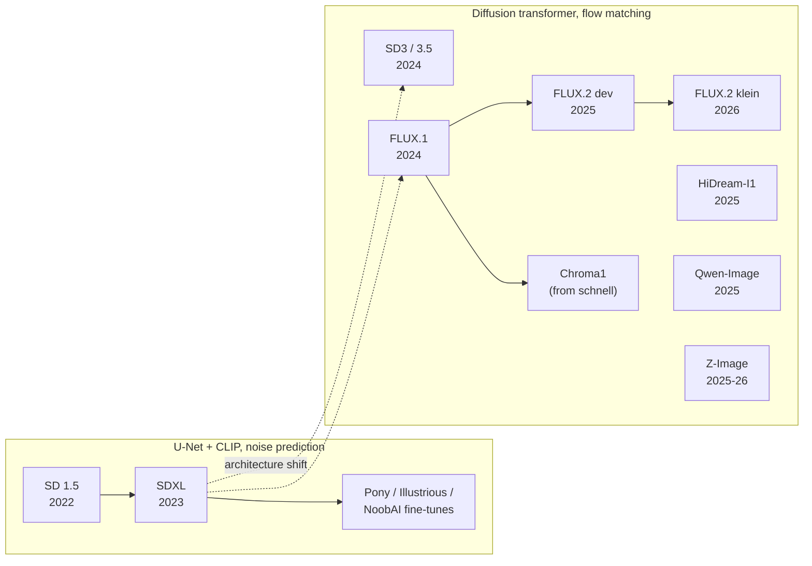
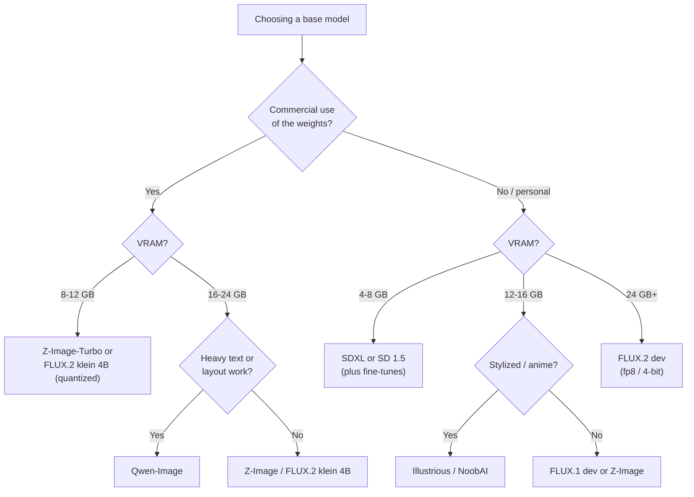

[AI/ML Documentation](./) &raquo; Base Models Comparison

This page compares the open-weight text-to-image model families as of late 2026: Stable Diffusion 1.5 and SDXL, Stable Diffusion 3.5, FLUX.1 and FLUX.2, Qwen-Image, Z-Image, HiDream, and the SDXL community fine-tunes. It covers architecture, text encoders, hardware needs, licensing, and a selection guide. For architecture, settings, and workflows in depth, see the per-family pages: [SDXL](sdxl-guide.html), [SD3](sd3-guide.html), [FLUX](flux-guide.html), and [Pony and community fine-tunes](pony-and-finetunes.html).

The base model (checkpoint) is the most consequential choice in an image-generation setup. It sets the quality ceiling, the working resolution, the VRAM requirement, the prompting style, the license terms, and which LoRAs and ControlNets can be used. No single model is best on every axis:

- **Two architectural generations.** The U-Net line (SD 1.5, SDXL, and its fine-tunes) predicts noise and reads the prompt with CLIP. The transformer line (SD3.5, FLUX, Qwen-Image, Z-Image, HiDream) uses a diffusion transformer trained with flow matching and, increasingly, a full language model as its text encoder. Add-ons do not transfer between families.
- **The open-weight frontier has moved past Stability AI.** Since 2025 the strongest open models have come from Black Forest Labs (FLUX) and Alibaba (Qwen-Image, Z-Image). SDXL remains the best-supported model for fine-tunes and add-ons.
- **Licenses differ sharply.** Some are Apache-2.0 or MIT, some are free only below a revenue threshold, and some are non-commercial. Read the license before building a product on a model.

## Comparison Table

| Model | Released | Denoiser params | Architecture | Text encoder(s) | Native res. | License |
|-------|----------|-----------------|--------------|-----------------|-------------|---------|
| **SD 1.5** | 2022 | ~0.86B | U-Net, noise prediction | CLIP ViT-L | 512² | CreativeML OpenRAIL-M |
| **SDXL 1.0** | Jul 2023 | ~2.6B U-Net (3.5B with encoders) | Enlarged U-Net | CLIP ViT-L + OpenCLIP bigG | 1024² | CreativeML OpenRAIL++-M |
| **SD 3.5** (Medium / Large) | Oct 2024 | 2.5B / 8.1B | MM-DiT, rectified flow | CLIP-L + CLIP-G + T5-XXL | ~1 MP (Medium: 0.25–2 MP) | Stability Community License (free under US$1M annual revenue) |
| **FLUX.1** (dev / schnell) | Aug 2024 | 12B | Hybrid MM-DiT, rectified flow, guidance-distilled | CLIP-L + T5-XXL | ~1 MP, flexible | dev: FLUX.1 non-commercial; schnell: Apache-2.0 |
| **FLUX.2 [dev]** | Nov 2025 | 32B | Flow transformer, unified generation and multi-reference editing | Mistral Small 3.2 (24B) | up to ~4 MP | FLUX non-commercial |
| **FLUX.2 [klein]** (4B / 9B) | Jan 2026 | 4B / 9B | Size-distilled from FLUX.2; 4-step and base variants | Qwen3 (4B / 8B) | ~1–4 MP | 4B: Apache-2.0; 9B: FLUX non-commercial |
| **Qwen-Image** (incl. 2512 update) | Aug 2025 | 20B | MM-DiT, flow matching | Qwen2.5-VL (7B) | ~1.3 MP, flexible | Apache-2.0 |
| **Z-Image** (Turbo / Base) | Nov 2025 / Jan 2026 | ~6B | Single-stream DiT (S3-DiT) | Qwen3-4B | ~1 MP, flexible | Apache-2.0 |
| **HiDream-I1** | Apr 2025 | 17B | Sparse (mixture-of-experts) DiT | CLIP-L + CLIP-G + T5-XXL + Llama-3.1-8B | 1024² | MIT (text encoders keep their own licenses) |
| **Chroma1** | 2025 | 8.9B | Modified FLUX.1-schnell | T5-XXL | ~1 MP | Apache-2.0 |
| **Pony / Illustrious / NoobAI** | 2024–2025 | as SDXL | SDXL fine-tunes | as SDXL | 1024² | Inherit SDXL license, plus model-specific terms |

Notes on reading the table:

- **Parameter counts are for the denoiser only.** The text encoder can be as large as the denoiser, or larger. FLUX.2 [dev] pairs a 32B transformer with a 24B language model, and Qwen-Image pairs a 20B transformer with a 7B vision-language model. Both count toward memory and load time.
- **SD 2.x (2022, OpenCLIP, 768²)** is omitted. It broke compatibility with SD 1.5 add-ons, never built an ecosystem, and has no remaining niche. Use SD 1.5 for a small footprint and SDXL or newer for resolution.
- **Release dates and versions change quickly.** Qwen-Image received monthly updates (Qwen-Image-2512, and the Qwen-Image-Edit-2509 and -2511 editors), and the 7B Qwen-Image-2.1 (September 2026) moved to a research-only license. Check the model card for the exact checkpoint you download.

## The Two Lineages

The families fall into two technical generations. The arrows in the diagram show chronological and conceptual influence, not weight inheritance. SD3, FLUX, Qwen-Image, and Z-Image were trained from scratch, and only the fine-tunes (Pony, Illustrious, NoobAI) and Chroma continue an existing checkpoint.

In practice, **LoRAs, ControlNets, and IP-Adapters are tied to one base architecture**. An SD 1.5 LoRA does not work on SDXL, an SDXL LoRA does not work on FLUX, and a FLUX.1 LoRA does not work on FLUX.2. Fine-tunes of the same base, such as Pony and Illustrious on SDXL, share most add-ons, although style LoRAs trained on one fine-tune often transfer imperfectly to another.

## Architectural Differences

Most behavioral differences in the comparison table come from three design changes: the denoiser backbone, the training objective, and the text encoder.

| Aspect | U-Net generation (SD 1.5, SDXL) | Transformer generation (SD3.5, FLUX, Qwen-Image, Z-Image) |
|--------|---------------------------------|-----------------------------------------------------------|
| Backbone | Convolutional U-Net with cross-attention blocks | Diffusion transformer over patchified latents (MM-DiT, or a single-stream variant) |
| Text injection | Cross-attention from image features to text tokens | Joint attention over concatenated image and text tokens |
| Training objective | Noise prediction ($\epsilon$) or v-prediction, DDPM schedule | Rectified flow / flow matching (velocity prediction) |
| Text encoder | CLIP (77-token limit per chunk) | T5-XXL, or a full LLM or VLM (Mistral, Qwen) with long context |
| Latent space | 4-channel SD VAE (8× downsampling) | 16-channel VAEs (SD3, FLUX.1), newer higher-fidelity VAEs (FLUX.2, Qwen-Image) |
| Guidance | True CFG, 2 forward passes per step | True CFG (SD3.5, Qwen-Image base) or distilled guidance, 1 pass per step (FLUX dev, Turbo variants) |
| Positional encoding | Implicit in the convolutional grid | Rotary embeddings (RoPE), flexible aspect ratio and resolution |

Consequences:

- **Prompt adherence and text rendering.** Joint attention and a language-model encoder let the transformer models follow long, compositional, natural-language prompts and render multi-line typography. Qwen-Image and Z-Image also render Chinese text. CLIP, with its 77-token window and bag-of-words behavior, is the main reason SD 1.5 and SDXL cannot do this reliably.
- **Steps and guidance.** Flow-matching paths are close to straight, so the base models need roughly 20–50 steps, and distilled variants (FLUX.1 schnell, FLUX.2 klein, Z-Image-Turbo) need 4–8. Guidance-distilled models such as FLUX.1 [dev] run with `cfg = 1.0` and take a separate `guidance` value (about 3.5). Setting an SDXL-style CFG of 7 on them produces burnt, oversaturated images.
- **Latent capacity.** A 16-channel VAE retains much finer detail than the 4-channel SD VAE. This is a large part of why small text and hands improved between generations.
- **Unified generation and editing.** Newer families treat editing as conditioning on reference images rather than as a separate inpainting model: FLUX.1 Kontext, FLUX.2's multi-reference input, Qwen-Image-Edit, and klein's built-in editing. See [Inpainting and Editing](inpainting-editing.html).

The underlying math, the forward and reverse diffusion process and flow matching, is covered in [Stable Diffusion Fundamentals](stable-diffusion-fundamentals.html).

## The Families

### Stable Diffusion 1.5

SD 1.5 (2022, ~0.86B, 512², CLIP ViT-L) is the smallest and fastest model here. It runs on 4 GB GPUs and has the largest legacy library of LoRAs, embeddings, and ControlNets. Its limits come from its age: low native resolution, a weak text encoder, poor text rendering, and frequent anatomy errors. Typical settings are 512×512 (or 512×768), 20–30 steps, CFG 6–8, `dpmpp_2m` with `karras`, and CLIP skip 2 on anime checkpoints. Use it for low-VRAM hardware, fast experiments, or when a specific legacy add-on is required.

### SDXL and its fine-tunes

SDXL (2023) scales up the U-Net, reads the prompt with two CLIP encoders, and conditions on image size and crop, which gives it much better framing than SD 1.5. The optional refiner is rarely used now, because modern fine-tunes look finished without it. SDXL runs on 8 GB, generates quickly, and still has the deepest ecosystem of LoRAs, ControlNets, IP-Adapters, and training tools. The anime and illustration fine-tunes Pony Diffusion V6, Illustrious XL, and NoobAI-XL are all SDXL models and share that ecosystem. Pony V7 moved to the AuraFlow architecture and is therefore *not* compatible with SDXL add-ons. → [SDXL guide](sdxl-guide.html), [Pony and fine-tunes](pony-and-finetunes.html)

### Stable Diffusion 3.5

SD3 introduced the MM-DiT with rectified flow and triple text encoding (two CLIPs and T5-XXL). The original SD3 Medium (June 2024) was widely criticized for anatomy failures and its initial license. The October 2024 **SD 3.5** release (Large 8.1B, Large Turbo, Medium 2.5B) fixed most of those problems and moved to the Stability Community License, which is free below US$1M in annual revenue. SD 3.5 has good style range and uses true CFG with negative prompts, but community adoption has been modest compared with FLUX and Qwen-Image. → [SD3 guide](sd3-guide.html)

### FLUX.1

FLUX.1 (Black Forest Labs, August 2024) is a 12B hybrid MM-DiT with guidance distillation. It set the open-model quality bar in 2024 and 2025: reliable hands, readable text, and strong photorealism. It comes in **[dev]** (guidance-distilled, non-commercial weights, the most widely used variant), **[schnell]** (timestep-distilled for 1–4 steps, Apache-2.0), and later **Kontext [dev]** (instruction editing) and **Krea [dev]** (an aesthetics-focused variant). It has a large LoRA and ControlNet ecosystem and remains a practical choice on 12–16 GB GPUs when run in fp8 or GGUF quantization. → [FLUX guide](flux-guide.html)

### FLUX.2

FLUX.2 (November 2025) is a new architecture, not an update of FLUX.1. **[dev]** is a 32B flow transformer with a 24B Mistral Small 3.2 vision-language text encoder. A single model handles text-to-image and editing with up to ten reference images, and output reaches about 4 MP. It leads the open-weight field on prompt fidelity and multi-reference consistency. At full precision it needs data-center hardware, and consumer use depends on fp8 or 4-bit quantization plus offloading. **[klein]** (January 2026) distills FLUX.2 to 4B and 9B, each in a 4-step distilled form and an undistilled "base" form for fine-tuning. BFL states that the 4B model fits in about 13 GB of VRAM, and it is Apache-2.0. The 9B model uses the non-commercial license.

### Qwen-Image

Qwen-Image (Alibaba Qwen team, August 2025) is a 20B MM-DiT conditioned on the Qwen2.5-VL vision-language model. It is the strongest open model for **text rendering**, including long passages, complex layouts, and English and Chinese, and it is Apache-2.0. Companion checkpoints cover instruction editing (Qwen-Image-Edit, revised as -2509 and -2511) and layer decomposition (Qwen-Image-Layered). The December 2025 **Qwen-Image-2512** update improved photorealism and skin and texture detail. It is heavy: about 40 GB of weights in bf16, so consumer GPUs need fp8 or GGUF builds. Lightning LoRAs reduce sampling to 4–8 steps.

### Z-Image

Z-Image (Alibaba Tongyi Lab) is a ~6B single-stream DiT with a Qwen3-4B text encoder. It targets high quality at low cost. **Z-Image-Turbo** (November 2025) is distilled to about 8 steps with Decoupled-DMD, runs in under 16 GB, and produces photorealistic, bilingual-text-capable images at a fraction of FLUX's cost. **Z-Image-Base** (January 2026) is the undistilled checkpoint, run with 30–50 steps and CFG 3–5, and is intended for fine-tuning. Both are Apache-2.0. Z-Image has become a popular community base because it combines a small footprint, a permissive license, and trainability.

### HiDream-I1 and Chroma

**HiDream-I1** (April 2025) is a 17B sparse mixture-of-experts DiT with four text encoders, including Llama-3.1-8B-Instruct. It is MIT-licensed and strong on compositional benchmarks, but its size and multiple encoders make it expensive to run, and it has largely been overtaken by Qwen-Image and FLUX.2. **Chroma1** is a community model: an 8.9B, heavily modified FLUX.1-schnell retrained on a broad dataset. It is Apache-2.0, uncensored, and intended as a fine-tuning base with true CFG and negative prompts.

## Hardware and Cost

Relative cost depends on three factors: denoiser size, the number of forward passes per step (true CFG doubles it), and step count. The VRAM figures below are approximate floors for 1024² generation with the commonly used quantized builds and ComfyUI's automatic offloading. More memory buys speed and headroom.

| Model | Typical steps | Passes / step | Approx. VRAM floor | Notes |
|-------|---------------|---------------|--------------------|-------|
| SD 1.5 | 20–30 | 2 | 4 GB | fp16; fastest per image |
| SDXL (and fine-tunes) | 25–35 | 2 | 8 GB | fp16; Lightning/Hyper/DMD2 LoRAs give 4–8 steps |
| SD 3.5 Medium / Large | 28–40 | 2 | ~10 GB / ~16 GB (fp8) | Large Turbo: 4 steps |
| FLUX.1 [dev] | 20–30 | 1 (distilled guidance) | ~12 GB (fp8 or GGUF Q8) | Nunchaku 4-bit builds run on 8 GB |
| FLUX.1 [schnell] | 1–4 | 1 | ~12 GB (fp8) | Apache-2.0 |
| FLUX.2 [klein] 4B | 4 (distilled) / ~50 (base) | 1 / 2 | ~13 GB | Apache-2.0 |
| FLUX.2 [dev] | ~28–50 | 1 | 24 GB with fp8/4-bit and offloading | Full bf16 needs ~80 GB-class GPUs |
| Qwen-Image | 20–50 (4–8 with Lightning) | 2 | ~20–24 GB (fp8); less with GGUF | Largest text-rendering gains |
| Z-Image-Turbo | ~8 | 1 | ~12–16 GB | Near real time on high-end GPUs |

Tools for reducing these floors, including fp8, GGUF, NVFP4, SVDQuant 4-bit, attention kernels, and caching, are covered in [Advanced Techniques](advanced-techniques.html#performance-and-memory) and the [Optimization Guide](optimization-guide.html).

## Selecting a Model

### By use case

| Use case | First choice | Alternatives |
|----------|--------------|--------------|
| General-purpose, best quality | FLUX.2 [dev] | Qwen-Image-2512, FLUX.1 [dev] |
| Photorealism on a mid-range GPU | Z-Image-Turbo | FLUX.1 [dev] (fp8), SDXL photoreal fine-tunes |
| Text, signage, posters, infographics | Qwen-Image | FLUX.2, Z-Image |
| Anime and illustration | Illustrious / NoobAI (SDXL) | Pony V6, Z-Image or Chroma fine-tunes |
| Editing with reference images | FLUX.2 (multi-reference), Qwen-Image-Edit-2511 | FLUX.1 Kontext [dev], FLUX.2 [klein] |
| Commercial product, permissive license | Qwen-Image, Z-Image, FLUX.2 [klein] 4B | FLUX.1 [schnell], SDXL |
| Real-time or interactive | FLUX.2 [klein] 4B, Z-Image-Turbo | SDXL + DMD2/Lightning LoRA |
| Low VRAM (4–8 GB) | SDXL (8 GB), SD 1.5 (4 GB) | FLUX.1 via Nunchaku 4-bit |
| Largest add-on ecosystem | SDXL | SD 1.5, FLUX.1 |
| Fine-tuning base | Z-Image-Base, FLUX.2 [klein] base | SDXL, Chroma1 |

### Decision path

"Commercial use" in the diagram refers to the weights' license. For hosted services and products that bundle a model, the model's license governs. For images generated locally, several non-commercial licenses (including FLUX.1 [dev]'s) contain separate clauses about outputs, so read the actual text rather than relying on a summary.

## Prompting Across Families

Moving between families changes both the prompt style and the sampler settings.

| Family | Prompt style | Example | Key settings |
|--------|--------------|---------|--------------|
| SD 1.5 | Comma-separated tags, quality tags help | `1girl, red hair, blue eyes, smile, outdoors, masterpiece` | CFG 6–8, negative prompt matters |
| SDXL | Short sentences plus tags | `A girl with red hair and blue eyes smiling outdoors, soft light` | CFG 5–7 |
| Pony V6 | Score tags plus Danbooru tags | `score_9, score_8_up, 1girl, red hair, outdoors` | CFG 6–7, CLIP skip 2 |
| Illustrious / NoobAI | Danbooru tags, artist tags | `1girl, red hair, blue eyes, outdoors, masterpiece, best quality` | CFG 5–7 |
| SD 3.5 | Natural language | `A cheerful young woman with vivid red hair...` | CFG 4–5 |
| FLUX.1 [dev] | Natural language, descriptive | as above; no negative prompt | `cfg 1.0`, `guidance` ~3.5 |
| FLUX.2, Qwen-Image, Z-Image | Detailed natural language, quoted text for typography, structured or JSON-like prompts accepted | `A poster that reads "OPEN LATE" in bold serif type...` | Follow the model card; distilled variants use CFG 1 |

Two recurring mistakes: quality-tag spam (`masterpiece, 8k, trending on artstation`) helps SD 1.5 but does nothing or harm on LLM-encoded models, and running a guidance-distilled model at an SDXL-style CFG wrecks the output.

## Trends

- **Language models as text encoders.** CLIP gave way to T5, and T5 is giving way to full LLMs and VLMs (Qwen2.5-VL, Qwen3, Mistral Small). Prompts are read as instructions, which improves layout, counting, and text.
- **Generation and editing in one model.** Reference-image conditioning (FLUX.1 Kontext, FLUX.2, Qwen-Image-Edit, klein) is replacing separate inpainting checkpoints and many IP-Adapter and ControlNet workflows.
- **Distillation as a default release.** Families now ship a few-step distilled model next to an undistilled base for fine-tuning (FLUX.2 klein and klein base, Z-Image-Turbo and Z-Image-Base).
- **Low-bit inference.** fp8 is standard, and 4-bit formats (NVFP4 on Blackwell GPUs, SVDQuant/Nunchaku, GGUF) bring 12–32B models onto consumer cards.
- **Licensing drift.** Terms change between versions. Qwen-Image moved from Apache-2.0 to a research license with 2.1, and FLUX.2 [klein] 4B is Apache-2.0 while the 9B is not. Treat each checkpoint's license separately.

## See Also

- [SDXL Guide](sdxl-guide.html): the U-Net generation's flagship and its ecosystem
- [SD3 Guide](sd3-guide.html): the MM-DiT architecture and SD 3.5
- [FLUX Guide](flux-guide.html): flow matching and guidance distillation in depth
- [Pony and Community Fine-Tunes](pony-and-finetunes.html): SDXL anime and stylized fine-tunes
- [Stable Diffusion Fundamentals](stable-diffusion-fundamentals.html): diffusion, flow matching, samplers, and CFG
- [Model Types](model-types.html): checkpoints, LoRAs, VAEs, and embeddings
- [Inpainting and Editing](inpainting-editing.html): mask-based and instruction-based editing
- [ComfyUI Guide](comfyui-guide.html): running these models in node workflows
- [Advanced Techniques](advanced-techniques.html): distillation, guidance variants, and performance
- [AI/ML Documentation Hub](./)
