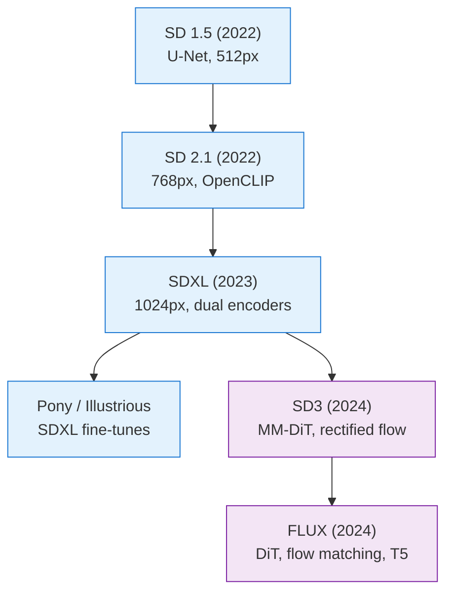
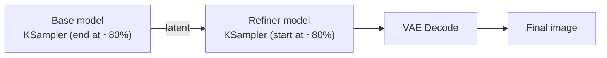
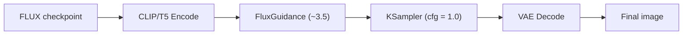

  <h1 style="color: white; margin: 0; font-size: 2.5rem;">Base Models Comparison</h1>
  
Comprehensive comparison of SD 1.5, SDXL, SD3, FLUX, and Pony diffusion models with their strengths, requirements, and optimal use cases.

Comprehensive comparison of popular diffusion models: SD 1.5, SD 2.x, SDXL, Pony, and FLUX, with their strengths, requirements, and use cases.

## Choosing a Base Model

The base model (checkpoint) is the single most important choice you make — it sets the ceiling for quality, the resolution you work at, the VRAM you need, and which LoRAs and ControlNets you can use. This guide compares the major families so you can match a model to your task, hardware, and ecosystem. If you only remember one thing: **SDXL is the safest all-rounder**, and the rest are specializations around it.

  

    <i class="fas fa-balance-scale"></i>
    <h4>No Single Winner</h4>
    
Match the model to your task, hardware, and ecosystem — SDXL is the safest all-rounder.

  

  

    <i class="fas fa-code-branch"></i>
    <h4>Two Lineages</h4>
    
U-Net (SD 1.5/2.x/SDXL/Pony) vs. transformer flow-matching (SD3/FLUX). Add-ons don't cross between them.

  

  

    <i class="fas fa-memory"></i>
    <h4>VRAM Decides</h4>
    
4-6 GB favors SD 1.5; 8-12 GB suits SDXL; FLUX wants 12 GB+ (or a quantized build).

  

## Quick Comparison Table

| Model | Resolution | VRAM (Min) | Quality | Speed | Flexibility | Release |
|-------|------------|------------|---------|-------|-------------|---------|
| SD 1.5 | 512×512 | 4GB | Good | Fast | Excellent | 2022 |
| SD 2.1 | 768×768 | 6GB | Better | Medium | Good | 2022 |
| SDXL | 1024×1024 | 8GB | Excellent | Slow | Very Good | 2023 |
| SD3 | 1024×1024 | 10GB | Superior | Medium | Excellent | 2024 |
| Pony | 1024×1024 | 8GB | Excellent* | Medium | Specialized | 2024 |
| FLUX | 1024×1024+ | 12GB | State-of-art | Slow | Excellent | 2024 |

*Excellent for anime/stylized content

### How the Families Relate

The major models split into two architectural lineages — the original U-Net diffusion line and the newer transformer-based (DiT) flow-matching line:

Blue = U-Net diffusion lineage; purple = transformer/flow-matching lineage. LoRAs and ControlNets are tied to their lineage, which is why SD 1.5 add-ons don't work on SDXL or FLUX.

### The Two Architectures Side by Side

The lineage split is not just branding - the two families denoise differently. The U-Net line uses a convolutional encoder/decoder with cross-attention to the text, trained to predict noise. The transformer line replaces the U-Net with a **Diffusion Transformer (DiT)** that processes image and text tokens together (multimodal attention) and is trained with rectified flow.

| Aspect | U-Net line (SD 1.5 / SDXL) | Transformer line (SD3 / FLUX) |
|--------|----------------------------|-------------------------------|
| Backbone | Convolutional U-Net | Diffusion Transformer (DiT / MM-DiT) |
| Text injected via | Cross-attention layers | Joint image+text attention (tokens mixed) |
| Training objective | Noise prediction (DDPM) | Velocity / rectified flow |
| Guidance | CFG scale (~5-9) | Distilled/embedded guidance (CFG often 1.0) |
| Practical effect | Mature add-on ecosystem, fast on low VRAM | Stronger prompt adherence and text rendering, heavier |

If you understand the [forward/reverse diffusion process and flow matching](stable-diffusion-fundamentals.html), this table is the one-line summary of why the newer models behave differently.

## Stable Diffusion 1.5

### Overview

SD 1.5 remains the most popular and widely supported model due to its balance of quality, speed, and compatibility. Despite newer models, it maintains relevance through extensive community support and optimization.

### Technical Specifications

| Property | Value |
|----------|-------|
| Architecture | U-Net with cross-attention |
| Parameters | ~860M |
| Training resolution | 512×512 |
| Text encoder | CLIP ViT-L/14 (77 tokens) |
| VAE | KL-f8 autoencoder |
| File size | ~2 GB (pruned, fp16) |

### Strengths and Weaknesses

| Strengths | Weaknesses |
|-----------|------------|
| Massive ecosystem of LoRAs, embeddings, tools | Low native resolution (512×512) |
| Runs on 4 GB VRAM; fast (20-50 steps) | Poor text rendering |
| Years of community optimization | Struggles with hands and complex poses |
| Versatile across most content types | Limited grasp of recent/modern concepts |

### Optimal Settings

| Setting | Value |
|---------|-------|
| Resolution | 512×512 |
| Steps | 20-30 |
| CFG scale | 7-9 |
| Sampler | `euler_a` or `dpmpp_2m` |
| CLIP skip | 1-2 (2 for anime checkpoints) |
| VAE | `vae-ft-mse-840000` |

### Use Cases

Best for:
- Quick prototyping
- Low-resource environments
- Artistic/stylized content
- When extensive LoRA support needed
- Web applications

## Stable Diffusion 2.x

### Overview

SD 2.x improved upon 1.5 with better training data and higher resolution, but faced adoption challenges due to changed aesthetic preferences and compatibility issues.

### Technical Specifications

| Property | Value |
|----------|-------|
| Architecture | Improved U-Net |
| Parameters | ~865M |
| Training resolution | 768×768 |
| Text encoder | OpenCLIP ViT-H/14 (77 tokens) |
| VAE | Improved KL-f8 |
| File size | ~2.5 GB |

### What Changed from 1.5

SD 2.x swapped CLIP for **OpenCLIP**, trained on a cleaner (NSFW-filtered) dataset, and raised native resolution to 768×768 with improved attention. The result was *technically* better but *aesthetically* divisive — the filtered data and new encoder changed the default "look," and because it broke compatibility with SD 1.5 add-ons, the community largely skipped it.

### Strengths and Weaknesses

| Strengths | Weaknesses |
|-----------|------------|
| Higher resolution (768×768), cleaner output | Sparse ecosystem — few LoRAs/tools |
| Improved detail and coherence | Different, less "artistic" default aesthetic |
| Better concept understanding | Not compatible with SD 1.5 add-ons |
| Fewer artifacts | Requires a different prompting style |

### Optimal Settings

| Setting | Value |
|---------|-------|
| Resolution | 768×768 |
| Steps | 25-35 |
| CFG scale | 6-8 |
| Sampler | `dpmpp_2m` |
| Negative prompt | Essential for good results |

## SDXL (Stable Diffusion XL)

### Overview

SDXL represents a major leap in quality and resolution, introducing a two-stage pipeline with separate base and refiner models for unprecedented detail.

### Technical Specifications

| Property | Value |
|----------|-------|
| Architecture | Enlarged U-Net (+ optional Refiner) |
| Parameters | ~3.5B base (+ ~3.5B refiner) |
| Training resolution | 1024×1024 |
| Text encoders | CLIP ViT-L + OpenCLIP ViT-G (77 tokens each) |
| Conditioning | Size + crop conditioning |
| VAE | SDXL VAE (improved color accuracy) |
| File size | ~6.5 GB (base only) |

### What Makes SDXL Different

- **Dual text encoders.** Two CLIP models read the prompt together, improving composition and prompt comprehension over the single encoder in SD 1.5/2.x.
- **Optional two-stage pipeline.** A base model handles the bulk of denoising and an optional **refiner** finishes the last ~20% to sharpen detail. In practice many users skip the refiner — modern fine-tunes look excellent base-only.
- **Conditioning augmentation.** The model is told the target resolution and crop, which reduces the cropping/zoom artifacts common in earlier models.

### Strengths and Weaknesses

| Strengths | Weaknesses |
|-----------|------------|
| Photorealistic quality, excellent micro-detail | Needs 8 GB+ VRAM |
| Native 1024×1024+, strong composition | 40-50% slower than SD 1.5 |
| Improved (if imperfect) text rendering | Best quality wants the two-model pipeline |
| Works across all styles; deepest modern ecosystem | ~13 GB for the full base + refiner |

### Optimal Settings

| Setting | Value |
|---------|-------|
| Resolution | 1024×1024 |
| Base steps | 25-35 |
| Refiner steps | 10-15 (if used) |
| CFG scale | 5-7 |
| Sampler | `dpmpp_2m_sde` (Karras) |
| Refiner switch | ~0.8 |
| Negative prompt | Critical for quality |

### SDXL Refiner Workflow

The two-stage handoff is a single latent passed between two samplers — the base stops early and the refiner finishes:

## Pony Diffusion

### Overview

Pony Diffusion is a specialized SDXL fine-tune focused on anime, furry, and cartoon content, becoming the go-to model for stylized artwork generation.

### Technical Specifications

| Property | Value |
|----------|-------|
| Base | SDXL architecture (a fine-tune) |
| Specialization | Anime / furry / cartoon |
| Training data | Curated booru datasets |
| Prompt system | `score_*` quality tags + danbooru tags |
| Resolution | 1024×1024 |
| File size | ~6.5 GB |

### What Makes Pony Different

Pony's defining quirk is **score-based prompting**: it learned a quality ladder (`score_9`, `score_8_up`, ...) that you prepend to steer toward higher-rated output. Combined with deep **danbooru-style tagging** and broad **character knowledge**, this makes it the go-to for anime/cartoon fan art — at the cost of an unusual prompt style and a strong content bias.

### Strengths and Weaknesses

| Strengths | Weaknesses |
|-----------|------------|
| Best-in-class for anime/stylized art | Not suited to photorealism |
| Strong style consistency and character recall | Unusual `score_*` prompting to learn |
| Intuitive for booru-tag users | Heavily biased toward its training content |
| Active community, frequent fine-tunes | Tends toward NSFW without careful prompting |

### Optimal Settings

| Setting | Value |
|---------|-------|
| Resolution | 1024×1024 |
| Steps | 25-30 |
| CFG scale | 6-8 |
| Sampler | `euler_a` |
| CLIP skip | 2 (important for anime) |
| Prompt prefix | `score_9, score_8_up, score_7_up` |

### Prompting Guide

A workable Pony prompt structure:

- **Positive:** `score_9, score_8_up, masterpiece, best quality, 1girl, [character], [outfit], [pose], [expression], [background], [lighting], [style tags]`
- **Negative:** `score_6, score_5, score_4, worst quality, low quality, bad anatomy, bad hands`

The leading `score_*` tags act as the quality dial; the rest follows ordinary danbooru tagging.

### A Note on Illustrious and NoobAI

Pony is not the only major SDXL anime fine-tune. **Illustrious XL** (and community successors like **NoobAI XL**) trained directly on large booru datasets and have become strong alternatives, often with better native danbooru-tag recognition and without Pony's `score_*` prefix convention. The choice between them is largely community/aesthetic preference - both are SDXL underneath, so they share its LoRAs and ControlNets.

| Fine-tune | Prompt convention | Notable for |
|-----------|-------------------|-------------|
| Pony Diffusion V6 | `score_9, score_8_up, ...` prefix | Huge community, strong style control |
| Illustrious XL | Plain danbooru tags | Accurate character/tag recall |
| NoobAI XL | Plain danbooru tags | Recent training data, refined Illustrious base |

## Stable Diffusion 3

### Overview

SD3 marks the lineage's shift from U-Net to a Multimodal Diffusion Transformer (MM-DiT) trained with rectified flow — the same family of ideas behind FLUX, but with different design choices and lower resource demands.

### Technical Specifications

| Property | Value |
|----------|-------|
| Architecture | MM-DiT (Multimodal Diffusion Transformer) |
| Parameters | 2B (Medium), 8B (Large) |
| Text encoders | CLIP L/14 + OpenCLIP bigG/14 + T5-v1.1-XXL (77 + 77 + 256 tokens) |
| Training | Rectified flow (like FLUX) |
| Resolution | 1024×1024 base, up to 2048×2048 |
| File size | ~6 GB (Medium), ~18 GB (Large) |

### What Makes SD3 Different

SD3's headline is **triple text encoding** — two CLIP encoders for visual concepts plus a large **T5** encoder for natural-language understanding. That combination drives its two real advantages over SDXL: notably **stronger prompt adherence** and the ability to **render legible text** in images. Because it uses rectified flow rather than DDPM, it follows prompts harder at a lower CFG.

### Strengths and Weaknesses

| Strengths | Weaknesses |
|-----------|------------|
| Best-in-class prompt following | More restrictive licensing than SD 1.5/SDXL |
| Can render readable words and letters | Smaller ecosystem, fewer fine-tunes |
| Medium runs well on ~10 GB VRAM | Triple encoder adds setup complexity |
| FLUX-class quality at lower cost; standard workflows | Large variant is resource-heavy |

> **Use SD3.5, not the original SD3 Medium.** The 3.5 Large/Medium refresh fixed much of the launch-day anatomy and licensing criticism and is the practical choice in this family today.

### Optimal Settings

| Setting | Value |
|---------|-------|
| Resolution | 1024×1024 |
| Steps | 28 (Stability's recommendation) |
| CFG scale | ~5 (lower than U-Net models) |
| Sampler | `dpmpp_2m` |
| Shift | ~3.0 (important SD3 flow parameter) |

## FLUX

### Overview

FLUX represents the current state-of-the-art in open diffusion models, with revolutionary architecture changes and significantly improved capabilities.

### Technical Specifications

| Property | Value |
|----------|-------|
| Architecture | Transformer-based (DiT), flow matching |
| Parameters | ~12B |
| Text encoders | T5-XXL + CLIP (256 tokens) |
| Guidance | Distilled guidance (no traditional CFG) |
| Resolution | 1024×1024 to 2048×2048 |
| File size | ~24 GB (fp16); ~12 GB (fp8) |

### Model Variants

Choosing the right FLUX build is mostly a quality-vs-VRAM trade:

| Variant | What it is | When to use |
|---------|-----------|-------------|
| FLUX.1-dev | Full-quality open-weights model | Default for local high-quality work |
| FLUX.1-schnell | Distilled, 1-4 step generation | Fast iteration and previews |
| FLUX.1-pro | API-only premium tier | Best quality without local hardware |
| FLUX fp8 | Quantized weights | Fits ~12 GB cards with little quality loss |
| FLUX GGUF (Q4-Q8) | Further quantized | Squeezing onto smaller VRAM budgets |

### What Makes FLUX Different

- **No traditional CFG.** FLUX bakes guidance into the model, so `cfg` is held at **1.0** and a separate `guidance` value (~3.5) controls prompt strength. Setting CFG above 1.0 breaks FLUX output — a common first-time mistake.
- **T5 text understanding.** Like SD3, the T5 encoder handles long natural-language prompts far better than CLIP.
- **Coherence and anatomy.** FLUX rarely botches hands and holds spatial/physical consistency better than prior open models, and it renders legible text.

### Strengths and Weaknesses

| Strengths | Weaknesses |
|-----------|------------|
| State-of-the-art open-model quality | 12 GB+ VRAM minimum |
| Readable text, strong prompt adherence | 2-3x slower than SDXL |
| Reliable anatomy and physics | ~24 GB at full precision |
| Trained on recent data | Newer (if now-mature) ecosystem; different workflow |

### Optimal Settings

| Setting | Value |
|---------|-------|
| Resolution | 1024×1024 |
| Steps | 20-25 (1-4 for schnell) |
| CFG | **1.0** (must not change) |
| Guidance | ~3.5 (via FluxGuidance node) |
| Sampler / scheduler | `euler` / `simple` |
| Model | `flux-fp8` for lower-VRAM cards |

### FLUX Workflow

FLUX inserts a **FluxGuidance** node before sampling and keeps CFG pinned at 1.0:

## Model Selection Guide

### By Use Case

| Use Case | Recommended Model | Alternative |
|----------|------------------|-------------|
| Quick prototypes | SD 1.5 | FLUX-schnell |
| Photorealism | FLUX | SDXL |
| Anime/Manga | Pony | SD 1.5 + LoRA |
| Game assets | SDXL | SD 1.5 |
| Product renders | FLUX | SDXL |
| Artistic styles | SD 1.5 | SDXL |
| Text in images | FLUX | SDXL (limited) |
| Low VRAM (4-6GB) | SD 1.5 | SD 2.1 |
| Best quality | FLUX | SDXL + Refiner |

### By Hardware

| VRAM | Optimal Model | Settings |
|------|--------------|----------|
| 4GB | SD 1.5 | 512×512, FP16 |
| 6GB | SD 2.1 | 768×768, FP16 |
| 8GB | SDXL | 1024×1024, FP16, no refiner |
| 12GB | FLUX-fp8 | 1024×1024, optimized |
| 16GB+ | Any model | Full quality |

## Performance Comparison

### Generation Speed (RTX 4090)

> **Note:** These figures are approximate and highly hardware-dependent (VRAM, precision, attention backend, and software version all matter). Treat them as rough relative comparisons rather than exact benchmarks.

| Model | Resolution | Steps | Time | It/s |
|-------|------------|-------|------|------|
| SD 1.5 | 512×512 | 25 | 3s | 8.3 |
| SD 2.1 | 768×768 | 30 | 6s | 5.0 |
| SDXL | 1024×1024 | 30 | 15s | 2.0 |
| SD3-M | 1024×1024 | 28 | 20s | 1.4 |
| Pony | 1024×1024 | 25 | 12s | 2.1 |
| FLUX | 1024×1024 | 25 | 40s | 0.6 |
| FLUX-schnell | 1024×1024 | 4 | 2s | 2.0 |

### Quality Metrics

> **Caveat:** The numbers below are illustrative/approximate for relative comparison only — they are not the result of a controlled benchmark and should not be cited as measured scores.

| Model | FID Score | CLIP Score | User Preference |
|-------|-----------|------------|-----------------|
| SD 1.5 | 12.6 | 31.7 | 72% |
| SD 2.1 | 10.2 | 32.5 | 78% |
| SDXL | 8.1 | 33.8 | 86% |
| SD3 | 7.5 | 34.5 | 89% |
| Pony | 9.2* | 32.1* | 91%** |
| FLUX | 6.3 | 35.2 | 94% |

*On anime dataset **Among target audience

## Migration Guide

Moving up the lineage means changing both *how you prompt* and *which settings apply*.

### From SD 1.5 to SDXL

The biggest shift is from terse tags to natural description. An SD 1.5 prompt like `masterpiece, best quality, 1girl, sitting, park bench` becomes, for SDXL, something closer to a sentence: *"a young woman sitting on a park bench on a sunny day, professional photography, shallow depth of field."* SDXL's dual encoders reward this; quality-spam tags help much less than they did on SD 1.5.

### From SDXL to FLUX

The trap here is **settings, not prompts**. SDXL uses `cfg_scale ≈ 7.5` at ~30 steps. FLUX must run at **`cfg = 1.0`** with a separate `guidance ≈ 3.5` at ~25 steps — leaving CFG at an SDXL-style value will wreck FLUX output. Prompts can stay natural-language, which FLUX's T5 encoder handles well.

### Prompting Differences

| Model | Prompt Style | Example |
|-------|--------------|---------|
| SD 1.5 | Tag-based | "1girl, red hair, blue eyes, smile, outdoors" |
| SDXL | Natural + tags | "A girl with red hair and blue eyes smiling outdoors, masterpiece" |
| Pony | Score + tags | "score_9, 1girl, red hair, blue eyes, smile, outdoors" |
| FLUX | Natural language | "A cheerful young woman with vibrant red hair and striking blue eyes" |

## Future Considerations

### Emerging Trends

1. **Smaller, faster models**: Distillation techniques (LCM, Turbo)
2. **Better architectures**: DiT and flow-based models dominating
3. **Multi-modal**: Combined image/video/3D generation
4. **Real-time generation**: Sub-second inference becoming standard
5. **Mobile deployment**: On-device generation with quantization
6. **Open alternatives**: Models like PixArt-α (Würstchen v3 / Stable Cascade was an earlier cascaded approach, now largely superseded)

### Choosing Future-Proof Models

- **FLUX**: Current best for quality and capabilities; its LoRA and ControlNet ecosystem has matured rapidly and is no longer a reason to avoid it
- **SD3.5**: The 3.5 Large/Medium refresh addressed many launch-day criticisms of the original SD3 Medium (anatomy, licensing) and is the practical SD3-family choice today
- **SDXL**: Stable choice with the deepest mature ecosystem; fine-tunes like Pony and Illustrious keep it highly relevant for stylized art
- **SD 1.5**: Will remain relevant for specialized uses, fastest iteration, and low-resource scenarios

## Conclusion

Each model serves different needs:

- **SD 1.5**: Speed, compatibility, and low requirements
- **SD 2.x**: Middle ground (mostly superseded)
- **SDXL**: Quality and resolution balance with mature ecosystem
- **SD3**: Modern architecture with excellent prompt understanding
- **Pony**: Specialized excellence for anime/stylized content
- **FLUX**: Cutting-edge quality and capabilities

The rapid evolution continues, with models like PixArt-α exploring alternative architectures. (Stable Cascade / Würstchen was an earlier cascaded approach that is now largely superseded.) Stay informed about new developments while mastering these foundational models. Choose based on your specific requirements for quality, speed, hardware, and content type.

## Key Takeaways

- **There is no single "best" model** — match the model to your task, hardware, and required ecosystem.
- **Default to SDXL** for the best balance of quality, speed, and mature LoRA/ControlNet support.
- **Choose FLUX** for state-of-the-art photorealism, coherence, and text rendering when you have the VRAM (12GB+).
- **Keep SD 1.5** for low-VRAM setups, fastest iteration, and access to its enormous legacy ecosystem.
- **Two lineages, two add-on ecosystems:** U-Net (SD 1.5/2.x/SDXL/Pony) vs. transformer flow-matching (SD3/FLUX). LoRAs and ControlNets do not cross between them.

---

#### See Also

- [Stable Diffusion Fundamentals](stable-diffusion-fundamentals.html) - Core concepts explained
- [Model Types](model-types.html) - Understanding LoRAs, VAEs, embeddings
- [ComfyUI Guide](comfyui-guide.html) - Visual workflow creation
- [LoRA Training](lora-training.html) - Train custom models
- [ControlNet](controlnet.html) - Precise control over generation
- [Output Formats](output-formats.html) - Exporting and using generated content
- [Advanced Techniques](advanced-techniques.html) - Cutting-edge workflows
- [AI/ML Documentation Hub](./) - Complete AI/ML documentation index

