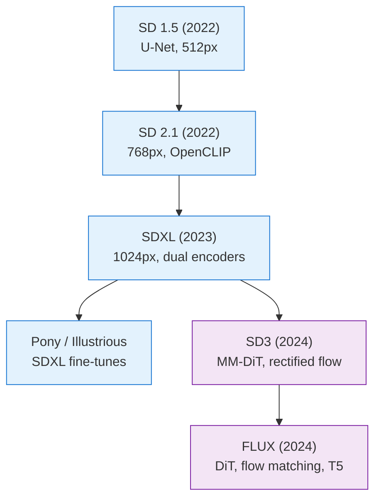
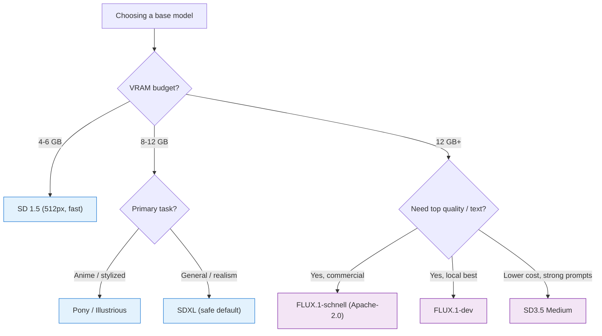

[AI/ML Documentation](./) &raquo; Base Models Comparison

The hub for picking a base model. Start with the comparison table and selection guide here, then dive into a per-family page — <a href="sdxl-guide.html">SDXL</a>, <a href="sd3-guide.html">SD3</a>, <a href="flux-guide.html">FLUX</a>, or the <a href="pony-and-finetunes.html">Pony / community fine-tunes</a> — for the full architecture, settings, and ecosystem treatment.

## Choosing a Base Model

The base model (checkpoint) is the single most important choice you make — it sets the ceiling for quality, the resolution you work at, the VRAM you need, and which LoRAs and ControlNets you can use. This page compares the major families so you can match a model to your task, hardware, and ecosystem. If you only remember one thing: **SDXL is the safest all-rounder**, and the rest are specializations around it.

- **No Single Winner.** Match the model to your task, hardware, and ecosystem — SDXL is the safest all-rounder.
- **Two Lineages.** U-Net (SD 1.5/2.x/SDXL/Pony) vs. transformer flow-matching (SD3/FLUX). Add-ons don't cross between them.
- **VRAM Decides.** 4-6 GB favors SD 1.5; 8-12 GB suits SDXL; FLUX wants 12 GB+ (or a quantized build).

## The Comparison Table

The single most useful view: every major family side by side, by the dimensions that actually drive a choice — scale, architecture, license, and where each one shines.

| Model | Params | Architecture | Native res. | Min VRAM | License | Strengths |
|-------|--------|--------------|-------------|----------|---------|-----------|
| **SD 1.5** | ~860M | U-Net + CLIP ViT-L | 512×512 | 4 GB | CreativeML OpenRAIL-M (permissive) | Huge legacy ecosystem; fastest; runs anywhere |
| **SD 2.x** | ~865M | U-Net + OpenCLIP ViT-H | 768×768 | 6 GB | CreativeML OpenRAIL++-M | Higher res, cleaner data — but sparse ecosystem; largely skipped |
| **SDXL** | ~3.5B base (+~3.5B refiner) | Enlarged U-Net + dual CLIP | 1024×1024 | 8 GB | CreativeML OpenRAIL++-M (permissive) | Best all-rounder; strong composition; deepest mature add-ons |
| **SD3 / 3.5** | 2B (Medium) – 8B (Large) | MM-DiT + CLIP×2 + T5 | 1024×1024 (→2048) | 10 GB | Stability Community License (restrictions above a revenue cap) | Excellent prompt adherence; legible text; modern at lower cost |
| **FLUX.1** | ~12B | DiT, flow matching + T5 + CLIP | 1024×1024 (→2048) | 12 GB (fp8) | dev: non-commercial · schnell: Apache-2.0 | State-of-the-art quality; reliable anatomy; readable text |
| **Pony / Illustrious** | SDXL fine-tune (~3.5B) | SDXL U-Net (fine-tuned) | 1024×1024 | 8 GB | Inherits SDXL (OpenRAIL++-M) | Best-in-class anime/stylized; strong character recall |

A few reading notes:

- **Params are the denoiser size**, not counting the VAE or text encoders (FLUX's T5-XXL alone adds several GB to the working set).
- **License is the easy trap.** SD 1.5/SDXL are permissive OpenRAIL variants; SD3 carries Stability's community license (free below a revenue threshold), and **FLUX.1-dev is non-commercial** — use **schnell (Apache-2.0)** for commercial work.
- **"Min VRAM"** assumes fp16 (or fp8 for FLUX) with sensible optimizations; quantized GGUF builds push every floor lower.

### Quick Operating Profile

The same families, viewed as a day-to-day operating profile rather than a spec sheet:

| Model | Quality | Speed | Flexibility | Release |
|-------|---------|-------|-------------|---------|
| SD 1.5 | Good | Fast | Excellent | 2022 |
| SD 2.1 | Better | Medium | Good | 2022 |
| SDXL | Excellent | Slow | Very Good | 2023 |
| SD3 / 3.5 | Superior | Medium | Excellent | 2024 |
| Pony | Excellent* | Medium | Specialized | 2024 |
| FLUX | State-of-art | Slow | Excellent | 2024 |

*Excellent for anime/stylized content

## The Lineage

The major models split into two architectural lineages — the original U-Net diffusion line and the newer transformer-based (DiT) flow-matching line:

Blue = U-Net diffusion lineage; purple = transformer/flow-matching lineage. The arrows are conceptual/chronological, not literal weight inheritance — SD3 and FLUX are trained from scratch with a new backbone, not continued from SDXL. The one thing the diagram *does* tell you literally: **LoRAs and ControlNets are tied to their lineage**, which is why SD 1.5 add-ons don't work on SDXL, and SDXL add-ons don't work on FLUX.

## Architectural Differences: U-Net vs DiT/Transformer

The lineage split is not just branding — the two families denoise differently, and that difference explains almost every behavioral gap in the comparison table. The U-Net line uses a convolutional encoder/decoder with cross-attention to the text, trained to predict the noise added to an image. The transformer line replaces the U-Net with a **Diffusion Transformer (DiT)** that processes image and text tokens *together* (joint multimodal attention) and is trained with **rectified flow** — learning a velocity field that transports noise to data along near-straight paths rather than predicting noise step by step.

| Aspect | U-Net line (SD 1.5 / SDXL / Pony) | Transformer line (SD3 / FLUX) |
|--------|------------------------------------|-------------------------------|
| Backbone | Convolutional U-Net | Diffusion Transformer (DiT / MM-DiT) |
| Text injected via | Cross-attention layers | Joint image+text attention (tokens mixed) |
| Training objective | Noise prediction (DDPM) | Velocity / rectified flow matching |
| Text encoder(s) | CLIP (one or two) | CLIP + a large T5 language encoder |
| Guidance | CFG scale (~5-9), two forward passes/step | Distilled/embedded guidance (CFG often pinned at 1.0), one pass/step |
| Position encoding | Fixed convolutional grid | Rotary embeddings (RoPE), resolution-flexible |
| Practical effect | Mature add-on ecosystem, fast on low VRAM | Stronger prompt adherence and text rendering, heavier |

The consequences are exactly what the table predicts:

- **Prompt adherence and text rendering.** Mixing image and text tokens in joint attention, plus a large T5 encoder, is why SD3 and FLUX follow long natural-language prompts and render legible words far better than the U-Net models, whose single/dual CLIP encoders inject text only through cross-attention.
- **Steps and guidance.** Because rectified flow learns near-straight transport paths, the transformer models integrate in fewer steps and bake guidance into the weights — so FLUX runs **`cfg = 1.0`** with a separate `guidance` scalar, while U-Net models need a real CFG of ~5-9.
- **Ecosystem.** A LoRA or ControlNet is trained against a *specific backbone's* layers. U-Net add-ons target convolutional/cross-attention blocks; DiT add-ons target the transformer's attention/MLP projections. They are structurally incompatible, which is why **add-ons never cross the lineage boundary**.

If you understand the [forward/reverse diffusion process and flow matching](stable-diffusion-fundamentals.html), this section is the one-line summary of why the newer models behave differently. For the full treatment of each backbone, see the per-family pages below.

## The Families in One Paragraph Each

Just enough on each family to choose; follow the link for the deep dive.

### Stable Diffusion 1.5 (summarized)

SD 1.5 (2022, ~860M params, 512×512, CLIP ViT-L) remains the most widely supported model thanks to its balance of quality, speed, and compatibility. It runs on 4 GB cards, generates in 20-30 fast steps, and sits on the largest legacy collection of LoRAs, embeddings, and tools in existence. Its weaknesses are exactly its age: low native resolution, poor text rendering, and trouble with hands and complex poses. Typical settings: 512×512, 20-30 steps, `cfg 7-9`, `euler_a` or `dpmpp_2m`, CLIP skip 2 on anime checkpoints. **Reach for SD 1.5** for quick prototyping, low-VRAM machines, and access to its enormous legacy ecosystem.

### Stable Diffusion 2.x (summarized)

SD 2.x (2022, ~865M params, 768×768) swapped CLIP for **OpenCLIP**, trained on a cleaner NSFW-filtered dataset, and raised native resolution to 768×768 with improved attention. The result was *technically* better but *aesthetically* divisive — the filtered data and new encoder changed the default "look," and because it broke compatibility with SD 1.5 add-ons, the community largely skipped it. It needs a different prompting style and stronger negative prompts than 1.5. **In practice SD 2.x is superseded:** if you want SD 1.5's footprint, use 1.5; if you want higher resolution, jump to SDXL.

### SDXL — the default all-rounder

SDXL (2023, ~3.5B base, 1024×1024) keeps the U-Net but scales it up, reads the prompt with **two** text encoders (CLIP ViT-L + OpenCLIP bigG), and conditions on image **size and crop** so it frames subjects better than SD 1.5. An optional **refiner** finishes the last ~20% of denoising, though most modern fine-tunes look excellent base-only. It runs on 8 GB cards and anchors the deepest mature ecosystem outside the SD 1.5 legacy world. → **[Full SDXL guide](sdxl-guide.html)**

### SD3 / 3.5 — modern architecture, lower cost

SD3 (2024) moves the lineage to a **Multimodal Diffusion Transformer (MM-DiT)** trained with rectified flow, with **triple text encoding** (two CLIP encoders plus a large T5) that drives strong prompt adherence and legible in-image text. The Medium variant runs comfortably on ~10 GB. Use the **SD3.5** refresh rather than the original SD3 Medium — it fixed much of the launch-day anatomy and licensing criticism and is the practical SD3-family choice today. → **[Full SD3 guide](sd3-guide.html)**

### FLUX — state of the art

FLUX.1 (2024, ~12B params) from Black Forest Labs abandons the U-Net for a large **flow-matching transformer** with **guidance distillation** baked in. It rarely botches hands, renders legible text, follows long natural-language prompts, and sets the open-model quality bar — at the cost of 12 GB+ VRAM and 2-3× SDXL's runtime. Keep **`cfg = 1.0`** and steer with `guidance` (~3.5); use **schnell (Apache-2.0)** for commercial work, **dev** for top-quality local work. → **[Full FLUX guide](flux-guide.html)**

### Pony & SDXL Fine-Tunes — specialized excellence

Pony Diffusion, Illustrious, and NoobAI are all **fine-tunes of SDXL**, not new architectures, so they share SDXL's LoRAs, ControlNets, and tooling — you adopt a new *dialect* of prompting, not a new ecosystem. Pony's signature is **score-based prompting** (`score_9, score_8_up, ...`); Illustrious and NoobAI use plain danbooru tags. They are best-in-class for anime/stylized art and biased toward that content. → **[Full Pony & fine-tunes guide](pony-and-finetunes.html)**

## Per-Family Guides

Once you have chosen a family, these pages cover its architecture, optimal settings, ecosystem, and migration notes in full depth.

- **[SDXL Guide](sdxl-guide.html)** — dual text encoders, size/crop conditioning, the base+refiner pipeline, and the fine-tune ecosystem built on SDXL.
- **[SD3 Guide](sd3-guide.html)** — the MM-DiT backbone, triple text encoding, rectified-flow training, in-image text, and SD3.5 licensing.
- **[FLUX Guide](flux-guide.html)** — flow matching, guidance distillation, dev / schnell / pro variants, and the FLUX node workflow.
- **[Pony & Fine-Tunes](pony-and-finetunes.html)** — Pony, Illustrious, NoobAI, and Animagine: score/tag conventions and when to pick a fine-tune over a base.

## Model Selection Guide

### By Use Case

| Use Case | Recommended Model | Alternative |
|----------|------------------|-------------|
| Quick prototypes | SD 1.5 | FLUX-schnell |
| Photorealism | FLUX | SDXL |
| Anime/Manga | Pony / Illustrious | SD 1.5 + LoRA |
| Game assets | SDXL | SD 1.5 |
| Product renders | FLUX | SDXL |
| Artistic styles | SD 1.5 | SDXL |
| Text in images | FLUX | SD3 (SDXL limited) |
| Low VRAM (4-6GB) | SD 1.5 | SD 2.1 |
| Commercial use | SDXL / FLUX-schnell | SD 1.5 |
| Best quality | FLUX | SDXL + Refiner |

### By Hardware

| VRAM | Optimal Model | Settings |
|------|--------------|----------|
| 4GB | SD 1.5 | 512×512, FP16 |
| 6GB | SD 2.1 | 768×768, FP16 |
| 8GB | SDXL | 1024×1024, FP16, no refiner |
| 10-12GB | SD3 Medium / FLUX-fp8 | 1024×1024, optimized |
| 16GB+ | Any model | Full quality |

### A Decision Path

## Prompting Across Families

Moving between families means changing both *how you prompt* and *which settings apply*. The two recurring shifts are tags→natural-language (SD 1.5 → SDXL/FLUX) and CFG→guidance (SDXL → FLUX). The per-family guides cover full migration tables; the essentials:

| Model | Prompt Style | Example |
|-------|--------------|---------|
| SD 1.5 | Tag-based | "1girl, red hair, blue eyes, smile, outdoors" |
| SDXL | Natural + tags | "A girl with red hair and blue eyes smiling outdoors, masterpiece" |
| Pony | Score + tags | "score_9, 1girl, red hair, blue eyes, smile, outdoors" |
| SD3 / FLUX | Natural language | "A cheerful young woman with vibrant red hair and striking blue eyes" |

The two traps worth memorizing: SDXL's **dual encoders reward sentences** over SD 1.5 quality-spam tags, and FLUX must run at **`cfg = 1.0`** with a separate `guidance ≈ 3.5` — leaving CFG at an SDXL-style 7.5 wrecks FLUX output. See the [SDXL](sdxl-guide.html) and [FLUX](flux-guide.html) guides for the full migration walkthroughs.

## Performance Comparison

### Generation Speed (RTX 4090)

> **Note:** These figures are approximate and highly hardware-dependent (VRAM, precision, attention backend, and software version all matter). Treat them as rough relative comparisons rather than exact benchmarks.

| Model | Resolution | Steps | Time | It/s |
|-------|------------|-------|------|------|
| SD 1.5 | 512×512 | 25 | 3s | 8.3 |
| SD 2.1 | 768×768 | 30 | 6s | 5.0 |
| SDXL | 1024×1024 | 30 | 15s | 2.0 |
| SD3-M | 1024×1024 | 28 | 20s | 1.4 |
| Pony | 1024×1024 | 25 | 12s | 2.1 |
| FLUX | 1024×1024 | 25 | 40s | 0.6 |
| FLUX-schnell | 1024×1024 | 4 | 2s | 2.0 |

### Quality Metrics

> **Caveat:** The numbers below are illustrative/approximate for relative comparison only — they are not the result of a controlled benchmark and should not be cited as measured scores.

| Model | FID Score | CLIP Score | User Preference |
|-------|-----------|------------|-----------------|
| SD 1.5 | 12.6 | 31.7 | 72% |
| SD 2.1 | 10.2 | 32.5 | 78% |
| SDXL | 8.1 | 33.8 | 86% |
| SD3 | 7.5 | 34.5 | 89% |
| Pony | 9.2* | 32.1* | 91%** |
| FLUX | 6.3 | 35.2 | 94% |

*On anime dataset **Among target audience

## Future Considerations

### Emerging Trends

1. **Smaller, faster models**: Distillation techniques (LCM, Turbo, schnell)
2. **Better architectures**: DiT and flow-based models dominating
3. **Multi-modal**: Combined image/video/3D generation
4. **Real-time generation**: Sub-second inference becoming standard
5. **Mobile deployment**: On-device generation with quantization
6. **Open alternatives**: Models like PixArt-α (Würstchen v3 / Stable Cascade was an earlier cascaded approach, now largely superseded)

### Choosing Future-Proof Models

- **FLUX**: Current best for quality and capabilities; its LoRA and ControlNet ecosystem has matured rapidly and is no longer a reason to avoid it.
- **SD3.5**: The 3.5 Large/Medium refresh addressed many launch-day criticisms of the original SD3 Medium (anatomy, licensing) and is the practical SD3-family choice today.
- **SDXL**: Stable choice with the deepest mature ecosystem; fine-tunes like Pony and Illustrious keep it highly relevant for stylized art.
- **SD 1.5**: Will remain relevant for specialized uses, fastest iteration, and low-resource scenarios.

## Key Takeaways

- **There is no single "best" model** — match the model to your task, hardware, and required ecosystem.
- **Default to SDXL** for the best balance of quality, speed, and mature LoRA/ControlNet support.
- **Choose FLUX** for state-of-the-art photorealism, coherence, and text rendering when you have the VRAM (12 GB+); use **schnell** if you need a commercial license.
- **Keep SD 1.5** for low-VRAM setups, fastest iteration, and access to its enormous legacy ecosystem.
- **Two lineages, two add-on ecosystems:** U-Net (SD 1.5/2.x/SDXL/Pony) vs. transformer flow-matching (SD3/FLUX). LoRAs and ControlNets do not cross between them.
- **Mind the license:** SD 1.5/SDXL are permissive; SD3 carries a revenue-capped community license; **FLUX.1-dev is non-commercial** while schnell is Apache-2.0.

## See Also

- [SDXL Guide](sdxl-guide.html) - The safe-default all-rounder in depth
- [SD3 Guide](sd3-guide.html) - The MM-DiT transformer family
- [FLUX Guide](flux-guide.html) - State-of-the-art flow-matching transformer
- [Pony & Community Fine-Tunes](pony-and-finetunes.html) - SDXL anime/stylized fine-tunes
- [Stable Diffusion Fundamentals](stable-diffusion-fundamentals.html) - Core concepts explained
- [Model Types](model-types.html) - Understanding LoRAs, VAEs, embeddings
- [ComfyUI Guide](comfyui-guide.html) - Visual workflow creation
- [LoRA Training](lora-training.html) - Train custom models
- [ControlNet](controlnet.html) - Precise control over generation
- [Advanced Techniques](advanced-techniques.html) - Cutting-edge workflows
- [AI/ML Documentation Hub](./) - Complete AI/ML documentation index
