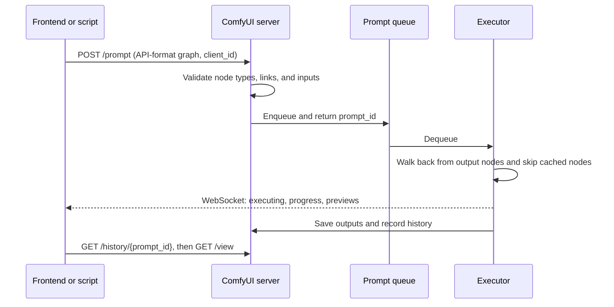
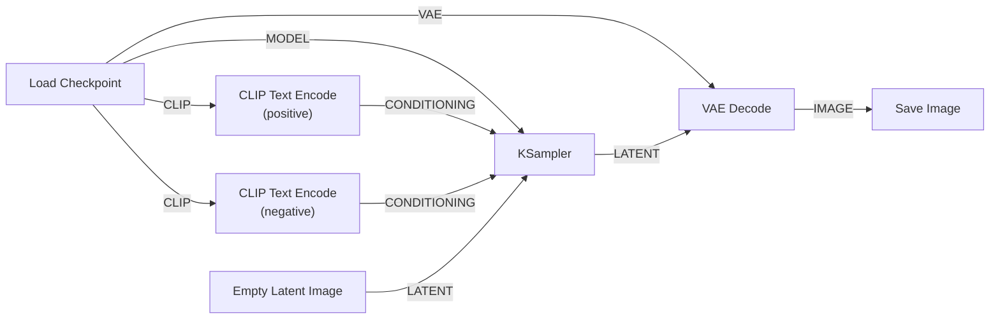
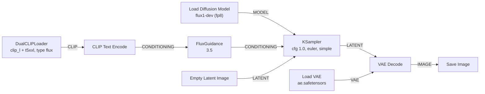

# ComfyUI

[AI/ML Documentation](./) &raquo; ComfyUI Guide

**ComfyUI** is an open-source, node-based interface and execution engine for diffusion models, developed by Comfy Org (GitHub: `Comfy-Org/ComfyUI`, GPL-3.0). A generation pipeline is built as a graph of typed nodes (loaders, text encoders, samplers, decoders) and then queued to a local server that executes it. ComfyUI is usually the first tool to support new open models, and its native support covers image (SD 1.5 and SDXL, SD3.5, FLUX.1 and FLUX.2, Qwen-Image, Z-Image, HiDream), editing, video (Wan, LTX-Video, HunyuanVideo), audio, and 3D models. This page covers installation, the graph and execution model, the core nodes, standard workflows, custom nodes, the HTTP/WebSocket API, and troubleshooting. Version references are current as of ComfyUI v0.37 (September 2026).

## How ComfyUI Works

ComfyUI has two parts: a **browser frontend** (the graph editor, a separately versioned TypeScript/Vue app) and a **Python server** that holds models in memory, keeps a prompt queue, and executes graphs. The desktop app bundles both. Every generation, whether started by clicking **Run** or from a script, follows the same path.



Three properties of this design matter in practice:

- **Graphs are data.** A workflow is JSON. It can be saved, versioned, shared, embedded in a PNG's metadata (every image saved by `SaveImage` contains the workflow that produced it), and submitted from code.
- **Execution is demand-driven and cached.** The executor starts from output nodes (`SaveImage`, `PreviewImage`), walks backwards, and re-runs only nodes whose inputs changed since the last run. Editing the prompt re-encodes the text and re-samples but does not reload the checkpoint. Changing only the filename prefix re-runs almost nothing.
- **Memory is managed automatically.** The model manager loads weights to the GPU when needed, offloads them to system RAM under pressure, and can stream weights for models larger than VRAM. Launch flags override this behavior (see [Launch flags](#launch-flags)).

### When to choose ComfyUI

| Need | ComfyUI | Alternatives |
|------|---------|--------------|
| Newest models on release day | Usually first, often with official templates | Forge and SwarmUI follow later |
| Multi-stage pipelines (upscale, detailer, editing, video) | Built as one graph | Scripted diffusers pipelines |
| Reproducible, shareable pipelines | JSON workflow, embedded in outputs | Written settings |
| Batch or programmatic generation | HTTP/WebSocket API on the same graphs | diffusers in Python |
| Quick single images with minimal setup | Workable with templates | Forge, InvokeAI, SwarmUI (a simpler UI on a ComfyUI backend) |

## Installation

| Method | Platforms | Notes |
|--------|-----------|-------|
| **Comfy Desktop** | Windows, macOS (Apple silicon) | Installer with a self-contained Python environment, auto-updates, and the Manager included. The 2026 rebuild can also manage portable, remote, and cloud installs. |
| **Portable package** | Windows (NVIDIA, AMD) | Zip with embedded Python; extract and run the `.bat` launcher |
| **comfy-cli** | All | `pip install comfy-cli`, then `comfy install` and `comfy launch`; also installs nodes and models |
| **Manual (git)** | All | Full control; the usual choice on Linux servers and in containers |

A manual install on Linux with an NVIDIA GPU:

```bash
git clone https://github.com/Comfy-Org/ComfyUI.git
cd ComfyUI
python3 -m venv .venv && source .venv/bin/activate   # Python 3.12 or 3.13 recommended

# Install PyTorch for your platform first (CUDA 13.0 wheels shown;
# see pytorch.org for ROCm, Intel XPU, or other CUDA versions)
pip install torch torchvision torchaudio --extra-index-url https://download.pytorch.org/whl/cu130

pip install -r requirements.txt
pip install -r manager_requirements.txt   # built-in ComfyUI-Manager

python main.py --enable-manager           # serves http://127.0.0.1:8188
```

ComfyUI-Manager is built into the core but must be enabled on manual installs with `--enable-manager`. The desktop app enables it by default. There is no official Docker image. Community images exist, or a container can be built from the manual steps above. Mount `models/`, `custom_nodes/`, `input/`, and `output/` as volumes so they persist across container rebuilds.

### Model folders

Models are found by folder. Other locations, such as an existing A1111 or Forge model directory, can be added with `extra_model_paths.yaml`.

| Folder under `models/` | Contents | Loader node |
|------------------------|----------|-------------|
| `checkpoints/` | All-in-one checkpoints (model + text encoder + VAE), typical for SD 1.5 and SDXL | Load Checkpoint |
| `diffusion_models/` | Denoiser-only weights, typical for FLUX, Qwen-Image, Z-Image, and video models (legacy name `unet/`) | Load Diffusion Model |
| `text_encoders/` | CLIP, T5, and LLM text encoders such as Qwen2.5-VL, Qwen3, and Mistral (legacy name `clip/`) | Load CLIP, DualCLIPLoader |
| `vae/` | VAEs | Load VAE |
| `loras/` | LoRA and LyCORIS adapters | LoraLoader, LoraLoaderModelOnly |
| `controlnet/` | ControlNet and T2I-Adapter models | Load ControlNet Model |
| `upscale_models/` | ESRGAN-family and other pixel upscalers | Load Upscale Model |
| `clip_vision/` | Image encoders for IP-Adapter, Redux, and similar | Load CLIP Vision |
| `embeddings/` | Textual-inversion embeddings, referenced as `embedding:name` in prompts | (inline in prompt) |
| `vae_approx/` | TAESD decoders for high-quality live previews | (used by `--preview-method taesd`) |

Newer models are distributed as **split files**, with the denoiser, text encoder, and VAE downloaded separately. This lets large text encoders be shared between models and quantized independently. Official ComfyUI templates list the exact file for each folder.

## The Graph Editor

### Nodes, sockets, and types

Each node performs one operation. Inputs are on the left, outputs on the right, and **widgets** (text boxes, sliders, dropdowns) inside the node hold its parameters. Links are typed, and only matching types connect:

| Type | Carries | Produced by (examples) |
|------|---------|------------------------|
| `MODEL` | The denoiser (U-Net or DiT), with any patches such as LoRAs | Load Checkpoint, Load Diffusion Model |
| `CLIP` | Text encoder(s) | Load Checkpoint, Load CLIP |
| `VAE` | Latent encoder and decoder | Load Checkpoint, Load VAE |
| `CONDITIONING` | Encoded prompt plus extras (areas, ControlNet hints, guidance) | CLIP Text Encode, Apply ControlNet |
| `LATENT` | Latent tensor plus batch and noise-mask metadata | Empty Latent Image, VAE Encode, KSampler |
| `IMAGE` | Pixel batch `[B, H, W, C]`, float 0–1 | VAE Decode, Load Image |
| `MASK` | Single-channel mask `[B, H, W]` | Load Image (alpha channel), mask editors, segmentation nodes |

In the current frontend, a widget can receive a link directly, for example a seed from a shared primitive node, without first being converted to an input.

### Organizing large graphs

- **Groups** draw a titled box around related nodes, which can then be moved, bypassed, or muted together.
- **Subgraphs** collapse a selection into a reusable node with its own inputs and outputs. The inner graph can be edited, and selected inner parameters can be exposed on the outer node. Subgraphs replaced the older "group nodes".
- **Bypass** (`Ctrl+B`) passes inputs straight through a node. **Mute** (`Ctrl+M`) disables it. Both are useful for A/B tests inside one graph.
- **Templates** (Workflow → Browse Templates) provide official, working starter graphs for each supported model, including download links for the required files.
- **Notes and titles.** Rename nodes to describe their role (for example "Refine pass, denoise 0.35") and add Note nodes listing required models and custom nodes.

### Keyboard shortcuts

| Action | Shortcut |
|--------|----------|
| Run (queue the workflow) | `Ctrl+Enter` |
| Queue at the front | `Ctrl+Shift+Enter` |
| Cancel the current run | `Ctrl+Alt+Enter` |
| Save / open workflow | `Ctrl+S` / `Ctrl+O` |
| Undo / redo | `Ctrl+Z` / `Ctrl+Y` |
| Bypass / mute selected | `Ctrl+B` / `Ctrl+M` |
| Search and add a node | Double-click the canvas |

## Core Nodes

| Node | Role | Key parameters |
|------|------|----------------|
| **Load Checkpoint** | Loads an all-in-one checkpoint and outputs `MODEL`, `CLIP`, `VAE` | `ckpt_name` |
| **Load Diffusion Model** | Loads a denoiser-only file | `unet_name`, `weight_dtype` (fp8 options) |
| **Load CLIP** / **DualCLIPLoader** | Loads one or two text encoders | `type` must match the model family (`flux`, `sd3`, `qwen_image`, and so on) |
| **LoraLoader** / **LoraLoaderModelOnly** | Patches `MODEL` (and optionally `CLIP`) with a LoRA | `strength_model`, `strength_clip` |
| **CLIP Text Encode** | Encodes a prompt to `CONDITIONING` | text; supports `(word:1.2)` weighting |
| **Empty Latent Image** (and family variants such as *EmptySD3LatentImage*) | Creates a noise-ready latent of the right channel count | `width`, `height`, `batch_size` |
| **KSampler** | Runs the denoising loop | see below |
| **KSampler (Advanced)** / **SamplerCustomAdvanced** | Step ranges, noise control, and pluggable sampler, sigma, and guider nodes | `start_at_step`, `end_at_step`, and more |
| **VAE Decode** / **VAE Decode (Tiled)** | Latent to image. The tiled version bounds memory for large images | `tile_size` |
| **VAE Encode** | Image to latent, for img2img | |
| **Save Image** / **Preview Image** | Writes to `output/` (with embedded workflow) or shows a temporary preview | `filename_prefix` |

### KSampler parameters

| Parameter | Meaning | Typical values |
|-----------|---------|----------------|
| `seed` | Initial noise seed | Any integer; `control_after_generate` sets fixed, increment, or randomize |
| `steps` | Number of denoising steps | 20–35 base models; 4–9 distilled |
| `cfg` | Classifier-free guidance scale | 5–7 SD/SDXL; 1.0 for guidance-distilled and turbo models |
| `sampler_name` | Solver | `euler`, `dpmpp_2m`, `dpmpp_2m_sde`, `res_multistep`, `uni_pc` |
| `scheduler` | Noise-level spacing | `karras` (SD/SDXL), `simple` or `beta` (flow models) |
| `denoise` | Fraction of the schedule to run | 1.0 for text-to-image; 0.3–0.8 for img2img |

## Standard Workflows

### Text-to-image

The minimal graph, which every other workflow extends:



The checkpoint's three outputs fan out to three consumers: the sampler (`MODEL`), both prompt encoders (`CLIP`), and the decoder (`VAE`).

- **Adding LoRAs.** Insert `LoraLoader` between the checkpoint and its consumers, taking in `MODEL` and `CLIP` and passing the patched versions on. Chain loaders to stack LoRAs. When stacking, reduce each strength (for example 0.8, then 0.6, then 0.4) and watch for artifacts. For models whose LoRAs do not touch the text encoder (FLUX, Qwen-Image), use `LoraLoaderModelOnly`.
- **Image-to-image.** Replace `Empty Latent Image` with `Load Image` → `VAE Encode` and set KSampler `denoise` between 0.3 (close to the source) and 0.8 (loosely inspired by it).

### Split-file models (FLUX and newer)

Models distributed as separate files use separate loaders. FLUX.1 [dev] is guidance-distilled, so guidance is supplied by a `FluxGuidance` node and KSampler `cfg` stays at 1.0:



Starting settings by family (use the official template for each, and prefer the model card where they differ):

| Setting | SDXL | FLUX.1 [dev] | Qwen-Image | Z-Image-Turbo |
|---------|------|--------------|------------|---------------|
| Loaders | Load Checkpoint | Diffusion Model + DualCLIP (clip_l, t5xxl) + VAE | Diffusion Model + CLIP (Qwen2.5-VL) + VAE | Diffusion Model + CLIP (Qwen3-4B) + VAE |
| `cfg` | 5–7 | 1.0 (guidance ~3.5 via FluxGuidance) | ~2.5–4 (true CFG) | 1.0 |
| Steps | 25–35 | 20–30 | 20–50 (4–8 with Lightning LoRA) | ~8–9 |
| Sampler / scheduler | `dpmpp_2m` / `karras` | `euler` / `simple` | `euler` / `simple` | per template |
| Negative prompt | Yes | Ignored at cfg 1 | Yes | Ignored at cfg 1 |
| Resolution | ~1 MP | ~1 MP, flexible | ~1.3 MP, flexible | ~1 MP, flexible |

Flow-matching models also expose a **shift** through the `ModelSampling*` nodes (`ModelSamplingFlux`, `ModelSamplingSD3`, `ModelSamplingAuraFlow`). Higher shift spends more steps at high noise, which helps coherence at large resolutions.

### Two-pass upscaling

1. Generate at the model's native resolution.
2. Upscale: `Load Upscale Model` → `Upscale Image (using Model)` for a 2–4× pixel upscale, then optionally `Upscale Image By` to reach the exact target size.
3. Refine: `VAE Encode` → KSampler at `denoise` 0.3–0.45 → `VAE Decode (Tiled)`.

The refine pass adds real detail rather than only enlarging pixels. Beyond about 2 MP, tiled upscaling nodes (Ultimate SD Upscale) keep memory bounded. Detailer and multi-stage patterns are covered in [Advanced Techniques](advanced-techniques.html#multi-stage-workflows).

## Custom Nodes

Custom nodes are Python packages in `custom_nodes/` that register new node types. They are how ComfyUI supports detectors, preprocessors, quantized loaders, video I/O, and new research methods before (or instead of) core support.

| Pack | Adds |
|------|------|
| **ComfyUI-Manager** (built in) | Install, update, disable, and version custom nodes; install the nodes a loaded workflow is missing |
| **comfyui_controlnet_aux** | ControlNet preprocessors: pose, depth, line art, edges, segmentation |
| **ComfyUI-Impact-Pack** (+ Impact Subpack) | Detectors and SEGS, FaceDetailer, regional sampling |
| **ComfyUI-GGUF** | Loaders for GGUF-quantized diffusion models and text encoders |
| **ComfyUI-nunchaku** | SVDQuant 4-bit inference for FLUX, Qwen-Image, and other supported models |
| **rgthree-comfy** | Quality-of-life nodes: power LoRA loader, seed control, context switches, group muting |
| **ComfyUI-KJNodes** | General utility nodes, masks, and batch tools, widely used in video workflows |
| **ComfyUI-VideoHelperSuite** | Loading and saving video and image sequences |
| **ComfyUI_IPAdapter_plus** | IP-Adapter for SD 1.5 and SDXL (in maintenance mode; newer models use native reference inputs) |

Install from the Manager (search, install, restart), or manually:

```bash
cd ComfyUI/custom_nodes
git clone https://github.com/<author>/<repo>.git
pip install -r <repo>/requirements.txt   # inside ComfyUI's Python environment
```

**Security.** A custom node is arbitrary Python code that runs with your user's privileges. Malicious nodes have been published before, including one in 2024 that stole credentials. Prefer packs listed in the Comfy Registry or Manager with an active maintainer and a visible repository, pin versions for production, and do not expose a server with custom nodes to untrusted networks. The same caution applies to model files: prefer `.safetensors` over pickle-based `.ckpt` and `.pt` files.

**API nodes.** Core ComfyUI also includes optional *API nodes* that call paid hosted models (closed image, video, and 3D services) from inside a graph. They require a Comfy account and credits. `--disable-api-nodes` removes them for fully offline use.

## Automation with the API

The server's HTTP and WebSocket API accepts the same graphs as the UI, in **API format**: a flat JSON object keyed by node ID, with each node's `class_type` and `inputs`. Export it with *Workflow → Export (API)*. The UI's own save format includes layout information and is not accepted by `/prompt`.

| Endpoint | Purpose |
|----------|---------|
| `POST /prompt` | Queue a graph: `{"prompt": <api graph>, "client_id": "<uuid>"}`, returns `prompt_id` |
| `GET /ws?clientId=<uuid>` | WebSocket stream of `status`, `execution_start`, `executing`, `progress`, and `executed` events, plus binary preview frames |
| `GET /history/{prompt_id}` | Outputs (filenames, subfolders) of a finished run |
| `GET /view?filename=&subfolder=&type=` | Download an output, input, or temp file |
| `POST /upload/image` | Upload an input image (multipart) for `Load Image` |
| `GET /queue`, `POST /interrupt` | Inspect the queue; cancel the running job |
| `GET /object_info` | Schema of every installed node, for validation and code generation |

A complete client that patches a workflow, queues it, waits for completion, and downloads the results:

```python
import json
import urllib.parse
import urllib.request
import uuid

import websocket  # pip install websocket-client

SERVER = "127.0.0.1:8188"
CLIENT_ID = str(uuid.uuid4())


def find_node(graph, title):
    """Locate a node by its UI title rather than a hard-coded numeric ID."""
    return next(n for n in graph.values() if n.get("_meta", {}).get("title") == title)


def queue(graph):
    body = json.dumps({"prompt": graph, "client_id": CLIENT_ID}).encode()
    req = urllib.request.Request(f"http://{SERVER}/prompt", data=body,
                                 headers={"Content-Type": "application/json"})
    with urllib.request.urlopen(req) as resp:
        return json.load(resp)["prompt_id"]


def wait(ws, prompt_id):
    while True:
        msg = ws.recv()
        if isinstance(msg, bytes):          # binary preview frame
            continue
        event = json.loads(msg)
        data = event.get("data", {})
        if event["type"] == "execution_error" and data.get("prompt_id") == prompt_id:
            raise RuntimeError(data.get("exception_message"))
        if event["type"] == "executing" and data.get("node") is None \
                and data.get("prompt_id") == prompt_id:
            return                           # this prompt has finished


def outputs(prompt_id):
    with urllib.request.urlopen(f"http://{SERVER}/history/{prompt_id}") as resp:
        history = json.load(resp)[prompt_id]
    for node_output in history["outputs"].values():
        for img in node_output.get("images", []):
            query = urllib.parse.urlencode(
                {"filename": img["filename"], "subfolder": img["subfolder"], "type": img["type"]})
            with urllib.request.urlopen(f"http://{SERVER}/view?{query}") as resp:
                yield img["filename"], resp.read()


with open("workflow_api.json") as f:
    graph = json.load(f)

ws = websocket.WebSocket()
ws.connect(f"ws://{SERVER}/ws?clientId={CLIENT_ID}")   # connect before queueing
try:
    for seed in (1, 2, 3):
        find_node(graph, "Positive Prompt")["inputs"]["text"] = "a lighthouse at dusk, oil painting"
        find_node(graph, "KSampler")["inputs"]["seed"] = seed
        pid = queue(graph)
        wait(ws, pid)
        for name, data in outputs(pid):
            with open(f"seed{seed}_{name}", "wb") as out:
                out.write(data)
finally:
    ws.close()
```

The node titles used by `find_node` are whatever you named the nodes in the UI. Addressing nodes by title rather than numeric ID keeps a script working after the graph is edited. For production serving, the same API sits behind load balancers, and hosted options include Comfy Cloud and third-party serverless ComfyUI platforms.

## Performance and Troubleshooting

### Launch flags

| Flag | Effect |
|------|--------|
| `--listen 0.0.0.0 --port 8188` | Accept connections from other machines. Put authentication in front, because ComfyUI has none. |
| `--lowvram` / `--novram` | More aggressive offloading of model weights to system RAM |
| `--cpu` | Run entirely on the CPU (very slow) |
| `--preview-method auto` or `taesd` | Live previews during sampling (TAESD gives higher quality previews) |
| `--use-sage-attention` | SageAttention kernels, if the package is installed |
| `--fast` | Experimental optimizations, including fp8 matrix multiplication on supported GPUs |
| `--fp32-vae` | Run the VAE in fp32 (fixes black or NaN images from fp16 VAE overflow) |
| `--enable-manager` | Enable the built-in ComfyUI-Manager (manual installs) |
| `--disable-api-nodes` | Remove paid API nodes for offline use |

### Speed and memory

- **Iterate with Preview Image** and fewer steps, and switch to Save Image and full steps for finals.
- **Use fp8 or GGUF weights** for 12B and larger models. `weight_dtype` on Load Diffusion Model can cast to fp8 at load time.
- **Use a distilled model or LoRA** (Lightning, DMD2, Turbo, klein) for drafts at 4–8 steps.
- **Decode large images with VAE Decode (Tiled).** The VAE is often the true memory peak at high resolution.
- **Keep one large model per workflow** where possible. Switching between several 20B-class models forces reloads from disk.

Kernels, caching, and 4-bit inference are covered in [Advanced Techniques](advanced-techniques.html#performance-and-memory).

### Common problems

| Symptom | Likely cause | Fix |
|---------|--------------|-----|
| "Prompt outputs failed validation" | A required input is unconnected, or a widget value (such as a model filename) does not exist | Read the node highlighted in red. Check that model files are in the right folder and press `R` to refresh lists |
| Red, missing nodes after loading a workflow | Custom nodes not installed | Manager → Install Missing Custom Nodes, then restart |
| Black or NaN image | fp16 VAE overflow (common with SDXL) or a wrong VAE | Use the matching VAE (for SDXL, the fp16-fix VAE) or launch with `--fp32-vae` |
| Burnt, oversaturated output on FLUX or turbo models | CFG set above 1 on a guidance-distilled or turbo model | Set `cfg` to 1.0. Use FluxGuidance or the model's own guidance input |
| Garbage or noise output | Text encoder `type` mismatch, or the wrong latent node for the family | Use the family's template loaders and empty-latent node |
| Out of memory | Model, resolution, or batch too large | fp8/GGUF weights, tiled VAE, `--lowvram`, smaller batch |
| Mismatched tensor sizes when applying a LoRA or ControlNet | Add-on trained for a different base model | Use add-ons that match the base architecture ([Base Models](base-models-comparison.html)) |

To debug, add Preview Image nodes after intermediate stages, bypass sections to isolate the fault, and read the server console, which prints full Python tracebacks.

### Sharing workflows

Share either a saved workflow JSON or a PNG produced by Save Image, which carries the workflow in its metadata. List the required custom nodes and model files, with their exact filenames, in a Note node. Recipients can use Manager → Install Missing Custom Nodes, but they must download the models themselves.

## See Also

- [Stable Diffusion Fundamentals](stable-diffusion-fundamentals.html): what each node is doing underneath
- [Base Models Comparison](base-models-comparison.html): choosing a model and its loaders
- [Model Types](model-types.html): checkpoints, LoRAs, VAEs, and embeddings
- [ControlNet](controlnet.html): structural control in ComfyUI
- [Inpainting and Editing](inpainting-editing.html): masks and instruction editing
- [LoRA Training](lora-training.html): training adapters for use in ComfyUI
- [Advanced Techniques](advanced-techniques.html): guidance, distillation, multi-stage workflows, performance
- [Output Formats](output-formats.html): image formats and metadata
- [AI/ML Documentation Hub](./)
