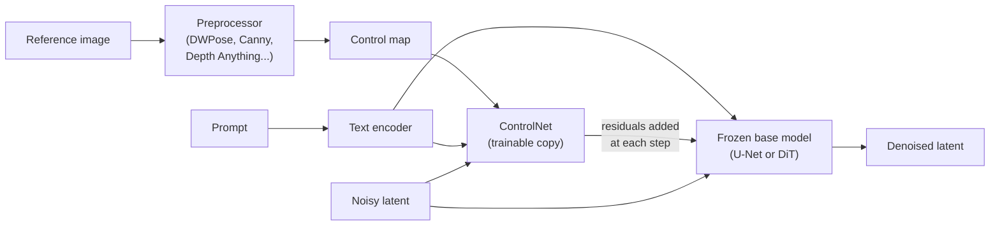
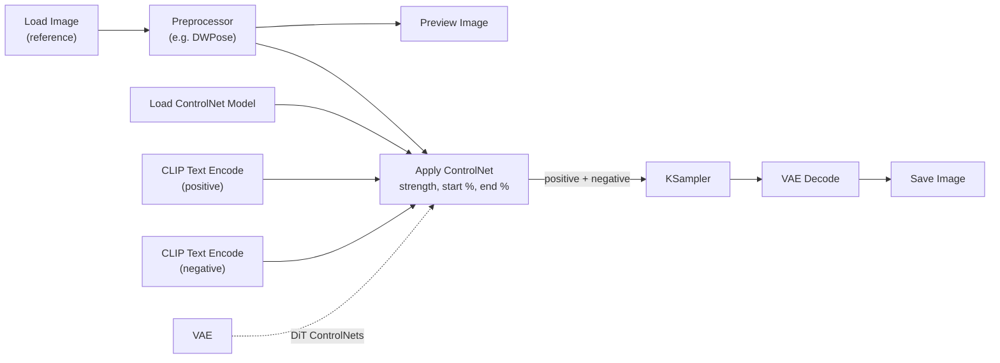
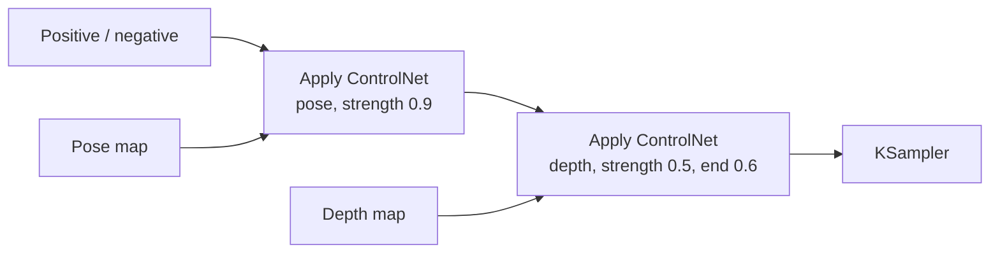

# ControlNet

**ControlNet** is a method for adding spatial conditioning (a pose skeleton, edge map, depth map, segmentation map, and so on) to a pretrained text-to-image diffusion model without retraining or degrading it. It was introduced by Lvmin Zhang, Anyi Rao and Maneesh Agrawala in *Adding Conditional Control to Text-to-Image Diffusion Models* (2023). The prompt still decides *what* is drawn; the control map decides *where* it goes. This page covers the architecture, the common control types and their preprocessors, which ControlNets exist for each base-model family, how to wire and tune them in ComfyUI and diffusers, how ControlNet relates to adapters and instruction-editing models, and how to diagnose bad results.

## How ControlNet Works

A ControlNet workflow has two independent stages:

1. A **preprocessor** (annotator) analyses a reference image once and produces a **control map**: an OpenPose skeleton, a Canny edge image, a depth map, etc. This is ordinary computer vision and has nothing to do with the diffusion model.
2. A **ControlNet model** reads that map and nudges the diffusion model's internal features at every denoising step so the output follows the map's structure.



Because the ControlNet only ever sees the map, the map is the interface: any depth map (estimated, rendered from a 3D scene, or painted by hand) works with any depth ControlNet for the right base model, and a misdetected pose can be fixed by editing the skeleton rather than re-running the preprocessor.

### Architecture: Locked Copy, Trainable Copy, Zero Convolutions

For a U-Net, ControlNet clones the **encoder** blocks and middle block. The original weights are **locked** (frozen); the clone is **trainable** and receives the control map (embedded by a small convolutional network) added to its input. The clone's outputs are added back into the frozen U-Net's skip connections through **zero convolutions**: 1x1 convolutions whose weights and biases are initialised to zero.

For one block $\mathcal{F}(\cdot\,; \Theta)$ with input feature $x$ and condition $c$, the paper writes the controlled output as

$$
y_c = \mathcal{F}(x; \Theta) + \mathcal{Z}\big(\mathcal{F}(x + \mathcal{Z}(c; \Theta_{z1}); \Theta_c); \Theta_{z2}\big),
$$

where $\Theta$ are the frozen weights, $\Theta_c$ the trainable copy, and $\mathcal{Z}$ the zero convolutions with parameters $\Theta_{z1}, \Theta_{z2}$. At initialisation both $\mathcal{Z}$ terms output zero, so $y_c = \mathcal{F}(x; \Theta)$ and the combined model is exactly the original. Gradients into the zero-convolution weights are non-zero (they depend on the input features), so the control pathway grows from nothing during training. This gives three practical properties:

- **No damage to the base model.** Its weights never change, so disconnecting the ControlNet restores the original behaviour exactly.
- **Data efficiency.** Training starts from a strong copy of the base encoder rather than random weights; the original paper trained useful controls on datasets from under 50k to a few million pairs.
- **Family lock-in.** The trainable copy mirrors one specific network, so a ControlNet only fits the architecture it was cloned from. An SD 1.5 ControlNet cannot drive SDXL, and neither drives FLUX.

For DiT models (SD3, FLUX, Qwen-Image, Z-Image) the same idea is applied to a subset of transformer blocks: a few blocks are copied, fed the control tokens, and their outputs are added to the corresponding hidden states of the frozen transformer. InstantX's Qwen-Image Union ControlNet, for example, copies 5 double-stream blocks.

A later paper, *ControlNet++* (Li et al., 2024), improved adherence by adding a cycle-consistency loss that re-extracts the condition from the generated image and penalises mismatch. (Not to be confused with xinsir's SDXL union model, whose repository is also named "ControlNet++".)

## Control Types and Preprocessors

Pick a control type by what you want to *preserve* from the reference.

| Preserve | Control type | Preprocessor (comfyui_controlnet_aux) | Typical strength |
|----------|-------------|---------------------------------------|------------------|
| Body pose, hands, face orientation | OpenPose | `DWPreprocessor` (DWPose) | 0.8-1.0 |
| Exact outlines | Canny | `CannyEdgePreprocessor` | 0.6-0.9 |
| Soft shapes, loose outlines | SoftEdge / HED | `HEDPreprocessor`, `PiDiNetPreprocessor` | 0.5-0.8 |
| Clean line art (illustration, manga) | Lineart | `LineArtPreprocessor`, `AnimeLineArtPreprocessor` | 0.7-1.0 |
| 3D layout, foreground/background | Depth | `DepthAnythingV2Preprocessor`, `Zoe-DepthMapPreprocessor` | 0.5-0.8 |
| Straight architectural lines | MLSD | `M-LSDPreprocessor` | 0.7-1.0 |
| A rough sketch | Scribble | `ScribblePreprocessor` or a hand-drawn map | 0.6-0.9 |
| Which object class is where | Segmentation | `OneFormer-ADE20K-SemSegPreprocessor` | 0.5-0.8 |
| Surface orientation | Normal | `BAE-NormalMapPreprocessor` | 0.5-0.8 |
| Structure during upscaling | Tile / Blur | none (downscaled or blurred image) | 0.4-1.0 |
| Tonal layout / recolouring | Gray / Recolor | grayscale conversion | 0.7-0.9 |

If unsure, **Depth** is the most forgiving (it fixes layout without locking outlines) and **Canny** the most literal. Preview every control map before sampling; most failures are visible in the map itself.

### Pose

DWPose (2023) is the default pose estimator: it detects body, hand and face keypoints more reliably than the original OpenPose models and handles partial occlusion better. Pose constrains posture only, not silhouette or clothing. For hands, use a full-body-plus-hands output; a missing hand in the skeleton usually produces a malformed hand in the image. Animal pose estimators exist for quadrupeds.

### Edges and Lines

The edge family differs in how literally lines are enforced. **Canny** is a classic gradient-based detector with two thresholds: pixels above the high threshold are edges, pixels between the thresholds count only if connected to a strong edge. Lower thresholds keep more (fainter) edges and more texture noise. **SoftEdge/HED** gives thick, soft boundaries that tolerate painterly inputs; **Lineart** extracts clean strokes; **MLSD** keeps only straight line segments (buildings, interiors); **Scribble** accepts crude hand drawings.

### Depth

Depth maps encode distance as brightness (near is bright). **Depth Anything V2** (2024) is the usual default: fast, robust and sharp at object boundaries. MiDaS and LeReS are older relative-depth estimators; ZoeDepth estimates metric depth. Depth maps rendered directly from a 3D scene (Blender, a game engine) are cleaner than any estimator and are the standard trick for turning greybox scenes into concept art.

### Segmentation and Normals

Segmentation ControlNets for SD 1.5 were trained on ADE20K's 150-class palette, where each class has a fixed RGB colour. Painting blocks in those colours lays out a scene directly ("sky here, building there"). Normal maps encode surface orientation as RGB and help keep lighting and relief consistent on products and sculpture.

### Utility Controls

- **Tile** (SD 1.5, SDXL) and **Blur** (SD 3.5 Large) condition on a low-resolution or blurred version of the image itself. Used per tile during upscaling, they let the model invent detail while keeping each tile faithful to the original, which is the basis of tiled-upscale workflows.
- **Inpaint** ControlNets condition on the image with the masked region blanked, improving blending when a dedicated inpainting checkpoint is not available. See [Inpainting & Editing](inpainting-editing.html).
- **QR / pattern** ControlNets (community models built on the brightness idea) embed a scannable code or a hidden shape into an image.

## Model Support by Family

A ControlNet must match the base model's family. Maturity varies widely.

| Base family | Notable ControlNets | Notes |
|-------------|--------------------|-------|
| SD 1.5 | lllyasviel ControlNet v1.1 (14 models: canny, depth, openpose, lineart, anime lineart, softedge, mlsd, scribble, seg, normalbae, tile, inpaint, shuffle, ip2p) | The most complete set; still useful for quick experiments |
| SDXL | xinsir `controlnet-union-sdxl-1.0` (ProMax variant adds tile, inpaint and outpaint), xinsir single-type models, diffusers canny/depth | Union ProMax is the usual single download |
| SD 3.5 Large | Stability AI Blur, Canny, Depth (Nov 2024) | Stability AI Community License; depth trained on DepthFM maps |
| FLUX.1 [dev] | BFL **FLUX.1 Canny [dev]** and **Depth [dev]** (full models, or LoRAs applied to dev); Shakker Labs **Union Pro 2.0** (canny, soft edge, depth, pose, gray); XLabs and InstantX models | BFL's versions are separate checkpoints rather than add-on ControlNets |
| Qwen-Image | InstantX **Qwen-Image-ControlNet-Union** (canny, soft edge, depth, pose); DiffSynth "model patch" controls | Native ComfyUI support |
| Z-Image Turbo | Alibaba PAI **Z-Image-Turbo-Fun-Controlnet-Union** (canny, HED, depth, pose, MLSD) | v2.1 re-distilled to 8 steps so control does not cost the turbo speed-up |

Union models bundle several control types into one network that recognises the condition type from the map itself (or from a type input), replacing a folder of one-model-per-type files.

## Workflows

### ComfyUI

Preprocessors come from the `comfyui_controlnet_aux` custom node pack (installable from ComfyUI-Manager); ControlNet weights go in `models/controlnet/`.

```bash
# Preprocessor nodes
cd ComfyUI/custom_nodes
git clone https://github.com/Fannovel16/comfyui_controlnet_aux.git
pip install -r comfyui_controlnet_aux/requirements.txt

# Example ControlNet weights (hf CLI from huggingface_hub)
cd ../models/controlnet
hf download xinsir/controlnet-union-sdxl-1.0 diffusion_pytorch_model_promax.safetensors --local-dir sdxl-union
hf download comfyanonymous/ControlNet-v1-1_fp16_safetensors control_v11p_sd15_openpose_fp16.safetensors --local-dir .
```

The graph inserts one node between the text encoders and the sampler:



`Apply ControlNet` modifies both positive and negative conditioning and outputs the pair to the sampler. The optional `vae` input is needed by ControlNets for SD3/FLUX-class models, which encode the control image into latent space. Union models that need an explicit type take it through a `SetUnionControlNetType` node between the loader and `Apply ControlNet`.

To stack controls, chain `Apply ControlNet` nodes: the conditioning output of the first feeds the second.



### diffusers

```python
import cv2
import numpy as np
import torch
from diffusers import ControlNetModel, StableDiffusionXLControlNetPipeline
from diffusers.utils import load_image
from PIL import Image

controlnet = ControlNetModel.from_pretrained(
    "diffusers/controlnet-canny-sdxl-1.0", torch_dtype=torch.float16
)
pipe = StableDiffusionXLControlNetPipeline.from_pretrained(
    "stabilityai/stable-diffusion-xl-base-1.0",
    controlnet=controlnet,
    torch_dtype=torch.float16,
)
pipe.enable_model_cpu_offload()

ref = np.array(load_image("reference.png").resize((1024, 1024)))
edges = cv2.Canny(ref, 100, 200)
control = Image.fromarray(np.stack([edges] * 3, axis=-1))

image = pipe(
    prompt="a glass-and-steel pavilion at golden hour, architectural photography",
    image=control,
    controlnet_conditioning_scale=0.7,   # strength
    control_guidance_start=0.0,          # start_percent
    control_guidance_end=0.8,            # end_percent
    num_inference_steps=30,
).images[0]
```

Multiple ControlNets are passed as lists (`controlnet=[cn_a, cn_b]`, `image=[map_a, map_b]`, `controlnet_conditioning_scale=[0.9, 0.5]`). FLUX uses `FluxControlNetPipeline` for community ControlNets and `FluxControlPipeline` for BFL's Canny/Depth models.

## Tuning

### Parameters

| Parameter (ComfyUI / diffusers) | Range | Effect |
|---------------------------------|-------|--------|
| `strength` / `controlnet_conditioning_scale` | 0-2, usually 0.5-1.0 | Scales the residuals the ControlNet adds |
| `start_percent` / `control_guidance_start` | 0-1 | Fraction of sampling at which control starts (usually 0) |
| `end_percent` / `control_guidance_end` | 0-1 | Fraction at which control stops |
| Control mode (A1111/Forge only) | Balanced / My prompt is more important / ControlNet is more important | Re-weights control against CFG; ComfyUI has no equivalent switch |

The control window matters as much as strength. Early steps fix composition, late steps add texture. Ending control at 0.6-0.8 locks the layout and then lets the model add detail the map never specified; this is usually the fix for images that look traced or stiff. Starting control late (0.1-0.2) gives the model freedom over the silhouette while still steering the arrangement.

### Worked Example: Transferring a Pose

Goal: a knight in armour standing in the same pose as a reference photo, on SDXL.

1. Run `DWPreprocessor` on the reference at 1024 px and preview the skeleton. Confirm both hands were detected.
2. Prompt for content and style only: *"a knight in ornate steel armour, dramatic studio lighting, photorealistic"*. The prompt should not fight the pose (for example by asking for "sitting").
3. Load an SDXL OpenPose or union model and set `strength 0.85`, `start 0.0`, `end 0.8`.
4. Sample normally (DPM++ 2M Karras, 30 steps, CFG 5-6).

If the pose drifts, raise strength toward 1.0 or extend `end_percent`. If the armour looks flat or stencilled, lower strength or pull `end_percent` down to 0.6.

### Combining Controls and Adapters

Two controls cooperate when each owns a different job. Give the primary control full strength and the secondary a supporting weight; if the result looks muddy, lower the secondary first.

| Combination | Roles | Suggested strengths |
|-------------|-------|---------------------|
| Pose + Depth | Pose owns posture; depth grounds the scene | 0.9 / 0.5 |
| Canny + Segmentation | Edges own outlines; segmentation owns region content | 0.8 / 0.6 |
| Depth + SoftEdge | Depth owns layout; soft edges add gentle shape | 0.7 / 0.4 |

Three or more ControlNets usually conflict. A more reliable stack conditions on different *kinds* of information: ControlNet for structure, IP-Adapter for appearance, a LoRA for a specific subject.

## Related Methods

ControlNet is the most precise spatial conditioner, but not always the right tool.

| Method | Conditions on | Trade-off | Typical use |
|--------|---------------|-----------|-------------|
| ControlNet | Spatial map (pose, edge, depth...) | Highest structural precision; adds a large second network | Exact composition |
| T2I-Adapter | Same map types | ~77M parameters vs ~360M (SD 1.5) to ~1.2B (SDXL) for a ControlNet; runs once rather than every step; looser | Batch or low-VRAM control |
| Control-LoRA / FLUX Canny-Depth LoRAs | Spatial map, via low-rank weights | Much smaller files, slightly weaker | Distribution-friendly control |
| IP-Adapter / FLUX Redux | A reference image's appearance | Transfers look, not layout | "Make it look like this" |
| InstantID, PuLID | A reference face | Identity preservation from one photo | Consistent characters |
| Instruction editing (FLUX.1 Kontext, Qwen-Image-Edit, FLUX.2 multi-reference) | Input image(s) + text instruction | No map needed; less exact geometry control | "Same scene, but..." edits, pose or view changes described in words |

Instruction-editing models have absorbed many jobs that used to require ControlNet plus inpainting (relighting, changing a character's outfit, turning a subject), and some accept a pose or depth image as one of their references. ControlNet remains the tool when geometry must match a map exactly: architecture from line drawings, depth-accurate renders of 3D scenes, animation where every frame must follow a skeleton.

## Troubleshooting

| Symptom | Likely cause | Fix |
|---------|--------------|-----|
| Control has no effect, or output is corrupted | ControlNet from a different base family; missing `vae` input on a DiT ControlNet | Match the family; connect the VAE |
| Preprocessor misses the subject | Low contrast, small subject, wrong detector | Crop or upscale the reference; switch detector (DWPose, SoftEdge); hand-edit the map |
| Result looks traced, flat or stiff | Strength too high or control held to the end | Strength 0.6-0.7, `end_percent` 0.6-0.8 |
| Hard halos and artifacts along edges | Canny on a soft or noisy subject | Use SoftEdge/Lineart, raise Canny thresholds, or blur the map slightly |
| Structure offset or distorted | Control map aspect ratio or resolution differs from the latent | Preprocess at the generation resolution and aspect ratio |
| Pose correct, anatomy wrong | Hands or face missing from skeleton | Use a full-body + hands detector; fix limbs in a pose editor |
| Stacked controls muddy | Controls competing | Lower the secondary control, or end it earlier |
| Out of memory | Extra network per control | Use a union model, fp16/fp8 weights, T2I-Adapter, or offload; run preprocessors on CPU |

For video, per-frame ControlNet flickers because each frame's map and noise are independent. Temporal models (AnimateDiff for SD 1.5/SDXL, and control-capable video models such as Wan's VACE variants) handle consistency better; see [Output Formats](output-formats.html).

## See Also

- [Stable Diffusion Fundamentals](stable-diffusion-fundamentals.html) - The base generation process
- [ComfyUI Guide](comfyui-guide.html) - Node-graph mechanics
- [Inpainting & Editing](inpainting-editing.html) - Masks, inpaint ControlNets and instruction editing
- [FLUX Guide](flux-guide.html) - FLUX.1 Canny/Depth, Kontext and FLUX.2 references
- [SDXL Guide](sdxl-guide.html) - The family with the broadest modern ControlNet support
- [LoRA Training](lora-training.html) - Subject and style LoRAs to pair with control
- [Advanced Techniques](advanced-techniques.html) - Regional prompting and multi-control patterns
- [Model Types](model-types.html) - Where ControlNets sit among checkpoints, LoRAs and adapters
- [AI/ML Documentation Hub](./) - Complete AI/ML documentation index
