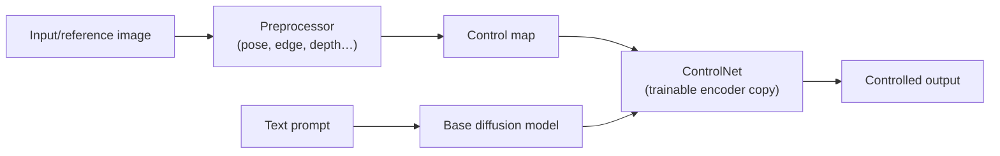
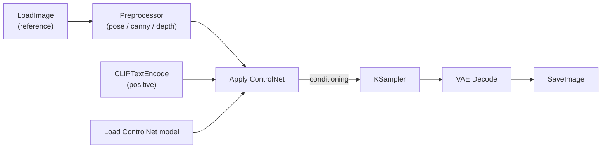
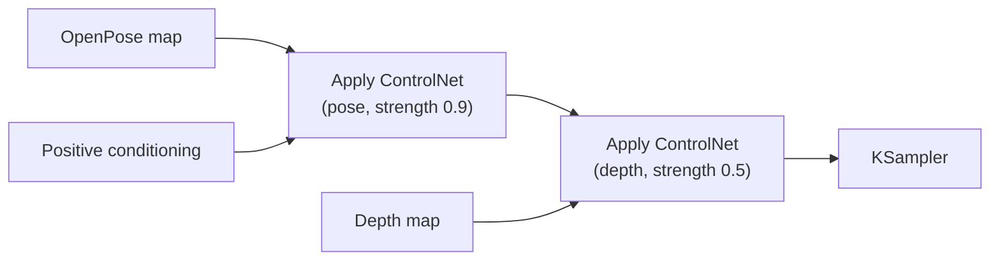

<div class="hero-section" style="background: linear-gradient(135deg, #667eea 0%, #764ba2 100%); color: white; padding: 3rem 2rem; margin: -2rem -3rem 2rem -3rem; text-align: center;">
  <h1 style="color: white; margin: 0; font-size: 2.5rem;">ControlNet Guide</h1>
  <p style="font-size: 1.25rem; margin-top: 1rem; opacity: 0.9;">Master ControlNet for precise control over AI image generation using poses, edges, depth, and more.</p>
</div>

<div class="code-example" markdown="1">
Stop fighting the prompt for composition. ControlNet lets you *show* the model the pose, edges, or depth you want and have it follow that structure exactly while the prompt handles content and style.
</div>

## Why Use ControlNet?

Prompts are great at describing *what* to generate but poor at controlling *where* things go. ControlNet closes that gap by conditioning generation on a structural reference. Understanding it unlocks several practical wins:

- **Reliable composition** - Reproduce a specific pose, layout, or perspective instead of rerolling seeds
- **Sketch-to-image** - Turn rough drawings or line art into finished renders
- **Consistency** - Hold a character's pose or a scene's geometry steady across many generations
- **Style-preserving structure** - Restyle a photo while keeping its shapes and depth intact

<div class="key-insights">
  <div class="insight-card">
    <i class="fas fa-vector-square"></i>
    <h4>Control Maps</h4>
    <p>A preprocessor turns your reference into a pose skeleton, edge map, or depth gradient that steers every denoising step.</p>
  </div>
  <div class="insight-card">
    <i class="fas fa-sliders-h"></i>
    <h4>Strength Is a Dial</h4>
    <p>Tune control influence (and when it applies) so structure guides the result without overriding the prompt.</p>
  </div>
  <div class="insight-card">
    <i class="fas fa-layer-group"></i>
    <h4>Composable</h4>
    <p>Combine with IP-Adapter for style and LoRAs for subjects — but stacking many ControlNets rarely helps.</p>
  </div>
</div>

## What is ControlNet?

ControlNet is a neural network architecture that adds spatial control to diffusion models. It allows you to guide image generation using various types of conditioning inputs like human poses, edge maps, depth maps, and more, while maintaining the quality and capabilities of the base model.

As of 2024, ControlNet has evolved significantly with new control types, better preprocessing, and support for newer models. The ecosystem now includes alternatives like T2I-Adapter, IP-Adapter, and InstantID that offer different trade-offs between control precision and flexibility.

### How ControlNet Works



ControlNet creates a trainable copy of the diffusion model's encoder blocks, which learns to respond to specific spatial conditions while preserving the original model's generation capabilities. The preprocessor extracts a structural "control map" (a stick-figure pose, an edge outline, a depth gradient) from your reference image; ControlNet then injects that structure into every denoising step.

The split between *preprocessor* and *model* is the key idea: the preprocessor is a one-time analysis pass that turns your reference into a control map, and the ControlNet model is what conditions generation on that map. The same depth map can feed any depth ControlNet, and you can hand-author or edit a control map directly when a preprocessor gets it wrong.

#### Why ControlNet Doesn't Break the Base Model: Zero Convolutions

The reason you can add ControlNet to a model without retraining or degrading it is a design detail called **zero convolutions**. ControlNet clones the encoder half of the frozen base model and connects that clone back into the original network through 1x1 convolution layers whose weights start at zero. At the very first training step those zero-initialized layers output nothing, so the combined network is *identical* to the original - then they gradually learn to inject the control signal.

This gives two practical guarantees:

- **No catastrophic forgetting.** The base model's weights are frozen; only the trainable copy and the zero-convs learn. The model never "unlearns" what it already knew.
- **Graceful start.** Training begins from a perfect copy of the base model rather than from noise, so even small datasets produce usable controls.

This is also why a ControlNet is bound to its base family: the trainable copy mirrors that specific U-Net (or DiT), so its connection points only line up with a model of the same architecture.

## Control Types at a Glance

Most workflows only need one control type. Pick it by what you want to preserve from the reference, not by what the reference *is*:

| You want to preserve... | Use | Preprocessor | Typical strength |
|-------------------------|-----|--------------|------------------|
| A character's pose | OpenPose / DWPose | `dw_openpose_full` | 0.8-1.0 |
| Exact edges and outlines | Canny | `canny` | 0.7-1.0 |
| Soft/organic shapes | SoftEdge | `hed` / `pidinet` | 0.5-0.8 |
| 3D spatial layout / depth | Depth | `depth_anything` / `zoe` | 0.5-0.8 |
| Straight architectural lines | MLSD | `mlsd` | 0.7-1.0 |
| A rough sketch → finished art | Scribble | `scribble` | 0.6-0.9 |
| Per-region scene semantics | Segmentation | `seg_ofade20k` | 0.5-0.8 |
| Structure during upscaling | Tile | `tile_resample` | 0.5-1.0 |

If you are unsure, **Depth** is the most forgiving general-purpose control (it constrains layout without locking in exact lines), and **Canny** is the most precise.

### A Worked Example: Posing a Character

Suppose you have a reference photo of someone standing with arms crossed, and you want a knight in armor in that exact pose. The end-to-end flow with concrete settings:

1. **Preprocess** the reference with `dw_openpose_full` at 1024px (SDXL). You now have a stick-figure skeleton - preview it and confirm the limbs are detected correctly.
2. **Prompt** for content and style only: `"a knight in ornate steel armor, dramatic studio lighting, photorealistic"`. Notice the prompt says nothing about pose - the control map handles that.
3. **Apply** an SDXL OpenPose ControlNet with `strength: 0.85`, `start_percent: 0.0`, `end_percent: 0.8`.
4. **Sample** normally (e.g. DPM++ 2M, 30 steps, CFG 6).

The result is a knight standing with arms crossed. Ending control at 80% (`end_percent: 0.8`) lets the final steps add armor detail the skeleton never specified. If the pose drifts, raise strength toward 1.0; if the armor looks stiff or traced, lower strength or pull `end_percent` down to 0.6.

## ControlNet Types in Depth

Each control type pairs a **preprocessor** (which extracts a specific structure from your reference) with a **ControlNet model** (which conditions on that structure). The sections below group them by what they capture. You rarely need more than one or two.

### Pose Control

Pose controls extract a human skeleton from a reference and transfer it to your generated subject — the workhorse for character work.

| Preprocessor | What it captures | Notes |
|--------------|------------------|-------|
| OpenPose | 18-25 body keypoints; optional hands and face | The original standard; variants are `openpose_body`, `openpose_full`, `openpose_hand`, `openpose_face` |
| DWPose | Whole-body skeleton including detailed hands/face | More accurate than OpenPose with better occlusion handling; the current recommended default |
| Animal OpenPose | Quadruped skeletons | For animals rather than humans |

Pose is keypoint-based, so it constrains *posture* but not silhouette or clothing — leave those to the prompt. If hands come out malformed, prefer a `full`/DWPose variant so the hand keypoints are detected and conditioned.

### Edge and Line Control

Edge controls preserve outlines and structure. They differ mainly in how *literal* the lines are — hard binary edges versus soft, artistic ones.

| Preprocessor | Edge style | Best for |
|--------------|-----------|----------|
| Canny | Hard binary edges from a classic algorithm | Architecture, products, anything with clean outlines |
| SoftEdge (HED / PiDiNet) | Soft, natural edges | Organic subjects, artistic restyles where hard lines look traced |
| MLSD | Straight lines only | Buildings, interiors, technical drawings |
| Lineart / Anime Lineart | Clean extracted line art | Coloring/restyling line drawings, manga |
| Scribble | Tolerant of rough, sketchy input | Turning a quick doodle into finished art |

Canny exposes low/high thresholds: a lower **low threshold** keeps more (fainter) edges, a higher **high threshold** keeps only the strongest. The practical rule is to pick by how literal you want the structure — Canny for "trace this exactly," SoftEdge for "follow these shapes loosely," Scribble for "use this as a hint."

### Depth Control

Depth controls capture the 3D layout of a scene as a grayscale map (near = bright, far = dark), constraining spatial arrangement without locking exact outlines. This makes depth the most forgiving general-purpose control.

| Preprocessor | Type | Notes |
|--------------|------|-------|
| Depth Anything (v1/v2) | Relative depth | Current default — fast, robust, trained on a very large dataset; good for batch and video |
| MiDaS | Relative depth | The long-standing baseline; still fine for general use |
| ZoeDepth | Metric depth | Estimates actual distances; better for realistic outdoor scenes |
| LeReS | Relative depth | Higher quality on complex scenes, slower |

Start with **Depth Anything**. Depth pairs especially well with a second control (e.g. OpenPose) because it adds spatial grounding without fighting the pose.

### Semantic and Surface Control

These conditions describe *what* occupies each region or *how surfaces face*, rather than edges or skeletons.

| Preprocessor | Captures | Best for |
|--------------|----------|----------|
| Segmentation (ADE20K) | A color-coded map of 150+ object classes | Laying out scenes ("sky here, building there") |
| Normal map | Surface orientation as RGB-encoded normals | Lighting/relief consistency on products and sculptures |

With segmentation you can hand-paint the control map directly: each class has a fixed color (sky, building, tree, person, ground, etc.), so painting blocks of those colors dictates where each kind of object appears.

### Utility Controls

A few controls solve specific production problems rather than transferring structure from a reference:

| Control | Purpose |
|---------|---------|
| Tile | Adds coherent detail during upscaling and enables seamless tiled generation — the backbone of high-res "Ultimate SD Upscale" workflows |
| Inpaint | Restricts generation to a masked region for clean object removal or editing |
| Shuffle | Reshuffles content spatially while preserving style — for creative variations |

## Installation and Setup

### ComfyUI Installation

```bash
# Install ControlNet models
cd ComfyUI/models/controlnet

# Download models (example for SD 1.5)
wget https://huggingface.co/lllyasviel/ControlNet-v1-1/resolve/main/control_v11p_sd15_openpose.pth
wget https://huggingface.co/lllyasviel/ControlNet-v1-1/resolve/main/control_v11f1p_sd15_depth.pth

# For SDXL ControlNet
wget https://huggingface.co/diffusers/controlnet-canny-sdxl-1.0/resolve/main/diffusion_pytorch_model.fp16.safetensors

# Install preprocessor nodes
cd ../../custom_nodes
git clone https://github.com/Fannovel16/comfyui_controlnet_aux.git
```

### Required Components

You need three things to run ControlNet, plus optional extras:

- **Preprocessor nodes** — `comfyui_controlnet_aux` provides the OpenPose, Canny, Depth, and other extractors.
- **ControlNet model(s)** — one per control type, matched to your base-model family.
- **A base diffusion model** — your SD 1.5, SDXL, or FLUX checkpoint.

Optionally, add custom preprocessors or additional ControlNet models as your workflows grow.

## Basic Workflows

### The Single-ControlNet Graph

A ControlNet workflow extends the standard text-to-image graph by inserting one node between the text conditioning and the sampler. The control map flows in alongside the prompt:



Everything before `Apply ControlNet` is the new branch; everything after is the ordinary sampler-to-image path. **Preview the preprocessor output** before sampling — most pose, edge, and depth failures are visible in the control map itself.

### Stacking Two Controls

To combine controls (for example, a pose plus its scene depth), chain the `Apply ControlNet` nodes — the conditioning flows through each in turn:



Keep the *secondary* control weaker than the primary so they cooperate rather than fight. Two is plenty; three or more usually conflict.

### The Parameters That Matter

Every `Apply ControlNet` node exposes the same handful of dials:

| Parameter | Range | What it does |
|-----------|-------|--------------|
| `strength` | 0-2 (use ~0.6-1.0) | How hard the control map pushes the result toward its structure |
| `start_percent` | 0.0-1.0 | Fraction of sampling at which control begins (usually 0.0) |
| `end_percent` | 0.0-1.0 | Fraction at which control stops (lower it to free up late detail) |
| `control_mode` | balanced / prompt / control | Whether to favor the prompt or the control map when they disagree |

The two most useful beyond `strength` are `start_percent` and `end_percent`. Because early denoising steps fix composition and later steps fill in detail, ending control early (e.g. `end_percent: 0.7`) lets the structure lock in the layout, then frees the model to add detail the control map never specified — often the difference between a rigid, traced-looking image and a natural one.

<div class="tip-card" markdown="1">
**Common pitfalls**

- **Mismatched ControlNet and base model.** An SD 1.5 ControlNet silently fails or corrupts output on SDXL/FLUX. Match the family first.
- **Strength pinned at 1.0.** Full strength makes results look traced and fights the prompt. Start around 0.7 and raise only if structure drifts.
- **Wrong preprocessor for the input.** Running Canny on a soft watercolor produces noisy edges; use SoftEdge. Always preview the control map before sampling.
- **Control resolution mismatch.** Preprocess at the model's native resolution (512 for SD 1.5, 1024 for SDXL) or the map misaligns with the latent.
- **Stacking too many controls.** Three or more ControlNets usually conflict and degrade quality. Prefer one strong control plus IP-Adapter for style.
</div>

## Advanced Techniques

### Combining Controls Deliberately

Two controls work best when each owns a different job. Give the *primary* control (the one carrying your main intent) full strength and the *secondary* one a supporting weight:

| Combination | Roles | Suggested strengths |
|-------------|-------|---------------------|
| Pose + Depth | Pose owns posture; depth grounds spatial layout | OpenPose ~0.9, Depth ~0.5 |
| Canny + Segmentation | Edges own outlines; segmentation owns region content | Canny ~0.8, Seg ~0.6 |
| Depth + SoftEdge | Depth owns 3D layout; soft edges add gentle shape | Depth ~0.7, SoftEdge ~0.4 |

If a stacked result looks muddy, lower the secondary control before touching the primary one.

### Strength Scheduling with `end_percent`

You do not need per-step strength curves — the built-in `start_percent`/`end_percent` window is the practical version of scheduling. Holding control through the first ~70% of steps locks composition, then releasing it lets the model add detail freely. Reach for an early `end_percent` (0.5-0.7) whenever a result looks traced or stiff.

### Control Mode Selection

When the prompt and the control map disagree, `control_mode` decides who wins:

| Mode | Behavior | Use case |
|------|----------|----------|
| Balanced | Weighs prompt and control roughly equally | General use (default) |
| Prompt (My prompt is more important) | Lets the prompt override structure when they conflict | Creative freedom, looser adherence |
| Control (ControlNet is more important) | Enforces the structure even against the prompt | Exact composition matching |

### Resolution Matching

Always preprocess at your base model's native resolution — **512 for SD 1.5, 1024 for SDXL/FLUX** — so the control map aligns with the latent grid. A mismatch shifts the structure relative to the image and is one of the most common causes of "the pose is slightly off."

## Preprocessing Best Practices

The control map is only as good as the preprocessor that made it. Two habits prevent most problems: **preview every control map** before sampling, and **match the preprocessor to the input**, not just to the control type you want.

| Input quality | Recommended choice |
|---------------|--------------------|
| Clean photo | Standard preprocessor for the type (Canny, OpenPose, Depth Anything) |
| Noisy or low-light | Robust variants — DWPose for pose, ZoeDepth/LeReS for depth |
| Artistic / painterly | Soft variants — SoftEdge (HED/PiDiNet) instead of Canny |
| Technical drawing | Precise variants — MLSD for straight lines |

You can also **author or edit a control map by hand**. Because the ControlNet only sees the map (not your reference), you can clean up a misdetected pose skeleton, paint a segmentation layout directly, or composite two maps together before sampling — often faster than rerolling preprocessor settings.

## Model Compatibility

A ControlNet is built for one base-model family and only works there. Support and maturity vary widely across families:

- **SD 1.5 ControlNet**: The most mature ecosystem — every control type, heavily optimized
- **SDXL ControlNet**: Full support at higher resolution and quality
- **SD3 ControlNet**: Available (Canny, Depth, and others released by Stability AI)
- **FLUX**: Available — multiple options now ship, including **ControlNet Union** (one model covering several control types) and dedicated Canny/Depth/Pose models from teams such as XLabs, InstantX, and Shakker Labs

Beyond the structural controls, the ecosystem has added more specialized conditions over time — for example **Recolor** (change colors while preserving structure), **Brightness/Illumination** (steer lighting), and **QR/pattern** controls that hide scannable codes or shapes inside artistic images. Availability differs by base model; the structural types above are the universally supported core.

### ControlNet Versions

ControlNets are tied to their base-model family. A control map is portable, but the ControlNet *model* is not — an SD 1.5 ControlNet will not load on SDXL or FLUX.

| Base Model | ControlNet Family | File Pattern |
|------------|-------------------|--------------|
| SD 1.5 | v1.1 (most complete) | `control_v11*_sd15_*.pth` |
| SD 2.1 | v1.1 SD2 | `control_v11*_sd21_*.pth` |
| SDXL | SDXL v1 / Union | `controlnet-*-sdxl-1.0*.safetensors` |
| SD3 | SD3 (Canny, Depth, ...) | `*controlnet*sd3*.safetensors` |
| FLUX | FLUX / Union | `*flux*controlnet*.safetensors` |

<div class="tip-card" markdown="1">
**Union models simplify the mess.** Newer "ControlNet Union" releases for SDXL and FLUX bundle many control types into a single model file, so you load one ControlNet and select the mode (pose, canny, depth, ...) at runtime instead of juggling a separate file per type.
</div>

### ControlNet vs. the Alternatives

ControlNet is the most precise spatial conditioner, but it is not always the right tool. Several lighter or differently-focused methods share the space:

| Method | Conditions on | Strength | Best for |
|--------|---------------|----------|----------|
| ControlNet | Structural map (pose, edge, depth) | Highest spatial precision | Reproducing exact composition |
| T2I-Adapter | Same map types, lighter | Fast, low VRAM, less precise | Real-time, batch, mobile |
| IP-Adapter | A *reference image's* style/content | Transfers look, not layout | "Make it look like this" |
| InstantID | A reference *face* | Identity-preserving portraits | Consistent faces from one photo |

A common pattern is to combine them: ControlNet for *where* (structure), IP-Adapter for *what it looks like* (style), and a LoRA for *who/what* (subject). They condition on different things, so they cooperate rather than conflict.

### T2I-Adapter

T2I-Adapter is a lighter alternative that conditions on the same kinds of maps (pose, edge, depth) but with a much smaller model. It trades a little precision for speed and low VRAM:

- **Advantages:** tiny model (~80 MB vs ~1.4 GB), faster inference, lower VRAM, several adapters combine cleanly — good for real-time and batch.
- **Trade-offs:** sometimes less precise than ControlNet, fewer available types, and may need more prompt help to lock the result.

Reach for T2I-Adapter when throughput or memory matters more than pixel-exact structure.

### IP-Adapter Integration

IP-Adapter and ControlNet condition on different things, so they layer naturally: ControlNet from a **depth map** fixes the 3D structure, while IP-Adapter from a **reference image** supplies the style and palette. The result is precise composition wearing the look of your reference — neither alone achieves both.

## Common Workflows

A few recurring jobs and the control setup each calls for:

| Goal | Reference | Preprocessor | Strength | Prompt handles |
|------|-----------|--------------|----------|----------------|
| Character in a chosen pose | Pose photo | OpenPose / DWPose | ~0.9 | Outfit, style, setting |
| Render from a floor plan / line drawing | Technical drawing | MLSD (straight lines) | ~1.0 | Materials, lighting, mood |
| Restyle a photo, keep composition | The photo | Depth (+ SoftEdge) | Depth ~0.7, SoftEdge ~0.5 | The new style |
| Sketch to finished art | Rough sketch | Scribble | ~0.7 | Subject details, finish |

For **character consistency across many images**, fix the seed and pair a character LoRA (subject) with a pose ControlNet (posture) — the LoRA keeps the identity stable while the control map varies the pose.

## Troubleshooting

Most ControlNet problems trace back to a bad control map or too-aggressive strength. Diagnose by previewing the map first, then adjust strength and the control window:

| Symptom | Likely cause | Fix |
|---------|--------------|-----|
| Preprocessor misses the subject (no skeleton/edges) | Low contrast, wrong preprocessor, low-res input | Raise contrast, switch to a robust variant (DWPose, SoftEdge), or hand-edit the map |
| Result looks traced or stiff | Strength too high, control runs too late | Lower `strength` toward 0.6, pull `end_percent` to ~0.7, optionally raise CFG |
| Harsh artifacts along edges | Canny on a soft/organic subject | Use SoftEdge instead, or lightly blur the control map |
| Structure is slightly misaligned | Control map resolution ≠ model resolution | Preprocess at 512 (SD 1.5) or 1024 (SDXL/FLUX) |
| Control silently does nothing / corrupts output | ControlNet built for a different base family | Use a ControlNet matching your checkpoint's family |

### Performance and VRAM

ControlNet adds a second pass over the encoder, so it costs memory and time. To keep it light: run the **preprocessor on CPU** (it is a one-time analysis pass and rarely the bottleneck), keep the **ControlNet model on GPU**, enable your tool's **low-VRAM / offload** mode so unused models leave VRAM, and prefer **T2I-Adapter** when you need many controls cheaply.

## Creative Applications

ControlNet's value compounds once you stop treating the control map as fixed:

- **Hybrid maps.** Because the model only sees the map, you can composite two sources — e.g. take depth from a photo and edges from a separate sketch, blend them, and feed the combination — to borrow structure from multiple references at once.
- **Restyle while preserving layout.** Run Depth (and optionally SoftEdge) on a photo, then prompt for a completely different style ("oil painting in the style of Van Gogh"). The scene's geometry survives while the look changes entirely.
- **Animation consistency.** For video, extract a control map per frame and blend each frame's map slightly toward the previous one, so the conditioning evolves smoothly instead of jumping — a simple but effective way to reduce flicker. See [Output Formats](output-formats.html) and [Advanced Techniques](advanced-techniques.html) for full temporal workflows.

## Best Practices

### Do

- Match control resolution to model resolution
- Use the appropriate preprocessor for the input type
- Experiment with strength values
- Combine multiple controls thoughtfully
- Save successful control maps for reuse

### Avoid

- Using 100% control strength by default
- Ignoring prompt importance
- Mixing incompatible model versions
- Expecting perfect results immediately
- Overstacking controls (3+ is rarely helpful)

## Where ControlNet Is Heading

A few directions are already shipping or clearly underway, rather than speculative:

- **Union models** that fold many control types into one file (SDXL and FLUX) are becoming the norm, replacing the old one-file-per-type sprawl.
- **Better, faster preprocessors** — Depth Anything for depth and DWPose for pose are recent examples — keep raising control-map quality, which matters more than new control types.
- **Temporal/video control** is maturing alongside video diffusion, addressing the frame-to-frame flicker that frame-by-frame ControlNet causes.
- **Optical-illusion and pattern controls** (hidden text, QR codes, spiral illusions) show how creatively the conditioning map can be repurposed.

The durable takeaway: invest in understanding the preprocessor-plus-model split and strength tuning, since those skills carry over to whatever control types arrive next.

## Conclusion

ControlNet transforms diffusion models from probabilistic generators into precision tools. By understanding the various control types and their optimal applications, you can achieve unprecedented control over AI image generation while maintaining the creative capabilities of the base models.

The key to mastery is experimentation: try different preprocessors, adjust strengths, and combine controls creatively. As the technology evolves, ControlNet continues to bridge the gap between artistic vision and AI capabilities.

## Key Takeaways

<div class="takeaway-card" markdown="1">
- **ControlNet adds spatial control** to diffusion by injecting a structural "control map" (pose, edge, depth, segmentation) into every denoising step.
- **The preprocessor matters as much as the model** — choose it to match your input (OpenPose for figures, Canny for edges, Depth for 3D structure).
- **Strength is a dial, not a switch.** Rarely use 100%; tune `strength` and pull `end_percent` back so structure guides the layout without overriding the prompt's detail.
- **Combine deliberately:** ControlNet for structure + IP-Adapter for style + a LoRA for subject — but stacking 3+ ControlNets rarely helps.
- **Match versions and resolution.** Use ControlNets built for your base family (SD1.5/SDXL/FLUX) and align control resolution with generation resolution.
</div>

---

<div class="see-also-card" markdown="1">
#### See Also

- [Stable Diffusion Fundamentals](stable-diffusion-fundamentals.html) - Understanding the base generation process
- [ComfyUI Guide](comfyui-guide.html) - Integrate ControlNet into advanced workflows
- [LoRA Training](lora-training.html) - Combine LoRAs with ControlNet for custom styles
- [Advanced Techniques](advanced-techniques.html) - Multi-control and expert patterns
- [Model Types](model-types.html) - ControlNet model types and compatibility
- [Base Models Comparison](base-models-comparison.html) - ControlNet support across models
- [AI/ML Documentation Hub](./) - Complete AI/ML documentation index
</div>