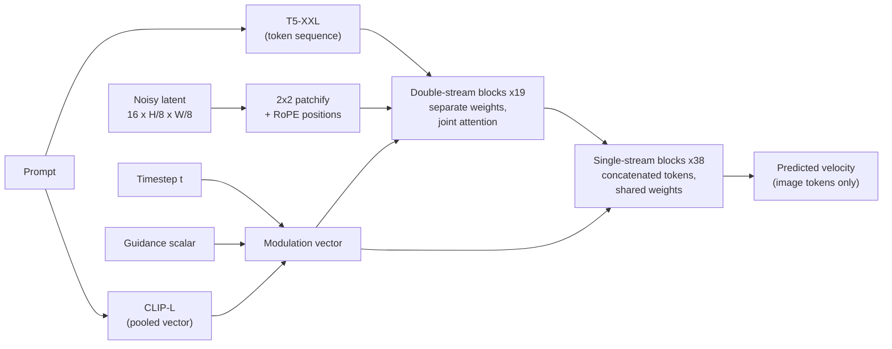
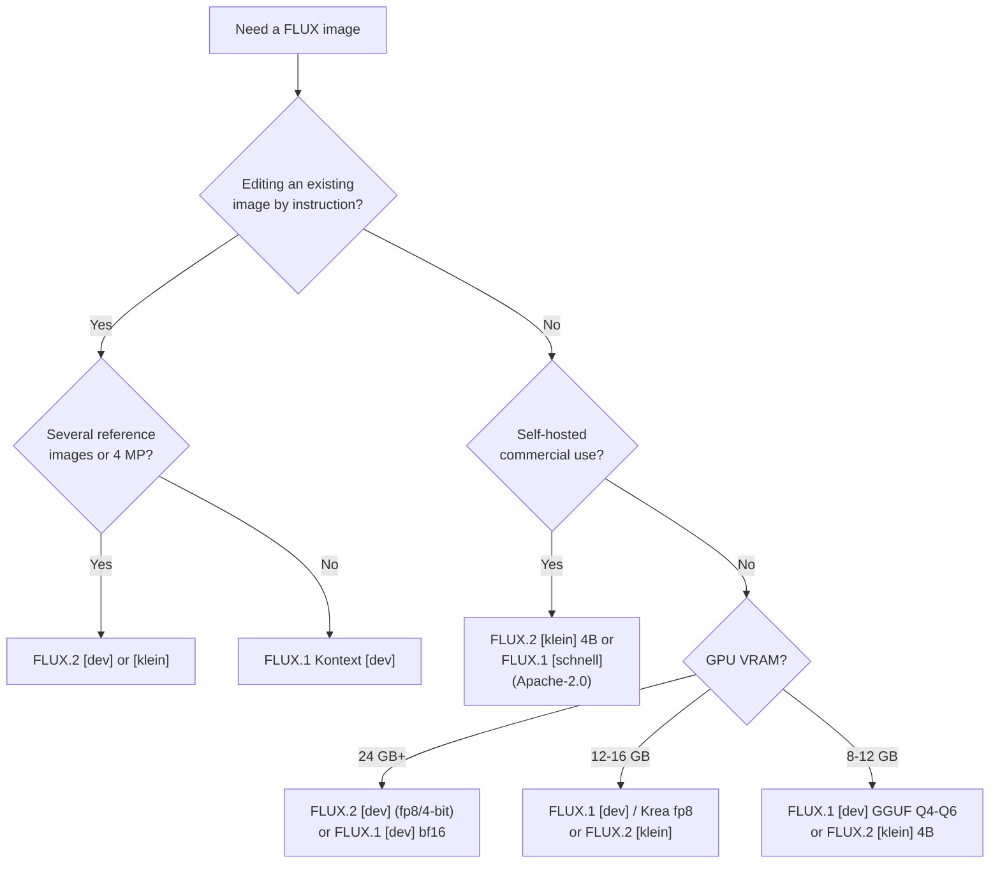
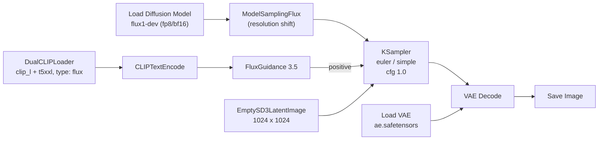

[AI/ML Documentation](./) &raquo; FLUX Guide

**FLUX** is a family of text-to-image and image-editing models from **Black Forest Labs (BFL)**, a Freiburg-based lab founded in 2024 by several of the original Stable Diffusion researchers. Every FLUX model is a **rectified-flow transformer**: a Diffusion Transformer (DiT) trained with flow matching instead of a U-Net trained to predict noise. This page covers the architecture, the two open-weight generations (FLUX.1, August 2024; FLUX.2, November 2025), how guidance distillation changes the settings you use, the variant and license matrix, and practical ComfyUI and diffusers workflows.

## Release History

FLUX has shipped in two open-weight generations plus a steady stream of specialised models. The table lists what is relevant to local use as of September 2026.

| Date | Release | Params | Weights / license | What it adds |
|------|---------|--------|-------------------|--------------|
| Aug 2024 | FLUX.1 [pro] | 12B | API only | Flagship text-to-image |
| Aug 2024 | FLUX.1 [dev] | 12B | Open, FLUX.1 Non-Commercial | Guidance-distilled from pro |
| Aug 2024 | FLUX.1 [schnell] | 12B | Open, Apache-2.0 | 1-4 step timestep-distilled model |
| Oct-Nov 2024 | FLUX1.1 [pro], Ultra and Raw modes | — | API only | Faster flagship; up to 4 MP (Ultra); candid photographic look (Raw) |
| Nov 2024 | FLUX.1 Tools: Fill, Canny, Depth, Redux | 12B | dev versions open, non-commercial | Inpaint/outpaint, structural conditioning, image variation |
| May-Jun 2025 | FLUX.1 Kontext [pro]/[max]/[dev] | 12B (dev) | dev open, non-commercial | Instruction-based, in-context image editing |
| Jul 2025 | FLUX.1 Krea [dev] | 12B | Open, non-commercial | Drop-in FLUX.1 [dev] replacement tuned with Krea AI for a less "AI-looking" aesthetic |
| Nov 2025 | FLUX.2 [pro]/[flex]/[dev], FLUX.2 VAE | 32B (dev) | dev open, non-commercial; VAE Apache-2.0 | Unified generation + multi-reference editing, 4 MP output, VLM text encoder |
| Jan 2026 | FLUX.2 [klein] 4B / 9B | 4B, 9B | 4B Apache-2.0; 9B non-commercial | Step-distilled small models, sub-second generation |
| Jul 2026 | FLUX 3 (announced) | — | Early access / partners only | Joint image, video and audio model |

**FLUX 3** was unveiled on 23 July 2026 as a single multimodal model trained jointly on images, video (up to 20 s with synchronised audio) and audio, with a robotics offshoot. At the time of writing it is in limited API/partner access; BFL has said an open-weight FLUX 3 [dev] is planned for later in 2026. Everything below concerns FLUX.1 and FLUX.2, which are what run locally today.

## Architecture

FLUX belongs to the transformer / flow-matching lineage (alongside SD3), not the U-Net lineage of SD 1.5 and SDXL. Instead of a convolutional encoder/decoder that reads the prompt through cross-attention, FLUX turns the latent image into a sequence of tokens and processes image and text tokens together in one transformer.

| Aspect | U-Net line (SD 1.5 / SDXL) | FLUX |
|--------|----------------------------|------|
| Backbone | Convolutional U-Net | Diffusion Transformer with double- and single-stream blocks |
| Text injection | Cross-attention from image to text | Joint attention over concatenated image and text tokens |
| Training objective | Noise ($\epsilon$) prediction | Velocity prediction (rectified flow) |
| Guidance at inference | Classifier-free guidance, scale ~5-9, two passes per step | Distilled guidance scalar, one pass per step |
| Positional encoding | Implicit in convolutions | Rotary embeddings (RoPE) on image tokens |

### FLUX.1 Specifications

| Property | FLUX.1 [dev] / [schnell] |
|----------|--------------------------|
| Transformer | ~12B parameters: 19 double-stream + 38 single-stream blocks |
| Text encoders | T5-XXL encoder (sequence length 512 for dev, 256 for schnell) + CLIP ViT-L/14 (pooled vector) |
| Autoencoder | 16-channel latent, 8x spatial downsampling; latents patchified 2x2 into tokens |
| Native resolution | ~1 megapixel; works from ~0.25 to ~2 MP at many aspect ratios |
| Transformer file size | ~23.8 GB (bf16), ~12 GB (fp8) |
| T5-XXL file size | ~9.5 GB (fp16), ~4.9 GB (fp8) |

### How a Forward Pass Is Organised



- **Double-stream blocks** keep text and image tokens in separate streams with their own weights but compute attention over both together, so each modality can read the other. This is the MM-DiT design from SD3 and is where most prompt-to-layout binding happens.
- **Single-stream blocks** concatenate the two token sets and process them with shared weights. They are cheaper per parameter and make up the bulk of the depth.
- **Modulation.** The timestep, the pooled CLIP vector and (in dev) the guidance value are embedded into one vector that scales and shifts the normalisation layers of every block (adaLN-style). This is why the CLIP encoder mostly influences global style while T5 carries the detailed content.

Because image tokens carry RoPE positions rather than living on a fixed convolutional grid, FLUX generalises across resolutions and aspect ratios better than SDXL, though quality still degrades well above ~2 MP for FLUX.1.

### FLUX.2 Changes

FLUX.2 keeps the rectified-flow transformer design but scales and rewires the conditioning:

| Property | FLUX.2 [dev] | FLUX.2 [klein] |
|----------|--------------|----------------|
| Transformer | 32B | 4B or 9B, step-distilled |
| Text encoder | Mistral Small 3.x (24B) vision-language model, replacing T5 + CLIP | Qwen3-4B (4B model) or Qwen3-8B (9B model) |
| Autoencoder | New FLUX.2 VAE (Apache-2.0) | Same VAE |
| Tasks | Text-to-image and editing in one checkpoint, up to 10 reference images | Text-to-image, editing, multi-reference |
| Output | Up to ~4 MP | Smaller budgets; aimed at interactive use |
| Typical steps | 28-50, guidance ~4 | ~4 |
| Guidance | Distilled, like FLUX.1 [dev] | Distilled (undistilled "base" checkpoints are also published for fine-tuning) |

The vision-language encoder gives FLUX.2 far better handling of long, structured prompts (layouts, infographics, UI mockups, several lines of text) and lets reference images and text share one understanding of the scene. BFL's reference inference code can also *upsample* a terse prompt into a detailed one with the same Mistral model before encoding.

FLUX.2 is a new network: **FLUX.1 LoRAs, ControlNets and fine-tunes do not load on it**.

## Flow Matching

Classic diffusion models (DDPM, the SD 1.5/SDXL line) are trained to predict the noise added to an image at a random timestep. FLUX uses **flow matching** with a **rectified-flow** path, which frames generation as integrating an ordinary differential equation (ODE) from noise to data.

### Training Objective

Let $x_0 \sim \mathcal{N}(0, I)$ be noise and $x_1$ a clean latent. Rectified flow uses the straight-line interpolation

$$
x_t = (1 - t)\, x_0 + t\, x_1, \qquad t \in [0, 1],
$$

whose velocity is constant along the path:

$$
\frac{d x_t}{d t} = x_1 - x_0 .
$$

The network $v_\theta(x_t, t, c)$, conditioned on the prompt $c$, is trained by plain regression onto that target:

$$
\mathcal{L}(\theta) = \mathbb{E}_{t,\, x_0,\, x_1} \left[ \left\| v_\theta(x_t, t, c) - (x_1 - x_0) \right\|^2 \right].
$$

In practice $t$ is not drawn uniformly: SD3 and FLUX sample it from a logit-normal distribution that concentrates training on intermediate noise levels, where the prediction problem is hardest. (BFL's own code uses the reverse convention, with $t = 1$ as pure noise; the mathematics is identical.)

### Sampling

Generation integrates the learned ODE from $t = 0$ (noise) to $t = 1$ (image). The simplest solver is Euler's method:

$$
x_{t + \Delta t} = x_t + \Delta t \; v_\theta(x_t, t, c).
$$

If the learned paths were perfectly straight, a single Euler step would be exact. They are not (many images are plausible from one noise sample, so the marginal flow curves), but they are straight enough that 20-30 Euler steps give good results, and distillation can reduce that to 1-4. This is why the default FLUX sampler is plain `euler`.

### Timestep Shift

Coarse structure is decided at high noise levels, so flow-matching models spend more of their step budget there by warping the schedule. With $\sigma \in [0, 1]$ the noise level of a step, a shift $s > 1$ maps it to

$$
\sigma' = \frac{s\, \sigma}{1 + (s - 1)\, \sigma},
$$

which pushes steps toward the noisy end. Larger images need more shift because they have more tokens and hold more signal at a given noise level. FLUX.1 [dev] makes the shift resolution-dependent: ComfyUI's `ModelSamplingFlux` node interpolates between `base_shift` (0.5) and `max_shift` (1.15) according to image size, and diffusers does the same inside `FluxPipeline`.

## Guidance Distillation

The practical difference that trips up most newcomers is how prompt adherence is controlled.

### Classifier-Free Guidance

U-Net models use classifier-free guidance (CFG): at each step the model runs twice, with and without the prompt, and extrapolates away from the unconditional prediction:

$$
\hat{v} = v_{\text{uncond}} + s \left( v_{\text{cond}} - v_{\text{uncond}} \right).
$$

The scale $s$ is the familiar "CFG" (~7 on SDXL). It doubles compute per step, and the negative prompt works by replacing $v_{\text{uncond}}$ with a prediction conditioned on the negative text.

### What FLUX Does Instead

FLUX.1 [dev] was trained to reproduce the *output* of a CFG-guided teacher (FLUX.1 [pro]) in a single pass, with the desired guidance strength fed in as an extra conditioning input. Consequences:

- One forward pass per step instead of two.
- Prompt strength is set by a **`guidance`** value (default **3.5**), applied in ComfyUI with the **FluxGuidance** node and in diffusers with `guidance_scale`.
- The sampler's **`cfg` must stay at 1.0**. At 1.0 ComfyUI skips the unconditional pass entirely; raising it runs real CFG on top of the distilled guidance, doubles the cost and usually burns the image.
- **Negative prompts do nothing** at `cfg = 1.0`, because there is no unconditional pass for them to replace.

| Guidance | Typical effect on FLUX.1 [dev] |
|----------|--------------------------------|
| 1.5-2.5 | More natural, photographic, varied; weaker prompt adherence |
| 3.0-3.5 | Default balance |
| 4.0-5.0 | Stronger adherence and contrast, more "plastic" skin and saturated colour |

Some community workflows re-enable true CFG (for example "de-distilled" fine-tunes, or running `cfg` around 1.5-3 with a low guidance value) to get working negative prompts. They cost twice the compute and are outside the officially supported configuration.

### Step Distillation: schnell and klein

**FLUX.1 [schnell]** and **FLUX.2 [klein]** are additionally *timestep-distilled* (schnell with latent adversarial diffusion distillation): trained so that a handful of large ODE steps land where the full trajectory would, allowing 1-4 steps. Guidance is baked in completely; the guidance input is ignored.

## Choosing a Model



If you have no suitable GPU, the [pro] and [max] tiers are available through BFL's API and third-party hosts.

### Variant Reference

| Model | Use it for | Steps | Guidance | Notes |
|-------|-----------|-------|----------|-------|
| FLUX.1 [dev] | General local text-to-image | 20-30 | 3.5 | The base most FLUX.1 LoRAs target |
| FLUX.1 Krea [dev] | Photographic, less stylised output | 20-30 | ~3.5-4.5 | Same architecture as dev; FLUX.1 LoRAs usually transfer |
| FLUX.1 [schnell] | Fast drafts, permissive license | 1-4 | ignored | Lower detail than dev |
| FLUX.1 Fill [dev] | Inpainting and outpainting | 20-30 | high (~30 in reference code) | Separate full model; takes image + mask |
| FLUX.1 Canny / Depth [dev] | Structural control | 20-30 | 10-30 (reference code) | Full models, also shipped as LoRAs on top of dev |
| FLUX.1 Redux [dev] | Image variation / image prompting | 20-30 | 2.5-3.5 | Adapter that feeds a SigLIP image embedding into the prompt tokens |
| FLUX.1 Kontext [dev] | "Change X, keep everything else" edits | 20-30 | ~2.5 | Input image tokens are appended to the sequence |
| FLUX.2 [dev] | Highest open quality, multi-reference editing | 28-50 | ~4 | Needs aggressive quantisation or offload on consumer GPUs |
| FLUX.2 [klein] 4B / 9B | Real-time generation and editing | ~4 | ignored | 4B runs in roughly 13 GB VRAM |

Guidance values for the Tools models are taken from BFL's reference examples; they are much higher than dev's because those models were distilled at a different guidance range.

## Settings and Workflows

### Recommended Settings (FLUX.1 [dev])

| Setting | Value |
|---------|-------|
| Resolution | ~1 MP (1024x1024, 832x1216, 1216x832, ...), dimensions divisible by 16 |
| Steps | 20-30 (25 is a good default) |
| Sampler / scheduler | `euler` / `simple` (or `beta`); `dpmpp_2m` / `sgm_uniform` also works |
| `cfg` | **1.0** |
| Guidance | 3.5 (range 2-5) |
| Negative prompt | None (ignored) |
| Prompt style | Full natural-language sentences; describe composition, lighting, and any text in quotes |

### ComfyUI Graph

FLUX.1 is normally distributed as separate files (transformer, two text encoders, VAE) rather than a single checkpoint, so the graph loads each explicitly:



- Files go in `models/diffusion_models/` (transformer), `models/text_encoders/` (T5 and CLIP-L) and `models/vae/` (`ae.safetensors`). GGUF transformers load through the `ComfyUI-GGUF` custom node's `Unet Loader (GGUF)`.
- Single-file "all-in-one" fp8 checkpoints also exist and load with the ordinary `Load Checkpoint` node.
- Kontext adds the input image through a `ReferenceLatent` node; FLUX.2 uses its own text-encoder loader and accepts several reference latents. ComfyUI's built-in templates are the quickest correct starting point for both.

See the [ComfyUI Guide](comfyui-guide.html) for node-graph mechanics.

### diffusers

```python
import torch
from diffusers import FluxPipeline

pipe = FluxPipeline.from_pretrained(
    "black-forest-labs/FLUX.1-dev", torch_dtype=torch.bfloat16
)
pipe.enable_model_cpu_offload()  # keep only the active component on the GPU

image = pipe(
    prompt='A weathered lighthouse at dusk, a hand-painted sign reading "OPEN"',
    height=1024,
    width=1024,
    num_inference_steps=28,
    guidance_scale=3.5,          # distilled guidance, not CFG
    max_sequence_length=512,     # T5 tokens; use 256 for schnell
    generator=torch.Generator("cpu").manual_seed(0),
).images[0]
image.save("lighthouse.png")
```

For schnell, use `num_inference_steps=4`, `guidance_scale=0.0`, `max_sequence_length=256`. FLUX.2 uses `Flux2Pipeline`, and BFL publishes pre-quantised 4-bit (bitsandbytes) builds of the transformer and text encoder for 24-32 GB cards. Kontext uses `FluxKontextPipeline` with an `image=` argument.

### Fitting FLUX in Less VRAM

| Technique | Effect | Cost |
|-----------|--------|------|
| fp8 transformer (`e4m3fn`) | Roughly halves transformer memory (~12 GB for FLUX.1) | Slight detail loss; fast on RTX 40/50 series |
| fp8 or GGUF T5 encoder | Saves ~5 GB; encoder can also run on CPU | Negligible quality loss |
| GGUF Q8 / Q6 / Q4 | FLUX.1 [dev] in ~12 / ~10 / ~7 GB | Progressive detail loss below Q5; slower than fp8 |
| SVDQuant 4-bit (Nunchaku) | INT4 (most RTX cards) or NVFP4 (RTX 50-series) weights and activations; several times faster | Needs the Nunchaku kernels and pre-quantised models |
| Model CPU offload | Moves idle components (encoders, VAE) off the GPU | Some latency per image |
| Sequential offload | Streams layers from system RAM | Fits very small cards; much slower |
| Step-distilled model (schnell, klein) | 4 steps instead of ~25 | Lower detail ceiling |

The [Optimization & Performance](optimization-guide.html) guide covers these techniques in general.

## Licensing

License terms, not quality, are often the deciding factor.

| License | Applies to | Commercial self-hosting | Commercial use of outputs |
|---------|-----------|-------------------------|---------------------------|
| Apache-2.0 | FLUX.1 [schnell], FLUX.2 [klein] 4B, FLUX.2 VAE | Yes | Yes |
| FLUX Non-Commercial (FLUX.1 [dev] and FLUX.2 [dev] variants) | FLUX.1 [dev], Tools, Kontext [dev], Krea [dev], FLUX.2 [dev], FLUX.2 [klein] 9B | No, without a paid BFL license | Yes: the license claims no rights in outputs and permits their commercial use, subject to its restrictions |
| API terms | [pro], [max], [flex], FLUX 3 | n/a (hosted) | Per provider terms |

The non-commercial licenses therefore restrict *running* the model in a commercial service or product, not what you do with an image you generated for yourself. BFL sells self-serve commercial licenses for the dev models. Read the current license text before relying on this summary.

## Ecosystem

- **LoRAs.** FLUX.1 [dev] has a large LoRA ecosystem; training is supported by ai-toolkit, kohya's sd-scripts, SimpleTuner and others (see [LoRA Training](lora-training.html)). FLUX LoRAs adapt the attention and MLP projections of the transformer blocks and are not interchangeable with SD 1.5/SDXL LoRAs, nor with FLUX.2.
- **Structural control.** Community ControlNets (XLabs, InstantX, Shakker Labs' Union Pro 2.0) coexist with BFL's own Canny and Depth models; see [ControlNet](controlnet.html).
- **Editing.** Kontext and FLUX.2 perform many edits that previously needed masks, ControlNets or IP-Adapters: relighting, changing clothing, reading a character from a reference, style transfer. See [Inpainting & Editing](inpainting-editing.html).
- **Tooling.** ComfyUI, diffusers, Forge and InvokeAI support FLUX.1; ComfyUI and diffusers had day-one FLUX.2 support.

## Strengths and Limitations

| Strengths | Limitations |
|-----------|-------------|
| Strong prompt adherence from long natural-language prompts | Heavy: 12B (FLUX.1) and 32B (FLUX.2) transformers plus large text encoders |
| Legible text rendering; FLUX.2 handles multi-line typography | FLUX.1 [dev] is slower per image than SDXL at similar resolution |
| Reliable anatomy and spatial relationships | No working negative prompt in the default configuration |
| Unified generation and editing (Kontext, FLUX.2) | Dev-tier licenses forbid commercial hosting without a paid license |
| Good behaviour across aspect ratios | FLUX.1 [dev] has a recognisable default look (shallow depth of field, waxy skin) that needs prompting, Krea [dev] or LoRAs to avoid |

## Migrating from SDXL

The main trap is settings, not prompts.

| SDXL habit | FLUX equivalent |
|------------|-----------------|
| `cfg` ~7 | `cfg = 1.0` plus `guidance` ~3.5 |
| Negative prompt to remove defects | Describe what you want positively; use a de-distilled workflow if a negative is essential |
| Comma-separated tags, `masterpiece, best quality` | Descriptive sentences; quality tags do little |
| `(word:1.3)` weighting | Weighting syntax has little effect on T5; rephrase instead |
| ~30 steps with DPM++ 2M Karras | ~25 steps with `euler` / `simple` |
| SDXL LoRAs and ControlNets | FLUX-specific add-ons (and separate ones again for FLUX.2) |
| Inpainting checkpoint + mask | FLUX.1 Fill, or Kontext/FLUX.2 instruction edits without a mask |

For how FLUX compares with SDXL, SD3.5, Qwen-Image and other families, see the [Base Models Comparison](base-models-comparison.html).

## See Also

- [Base Models Comparison](base-models-comparison.html) - Where FLUX fits among SD 1.5, SDXL, SD3 and Pony
- [SD3 Guide](sd3-guide.html) - The other MM-DiT flow-matching family
- [Stable Diffusion Fundamentals](stable-diffusion-fundamentals.html) - Diffusion, latents and sampling basics
- [Advanced Techniques](advanced-techniques.html) - Flow matching and distillation in more depth
- [ComfyUI Guide](comfyui-guide.html) - Building node graphs
- [LoRA Training](lora-training.html) - Training FLUX LoRAs
- [ControlNet](controlnet.html) - Structural control, including FLUX-native options
- [Inpainting & Editing](inpainting-editing.html) - Fill, Kontext and mask-based editing
- [AI/ML Documentation Hub](./) - Complete AI/ML documentation index
