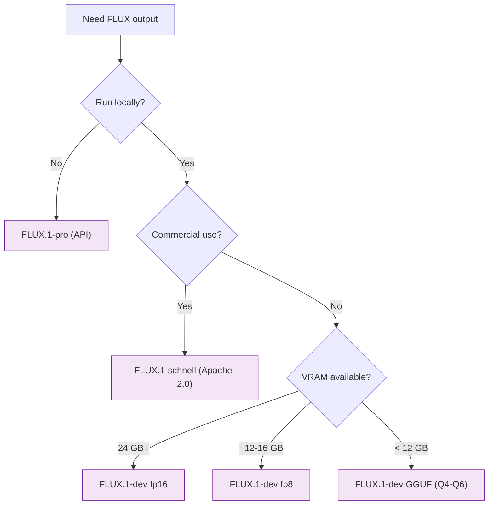

[AI/ML Documentation](./) &raquo; FLUX Guide

A deep dive into FLUX.1 — Black Forest Labs' transformer-based diffusion family. How flow matching and guidance distillation work, the differences between dev / schnell / pro, optimal settings, and the surrounding ecosystem of LoRAs, ControlNets, and quantized builds.

## Overview

FLUX represents the current state-of-the-art in open diffusion models, with revolutionary architecture changes and significantly improved capabilities. Built by **Black Forest Labs** (founded by several of the original Stable Diffusion researchers), the FLUX.1 family abandons the U-Net entirely in favor of a large **rectified-flow transformer** trained with **flow matching** and shipped with **guidance distillation** baked in.

The practical consequences are dramatic: FLUX rarely botches hands, holds spatial and physical consistency far better than prior open models, renders legible text, and follows long natural-language prompts faithfully — at the cost of higher VRAM requirements and slower inference than SDXL.

- **Flow Matching, Not DDPM.** FLUX learns a velocity field that transports noise to data along near-straight paths, so it needs fewer steps than classic noise-prediction diffusion.
- **Guidance Is Distilled In.** Classifier-free guidance is baked into the weights. You keep `cfg = 1.0` and steer with a separate `guidance` scalar instead.
- **Three Tiers, One Architecture.** schnell (fast, Apache-2.0), dev (open-weights, high quality), and pro (API-only, best quality) share the same backbone.

## Technical Specifications

| Property | Value |
|----------|-------|
| Architecture | Transformer-based (DiT), flow matching |
| Parameters | ~12B |
| Text encoders | T5-XXL + CLIP ViT-L (256 tokens) |
| Guidance | Distilled guidance (no traditional CFG) |
| Resolution | 1024×1024 to 2048×2048 |
| File size | ~24 GB (fp16); ~12 GB (fp8) |
| Developer | Black Forest Labs |

## Architecture

FLUX belongs to the **transformer / flow-matching lineage** of diffusion models (alongside SD3), not the U-Net lineage of SD 1.5, SD 2.x, and SDXL. Instead of a convolutional encoder/decoder with cross-attention to the text, FLUX uses a **Diffusion Transformer (DiT)** that processes image and text tokens together.

| Aspect | U-Net line (SD 1.5 / SDXL) | FLUX (transformer line) |
|--------|----------------------------|-------------------------|
| Backbone | Convolutional U-Net | Diffusion Transformer (DiT) |
| Text injected via | Cross-attention layers | Joint image+text attention (tokens mixed) |
| Training objective | Noise prediction (DDPM) | Velocity / rectified flow matching |
| Guidance | CFG scale (~5-9) | Distilled/embedded guidance (CFG pinned at 1.0) |
| Practical effect | Mature add-on ecosystem, fast on low VRAM | Stronger prompt adherence and text rendering, heavier |

### Double-Stream and Single-Stream Blocks

FLUX's transformer is organized into two kinds of blocks:

- **Double-stream (MM-DiT) blocks** keep image tokens and text tokens in *separate* streams with their own weights, but let them attend to each other through a joint attention operation. This mirrors the multimodal design of SD3's MM-DiT and is where most cross-modal reasoning ("put the red cube *on top of* the blue sphere") happens.
- **Single-stream blocks** concatenate the image and text tokens into one sequence processed by shared weights. These come later in the network and refine the merged representation more cheaply.

This double-then-single arrangement is a key efficiency choice: the expensive separate-stream processing is reserved for the layers that benefit most from it, while the bulk of refinement happens in the cheaper shared-weight blocks.

### Latent Space and Positional Encoding

Like the rest of the Stable Diffusion family, FLUX operates in the **latent space** of a VAE rather than on raw pixels, which is why a 1024×1024 image is only a modest token sequence. FLUX uses **rotary position embeddings (RoPE)** on the image tokens, which is part of why it generalizes across resolutions and aspect ratios more gracefully than fixed-grid U-Nets.

### Text Conditioning: T5 + CLIP

FLUX reads the prompt with **two** encoders working together:

- **T5-XXL** — a large natural-language encoder (up to 256 tokens here) that handles long, compositional, sentence-style prompts. This is the workhorse behind FLUX's prompt adherence and its ability to render specified words as legible text.
- **CLIP ViT-L** — provides a pooled global embedding that conditions the overall style/aesthetic.

If you understand the [forward/reverse diffusion process and flow matching](stable-diffusion-fundamentals.html), the rest of this page is the detailed "why FLUX behaves differently" story.

## Flow Matching

Classic diffusion models (DDPM, the SD 1.5/SDXL line) are trained to **predict the noise** added to an image at a randomly chosen timestep, then iteratively subtract it. FLUX is trained with **flow matching** under a **rectified-flow** formulation, which reframes generation as solving an ordinary differential equation (ODE).

### The Core Idea

Define an interpolation between a data sample $x_1$ (a clean latent) and a noise sample $x_0 \sim \mathcal{N}(0, I)$:

$$
x_t = (1 - t)\, x_0 + t\, x_1, \qquad t \in [0, 1]
$$

The model learns a **velocity field** $v_\theta(x_t, t)$ that predicts the direction of travel along this path. The target velocity for this linear interpolation is simply the constant displacement:

$$
\frac{d x_t}{d t} = x_1 - x_0
$$

So the training objective is a plain regression of the network's predicted velocity onto that target:

$$
\mathcal{L} = \mathbb{E}_{t, x_0, x_1} \left[ \left\| v_\theta(x_t, t) - (x_1 - x_0) \right\|^2 \right]
$$

### Why This Helps

Because the training paths are (close to) **straight lines** in latent space, the learned ODE can be integrated in relatively few steps without much curvature error. Generation is then just **numerical ODE integration** — start from pure noise $x_0$ and step the velocity field from $t = 0$ to $t = 1$:

$$
x_{t + \Delta t} = x_t + v_\theta(x_t, t)\, \Delta t
$$

This is why FLUX produces good results at 20-25 steps (and the distilled **schnell** variant at just 1-4), where the straighter the transport path, the fewer the integration steps needed for a given fidelity.

### The Shift / Timestep Schedule

Flow-matching models expose a **shift** parameter that warps the timestep schedule to spend more steps in the high-noise region where the image's coarse structure is decided. FLUX (and SD3) are sensitive to this, and many FLUX workflows apply a resolution-dependent shift automatically. This is the analogue of choosing a Karras vs. uniform sigma schedule in the U-Net world.

## Guidance Distillation

The single biggest practical difference between FLUX and SDXL is how prompt strength is applied.

### Classifier-Free Guidance, the Old Way

Traditional diffusion uses **classifier-free guidance (CFG)**: each step runs the model **twice** — once with the prompt and once unconditioned — and extrapolates away from the unconditioned prediction:

$$
\epsilon_{\text{guided}} = \epsilon_{\text{uncond}} + s \left( \epsilon_{\text{cond}} - \epsilon_{\text{uncond}} \right)
$$

Here $s$ is the CFG scale (~7.5 on SDXL). This doubles compute per step and, pushed too high, oversaturates and distorts the image.

### What FLUX Does Instead

FLUX.1-dev is produced by **guidance distillation**: a student model is trained to reproduce the *output of a CFG-guided teacher* directly, taking the desired guidance strength as an **input conditioning value** rather than computing it from two forward passes. The result is that FLUX:

- Runs **one** forward pass per step (not two), so a given step count is cheaper than CFG would be.
- Takes a `guidance` scalar (typically **~3.5**) that plays the role the CFG scale used to, fed in through a dedicated **FluxGuidance** node.
- Must keep the sampler's traditional **`cfg = 1.0`**. Setting CFG above 1.0 stacks real CFG on top of the baked-in guidance and **wrecks the output** — this is the single most common first-time FLUX mistake.

> **Rule of thumb:** On FLUX, `cfg` is not a dial you turn. Leave it at 1.0 and adjust `guidance` (~2.0-5.0) instead.

### schnell and Step Distillation

**FLUX.1-schnell** goes a step further with **step (latent) distillation** (a timestep-distillation approach in the same family as LCM/Turbo). It is trained so that a handful of large ODE steps reproduce what the full trajectory would have produced, enabling **1-4 step** generation. schnell is released under **Apache-2.0**, making it the permissive, commercially friendly member of the family. Because guidance is distilled away in schnell, you typically do **not** vary its guidance value.

## Model Variants

Choosing the right FLUX build is mostly a quality-vs-VRAM (and licensing) trade:

| Variant | What it is | Licensing | When to use |
|---------|-----------|-----------|-------------|
| FLUX.1-dev | Full-quality open-weights model | Non-commercial community license | Default for local high-quality work |
| FLUX.1-schnell | Distilled, 1-4 step generation | Apache-2.0 (commercial OK) | Fast iteration, previews, commercial use |
| FLUX.1-pro | API-only premium tier | Hosted / API only | Best quality without local hardware |
| FLUX fp8 | Quantized weights | Inherits base license | Fits ~12 GB cards with little quality loss |
| FLUX GGUF (Q4-Q8) | Further quantized | Inherits base license | Squeezing onto smaller VRAM budgets |

Black Forest Labs has also shipped specialized members of the family — **FLUX.1 Fill** (inpainting/outpainting), **FLUX.1 Canny** and **FLUX.1 Depth** (structural ControlNet-style conditioning built in), and **FLUX.1 Redux** (image variation / IP-Adapter-like reference) — plus newer editing-focused releases. These reuse the same flow-matching backbone, so the architectural intuition above carries over.

### Choosing a Variant

## What Makes FLUX Different

- **No traditional CFG.** FLUX bakes guidance into the model, so `cfg` is held at **1.0** and a separate `guidance` value (~3.5) controls prompt strength. Setting CFG above 1.0 breaks FLUX output — a common first-time mistake.
- **T5 text understanding.** Like SD3, the T5 encoder handles long natural-language prompts far better than CLIP, so you can describe scenes in full sentences.
- **Coherence and anatomy.** FLUX rarely botches hands and holds spatial/physical consistency better than prior open models, and it renders legible text.
- **Resolution flexibility.** RoPE positional encoding lets FLUX handle a range of resolutions and aspect ratios from 1024×1024 up to ~2048×2048 with fewer tiling artifacts than fixed-grid U-Nets.

## Strengths and Weaknesses

| Strengths | Weaknesses |
|-----------|------------|
| State-of-the-art open-model quality | 12 GB+ VRAM minimum (fp8); ~24 GB at fp16 |
| Readable text, strong prompt adherence | 2-3x slower than SDXL |
| Reliable anatomy and physics | dev license is non-commercial (use schnell for commercial work) |
| Trained on recent data | Single forward pass means no negative-prompt CFG steering |
| Graceful across resolutions/aspect ratios | Heavier T5 encoder adds setup/VRAM overhead |

## Optimal Settings

| Setting | Value |
|---------|-------|
| Resolution | 1024×1024 |
| Steps | 20-25 (1-4 for schnell) |
| CFG | **1.0** (must not change) |
| Guidance | ~3.5 (via FluxGuidance node) |
| Sampler / scheduler | `euler` / `simple` |
| Model | `flux-fp8` for lower-VRAM cards |

> **Tuning guidance.** Lower values (~2.0-2.5) look more photographic and natural; higher values (~4.0-5.0) push the prompt harder at the cost of some realism. Sweep guidance, not CFG.

## FLUX Workflow

FLUX inserts a **FluxGuidance** node before sampling and keeps CFG pinned at 1.0:

In ComfyUI, the dual-encoder requirement means you load a **DualCLIPLoader** (CLIP-L + T5-XXL) rather than a single CLIP, and FLUX's weights, VAE, and text encoders are often distributed as separate files you wire together. See the [ComfyUI Guide](comfyui-guide.html) for the node-graph mechanics.

### Lowering VRAM

| Technique | Effect |
|-----------|--------|
| fp8 weights | ~halves model VRAM with minimal quality loss |
| GGUF Q4-Q6 | Fits dev onto 8-12 GB cards at some quality cost |
| Sequential CPU offload | Streams encoders/VAE off-GPU; slower but fits tiny cards |
| schnell + low steps | 1-4 steps slashes total compute for iteration |

## Ecosystem

When FLUX launched, its thin add-on ecosystem was a real reason to prefer SDXL. That is **no longer true** — the surrounding tooling has matured rapidly:

- **LoRAs.** Training and inference for FLUX LoRAs is well supported (e.g., via the [LoRA training](lora-training.html) tooling discussed elsewhere in these docs). Because FLUX is a transformer, its LoRAs target attention/MLP projections in the DiT blocks and are **not** interchangeable with U-Net (SD 1.5 / SDXL) LoRAs.
- **ControlNet / structural conditioning.** Both community ControlNets and Black Forest Labs' native **FLUX.1 Canny / Depth / Fill / Redux** variants provide structural and reference-image control. See [ControlNet](controlnet.html) for the general technique.
- **Quantization.** fp8 and GGUF builds make dev practical on consumer cards, and these are widely shared on model hubs.
- **Tooling.** ComfyUI, the diffusers library, and most popular front-ends ship first-class FLUX support.

### Lineage Caveat

Remember that FLUX sits in the **transformer flow-matching lineage**, so its LoRAs and ControlNets **do not cross over** to the U-Net models. If you are coming from SDXL, you will rebuild your add-on collection for FLUX rather than reusing it. For the full cross-family picture, see the [Base Models Comparison](base-models-comparison.html).

## Migrating from SDXL to FLUX

The trap is **settings, not prompts**. SDXL uses `cfg_scale ≈ 7.5` at ~30 steps. FLUX must run at **`cfg = 1.0`** with a separate `guidance ≈ 3.5` at ~25 steps — leaving CFG at an SDXL-style value will wreck FLUX output. Prompts can stay natural-language, which FLUX's T5 encoder handles well; in fact long, descriptive sentences work *better* on FLUX than the terse quality-tag spam that SD 1.5 rewarded.

| Coming from SDXL | On FLUX |
|------------------|---------|
| `cfg_scale ≈ 7.5` | `cfg = 1.0` + `guidance ≈ 3.5` |
| Negative prompt does real work | No CFG, so negatives have limited/no effect |
| ~30 steps | ~20-25 steps (1-4 for schnell) |
| Reuse SDXL LoRAs/ControlNets | Rebuild with FLUX-native add-ons |
| Tags + short phrases | Full natural-language descriptions |

## Key Takeaways

- **FLUX is a flow-matching transformer**, not a U-Net — it learns a velocity field and generates by integrating an ODE, which is why it needs fewer steps.
- **Guidance is distilled into the weights.** Keep `cfg = 1.0` and steer with the `guidance` scalar (~3.5); raising CFG breaks the output.
- **Pick the variant for your constraints:** schnell for fast/commercial (Apache-2.0), dev for top-quality local work, pro for API-only best quality, fp8/GGUF to fit smaller cards.
- **Strengths:** state-of-the-art quality, reliable anatomy, legible text, excellent natural-language prompt adherence.
- **Costs:** 12 GB+ VRAM, 2-3x slower than SDXL, and a non-commercial license on dev.
- **The ecosystem has matured** — LoRAs, ControlNets, and quantized builds are all available, but they live in the transformer lineage and do not interchange with SDXL add-ons.

## See Also

- [Base Models Comparison](base-models-comparison.html) - Where FLUX fits among SD 1.5, SDXL, SD3, and Pony
- [Stable Diffusion Fundamentals](stable-diffusion-fundamentals.html) - Diffusion, flow matching, and the latent space
- [Model Types](model-types.html) - Checkpoints, LoRAs, VAEs, and how they combine
- [ComfyUI Guide](comfyui-guide.html) - Building the FLUX node graph
- [LoRA Training](lora-training.html) - Training custom FLUX LoRAs
- [ControlNet](controlnet.html) - Structural control, including FLUX-native variants
- [Advanced Techniques](advanced-techniques.html) - Cutting-edge workflows
- [AI/ML Documentation Hub](./) - Complete AI/ML documentation index
