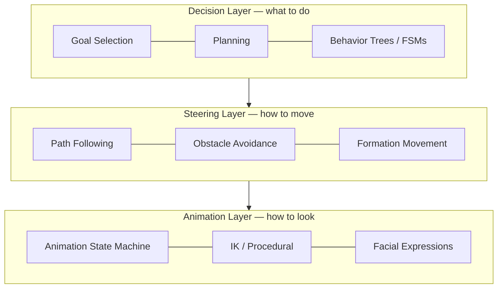
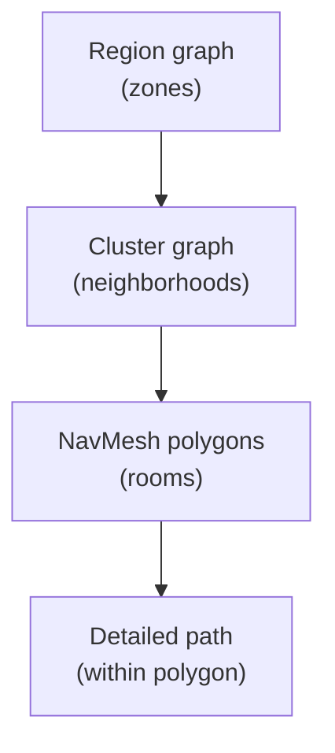
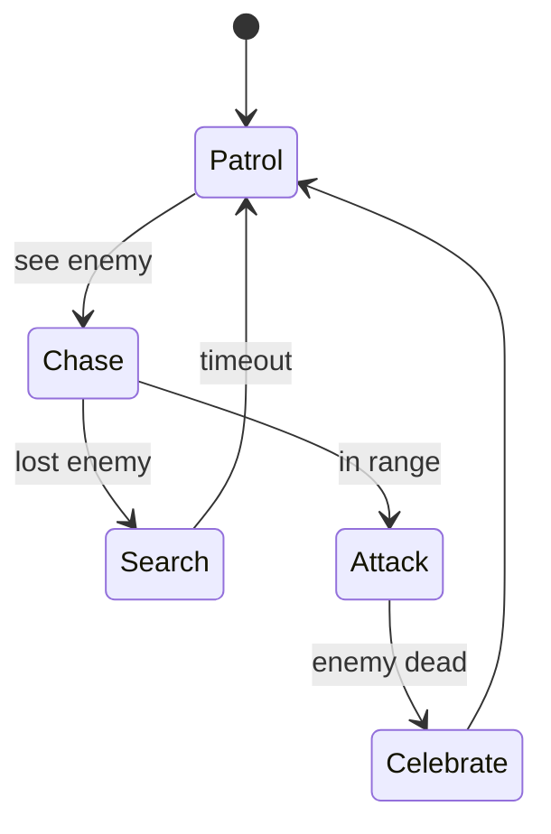
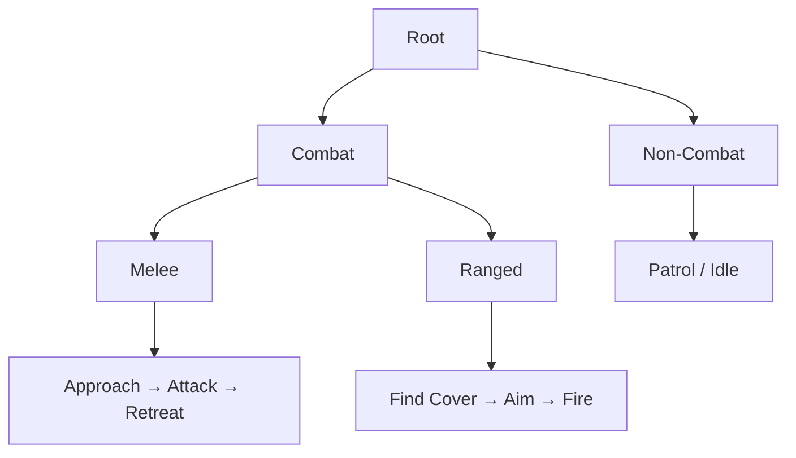
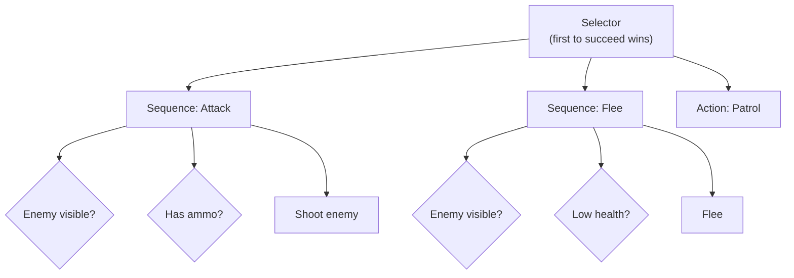

How games make characters feel alive: pathfinding, decision-making, steering, and the performance tricks that keep hundreds of agents thinking inside a single frame.

Game AI encompasses the techniques and systems that create intelligent, responsive, and believable non-player characters (NPCs) and game behaviors. Unlike academic AI focused on optimal decision-making, game AI prioritizes engaging, entertaining, and appropriately challenging experiences — all within the hard real-time performance constraints of an interactive frame.

- **Pathfinding.** NavMeshes and A* find routes through the world; hierarchical search and smoothing keep it fast and natural.
- **Decision Making.** FSMs, behavior trees, utility AI, and GOAP decide what an agent should do next.
- **Performance.** LOD for AI, time-slicing, and spatial partitioning keep many agents within frame budget.

> **Read this as a layered stack.** Decision (*what to do*) feeds steering (*how to move*) feeds animation (*how to look*). Each section below maps to one of these layers, progressing from movement up to learned behavior.

## Foundations of Game AI

### Goals of Game AI

Game AI differs from academic AI in key ways:

| Academic AI | Game AI |
|-------------|---------|
| Optimal solutions | Entertaining solutions |
| Unlimited computation | Real-time constraints |
| Perfect play | Believable play |
| Win at all costs | Create fun experiences |
| Single agent focus | Many agents simultaneously |

### AI Architecture Overview

Typical game AI is organized as three layers, each feeding the one below — decide *what*, then *how to move*, then *how to look*:



## Pathfinding

### Navigation Meshes (NavMesh)

Industry standard for 3D environments:

**NavMesh Generation:**
1. Voxelize walkable geometry
2. Identify walkable surfaces
3. Build regions from voxels
4. Create polygon mesh from regions
5. Add connectivity data

**Properties:**
- Efficient storage and queries
- Dynamic updates possible
- Supports different agent sizes
- Handles multi-level environments

### A* Algorithm

The foundation of game pathfinding. A* expands nodes in order of an estimated total cost that balances the known cost so far against an optimistic estimate of the cost remaining:

$$f(n) = g(n) + h(n)$$

where $g(n)$ is the actual cost from the start to node $n$ and $h(n)$ is the heuristic estimate from $n$ to the goal. If $h$ never overestimates the true remaining cost (it is *admissible*), A* is guaranteed to find the shortest path.

```python
def a_star(start, goal, graph):
    open_set = PriorityQueue()
    open_set.put(start, 0)

    came_from = {}
    g_score = {start: 0}
    f_score = {start: heuristic(start, goal)}

    while not open_set.empty():
        current = open_set.get()

        if current == goal:
            return reconstruct_path(came_from, current)

        for neighbor in graph.neighbors(current):
            tentative_g = g_score[current] + cost(current, neighbor)

            if tentative_g < g_score.get(neighbor, infinity):
                came_from[neighbor] = current
                g_score[neighbor] = tentative_g
                f_score[neighbor] = tentative_g + heuristic(neighbor, goal)

                if neighbor not in open_set:
                    open_set.put(neighbor, f_score[neighbor])

    return None  # No path found
```

**Heuristics:**
- **Euclidean**: Straight-line distance (any angle movement)
- **Manhattan**: Grid distance (4-directional)
- **Chebyshev**: Grid distance (8-directional)
- **Octile**: Weighted diagonal movement

### Hierarchical Pathfinding

Searching a single huge graph node-by-node is too slow for open worlds. Hierarchical pathfinding searches a coarse graph first, then refines only the part of the path the agent is about to walk:



The agent plans a route through regions, refines it through clusters, and only computes the fine path for the immediate stretch. This keeps searches small even on massive maps, uses far less memory than one flat graph, and fits naturally with streaming worlds where distant regions aren't loaded yet.

### Path Smoothing

Post-processing for natural movement:

- **String Pulling**: Funnel algorithm for shortest path
- **Bezier Curves**: Smooth corners
- **Catmull-Rom Splines**: Natural curves through waypoints
- **Runtime Smoothing**: Adjust path during movement

## Steering Behaviors

### Reynolds' Steering Behaviors

Classic autonomous movement algorithms:

**Basic Behaviors:**

```python
def seek(agent, target):
    desired = normalize(target - agent.position) * max_speed
    return desired - agent.velocity

def flee(agent, target):
    return -seek(agent, target)

def arrive(agent, target, slowing_radius):
    to_target = target - agent.position
    distance = length(to_target)

    if distance < slowing_radius:
        desired_speed = max_speed * (distance / slowing_radius)
    else:
        desired_speed = max_speed

    desired = normalize(to_target) * desired_speed
    return desired - agent.velocity
```

**Group Behaviors:**
- **Separation**: Avoid crowding neighbors
- **Alignment**: Steer toward average heading
- **Cohesion**: Steer toward average position
- **Flocking**: Combination of above three

### Obstacle Avoidance

Real-time collision prevention:

**Context Steering:**
```
1. Create interest map (directions toward goal)
2. Create danger map (directions toward obstacles)
3. Combine: interest - danger
4. Select highest-scoring direction
```

**Velocity Obstacles (VO):**
- Project obstacle's future positions
- Calculate collision cone
- Choose velocity outside all cones
- ORCA variant for multi-agent

### Local Avoidance

For crowds and traffic:

- **RVO2**: Reciprocal Velocity Obstacles
- **Social Forces**: Crowd simulation model
- **Flow Fields**: Precomputed direction vectors
- **Continuum Crowds**: Density-based movement

## Decision Making

### Finite State Machines (FSM)

Simple, reliable decision structure. Each state has clear entry/exit transitions triggered by game events:



**Advantages:**
- Easy to understand and debug
- Predictable behavior
- Low runtime cost

**Disadvantages:**
- State explosion with complexity
- Hard to reuse across agents
- Difficult to handle interrupts

### Hierarchical FSMs (HFSM)

Plain FSMs suffer **state explosion**: every new behavior risks new transitions to every existing state. HFSMs tame this by nesting states — a high-level state (e.g. *Combat*) contains its own sub-machine, and transitions can be defined once at the parent level instead of duplicated on every child.



A single "enemy lost" transition on *Combat* now pulls the agent out of any combat sub-state at once — no need to wire it to Approach, Attack, Aim, and Fire individually.

### Behavior Trees

The modern industry standard. A tree of nodes is "ticked" every frame; each node returns **Success**, **Failure**, or **Running**, and its parent reacts to that result. The power comes from a small node vocabulary:

| Category | Nodes | Role |
|----------|-------|------|
| Composite | Sequence, Selector, Parallel | Combine children — Sequence needs all to succeed, Selector tries until one does |
| Decorator | Inverter, Repeater, Succeeder, Cooldown | Wrap a child to modify its result or timing |
| Leaf | Action, Condition | Do the actual work or test the world |

The tree reads as prioritized behavior — a Selector tries each branch in order until one succeeds:



Because each branch is self-contained, behavior trees scale to complex agents far more gracefully than FSMs: adding a behavior is adding a branch, not rewiring a web of transitions.

### Utility AI

Score-based decision making:

```python
def select_action(agent, actions):
    best_action = None
    best_score = -infinity

    for action in actions:
        score = evaluate_utility(agent, action)
        if score > best_score:
            best_score = score
            best_action = action

    return best_action

def evaluate_utility(agent, action):
    # Combine multiple considerations
    score = 1.0
    score *= health_consideration(agent, action)
    score *= distance_consideration(agent, action)
    score *= threat_consideration(agent, action)
    return score
```

**Response Curves:**
- Linear, polynomial, logistic
- Custom curves per consideration
- Normalize to [0,1] range

**Advantages:**
- Smooth, nuanced decisions
- Easy to tune and balance
- Natural prioritization
- No explicit state transitions

### Goal-Oriented Action Planning (GOAP)

Where behavior trees and FSMs are *authored*, GOAP lets the agent **plan**. You define a goal and a library of actions, each with preconditions and effects; the planner searches (typically A* over world states) for the cheapest action sequence that reaches the goal. Designers add actions, not transitions — the agent figures out how to chain them.

```
World State: {has_weapon: false, enemy_dead: false, in_cover: false}
Goal State: {enemy_dead: true}

Actions:
- pickup_weapon: {pre: {}, post: {has_weapon: true}, cost: 1}
- find_cover: {pre: {}, post: {in_cover: true}, cost: 2}
- attack: {pre: {has_weapon: true}, post: {enemy_dead: true}, cost: 3}

Planner finds: pickup_weapon → attack
```

**Benefits:**
- Emergent complex behaviors
- Reusable action library
- Handles novel situations

**Used in:**
- F.E.A.R. (original implementation)
- Shadow of Mordor
- Tomb Raider (2013+)

## Tactical and Strategic AI

### Influence Maps

An influence map turns spatial reasoning into a grid lookup. Each cell accumulates a value from nearby entities, falling off with distance, so the map summarizes "who controls where." For a cell $c$:

$$I(c) = \sum_{e \in \text{entities}} \frac{\text{strength}(e)}{1 + \text{decay}\cdot \text{dist}(c, e)}$$

Computed once per update (often at coarse resolution), the resulting field answers tactical questions cheaply:

- **Safe areas** — cells where enemy influence is low.
- **Frontlines and choke points** — where friendly and enemy influence balance.
- **Strategic positions** — local maxima of friendly control, or flanking routes through low-influence gaps.

### Cover System

Finding and using cover:

```python
def evaluate_cover_point(cover, agent, threats):
    score = 0

    # Protection from threats
    for threat in threats:
        if not has_line_of_sight(cover, threat):
            score += 10

    # Distance to agent (prefer closer)
    score -= distance(cover, agent.position) * 0.5

    # Flanking opportunity
    if can_flank_from(cover, threats):
        score += 5

    # Escape routes
    score += count_exit_routes(cover) * 2

    return score
```

### Squad Tactics

Coordinated group behavior:

**Formation Movement:**
- Leader-follower patterns
- Slot-based formations
- Dynamic reformation around obstacles

**Role Assignment:**
- Point man (first in)
- Flankers (side attack)
- Support (covering fire)
- Medic (heal priority)

**Communication:**
- Shared blackboard for knowledge
- Signal system for coordination
- Priority-based task allocation

## Machine Learning in Games

### Reinforcement Learning

Training agents through rewards:

**Applications:**
- Racing game AI (learn optimal racing lines)
- Fighting game opponents (adapt to player style)
- Strategy game opponents (learn build orders)
- Procedural animation (physics-based movement)

**Challenges:**
- Training time requirements
- Unpredictable emergent behaviors
- Difficulty balancing for fun
- Reproducibility issues

### Imitation Learning

Learn from human demonstrations:

```
1. Record human player sessions
2. Extract state-action pairs
3. Train model to predict actions
4. Fine-tune with reinforcement learning
```

**Used in:**
- Racing games (ghost opponents)
- Sports games (player movement)
- Driving simulations

### Neural Network NPCs

Deep learning for game AI:

**Pros:**
- Can learn complex behaviors
- Adapts to player patterns
- Emergent interesting behaviors

**Cons:**
- "Black box" debugging
- Inconsistent behavior
- High computational cost
- Requires training data

## Perception Systems

### Sensory Simulation

What AI can "see" and "hear":

**Vision:**
- Field of view cone
- Line of sight checks
- Distance falloff
- Peripheral vs focused vision

**Hearing:**
- Sound propagation
- Occlusion by geometry
- Sound priority/type
- Memory of heard sounds

**Knowledge:**
- Last known position
- Memory decay over time
- Shared team knowledge

### Awareness System

```python
class AwarenessComponent:
    def __init__(self):
        self.detection_level = 0  # 0-100
        self.last_known_position = None
        self.last_seen_time = 0

    def update(self, target, dt):
        if can_see(target):
            # Increase detection based on visibility
            visibility = calculate_visibility(target)
            self.detection_level += visibility * dt * detection_rate

            if self.detection_level >= 100:
                self.state = ALERT
                self.last_known_position = target.position
        else:
            # Decay detection when not visible
            self.detection_level -= dt * decay_rate
            self.detection_level = max(0, self.detection_level)
```

## Performance Optimization

### LOD for AI

Scale AI complexity with importance:

| Distance/Importance | AI Complexity |
|---------------------|---------------|
| On-screen, close | Full behavior tree, full perception |
| On-screen, far | Simplified decisions, reduced updates |
| Off-screen | Minimal simulation, time-sliced |
| Very far | Statistical simulation only |

### Time Slicing

Spread computation across frames:

```python
class AIManager:
    def update(self):
        # Process subset of agents each frame
        budget = 2.0  # ms

        while budget > 0 and self.update_queue:
            agent = self.update_queue.pop(0)
            start = time.now()
            agent.update()
            budget -= time.now() - start
            self.update_queue.append(agent)  # Re-add to end
```

### Spatial Partitioning

Efficient queries:

- **Grids**: Simple, fast for uniform distribution
- **Quadtree/Octree**: Adaptive subdivision
- **BVH**: Hierarchical bounding volumes
- **Spatial hashing**: O(1) neighbor lookup

## Key Takeaways

- **Game AI optimizes for fun, not optimality.** Believable, appropriately-challenging behavior beats perfect play, all under hard real-time budgets.
- **Layer the system:** decision (FSM/behavior tree/utility/GOAP) → steering (pathfinding + avoidance) → animation. Each layer has a clear job.
- **A* is the pathfinding workhorse** — $f(n) = g(n) + h(n)$ with an admissible heuristic guarantees shortest paths; NavMeshes make it practical in 3D.
- **Behavior trees scale better than FSMs** for complex agents; utility AI and GOAP add flexibility when hand-authored logic gets unwieldy.
- **Performance is a first-class concern:** LOD for AI, time-slicing, and spatial partitioning keep hundreds of agents within frame budget.

## See Also

- [Game Development](../gamedev/) - Game development fundamentals
- [Unreal Engine](../technology/unreal.html) - UE5 AI systems and behavior frameworks
- [Performance Optimization](../optimization/) - Optimization techniques for real-time systems
- [AI Fundamentals](../technology/ai/) - Machine learning foundations behind ML-driven NPCs
- [AI/ML Documentation Hub](./) - Complete AI/ML documentation index
