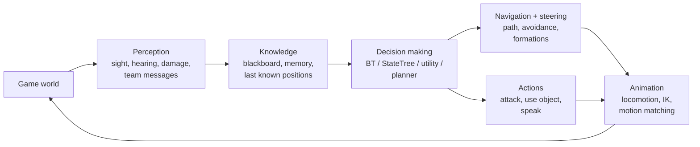
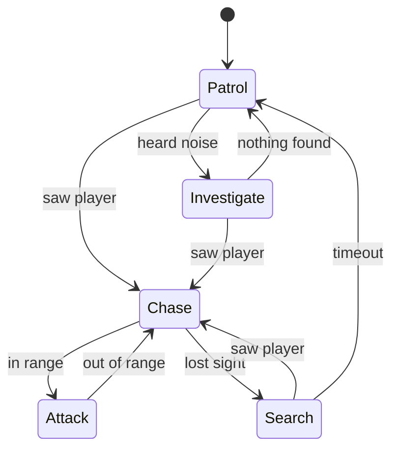
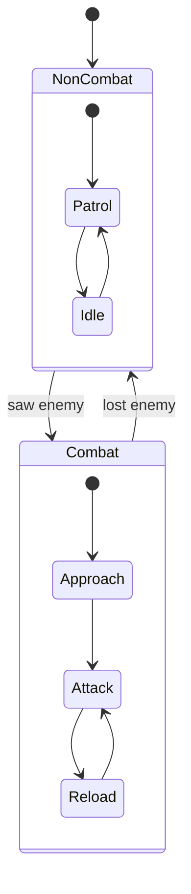
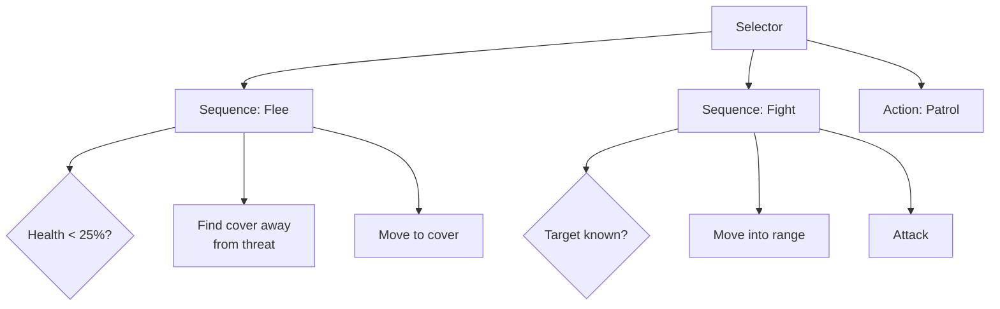
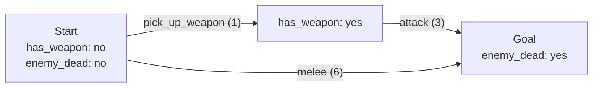
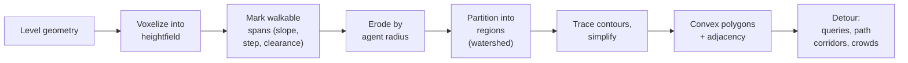
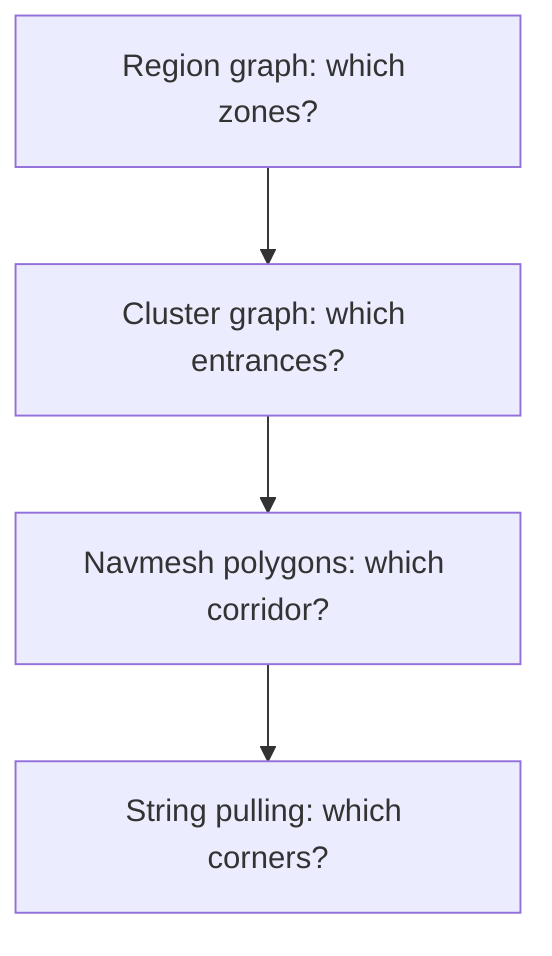
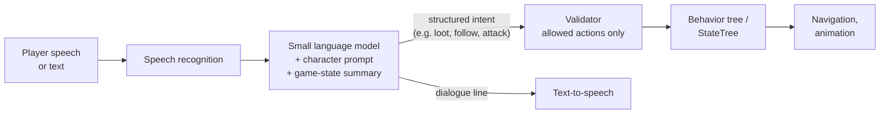

**Game AI** is the set of techniques that make non-player characters (NPCs) and game systems behave believably in real time. It overlaps with academic AI (search, planning, machine learning) but has different goals: an enemy should be readable, beatable, and fun, and every agent must do its thinking within a small slice of a 16 ms (60 fps) or 33 ms (30 fps) frame. This page covers how an agent is structured, the main decision-making architectures and when to choose each, navigation from navmesh generation to crowd avoidance, tactical reasoning, where machine learning and language models are actually used in shipped games, what the major engines provide, and how to keep hundreds of agents inside a frame budget.

## Goals and Constraints

| Academic AI typically optimises | Game AI optimises |
|---------------------------------|-------------------|
| Optimal or winning play | Entertaining, appropriately challenging play |
| Unbounded compute and training time | A fixed per-frame budget, often 1-3 ms for all AI |
| One agent | Dozens to thousands of agents at once |
| Hidden internal reasoning | Readable intent: the player should understand why an NPC acted |
| Generalisation | Designer control, predictability and debuggability |

Two consequences follow. First, most shipped game AI is **authored** (state machines, behavior trees, utility curves, planners over hand-written actions) rather than learned, because designers must be able to tune and debug it. Second, AI deliberately **cheats and handicaps** itself: enemies miss their first shots, announce attacks, forget the player after a while, and share information only through visible channels, because perfectly efficient opponents are not fun.

## Agent Architecture

An agent runs a **sense-think-act** loop. Perception updates what the agent believes; decision making picks a goal or behavior; movement and animation carry it out.



The layers run at different rates. Perception queries (raycasts) and decision updates might run at 5-10 Hz per agent, pathfinding only on demand, and steering and animation every frame. Keeping them separate lets each be optimised and time-sliced independently.

The **blackboard** is the shared key-value store that connects the layers: perception writes `TargetActor` and `LastKnownPosition`, decision logic reads them, and squad-level systems can share a blackboard across several agents.

## Perception

NPCs should react to what they could plausibly perceive, not to the game's ground truth.

| Sense | Typical implementation | Tuning concerns |
|-------|------------------------|-----------------|
| Sight | View cone (angle + range) test, then one or more raycasts to body points | Peripheral vision with slower detection; lighting and stance modifiers |
| Hearing | Sound events with a loudness radius; optional path distance through the navmesh for occlusion | Footsteps vs gunfire vs thrown distractions |
| Damage / touch | Direct event on hit | Reveal the attacker's approximate direction, not exact position |
| Team knowledge | Shared blackboard or messages | Delay and range limits so information spreads visibly |

Detection is usually gradual rather than binary, which gives the player a readable "suspicion" window (the pattern popularised by stealth games):

```python
from enum import Enum, auto

class Alert(Enum):
    UNAWARE = auto()
    SUSPICIOUS = auto()
    ALERTED = auto()

class Awareness:
    DETECT_RATE = 60.0   # detection points per second at full visibility
    DECAY_RATE = 15.0    # points per second lost when not visible
    SUSPICIOUS_AT, ALERT_AT = 30.0, 100.0

    def __init__(self):
        self.level = 0.0
        self.state = Alert.UNAWARE
        self.last_known_position = None

    def update(self, visibility: float, target_pos, dt: float) -> None:
        """visibility in [0, 1]: view-cone falloff x light x stance x LOS."""
        if visibility > 0.0:
            self.level = min(self.ALERT_AT, self.level + visibility * self.DETECT_RATE * dt)
            self.last_known_position = target_pos
        else:
            self.level = max(0.0, self.level - self.DECAY_RATE * dt)

        if self.level >= self.ALERT_AT:
            self.state = Alert.ALERTED
        elif self.state is Alert.ALERTED and self.level > 0.0:
            pass                                   # stay alerted (searching) until fully decayed
        elif self.level >= self.SUSPICIOUS_AT:
            self.state = Alert.SUSPICIOUS
        else:
            self.state = Alert.UNAWARE
```

Once alerted, the agent reasons about the **last known position** rather than the player's live position, which is what makes breaking line of sight and flanking work.

## Decision Making

### Choosing an Architecture

| Architecture | Core idea | Strengths | Weaknesses | Well-known uses |
|--------------|-----------|-----------|------------|-----------------|
| Finite state machine (FSM) | One active state; explicit transitions | Simple, cheap, easy to debug | Transition count explodes with states | Pac-Man ghosts, countless simple enemies |
| Hierarchical FSM | States contain sub-machines | Shared transitions at parent level | Still transition-centric | Animation state machines |
| Behavior tree (BT) | Tree of tasks re-evaluated by priority | Modular, reusable, designer friendly | Awkward for long-running state and memory | Halo 2 (popularised), Unreal and Unity AI |
| StateTree (Unreal) | Hierarchical state machine with BT-style selection and data binding | Explicit states plus BT-like selection; fast; works with Mass | Unreal-specific | Unreal 5 projects, Mass crowds |
| Utility AI | Score every option; pick the best | Smooth, context-sensitive choices | Harder to predict; curves need tuning | The Sims needs system |
| GOAP | Search for an action sequence that satisfies a goal | Emergent multi-step behavior from reusable actions | Search cost; harder to art-direct | F.E.A.R., Middle-earth: Shadow of Mordor |
| HTN planning | Decompose high-level tasks with designer-written methods | Plans that follow authored strategies; fast | More authoring than GOAP | Killzone 2, Horizon Zero Dawn |

Many games mix them: a behavior tree or StateTree for moment-to-moment control, utility scoring inside selector nodes to rank options, and a planner for multi-step goals.

### Finite State Machines

An FSM has one active state and transitions triggered by events or conditions:



FSMs are the right tool for small, well-bounded behaviors (doors, turrets, simple enemies) and remain standard for animation. Their weakness is **state explosion**: with $n$ states, transitions can grow toward $n^2$, and adding an interrupt such as "flee when health is low" means wiring it into every state.

A **hierarchical FSM** nests states. A transition defined on a parent applies to all its children, so "lost the player" on a *Combat* superstate exits Approach, Attack, Aim or Reload at once:



### Behavior Trees

A behavior tree is **ticked** from the root, typically several times per second. Each node returns **Success**, **Failure**, or **Running**.

| Category | Nodes | Semantics |
|----------|-------|-----------|
| Composite | Sequence | Run children left to right; fail on the first failure (logical AND) |
| | Selector (Fallback) | Run children left to right; succeed on the first success (logical OR, priority order) |
| | Parallel | Run children concurrently; succeed or fail by a policy (all/any) |
| Decorator | Inverter, Repeat, Cooldown, Timeout, Blackboard condition | Wrap one child and modify its result or when it may run |
| Leaf | Condition, Action | Test the world, or do something (possibly over many ticks) |



Children of a selector are in **priority order**: fleeing is checked before fighting, fighting before patrolling. When the tree is re-evaluated from the root, a higher-priority branch can interrupt a running lower-priority one; Unreal implements this efficiently with **observer aborts** on blackboard decorators, which only re-evaluate when the watched key changes rather than re-ticking the whole tree.

A minimal implementation shows how little machinery is involved:

```python
from enum import Enum

class Status(Enum):
    SUCCESS = 1
    FAILURE = 2
    RUNNING = 3

class Sequence:
    def __init__(self, *children):
        self.children = children

    def tick(self, bb) -> Status:
        for child in self.children:
            status = child.tick(bb)
            if status is not Status.SUCCESS:
                return status          # FAILURE or RUNNING stops the sequence
        return Status.SUCCESS

class Selector:
    def __init__(self, *children):
        self.children = children

    def tick(self, bb) -> Status:
        for child in self.children:
            status = child.tick(bb)
            if status is not Status.FAILURE:
                return status          # SUCCESS or RUNNING stops the selector
        return Status.FAILURE

class Condition:
    def __init__(self, predicate):
        self.predicate = predicate

    def tick(self, bb) -> Status:
        return Status.SUCCESS if self.predicate(bb) else Status.FAILURE

class Action:
    def __init__(self, fn):
        self.fn = fn                   # fn(bb) -> Status

    def tick(self, bb) -> Status:
        return self.fn(bb)

tree = Selector(
    Sequence(Condition(lambda bb: bb["health"] < 0.25), Action(flee)),
    Sequence(Condition(lambda bb: bb.get("target") is not None), Action(attack)),
    Action(patrol),
)
```

This version is *stateless* (re-evaluated from the root each tick), so higher-priority branches always get a chance to interrupt. Production implementations add memory to composites, abort handling so interrupted actions can clean up, and event-driven evaluation.

### StateTree

Unreal Engine's **StateTree** is a general-purpose hierarchical state machine that uses behavior-tree-style *selectors* to choose which child state to enter, plus explicit *transitions* and typed *data binding* between states, tasks and external data. It has matured into a production-ready system over the UE 5.x releases, drives the Mass framework's large crowds, and is increasingly the default for new AI logic, although behavior trees remain fully supported.

### Utility AI

Utility AI scores every available action and picks the highest (or samples from the top few for variety). Each action combines several **considerations**, each mapping one input (health, distance, ammo, threat) through a **response curve** to $[0, 1]$.

Common curve shapes, for normalised input $x \in [0, 1]$:

$$
\text{linear: } u = m x + b, \qquad \text{power: } u = x^{k}, \qquad \text{logistic: } u = \frac{1}{1 + e^{-k (x - x_0)}}
$$

Considerations are usually multiplied, so any one scoring zero vetoes the action. Multiplying many values in $[0, 1]$ penalises actions with more considerations, so Dave Mark's Infinite Axis Utility System applies a compensation to each factor $u$ when an action has $n$ considerations:

$$
u' = u + (1 - u)\left(1 - \frac{1}{n}\right) u .
$$

```python
import math

def logistic(x, k=10.0, x0=0.5):
    return 1.0 / (1.0 + math.exp(-k * (x - x0)))

def score(action, agent) -> float:
    factors = [c.curve(c.input(agent, action)) for c in action.considerations]
    n = len(factors)
    total = action.weight
    for u in factors:
        u = u + (1.0 - u) * (1.0 - 1.0 / n) * u   # IAUS compensation
        total *= u
        if total == 0.0:
            break                                  # vetoed
    return total

def choose(actions, agent):
    return max(actions, key=lambda a: score(a, agent))
```

Utility AI produces smooth, context-sensitive behavior (a wounded soldier gradually prefers cover over charging), but it can oscillate between near-equal options. The usual fixes are a **commitment bonus** for the current action and a minimum run time.

### Goal-Oriented Action Planning (GOAP)

GOAP, introduced by Jeff Orkin for *F.E.A.R.* (2005), lets the agent **plan**. The world state is a set of symbolic facts; each action has preconditions, effects and a cost. The planner runs A* over world states, usually **backwards** from the goal, to find the cheapest action sequence.



```text
Goal:    { enemy_dead: true }
Actions:
  pick_up_weapon  pre: { weapon_nearby: true }  effect: { has_weapon: true }  cost: 1
  attack          pre: { has_weapon: true }     effect: { enemy_dead: true }  cost: 3
  melee           pre: { }                      effect: { enemy_dead: true }  cost: 6
Plan:    pick_up_weapon -> attack  (cost 4, cheaper than melee)
```

Designers add actions rather than transitions; new combinations emerge automatically. The costs are search time (plans are cached and replanned only when the world state changes significantly) and reduced art direction, since designers specify ingredients rather than recipes.

### Hierarchical Task Networks (HTN)

An HTN planner starts from a high-level **compound task** ("attack the player") and repeatedly decomposes it using designer-written **methods** ("if the player is in cover: suppress, then flank; otherwise: advance and fire") until only primitive actions remain. Unlike GOAP it does not search freely over actions, so plans follow authored strategies, run fast, and are easier to art-direct. Guerrilla Games used HTN planning in *Killzone 2* and *Horizon Zero Dawn*.

## Navigation and Pathfinding

### Navigation Meshes

A **navigation mesh** represents walkable space as convex polygons, so an agent can move in a straight line anywhere inside one polygon. Most engines build navmeshes with **Recast** (Mikko Mononen's open-source library, the basis of Unreal's navmesh and many others) or an equivalent pipeline:



Erosion by agent radius means different agent sizes need different navmeshes (or rebuilt query filters). Large or changing worlds use **tiled** navmeshes so individual tiles can be rebuilt at runtime when a door closes or a wall is destroyed. **Off-mesh links** connect polygons for jumps, ladders and doors.

### A*

Pathfinding over the navmesh adjacency graph (or a grid, or a waypoint graph) is almost always A*. It expands nodes in order of

$$
f(n) = g(n) + h(n),
$$

where $g(n)$ is the cost of the best known path from the start to $n$ and $h(n)$ is a heuristic estimate of the remaining cost. If $h$ is **admissible** (never overestimates), A* returns an optimal path; if it is also **consistent** ($h(n) \le c(n, n') + h(n')$ for every edge), no node needs to be expanded twice. Weighting the heuristic ($f = g + w h$ with $w > 1$) trades optimality for far fewer expansions and is common in games.

```python
import heapq
import itertools

def a_star(start, goal, neighbors, cost, heuristic):
    """neighbors(n) -> iterable of nodes; cost(a, b) -> float; heuristic(n, goal) -> float."""
    tie = itertools.count()                 # tie-breaker so nodes never get compared
    open_heap = [(heuristic(start, goal), next(tie), start)]
    came_from = {}
    g = {start: 0.0}
    closed = set()

    while open_heap:
        _, _, current = heapq.heappop(open_heap)
        if current == goal:
            path = [current]
            while current in came_from:
                current = came_from[current]
                path.append(current)
            return path[::-1]
        if current in closed:
            continue                        # stale heap entry (lazy deletion)
        closed.add(current)

        for nxt in neighbors(current):
            tentative = g[current] + cost(current, nxt)
            if tentative < g.get(nxt, float("inf")):
                g[nxt] = tentative
                came_from[nxt] = current
                heapq.heappush(open_heap, (tentative + heuristic(nxt, goal), next(tie), nxt))
    return None                             # no path
```

For grids, choose the heuristic that matches the movement model, with $\Delta x$ and $\Delta y$ the absolute coordinate differences:

| Movement | Heuristic | Formula |
|----------|-----------|---------|
| 4-directional | Manhattan | $\Delta x + \Delta y$ |
| 8-directional, diagonal costs 1 | Chebyshev | $\max(\Delta x, \Delta y)$ |
| 8-directional, diagonal costs $\sqrt{2}$ | Octile | $\max(\Delta x, \Delta y) + (\sqrt{2} - 1)\min(\Delta x, \Delta y)$ |
| Any angle | Euclidean | $\sqrt{\Delta x^2 + \Delta y^2}$ |

### Scaling Pathfinding

| Technique | Idea | When to use |
|-----------|------|-------------|
| Hierarchical pathfinding (HPA*) | Plan over clusters or regions first, refine only the next stretch | Large or streamed worlds |
| Jump Point Search (JPS) | Skip symmetric paths on uniform-cost grids | Grid games with many searches |
| Path caching and sharing | Reuse paths for agents with similar start and goal | Groups moving together |
| Flow fields | One Dijkstra pass from the goal gives every cell a direction | Hundreds of units sharing a destination (RTS, crowds) |
| Asynchronous / time-sliced queries | Spread searches over frames or worker threads | Always, once searches are non-trivial |



### Path Smoothing

A polygon path is a corridor, not a line. The **funnel algorithm** (string pulling) finds the shortest path through that corridor by tracking a left and right boundary and emitting a corner whenever the funnel collapses. Splines (Catmull-Rom, Bezier) then round corners for natural motion, and steering handles the final smoothing at runtime.

## Steering and Movement

### Reynolds Steering Behaviors

Craig Reynolds' steering behaviors (1999) compute a steering force from the difference between a **desired velocity** and the current velocity:

```python
def seek(agent, target):
    desired = normalize(target - agent.position) * agent.max_speed
    return truncate(desired - agent.velocity, agent.max_force)

def flee(agent, threat):
    desired = normalize(agent.position - threat) * agent.max_speed
    return truncate(desired - agent.velocity, agent.max_force)

def arrive(agent, target, slowing_radius):
    offset = target - agent.position
    distance = length(offset)
    if distance < 1e-3:
        return -agent.velocity                       # brake
    speed = agent.max_speed * min(1.0, distance / slowing_radius)
    desired = offset / distance * speed
    return truncate(desired - agent.velocity, agent.max_force)
```

**Flocking** (Reynolds' 1987 boids) combines three neighbourhood behaviors: **separation** (steer away from close neighbours), **alignment** (match average heading) and **cohesion** (steer toward the average position). Weighted sums of behaviors work for simple cases; priority blending (apply avoidance first, then fill remaining force budget with other goals) avoids behaviors cancelling each other out.

### Obstacle and Crowd Avoidance

| Method | Idea | Notes |
|--------|------|-------|
| Context steering | Each behavior writes interest and danger values into slots around the agent; pick the best unmasked direction | Avoids the cancellation problem of summed forces; popular in action games |
| Velocity obstacles (VO) | The set of velocities that would collide with an obstacle within a time horizon forms a cone; choose a velocity outside all cones | Oscillates when two agents both dodge |
| RVO / ORCA | Each agent takes half the responsibility for avoiding the other; ORCA solves a small linear program per agent | Smooth, collision-free crowds; open-source RVO2 library; Godot's avoidance and Unreal's optional RVO avoidance build on it |
| Detour crowd | Recast/Detour's local steering plus path corridors | Default in many Recast-based engines |
| Flow fields / continuum crowds | Treat the crowd as a density field | Very large crowds with shared goals |

## Tactical and Strategic Reasoning

### Influence Maps

An influence map summarises "who controls where" on a coarse grid. Each cell accumulates influence from nearby units, decaying with distance:

$$
I(c) = \sum_{e \in \text{units}} \frac{s_e}{1 + \lambda\, d(c, e)},
$$

with $s_e$ positive for friendly and negative for enemy units, $\lambda$ a decay rate and $d$ a distance (path distance is more accurate than straight-line). Recomputed a few times per second, the map answers tactical questions by simple lookups: safe cells (low enemy influence), front lines (near zero with high total magnitude), and flanking routes (paths through low-influence cells). Separate layers (threat, visibility, resources) can be combined per query.

### Position Evaluation and Cover

Rather than hard-coding where an agent should stand, most modern games **generate candidate points and score them**. Unreal's **Environment Query System (EQS)** formalises this: a generator produces points (a grid around the agent, cover markers, navmesh samples), tests filter and score them (distance, line of sight to the threat, path length, dot product with the threat direction), and the best point is returned.

```python
def score_cover(point, agent, threats, weights):
    s = 0.0
    s += weights.protection * sum(not line_of_sight(point, t) for t in threats)
    s -= weights.distance * path_distance(agent.position, point)
    s += weights.firing * sum(can_peek_and_shoot(point, t) for t in threats)
    s -= weights.exposure * exposed_path_length(agent.position, point, threats)
    return s
```

### Squads and Coordination

| Concern | Common approaches |
|---------|-------------------|
| Formations | Slot-based formations anchored to a virtual leader; slots re-assigned as agents fall behind |
| Roles | Assign roles (suppressor, flanker, rusher) from a squad-level decision, then run individual behavior per role |
| Communication | Shared squad blackboard; *announce* intentions ("flanking left") so players can read the plan |
| Token systems | Limit how many enemies may attack the player at once; agents request an attack token |

Attack tokens are a clear example of fun over optimality: a crowd of enemies that all attack simultaneously is realistic and miserable, so games queue them.

## Machine Learning and Language Models

Learned behavior has been slower to appear in shipped games than in research, for the reasons in the first table: training cost, unpredictability and difficulty of design control. Where it does ship, it is usually in a bounded role.

### Reinforcement and Imitation Learning

| Use | Status | Examples |
|-----|--------|----------|
| Superhuman opponents in research | Demonstrated | AlphaStar (StarCraft II), OpenAI Five (Dota 2) |
| Shipped learned opponents | Rare, in bounded domains | Sony AI's **GT Sophy** (Nature, 2022), added to *Gran Turismo 7* as a racing opponent |
| Automated playtesting and QA | Common in large studios | RL or scripted bots exploring levels for stuck spots and exploits |
| Physics-based character control | Growing | Learned locomotion and recovery policies |
| Imitation from player data | Niche | Driving and racing opponents; "ghost" behaviors |

**Unity ML-Agents** is the most widely used open toolkit; version 4.0 (2025) moved inference onto Unity's Inference Engine. It trains agents with PPO, SAC and imitation learning (behavioral cloning, GAIL) against Unity scenes. RL in general is covered in [Reinforcement Learning](../technology/ai/reinforcement-learning.html).

### LLM-Driven Characters

Since 2024, several shipped or early-access games have used language models for NPC dialogue and high-level decisions. NVIDIA's **ACE** stack powers the best-known examples: the *PUBG* Ally co-playable teammate (built on an 8B-parameter small language model), the "Smart Zoi" characters in *inZOI* (a ~0.5B on-device model), and AI teammates in *NARAKA: BLADEPOINT*. Other studios use cloud-hosted models or services such as Inworld.

The pattern that works is **hybrid**: the language model interprets speech or text and chooses an intent from a constrained set, and conventional systems (behavior trees, navigation, animation) execute it.



The main constraints are latency (a reply must start within about a second), per-player compute or API cost, VRAM contention with rendering on local deployments, and keeping the character on-script and within content rules. Validating model output against an allow-list of actions, and never letting it modify game state directly, is the key safeguard.

## Engine Support

| Engine | Decision making | Navigation | Other AI features |
|--------|-----------------|------------|-------------------|
| Unreal Engine 5 | Behavior Trees with blackboards and observer aborts; **StateTree** (increasingly preferred for new work) | Recast-based navmesh, dynamic tiles, Detour crowds, nav links | AI Perception component, EQS, Smart Objects, **Mass** entity framework for large crowds |
| Unity 6 | **Unity Behavior** package (behavior graphs, successor to Muse Behavior); many asset-store BT/utility tools | **AI Navigation** package (NavMeshSurface, links, modifiers) | ML-Agents 4.0, Inference Engine for running ONNX models |
| Godot 4 | No built-in BT; plugins such as LimboAI and Beehave | NavigationServer2D/3D with navmesh baking, avoidance (RVO) | — |
| Custom engines | Usually in-house BT/HTN/utility frameworks | Recast/Detour is the common open-source choice | — |

## Performance

AI competes with rendering, physics and gameplay for the frame. Typical budgets are a few milliseconds for all AI, so costs must scale sublinearly with agent count.

### AI Level of Detail

| Agent situation | Treatment |
|-----------------|-----------|
| On screen, near the player | Full perception, decision updates at 10+ Hz, full steering and animation |
| On screen, distant | Decision updates at 1-5 Hz, simplified perception, cheaper avoidance |
| Off screen, nearby | Coarse simulation; teleport-free but low-frequency movement |
| Far away | Statistical or schedule-based simulation ("the guard is at the gate from 8 to 5") |

### Time Slicing

Spread expensive work across frames with a per-frame budget. Using a real clock and a round-robin queue keeps any one frame from overrunning:

```python
import time
from collections import deque

class AIScheduler:
    def __init__(self, agents, budget_ms=2.0):
        self.queue = deque(agents)
        self.budget = budget_ms / 1000.0

    def update(self):
        start = time.perf_counter()
        for _ in range(len(self.queue)):          # visit each agent at most once per frame
            if time.perf_counter() - start >= self.budget:
                break
            agent = self.queue.popleft()
            agent.think()
            self.queue.append(agent)
```

Pathfinding requests are usually queued the same way, and long searches are paused and resumed across frames.

### Data Layout and Threading

- **Spatial partitioning** (uniform grids, spatial hashing, quadtrees/octrees, BVHs) makes neighbour and perception queries cheap. Uniform grids or hashing are usually best for similar-sized moving agents.
- **Batch and parallelise.** Perception raycasts, steering and avoidance are independent per agent and suit job systems. Data-oriented frameworks (Unreal's Mass, Unity's DOTS/ECS) process thousands of agents by storing their data in contiguous arrays.
- **Event-driven evaluation.** Re-evaluate decisions when relevant blackboard values change rather than every frame.

## See Also

- [Game Development](../gamedev/) - Game development fundamentals
- [Procedural Generation](../gamedev/procedural-generation.html) - Generating the worlds agents navigate
- [Unreal Engine](../technology/unreal.html) - UE5 gameplay and AI frameworks
- [Reinforcement Learning](../technology/ai/reinforcement-learning.html) - Theory behind learned agents
- [Performance Optimization](../optimization/) - Optimization techniques for real-time systems
- [AI Fundamentals](../technology/ai/) - Machine learning foundations
- [AI/ML Documentation Hub](./) - Complete AI/ML documentation index
