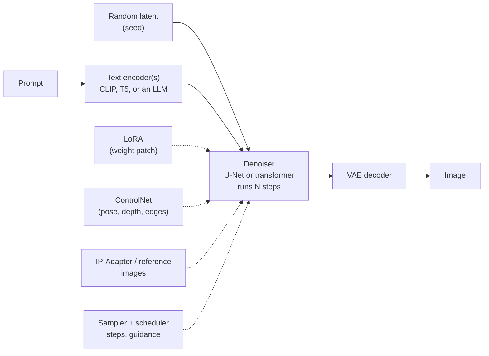

<div class="hero-section" style="background: linear-gradient(135deg, #667eea 0%, #764ba2 100%); color: white; padding: 3rem 2rem; margin: -2rem -3rem 2rem -3rem; text-align: center;">
  <h1 style="color: white; margin: 0; font-size: 2.5rem;">AI/ML Documentation</h1>
  <p style="font-size: 1.25rem; margin-top: 1rem; opacity: 0.9;">Diffusion image generation, custom model training, and running generative models in production.</p>
</div>

This section is a reference for **open-weight image generation**: how diffusion and flow-matching models work, how the major model families differ, how to steer and customise them with ComfyUI, LoRAs, ControlNet and editing models, and how to run them efficiently and reliably at scale. It also includes a separate page on [game AI](game-ai.html). General machine-learning theory lives in [AI Fundamentals](../technology/ai/).

## How the Section Is Organised

```mermaid
flowchart LR
    subgraph F["Foundations"]
        F1["Stable Diffusion<br/>Fundamentals"]
        F2["Model Types"]
        F3["Base Models<br/>Comparison"]
    end
    subgraph M["Model families"]
        M1["SDXL"]
        M2["SD3"]
        M3["FLUX"]
        M4["Pony &<br/>fine-tunes"]
    end
    subgraph T["Tools and control"]
        T1["ComfyUI"]
        T2["LoRA Training"]
        T3["ControlNet"]
        T4["Inpainting &<br/>Editing"]
    end
    subgraph P["Production"]
        P1["Optimization"]
        P2["Model<br/>Compression"]
        P3["Production<br/>Pipelines"]
        P4["MLOps"]
    end
    F --> M --> T --> P
```



Start with the foundations if the vocabulary (latent, sampler, CFG, text encoder) is new; otherwise jump straight to the page for your task.

| Your goal | Start here | Then |
|-----------|-----------|------|
| Understand how generation works | [Stable Diffusion Fundamentals](stable-diffusion-fundamentals.html) | [Model Types](model-types.html) |
| Pick a base model | [Base Models Comparison](base-models-comparison.html) | The family guide: [SDXL](sdxl-guide.html), [SD3](sd3-guide.html), [FLUX](flux-guide.html), [Pony & Fine-Tunes](pony-and-finetunes.html) |
| Generate images | [ComfyUI Guide](comfyui-guide.html) | [Stable Diffusion Fundamentals](stable-diffusion-fundamentals.html) |
| Train a style, character or concept | [LoRA Training](lora-training.html) | [Advanced Techniques](advanced-techniques.html) |
| Control pose and composition | [ControlNet](controlnet.html) | [ComfyUI Guide](comfyui-guide.html) |
| Edit an existing image | [Inpainting & Editing](inpainting-editing.html) | [FLUX Guide](flux-guide.html) (Kontext, FLUX.2) |
| Produce video, audio or 3D | [Output Formats](output-formats.html) | [Advanced Techniques](advanced-techniques.html) |
| Fit a model on a smaller GPU or run it faster | [Optimization & Performance](optimization-guide.html) | [Model Compression](model-compression.html) |
| Generate at scale | [Production Pipelines](production-pipelines.html) | [MLOps & Production](mlops-production.html) |
| Build NPC behavior | [Game AI Systems](game-ai.html) | [Game Development](../gamedev/) |

## How Image Generation Works

A modern text-to-image model is a pipeline of separately trained components. The prompt is encoded once; the denoiser then runs for a number of steps, gradually turning random noise in a compressed **latent** space into a latent image, which the VAE decodes to pixels. Add-ons attach to specific points in this pipeline.



- **Denoiser.** Older families (SD 1.5, SDXL) use a convolutional **U-Net** trained to predict noise. Newer ones (SD3, FLUX, Qwen-Image, Z-Image) use a **diffusion transformer** trained with **flow matching**, which predicts a velocity from noise toward the image.
- **Text encoder.** CLIP for SD 1.5/SDXL; CLIP plus T5 for SD3 and FLUX.1; full language or vision-language models (Qwen, Mistral) in the newest families, which is why they follow long prompts and render text well.
- **Guidance.** Classifier-free guidance (CFG) runs the denoiser with and without the prompt and extrapolates; guidance-distilled models such as FLUX.1 [dev] take a guidance value directly and keep CFG at 1.
- **Steps.** Standard models need roughly 20-40 steps; distilled "turbo", "lightning", LCM and schnell-style models need 1-8.

[Stable Diffusion Fundamentals](stable-diffusion-fundamentals.html) explains each stage in detail, and [Model Types](model-types.html) covers the file formats and add-ons.

## The Model Landscape (2026)

| Family | Released | Denoiser | License | Notes |
|--------|----------|----------|---------|-------|
| SD 1.5 | 2022 | ~0.9B U-Net, 512 px | CreativeML OpenRAIL-M | Legacy, but the largest LoRA/ControlNet back-catalogue |
| SDXL (and Pony, Illustrious, etc.) | 2023 | ~2.6B U-Net, 1024 px | CreativeML OpenRAIL++-M | Still the most-used base for fine-tunes and anime models |
| SD 3.5 Large / Medium | Oct 2024 | 8.1B / 2.5B MMDiT | Stability AI Community License | Flow matching, T5 + CLIP encoders |
| FLUX.1 [dev] / [schnell] | Aug 2024 | 12B rectified-flow transformer | Non-commercial / Apache-2.0 | Kontext (editing) and Krea variants followed in 2025 |
| Qwen-Image | Aug 2025 | 20B MMDiT | Apache-2.0 | Strong English and Chinese text rendering; Qwen-Image-Edit for editing |
| Z-Image Turbo | Nov 2025 | 6B single-stream DiT | Apache-2.0 | ~8 steps; fits in 16 GB |
| FLUX.2 [dev] / [klein] | Nov 2025 / Jan 2026 | 32B / 4B-9B | Non-commercial / Apache-2.0 (4B) | Unified generation and multi-reference editing |

The trend since 2024 is larger transformer denoisers, language-model text encoders, and single models that both generate and edit. SDXL-based fine-tunes remain popular because they are cheap to run and train. See the [Base Models Comparison](base-models-comparison.html) for a detailed comparison.

## Getting Started

### Choosing an Interface

| Interface | Style | Status (2026) | Good for |
|-----------|-------|---------------|----------|
| ComfyUI | Node graph | Very active; first to support new models; also a desktop app | Complex workflows, automation, anything new |
| SwarmUI | Simple UI over a ComfyUI backend | Active | A friendlier front end with ComfyUI's model support |
| InvokeAI | Canvas and layers | Active | Editing, inpainting, art-directed work |
| Forge and its forks | A1111-style tabs | Sporadic upstream updates; active forks | Users coming from Automatic1111 |
| Automatic1111 WebUI | Tabs and extensions | Largely unmaintained since 2024 | Existing setups only |
| Fooocus | Minimal prompt box | Bug fixes only | Quick SDXL generation |

These pages use **ComfyUI** because its graph makes every component explicit and because it can be driven headlessly for [production pipelines](production-pipelines.html).

### First Image

ComfyUI can be installed as the desktop application, the Windows portable build, or from source:

```bash
git clone https://github.com/comfyanonymous/ComfyUI.git
cd ComfyUI
python -m venv .venv && source .venv/bin/activate
pip install torch torchvision --index-url https://download.pytorch.org/whl/cu128   # match your CUDA version
pip install -r requirements.txt
python main.py            # then open http://127.0.0.1:8188
```

Put a checkpoint in `models/checkpoints/`, load the default workflow, type a prompt and queue it. The [ComfyUI Guide](comfyui-guide.html) covers the containerised setup used elsewhere on this site, model folders, custom nodes and the HTTP API.

### Hardware

VRAM is the constraint that matters most. Figures are for comfortable 1024 px generation with common fp16/fp8 weights; quantised (GGUF, 4-bit) builds and CPU offload lower them at a speed cost.

| Workload | GPU VRAM | System RAM |
|----------|----------|------------|
| SD 1.5 | 4-6 GB | 16 GB |
| SDXL and its fine-tunes | 8-12 GB | 16-32 GB |
| SD 3.5 Medium, Z-Image Turbo, FLUX.2 [klein] 4B | 12-16 GB | 32 GB |
| FLUX.1 [dev] (fp8), SD 3.5 Large | 12-24 GB | 32-64 GB |
| Qwen-Image, FLUX.2 [dev] (quantised) | 24-32 GB | 64 GB+ |
| LoRA training (SDXL / FLUX.1) | 12-24 GB | 32-64 GB |

NVIDIA GPUs have the broadest support. Apple Silicon works through PyTorch's MPS backend and AMD through ROCm (Linux) or DirectML/ZLUDA-style layers, with fewer optimised kernels and occasional node incompatibilities. Plan for 100-500 GB of disk once you collect several model families. The [Optimization & Performance](optimization-guide.html) guide covers quantisation and offloading.

## All Pages

**Foundations**

- [Stable Diffusion Fundamentals](stable-diffusion-fundamentals.html) — diffusion, latents, samplers, CFG and the parameters that control results.
- [Model Types](model-types.html) — checkpoints, LoRAs, VAEs, text encoders, ControlNets and IP-Adapters, and how they combine.
- [Base Models Comparison](base-models-comparison.html) — choosing among SD 1.5, SDXL, SD3, FLUX and fine-tunes.

**Model families**

- [SDXL Guide](sdxl-guide.html) — the U-Net workhorse, its refiner, and settings.
- [Stable Diffusion 3 Guide](sd3-guide.html) — the MM-DiT flow-matching family from Stability AI.
- [FLUX Guide](flux-guide.html) — FLUX.1 and FLUX.2: architecture, guidance distillation, variants and licenses.
- [Pony & Community Fine-Tunes](pony-and-finetunes.html) — Pony, Illustrious and other SDXL-derived models.

**Tools and control**

- [ComfyUI Guide](comfyui-guide.html) — the node-based workflow builder.
- [LoRA Training](lora-training.html) — datasets, captions, hyperparameters and trainers.
- [ControlNet](controlnet.html) — pose, edge, depth and other spatial conditioning.
- [Inpainting & Editing](inpainting-editing.html) — masking, inpainting, outpainting and instruction editing.
- [Advanced Techniques](advanced-techniques.html) — regional prompting, latent tricks, flow matching and distillation.
- [Output Formats](output-formats.html) — diffusion for video, audio and 3D, and exporting each.

**Production**

- [Optimization & Performance](optimization-guide.html) — quantisation, VRAM reduction and inference speed-ups.
- [Model Compression](model-compression.html) — pruning, distillation, quantisation and low-rank methods.
- [Production Pipelines](production-pipelines.html) — batch generation, the ComfyUI API, queues and asset pipelines.
- [MLOps & Production](mlops-production.html) — experiment tracking, registries, rollouts and monitoring.

**Other**

- [Game AI Systems](game-ai.html) — pathfinding, behavior trees, utility AI, planners and ML-driven NPCs.

## Troubleshooting

| Symptom | Likely cause | First fixes |
|---------|--------------|-------------|
| CUDA out of memory | Model plus resolution exceed VRAM | fp8 or GGUF weights; lower resolution; enable offloading; close other GPU applications |
| Very slow generation | Running on CPU, or models reloading each run | Check `nvidia-smi` during generation; keep the server running between jobs; use fewer steps or a distilled model |
| Black, grey or noisy output | VAE mismatch or fp16 VAE overflow (SDXL) | Use the VAE made for the model family (the SDXL fp16-fix VAE for fp16) |
| Burnt, oversaturated images | Guidance too high; CFG above 1 on a guidance-distilled model | Lower CFG; on FLUX keep `cfg = 1` and adjust guidance |
| Wrong or ignored composition | Prompt cannot express layout | Describe layout explicitly on modern models, or use [ControlNet](controlnet.html) |
| LoRA has no effect or breaks the image | LoRA trained for a different base family; missing trigger word | Match the family; check the trigger word and strength |
| Blurry or smeared details | Too few steps for a non-distilled model; resolution far from native | 20-30 steps; generate near the model's native resolution and upscale |

Prompting differs by family: SD 1.5 and SDXL fine-tunes respond to comma-separated tags and weighting, while T5- and LLM-encoded models (SD3, FLUX, Qwen-Image) respond best to plain descriptive sentences. Put the subject first and describe lighting, composition and style explicitly.

## Resources

**Models and code**

- [Hugging Face](https://huggingface.co/) — official releases and research models
- [Civitai](https://civitai.com/) — community checkpoints and LoRAs
- [ComfyUI](https://github.com/comfyanonymous/ComfyUI) and the [ComfyUI documentation](https://docs.comfy.org/)
- [Hugging Face diffusers](https://huggingface.co/docs/diffusers/) — the reference Python library

**Papers**

- [High-Resolution Image Synthesis with Latent Diffusion Models](https://arxiv.org/abs/2112.10752) (Rombach et al., 2022) — Stable Diffusion
- [Flow Matching for Generative Modeling](https://arxiv.org/abs/2210.02747) (Lipman et al., 2022) and [Rectified Flow](https://arxiv.org/abs/2209.03003) (Liu et al., 2022)
- [Scaling Rectified Flow Transformers for High-Resolution Image Synthesis](https://arxiv.org/abs/2403.03206) (Esser et al., 2024) — SD3 and MM-DiT
- [Adding Conditional Control to Text-to-Image Diffusion Models](https://arxiv.org/abs/2302.05543) (Zhang et al., 2023) — ControlNet
- [LoRA: Low-Rank Adaptation of Large Language Models](https://arxiv.org/abs/2106.09685) (Hu et al., 2021)

**Community**

- [r/StableDiffusion](https://www.reddit.com/r/StableDiffusion/) — news and discussion across all open image models

## Related Documentation

- [AI Fundamentals - Simplified](../technology/ai-fundamentals-simple.html) — conceptual introduction without heavy math
- [AI Fundamentals - Complete](../technology/ai/) — machine learning and deep learning in depth
- [AI Documentation Hub](../artificial-intelligence/) — all AI-related documentation on this site
- [Game Development](../gamedev/) — the wider context for the game AI page
