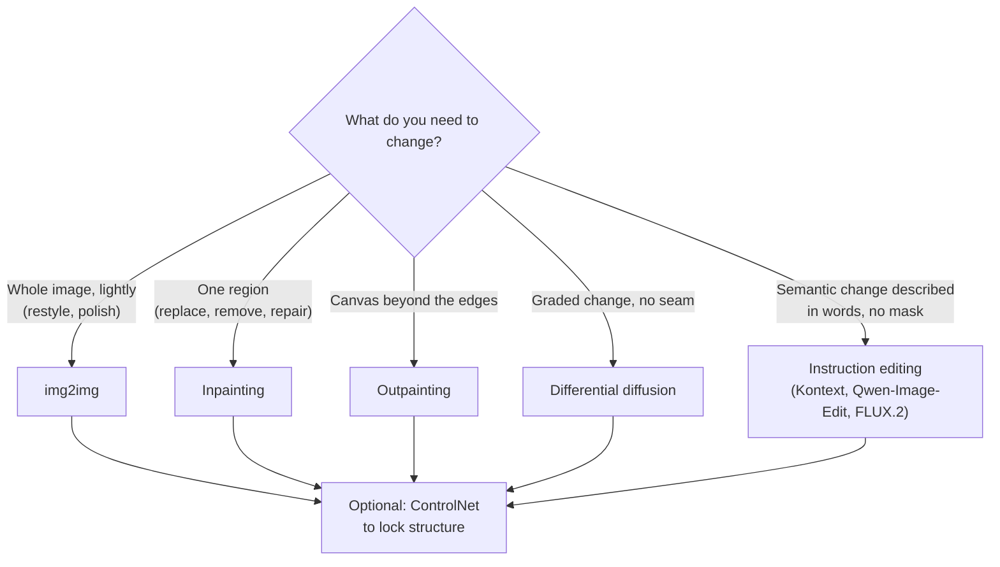
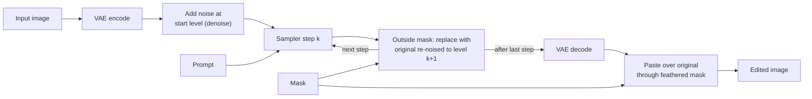
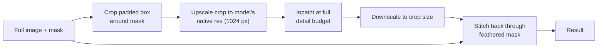
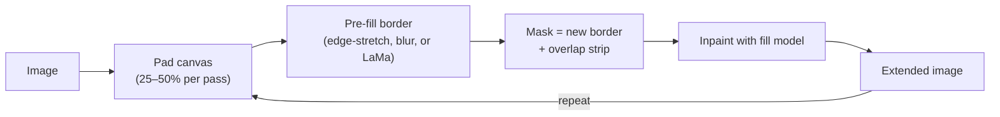
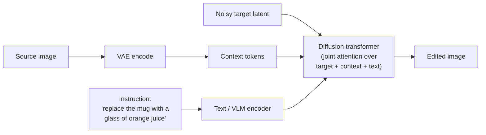
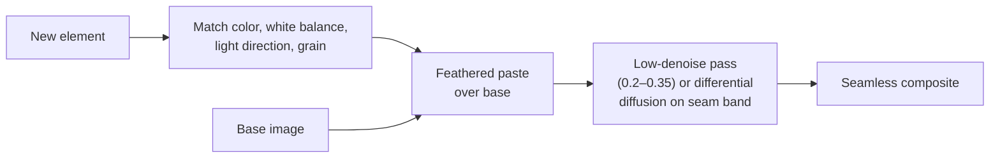
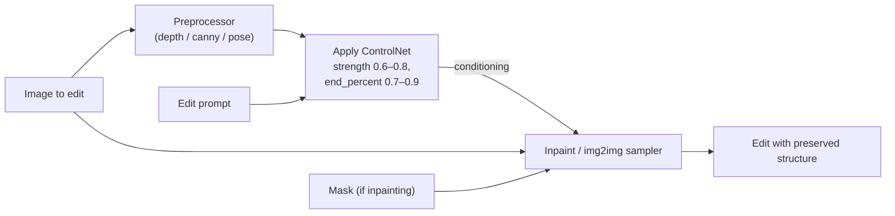

[AI/ML Documentation](./) &raquo; Inpainting &amp; Image Editing

Image editing with diffusion models changes an image you already have instead of generating one from noise. This page covers the two families of editing in use as of 2026: **mask-based editing** (img2img, inpainting, outpainting, differential diffusion), which works by partially re-noising an image and denoising it again, and **instruction-based editing** (FLUX.1 Kontext, Qwen-Image-Edit, FLUX.2), where a model trained on before/after pairs applies a plain-language instruction such as "make the jacket red". It also covers mask preparation, compositing, and pairing edits with ControlNet.

## Overview

A text-to-image run starts from pure noise and is not committed to any pixel. An edit starts from a real image, and most of it should survive. Every mask-based technique reduces to the same three operations:

1. Encode the image to latents with the VAE.
2. Add a controlled amount of noise, optionally only inside a mask.
3. Denoise back to a clean latent under a (possibly new) prompt, then decode.

Two parameters decide the result: **where** change is allowed (the mask) and **how much** change is allowed (denoise strength). Instruction editors hide both. The model decides which regions to touch and how strongly, based on the instruction.



| Technique | What changes | Source of new content | Typical use |
|-----------|--------------|-----------------------|-------------|
| img2img | Whole image, by a set amount | The re-noised original | Restyle, refine, sketch-to-render |
| Inpainting | Masked region only | Model, conditioned on the surroundings | Replace, remove, or repair an object |
| Outpainting | New canvas past the borders | Model, conditioned on the existing edge | Extend a scene, change aspect ratio |
| Differential diffusion | Every pixel, by a per-pixel amount | Per-pixel re-noise level | Feathered, seamless partial edits |
| Instruction editing | Whatever the instruction implies | Edit model reading the image as context | Attribute, object, text, style, and pose edits without masks |
| Regional prompting | New generation, prompt split by region | Per-region conditioning | Several subjects in one frame without concept bleed |

Regional prompting (attention masking, GLIGEN boxes, composable `AND` prompts) shapes a *new* generation rather than editing an existing one. It is covered in [Advanced Techniques](advanced-techniques.html#regional-and-layout-control).

## Denoise Strength

Denoise strength $d \in [0, 1]$ (also *denoising strength*) sets the noise level the edit starts from. That level caps how far the result can move from the original. At $d = 0$ nothing changes. At $d = 1$ the input is fully replaced by noise, so the run is plain generation, though some tools still use the image's size and seed.

### What denoise does to the latent

Every diffusion sampler walks a noise schedule from high noise to none. An edit skips the top of the schedule and injects the encoded image $\mathbf{z}_0$ partway down, at the level that corresponds to $d$. The general form is:

$$\mathbf{z}_{\text{start}} = a(t_d)\,\mathbf{z}_0 + b(t_d)\,\boldsymbol{\epsilon}, \qquad \boldsymbol{\epsilon} \sim \mathcal{N}(\mathbf{0}, \mathbf{I})$$

The coefficients depend on the model family:

| Formulation | Models | $a(t)$ | $b(t)$ |
|-------------|--------|--------|--------|
| Variance-preserving (DDPM) | SD 1.5, SDXL | $\sqrt{\bar{\alpha}_t}$ | $\sqrt{1 - \bar{\alpha}_t}$ |
| Variance-exploding (k-diffusion / EDM samplers) | SD 1.5, SDXL as run by A1111 and ComfyUI | $1$ | $\sigma_t$ |
| Rectified flow | SD3, FLUX, Qwen-Image | $1 - t$ | $t$ |

For rectified-flow models the mapping is especially direct. Denoise $d$ starts sampling at $t = d$ (before any schedule shift), so the starting latent is a straight interpolation between image and noise:

$$\mathbf{z}_{\text{start}} = (1 - d)\,\mathbf{z}_0 + d\,\boldsymbol{\epsilon}$$

**Step count depends on the tool.** By default A1111 and Forge run about $d \cdot N$ of the requested $N$ steps, so a low denoise is also faster. ComfyUI's KSampler builds a schedule for roughly $N / d$ steps and runs the last $N$, so it always runs the number of steps you asked for, spread over the shorter noise range.

### Choosing a value

| Denoise | Effect | Use for |
|---------|--------|---------|
| 0.10 – 0.25 | Texture, grain, micro-detail | Detail passes, upscale refinement, seam harmonizing |
| 0.30 – 0.45 | Shapes refined; composition and identity kept | Repairs, cleanup of a rough base |
| 0.50 – 0.65 | Clear restyle; layout kept | Style transfer, material and color swaps |
| 0.70 – 0.85 | Content reimagined; broad layout kept | Inpainted replacements, sketch-to-image |
| 0.90 – 1.00 | Near-total replacement | Full inpaint of a region, especially with dedicated inpaint models |

The two common mistakes are opposites. Too high a value changes things that should have stayed, such as a whole face redrawn when only an eye needed fixing. Too low a value lets the old content survive, and a removed object ghosts back. With a fixed seed, sweep denoise in steps of 0.1 and keep the lowest value that achieves the change. Rectified-flow models such as FLUX tend to preserve more structure than SDXL at the same nominal value, so tables tuned for one family transfer only approximately to the other.

## Masks

A mask is a single-channel image. White means regenerate, black means keep, and gray means partial change, which only differential diffusion honors. The mask often decides the quality of an inpaint before sampling starts.

### Mask guidelines

- **Cover all of it.** A mask that clips an object leaves a sliver the model tries to explain, often by regrowing the object. Include shadows, reflections, and contact points.
- **Feather the edge.** A hard binary boundary leaves a visible seam. A few pixels of blur, exposed as *mask blur* or *feather*, lets the two regions blend.
- **Grow before feathering.** Dilate the mask a few pixels first (ComfyUI `GrowMask`, or `grow_mask_by` on the inpaint-encode node) so the blur ramp lands outside the object, not inside it.
- **Give the model context and pixels.** A tiny mask gives the model little to work with. Crop around it and inpaint at native resolution (see [Crop-and-stitch](#crop-and-stitch)).
- **Size the mask to the edit.** Removal wants a snug mask with generous feather. Replacement wants a looser mask so the new object can have a different silhouette.

### Feathering

If $m(x, y) \in [0, 1]$ is the blurred mask, compositing regenerated pixels over the original is a per-pixel linear blend:

$$I_{\text{out}} = m\,I_{\text{new}} + (1 - m)\,I_{\text{orig}}$$

A Gaussian-blurred mask gives $m$ a soft ramp, so the seam fades over several pixels. Too small a radius leaves a line. Too large a radius lets the edit bleed into pixels you meant to keep.

```python
import numpy as np
from scipy.ndimage import binary_dilation, gaussian_filter

def prepare_mask(mask: np.ndarray, grow_px: int = 6, blur_sigma: float = 4.0) -> np.ndarray:
    """Grow then feather a binary mask (1 = regenerate, 0 = keep)."""
    grown = binary_dilation(mask > 0.5, iterations=grow_px)
    soft = gaussian_filter(grown.astype(np.float32), sigma=blur_sigma)
    return np.clip(soft, 0.0, 1.0)

def composite(orig: np.ndarray, generated: np.ndarray, soft_mask: np.ndarray) -> np.ndarray:
    """Per-pixel linear blend of float images in [0, 1], shape (H, W, C)."""
    m = soft_mask[..., None]
    return m * generated + (1.0 - m) * orig
```

### Mask sources

| Source | How it works | Best for |
|--------|--------------|----------|
| Brush | Paint in the tool's canvas | Quick one-off edits |
| SAM 2 (2024) | Click or box prompt gives a precise mask; tracks through video | Selecting one object cleanly |
| SAM 3 (Nov 2025) | Text or exemplar prompt ("red car") gives masks for *every* matching instance | Batch masking by concept, no clicking |
| Detectors (YOLO, face/hand models) | Auto-detect faces, hands, people | ADetailer-style automatic face and hand repair |
| Text-grounded detection | Grounding DINO, Florence-2: text to box, then SAM refines the mask | Pipelines that describe the target in words |
| Luminance / color key | Threshold on brightness or hue | Sky replacement, background keys |
| Alpha channel | Reuse existing transparency | Layered asset compositing |

In ComfyUI the Impact Pack and similar node packs chain detectors and SAM into the editing graph, so a "fix every face" pass needs no manual masking.

## Inpainting

Inpainting regenerates the masked region while conditioning on the unmasked surroundings, so new content matches the scene's lighting, perspective, and style.

### How it works

The simplest method works with any checkpoint and is sometimes called *latent blending*. At every sampling step, the latent outside the mask is overwritten with the original latent, re-noised to that step's level. Inside the mask the model denoises freely. Because the context is re-imposed at every step, the model always "sees" the surroundings it has to match.



The final pixel-space paste matters. VAE decoding slightly changes even untouched regions, so good pipelines composite the decoded result back over the original image instead of keeping the decode everywhere.

### Inpainting model types

| Approach | How it conditions | Strengths | Notes |
|----------|-------------------|-----------|-------|
| Base checkpoint + latent mask | Latent blending only | Works with any model or LoRA | Seams and incoherence at high denoise; the model never learned to fill holes |
| Dedicated inpaint checkpoint | Extra UNet input channels for mask and masked image (SD 1.5 inpainting, SDXL inpainting 0.1) | Clean fills at denoise 1.0 | One variant per base model; custom fine-tunes often lack one |
| FLUX.1 Fill [dev] | Mask and masked image concatenated to the transformer's input | Strong inpaint and outpaint for FLUX | Non-commercial dev license |
| ControlNet Inpaint / Fooocus inpaint patch | Side network or patch adds inpaint conditioning to a normal checkpoint | Keeps your favorite checkpoint | Quality depends on the model family |
| BrushNet / PowerPaint | Dual-branch: a separate branch encodes the masked image | Better boundary coherence on SD 1.5 and SDXL | Research-grade node packs |
| LaMa (non-diffusion) | Fast Fourier-convolution inpainter | Very fast, clean object *removal* | Cannot add new content; often used as a pre-fill before a diffusion pass |

For large replacements or removals, use a dedicated inpaint model, FLUX Fill, or an instruction editor. Base-model inpainting is fine for small touch-ups at moderate denoise.

In ComfyUI, **VAE Encode (for Inpainting)** blanks the masked pixels and expects denoise 1.0, which suits dedicated inpaint models. **InpaintModelConditioning** passes the original pixels and so works at any denoise. **Set Latent Noise Mask** is the plain latent-blending route for base checkpoints.

### Crop-and-stitch

A 200 px face in a 2048 px image gets very few latent pixels if you inpaint the full canvas. *Inpaint only masked* (A1111 and Forge) and crop-and-stitch nodes (ComfyUI) fix this:



This is why a face fixed with "only masked" looks much sharper than one fixed in whole-picture mode: it was regenerated at the model's native resolution. The padding around the crop controls how much context the model sees. Too little padding and the fill ignores the scene.

### Parameters

| Parameter | Effect | Typical value |
|-----------|--------|---------------|
| Denoise | How far the masked region may change | 0.3–0.5 repair; 0.75–1.0 replace (1.0 with inpaint models) |
| Mask blur / feather | Softens the seam | 4–16 px |
| Grow mask | Pushes the seam outside the object | 4–16 px |
| Masked content (A1111) | Starting point: `original`, `fill`, `latent noise`, `latent nothing` | `original` to repair; `fill` or `latent noise` to replace |
| Inpaint area | `whole picture` or `only masked` | `only masked` for small regions |
| Context padding | Surrounding pixels included in the crop | 32–128 px |

### Troubleshooting

| Symptom | Likely cause | Fix |
|---------|--------------|-----|
| Old object ghosts back | Denoise too low, or starting from `original` | Raise denoise, switch to `fill` or `latent noise`, or use an inpaint model at 1.0 |
| Visible seam or halo | Hard mask edge, or no pixel-space composite | Grow and feather the mask; composite over the original |
| Fill ignores lighting or perspective | Too little context | Increase padding, or inpaint whole picture |
| Blurry fill in a small region | Region inpainted at its tiny native size | Use only-masked or crop-and-stitch |
| Incoherent large fill | Base checkpoint at high denoise | Use an inpaint model, FLUX Fill, or an instruction editor |
| Color shift in untouched areas | VAE round trip on the whole image | Paste only the masked region back over the original |

## Outpainting

Outpainting extends an image past its borders. Mechanically it is inpainting where the mask is new, empty canvas and the context is the existing edge.



- **Extend in steps.** A huge border in one pass anchors on too little context and drifts or repeats. Extend by 25–50% of a dimension per pass.
- **Overlap the seam.** Include a strip of the original inside the mask so the model continues gradients instead of meeting a hard wall.
- **Pre-fill the padding.** Stretched edge pixels, a blurred fill, or a LaMa pre-fill give the sampler plausible colors to start from. A flat gray or black border biases the result toward flat regions.
- **Describe the new area.** The prompt should fit the scene and name what should appear there.
- **Use a fill-trained model.** SDXL inpaint checkpoints, FLUX.1 Fill, and instruction editors ("extend the scene to the left") produce far more coherent borders than base checkpoints.

Outpainting is iterative and pairs with the tiling and multi-stage workflows in [Advanced Techniques](advanced-techniques.html).

## Differential Diffusion

Differential diffusion (Levin and Fried, 2023) replaces the binary mask with a continuous **change map** $s(x, y) \in [0, 1]$ that sets how much each pixel may change. It needs no retraining and works with any diffusion model. ComfyUI ships it as a core node that wraps the model, used together with a grayscale mask.

### Mechanism

At each step $k$ of an $N$-step schedule, the change map is thresholded against the step's progress. Pixels whose strength exceeds the threshold are "free" and denoise normally. The rest are overwritten with the original re-noised to that step's level, just as in inpainting. The threshold falls as sampling proceeds, so high-strength pixels are released early at high noise and can change a lot. Low-strength pixels are released late and can only change fine detail. Pixels with $s = 0$ are never released.

$$\text{free}_k(x, y) = \mathbb{1}\!\left[\, s(x, y) > 1 - \frac{k}{N} \,\right], \qquad k = 0, 1, \ldots, N - 1$$

In effect each pixel gets its own denoise strength $d(x, y) = s(x, y)$, and the result is a smooth gradient of edit intensity with no seam to hide.

### Uses

- **Feathered edits.** A strong change in the subject fades into an untouched background.
- **Graduated restyling.** Restyle the foreground heavily and the background lightly in one pass.
- **Soft insertion and removal.** Blend a change continuously instead of pasting a hard patch.

The simplest change map is the blurred binary mask you would have used anyway. That alone removes most inpainting seams. Depth maps and segmentation maps make useful change maps too, for example "change the background more the farther away it is".

## Instruction-Based Editing

Since 2025 the most capable editors take **an image plus a text instruction** and no mask. They are trained on large sets of (source, instruction, target) triples, so they learn which regions to change and which to leave pixel-identical. The source image is fed in as context tokens alongside the noisy target latent (in-context conditioning), so the model can copy unchanged regions directly instead of reconstructing them.



### Open-weight editors

| Model | Released | Size | Notable for | License |
|-------|----------|------|-------------|---------|
| FLUX.1 Kontext [dev] | Jun 2025 | 12B | Character consistency, local edits, style transfer; low drift across successive edits | FLUX.1 non-commercial (commercial license sold separately) |
| Qwen-Image-Edit (2509, 2511) | Aug 2025 onward | 20B | Precise text editing inside images, multi-image input (up to three references in 2511), less drift in 2511 | Apache 2.0 |
| FLUX.2 [dev] | Nov 2025 | 32B | Generation and editing in one model, multiple reference images | FLUX non-commercial |
| FLUX.2 [klein] 4B / 9B | Jan 2026 | 4B, 9B | Fast unified generation and editing on consumer GPUs (4B in about 13 GB of VRAM) | 4B Apache 2.0; 9B non-commercial |

Hosted proprietary editors, such as Google's Gemini image models and OpenAI's GPT-Image models, work the same way from the user's side: image in, instruction in, edited image out.

### Instruction editing compared with mask-based editing

| | Instruction editing | Mask-based inpainting |
|---|---|---|
| Specifying the region | Implicit, from the instruction | Explicit mask |
| Global edits (relight, restyle, season change) | Natural | Awkward; needs img2img |
| Pixel-exact preservation | Good but not guaranteed; can drift in color or detail | Exact outside the mask after pasting |
| Text in images | Strong (Qwen-Image-Edit in particular) | Weak |
| Control over shape | Limited to wording and references | Mask plus ControlNet |
| Compute | Large models (12–32B) | Works with small SD 1.5 and SDXL models |

The two combine well. Run the instruction edit, then paste back only the region you meant to change through a feathered mask. That keeps the editor's semantic understanding and inpainting's pixel-exact preservation. Repeated instruction edits accumulate drift, so edit from the original where possible instead of chaining many generations.

Instruction editors can also be fine-tuned with paired before/after LoRAs, for example "turn a photo into a line drawing". See [LoRA Training](lora-training.html#edit-model-loras).

## img2img

img2img re-noises the whole image with no mask and denoises under a new or refined prompt. Denoise strength alone decides what survives.

| Pattern | Denoise | Approach |
|---------|---------|----------|
| Polish | 0.2–0.4 | Same prompt; clean up a rough base or upscaled image |
| Restyle | 0.45–0.65 | New style prompt; composition and subject survive |
| Reinterpret | 0.7–0.85 | Substantially new prompt; only broad layout survives |
| Sketch to render | 0.75–0.9 | Rough sketch or color block-in as input; the prompt describes the finished subject |

**Iterative refinement** runs img2img several times at low denoise and nudges the prompt each pass. This steers toward a target without one high-denoise jump that loses the composition. It is the manual version of the multi-stage upscaling pipeline in [Advanced Techniques](advanced-techniques.html).

For sketches, a high denoise alone keeps color placement but not linework. Add a Scribble or Lineart ControlNet (see [ControlNet-Guided Edits](#controlnet-guided-edits)) when the lines themselves must hold.

## Compositing and Blending

Whatever produced the new content, the last step is to make the seam invisible. Three methods, from crudest to most thorough:

1. **Pixel-space feathered paste.** The `composite()` blend above. It is fast and predictable, but it only hides the *edge* and cannot fix mismatched lighting or color.
2. **Latent compositing.** Combine latents through a mask, then decode once. The VAE decoder's receptive field smooths the boundary, so textures meet more naturally.
3. **Re-diffusing the seam.** After pasting, run img2img at about 0.2–0.35 over the whole image, or with differential diffusion over a band around the seam. The model harmonizes grain, lighting, and color across the boundary. This is the standard finishing pass for serious composites.



Match the sources before blending. A blend can hide an edge, but it cannot reconcile a daylight subject with a night scene. Instruction editors can take over the harmonizing step outright: "blend the pasted person into the scene's lighting".

## ControlNet-Guided Edits

[ControlNet](controlnet.html) constrains **structure** (pose, edges, depth) while the prompt and denoise control **content**. That makes it the natural partner for mask-based edits.

| Goal | ControlNet | Edit method | Why it works |
|------|-----------|-------------|--------------|
| Restyle a photo, keep composition | Depth, optionally with SoftEdge | img2img, denoise about 0.6 | Geometry is pinned while the look changes |
| Replace an object, keep its silhouette | Canny or Lineart on the region | Inpaint | Edges hold the shape; the fill supplies new material |
| Render a sketch faithfully | Scribble or Lineart | img2img, high denoise | Lines are locked; denoise renders them |
| Repaint clothing on a posed figure | OpenPose, optionally with Depth | Inpaint the garment mask | The body stays; only the garment changes |
| Add detail while upscaling | Tile | Tiled img2img, low denoise | Tiles stay consistent with the source |
| Fill with a normal checkpoint | Inpaint ControlNet | Inpaint | Adds inpaint conditioning without switching models |



Keep ControlNet strength moderate on edits and end control before the last steps (`end_percent`), so the sampler can add detail the control map never specified. Union ControlNets and FLUX ControlNets work the same way.

## Example: Replacing an Object

A typical "replace this object cleanly" pipeline:

1. **Select.** Use SAM 2 (click) or SAM 3 (text prompt, e.g. "coffee mug") to mask the object. Grow the mask about 8 px, feather it about 8 px, and include the shadow.
2. **Choose the engine.** Use an instruction editor if the change is easy to describe and the model fits in memory. Otherwise use an inpaint model or FLUX Fill at denoise 1.0, or a base checkpoint at 0.75–0.9 starting from `fill` or latent noise.
3. **Work at resolution.** Crop and stitch so the region is regenerated at native resolution.
4. **Constrain shape if needed.** Add Canny or Depth ControlNet when the replacement must match the old silhouette.
5. **Composite and harmonize.** Paste only the masked region back over the original, then run a 0.2–0.3 denoise pass or differential diffusion across the seam band.

## Practical Guidelines

- Sweep denoise with a fixed seed and keep the lowest value that works.
- Grow and feather every mask. Always paste the result back over the original pixels.
- Inpaint small regions with crop-and-stitch, never at their native size in a large canvas.
- Use a fill-trained model (inpaint checkpoint, FLUX Fill) or an instruction editor for large edits and removals.
- Outpaint in 25–50% increments with an overlap strip.
- Use differential diffusion when a seam would show, and instruction editing when the change is semantic ("make it winter") rather than local.
- Match color and lighting before blending, and finish composites with a low-denoise harmonizing pass.

## See Also

- [Stable Diffusion Fundamentals](stable-diffusion-fundamentals.html) – the diffusion process that editing builds on
- [FLUX Guide](flux-guide.html) – FLUX Fill, Kontext, and the rectified-flow family
- [ControlNet](controlnet.html) – constraining structure while editing content
- [Advanced Techniques](advanced-techniques.html) – regional prompting, latent composition, multi-stage upscaling
- [ComfyUI Guide](comfyui-guide.html) – building inpaint, outpaint, and img2img graphs
- [LoRA Training](lora-training.html) – including paired LoRAs for edit models
- [Base Models Comparison](base-models-comparison.html) – inpainting and editing support across model families
- [AI/ML Documentation Hub](./) – full AI/ML index
