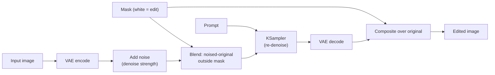
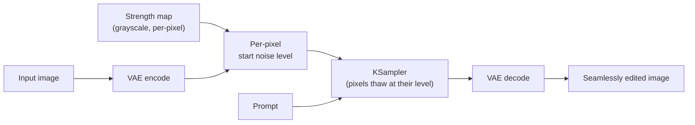
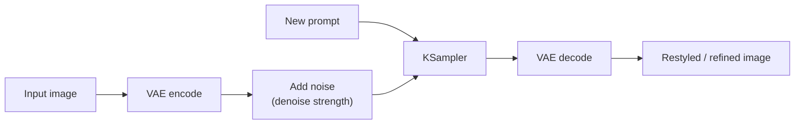
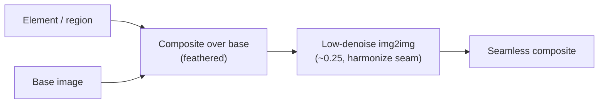
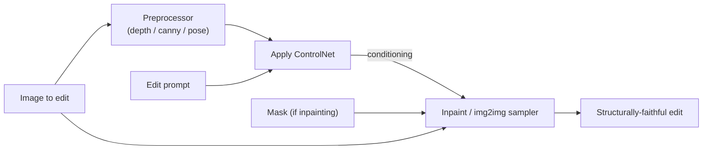

[AI/ML Documentation](./) &raquo; Inpainting &amp; Image Editing

Generation makes a picture from nothing; editing changes a picture you already have. Inpainting, outpainting, and img2img all share one mechanism — re-noise part of an existing image and let the model re-denoise it under a new prompt — and most editing skill is learning *how much* to re-noise *where*.

## Why Editing Is Different From Generation

A text-to-image run starts from pure noise and has no commitment to any pixel. Editing starts from a real image you want to *mostly keep*. The whole game is preserving what works while regenerating what doesn't — change a person's jacket without redrawing their face, extend a background past the original frame, or repair a malformed hand without rerolling a hard-won composition.

Every technique on this page is a variation on the same idea: convert the image to latents, add a controlled amount of noise, and denoise back down under guidance. The knobs that matter are **where** you allow change (the mask) and **how much** change you allow (denoise strength). Get those two right and the rest is workflow.

- **The Mask Picks Where.** A mask marks the region to regenerate. Soft, feathered edges blend; hard edges leave visible seams.
- **Denoise Picks How Much.** Denoise strength sets how far from the original the result can drift — low for subtle fixes, high for full replacement.
- **Blend, Don't Paste.** Feathering, latent compositing, and differential diffusion hide the seam so edits look native, not stitched.

## The Editing Family at a Glance

The techniques differ mainly in *which pixels they touch* and *where new canvas comes from*:

| Technique | What it changes | Where new content comes from | Typical use |
|-----------|-----------------|------------------------------|-------------|
| **img2img** | The whole image, lightly | The original image re-noised | Restyle, refine, polish a base |
| **Inpainting** | A masked region only | The model, conditioned on surroundings | Replace/remove/repair an object |
| **Outpainting** | New canvas beyond the edges | The model, conditioned on the existing edge | Extend a scene, change aspect ratio |
| **Regional prompting** | Different prompts per region | The model, per-region conditioning | Compose multiple subjects in one pass |
| **Differential diffusion** | A *continuous* strength map | Per-pixel re-noise amount | Feathered, seamless partial edits |

All of these can be combined with [ControlNet](controlnet.html) to constrain *structure* while you edit *content* — the last section covers that pairing.

## Denoise Strength: The Master Dial

Denoise strength (also called *denoising strength* or, in latent terms, the **starting noise level**) is the single most important parameter in editing. It controls how much noise is added to the input before re-denoising, which sets a ceiling on how far the result can move from the original.

Conceptually, a full diffusion run starts at maximum noise level $\sigma_{\max}$ and walks down to $0$. Editing at denoise strength $d \in [0, 1]$ skips the top of that schedule: it starts the image partway down at noise level $\sigma_{\text{start}}$ and only runs the remaining steps. At $d = 1.0$ the original is completely destroyed (pure generation); at $d = 0$ nothing changes.

$$\sigma_{\text{start}} = \sigma(d), \qquad n_{\text{steps run}} = \lceil d \cdot N_{\text{total}} \rceil$$

The starting latent is the encoded image plus noise scaled to that level:

$$\mathbf{z}_{\text{start}} = \mathbf{z}_0 + \sigma_{\text{start}}\,\boldsymbol{\epsilon}, \qquad \boldsymbol{\epsilon} \sim \mathcal{N}(\mathbf{0}, \mathbf{I})$$

where $\mathbf{z}_0$ is the VAE-encoded input image. Because only $\lceil d \cdot N \rceil$ steps actually run, a low denoise both limits drift *and* runs faster.

### Choosing a Denoise Value

The right value depends entirely on how much you want to change:

| Denoise | Effect | Use for |
|---------|--------|---------|
| 0.1 - 0.25 | Subtle: texture, grain, light polish | Detail passes, upscale refinement, gentle restyle |
| 0.3 - 0.45 | Moderate: refine shapes, fix small flaws | Cleaning up an img2img base, coherence fixes |
| 0.5 - 0.65 | Significant: clear restyle, keep layout | Style transfer, material/color swaps |
| 0.7 - 0.85 | Heavy: composition mostly survives, content reimagined | Strong reinterpretation, inpainting replacements |
| 0.9 - 1.0 | Near-total / total replacement | Full inpaint of a region, generation from a layout sketch |

A common mistake is using too *high* a denoise for a subtle edit ("why did the whole face change when I only wanted to fix the eye?") or too *low* for a replacement ("the old object is still ghosting through"). When in doubt, sweep denoise in steps of 0.1 with a fixed seed and pick the lowest value that achieves the change.

## Mask Preparation

For inpainting and outpainting, the **mask** decides which pixels the model is free to repaint. A mask is just a grayscale image: white = "regenerate this," black = "leave this alone," and gray = partial (with differential diffusion). The quality of an inpaint is often decided here, before any sampling happens.

### What Makes a Good Mask

- **Cover the whole thing you want gone.** A mask that clips an object leaves a sliver of the original, which the model will try to "explain" — often by regrowing the object. Mask generously, including shadows and reflections.
- **Feather the edges.** A hard binary edge produces a visible seam where regenerated pixels meet originals. A few pixels of Gaussian blur on the mask boundary lets the two blend. Most tools expose this as **mask blur** or **mask feather**.
- **Give the model room to work.** If you mask a tiny region, the model has little context and few pixels to express the new content. Inpaint at higher effective resolution (see *Inpaint Only Masked*, below) when the region is small.
- **Match the mask to the edit.** Removing an object wants a tight mask plus generous feather; replacing a large area wants a loose mask so the new content can reshape the boundary.

### Mask Edges and Feathering

Feathering blends the regenerated region into its surroundings by making the mask a smooth ramp instead of a step. If $m(x, y) \in [0, 1]$ is the (blurred) mask, the composite of regenerated pixels $I_{\text{new}}$ over originals $I_{\text{orig}}$ is a per-pixel linear blend:

$$I_{\text{out}} = m \cdot I_{\text{new}} + (1 - m) \cdot I_{\text{orig}}$$

A Gaussian-blurred mask gives $m$ a soft falloff at the boundary, so the seam fades over several pixels instead of appearing as a sharp line. Blur radius is a trade-off: too little leaves a seam, too much lets the edit bleed into pixels you wanted to keep.

```python
import numpy as np
from scipy.ndimage import gaussian_filter

def feather_mask(mask, blur_radius=8):
    """Soften a binary mask so inpaint edges blend instead of seaming.
    mask: float array in [0, 1], 1 = regenerate, 0 = keep."""
    soft = gaussian_filter(mask.astype(np.float32), sigma=blur_radius)
    return np.clip(soft, 0.0, 1.0)

def composite(orig, generated, soft_mask):
    """Linear blend per the feathered mask."""
    m = soft_mask[..., None]  # broadcast over color channels
    return m * generated + (1.0 - m) * orig
```

### Mask Sources

Masks rarely need to be hand-painted pixel by pixel:

| Source | How it works | Best for |
|--------|--------------|----------|
| Brush (manual) | Paint the region in the tool's canvas | Quick, arbitrary edits |
| Segmentation (SAM) | "Segment Anything" turns a click/box into a precise object mask | Clean object selection without tracing |
| Detection (YOLO/Impact Pack) | Auto-detect faces, hands, persons | Batch face/hand repair (ADetailer-style) |
| Threshold / luminance | Mask by brightness or color range | Sky replacement, isolating bright/dark areas |
| Alpha channel | Use an image's existing transparency | Compositing layered assets |

The **Segment Anything Model (SAM)** is the workhorse for precise masks — click an object and get a pixel-accurate selection, then feather it. The Impact Pack in ComfyUI wires SAM and detectors directly into the editing graph.

## Inpainting

Inpainting regenerates only the masked region while conditioning on the *unmasked* surroundings, so the new content matches the scene's lighting, perspective, and style. It is the tool for object removal, object replacement, and localized repair.

### How Inpainting Works

During sampling, the unmasked pixels are repeatedly "pinned" back to the (noised) original at each step, while the masked pixels are free to denoise toward the prompt. The model therefore always *sees* the surrounding context as it fills the hole:



There are two flavors:

- **Base-model inpainting.** Any checkpoint can inpaint by masking the latent and pinning the unmasked region. Simple, works everywhere, but the model wasn't trained for it, so large/high-denoise inpaints can be incoherent.
- **Dedicated inpainting models.** Models with extra input channels for the mask and masked image (e.g. SD 1.5 `*-inpainting`, SDXL inpainting checkpoints, and FLUX **Fill**) are trained specifically to fill masked regions. They produce far cleaner results, especially for object removal and large edits. There is also **ControlNet Inpaint**, which adds inpaint conditioning to a normal checkpoint without swapping models.

Prefer a dedicated inpainting model or ControlNet Inpaint whenever the edit is large or removal-style; base-model inpainting is fine for small touch-ups.

### Inpaint Only Masked (Higher Effective Resolution)

For a small region in a large image, inpainting the whole canvas wastes resolution — the masked area might be only 200px wide in a 2048px image, so the model has almost no pixels to work with. **Inpaint Only Masked** (A1111) / crop-and-stitch nodes (ComfyUI) fix this:

1. **Crop** a padded box around the mask.
2. **Upscale** that crop to the model's native resolution (512/1024).
3. **Inpaint** at full effective resolution, so the region gets the model's full detail budget.
4. **Downscale and composite** the result back into the original.

This is why a face fixed with "only masked" looks dramatically sharper than one fixed in full-image mode — it was effectively regenerated at 1024px instead of at its tiny native size.

### Inpainting Parameters

| Parameter | What it does | Typical |
|-----------|--------------|---------|
| Denoise strength | How far the masked region can change | 0.6 - 0.85 replace, 0.3 - 0.5 repair |
| Mask blur / feather | Softens the seam | 4 - 16 px |
| Masked content | What the region starts from: `original`, `fill`, `latent noise`, `latent nothing` | `original` for repair, `fill`/`latent noise` for replacement |
| Inpaint area | `whole picture` vs `only masked` | `only masked` for small regions |
| Mask padding | Context pixels included around the mask | 32 - 64 px |

The **masked-content** mode is subtle but important: starting from `original` biases toward the existing pixels (good for repairs), while `latent noise` / `fill` discards them (good when you want something genuinely different and the old object keeps ghosting through).

**Common inpainting pitfalls:**

- **The old object ghosts back.** Denoise too low, or masked-content set to `original`. Raise denoise toward 0.85 and switch to `latent noise`/`fill`.
- **Visible seam around the edit.** Mask not feathered. Add mask blur (8-16 px).
- **New content ignores the scene.** Mask padding too small — the model can't see enough surrounding context. Increase padding or inpaint `whole picture`.
- **Blurry, low-detail fill in a small region.** Inpainting full-image at the region's tiny native size. Switch to `only masked` / crop-and-stitch.
- **Incoherent large fills.** Using a base checkpoint for a big edit. Switch to a dedicated inpainting model or ControlNet Inpaint.

## Outpainting

Outpainting extends an image *beyond its original borders* — adding sky above, scenery to the sides, or converting a portrait crop to a wide landscape. Mechanically it is inpainting where the mask is the *new, empty canvas* and the "context" is the existing image edge.

### The Outpainting Loop


Key practices that make outpainting work:

- **Extend in modest steps.** Adding a huge border at once gives the model too little anchoring context and it drifts or repeats. Extend by ~25-50% of the dimension per pass and loop.
- **Overlap the seam.** Include a strip of the *original* image inside the masked/blended region so the model has gradient context to continue, not a hard wall.
- **Keep the prompt consistent with the scene**, and describe what should appear in the new area. A prompt that contradicts the existing image (e.g. "indoor" while extending an outdoor photo) produces a jarring transition.
- **Use a dedicated fill model.** SDXL inpainting checkpoints and FLUX Fill are markedly better at outpainting than base checkpoints because they're trained to invent coherent content from a one-sided context.

Because outpainting is iterative, it pairs naturally with the multi-stage and tiling workflows in [Advanced Techniques](advanced-techniques.html).

## Regional Prompting

Regional prompting routes *different prompts to different regions* of the same image so you can compose multiple subjects in a single pass — "a robot on the left, a forest on the right" without the two bleeding together. Unlike inpainting (which edits an existing image), regional prompting shapes a *generation* by partitioning the conditioning spatially.

### How It Works

The most common approach masks the **cross-attention** so each prompt only influences its region. You define a region as a `(prompt, mask, weight)` triple, and the sampler keeps each prompt's influence inside its mask. In effect, the conditioning for a pixel at $(x, y)$ is a mask-weighted combination of the regional prompts:

$$c(x, y) = \sum_{r} w_r \, m_r(x, y) \, c_r, \qquad \sum_{r} m_r(x, y) = 1$$

where $c_r$ is region $r$'s text embedding, $m_r$ its mask, and $w_r$ its weight. ComfyUI exposes this through *Conditioning (Set Area)* / *Set Mask* nodes; A1111/Forge through the **Regional Prompter** extension.

### Approaches to Regional Control

| Method | Granularity | Notes |
|--------|-------------|-------|
| Attention/area masking | Arbitrary painted regions | Most flexible; the default in ComfyUI |
| GLIGEN | Bounding boxes | "Put `a red car` in this box" — object-level layout without hand-painted masks |
| Composable diffusion | Whole-image concepts | `a cat AND a dog` denoises each concept and merges; per-term weights bias the balance |
| Prompt scheduling | Over *time*, not space | `[cat:dog:0.4]` switches prompt at 40% of steps — for hybrids/morphs |

Use **area masks** when you know the silhouette, **GLIGEN** when you know the box but not the shape, and **composable diffusion** when you just need two concepts to coexist anywhere in the frame. These overlap with the regional-prompting material in [Advanced Techniques](advanced-techniques.html), which covers the latent-composition cousin of this technique.

## Differential Diffusion

Differential diffusion generalizes inpainting from a **binary** mask to a **continuous** strength map. Instead of "regenerate here, freeze there," you specify *how much* to change each pixel — strong changes in the center of a region fading to none at its edges — without the hard seams a binary mask leaves.

### From Binary Mask to Strength Map

Standard inpainting pins unmasked pixels and fully regenerates masked ones — a step function. Differential diffusion replaces that with a per-pixel **change map** $s(x, y) \in [0, 1]$ that sets each pixel's *starting noise level* individually. A pixel with $s = 0$ is frozen; a pixel with $s = 1$ is fully regenerated; and anything between is partially re-noised:

$$\sigma_{\text{start}}(x, y) = s(x, y) \cdot \sigma_{\max}$$

At each denoising step, a pixel is only allowed to change once the schedule reaches its assigned noise level — so high-strength pixels participate in more steps and low-strength pixels "thaw" later (or never). The result is a smooth gradient of edit intensity rather than a masked patch.



### When to Use It

Differential diffusion shines where a binary mask would leave a seam or where you want a *gradient* of change:

- **Feathered edits** — a strong change in the subject fading smoothly into an untouched background, with no seam to hide.
- **Graduated style transfer** — restyle the foreground heavily and the background lightly in one pass.
- **Soft object insertion/removal** — blend a change into surroundings continuously instead of compositing a hard-edged patch.

You author the strength map the same way you'd author a mask — paint it, or derive it from a depth/segmentation map — but in grayscale rather than black-and-white. A blurred binary mask fed as a strength map is the simplest version, and already removes most seams.

## img2img Editing Workflows

img2img re-noises the *whole* image (no mask) and re-denoises under a new prompt. It is the foundation for restyling, refining, and chaining edits — and the denoise dial is everything.

### Core img2img Loop



Because there is no mask, the denoise strength alone governs how much survives. Three common patterns:

| Pattern | Denoise | What you do |
|---------|---------|-------------|
| **Polish / refine** | 0.2 - 0.4 | Same prompt, clean up an img2img or rough base |
| **Restyle** | 0.45 - 0.65 | New style prompt, keep composition and subject |
| **Reinterpret** | 0.7 - 0.85 | Heavily new prompt; only broad layout survives |

### Iterative Refinement

A powerful workflow is to run img2img *repeatedly* at low denoise, nudging the prompt each pass. Each iteration locks in the previous result and refines it, letting you steer toward a target gradually instead of in one risky high-denoise jump. This is the manual cousin of the multi-stage upscaling pipeline in [Advanced Techniques](advanced-techniques.html): each pass at a lower denoise refines rather than redraws.

### Sketch-to-Image (Low-Effort Input)

img2img also turns a rough sketch or color block-in into a finished render: feed the sketch as input, prompt for the finished subject, and use a *high* denoise (0.7-0.9) so the model reinterprets your shapes into real content while honoring the broad layout and color placement. For tighter adherence to the sketch's lines, pair it with a **Scribble ControlNet** (next section).

## Compositing & Blending

Whether content is inpainted, outpainted, or pasted in, the final step is making the seam disappear. Three levels of blending, from crudest to cleanest:

### 1. Pixel-Space Compositing (Feathered Paste)

The simplest composite is a feathered alpha blend (the `composite()` function above): paste the new region over the original through a soft-edged mask. Fast and predictable, but pixel-space blending can't fix lighting or color mismatches between the two sources — it only hides the *edge*.

### 2. Latent Compositing

Compositing in **latent space** before the VAE decode blends more cleanly than pasting pixels, because the decode harmonizes the seam: keep latent A where mask A is white, latent B where mask B is white, then decode the combined latent once. The VAE's receptive field smooths the boundary, so colors and textures meet more naturally. This is the latent-space cousin of regional prompting.

### 3. Re-Diffusion Over the Seam

The most thorough fix is to run a **low-denoise img2img pass over the seam** after compositing. Paste the new content (pixel or latent), then re-noise at ~0.2-0.35 and re-denoise the whole image so the model harmonizes lighting, grain, and color across the boundary. This is what makes a composited element look *photographed together* rather than cut and pasted, and it is the standard finishing pass for serious composites.



### Matching Before Blending

Before any blend, reduce the gap the blend has to hide: match **color/white balance**, **lighting direction**, and **grain/noise** between the sources. A blend hides an *edge*; it cannot reconcile a daylight subject pasted onto a nighttime scene. Match first, then blend, then optionally re-diffuse the seam.

## ControlNet-Assisted Edits

[ControlNet](controlnet.html) and editing combine naturally because they constrain *different things*: ControlNet fixes **structure** (pose, edges, depth) while the editing prompt and denoise control **content**. Several recurring patterns:

| Edit goal | ControlNet | Editing method | Why it works |
|-----------|-----------|----------------|--------------|
| Restyle a photo, keep composition | Depth (+ SoftEdge) | img2img, denoise ~0.6 | Depth/edges pin geometry while the prompt changes the look |
| Replace an object, keep its shape | Canny / Lineart on the region | Inpaint | Edges hold the silhouette; inpaint fills new content inside it |
| Finish a sketch faithfully | Scribble | img2img, high denoise | Scribble locks the lines; high denoise renders them |
| Repaint clothing on a posed figure | OpenPose | Inpaint (clothing mask) | Pose keeps the body; inpaint changes only the garment |
| Coherent high-res detail pass | Tile | img2img upscale, low denoise | Tile keeps tiles consistent while detail is added |

The **Inpaint ControlNet** deserves special mention: it adds inpaint conditioning to a *normal* checkpoint, so you can do clean masked edits without swapping to a dedicated inpainting model — useful when your favorite checkpoint has no inpainting variant.

A typical structured edit chains the two: preprocess the reference for structure, apply the ControlNet to the conditioning, then route that conditioning into an inpaint or img2img sampler.



Keep ControlNet strength moderate (~0.6-0.8) on edits so structure guides without overriding the new content — the same `end_percent` windowing from the [ControlNet guide](controlnet.html) applies: release control before the final steps so the edit gets detail the control map never specified.

## Putting It Together: A Practical Editing Recipe

Most real edits are a short pipeline, not a single node. A representative "replace an object cleanly" recipe:

1. **Select** the object with SAM (click → precise mask), then **feather** the mask (~8 px blur) and **pad** generously to include shadow.
2. **Choose denoise** by intent — ~0.85 with `latent noise` masked-content to fully replace; ~0.4 with `original` to repair.
3. **Inpaint only masked** so the region regenerates at full resolution, with a dedicated inpainting model (or ControlNet Inpaint).
4. **Optionally constrain structure** with a Canny/Depth ControlNet if the replacement must match the original silhouette.
5. **Composite back** and run a **low-denoise (~0.25) img2img pass** over the whole image to harmonize lighting and grain across the seam.

Each step maps to a section above: mask prep, denoise choice, inpainting, ControlNet-assisted edits, and compositing & blending.

## Best Practices

### Do

- Feather every inpaint/outpaint mask to avoid seams
- Sweep denoise strength with a fixed seed to find the minimum that works
- Use "only masked" / crop-and-stitch for small regions
- Match color, lighting, and grain *before* blending
- Finish composites with a low-denoise harmonizing pass
- Use a dedicated inpainting model (or ControlNet Inpaint) for large edits

### Avoid

- Pinning denoise at 1.0 for a subtle edit
- Hard binary masks where a seam will show
- Tiny masks with no padding (the model loses context)
- Outpainting a huge border in one pass
- Pasting elements without matching their lighting to the scene
- Expecting a binary mask to give the soft falloff that differential diffusion provides

## Key Takeaways

- **Editing is re-noising.** img2img, inpainting, and outpainting all add controlled noise to an existing image and re-denoise it — the skill is choosing *where* (mask) and *how much* (denoise strength).
- **Denoise strength is the master dial.** It sets a ceiling on drift, $\mathbf{z}_{\text{start}} = \mathbf{z}_0 + \sigma(d)\,\boldsymbol{\epsilon}$ — low for repairs and polish, high for replacements and sketch-to-image.
- **Feather masks and inpaint small regions at full resolution.** Soft mask edges blend the seam; "only masked" / crop-and-stitch gives a small region the model's full detail budget.
- **Differential diffusion replaces the binary mask with a continuous strength map**, $\sigma_{\text{start}}(x,y) = s(x,y)\,\sigma_{\max}$, for feathered, seamless gradient edits.
- **Blend, then re-diffuse the seam.** Latent compositing and a low-denoise harmonizing pass make pasted or inpainted content look photographed together, not stitched.
- **Pair with ControlNet to fix structure while you edit content** — Depth/Canny/Pose hold geometry while the prompt and denoise change the look.

## See Also

- [Stable Diffusion Fundamentals](stable-diffusion-fundamentals.html) - The diffusion process editing builds on
- [ControlNet](controlnet.html) - Constrain structure while you edit content
- [Advanced Techniques](advanced-techniques.html) - Regional prompting, latent composition, multi-stage workflows
- [ComfyUI Guide](comfyui-guide.html) - Build inpaint, outpaint, and img2img graphs
- [Base Models Comparison](base-models-comparison.html) - Inpainting and Fill model support across SD 1.5, SDXL, FLUX
- [Output Formats](output-formats.html) - Exporting and using edited results
- [AI/ML Documentation Hub](./) - Complete AI/ML documentation index
