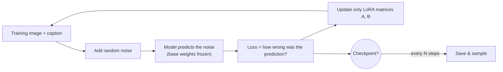

<div class="hero-section" style="background: linear-gradient(135deg, #667eea 0%, #764ba2 100%); color: white; padding: 3rem 2rem; margin: -2rem -3rem 2rem -3rem; text-align: center;">
  <h1 style="color: white; margin: 0; font-size: 2.5rem;">LoRA Training Guide</h1>
  <p style="font-size: 1.25rem; margin-top: 1rem; opacity: 0.9;">Create custom AI models for your specific styles, characters, or concepts using Low-Rank Adaptation without massive computing resources.</p>
</div>

<div class="code-example" markdown="1">
Create custom AI models that generate your specific styles, characters, or concepts - all without needing massive computing resources.
</div>

<div class="key-insights">
  <div class="insight-card">
    <i class="fas fa-images"></i>
    <h4>Data Over Everything</h4>
    <p>A small, clean, well-captioned dataset beats a large noisy one. Curation and captioning decide most of your result.</p>
  </div>
  <div class="insight-card">
    <i class="fas fa-sliders-h"></i>
    <h4>Tune the Essentials</h4>
    <p>Rank, learning rate, and step count are the levers that matter most. Start conservative and adjust from samples.</p>
  </div>
  <div class="insight-card">
    <i class="fas fa-balance-scale"></i>
    <h4>Avoid Overfitting</h4>
    <p>Watch for baked-in backgrounds and rigidity. Validate with varied prompts and stop before the model memorizes.</p>
  </div>
</div>

## Why Train Your Own LoRA?

Pre-made models cannot generate everything. When you need consistent characters, specific art styles, or custom objects, training a LoRA lets you teach the model exactly what you want.

**Consider the following before starting:**

- **What cannot existing models do?** If SDXL plus available LoRAs can produce what you need, training may not be necessary
- **Do you have good reference images?** Training requires 10-50+ quality images of your subject
- **Do you have the hardware?** Training needs 8GB+ VRAM (more for SDXL/FLUX)

### When Training Makes Sense

| Goal | Training Worth It? | Alternative |
|------|-------------------|-------------|
| Consistent character across many images | Yes | Use IP-Adapter (less consistent) |
| Specific art style not in existing LoRAs | Yes | Find similar LoRA, adjust prompts |
| Personal likeness (yourself, pet) | Yes | No good alternative |
| Generic style (anime, photorealistic) | Usually no | Use existing checkpoints/LoRAs |
| One-time generation | Usually no | Prompt engineering + img2img |

### What LoRA Training Actually Does

LoRA (Low-Rank Adaptation) adds small adjustment layers to an existing model. Instead of changing the entire model (which would require days of training and 100GB+ of data), LoRA learns focused modifications using your small dataset.

Mathematically, rather than updating a large weight matrix $W$ directly, LoRA freezes $W$ and learns a low-rank correction $\Delta W = BA$, where $B$ and $A$ are far smaller matrices:

$$W' = W + \Delta W = W + BA, \qquad A \in \mathbb{R}^{r \times k},\; B \in \mathbb{R}^{d \times r}$$

The **rank** $r$ (typically 4-128) is tiny compared to the full matrix dimensions, so you train only a few million parameters instead of billions. The result: a 20-200MB file that transforms how the base model handles your specific subject while preserving everything else it knows.

## Requirements

### Hardware Needs

| Base Model | Minimum VRAM | Comfortable VRAM | Training Time (1k steps) |
|------------|--------------|------------------|-------------------------|
| SD 1.5 | 6 GB | 8 GB | 15-30 minutes |
| SDXL | 12 GB | 16 GB | 30-60 minutes |
| FLUX Dev | 16 GB | 24 GB | 60-120 minutes |

Training also needs significant system RAM (16-32GB) and storage for datasets and outputs.

### Choosing a Training Tool

Several tools can train LoRAs:

| Tool | Best For | Difficulty |
|------|----------|------------|
| Kohya SS | Most users, local training | Medium |
| AI Toolkit | Docker-based workflows | Medium |
| Cloud services | No local GPU | Easy (but costs money) |

This guide uses concepts that apply to any tool. Specific settings may vary.

## Preparing Your Dataset

The quality of your training data determines the quality of your LoRA. This is where most training success or failure happens.

### How Many Images Do You Need?

| LoRA Type | Minimum Images | Recommended | Notes |
|-----------|---------------|-------------|-------|
| Style | 10 | 20-50 | Quality matters more than quantity |
| Character | 15 | 30-100 | Need variety in poses, angles, expressions |
| Object | 10 | 20-40 | Multiple angles, lighting conditions |
| Person likeness | 20 | 40-100 | Diverse photos, different contexts |

### Image Quality Checklist

Good training images are:
- Clear and well-lit (not blurry or dark)
- High resolution (at least 512x512, 1024x1024 preferred)
- Focused on the subject you want to teach
- Varied in pose, angle, and context
- Consistent in what they show (all the same character, all the same style)

### Writing Captions

Each image needs a text file with the same name describing what is in the image:

```
my_dataset/
  image01.jpg
  image01.txt
  image02.jpg
  image02.txt
```

### Caption Format

Include a unique trigger word plus a description:

```
xyz_character woman with red hair, smiling, casual clothes, outdoor setting
```

Key principles:
- **Use a unique trigger word** - Something distinctive like "xyz_style" or "sks_person"
- **Describe what varies** - If pose changes, describe the pose
- **Keep trigger word consistent** - Same trigger in every caption
- **Match model style** - Natural language for FLUX/SD3, tag-style for SD 1.5

### Quick Caption Guide by Model

| Model | Caption Style | Example |
|-------|---------------|---------|
| SD 1.5 | Tag-based | `xyz_style, digital art, landscape, mountains, sunset, vibrant colors` |
| SDXL | Mixed | `xyz_style digital painting of mountains at sunset, vibrant colors, detailed` |
| FLUX | Natural | `A beautiful mountain landscape at sunset in the xyz_style, with vibrant orange and purple colors` |

### Repeats and Epochs

Trainers usually express dataset exposure as **repeats x images x epochs = total steps**. "Repeats" is how many times each image is seen per epoch; "epochs" is how many full passes over the dataset. They are interchangeable for reaching a step count, but epochs are the convenient unit for saving checkpoints (save every epoch, then pick the best one). For a 20-image set, `10 repeats x 20 images x 10 epochs = 2000 steps`.

### Regularization Images (Optional)

For likeness and character LoRAs, some workflows add **regularization images** - generic images of the same broad class (e.g. "a photo of a person") generated by the base model itself. They act as a prior that discourages the LoRA from overwriting the model's general knowledge of that class, reducing "everything now looks like my subject" bleed. They are optional and add training time; skip them for style LoRAs, where class bleed is usually the goal.

## Training Settings

### The Essential Settings

These are the settings that matter most:

| Setting | What It Does | Start With |
|---------|--------------|------------|
| Learning rate | How fast the model learns | 0.0001 - 0.0002 |
| Steps | Total training iterations | 100 per image (e.g., 20 images = 2000 steps) |
| Rank | Complexity of the LoRA | 16-32 for most uses |
| Resolution | Training image size | Match your base model (512 or 1024) |

### Choosing the Right Rank

Rank determines how much the LoRA can learn. Higher is not always better.

| Rank | File Size | Best For |
|------|-----------|----------|
| 8-16 | 10-30 MB | Simple styles, small adjustments |
| 32 | 50-80 MB | Most character and style LoRAs |
| 64-128 | 150-300 MB | Complex subjects, maximum fidelity |

**Start with rank 32.** Increase only if results lack detail; decrease if overfitting occurs.

#### Rank vs. Alpha

Most trainers expose a second number alongside rank: **alpha** (sometimes `network_alpha`). Alpha scales the LoRA's contribution. The effective update is scaled by $\alpha / r$:

$$W' = W + \frac{\alpha}{r}\, BA$$

So alpha and rank interact:

- **alpha = rank** (e.g. 32/32) gives a scale of 1.0 - a common, safe default.
- **alpha = rank/2** (e.g. 16/32) halves the effective strength, which can stabilize training and reduce overfitting.
- Changing rank without changing alpha changes the *effective learning rate*, which is why blindly raising rank sometimes makes results worse, not better.

If unsure, set **alpha equal to rank** and tune the learning rate instead.

### LoRA Variants

Plain LoRA is the baseline, but trainers offer richer adapter types that decompose the update differently. They are all "a LoRA" at inference time:

| Variant | What it adds | When it helps |
|---------|--------------|---------------|
| LoRA | Standard low-rank $BA$ on attention layers | Default; works for almost everything |
| LoCon / LyCORIS | Also adapts convolutional layers | Styles where fine texture/brushwork matters |
| LoHa / LoKr | Hadamard / Kronecker factorization | More capacity at the same file size |
| DoRA | Splits weight into magnitude + direction | Often better fidelity at low rank |

Start with standard LoRA. Reach for LoCon when a style LoRA misses fine texture, and DoRA when you want more fidelity without raising rank.

### Learning Rate Guidelines

| Situation | Learning Rate | Why |
|-----------|---------------|-----|
| First attempt | 0.0001 | Safe starting point |
| Not learning fast enough | 0.0002-0.0003 | Speed up learning |
| Overfitting quickly | 0.00005-0.0001 | Slow down learning |
| Using Prodigy optimizer | 1.0 | Self-adjusting rate |

### How Many Steps?

A rough formula: **100 steps per training image**

| Dataset Size | Steps | Notes |
|--------------|-------|-------|
| 10 images | 1000-1500 | Watch for overfitting |
| 20 images | 2000-2500 | Good baseline |
| 50 images | 4000-5000 | Solid training |
| 100+ images | 5000-8000 | Diminishing returns above ~8000 |

### Starter Recipes

These are conservative, known-good starting points. Treat them as a baseline to adjust, not gospel - the right values depend on your dataset and tool.

| Base Model | Rank / Alpha | Learning Rate | Optimizer | Resolution | Notes |
|------------|--------------|---------------|-----------|------------|-------|
| SD 1.5 | 32 / 16 | 1e-4 | AdamW8bit | 512 | Fast iteration, large legacy ecosystem |
| SDXL | 16-32 / 16 | 1e-4 | AdamW8bit / Prodigy | 1024 | Use bucketing for mixed aspect ratios |
| FLUX Dev | 16 / 16 | 1e-4 (or Prodigy) | AdamW8bit / Prodigy | 1024 | Lower rank often suffices; very VRAM-hungry |

A few cross-cutting defaults that rarely need changing on a first run:

- **Optimizer:** `AdamW8bit` saves VRAM with negligible quality cost. **Prodigy** auto-tunes the learning rate (set LR to 1.0) and is forgiving for beginners.
- **Scheduler:** `cosine` or `cosine_with_restarts` - smooth decay avoids late-training instability.
- **Warmup:** ~5-10% of total steps lets the adapter settle before the full learning rate kicks in.
- **Batch size:** 1-2 is normal for consumer GPUs; raise only if VRAM allows, and scale learning rate up modestly if you do.
- **Mixed precision:** `fp16` (or `bf16` on newer GPUs) is standard and halves memory.

## The Training Process

### What Happens During Training

1. **Loading** - The base model and your dataset load into GPU memory
2. **Training loop** - For each step, the model sees images and adjusts weights
3. **Checkpoints** - Periodic saves let you test progress
4. **Completion** - Final LoRA file is saved

The training loop itself is the same denoising objective the base model was trained on, except only the small LoRA matrices are updated:



### Monitoring Training

Watch these indicators:

| Metric | Good Sign | Bad Sign |
|--------|-----------|----------|
| Loss | Decreasing steadily | Stuck high, or dropping then rising |
| Sample images | Improving each checkpoint | Same as base model, or identical to training images |
| Training speed | Consistent steps/second | Slowing significantly |

### When to Stop

Training should stop when:
- Sample images match your intent well
- Loss has stabilized (not dropping anymore)
- You have reached your target steps

Save checkpoints periodically so you can choose the best one, not just the last one.

## Common Training Scenarios

### Training a Style LoRA

**Goal:** Capture an artistic style from example images.

**Dataset:** 15-30 images in the style you want, diverse subjects

**Settings:**
- Rank: 16-32
- Steps: 1500-3000
- Learning rate: 0.0001

**Tip:** Include variety in subjects (people, landscapes, objects) so the LoRA learns the style, not specific content.

### Training a Character LoRA

**Goal:** Generate a consistent character in different poses and situations.

**Dataset:** 20-50 images of the character, varied angles and expressions

**Settings:**
- Rank: 32-64
- Steps: 2000-4000
- Learning rate: 0.0001

**Tip:** Include the character in different outfits and settings so the LoRA learns the character, not just one specific image.

### Training a Likeness LoRA

**Goal:** Generate images of a real person or pet.

**Dataset:** 30-100 photos, diverse lighting and contexts

**Settings:**
- Rank: 32-64
- Steps: 3000-5000
- Learning rate: 0.00005-0.0001

**Tip:** Include photos from different angles, with different expressions, and in different settings. Avoid training on just one or two photos.

## Troubleshooting Training

### Common Problems and Solutions

| Problem | Symptom | Fix |
|---------|---------|-----|
| Overfitting | Generates training images exactly | Reduce steps, lower learning rate, add more training data variety |
| Underfitting | LoRA has no visible effect | Increase steps, raise learning rate, verify trigger word in prompts |
| Style bleeding | Changes things you did not intend | Improve caption specificity, use lower LoRA strength when generating |
| Memory errors | Training crashes | Enable gradient checkpointing, use fp16, reduce batch size |
| Poor quality | Results worse than base model | Check dataset quality, ensure proper resolution, verify model compatibility |

### Diagnosing from Loss Curves

| Loss Behavior | What It Means | Action |
|---------------|---------------|--------|
| Steadily decreasing | Training is working | Continue as planned |
| Flat from start | Learning too slow | Increase learning rate |
| Drops then rises | Overfitting | Stop earlier, use that checkpoint |
| Erratic/oscillating | Learning rate too high | Reduce learning rate |
| Spikes suddenly | Corrupt data or bug | Check dataset, review settings |

## Using Your Trained LoRA

### Finding the Right Strength

Start at 0.7 strength and adjust based on results:

| Effect | Adjustment |
|--------|------------|
| Too subtle | Increase strength (0.8-1.0) |
| Too strong/artifacts | Decrease strength (0.4-0.6) |
| Good but want more | Try 0.8-0.9 |
| Overpowering other content | Try 0.5-0.6 |

### Combining with Other LoRAs

When stacking multiple LoRAs, reduce each strength:
- First LoRA: 0.6-0.8
- Second LoRA: 0.4-0.6
- Third LoRA: 0.3-0.4

If LoRAs conflict (similar subjects or styles), one may override the other. Test combinations to find what works.

### Remember Your Trigger Word

Your LoRA only activates when you include the trigger word in your prompt. If results look like the base model, check that your trigger word is present.

## Best Practices Summary

### Things That Lead to Success

- Use unique trigger words (xyz_style, not just "style")
- Include varied training images
- Start with conservative settings and adjust
- Save checkpoints so you can pick the best one
- Test with prompts different from your training captions

### Common Mistakes to Avoid

- Training too long (leads to overfitting)
- Using too few images (not enough variety)
- Generic trigger words (conflict with normal vocabulary)
- Skipping captions or using poor captions
- Not checking checkpoint quality during training

## Conclusion

LoRA training gives you the ability to add anything to AI image generation - your own art style, consistent characters, specific objects, or personal likenesses. The key is quality data and patient iteration.

Start with a small dataset and simple settings. If results are not quite right, you now know how to diagnose the problem and adjust. Each training run teaches you something about what works for your specific use case.

## Key Takeaways

<div class="takeaway-card" markdown="1">
- **LoRA = a tiny low-rank correction** $\Delta W = BA$ added to frozen base weights — you train millions of parameters, not billions, producing a 20-200MB file.
- **Data quality beats quantity.** 15-30 well-captioned, varied images often beat hundreds of repetitive ones; a unique trigger word avoids vocabulary conflicts.
- **Rank trades capacity for size, and alpha scales its strength** ($W' = W + \frac{\alpha}{r}BA$). Low rank (4-16) for styles, higher (32-128) for complex subjects; set alpha equal to rank if unsure.
- **Watch the loss and the samples, not just the step count.** Stop when samples match your intent and loss stabilizes; save checkpoints so you can pick the best, not the last.
- **Overfitting is the #1 failure** — too many steps or too little data makes the LoRA reproduce training images instead of generalizing.
</div>

---

<div class="see-also-card" markdown="1">
#### See Also

- [Model Types](model-types.html) - How LoRAs, checkpoints, and embeddings relate
- [Stable Diffusion Fundamentals](stable-diffusion-fundamentals.html) - The base models you'll train on
- [Base Models Comparison](base-models-comparison.html) - Choosing the right base for training
- [ComfyUI Guide](comfyui-guide.html) - Use trained LoRAs in advanced workflows
- [ControlNet](controlnet.html) - Combine LoRAs with ControlNet for precision control
- [Advanced Techniques](advanced-techniques.html) - Expert LoRA usage patterns
- [AI/ML Documentation Hub](./) - Complete AI/ML documentation index
</div>