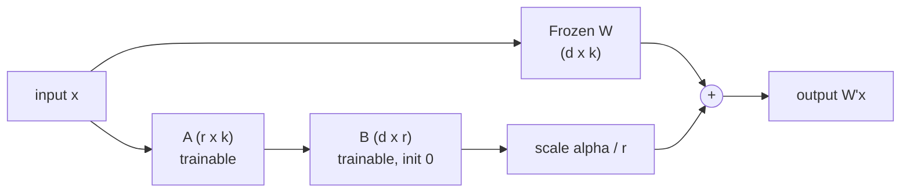
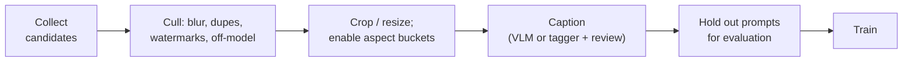
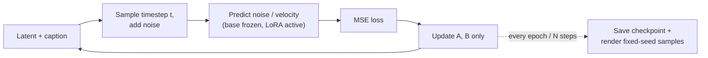

[AI/ML Documentation](./) &raquo; LoRA Training

A **LoRA** (Low-Rank Adaptation) is a small add-on file that teaches a frozen base model something new: a style, a character, a person's likeness, an object, or, for edit models, a transformation. This page covers how LoRA works, when training one is worth it, how to build and caption a dataset, which settings matter, current trainers and hardware needs as of 2026, and how to evaluate and troubleshoot a run. It focuses on diffusion models (SD 1.5, SDXL, FLUX, Qwen-Image, Z-Image, Wan). For LoRA and QLoRA on language models, see [Fine-Tuning & Transfer Learning](../technology/ai/fine-tuning.html#parameter-efficient-fine-tuning-peft).

## How LoRA Works

LoRA was introduced for large language models (Hu et al., 2021) and adopted for diffusion models in 2023. Instead of updating a large weight matrix $W \in \mathbb{R}^{d \times k}$, it freezes $W$ and learns a low-rank correction:

$$W' = W + \Delta W = W + \frac{\alpha}{r}\,BA, \qquad B \in \mathbb{R}^{d \times r},\; A \in \mathbb{R}^{r \times k},\; r \ll \min(d, k)$$

$A$ starts with small random values and $B$ starts at zero. At step 0, therefore, $\Delta W = 0$, and the model behaves exactly like the base model. Training updates only $A$ and $B$, which have $r(d + k)$ parameters instead of $dk$. For a $3072 \times 3072$ projection in a FLUX transformer block at rank 16, that is about 98 K trainable parameters instead of 9.4 M, or roughly 1%.



Some consequences follow directly from the formula:

- **The adapter is always active once loaded.** It modifies weights, not the prompt. A trigger word concentrates the learned concept so that you can call it up on demand. Leaving the trigger word out weakens the effect but does not turn the LoRA off.
- **Strength is a multiplier.** A strength of 0.7 at inference scales $\Delta W$ by 0.7. Stacking LoRAs adds their deltas, which is why stacked LoRAs interfere.
- **File size grows linearly with rank** and with the number of layers adapted. The same rank produces very different file sizes on SD 1.5 (UNet about 0.9 B parameters), SDXL (about 2.6 B), and FLUX.1 (12 B).
- **A LoRA is tied to its base family.** An SDXL LoRA works on SDXL fine-tunes such as Pony or Illustrious, with varying fidelity. It does not work on FLUX, and a FLUX.1 LoRA does not work on FLUX.2.

### Rank and alpha

The update is scaled by $\alpha / r$, so rank and alpha interact:

| Setting | Scale | Effect |
|---------|-------|--------|
| alpha = rank (e.g. 16/16) | 1.0 | Neutral default |
| alpha = rank / 2 | 0.5 | Halves the effective step size; steadier, needs a higher learning rate |
| alpha = 1 (common in older kohya configs) | $1/r$ | Very small updates; needs a much higher learning rate |

Changing rank without changing alpha changes the effective learning rate. That is one reason "just raise the rank" often makes results worse. Pick an alpha convention, keep it fixed, and tune the learning rate. **rsLoRA** (rank-stabilized LoRA) scales by $\alpha / \sqrt{r}$ instead, which keeps the update magnitude stable as rank grows. Some trainers expose it as an option.

### Adapter variants

At inference time all of these load as "a LoRA" in ComfyUI and diffusers, provided the loader supports the format.

| Variant | What changes | When it helps |
|---------|--------------|---------------|
| LoRA | Low-rank $BA$ on attention and linear layers | Default for nearly everything |
| LoCon (LyCORIS) | Also adapts convolution layers (UNet models) | SD 1.5 and SDXL styles where brushwork and texture matter |
| LoHa / LoKr | Hadamard or Kronecker-product factorization | More capacity per parameter; LoKr is popular for FLUX, Qwen-Image, and Z-Image |
| DoRA | Splits the weight into magnitude and direction and adapts the direction | Sometimes better fidelity at low rank; slower to train |

Start with plain LoRA. Try LoKr or DoRA only after a plain LoRA has shown where it falls short.

## When to Train a LoRA

| Goal | Train a LoRA? | Alternative |
|------|---------------|-------------|
| Consistent original character across many images | Yes | Instruction editors (FLUX Kontext, Qwen-Image-Edit, FLUX.2) with a reference image get close for a few shots |
| Specific style not covered by existing LoRAs | Yes | Style reference (IP-Adapter, FLUX Redux, multi-reference editors) |
| Likeness of a real person or pet | Yes, with consent | Reference-image editors give weaker identity over many shots |
| Product or object with exact details (logo, shape) | Yes | Reference editing plus inpainting for one-off images |
| Repeatable image *transformation* | Yes: an edit-model LoRA | Careful prompting of an instruction editor |
| Generic look (anime, photoreal) | Usually no | A suitable checkpoint or existing LoRA |
| One-off image | No | Prompting, img2img, or [inpainting](inpainting-editing.html) |

Multi-reference editors such as FLUX.2 and Qwen-Image-Edit-2511 now handle many "same character, new scene" requests without any training. A LoRA still wins when you need hundreds of consistent images, fine detail the reference cannot convey, or a small, fast base model.

## Training Tools and Hardware

### Trainers

| Tool | Interface | Model coverage (2026) | Notes |
|------|-----------|-----------------------|-------|
| [kohya-ss sd-scripts](https://github.com/kohya-ss/sd-scripts) (+ bmaltais GUI) | CLI and Gradio GUI | SD 1.5, SDXL, SD3.x, FLUX.1 | The long-standing reference implementation for UNet-era models |
| [musubi-tuner](https://github.com/kohya-ss/musubi-tuner) | CLI | Wan 2.1/2.2, HunyuanVideo, FramePack, FLUX.1 Kontext, FLUX.2, Qwen-Image and Qwen-Image-Edit, Z-Image | kohya's trainer for DiT image and video models |
| [ai-toolkit](https://github.com/ostris/ai-toolkit) (Ostris) | YAML configs + web UI | FLUX.1, FLUX.2 and klein, Qwen-Image, Z-Image, SDXL, SD 1.5, Wan 2.1/2.2, LTX | Aggressive memory optimizations (quantized base, layer offload); MIT license |
| [OneTrainer](https://github.com/Nerogar/OneTrainer) | Desktop GUI | SD-family, SDXL, FLUX, and more | All-in-one GUI with built-in captioning and masking tools |
| [SimpleTuner](https://github.com/bghira/SimpleTuner) | CLI | Broad DiT and UNet coverage | Research-oriented, many options |
| [diffusers training scripts](https://github.com/huggingface/diffusers/tree/main/examples) | Python | Reference scripts per model | Easiest to read and modify |
| Hosted trainers (Replicate, fal, Civitai, and others) | Web | Popular bases | No local GPU needed; you pay per run |

### VRAM

Memory depends on the base model's size, on whether the frozen base is quantized (fp8, NF4), on block-swapping or offloading to CPU RAM, on resolution, and on batch size. The figures below are typical single-GPU starting points for rank 16–32 at batch size 1, not hard limits.

| Base model | Parameters | Practical minimum | Comfortable |
|------------|-----------|-------------------|-------------|
| SD 1.5 | ~0.9 B UNet | 6–8 GB | 12 GB |
| SDXL / Pony / Illustrious | ~2.6 B UNet | 10–12 GB | 16–24 GB |
| FLUX.1 [dev] | 12 B | 12–16 GB with fp8 base and offload | 24 GB |
| Z-Image (Turbo) | ~6 B | 16 GB | 24 GB |
| Qwen-Image / Qwen-Image-Edit | 20 B | 24 GB with a quantized base and offload | 48 GB+ |
| FLUX.2 [dev] | 32 B | 24–32 GB with heavy quantization and offload | 80 GB class |
| Wan 2.1/2.2 (video, 14B) | 14 B | 24 GB with offload, short clips | 48 GB+ |

Budget 32–64 GB of system RAM when offloading, plus fast storage for cached latents.

## Building the Dataset

The dataset decides most of the result. A small, clean, varied, well-captioned set beats a large, repetitive one.



### Size and variety

| LoRA type | Minimum | Typical | What must vary |
|-----------|---------|---------|----------------|
| Style | 10–15 | 20–50 | Subjects and compositions, so the model learns the style instead of the content |
| Character | 15 | 20–60 | Poses, angles, expressions, outfits, backgrounds |
| Object / product | 10 | 15–40 | Angles, lighting, scale, context |
| Likeness | 15–20 | 20–50 | Lighting, expressions, distances, settings; no near-duplicates |
| Edit-model pair set | 20 pairs | 50–200 pairs | Input content, with the transformation kept consistent |

Image quality rules:

- Use at least the base model's native resolution: 512 px for SD 1.5, and 1024 px for SDXL, FLUX, Qwen-Image, and Z-Image.
- Enable aspect-ratio bucketing instead of square-cropping everything.
- Remove blur, JPEG artifacts, watermarks, text overlays, and near-duplicates. Ten copies of one photo teach that photo.
- Keep the concept consistent: every image should show the same character or the same style.

### Captioning

Each image gets a same-named `.txt` caption file:

```text
dataset/
  001.jpg   001.txt
  002.png   002.txt
```

The rule that matters: **caption what should stay promptable. Leave uncaptioned what should be absorbed into the concept.** If every image of your character has a red scarf and you never caption it, the scarf becomes part of the character. If you caption "red scarf", the scarf becomes optional and promptable. For a style LoRA, describe the content ("a lighthouse on a cliff at dusk") and leave the style itself undescribed, so it binds to the trigger.

Match the caption style to the text encoder the base model uses:

| Base family | Text encoder | Caption style | Example |
|-------------|--------------|---------------|---------|
| SD 1.5 | CLIP-L | Tags | `ohwx_style, landscape, mountains, sunset, vivid colors` |
| SDXL general | CLIP-L + OpenCLIP-G | Short sentence plus tags | `ohwx_style painting of mountains at sunset, vivid colors` |
| Pony / Illustrious (SDXL anime) | CLIP | Booru tags, in the model's tag conventions | `ohwx_char, 1girl, red hair, smile, outdoors` |
| FLUX, SD3.5, Qwen-Image, Z-Image, FLUX.2 | T5 or an LLM encoder | Natural-language sentences | `A mountain valley at sunset in the ohwx style, with orange and violet light` |

Automatic captioners: vision-language models such as JoyCaption, Florence-2, and Qwen2.5-VL / Qwen3-VL for natural language, and WD-series taggers for booru tags. Always review and edit their output. Captioners hallucinate details and often describe the very style you want absorbed.

**Trigger words** should be rare tokens that don't collide with real vocabulary (`ohwx_style`, not `style` or `vintage`). With LLM-based text encoders, a distinctive name ("Mira Voss") often works as well as a nonsense token.

### Edit-model LoRAs

Instruction editors (FLUX.1 Kontext, Qwen-Image-Edit, FLUX.2) can be fine-tuned on **paired** data: a control image, a target image, and an instruction caption such as "convert to a clean line drawing". The LoRA learns a transformation instead of a subject. musubi-tuner and ai-toolkit both support paired datasets for these models. Keep the transformation identical across pairs and vary the content, the same principle as ordinary LoRA datasets.

### Regularization images

For likeness and character LoRAs, **regularization (prior-preservation) images** are generic images of the same class ("a photo of a woman"), usually generated by the base model itself and trained at lower weight. They discourage the LoRA from pulling the whole class toward your subject, which otherwise makes every generated person look like the subject. They add training time and are optional. Skip them for style LoRAs, where shifting the whole output is the point.

## Training Settings

### Starting points

These are conservative first-run values to adjust from samples, not optimal settings.

| Base | Rank / alpha | LR (AdamW) | Resolution | Typical steps | Notes |
|------|--------------|------------|------------|---------------|-------|
| SD 1.5 | 32 / 16 | 1e-4 (UNet), 5e-5 (text encoder) | 512 | 1500–3000 | Training the text encoder helps tag-captioned sets |
| SDXL | 16–32 / 16 | 1e-4 | 1024, bucketed | 1500–3000 | Usually UNet only; min-SNR-gamma 5 is a common stabilizer |
| FLUX.1 [dev] | 16 / 16 | 1e-4 | 512–1024 mixed | 1000–3000 | UNet-equivalent only; distilled guidance means you sample at CFG 1 with guidance around 3.5 |
| Qwen-Image / Z-Image | 16–32 / 16–32 | 1e-4 | 1024, bucketed | 1500–3000 | Often trained with a quantized base; LoKr is a common alternative |
| Wan 2.x video | 16–32 | 1e-4 | Low-res clips (e.g. 480p, 33–81 frames) plus stills | 1500–3000 | Images alone can teach appearance; clips teach motion |

Settings that rarely need changing on a first run:

- **Optimizer:** AdamW8bit, which cuts optimizer memory with negligible quality cost. Prodigy (learning rate 1.0) adapts the rate automatically and forgives a bad LR guess, at some cost in control. Adafactor is a low-memory fallback.
- **Scheduler and warmup:** constant or cosine, with 0–10% warmup. With so few steps, the scheduler matters less than the peak learning rate.
- **Precision:** bf16 on Ampere or newer GPUs, fp16 otherwise. fp8 or NF4 for the frozen base on large DiT models.
- **Batch size:** 1–4. If you raise the batch size, raise the learning rate modestly, or keep it fixed and accept that each epoch has fewer steps.
- **Cache latents and text embeddings** to disk. Encoding is then paid once and the VAE and text encoders can leave VRAM.
- **Gradient checkpointing:** on whenever memory is tight. It costs roughly 20–30% speed.

### Steps, repeats, and epochs

$$\text{total steps} = \frac{\text{images} \times \text{repeats} \times \text{epochs}}{\text{batch size}}$$

Repeats and epochs trade off against each other. Epochs are the convenient unit for checkpointing, so you can save every epoch and choose among them. A useful rough target is 80–150 steps per image for small sets, with less per image as the set grows. Most LoRAs peak somewhere between 1,000 and 4,000 steps. Past that, extra steps usually overfit rather than add fidelity.

### Rank

| Rank | Use |
|------|-----|
| 4–8 | Simple styles, small adjustments, very large base models |
| 16 | Default for FLUX, Qwen-Image, and Z-Image; most styles and characters |
| 32 | SD 1.5 and SDXL characters; complex styles |
| 64–128 | Many concepts in one LoRA, or detailed multi-outfit characters; higher overfitting risk |

Large DiT models need less rank than SD 1.5 for the same concept, because each adapted matrix is wider.

## Monitoring and Evaluation



### Loss is a weak signal

Diffusion training loss is dominated by which random timestep was sampled. A high-noise step and a low-noise step differ in loss by more than your whole training run will reduce it. Raw loss therefore looks like noise, and even a smoothed curve falls only slightly and flattens early. Use loss to catch outright failures, such as NaN values, sudden spikes, or a steady climb that means the learning rate is too high. Do not use it to decide when the LoRA is done. Some trainers offer a **validation loss** at fixed timesteps and seeds on held-out images, which is much more stable and worth enabling if available.

### Judge by samples

Render a fixed prompt set with a fixed seed at every checkpoint:

- **Training-like prompts.** Is the concept learned?
- **Novel prompts.** New scene, pose, outfit, or medium. Does it generalize, or does it drag in training backgrounds?
- **Prompts without the trigger.** How much does the LoRA leak into unrelated generations?
- **Strength sweep** at 0.6, 0.8, and 1.0. A good LoRA works at 0.7–1.0. One that only works at 1.2 or higher is undertrained, and one that breaks above 0.6 is overtrained.

Pick the **earliest** checkpoint that passes the novel-prompt tests, not the last one saved. An x/y grid of checkpoints against strengths makes the choice quick.

## Troubleshooting

| Symptom | Likely cause | Fix |
|---------|--------------|-----|
| Outputs reproduce training images, same backgrounds and poses | Overfitting | Use an earlier checkpoint, lower LR or steps, add variety, caption backgrounds |
| No visible effect | Underfitting, or wrong base, or the loader skipped layers | Raise steps or LR; check base-family compatibility and loader warnings about unmatched keys |
| Everything looks like the subject | Class bleed | Add regularization images, lower the strength, use a rarer trigger |
| Concept only appears with one outfit or setting | That attribute was never captioned | Caption the attribute so it becomes promptable, or add variety |
| Style LoRA changes content too | Content was absorbed | Describe content in captions; diversify subjects |
| Oversaturated, fried, or noisy images | LR too high, alpha/rank scale too high, or too many steps | Lower LR, use an earlier checkpoint, check the alpha convention |
| NaN loss or black images | fp16 overflow, or LR far too high | Use bf16, lower LR, check the VAE precision setting |
| Out of memory | Resolution, batch size, or unquantized base too large | Gradient checkpointing, cache latents, fp8 or NF4 base, block swap, smaller buckets |

## Using a Trained LoRA

- **Start at strength 0.7–1.0** and adjust from there. In ComfyUI, *LoraLoader* has separate model and CLIP strengths. The CLIP strength matters only if the text encoder was trained.
- **Include the trigger** and the vocabulary your captions used.
- **When stacking LoRAs**, lower each strength so the combined effect stays sane. For example, use a character at 0.8 and a style at 0.5. Two LoRAs trained on overlapping layers for competing concepts will fight. Test the combination, or merge them deliberately.
- **Match the family.** SDXL LoRAs transfer imperfectly between SDXL fine-tunes (base SDXL, Pony, Illustrious, NoobAI). Train on the base you plan to generate with.
- **Check licenses.** A LoRA inherits the base model's license terms. For example, FLUX.1 [dev] and FLUX.2 [dev] derivatives fall under Black Forest Labs' non-commercial license unless you have a commercial license. Likeness LoRAs of real people need consent and are banned on many hosting sites.

## See Also

- [Model Types](model-types.html) – how LoRAs, checkpoints, and embeddings relate
- [Base Models Comparison](base-models-comparison.html) – choosing a base to train on
- [FLUX Guide](flux-guide.html) – FLUX architecture and guidance settings
- [Pony and Fine-tunes](pony-and-finetunes.html) – SDXL fine-tune families and LoRA compatibility
- [Inpainting & Image Editing](inpainting-editing.html) – instruction editors that edit-model LoRAs extend
- [Fine-Tuning & Transfer Learning](../technology/ai/fine-tuning.html) – LoRA, QLoRA, and PEFT for language models
- [ComfyUI Guide](comfyui-guide.html) – loading and stacking LoRAs in workflows
- [AI/ML Documentation Hub](./) – full AI/ML index
