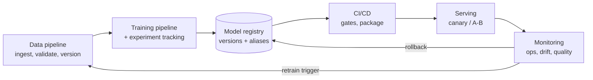
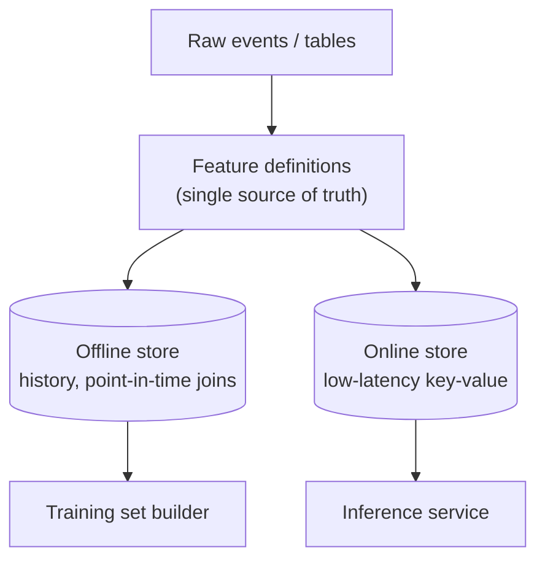
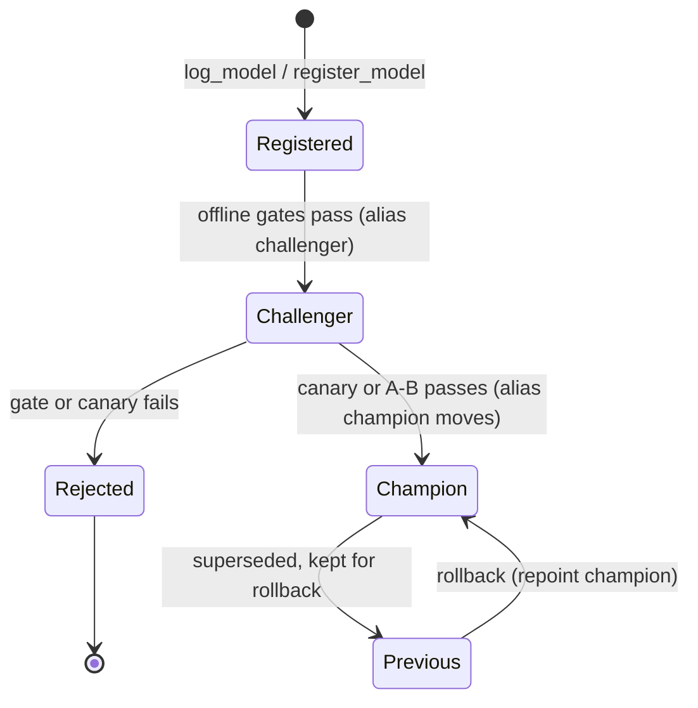
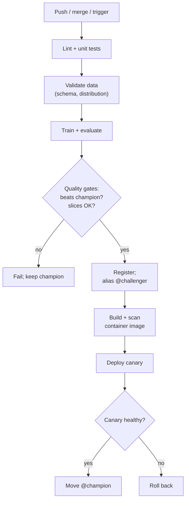
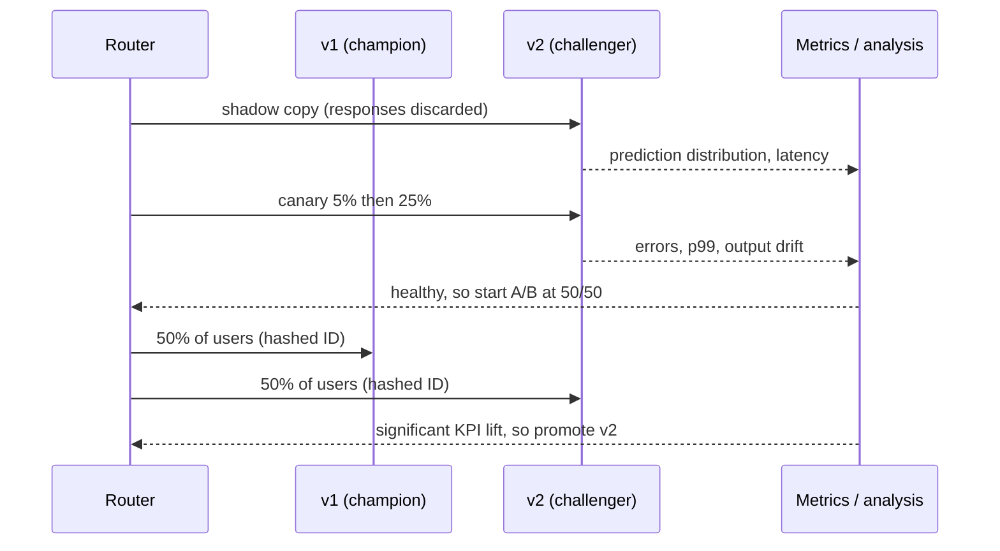
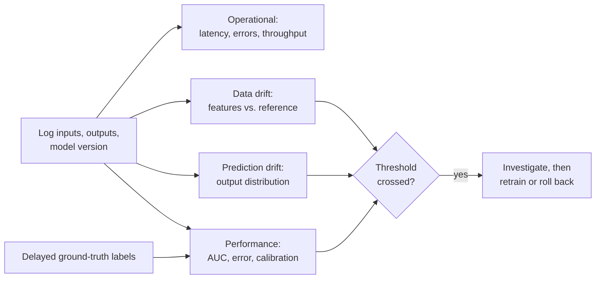
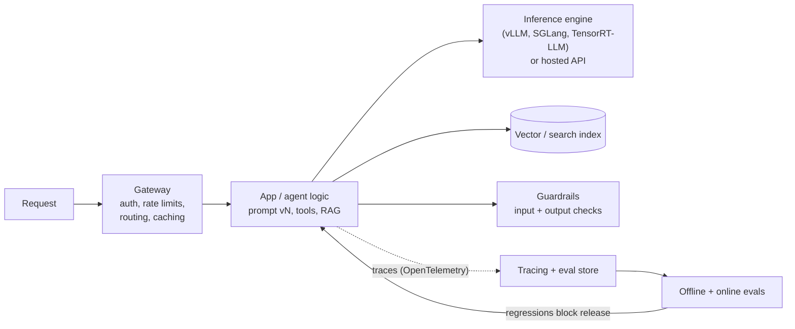

[AI/ML Documentation](./) &raquo; MLOps &amp; Production

**MLOps** is the practice of building, deploying, and operating machine-learning models reliably. A conventional service depends on code. An ML service depends on **code, data, and model artifacts**, and all three change over time. MLOps keeps that three-way dependency reproducible (any model can be rebuilt), gated (no model ships without passing checks), and observable (degradation is detected and acted on). This page covers the lifecycle end to end: data and pipeline versioning, experiment tracking, the model registry, CI/CD and continuous training, serving, progressive rollout and A/B testing, drift monitoring, retraining and rollback, and the additional concerns of serving large language models. Tool references reflect the ecosystem as of late 2026.

## The ML Lifecycle

A production ML system is a loop, not a one-way pipeline. Each stage produces artifacts and signals that feed the next:



Two feedback edges make this *operations* rather than a script. The **retrain trigger** fires when monitoring decides the live model is stale, and it starts a new run. The **rollback** fires when a deploy is bad, and it reverts to a known-good version. Everything else exists to make those two decisions safe and, where appropriate, automatic.

### How ML operations differ from DevOps

| Concern | Conventional software | Machine learning |
|---------|----------------------|------------------|
| Versioned inputs | Code, config | Code, config, **data**, hyperparameters, random seeds |
| Definition of correct | Deterministic; unit-testable | Statistical; judged by metrics on held-out data and live outcomes |
| Typical failure | Crash, exception, error rate | **Silent degradation** as inputs or the world drift |
| Reproducibility | Check out and build | Needs pinned data, environment, and seeds; GPU nondeterminism remains |
| Tests | Unit, integration | Also data validation, model quality gates, slice and fairness checks |
| Release | Deploy when tests pass | Deploy, then measure on live traffic before full promotion |

The key difference is silent failure. A model rarely throws an exception when it gets worse. Accuracy decays as the input distribution moves away from the training distribution, and only monitoring reveals it.

### Maturity levels

A common way to describe how automated an ML system is, following Google's MLOps levels:

| Level | What is automated | Typical signal |
|-------|-------------------|----------------|
| 0 – Manual | Nothing. Notebooks produce a model file that is handed to engineering | Models retrained rarely; nobody can rebuild last quarter's model |
| 1 – Pipeline automation | The training pipeline itself, with continuous training on triggers | New data produces a new candidate without human steps |
| 2 – CI/CD for pipelines | The pipeline code is itself tested, built, and deployed | Changing a feature or model architecture ships through CI like any code |

Most teams need level 1 for their important models. Level 2 pays off when many models or many engineers share pipelines.

## Data and Training Pipelines

If you cannot say exactly which rows trained a model, you cannot debug, audit, or rebuild it. The goal is for one commit to pin code, data, and configuration together.

### Data versioning

[DVC](https://dvc.org/) layers data versioning onto Git. Large files live in remote storage (S3, GCS, Azure, SSH), and Git tracks small `.dvc` pointer files that hold content hashes. DVC has been maintained under lakeFS since lakeFS acquired it in November 2025, and it remains an independent open-source tool. [lakeFS](https://lakefs.io/) itself versions whole data lakes with Git-like branches over object storage, which suits data too large or too shared for per-repo pointers. Table formats such as Delta Lake and Apache Iceberg provide "time travel" on tables, another way to pin the exact snapshot used for training.

```bash
# Track a dataset: DVC caches it and writes a small pointer file
dvc add data/raw.parquet
git add data/raw.parquet.dvc data/.gitignore
git commit -m "Add raw training data v1"

# Push the bytes to remote storage; Git stays small
dvc remote add -d storage s3://my-bucket/dvc-store
dvc push
```

DVC also describes the pipeline as a DAG in `dvc.yaml`. Stages re-run only when their dependencies change:

```yaml
stages:
  prepare:
    cmd: python src/prepare.py data/raw.parquet data/clean.parquet
    deps: [src/prepare.py, data/raw.parquet]
    outs: [data/clean.parquet]
  train:
    cmd: python src/train.py data/clean.parquet model.pkl
    deps: [src/train.py, data/clean.parquet]
    params: [train.lr, train.epochs]   # read from params.yaml
    outs: [model.pkl]
    metrics: [metrics.json]
```

`dvc repro` walks the DAG and rebuilds only what is stale. `dvc exp run -S train.lr=0.05` runs parameter variants without committing each one. The result is that `git checkout <sha> && dvc pull && dvc repro` reconstructs a historical model.

For larger systems, a workflow orchestrator runs the same DAG idea across a cluster with retries, schedules, and lineage. Examples are Airflow, Dagster, Prefect, Kubeflow Pipelines, Flyte, Metaflow, and ZenML.

### Feature stores

Recommendation, fraud, and other tabular systems suffer from **train/serve skew**: a feature such as `avg_purchase_7d` gets computed one way in the offline training SQL and another way in the online service. A feature store (Feast, Tecton, Databricks Feature Store, Hopsworks) defines each feature once and serves it through two paths:



**Point-in-time correctness** is the subtle requirement. A training row for an event at time $t$ may only use feature values known before $t$. Joining on the latest values instead leaks the future into training, which inflates offline metrics and fails in production.

### Data validation

Validate schema and distribution before data reaches training, and fail loudly. Common tools are [Great Expectations](https://greatexpectations.io/) (GX Core), TensorFlow Data Validation, and [Pandera](https://pandera.readthedocs.io/):

```python
import pandera.pandas as pa

schema = pa.DataFrameSchema({
    "age":     pa.Column(int,   pa.Check.in_range(0, 120)),
    "income":  pa.Column(float, pa.Check.ge(0), nullable=False),
    "country": pa.Column(str,   pa.Check.isin(["US", "UK", "DE", "JP"])),
    "label":   pa.Column(int,   pa.Check.isin([0, 1])),
})

# lazy=True collects every violation before raising SchemaErrors
validated = schema.validate(df, lazy=True)
```

The statistics captured at training time become the **reference baseline** that production drift monitoring later compares against.

## Experiment Tracking

A project can produce hundreds of runs, each with dozens of settings. Experiment tracking records every run's inputs, code version, and outputs, so results can be compared and reproduced instead of living in notebook cells and files named `model_final_v2_REAL.pkl`.

| Log | Examples |
|-----|----------|
| Parameters | Learning rate, batch size, architecture, feature set |
| Lineage | Git SHA, data version or hash, upstream pipeline run |
| Metrics | Loss curves, AUC or F1 per epoch, slice metrics |
| Artifacts | Model weights, signature and input example, plots, confusion matrix |
| Environment | Library versions, container image digest, hardware |

[MLflow](https://mlflow.org/) (open source, self-hosted or managed, with major version 3 since mid-2025) and [Weights &amp; Biases](https://wandb.ai/) (hosted, acquired by CoreWeave in 2025) are the dominant trackers. Other options include Comet, ClearML, Aim, and cloud-native trackers in SageMaker, Vertex AI, and Azure ML. Neptune.ai shut down its hosted service in March 2026 after being acquired by OpenAI.

```python
import mlflow
from mlflow.models import infer_signature

mlflow.set_experiment("churn-classifier")

with mlflow.start_run(run_name="xgb-depth8"):
    mlflow.log_params({"max_depth": 8, "lr": 0.1, "n_estimators": 400})
    mlflow.set_tags({"git_sha": git_sha, "data_version": data_hash})

    model, history = train(X_train, y_train, X_val, y_val)
    for epoch, val_loss in enumerate(history):
        mlflow.log_metric("val_loss", val_loss, step=epoch)
    mlflow.log_metric("test_auc", evaluate(model, X_test, y_test))

    mlflow.sklearn.log_model(
        model,
        name="model",
        signature=infer_signature(X_val, model.predict_proba(X_val)),
        input_example=X_val[:5],
        registered_model_name="churn-classifier",   # also creates a registry version
    )
```

The W&amp;B equivalent:

```python
import wandb

with wandb.init(project="churn", config={"max_depth": 8, "lr": 0.1}) as run:
    for epoch, val_loss in enumerate(history):
        run.log({"val_loss": val_loss, "epoch": epoch})
    run.log({"test_auc": auc})
```

The most important habit is to **tag every run with its code SHA and data version**. That turns "I think this was the good model" into "commit `a1b2c3` plus data `f9e8d7`, rebuildable on demand". Tracker comparison views, such as parallel-coordinate plots and overlaid curves, then show which settings drive the metric. The best run becomes a registry candidate.

## Model Registry

Experiment tracking answers "what did we try?" The registry answers "what is approved to run, and where?" It stores named, versioned model artifacts with lineage (run, code SHA, data version, metrics), and it controls which version each environment uses.

### Aliases instead of stages

Older MLflow registries moved versions through fixed **stages** (Staging, Production, Archived). MLflow deprecated stages in 2.9 in favor of **aliases** and **tags**, and MLflow 3 keeps that model. An alias is a mutable, named pointer to one version, such as `champion` or `challenger`. Serving code loads `models:/churn-classifier@champion`, so promotion and rollback are just a matter of repointing the alias. Other registries (W&amp;B, SageMaker, Vertex AI) follow the same idea under names like "aliases", "tags", or "approval status".



```python
from mlflow import MlflowClient

client = MlflowClient()
name = "churn-classifier"

# Candidate passed offline gates: mark it as the challenger
client.set_registered_model_alias(name, "challenger", version=candidate_version)
client.set_model_version_tag(name, candidate_version, "validation", "passed")

# Canary succeeded: promote by moving the champion alias
client.set_registered_model_alias(name, "champion", version=candidate_version)

# Serving side always resolves the alias at load time
model = mlflow.pyfunc.load_model(f"models:/{name}@champion")
```

Organizations that separate environments often use one registered model per environment, such as `churn-classifier-staging` and `churn-classifier-prod`, and promote with `client.copy_model_version(...)`. That lets registry access control mirror environment boundaries.

### Versioning conventions

Registry version numbers increase monotonically. It still helps to record a semantic version in a tag and apply the usual meaning to ML:

- **Major:** a breaking change to the input or output contract, such as a new feature schema or a changed label definition. Consumers must change.
- **Minor:** retrained on new data or with a better architecture, with the same contract.
- **Patch:** repackaging or a bug fix with no intended behavior change.

Without lineage the registry is just a file server. With lineage, every production prediction can be traced to the code, data, and parameters that produced the model.

## CI/CD and Continuous Training

CI/CD for ML extends the code pipeline with data and model stages. The build checks that code compiles and passes tests, and also that the **resulting model is good enough**.



**Continuous training (CT)** is the ML-specific addition. The training pipeline runs automatically on a schedule, on new data, or on a drift alert, and it produces a candidate that goes through the same gates. CT is what closes the lifecycle loop without a person running notebooks.

### Test types

| Test | Question it answers |
|------|---------------------|
| Unit | Does the feature-engineering code behave correctly on edge cases? |
| Data validation | Does incoming data match the expected schema and distribution? |
| Quality gate | Does the candidate beat the champion, or a fixed baseline, on the same held-out set? |
| Slice / fairness | Is performance acceptable on key sub-populations and edge cases? |
| Behavioral | Invariance tests (irrelevant perturbations don't flip predictions) and directional tests |
| Integration / contract | Does the packaged service load the model and honor the API schema and latency budget? |

```python
def quality_gate(candidate: dict, champion: dict, min_delta: float = 0.005,
                 max_slice_drop: float = 0.01) -> None:
    """Fail the build unless the candidate improves overall without hurting any slice."""
    assert candidate["auc"] >= champion["auc"] + min_delta, (
        f"AUC {candidate['auc']:.4f} does not beat champion "
        f"{champion['auc']:.4f} by {min_delta}")
    for slice_name, champ_auc in champion["slices"].items():
        cand_auc = candidate["slices"][slice_name]
        assert cand_auc >= champ_auc - max_slice_drop, (
            f"slice {slice_name!r} regressed: {cand_auc:.4f} < {champ_auc:.4f}")
```

Compare candidate and champion on the **same** evaluation set, frozen and versioned. Comparing against a number recorded months ago on different data is meaningless.

### Packaging

A model that passes its gates is packaged as a deployable unit, usually a container image with the weights (or a pointer to them), inference code, and a pinned environment. MLflow can build images directly (`mlflow models build-docker`). [BentoML](https://www.bentoml.com/) packages Python services with a class-based API:

```python
import bentoml
import numpy as np

@bentoml.service(resources={"cpu": "2"}, traffic={"timeout": 10})
class Churn:
    def __init__(self) -> None:
        self.model = bentoml.sklearn.load_model("churn-classifier:latest")

    @bentoml.api
    def predict(self, features: np.ndarray) -> np.ndarray:
        return self.model.predict_proba(features)[:, 1]
```

`bentoml build` produces a versioned "Bento", and `bentoml containerize` turns it into an OCI image. BentoML 1.2 introduced this `@bentoml.service` style, and it replaced the older `bentoml.Service` / runner / `bentoml.io` API.

## Serving and Deployment

| Pattern | Latency | Use case |
|---------|---------|----------|
| Online (request/response) | Milliseconds | Fraud checks, ranking, personalization |
| Streaming | Seconds | Scoring events from Kafka or Kinesis as they arrive |
| Batch | Minutes to hours | Nightly scoring of whole tables, precomputed recommendations |
| Edge / on-device | Milliseconds, offline | Mobile, embedded; see [Model Compression](model-compression.html) |

On Kubernetes, [KServe](https://kserve.github.io/website/) is the standard serving layer. It became a CNCF incubating project in 2025. An `InferenceService` declares the model format and storage location, and KServe supplies the runtime (sklearn, XGBoost, PyTorch, ONNX, Triton, Hugging Face, vLLM), autoscaling, and traffic management. Canary traffic splitting uses KServe's Knative-based serverless mode:

```yaml
apiVersion: serving.kserve.io/v1beta1
kind: InferenceService
metadata:
  name: churn-classifier
spec:
  predictor:
    canaryTrafficPercent: 10          # new revision gets 10%, previous keeps 90%
    minReplicas: 1                    # 0 enables scale-to-zero
    model:
      modelFormat:
        name: sklearn
      storageUri: s3://models/churn/v4
```

Applying a new `storageUri` with `canaryTrafficPercent: 10` creates a new revision that takes 10% of traffic. Raising the value ramps the rollout. Removing it promotes the new revision to 100%. Setting it to 0 sends all traffic back to the last good revision. Tools like Argo Rollouts or Flagger can automate the ramp based on metrics.

Other serving options:

| Server | Notes |
|--------|-------|
| NVIDIA Triton Inference Server | Multi-framework, dynamic batching, GPU-optimized; common for vision and TensorRT models |
| BentoML / BentoCloud | Python-native packaging and serving |
| Ray Serve | Python composition of multi-model pipelines on Ray clusters |
| Seldon Core 2 / MLServer | Seldon Core moved to the Business Source License in January 2024; MLServer stays Apache 2.0 |
| Cloud endpoints | SageMaker, Vertex AI, Azure ML managed endpoints |
| TorchServe | Archived in August 2025 and no longer maintained. Migrate to Triton, KServe, or a custom server |

Kubernetes fundamentals are covered in the [Kubernetes docs](../technology/kubernetes/). General deployment strategies are in [CI/CD: Deployment Strategies](../technology/ci-cd/deployment.html).

## Canary Releases and A/B Testing

Offline metrics predict. Only live traffic proves. Progressive delivery moves real traffic onto a new model gradually, so a regression is caught while it affects few users.

| Strategy | Question | How it works |
|----------|----------|--------------|
| Shadow (dark launch) | Does the new model behave sanely on real inputs? | Copy traffic to v2, discard its responses, compare offline |
| Canary | Is v2 *healthy*? | Route a small percentage, watch errors, latency, and prediction distribution, then ramp or abort |
| Blue-green | Can we switch instantly and switch back? | Run v2 beside v1, flip all traffic, keep v1 warm |
| A/B test | Is v2 *better* for the business? | Randomize users, compare a KPI with a pre-planned statistical test |
| Multi-armed bandit | Which variant should get more traffic *while* testing? | Shift traffic toward the winner adaptively; less clean inference than A/B |

A canary asks an operational question and watches health metrics for minutes to hours. An A/B test asks a causal question and needs a pre-computed sample size, often days or weeks of traffic.



### Designing an A/B test

1. **Choose one primary metric** and a minimum detectable effect (MDE) before starting. Also list guardrail metrics, such as latency, complaints, and revenue, that must not regress.
2. **Compute the sample size in advance.** For comparing two conversion rates $p_A$ and $p_B = p_A + \delta$, each arm needs approximately:

   $$n \approx \frac{\left(z_{1-\alpha/2} + z_{1-\beta}\right)^2 \left[p_A(1-p_A) + p_B(1-p_B)\right]}{\delta^2}$$

   With $\alpha = 0.05$ and power $0.8$, $z_{1-\alpha/2} = 1.96$ and $z_{1-\beta} = 0.84$. Detecting a lift from 5.0% to 5.5% needs about 31,000 users per arm.
3. **Randomize by a stable hash of the user ID**, so each user always sees the same variant.
4. **Run whole business cycles**, meaning complete weeks, to absorb day-of-week effects.
5. **Do not stop the moment the result looks significant.** Repeatedly checking and stopping early inflates false positives. If you need to check early, use sequential tests designed for it.

At the end, the two-proportion $z$-test compares observed rates with the pooled rate $\hat{p}$:

$$z = \frac{\hat{p}_B - \hat{p}_A}{\sqrt{\hat{p}(1 - \hat{p})\left(\frac{1}{n_A} + \frac{1}{n_B}\right)}}$$

The result is significant at the 5% level (two-sided) when $|z| > 1.96$. Variance-reduction methods such as CUPED, which adjusts for each user's pre-experiment behavior, can cut the required sample size substantially.

A canary gate, by contrast, is a simple health rule:

```python
def canary_decision(canary: dict, baseline: dict,
                    max_error_delta: float = 0.01, max_p99_ratio: float = 1.2) -> str:
    """Operational gate: abort on any health regression, otherwise continue the ramp."""
    if canary["error_rate"] > baseline["error_rate"] + max_error_delta:
        return "ROLLBACK"
    if canary["p99_latency_ms"] > baseline["p99_latency_ms"] * max_p99_ratio:
        return "ROLLBACK"
    if canary["prediction_psi"] > 0.25:        # outputs look very different from v1
        return "HOLD"
    return "PROMOTE"
```

## Monitoring and Drift

Monitoring has three layers. The first is **operational**: is the service up and fast? The second is **data**: do the inputs still look like the training data? The third is **model quality**: is the model still right? Operational monitoring reuses standard [observability](../observability/) tooling such as Prometheus, Grafana, and OpenTelemetry. The other two layers are ML-specific.



### Types of drift

| Phenomenon | What changes | Example |
|------------|--------------|---------|
| Data drift (covariate shift) | $P(X)$ changes; $P(Y \mid X)$ stable | New user demographics after a marketing campaign |
| Concept drift | $P(Y \mid X)$ changes | Fraudsters change tactics; the same pattern now means something else |
| Label drift (prior shift) | $P(Y)$ changes | Fraud rate doubles overall |
| Upstream data bugs | Not the world, the pipeline | A unit changes from dollars to cents; a column silently becomes null |

Upstream bugs are the most common cause of drift alerts in practice, so check the pipeline before retraining. Concept drift is the hardest to detect. Inputs can look identical while the correct answers change, so detecting it requires labels.

### Detecting data drift

Data drift can be measured immediately, without labels, by comparing live feature distributions with the training reference:

- **Population Stability Index (PSI):** binned comparison of proportions. Widely used in credit risk.
- **Kolmogorov–Smirnov test:** for continuous features. With large samples it flags trivial differences, so use effect size, not only p-values.
- **Jensen–Shannon distance / Wasserstein distance:** bounded or scale-aware distances between distributions.
- **Chi-squared test:** for categorical features.

$$\text{PSI} = \sum_{i=1}^{B} (a_i - e_i)\,\ln\!\left(\frac{a_i}{e_i}\right)$$

Here $e_i$ is the reference proportion in bin $i$ and $a_i$ is the live proportion. Conventional thresholds are below 0.1 for stable, 0.1 to 0.25 for moderate shift, and above 0.25 for significant shift.

```python
import numpy as np

def psi(expected: np.ndarray, actual: np.ndarray, bins: int = 10) -> float:
    """Population Stability Index with quantile bins taken from the reference sample."""
    edges = np.quantile(expected, np.linspace(0, 1, bins + 1))
    edges[0], edges[-1] = -np.inf, np.inf
    e = np.histogram(expected, edges)[0] / len(expected)
    a = np.histogram(actual, edges)[0] / len(actual)
    e, a = np.clip(e, 1e-6, None), np.clip(a, 1e-6, None)   # avoid log(0)
    return float(np.sum((a - e) * np.log(a / e)))
```

Drift in an unimportant feature may not matter. Weight alerts by feature importance, and treat **prediction drift** (a shift in the model's output distribution) as the higher-signal summary. Libraries such as [Evidently](https://www.evidentlyai.com/) and [NannyML](https://www.nannyml.com/) package these tests, baselines, and reports. Commercial platforms include Arize, Fiddler, and the cloud providers' monitors. WhyLabs discontinued its hosted platform after Apple acquired it in 2025, and released the code as open source. Its `whylogs` profiling library remains available.

### Detecting concept drift and performance loss

When labels arrive, monitor the live metric directly, such as rolling AUC, error rate, or calibration, broken down by important slices. When labels are delayed by weeks or months (loan defaults, churn), use proxies:

- a rising share of low-confidence predictions
- disagreement between the champion and a shadow challenger
- **performance estimation**, such as NannyML's confidence-based estimation, which infers expected accuracy from a calibrated model's scores

## Retraining and Rollback

Monitoring is useful only if it leads to action. Retraining addresses a stale model. Rollback addresses a broken deploy.

### Retraining triggers

| Trigger | Mechanism | Best when |
|---------|-----------|-----------|
| Scheduled | Cron, nightly to monthly | Drift is steady and predictable |
| Volume-based | After $N$ new labeled rows | Data arrives in bursts |
| Drift-triggered | PSI or prediction-drift threshold crossed | Drift is irregular |
| Performance-triggered | Live metric below its SLO | Labels arrive promptly |

```python
def should_retrain(m: dict) -> tuple[bool, str]:
    if m["rolling_auc"] < m["baseline_auc"] - 0.03:
        return True, "performance below SLO"
    if m["prediction_psi"] > 0.25 and m["upstream_checks_ok"]:
        return True, "prediction drift with healthy pipeline"
    if m["days_since_train"] > 30:
        return True, "scheduled refresh"
    return False, "healthy"
```

A retrained model is a **candidate**, not an automatic replacement. It still passes the quality gates and a canary. Automatically promoting a model because drift was detected is dangerous, because drift alerts often fire precisely when the new data is corrupted.

### Rollback

With aliases and versioned serving, rollback is a pointer change plus a traffic switch:

```python
# Point production back at the last known-good version
client.set_registered_model_alias("churn-classifier", "champion", version=last_good)
client.set_model_version_tag("churn-classifier", bad_version, "status", "rolled_back")
# Serving reloads models:/churn-classifier@champion (restart or hot reload),
# or KServe traffic is shifted back to the previous revision.
```

Rehearse rollback. It should be a routine, tested, reversible operation, not an improvised redeploy at 3 a.m. Keep the previous champion's image and weights warm or quickly pullable.

## Operating LLM Applications

Serving large language models (and applications built on them) adds concerns that classic MLOps tooling did not cover. This is sometimes called **LLMOps**. The lifecycle loop still applies, but the artifact often includes a prompt, retrieval configuration, and tool definitions alongside, or instead of, model weights that you trained.



| Concern | Classic ML | LLM applications |
|---------|-----------|------------------|
| Versioned artifact | Model weights | Model or provider version, **prompt templates**, retrieval index, tool schemas |
| Quality measurement | Labeled metrics (AUC) | Eval suites: reference answers, rubric-based LLM-as-judge, human review, task success |
| Serving bottleneck | Compute per request | GPU memory for KV cache; batching; long contexts |
| Latency metrics | p50 and p99 per request | **Time to first token (TTFT)**, inter-token latency, tokens per second |
| Cost | Per instance | Per token; varies with prompt length and caching |
| Failure modes | Drift, silent degradation | Also hallucination, prompt injection, unsafe output, provider model updates |

### Serving engines

Self-hosted LLM serving has consolidated around **vLLM** and **SGLang**, both using paged KV-cache management, continuous batching, prefix caching, and speculative decoding. NVIDIA **TensorRT-LLM** and **Dynamo** target maximum throughput on NVIDIA hardware. Hugging Face's Text Generation Inference (TGI) entered maintenance mode in December 2025, and Hugging Face now points new deployments to vLLM or SGLang. On Kubernetes, **llm-d** (a CNCF Sandbox project started in 2025) and KServe's `LLMInferenceService` add LLM-aware scheduling, prefix-cache-aware routing, and disaggregated prefill/decode serving. Quantization (FP8, INT4 AWQ/GPTQ) and distillation are the main levers for cost. See [Model Compression](model-compression.html).

### Evaluation and observability

- **Versioned eval sets in CI.** Every prompt or model change runs against a fixed evaluation set, graded by exact match, code execution, or rubric-scored LLM-as-judge. A regression blocks the release, the same way a quality gate does for a classic model.
- **Tracing.** Record each request as a trace of spans (retrieval, model call, tool call) with inputs, outputs, token counts, and latency. The OpenTelemetry GenAI semantic conventions standardize these attributes. MLflow 3 Tracing, Langfuse, Arize Phoenix, and W&amp;B Weave all consume traces.
- **Online signals.** User feedback, task completion, escalation rates, and sampled LLM-as-judge scoring of live traffic stand in for ground-truth labels.
- **Pin provider versions.** Hosted model aliases (such as "latest") change behavior without a deploy. Pin dated model versions and re-run evals before moving to a new one.
- **Guardrails.** Validate inputs (prompt-injection and PII detection) and outputs (schema validation, content policy), and log the decisions for audit.

## Tooling Landscape

The ecosystem is modular. Pick one tool per concern and connect them so the loop runs end to end.

| Concern | Open source / self-hosted | Managed / commercial |
|---------|---------------------------|----------------------|
| Data and pipeline versioning | DVC, lakeFS, Delta Lake, Apache Iceberg | Databricks, cloud object-store versioning |
| Orchestration | Airflow, Dagster, Prefect, Kubeflow Pipelines, Flyte, Metaflow, ZenML | Astronomer, Vertex AI Pipelines, SageMaker Pipelines |
| Feature store | Feast, Hopsworks | Tecton, Databricks Feature Store, SageMaker / Vertex feature stores |
| Experiment tracking | MLflow, Aim, ClearML | Weights &amp; Biases, Comet, managed MLflow |
| Model registry | MLflow Model Registry | W&amp;B Registry, SageMaker, Vertex AI, Azure ML, Unity Catalog |
| Packaging | BentoML, MLflow Models, Docker | BentoCloud |
| Serving | KServe, Triton, Ray Serve, vLLM, SGLang, llm-d | SageMaker, Vertex AI, Azure ML endpoints |
| Rollout automation | Argo Rollouts, Flagger | Cloud-native traffic splitting |
| Monitoring | Evidently, NannyML, whylogs, Prometheus + Grafana | Arize, Fiddler, Datadog, cloud model monitors |
| LLM tracing and evals | MLflow Tracing, Langfuse, Arize Phoenix, OpenTelemetry | W&amp;B Weave, LangSmith, Braintrust |

Several tools that were common in older MLOps stacks have changed status:

| Tool | Status |
|------|--------|
| TorchServe | Archived in August 2025; no further fixes |
| Neptune.ai | Hosted service shut down in March 2026 |
| Hugging Face TGI | Maintenance mode since December 2025 |
| Seldon Core | Business Source License since January 2024 |
| WhyLabs | Hosted platform discontinued; code released as open source |
| MLflow registry stages | Deprecated; use aliases |

Managed suites such as SageMaker, Vertex AI, Azure ML, and Databricks bundle most of these concerns if a single vendor is acceptable.

## See Also

- [Production Pipelines & Automation](production-pipelines.html) – headless, queued image-generation pipelines
- [Model Compression](model-compression.html) – quantization, pruning, and distillation for cheaper serving
- [Optimization & Performance](optimization-guide.html) – inference speed and memory tuning
- [LoRA Training](lora-training.html) – training adapters that feed these pipelines
- [Fine-Tuning & Transfer Learning](../technology/ai/fine-tuning.html) – adapting pretrained models
- [CI/CD: Deployment Strategies](../technology/ci-cd/deployment.html) – blue-green, canary, and rollout mechanics in general
- [Observability](../observability/) – metrics, logs, and traces for the operational layer
- [Kubernetes](../technology/kubernetes/) – the platform most model serving runs on
- [AI/ML Documentation Hub](./) – full AI/ML index
