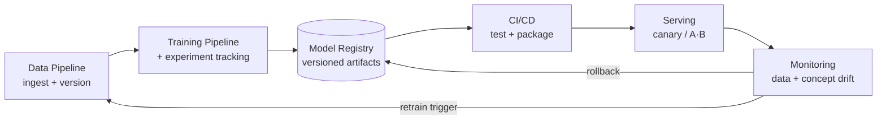
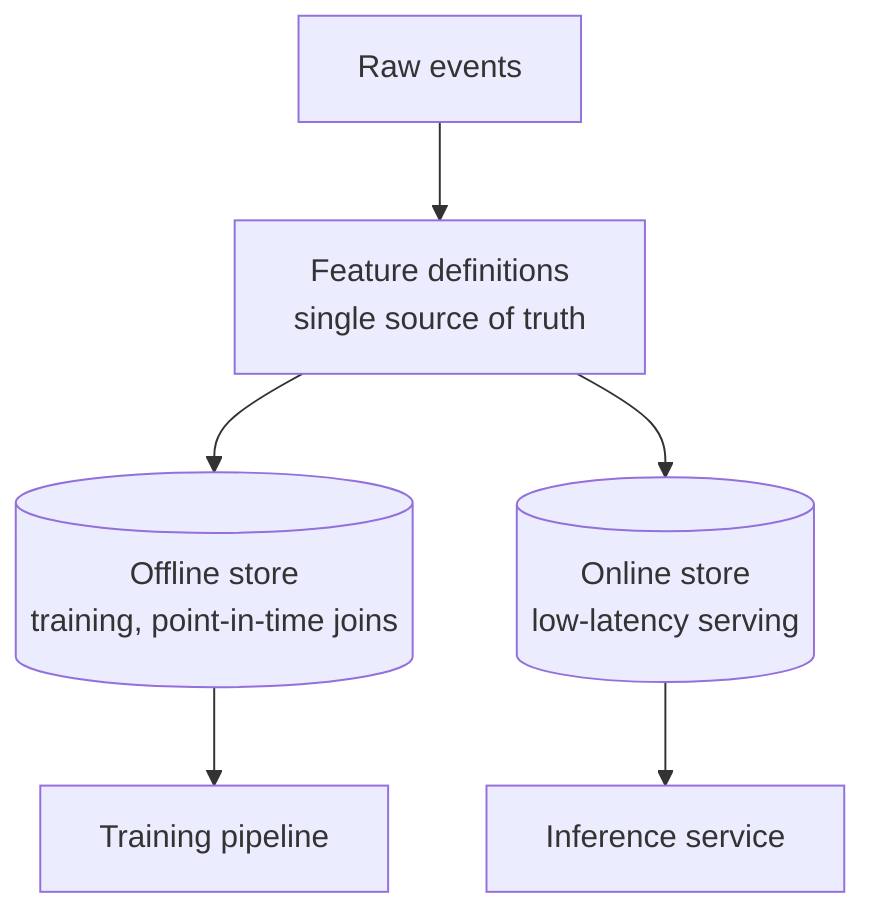
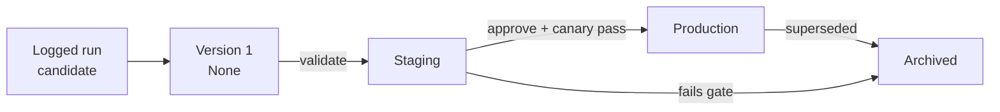
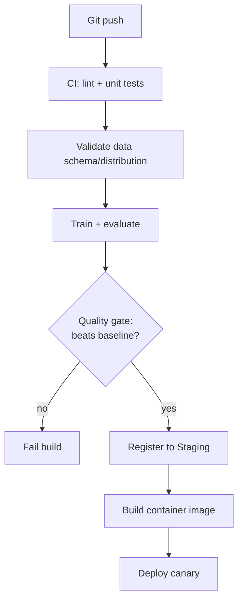
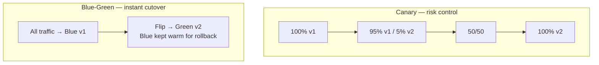
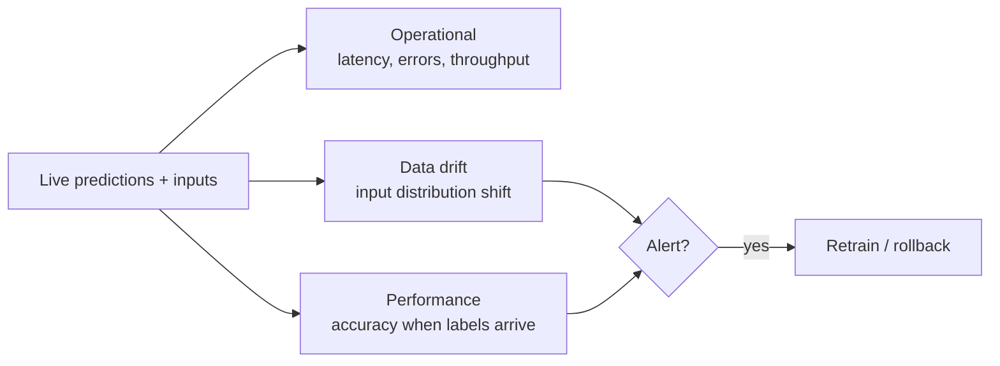

<div class="hero-section" style="background: linear-gradient(135deg, #667eea 0%, #764ba2 100%); color: white; padding: 3rem 2rem; margin: -2rem -3rem 2rem -3rem; text-align: center;">
  <h1 style="color: white; margin: 0; font-size: 2.5rem;">MLOps &amp; Production</h1>
  <p style="font-size: 1.25rem; margin-top: 1rem; opacity: 0.9;">Taking models from a notebook to a reliable, observable, continuously-improving production service.</p>
</div>

[AI/ML Documentation](./) &raquo; MLOps &amp; Production

<div class="code-example" markdown="1">
Training a model is the easy 10%. The other 90% is shipping it: reproducible data and training pipelines, tracked experiments, versioned models in a registry, automated deployment, traffic-shifting rollouts, drift monitoring, and the triggers that retrain or roll back when reality moves.
</div>

<div class="intro-card" markdown="1">
<p class="lead-text">MLOps is DevOps for machine learning — but with an extra moving part. A traditional service depends only on code; an ML service depends on <strong>code + data + model artifacts</strong>, and all three drift over time. The discipline below is about making that three-way dependency reproducible, automated, and observable so that a model in production keeps doing what it was trained to do.</p>
</div>

<div class="key-insights">
  <div class="insight-card">
    <i class="fas fa-stream"></i>
    <h4>Reproducible Pipelines</h4>
    <p>Version data and code together so any model can be rebuilt bit-for-bit from a commit hash.</p>
  </div>
  <div class="insight-card">
    <i class="fas fa-box-archive"></i>
    <h4>Track &amp; Register</h4>
    <p>Log every experiment, then promote the winning artifact through a model registry with stages and approvals.</p>
  </div>
  <div class="insight-card">
    <i class="fas fa-wave-square"></i>
    <h4>Deploy &amp; Watch</h4>
    <p>Canary and A/B rollouts, drift monitoring, automated retraining triggers, and one-click rollback.</p>
  </div>
</div>

> **Read this as a loop, not a line.** Data feeds training, training produces a registered model, the model is deployed and served, serving emits telemetry, telemetry detects drift, drift triggers retraining — and the loop closes. Each section below is one arc of that circle.

## The ML Lifecycle

A production ML system is a closed loop. Unlike a one-shot script, every stage produces artifacts and signals that feed the next, and the whole thing runs continuously:



Two feedback edges make this *operations* rather than a script: the **retrain trigger** (monitoring decides the live model is stale and kicks off a new run) and the **rollback** (a bad deploy is reverted to a known-good registry version). Everything else is plumbing that makes those two decisions safe and automatic.

### Why ML Ops differs from DevOps

| Concern | Traditional software | Machine learning |
|---------|----------------------|------------------|
| Versioned inputs | Code | Code **and** data **and** hyperparameters |
| "Correct" output | Deterministic, testable | Statistical — judged by metrics on a held-out set |
| Failure mode | Crash / exception | Silent degradation as the world drifts |
| Reproducibility | `git checkout` + build | Same code can give different models without pinned data + seeds |
| Tests | Unit / integration | Plus data validation, model quality gates, bias checks |

The headline difference is **silent failure**: a model rarely throws an exception when it gets worse. Accuracy just quietly decays as the input distribution shifts away from the training distribution. Monitoring, not exceptions, is how you find out.

## Data &amp; Training Pipelines

Reproducibility starts with the data. If you cannot say exactly *which rows* trained a given model, you cannot debug it, audit it, or rebuild it. The goal is that a single commit hash pins code, data, and configuration together.

### Data versioning with DVC

[DVC (Data Version Control)](https://dvc.org/) layers data versioning onto Git. Large files live in remote storage (S3, GCS, Azure, SSH); Git tracks only small `.dvc` pointer files containing the content hash. A `git checkout` of an old commit plus `dvc checkout` restores the exact dataset that commit used.

```bash
# Track a dataset — DVC moves it to the cache and writes data/raw.csv.dvc
dvc add data/raw.csv
git add data/raw.csv.dvc data/.gitignore
git commit -m "Add raw training data v1"

# Push the actual bytes to remote storage (Git stays small)
dvc remote add -d storage s3://my-bucket/dvc-store
dvc push
```

DVC also models the pipeline itself as a DAG in `dvc.yaml`, so stages re-run only when their dependencies change (content-addressed caching):

```yaml
# dvc.yaml — a reproducible, cached pipeline
stages:
  prepare:
    cmd: python src/prepare.py data/raw.csv data/clean.csv
    deps: [src/prepare.py, data/raw.csv]
    outs: [data/clean.csv]
  train:
    cmd: python src/train.py data/clean.csv model.pkl
    deps: [src/train.py, data/clean.csv]
    params: [train.lr, train.epochs]   # tracked from params.yaml
    outs: [model.pkl]
    metrics: [metrics.json]
```

`dvc repro` walks this DAG, skips stages whose inputs are unchanged, and reproduces only what's stale. `dvc exp run` sweeps parameters without committing each trial. The payoff: **`git checkout <hash> && dvc repro` rebuilds any historical model exactly.**

### Feature stores

For tabular and recommendation systems, a **feature store** (Feast, Tecton, Databricks) solves the *train/serve skew* problem: the feature `avg_purchase_7d` must be computed the same way during offline training and online inference. The store provides a single definition with two read paths — a batch path for training and a low-latency online path for serving — guaranteeing the two agree.



**Point-in-time correctness** is the subtle requirement: when building a training row for an event at time *t*, you must use only feature values known *before* *t*. Leaking future information ("label leakage") inflates offline metrics and collapses in production.

### Data validation

Before data ever reaches training, validate its *schema* and *distribution*. Tools like [Great Expectations](https://greatexpectations.io/), TensorFlow Data Validation, and Pandera assert invariants and fail the pipeline loudly rather than training on garbage:

```python
import pandera as pa
from pandera import Column, Check

schema = pa.DataFrameSchema({
    "age":      Column(int,   Check.in_range(0, 120)),
    "income":   Column(float, Check.ge(0), nullable=False),
    "country":  Column(str,   Check.isin(["US", "UK", "DE", "JP"])),
    "label":    Column(int,   Check.isin([0, 1])),
})

# Raises SchemaError on out-of-range values, nulls, or unexpected categories
validated = schema.validate(df, lazy=True)
```

These same distributional expectations become the **baseline** that production monitoring later compares against to detect data drift.

## Experiment Tracking

A single training run has dozens of knobs — learning rate, architecture, data version, seed — and you may run hundreds of them. Experiment tracking records the *inputs, code, and outputs* of every run so results are comparable and reproducible instead of scattered across notebook cells and filenames like `model_final_v2_REAL.pkl`.

### What to log

| Category | Examples |
|----------|----------|
| Parameters | learning rate, batch size, optimizer, architecture |
| Code / data version | Git SHA, DVC data hash, dataset name |
| Metrics | loss curves, accuracy, F1, AUC per epoch |
| Artifacts | model weights, plots, confusion matrix, sample predictions |
| Environment | library versions, hardware, container image digest |

### MLflow and Weights &amp; Biases

[MLflow](https://mlflow.org/) (open-source, self-hostable) and [Weights &amp; Biases](https://wandb.ai/) (W&amp;B; hosted, rich dashboards) are the two dominant trackers. Both share the same shape: open a run, log params/metrics/artifacts, close the run.

```python
import mlflow

mlflow.set_experiment("churn-classifier")

with mlflow.start_run(run_name="xgb-depth8"):
    mlflow.log_params({"max_depth": 8, "lr": 0.1, "n_estimators": 400})
    mlflow.set_tag("data_version", dvc_hash)   # tie run to exact dataset

    model = train(X_train, y_train)

    for epoch, loss in history:
        mlflow.log_metric("val_loss", loss, step=epoch)

    mlflow.log_metric("test_auc", auc)
    mlflow.sklearn.log_model(model, "model")   # artifact + signature
```

The W&amp;B equivalent uses `wandb.init() / wandb.log()` and adds sweep orchestration for hyperparameter search:

```python
import wandb
wandb.init(project="churn", config={"max_depth": 8, "lr": 0.1})
wandb.log({"val_loss": loss, "epoch": epoch})
wandb.log({"test_auc": auc})
```

The decisive practice is **tagging each run with its code SHA and data hash**. That single discipline is what turns "I think this was the good model" into "this model = commit `a1b2c3` + data `f9e8d7`, rebuildable on demand."

### Comparing runs

Trackers shine in their comparison UIs: parallel-coordinate plots reveal which hyperparameters drive a metric, and overlaid loss curves expose overfitting at a glance. The model with the best validation metric becomes a candidate for the registry — the bridge from experimentation to production.

## Model Registry &amp; Versioning

The registry is the **system of record** for models. Experiment tracking answers "what did I try?"; the registry answers "what is approved to run, and where?" It holds named, versioned model artifacts and moves them through promotion stages with metadata, lineage, and approvals.



### Stages and promotion

A model version moves through stages, each gated by a check:

| Stage | Meaning | Gate to enter |
|-------|---------|---------------|
| **None / Candidate** | Freshly logged from a run | — |
| **Staging** | Passing automated quality gates | Metrics beat baseline; data validation passes |
| **Production** | Serving live traffic | Staging canary healthy; human approval (if required) |
| **Archived** | Retired / rolled back from | Superseded or failed |

```python
from mlflow.tracking import MlflowClient
client = MlflowClient()

# Register the artifact from a tracked run, then promote it
mv = mlflow.register_model(f"runs:/{run_id}/model", "churn-classifier")
client.transition_model_version_stage(
    name="churn-classifier",
    version=mv.version,
    stage="Staging",
)
```

### Semantic versioning for models

Borrow `MAJOR.MINOR.PATCH` semantics, but interpret them for ML:

- **MAJOR** — breaking change to the input/output contract (new features, changed schema). Consumers must update.
- **MINOR** — retrained on new data or a better architecture; same contract.
- **PATCH** — bug fix, repackaging, no behavioral change.

Crucially, a model version must record its **lineage**: the exact training code SHA, data hash, hyperparameters, and metrics. Without lineage the registry is just a file server; with it, every production model is auditable and reproducible.

## CI/CD for Models

Continuous integration and delivery for ML extends the familiar code pipeline with **data and model** stages. The pipeline doesn't just check that code compiles — it checks that the *resulting model is good enough* before letting it near production.



### Continuous Training (CT)

The ML-specific third "C" is **Continuous Training**: the pipeline can retrain automatically when triggered by a schedule, a data change (new DVC version), or a drift alert from monitoring. This is what lets the lifecycle loop close without a human in the loop.

### Quality gates and tests

CI for ML runs several test classes beyond unit tests:

| Test type | Question it answers |
|-----------|---------------------|
| Unit | Does the feature-engineering code behave? |
| Data validation | Does incoming data match the expected schema/distribution? |
| Model quality gate | Does the new model beat the current production model (or a fixed baseline) on held-out data? |
| Behavioral / slice | Does it perform acceptably on key sub-populations (fairness, edge cases)? |
| Integration | Does the packaged service load the model and return valid responses? |

```python
# A quality gate that fails the build unless the candidate improves on prod
def quality_gate(candidate_auc, prod_auc, min_delta=0.005):
    assert candidate_auc >= prod_auc + min_delta, (
        f"Candidate AUC {candidate_auc:.4f} does not beat "
        f"production {prod_auc:.4f} by {min_delta}"
    )
```

### Packaging for deployment

Once a model passes its gates, it's packaged as a deployable artifact — typically a container image with the model weights, inference code, and a pinned environment. Tools like [BentoML](https://www.bentoml.com/) standardize this packaging into a versioned "Bento" with an HTTP/gRPC API:

```python
import bentoml
from bentoml.io import JSON

runner = bentoml.sklearn.get("churn-classifier:latest").to_runner()
svc = bentoml.Service("churn", runners=[runner])

@svc.api(input=JSON(), output=JSON())
async def predict(features: dict) -> dict:
    proba = await runner.predict_proba.async_run([list(features.values())])
    return {"churn_probability": float(proba[0][1])}
```

`bentoml build` then produces a reproducible image that the deployment stage ships.

## Serving &amp; Deployment

Serving turns a model artifact into a low-latency API. Two patterns dominate:

| Pattern | Latency | Use case |
|---------|---------|----------|
| **Online (real-time)** | ms | Per-request predictions (fraud, recommendations) |
| **Batch (offline)** | minutes–hours | Scoring large datasets on a schedule |

For online serving on Kubernetes, [KServe](https://kserve.github.io/website/) (formerly KFServing) and [Seldon Core](https://www.seldon.io/) provide a standard inference protocol, autoscaling (including **scale-to-zero**), and built-in support for canary traffic splitting. A KServe `InferenceService` is declarative:

```yaml
apiVersion: serving.kserve.io/v1beta1
kind: InferenceService
metadata:
  name: churn-classifier
spec:
  predictor:
    model:
      modelFormat: { name: sklearn }
      storageUri: s3://models/churn/v3      # production version
    minReplicas: 1                          # 0 for scale-to-zero
  # canary: 10% of traffic to the new revision
  # KServe shifts traffic automatically as the canary proves healthy
```

KServe's **canaryTrafficPercent** lets a new revision receive a small slice of live traffic; if its metrics stay healthy the percentage ramps to 100%, otherwise it's rolled back — connecting serving directly to the rollout strategies below.

## A/B Testing &amp; Canary Releases

Offline metrics predict, but only live traffic *proves*. Progressive delivery shifts real users onto a new model gradually so a regression is caught while its blast radius is tiny.

### Canary vs. blue-green vs. A/B



| Strategy | Goal | How |
|----------|------|-----|
| **Canary** | Limit blast radius | Route a small %, watch metrics, ramp up or abort |
| **Blue-green** | Zero-downtime swap | Run v2 alongside v1, flip all traffic at once, keep v1 warm |
| **Shadow / dark** | Risk-free comparison | Send v2 a copy of traffic, discard its output, compare offline |
| **A/B test** | Measure *business* impact | Split users by hash, compare a KPI with statistical rigor |

The distinction worth internalizing: **a canary asks "is the new model healthy?" (an operational question), while an A/B test asks "is the new model better?" (a statistical question).** A canary watches error rate and latency; an A/B test watches conversion or revenue and waits for significance.

### Designing an A/B test

A sound A/B test treats the model as a treatment in an experiment:

1. **Pick one primary metric** (e.g., click-through rate) and define a minimum detectable effect.
2. **Compute sample size** up front from the baseline rate, MDE, power (usually 0.8), and significance level (usually α = 0.05).
3. **Randomize by stable user ID hash** so a user always sees the same variant (no flicker).
4. **Run for full business cycles** (whole weeks) to absorb day-of-week seasonality.
5. **Test significance** before declaring a winner — don't peek-and-stop, which inflates false positives.

For two conversion rates the standard two-proportion z-test uses:

$$z = \frac{\hat{p}_B - \hat{p}_A}{\sqrt{\hat{p}(1 - \hat{p})\left(\frac{1}{n_A} + \frac{1}{n_B}\right)}}$$

where $\hat{p}_A$ and $\hat{p}_B$ are the observed conversion rates of control and treatment, $\hat{p}$ is the pooled rate, and $n_A, n_B$ are the sample sizes. A result is significant at the 5% level when $|z| > 1.96$.

```python
def canary_decision(canary, baseline, max_error_delta=0.01):
    """Operational gate: abort the canary on any health regression."""
    if canary["error_rate"] > baseline["error_rate"] + max_error_delta:
        return "ROLLBACK"
    if canary["p99_latency_ms"] > baseline["p99_latency_ms"] * 1.2:
        return "ROLLBACK"
    return "PROMOTE"
```

## Monitoring: Data &amp; Concept Drift

A deployed model degrades silently. Monitoring is the smoke detector. There are two layers: **operational** (is the service up?) and **model** (is the service still *right*?).



### The three things that change

A model's predictions can go wrong because the world moved in one of three ways:

| Phenomenon | Formal change | Plain English |
|------------|---------------|---------------|
| **Data drift (covariate shift)** | $P(X)$ changes, $P(Y \mid X)$ stable | Inputs look different (new user demographics) |
| **Concept drift** | $P(Y \mid X)$ changes | The *rule* changed (fraud tactics evolve) |
| **Label drift / prior shift** | $P(Y)$ changes | Class balance shifts (more fraud overall) |

The painful one is **concept drift**: the same input now warrants a different answer, so the model is confidently wrong and no amount of input-distribution monitoring catches it directly. You need actual labels (which often arrive with delay) to see it.

### Detecting data drift

Data drift is detectable *immediately* from inputs alone, no labels required — compare the live feature distribution against the training baseline. Common detectors:

- **Population Stability Index (PSI)** — bins a feature and compares proportions; >0.25 signals major shift.
- **Kolmogorov–Smirnov test** — for continuous features, tests whether two samples share a distribution.
- **Kullback–Leibler / Jensen–Shannon divergence** — distance between probability distributions.

PSI across bins of a feature is:

$$\text{PSI} = \sum_{i=1}^{B} (a_i - e_i)\,\ln\!\left(\frac{a_i}{e_i}\right)$$

where $e_i$ is the expected (training-baseline) proportion in bin $i$ and $a_i$ is the actual (live) proportion. Conventional thresholds: < 0.1 stable, 0.1–0.25 moderate shift, > 0.25 significant shift warranting investigation.

```python
import numpy as np

def psi(expected, actual, bins=10):
    breakpoints = np.percentile(expected, np.linspace(0, 100, bins + 1))
    breakpoints[0], breakpoints[-1] = -np.inf, np.inf
    e = np.histogram(expected, breakpoints)[0] / len(expected)
    a = np.histogram(actual,   breakpoints)[0] / len(actual)
    e, a = np.clip(e, 1e-6, None), np.clip(a, 1e-6, None)   # avoid log(0)
    return float(np.sum((a - e) * np.log(a / e)))

score = psi(train_feature, live_feature)
if score > 0.25:
    alert("Significant data drift", feature="income", psi=score)
```

Tools like [Evidently](https://www.evidentlyai.com/), [NannyML](https://www.nannyml.com/), and [WhyLogs](https://whylabs.ai/) package these tests, baselines, and dashboards so you don't hand-roll every detector.

### Detecting concept drift

Concept drift needs ground truth. When labels are available (even delayed), monitor the live metric directly — a sustained drop in rolling AUC/accuracy is the signal. When labels are *delayed*, **proxy signals** help: a rising share of low-confidence predictions, or NannyML-style performance *estimation* that infers likely accuracy from the input distribution and the model's confidence without labels.

## Retraining Triggers &amp; Rollback

Monitoring is only useful if it *acts*. The two actions that close the loop are retraining (the model is stale — make a new one) and rollback (the live model is broken — revert it).

### When to retrain

Retraining strategies, cheapest to most reactive:

| Trigger | Mechanism | Best when |
|---------|-----------|-----------|
| **Scheduled** | Cron (nightly/weekly) | Steady, predictable drift |
| **Volume-based** | After *N* new labeled rows | Data arrives in bursts |
| **Drift-triggered** | PSI / metric threshold crossed | Drift is irregular |
| **Performance-triggered** | Live metric drops below SLA | You have timely labels |

Drift- and performance-triggered retraining are the most efficient — you retrain *because the model needs it*, not on a calendar. The trigger fires the **Continuous Training** pipeline from the CI/CD section, which retrains, runs the quality gate, and registers a new candidate.

```python
def should_retrain(monitor):
    if monitor["psi_max"] > 0.25:
        return True, "data drift (PSI > 0.25)"
    if monitor["rolling_auc"] < monitor["baseline_auc"] - 0.03:
        return True, "performance below SLA"
    if monitor["days_since_train"] > 30:
        return True, "scheduled refresh"
    return False, "healthy"
```

A subtle but critical rule: a retrained model is a **candidate, not an automatic replacement.** It still passes through the quality gate and a canary. Blindly auto-promoting on drift can make things *worse* if the new data is itself corrupted — which is exactly when drift alerts fire.

### Rollback

Because the registry keeps every version and serving is versioned, rollback is a stage transition plus a traffic switch — fast and reliable:

```python
# Roll production back to the last known-good version
client.transition_model_version_stage(
    name="churn-classifier", version=last_good, stage="Production")
client.transition_model_version_stage(
    name="churn-classifier", version=bad_version, stage="Archived")
# Serving layer (KServe/BentoML) re-pulls the Production version's storageUri
```

The reason canary, registry, and monitoring are worth the effort is precisely this: when something goes wrong at 3 a.m., rollback is a single, tested, reversible operation rather than a frantic re-deploy.

## Tooling Landscape

The ecosystem is modular — pick one tool per concern. A common open-source stack:

| Concern | Tools |
|---------|-------|
| Data &amp; pipeline versioning | DVC, LakeFS, Pachyderm |
| Feature store | Feast, Tecton, Databricks |
| Experiment tracking | MLflow, Weights &amp; Biases, Neptune |
| Model registry | MLflow Registry, W&amp;B Registry, SageMaker |
| Orchestration | Airflow, Kubeflow Pipelines, Dagster, Prefect |
| Packaging | BentoML, Docker |
| Serving | KServe, Seldon Core, BentoML, TorchServe, Triton |
| Monitoring | Evidently, NannyML, WhyLabs, Arize, Prometheus + Grafana |

There is no single "MLOps platform" you must adopt; the value is in *connecting* these so the lifecycle loop runs end to end. Managed suites (SageMaker, Vertex AI, Azure ML, Databricks) bundle most of the columns above if you prefer one vendor.

## Key Takeaways

<div class="takeaway-card" markdown="1">
- **ML depends on code + data + model — version all three.** DVC pins data to a commit; experiment tracking tags runs with code SHA and data hash so any model is rebuildable.
- **The lifecycle is a closed loop, not a pipeline.** Monitoring feeds two edges back: retraining (model is stale) and rollback (model is broken).
- **The registry is the system of record.** Versioned artifacts move through staging gates with lineage; promotion is gated by quality checks and canaries.
- **CI/CD for ML adds Continuous Training and quality gates** — a build fails unless the new model beats the current one on held-out data.
- **A canary asks "is it healthy?"; an A/B test asks "is it better?"** Use progressive delivery to shrink blast radius and statistics to prove impact.
- **Models fail silently — monitor for drift.** Data drift (PSI/KS on inputs) is detectable immediately; concept drift needs labels or estimation. Drift triggers retraining; rollback reverts a bad deploy in one reversible step.
</div>

---

<div class="see-also-card" markdown="1">
#### See Also

- [LoRA Training](lora-training.html) - Training custom models that feed the pipelines above
- [ComfyUI Guide](comfyui-guide.html) - Node-based generation workflows and API automation
- [Base Models Comparison](base-models-comparison.html) - Choosing the foundation a production model builds on
- [Game AI Systems](game-ai.html) - Real-time inference under hard latency budgets
- [AI/ML Documentation Hub](./) - Complete AI/ML documentation index
</div>
